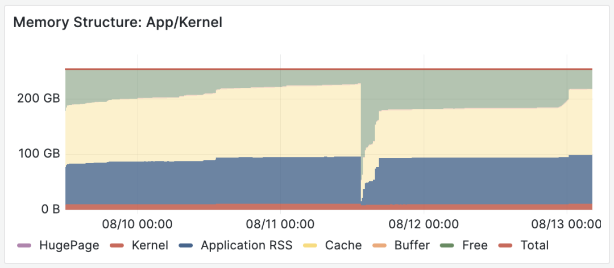
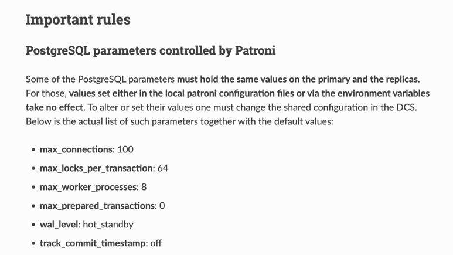
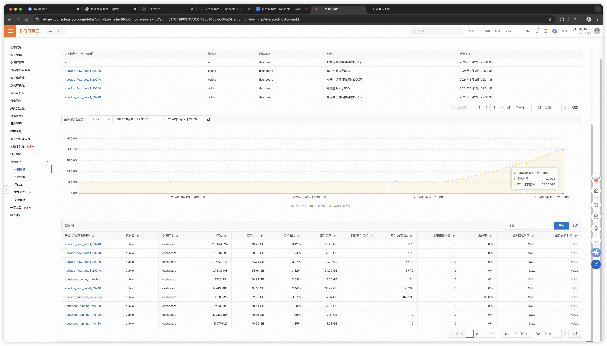
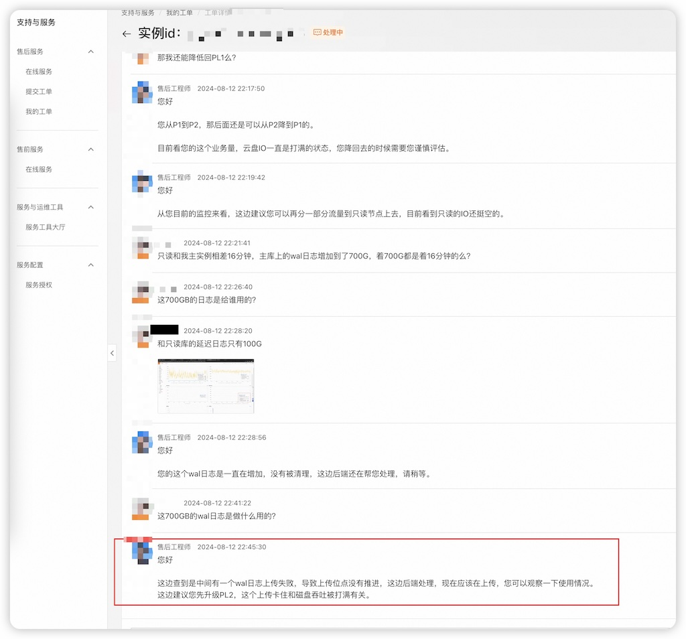
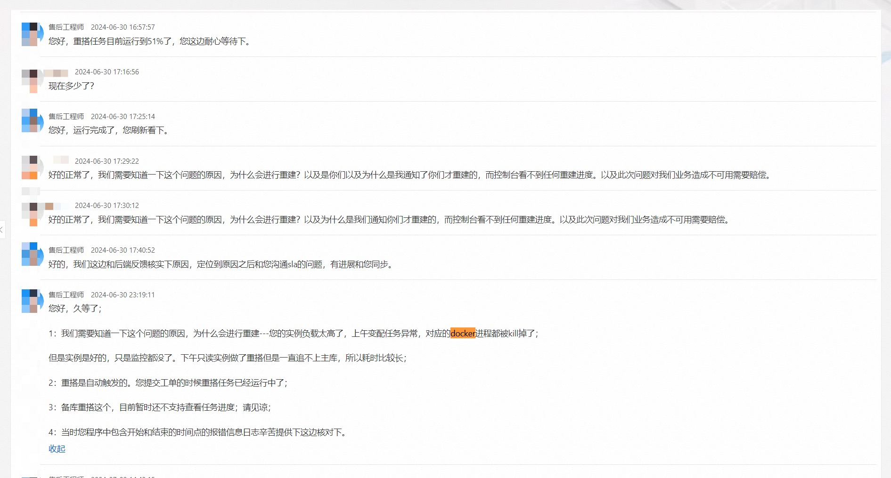
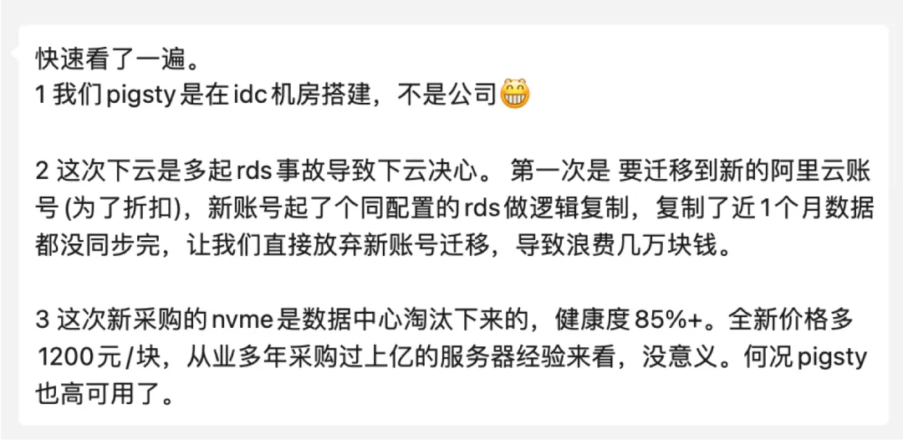
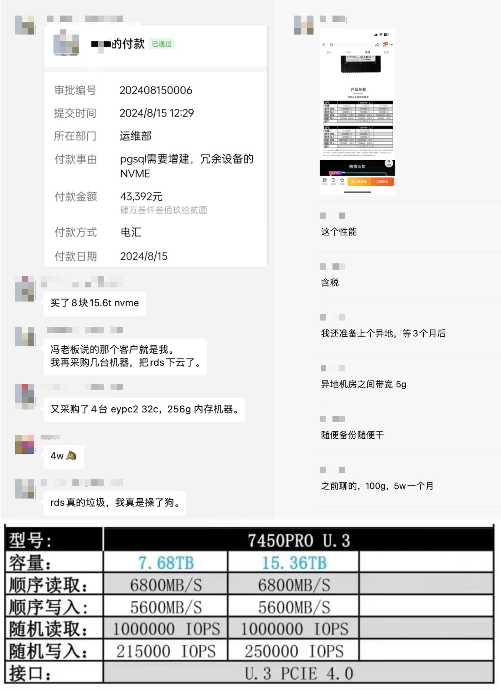
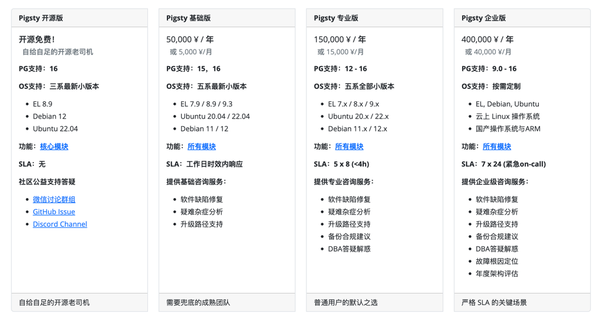

在《[云数据库是不是智商税](/cloud/rds)》中，我对云数据库 RDS 的评价是：“**用五星酒店价格卖给用户天价预制菜**”—— 但正规的预制菜大锅饭也是能吃的 也一般吃不死人，不过最近一次发生在阿里云上的的故障让我改变了看法。

我有一位客户L，这两天跟我吐槽了一个在云数据库上遇到的离谱连环故障：一套高可用 PG RDS 集群，因为扩容个内存，主库从库都挂了，给他们折腾到凌晨。期间建议昏招迭出，给出的复盘也相当敷衍。经过客户L同意后，我将这个案例分享出来，也供大家借鉴参考品评。

- [事故经过：匪夷所思](#事故经过匪夷所思)
- [内存扩容：无事生非](#内存扩容无事生非)
- [从库宕机：素养堪忧](#从库宕机素养堪忧)
- [主库宕机：令人窒息](#主库宕机令人窒息)
- [WAL堆积：专家缺位](#wal堆积专家缺位)
- [扩容磁盘：创收有术](#扩容磁盘创收有术)
- [协议赔偿：封口药丸](#协议赔偿封口药丸)
- [解决方案：下云自建](#解决方案下云自建)
- [广告时间：专家咨询](#广告时间专家咨询)

---------------

## 事故经过：匪夷所思

客户L的数据库场景比较扎实，大几TB的数据，TPS两万不到，写入吞吐8000行/每秒，读取吞吐7万行/s。用的是 ESSD PL1 ，16c 32g 的实例，一主一备高可用版本，独享型规格族，年消费六位数。

整个事故经过大致如下：客户L收到 **内存告警**，提工单，接待的售后工程师诊断：数据量太大，大量行扫描导致内存不足，建议扩容内存。客户同意了，然后工程师扩容内存，扩内存花了三个小时，**期间主库和从库挂了**，吭哧吭哧手工一顿修。

然后扩容完了之后又遇到 **WAL日志堆积** 的问题，堆了 800 GB 的WAL日志要把磁盘打满了，又折腾了两个小时到十一点多。售后说是 WAL 日志归档上传失败导致的堆积，失败是因为磁盘IO吞吐被占满，建议扩容 ESSD PL2。

吃过了内存扩容翻车的教训，这次扩容磁盘的建议客户没立即买单，而是找我咨询了下，我看了一下这个故障现场，感觉到匪夷所思：

1. 你这负载也挺稳定的，没事扩容内存干啥？
2. RDS 不是号称弹性秒级扩容么，怎么升个内存花三个小时？
3. 花三个小时就算了，扩个容怎么还把主库从库都搞挂了呢？
4. 从库挂了据说是参数没配对，那就算了，那主库是怎么挂了的？
5. 主库挂了高可用切换生效了吗？怎么 WAL 又怎么开始堆积了？
6. WAL 堆积是有地方卡住了，建议你升级云盘等级/IOPS有什么用？

事后也有一些来自乙方的解释，听到后我感觉更加匪夷所思了：

- 从库挂是因为参数配错拉不起来了
- 主库挂是因为 “为了避免数据损坏做了特殊处理”
- WAL堆积是因为卡BUG了，还是客户侧发现，推断并推动解决的
- 卡 BUG “据称” 是因为云盘吞吐打满了

我的朋友瑞典马工一贯主张，“[用云数据库可以替代DBA](https://mp.weixin.qq.com/s/PqCD80H927s0yJrBr4QQqw)”。
我认为在理论上有一定可行性 —— 由云厂商组建一个专家池，提供[DBA时分共享服务](/cloud/dba-vs-rds)。

但现状很可能是：**云厂商没有合格的 DBA，不专业的工程师甚至会给你出馊主意，把跑得好好的数据库搞坏，最后赖到资源不足上，再建议你扩容升配好多赚一笔。**

在听闻这个案例之后，马工也只能无奈强辩：“**辣鸡RDS不是真RDS**”。

--------

## 内存扩容：无事生非

**资源不足是一种常见的故障原因，但也正因如此，有时会被滥用作为推卸责任，甩锅，或者要资源，卖硬件的万金油理由。**

内存告警 OOM 也许对其他数据库是一个问题，但对于 PostgreSQL 来说非常离谱。我从业这么多年来，见识过各种各样的故障：数据量大撑爆磁盘我见过，查询多打满CPU我见过，内存比特位反转腐坏数据我见过，但因为独占PG因为读查询多导致内存告警，我没见过。

PostgreSQL 使用双缓冲，OLTP实例在使用内存时，页面都放在一个尺寸固定的 SharedBuffer 中。作为一个 **众所周知的最佳实践**，PG SharedBuffer 配置通常为物理内存的 1/4 左右，剩下的内存由文件系统 Cache 使用。也就是说通常有六七成的内存是由操作系统来灵活调配的，不够用逐出一些 Cache 就好了。如果说因为读查询多导致内存告警，我个人认为是匪夷所思的。

所以，因为一个本来不一定是问题的问题（假告警？），RDS 售后工程师给出的建议是：*内存不够啦，请扩容内存*。客户相信了这个建议，选择将内存翻倍。

按道理，云数据库宣传自己的极致弹性，灵活伸缩，还是用 [Docker](/db/pg-in-docker/) 管理的。难道不应该是原地改一下 MemLimit 和 PG SharedBuffer 参数，重启一下就生效的吗？几秒还差不多。结果这次扩容却折腾了三个小时才完成，并引发了一系列次生故障。

内存不足，两台32G扩64G，按照《[剖析阿里云服务器算力成本](/cloud/ecs/#实例族对价格的影响)》我们精算过的定价模型，一项内存扩容操作每年带来的额外收入就能有万把块。如果能解决问题那还好说，但事实上这次内存扩容不但没有解决问题，还引发了更大的问题。

--------

## 从库宕机：素养堪忧

第一个因为内存扩容而发生的次生故障是这样的，备库炸了，为什么炸了，因为PG参数没配置正确：`max_prepared_transaction`，这个参数为什么会炸？因为在一套 PG 集群中，这个参数必须在主库和从库上保持一致，否则从库就会拒绝启动。

为什么这里出现了主从参数不一致的问题？**我推测** 是因为 RDS 的设计中，该参数的值是与实例内存成正比设置的，所以内存扩容翻倍后这个参数也跟着翻倍。主从不一致，然后从库重启的时候就拉不起来了。

不管怎样，因为这个参数翻车是一个非常离谱的错误，属于 PG DBA 101 问题，PG文档明确强调了这一点。但凡做过滚动升降配这种基操的 DBA，要么已经在读文档的时候了解过这个问题，要么就在这里翻过车再去看文档。

如果你用 `pg_basebackup` 手搓从库，你不会遇到这个问题，因为从库的参数默认和主库一致。如果你用成熟的高可用组件，也不会遇到这个问题：开源PG高可用组件 Patroni 就会强制控制这几个参数并在文档中[显眼地告诉用户](https://patroni.readthedocs.io/en/latest/patroni_configuration.html#important-rules)：这几个参数主从必须一致，我们来管理不要瞎改。

在一种情况下你会遇到这种问题：考虑不周的家酿高可用服务组件，或未经充分测试的自动化脚本，**自以为是地替你“优化”了这个参数**。

--------

## 主库宕机：令人窒息

如果说从库挂了，影响一部分只读流量那也就算了。主库挂了，对于客户L这种全网实时数据上报的业务可就要血命了。关于主库宕机，工程师给出的说法是：在扩容过程中，因为事务繁忙，主从复制延迟一直追不上，“**为了避免数据损坏做了特殊处理**”。

这里的说法语焉不详，但按字面与上下文理解的意思应当为：扩容时需要做主从切换，但因为有不小的主从复制延迟，直接切换会丢掉一部分尚未复制到从库上的数据，所以RDS替你把主库流量水龙头关掉了，追平复制延迟后再进行主从切换。

老实说，我觉得这个操作让人窒息。主库 Fencing 确实是高可用中的核心问题，但一套正规的生产 PG 高可用集群在处理这个问题时，标准SOP是首先将集群临时切换到同步提交模式，然后执行 Switchover，自然一条数据也不会丢，切换也只会影响在这一刻瞬间执行的查询，亚秒级闪断。

“**为了避免数据损坏做了特殊处理**” 这句话确实很有艺术性 —— 没错，把主库直接关掉可以实现 Fencing ，也确实不会在高可用切换时因为复制延迟丢数据，**但客户数据写不进去了啊**！这丢的数据可比那点延迟多多了。这种操作，很难不让人想起那个著名的《[善治伛者](https://www.gushiwen.cn/shiwenv_ddbe67aad03d.aspx)》笑话：

--------

## WAL堆积：专家缺位

主从宕机的问题修复后，又折腾一个半小时，总算是把主库内存扩容完成了。然而一波未平一波又起，WAL日志又开始堆积起来，在几个小时内就堆积到了近 800 GB，如果不及时发现并处理，撑爆磁盘导致整库不可用是早晚的事。

> 也可以从监控上看到两个坑

RDS 工程师给出的诊断是，磁盘 IO 打满导致 WAL 堆积，建议升级磁盘，从 ESSD PL1 升级到 PL2。不过，这一次客户已经吃过一次内存扩容的教训了，没有立刻听信这一建议，而是找到了我咨询。

我看了情况后感觉非常离谱，负载没有显著变化，IO打满也不是这种卡死不动的情形。那么 WAL 堆积的原因不外乎那几个：复制延迟落后100多GB，复制槽保留了不到1GB，那剩下的大头就是 **WAL归档失败**。

我让客户给 RDS 提工单处理找根因，最后 RDS 侧确实找到问题是WAL归档卡住了并手工解决了，但距离 WAL 堆积已经过去近六个小时了，并在整个过程中体现出非常业余的素养，给出了许多离谱的建议。

> 另一个离谱建议：把流量打到复制延迟16分钟的从库上去

阿里云数据库团队并非没有 PostgreSQL DBA 专家，在阿里云任职的 德哥 Digoal 绝对是 PostgreSQL DBA 大师。然而看起来在 RDS 的产品设计中，并没有沉淀下多少 DBA 大师的领域知识与经验；而 RDS 售后工程师表现出来的专业素养，也与一个合格的 PG DBA ，哪怕是 GPT4 机器人都相差甚远。

我经常看到 RDS 的用户遇到了问题，通过官方工单没有得到解决，只能绕过工单，通过在 PG 社区中 [直接求助德哥解决](/cloud/drop-rds/) —— 而这确实是比较考验运气与关系的一件事。

--------

## 扩容磁盘：创收有术

在解决了“内存告警”， “从库宕机”， “主库宕机”， “WAL 堆积” 等连环问题后，已经接近凌晨了。但 WAL 堆积的根因是什么仍然不清楚，工程师的回复是 “**与磁盘吞吐被打满有关**”，再次建议升级 ESSD 云盘。

在事后的复盘中，工程师提到了 WAL归档失败的原因是 “**RDS上传组件BUG**”。所以回头看，如果客户真的听了建议升级云盘，也就就白花冤枉钱了。

在 《[云盘是不是杀猪盘](/cloud/ebs)》中我们分析过，云上溢价最狠的基础资源就是 ESSD 云盘。按照 《[阿里云存算成本剖析](/cloud/ecs#杀猪盘的价格)》中给出的数字：客户 5TB 的 ESSD PL1 云盘包月价格 **1 ¥/GB**，那么每年光是云盘费用就要 **12万**。

| 单位价格：¥/GiB月 | IOPS | 带宽       |    容量    |   按需价格   | 包月价格 | 包年价格 | 预付三年+ |
|:-----------:|:----:|----------|:--------:|:--------:|:----:|:----:|:-----:|
| ESSD 云盘 PL0 | 10K  | 180 MB/s | 40G-32T  |   0.76   | 0.50 | 0.43 | 0.25  |
| ESSD 云盘 PL1 | 50K  | 350 MB/s | 20G-32T  |   1.51   | 1.00 | 0.85 | 0.50  |
| ESSD 云盘 PL2 | 100K | 750 MB/s | 461G-32T |   3.02   | 2.00 | 1.70 | 1.00  |
| ESSD 云盘 PL3 |  1M  | 4 GB/s   | 1.2T-32T |   6.05   | 4.00 | 3.40 | 2.00  |
| 本地 NVMe SSD |  3M  | 7 GB/s   | 最大单卡64T  | **0.02** | 0.02 | 0.02 | 0.02  |

如果听从建议 “升级”到 ESSD PL2，没错 IOPS 吞吐能翻一倍，但单价也翻了一倍。单这一项“升级”操作，**就能给云厂商带来额外 12 万的收入**。

即使是 ESSD PL1 乞丐盘，也带有 50K 的 IOPS，而客户L场景的 20K TPS，80K RowPS 换算成 随机4K 页面 IOPS ，就算退一万步讲不考虑 PG 与 OS 的缓冲区（比如 99% 缓存命中率对于这种业务场景是很正常的），想硬打满它也是一件相当不容易的事情。

我不好判断遇到问题就建议 扩容内存 / 扩容磁盘 这样的做法，到底是出于专业素养不足导致的误诊，还是渴望利用信息不对称创收的邪念，抑或两者兼而有之 —— 但这种趁病要价的做法，确实让我联想起了曾经声名狼藉的莆田医院。

--------

## 协议赔偿：封口药丸

在《[云SLA是不是安慰剂](/cloud/sla)》一文中，我已提醒过用户：云服务的 SLA 根本不是对服务质量的承诺，**在最好的情况下它是提供情绪价值的安慰剂，而在最坏的情况下它是吃不了兜着走的哑巴亏**。

在这次故障中，客户L收到了 **1000** 元代金券的补偿提议，对于他们的规模来说，这三瓜两枣差不多能让这套 RDS 多跑几天。在用户看来这基本上属于赤裸裸的羞辱了。

有人说云提供了“**背锅**”的价值，但那只对不负责的决策者与大头兵才有意义，对于直接背结果的 CXO 来说，整体性的得失才是最重要的，把业务连续性中断的锅甩给云厂商，换来一千块代金券没有任何意义。

当然像这样的事情其实不止一次，两个月前客户L还遇到过另一次离谱的从库宕机故障 —— 从库宕机了，然后控制台上监控根本看不到，客户自己发现了这个问题，提了工单，发起申诉，还是 **1000¥** SLA 安慰补偿。

当然这还是因为客户L的技术团队水平在线，有能力自主发现问题并主动发出声索。如果是那种技术能力接近零的小白用户，也许就这么拖着瞒着 [糊弄过去了](https://mp.weixin.qq.com/s/mgkOybNeEH3LO0gRa1rQBQ)。

还有那种 “SLA” 根本不管的问题 —— 例如也是客户L再之前的一个案例（原话引用）：“*为了折扣要迁移到另一个新的阿里云账号，新账号起了个同配置的 RDS 逻辑复制，复制了近1个月数据都没同步完，让我们直接放弃新账号迁移，导致浪费几万块钱。*” —— 属实是花钱买罪受了，而且根本没地方说理去。

经过几次故障带来的糟心体验，客户L终于在这次事故后难以忍受，拍板决定下云了。

--------

## 解决方案：下云自建

客户L在几年前就有下云的计划了，在 IDC 里弄了几台服务器，用 Pigsty 自建搭建了几套 PostgreSQL 集群，作为云上的副本双写，跑得非常不错。但要把云上 RDS 下掉，还是免不了要折腾一下，所以一直也就这样两套并行跑着。包括此次事故之前的多次糟心体验，最终让客户L做了下云的决断。

客户L直接下单加购了四台新服务器，以及 8块 Gen4 15TB NVMe SSD。特别是这里的 NVMe 磁盘，IOPS 性能是云上 ESSD PL1 乞丐盘的整整 **20倍**（1M vs 50K），而 TB·月 单位价格则是云上的 **1/166**  （1000¥ vs 6¥）。

> 题外话：6块钱TB月价，我只在黑五打折的 Amazon 上看到过。125 TB 才 44K ¥（全新总共再加 9.6K ¥），，果然是术业有专攻，经手了过亿采购的成本控制大师。

如在《[下云奥德赛：是时候放弃云计算了吗](/cloud/odyssey#02-22-指导下云的五条价值观)》 中 DHH 所说的那样：

> “我们明智地花钱：在几个关键例子上，云的成本都极其高昂 —— 无论是**大型物理机数据库、大型 NVMe 存储，或者只是最新最快的算**力。租生产队的驴所花的钱是如此高昂，以至于几个月的租金就能与直接购买它的价格持平。在这种情况下，你应该直接直接把这头驴买下来！我们将把我们的钱，花在我们自己的硬件和我们自己的人身上，其他的一切都会被压缩。”

对客户L来说，下云带来的好处是立竿见影的：只需要 RDS 几个月费用的**一次性投资**，就足够超配几倍到十几倍的硬件资源，重新拿回[硬件发展的红利](/cloud/bonus)，[实现惊人的降本增效水平](/cloud/finops) —— **你不再需要对着账单抠抠搜搜，也不用再发愁什么资源不够**。这确实是一个值得思考的问题：如果云下资源单价变为十分之一甚至百分之几，那么云上鼓吹的弹性还剩多大意义？而阻止云上用户下云自建的原因又会是什么呢？

**下云自建 RDS 服务最大的挑战其实是人与技能**，客户L已经有着一个技术扎实的团队，但确实缺少在 PostgreSQL 上的专业知识与经验。这也是客户L之所以愿意为 RDS 支付高溢价的一个核心原因。但 RDS 在几次事故中体现出来的专业素养，甚至还不如客户本身的技术团队强，这就让继续留在云上变得毫无意义。

--------

## 广告时间：专家咨询

在下云这件事上， 我很高兴能为客户L提供帮助与支持。 [Pigsty](https://pigsty.cc/zh/) 是沉淀了我作为顶级 PG DBA 领域知识与经验的开源 RDS [自建工具](/cloud/dba-vs-rds#dba的工作与自动化管控)，已经帮助无数世界各地的用户自建了自己的企业级 PostgreSQL 数据库服务。尽管它已经将开箱即用，扩展整合，监控系统，备份恢复，安全合规，IaC 这些运维侧的问题解决的很好了。但想要充分发挥 PostgreSQL 与 Pigsty 的完整实力，总归还是需要专家的帮助来落地。

所以我提供了明码标价的 [**专家咨询服务**](/zh/docs/about/service) —— 对于客户L这样有着成熟技术团队，只是缺乏领域知识的客户，我只收取固定的 **5K ¥/月** 咨询费用，仅仅相当于半个初级运维的工资。但足以让客户放心使用比云上低一个数量级的硬件资源成本，自建更好的本地 PG RDS 服务 —— 而即使在云上继续运行 RDS，也不至于被“砖家”被嘎嘎割韭菜忽悠。

我认为**咨询**是一种站着挣钱的体面模式：我没有任何动机去推销内存与云盘，或者说胡话兜售自己的产品（因为产品是开源免费的！）。所以我完全可以站在甲方立场上，给出对甲方利益最优的建议。甲乙双方都不用去干苦哈哈的数据库运维，因为这些工作已经被 Pigsty 这个我编写的开源工具完全自动化掉了。我只需要在零星的关键时刻提供专家意见与决策支持，并不会消耗多少精力与时间，却能帮助甲方实现原本全职雇佣顶级DBA专家才能实现的效果，最终实现双方共赢。

但是我也必须强调，我提倡下云理念，从来都是针对那些**有一定数据规模与技术实力**的客户，比如这里的客户L。如果您的场景落在云计算舒适光谱中（例如用 1C2G 折扣 MySQL 跑 OA ），也缺乏技术扎实或值得信赖的工程师，我会诚实地建议你不要折腾 —— 99 一年的 RDS 总比你自己的 yum install 强不少，还要啥自行车呢？当然针对这种用例，我确实建议你考虑一下 Neon，Supabase，Cloudflare 这些[赛博菩萨们](/cloud/cloudflare)的免费套餐，**可能连一块钱都用不着**。

而对于那些有一定规模，绑死在云数据库上被不断抽血的客户，你确实可以考虑另外一个选项：自建数据库服务绝非什么高深的火箭科学 —— **你需要做的只是找到正确的工具与正确的人而已**。

--------

## 扩展阅读

[云盘是不是杀猪盘？](http://mp.weixin.qq.com/s?__biz=MzU5ODAyNTM5Ng==&mid=2247485745&idx=4&sn=93746ecea381afd8e2f9820447b09ec7&chksm=fe4b3ceac93cb5fc44f33ffff226747bc317854acbb3882aeb0d9a7e196eeb5df002d0e77275&scene=21#wechat_redirect)

### [**云数据库是不是智商税**](http://mp.weixin.qq.com/s?__biz=MzU5ODAyNTM5Ng==&mid=2247485745&idx=5&sn=a7d610ea37c3f3fa78ee4ba0ee705962&chksm=fe4b3ceac93cb5fc6f1975f94be04424e7b3690eedd1658951deb8d016f5f19ade8806d86417&scene=21#wechat_redirect)

[扒皮云对象存储：从降本到杀猪](http://mp.weixin.qq.com/s?__biz=MzU5ODAyNTM5Ng==&mid=2247486688&idx=1&sn=bbdee063b65994cb5e15d3e3b7d87523&chksm=fe4b393bc93cb02d76c48f0fbfe3d60c8821b8079b1cfc05f8ccc56c1351b4a7a76b5794019a&scene=21#wechat_redirect)

[**剖析云算力成本，阿里云真的降价了吗？**](http://mp.weixin.qq.com/s?__biz=MzU5ODAyNTM5Ng==&mid=2247487089&idx=1&sn=ca16c2e7e534380eadcb3a3870d8e3b4&chksm=fe4b3baac93cb2bc8c4b68c468acf3e8ac5ee124080a3e738262fe99dd1765c3adf9c56ea650&scene=21#wechat_redirect)

[**从降本增笑到真的降本增效**](http://mp.weixin.qq.com/s?__biz=MzU5ODAyNTM5Ng==&mid=2247486527&idx=1&sn=8e26f644f2b908fd21c83b81d329155d&chksm=fe4b39e4c93cb0f22271127a154a6ac5c45947b2051b06b7667ee5c203d136b5d2e8f6577b10&scene=21#wechat_redirect)

[我们能从阿里云史诗级故障中学到什么](http://mp.weixin.qq.com/s?__biz=MzU5ODAyNTM5Ng==&mid=2247486468&idx=1&sn=7fead2b49f12bc2a2a94aae942403c22&chksm=fe4b39dfc93cb0c92e5d4c67241de0519ae6a23ce6f07fe5411b95041accb69e5efb86a38150&scene=21#wechat_redirect)

[阿里云又挂了，这次是光缆被挖断了？](http://mp.weixin.qq.com/s?__biz=MzU5ODAyNTM5Ng==&mid=2247487926&idx=1&sn=2edbd59c845944dc9ba38021f42d1d63&chksm=fe4b246dc93cad7b35b7517b489371eaa08244ec561359e0a610bc9f6f2aa11cf1e3c2b34fb3&scene=21#wechat_redirect)

[互联网故障背后的草台班子们](https://mp.weixin.qq.com/s?__biz=MzU5ODAyNTM5Ng==&mid=2247486590&idx=1&sn=d4d85de483fafb867487f024631a3e6c&scene=21#wechat_redirect)

[阿里云周爆：云数据库管控又挂了](http://mp.weixin.qq.com/s?__biz=MzU5ODAyNTM5Ng==&mid=2247486512&idx=1&sn=43d6340fce93bfbf5439cc2cd8e3b8dd&chksm=fe4b39ebc93cb0fd192c69d9f589ccd36f1c1eb5d34fffc357cf0b8177c746c4b3445ea5f63a&scene=21#wechat_redirect)

[【阿里】云计算史诗级大翻车来了](http://mp.weixin.qq.com/s?__biz=MzU5ODAyNTM5Ng==&mid=2247486452&idx=1&sn=29cff4ee30b90483bd0a4f0963876f28&chksm=fe4b3e2fc93cb739af6ce49cffa4fa3d010781190d99d3052b4dbfa87d28c0386f44667e4908&scene=21#wechat_redirect)

[taobao.com证书过期](http://mp.weixin.qq.com/s?__biz=MzU5ODAyNTM5Ng==&mid=2247487367&idx=1&sn=d6e4abd2b2249d27bd8b8146b591b026&chksm=fe4b3a5cc93cb34a8e90e4b7f06803fa11ee8234014cd4f1aedff59e3bf3c846b3cb133090f2&scene=21#wechat_redirect)

[我们能从腾讯云故障复盘中学到什么？](http://mp.weixin.qq.com/s?__biz=MzU5ODAyNTM5Ng==&mid=2247487348&idx=1&sn=412cf2afcd93c3f0a83d65219c4a28e8&chksm=fe4b3aafc93cb3b900cef33bd0510c7c86367d71877b0ee65d4847da0ae1298e2b1fd88d0b3f&scene=21#wechat_redirect)

[【腾讯】云计算史诗级二翻车来了](http://mp.weixin.qq.com/s?__biz=MzU5ODAyNTM5Ng==&mid=2247487267&idx=1&sn=7d31d44e89560356b5c5a2e7a40bb1e1&chksm=fe4b3af8c93cb3ee9b8000cd90a12a798395f67205d4ba5b0c77b8c5b6ce9ea448d9fc014921&scene=21#wechat_redirect)

[云SLA是安慰剂还是厕纸合同？](http://mp.weixin.qq.com/s?__biz=MzU5ODAyNTM5Ng==&mid=2247487339&idx=1&sn=fce4c0d415d87026013169c737faeacb&chksm=fe4b3ab0c93cb3a61bd2831fcad6dfb36419540e690420b1229053b1de2e3d3533a66f44fb4c&scene=21#wechat_redirect)

[腾讯云：颜面尽失的草台班子](http://mp.weixin.qq.com/s?__biz=MzU5ODAyNTM5Ng==&mid=2247487279&idx=1&sn=95231614887e129f298644ddc194909f&chksm=fe4b3af4c93cb3e29078b4716d3b633246db8e2081acff8b821181c9ae058a0daf91e45a40b9&scene=21#wechat_redirect)

[垃圾腾讯云CDN：从入门到放弃](https://mp.weixin.qq.com/s?__biz=MzU5ODAyNTM5Ng==&mid=2247485363&idx=1&sn=8622b25fd2309d4fc969d22964a04129&scene=21#wechat_redirect)

[我们能从网易云音乐故障中学到什么？](http://mp.weixin.qq.com/s?__biz=MzU5ODAyNTM5Ng==&mid=2247488183&idx=1&sn=955849e8698fadcea9211b2731456222&chksm=fe4b276cc93cae7aeb43cc4128c9a18e7a5cb02721277cb61bba1e32b61a57ecdd18bd949277&scene=21#wechat_redirect)

[GitHub全站故障，又是数据库上翻的车？](http://mp.weixin.qq.com/s?__biz=MzU5ODAyNTM5Ng==&mid=2247488151&idx=1&sn=556731d65228f07f443cfb27b5e7bd8b&chksm=fe4b274cc93cae5ae1a32d423f2f7285eff3e184903d62182ad5f17c4772b4baf38b6a9c89c8&scene=21#wechat_redirect)

[全球Windows蓝屏：甲乙双方都是草台班子](http://mp.weixin.qq.com/s?__biz=MzU5ODAyNTM5Ng==&mid=2247488036&idx=1&sn=7bbcc3e8979a5f97a519a7a1684caa06&chksm=fe4b27ffc93caee9701d4a94830417e281c5c08e345d12b007ebaca84dc79c3224b880d75f4c&scene=21#wechat_redirect)

[删库：Google云爆破了大基金的整个云账户](http://mp.weixin.qq.com/s?__biz=MzU5ODAyNTM5Ng==&mid=2247487552&idx=1&sn=799ae77dda3b80d2296070826142adea&chksm=fe4b259bc93cac8da2cc20f864e5a8b62ecb6f5dd57e7435db1d3fb2f2864a5d991b3a016358&scene=21#wechat_redirect)

[云上黑暗森林：打爆AWS云账单，只需要S3桶名](http://mp.weixin.qq.com/s?__biz=MzU5ODAyNTM5Ng==&mid=2247487536&idx=1&sn=0cd598f426de0b617c7f3318aed9bd95&chksm=fe4b25ebc93cacfd2d96a9704a0ae4dc2d330aee7cd4579641df513edce307ccdd3a9f94736e&scene=21#wechat_redirect)

[Ahrefs不上云，省下四亿美元](http://mp.weixin.qq.com/s?__biz=MzU5ODAyNTM5Ng==&mid=2247487617&idx=1&sn=090b10e96e7e64c0ab0c5deb0cbb46ed&chksm=fe4b255ac93cac4cb270be6091ca6e1257afaa03d50c53316ce82a2be6150151f6077e07e9da&scene=21#wechat_redirect)

[赛博菩萨Cloudflare圆桌访谈与问答录](http://mp.weixin.qq.com/s?__biz=MzU5ODAyNTM5Ng==&mid=2247487400&idx=1&sn=cf5b94165d2791030e0e874dca8383c7&chksm=fe4b3a73c93cb3652df4d53316e554e5bd0a0d659c7cad7214e10c4a9892d8d1a679e2187583&scene=21#wechat_redirect)

[Redis不开源是“开源”之耻，更是公有云之耻](http://mp.weixin.qq.com/s?__biz=MzU5ODAyNTM5Ng==&mid=2247487184&idx=1&sn=afa93b16ae95dba95d99a87ef6ff7605&chksm=fe4b3b0bc93cb21d07adb10713c1061a53b6438a5db0bd93a2e7a0f11ea365ba3d24ae02d13d&scene=21#wechat_redirect)

[吊打公有云的赛博佛祖 Cloudflare](http://mp.weixin.qq.com/s?__biz=MzU5ODAyNTM5Ng==&mid=2247487240&idx=1&sn=ba535fd0c1026bc2482ea6ad1e1fb8bf&chksm=fe4b3ad3c93cb3c50bfeaed64963cce25c49bee80364d3a8ca78b87d7c9f19fd4d79d3c62ddc&scene=21#wechat_redirect)

[下云奥德赛](https://mp.weixin.qq.com/s?__biz=MzU5ODAyNTM5Ng==&mid=2247485760&idx=1&sn=97096da1077a4fbb4c43452a3c4983c7&scene=21#wechat_redirect)

[FinOps终点是下云](https://mp.weixin.qq.com/s?__biz=MzU5ODAyNTM5Ng==&mid=2247485745&idx=1&sn=6109bb1be67f9e7e02124c4fc3b47ea3&scene=21#wechat_redirect)

[云SLA是不是安慰剂？](https://mp.weixin.qq.com/s?__biz=MzU5ODAyNTM5Ng==&mid=2247485601&idx=1&sn=5521562d414b547a192b3dbc45ce720f&scene=21#wechat_redirect)

[云计算为啥还没挖沙子赚钱？](https://mp.weixin.qq.com/s?__biz=MzU5ODAyNTM5Ng==&mid=2247485629&idx=1&sn=7ec768fac5905b0c7052e7b3a6825c4e&scene=21#wechat_redirect)

[重新拿回计算机硬件的红利](https://mp.weixin.qq.com/s?__biz=MzU5ODAyNTM5Ng==&mid=2247486489&idx=1&sn=f2be1be496de46ac5ca816ac39cfdf24&scene=21#wechat_redirect)

[范式转移：从云到本地优先](https://mp.weixin.qq.com/s?__biz=MzU5ODAyNTM5Ng==&mid=2247485301&idx=1&sn=2fb038f8b9f26c095d97eb0d87e8b262&scene=21#wechat_redirect)

[是时候放弃云计算了吗？](https://mp.weixin.qq.com/s?__biz=MzU5ODAyNTM5Ng==&mid=2247486366&idx=1&sn=c28407399af8b1ddeadf93e902ed23cc&scene=21#wechat_redirect)

[RDS阉掉了PostgreSQL的灵魂](http://mp.weixin.qq.com/s?__biz=MzU5ODAyNTM5Ng==&mid=2247487111&idx=1&sn=f02c3a7fc8ba9cc0919518b3c5805675&chksm=fe4b3b5cc93cb24a71d0847bcd7f1655f7466f7f7864457413d3ca80cd79df974b7b9279b9e9&scene=21#wechat_redirect)

[DBA会被云淘汰吗？](http://mp.weixin.qq.com/s?__biz=MzU5ODAyNTM5Ng==&mid=2247486903&idx=1&sn=01c57499f41e8f51045bb8dd52586595&chksm=fe4b386cc93cb17a2d2fad903e809107162cc1e67e8ad7c8bfdd51de657c97f32f912cabe550&scene=21#wechat_redirect)
