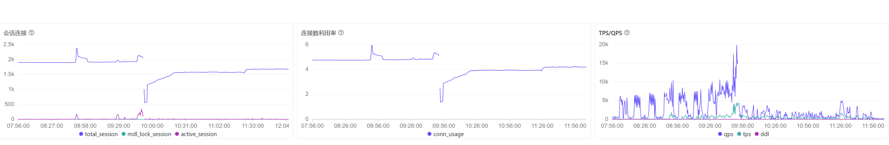
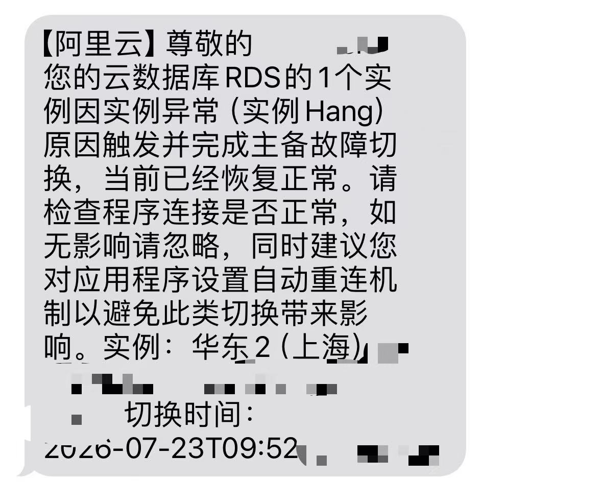

一位读者投稿：他的 RDS MySQL 实例在五天里被主备切换了两次。
云厂商给出的原因是——**他们自己的后台监控，把这个实例查挂了。**

然后厂商承诺当晚关掉这个监控。
四天后，同一个实例，同样的症状，又挂了一次。

---

## 太长不看

- 一个 32 核 128 GB 的 RDS MySQL 实例，7 月 23 日和 7 月 28 日各发生一次主备故障切换，短信里的原因都是“实例异常（实例 Hang）”。
- 官方书面解释：RDS 后台有个采集功能会查 `information_schema.innodb_trx`，高并发时这个查询变慢，进而阻塞实例的 DML，导致偶发 Hang；HA 连续三次探活失败，触发切换。
- 查这张视图，InnoDB 要举起一把**冻结全实例行锁操作的全局排他闩锁**，然后在这把锁下面把所有连接和所有活跃事务过一遍，这个实例日常挂着 1950 个连接。
- MySQL 社区在 8.0.40 修过一次同类问题，但修的是 `performance_schema.data_locks`。
- 官方承诺 7 月 24 日当晚关闭这个监控功能。**7 月 28 日，同一个实例，同样的症状，又主从切了一次。**
- 官方在解释里自己写明，这个功能“在实例并发事务数很高的情况下”都可能出问题，但给出的处置只有简单的：**对客户实例**关闭。
- 然而，这个 “关闭” 并没有真正落地执行，四天后，又是一样的死法挂掉了。 


---

## 监控把库看出了病

这个实例不算寒碜：MySQL 8.0，独享型，32 核、128 GB 内存，最大 IOPS 60000，内核小版本为 `rds_20250731`。
已经算巨型实例了，按包月的话本身价格


*投稿人提供的实例配置截图。截图只说明规格与版本，不单独证明事故原因。*

7 月 23 日上午，监控曲线先是活跃会话上升，
随后在 09:52 左右出现会话数断崖式下降；
告警短信记录的主备切换时间也在这一带。



*7 月 23 日的会话、连接利用率与 TPS/QPS 曲线。读数来自截图，只作近似观察。*



*7 月 23 日的主备切换告警，实例与联系人信息已脱敏。*

客户随后询问原因，收到的书面答复如下。
原文略有语病，这里只调整了空格与换行：


---

## 先说结论：监控不能改变被监控的对象

这句话听起来像废话，但它是有实现代价的，而且这个代价必须在设计阶段就付掉。

我自己是搞 PG 的，MySQL 那一套我一直没什么兴趣折腾。
但监控这件事上原则是通用的，也很朴素：
**监控是为了把系统维护得更好，不是为了把系统搞崩。主次不能颠倒。**

做 Pigsty 监控的时候，我在这上面立过三条死规矩。

**第一，采集周期 10 秒。**
一秒采一次当然更好看，指标更细腻，故障回溯也更清楚。
但我认为 10 秒是更合适的力度——你面对的是一个生产库，不是实验台。

**第二，每一条监控查询都带硬超时，100 毫秒。**
到点就砍，管它抓到没抓到。
曲线上少一个点无所谓，多一次雪崩要命。

**第三，也是最硬的一条：所有监控查询的硬超时加起来，必须小于一个采集周期。**
这样在最坏情况下——所有查询全部超时——采集器也只是空转一轮，
绝不会堆积，绝不会把系统拖垮。

这不是什么高深设计，说白了是一道算术题。
但它是我亲眼见过生产库被自己的监控抓崩之后，才立下来的。

所以看到这个案子，我的第一反应不是愤怒，是滑稽。
一个把监控卖成产品的云厂商，在这上面栽了；
栽完之后写了一份技术上相当专业的分析，承诺了整改；
然后同一个坑，五天里踩了两次。

其余的教训附在文末。
下面是故事。

---

## 一、7 月 23 日 09:52

这个实例的配置不寒碜：MySQL 8.0，独享型，32 核 128 GB，最大 IOPS 60000。
内核小版本 `rds_20250731`，也就是一年前那一版；
小版本升级策略设的是**手动升级**。


那天上午的过程，曲线上看得很清楚：

- 日常会话数在 1950 上下，连接数利用率不到 5%——连接数这条线自始至终不是瓶颈；
- 八点五十前后有过一次预演，会话冲到 2400，活跃会话抬了抬头，然后回落，没出事；
- 九点四十五分开始第二幕：活跃会话冲到 **250** 上下，
  32 个核对 250 个活跃会话，八倍超卖，大家在排队；
  元数据锁等待开始冒头（整体卡顿时的常见伴生现象）；
  QPS 尖峰摸到 2 万；
- **09:52，断崖。**
  会话数从 2000 垂直跌到 570。
  这是主备切换的瞬间，所有连接被一刀切断。

<!-- 待补图片：7 月 23 日会话连接、连接数利用率与 TPS/QPS 曲线。 -->

之后是漫长的爬坡：会话数花了大约四十分钟才从 570 爬回 1600，
QPS 在之后相当长一段时间里明显低于故障前。

短信说的是“当前已经恢复正常”。

客户去问，官方给了一份书面解释：

> RDS 后台有一个对于数据库活动事务信息采集监控的功能，会查询 MySQL 系统视图
> `information_schema.innodb_trx`。你们实例上的并发事务很高时，
> 锁竞争会阻塞系统视图 `information_schema.innodb_trx` 的查询，
> 而系统视图查询的变慢又会进一步阻塞数据库中的 DML 操作，
> 产生偶发性的实例 hang 住了，后续实例 HA 探活失败，
> 并导致出现连续 3 次实例探活失败触发切换的等情况。

坦白讲，这个回复的诚实程度超出我的预期。
云厂商能白纸黑字承认“是我们自己的后台监控把你的实例搞挂了”，
在国内算稀罕事。

但这段话里有一句是拧巴的：**“锁竞争会阻塞系统视图的查询”。**

这个说法把因果关系拧反了。
查 `innodb_trx` 压根不申请行锁，它不会被行锁挡住。
真实的关系是：**这个查询的成本随着并发和锁竞争的加剧而急剧上升，
而它是在一把全局锁下面付这个成本的。**

前一种说法听起来是客户的业务把监控卡住了。
后一种是监控实现自己的问题。
一字之差。

---

## 二、为什么“看一眼”这么贵

`information_schema.innodb_trx` 长得像张表，但它不是表。
它是**每次查询时现场生成的快照**：
InnoDB 得停下来，把当前的事务状态扫一遍抄进一块内部缓存，
再把缓存的内容返回给你。

我把源码拉下来了，`storage/innobase/trx/trx0i_s.cc`，核心就这么一段：

```cpp
int trx_i_s_possibly_fetch_data_into_cache(trx_i_s_cache_t *cache)
{
  if (!can_cache_be_updated(cache)) {
    return (1);
  }
  {
    /* We need to read trx_sys and record/table lock queues */
    locksys::Global_exclusive_latch_guard guard{UT_LOCATION_HERE};
    trx_sys_mutex_enter();
    fetch_data_into_cache(cache);
    trx_sys_mutex_exit();
  }
  return (0);
}
```

### 那把锁

中间那行是关键：`Global_exclusive_latch_guard`——全局排他锁系统闩锁。

`lock_sys` 是 InnoDB 锁系统的中枢。
任何事务要申请行锁、释放行锁、做死锁检测，都得从它这儿过。
MySQL 8.0 花了大力气把这把锁做了分片，就是为了让并发事务别互相踩。

而这段代码的原注释是这么写的：

```cpp
/* We are going to iterate over many different shards of lock_sys so we need
exclusive access */
```

翻译成人话：**我要挨个看所有分片，所以我把整把锁独占了。**
8.0 辛苦做的分片优化，这条路径主动放弃。

这把锁被独占期间，整个实例上没有任何一个事务能拿到或者放掉一把行锁。
全停。

### 那把锁被举了多久

`fetch_data_into_cache()` 要走两个链表：
`trx_sys->rw_trx_list`（读写事务），和 `trx_sys->mysql_trx_list`——
后者约等于“每一个碰过 InnoDB 而且还连着的连接”。

公平起见得说清楚：链表里那些还没开启事务的连接会被快速跳过，不走完整流程。
但即便如此，这个循环仍然要**逐项访问整条链表，逐个进出每个事务的 mutex**。
而对每一个已经启动的事务，还要再做这么一件事：

```cpp
char query[TRX_I_S_TRX_QUERY_MAX_LEN + 1];
stmt_len = innobase_get_stmt_safe(trx->mysql_thd, query, sizeof(query));
```

够到那个连接的 THD，拿一把它的 query 锁，
把正在执行的 SQL 文本拷出来，最多 1024 字节；
再算一遍这个事务锁了多少行。

所以一次“看一眼数据库现在在干什么”，成本是两部分叠起来的：
**一次和连接总数成正比的遍历，加上一轮和活跃事务数成正比的深拷贝——
全部在那把冻结全实例行锁操作的排他闩锁下面完成。**

这个实例的连接数是 1950。
故障时的活跃会话，250。

平时这活儿可能几十毫秒就完了。
但活跃会话冲上去、锁队列排起长龙的时候，
要抄的事务更多了、每个事务要读的锁信息更多了、
去拿每个 THD 的 query 锁本身也开始排队了——
耗时从几十毫秒涨到几百毫秒，涨到几秒。

于是闭环成立：

```text
高并发 → 快照抄得更慢 → 全局锁举得更久 → 全实例 DML 停摆
       → 停摆期间事务继续堆积 → 下一次抄得更慢 → ……
```

这不是线性劣化，是雪崩。

### 顺便说一句那个 100 毫秒

`can_cache_be_updated()` 里写死了一个 100 毫秒的窗口，
源码注释讲得很明白：
这是为了让一条 JOIN 了多张相关视图的 SQL 能读到同一份快照。

它不是给采集程序做限流用的。
对任何正常周期的轮询——1 秒、5 秒、10 秒——
这个缓存等于不存在，每一轮都会老老实实重新抄一遍。

### 这坑不新，只是老路没人修

MySQL 官方手册十几年前就写着：
因为 InnoDB 在收集事务和锁信息时必须临时停顿，
**过于频繁地查询这些表会拖累其他用户感知到的性能**。
官方 Bug 库里躺着一串同类问题：
`#100537`、`#111082`、`#113761`、`#104367`、`#112035`、`#109539`，
主题都是“查锁视图把实例查死了”。

Oracle 也确实修了：
2024 年 10 月的 8.0.40 重新设计了 `performance_schema.data_locks`
和 `data_lock_waits`，让它们不再需要全局排他 mutex。

但修的是 P_S 那两张表。
`information_schema.INNODB_TRX` 走的是我上面贴的那条老路。
我对比了 8.0.32、8.0.40、8.4.3 三个版本的 `trx0i_s.cc`——
这段代码一个字没改，
8.4 里 `Global_exclusive_latch_guard` 依然稳稳坐在那儿。

这里必须说清楚一件事：**我对比的是 MySQL 社区版的代码。**
阿里云跑的是他们自己的 AliSQL，这条路径他们动没动过、动成什么样，我不知道，
外面也没法知道。
我能确认的只有一条：社区基线到 8.4 为止，这段代码没变。

社区花了好几年把新路修好了，老路一直原样躺在那儿。
而这个新上线的采集功能，走的正是老路。

---

## 三、7 月 28 日 17:19

四天后，同一个实例，同一条短信。

这次的曲线更难看：

- 17:13 前后，InnoDB 脏页从 9.5 万涨到 10 万；
- **17:14:30 左右，脏页曲线垂直归零**，
  之后十五分钟只剩零星几个采集点；
- 17:15:45，刷盘次数从基线的 10～30 冲到 590；
  17:20:45，再来一次，冲到 535；
- 17:29:30 前后，脏页从 0 开始重新爬升。

<!-- 待补图片：7 月 28 日 InnoDB Buffer Pool 脏块与刷盘次数曲线。 -->

脏页不会自己变成零。
要么是被刷干净了，要么是这台实例已经不在正常服务状态了——
失去响应，或者干脆重启过。

我的判读是后者。
刷干净应该是一条下降的斜线，不会是一根垂直的悬崖；
更不会在零上趴十五分钟，只留下几个断断续续的点——
那是采集失败的形态，不是刷盘成功的形态。

按这个判读，真实的影响窗口是：
**17:14 实例失去响应 → 17:19 短信说完成切换 → 17:29 新主开始正常写入，
大约十五分钟。**

短信怎么说的来着？
“当前已经恢复正常，如无影响请忽略。”

### 顺带一个荒诞的数字

第二次的根因，客户这边当时还在排查，一度倾向于另一个方向：
写压力上来、脏页涨、刷盘跟不上、checkpoint 滞后。
归因是“RDS 平台默认配置偏保守，没匹配 128 GB / 6 万 IOPS 的规格”。

这个方向本身完全成立。
`innodb_io_capacity` 这一族参数如果按机械盘时代的保守值配，
page cleaner 会**主动限速**——
哪怕底下的盘能跑六万 IOPS，它也只肯刷两千。
这是 MySQL 世界里非常经典的一类事故。

而支持这个方向的证据，是 IOPS 曲线上的一个数字：
**故障期间，IOPS 使用率的峰值大约是 15.7%。**

<!-- 待补图片：7 月 28 日 IOPS 使用率曲线。 -->

换算下来，六万的额度最狠的时候用掉不到一万。
盘有八成的力气没使出来，数据库在那儿刷不动，卡死了。

---

## 四、“预计今晚可以完成”

现在把官方那段改进方案完整读一遍：

> 以上监控功能绝大部份情况下不会对实例性能造成明显影响，
> 但在实例并发事务数很高的情况下可能遇到，
> 我们可以对客户实例设置关闭此项功能，预计今晚（7 月 24 日）可以完成，
> 关闭操作的执行对客户实例使用无影响。

这一段里有两个词，值得单独拎出来。

### 第一个词：“预计”

一份事故改进方案里出现“预计”，意味着这件事没有闭环——
没有确认，没有回执，没有验收。

而客户那边当时的判断是什么呢？
投稿人的原话是：“**应该已经关闭了**”。

“预计”对“应该”。
整个修复流程里，两边加起来，没有一个人是确定的。

### 第二个词：“无影响”

“关闭操作的执行对客户实例使用无影响”——
这句话原本是安抚：你放心，关掉它不会有副作用。

但在 7 月 28 日之后回头读，它变成了一句意外的黑色幽默：

**确实无影响。如果它压根就没被关掉的话。**

### 四种可能，没有一种体面

投稿人后来发来一句话：

> 问题排查结果基本出来了，根因就是第一次他们发的那个回复。
> 第二次切换，不知道是他们过于自信还是觉得是偶发问题，
> 说关那个监控实际没关。太草台了。

这句话的性质我得先讲清楚：
**它是投稿人转述的排查结论，不是官方的公开说明。**
截至发稿，第二次的正式故障报告仍未出具。
关闭操作到底执行了没有、执行成功了没有、
关掉的是不是真凶——我无从核实。

所以我不打算把这句话当成本文的结论。
我用另一种办法：
把 7 月 28 日那次切换的可能解释穷举一遍，然后一条一条看。

**可能一：关闭操作压根没执行。**
那就是说了不算。

**可能二：执行了，但没成功，或者只关了一部分、只关了一个节点。**
那就是说了算，但改完没人回头验一眼。
不验收的修复等于没修。

**可能三：执行了，也成功了，但关掉的不是真凶。**
那就是 7 月 23 日那份归因本身错了。
他们花了时间写出一段技术上相当专业的解释，
郑重承诺了一个改进项，然后修了一个跟故障无关的东西。

**可能四：执行了、成功了、归因也没错，
7 月 28 日是一个全新的、独立的根因。**

这是唯一一条能替他们洗清的解释。
也是四条里最难看的一条。

因为它意味着：
**同一个实例，五天之内，独立地踩中了两个不同的平台级缺陷。**
一个是后台采集举着全局锁把实例按停，
一个是默认参数按机械盘配在六万 IOPS 的盘上。
这不叫运气差，这叫雷区。

四条路，条条通向同一个地方：
**这件事从头到尾没有一个环节是严谨的。**

### 最狠的不是“又挂了一次”

是它挂在同一个地方。

这不是平台上另一个客户碰到了一个新问题。
这是同一个实例、同一个客户、同一个已经立过案、写过分析、承诺过整改的问题，
在同一个受害者身上复发。

这种事在像样的 SRE 团队里有专门的名字：
**repeat incident**，事故分级里最不能忍的一类。
它证明的不是“我们遇到了一个难题”，
而是“我们的闭环是假的”。

而这个闭环是怎么被发现是假的呢？

**靠客户的生产环境又炸了一次。**

我看不到任何主动验证修复是否生效的痕迹；
能看到的是，修复失效是被十五分钟的业务中断发现的。
第二次的正式故障报告到发稿仍未出具，
眼下这份两次事故的对照分析，是客户方自己拼出来的。

**从客户这一侧看过去：
承诺、失效、发现、复盘，没有一个环节是对方主动推进的。**

### 而且这个雷还埋在别人的库里

回头再看官方那句话的前半段：

> 以上监控功能**绝大部份情况下**不会对实例性能造成明显影响，
> **但在实例并发事务数很高的情况下可能遇到**

这是平台方自己写下的、白纸黑字的承认：
这不是某个客户特有的问题，是一个通用缺陷。
只要你的实例并发事务数够高，你就在射程之内。

那处置方案呢？

> 我们可以**对客户实例**设置关闭此项功能

四个字：对客户实例。

至少在这份答复里，处置范围就这四个字——
给已经闹起来的这个客户，单独关一下。
全网到底改没改这个采集实现，我无从得知，
也没查到任何相关公告；
有知情的朋友欢迎在评论区补充。

但如果确实没有，那就意味着：
**其他所有并发事务数很高的 RDS MySQL 实例上，这个东西还在跑。
你不投诉，它就继续在你的库里举着那把全局锁。**

而这些实例的主人，甚至不知道有这么个东西存在。

---

## 五、一个被绕过的开关

前面提过一句：这个实例的小版本升级策略设的是**手动升级**。

这是个很明确的态度——我的数据库内核，不经我同意不许动。
所以它的内核停在一年前那一版，
控制台上“升级内核小版本”旁边那个红色感叹号一直亮着，客户没管。

生产库不追新版本，这是很多老 DBA 的习惯，谈不上对错。

问题是：那个把实例搞挂的采集功能，是怎么进来的？

投稿人自己都说了，“监控未知”——
查到现在，他还没搞清楚那到底是哪个产品线的哪个功能、什么时候推上来的，
甚至没能在日志里把那条监控 SQL 捞出来。

这里可能会有人反驳：
内核小版本升级走的是一条通道，后台采集走的是另一条，
你别混为一谈。

对。
这正是我想说的。

客户以为自己关掉的，是“未经我同意的变更”。
**实际上他关掉的，只是他能看见的那一条通道。**
另一条通道上没有开关，也没有任何一个页面告诉他那条通道存在。

**你能拒绝的，只有你看得见的东西。**

---

## 六、真正拉闸的是谁

到这儿有两个嫌疑人了：
业务的高并发，和平台的采集。
但把“慢”变成“断”的，是第三个。

投稿人有一句话我读了三遍：

> 实际上业务还在跑的只是慢，但是他们最近上的新监控，
> 检测状态导致更慢，然后触发了主从切换。

链条是这样的：
业务在跑（慢）→ 探活探不通 → 连续 3 次 → 主备切换 → 业务全断。

原本的故障形态是**部分降级**：
慢，但活着，连接还在，请求还在返回，上游还能扛。
是高可用机制把它升级成了**完全中断**——
所有连接一刀切断，连接池雪崩，上游重试风暴，
然后四十分钟慢慢爬回来。

“连续 3 次探活失败”这个判据，
在 Hang 而不是 Dead 的场景下本身就很成问题。

**探不通不等于实例死了。**
一个被全局锁卡住的实例，和一个进程没了的实例，
在探针眼里长得一样，处置方式却应该完全不同。

**更要命的是，探不通也不等于切过去会更好。**
新主的 buffer pool 是凉的，业务负载一模一样，
后台那个采集程序也一模一样。
你把一个正在犯病的病人的病历原封不动搬到隔壁床，
然后指望隔壁床不犯病。

7 月 28 日的曲线给了答案：
切过去之后，脏页从零开始重新预热，
爬了将近二十分钟才回到一半的水平。

高可用在这里没有保住可用性。
它是当天最大的一笔可用性支出。

---

## 七、如无影响，请忽略

最后回头读那条短信：

> 您的云数据库 RDS 的 1 个实例因实例异常（实例 Hang）原因触发并完成主备故障切换，
> 当前已经恢复正常。
> 请检查程序连接是否正常，如无影响请忽略。

**“因实例异常原因”**——
异常的原因是什么？
异常。
主语被优雅地删掉了。
不是“我们的采集程序把您的实例卡住了”，
而是“实例异常”，好像这台机器是自己抽的风，
像天气一样，属于自然现象。

**“当前已经恢复正常”**——
在 7 月 28 日那天，“当前”覆盖的是十五分钟之后。

**“如无影响请忽略”**——
这半句最妙，它把举证责任漂亮地转移给了客户：
你自己去检查有没有影响。
你要是没发现，那就是没影响。

我完全理解模板为什么这么写，
几十万个实例的告警不可能一条条定制。
但正因为它是模板，它才更说明问题：
**在这套系统的世界观里，
“你的数据库刚死了一次”是一件默认可以被忽略的事。**

投稿人的评价是三个字：太草台了。

我想不出更准确的说法。

---

## 尾声：你交出去的是复杂性，留下的是风险

说句公道话，这事儿不是某一家云特有的。
往 `information_schema.innodb_trx` 上撞的监控，
我在自建环境里也见过一堆；
把 `innodb_io_capacity` 按机械盘配在 NVMe 上的，更是遍地都是。
全世界都知道这个坑——
MySQL 手册写了，AWS 的文档写了，Google Cloud 的文档写了，
Bug 库里挂着一串——
唯独那个刚上线的采集功能不知道。

真正值得说的也不是“云不行”。
云能把 99% 的复杂度接管走，这是实打实的价值。

值得说的是这一句：
**你交出去的是复杂性，留下来的是风险。**

风险一直在你这儿。
业务挂了是你的业务挂了，
四十分钟的爬坡是你的用户在等，
十五分钟的中断是你的订单在丢。
你交出去的，只是看见它、理解它、干预它的能力。

于是你就成了这个案子里的客户：
你设了内核手动升级，但一个你不知道的采集程序从另一条路进来了；
你买了六万 IOPS，但决定用多少的参数不在你手上；
你的实例被一把全局排他锁按停，
而你连那把锁是被谁举起来的都查不到；
对方承诺整改，四天后同样的事又来一遍，
而你连修没修都没法自己验证。

最后你收到一条短信，说如无影响请忽略。

开源自建最被低估的价值从来不是省钱。
是**知情权**——
出事的时候，你至少能自己打开机器盖子，
看一眼里面到底是什么。

---

## 附：三条通用的规矩

**一、采集事务和锁信息，优先用 Performance Schema，
别高频去查 `information_schema.innodb_trx`。**
8.0.40 之后，`performance_schema.data_locks` 已经不需要全局排他闩锁了，
而 `INNODB_TRX` 那条老路到 8.4 还是老样子。
只想抓长事务的话，P_S 的事务事件表、`innodb_metrics` 里的计数器，
都比去抄那份全量快照强。

**二、任何采集动作，先问两个问题：
它在什么锁下面跑？它的复杂度是 `O(几)`？**
再加一条兜底：
给每条查询设硬超时，并保证所有超时之和小于采集周期。
一个在全局排他锁下做 `O(N)` 采集、还不设超时的程序，
那不叫监控，叫压测。

**三、探活语句必须是全世界最轻的那一条，
而且要能区分“慢”和“死”。**
探活探的是“这台机器还能不能干活”，
不是“这台机器干活快不快”。
一个会被业务负载拖垮的探针，
探的不是数据库的健康，是数据库的心情。
而在拉闸之前，永远要多问一句：
切过去，真的会更好吗？

---

*本文基于读者投稿。事实部分来自投稿人提供的告警短信、书面沟通记录与监控截图，官方解释为原文引述。客户方的排查结论属于投稿人转述，
第二次事故的正式报告截至发稿尚未出具，本文不对责任归属作任何认定；文中判读与评论均为基于上述材料的个人意见，
已在行文中标注。源码引用自 MySQL 官方仓库公开代码，与阿里云 AliSQL 的实际实现可能存在差异。*
