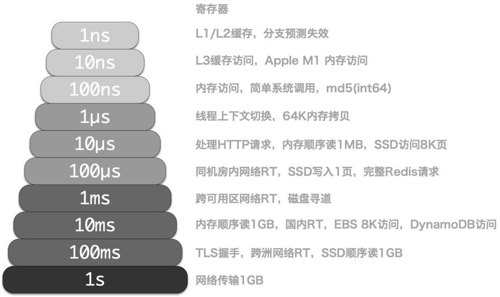

Winter is coming, tech giants are laying off workers entering cost-reduction mode. Can cloud databases, the number one public cloud cash cow, still tell their story?

Recently, an article by DHH, co-founder of Basecamp & HEY, caused a stir【1,2】. The main content can be summarized in one sentence:

> "We spend $500,000 annually on cloud databases (RDS/ES). Do you know how many awesome servers $500,000 can buy?
>
> **We're exiting the cloud, bye bye!"**

**So, how many awesome servers can $500,000 buy?**

---------

## Absurd Pricing

> Sharpening knives toward pigs and sheep

**We can ask differently: how much do servers and RDS cost?**

Taking the physical machine model we heavily use for databases as an example: Dell R730, 64-core 384GB memory, with a 3.2TB MLC NVMe SSD. Such a server running production-grade PostgreSQL can handle hundreds of thousands of TPS, read-only point queries can reach 400-500k. How much does it cost? Including electricity, network, IDC hosting maintenance fees, amortized over 5 years until scrapping, total lifecycle cost is around 75,000, or 15,000 annually. Of course, for production use, high availability is essential, so typically a database cluster needs two to three physical machines, meaning 30,000 to 45,000 annually.

DBA costs aren't included here: two or three people managing tens of thousands of cores isn't much.

If you directly purchase cloud database of this specification, what are the costs? Let's look at domestic Alibaba-Cloud pricing【3】. Since the basic version (beggar version) is really unusable for production (refer to: "[Cloud Database: From Database Drop to Exit](http://mp.weixin.qq.com/s?__biz=MzU5ODAyNTM5Ng==&mid=2247485093&idx=1&sn=5815f71f1d832101d35a75f5aa4acd3c&chksm=fe4b337ec93cba68fbf30eb0ed50d052c6e8972d42cf506051b5016668f4555edaa0756688dc&scene=21#wechat_redirect)"), we choose high-availability version, typically with two to three instances underneath. Annual/monthly payment, PostgreSQL 15 on x86 engine, East China 1 default AZ, dedicated 64-core 256GB instance: pg.x4m.8xlarge.2c, with a 3.2TB ESSD PL3 cloud disk. Annual costs range from 250,000 (3 years) to 750,000 (on-demand), with storage costs accounting for about 1/3.

Let's also look at AWS, the public cloud leader【4】【5】. The closest on AWS is db.m5.16xlarge, also 64-core 256GB multi-AZ deployment. Similarly, we add a 3.2TB io1 SSD disk with maximum 80k IOPS. Checking AWS global and China region pricing, total costs range from 1.6-2.17 million yuan annually, with storage costs accounting for about half. Overall costs shown in the table below:

| Payment Mode            | Price           | Annual (¥10k) |
|------------------------|-----------------|---------------|
| IDC Self-Built (Single Physical) | ¥75k / 5 years  | 1.5           |
| IDC Self-Built (2-3 HA)      | ¥150k / 5 years | 3.0 ~ 4.5     |
| Alibaba-Cloud RDS On-Demand   | ¥87.36/hour     | 76.5          |
| Alibaba-Cloud RDS Monthly (Base) | ¥42k / month    | 50            |
| Alibaba-Cloud RDS Annual (15% off) | ¥425,095 / year | 42.5          |
| Alibaba-Cloud RDS 3-Year (50% off) | ¥750,168 / 3 years | 25            |
| AWS On-Demand         | $25,817 / month | 217           |
| AWS 1-Year No Prepay   | $22,827 / month | 191.7         |
| AWS 3-Year Full Prepay | $120k + $17.5k/month | 175           |
| AWS China/Ningxia On-Demand | ¥197,489 / month | 237           |
| AWS China/Ningxia 1-Year No Prepay | ¥143,176 / month | 171           |
| AWS China/Ningxia 3-Year Full Prepay | ¥647k + ¥116k/month | 160.6         |

We can compare self-built vs cloud database cost differences:

| Method                                                                 | Annual (¥10k) |
|------------------------------------------------------------------------|---------------|
| IDC Hosted Server 64C / 384G / 3.2TB NVME SSD 660K IOPS (2-3 units)  | 3.0 ~ 4.5     |
| Alibaba-Cloud RDS PG HA pg.x4m.8xlarge.2c, 64C / 256GB / 3.2TB ESSD PL3 | 25 ~ 50       |
| AWS RDS PG HA db.m5.16xlarge, 64C / 256GB / 3.2TB io1 x 80k IOPS     | 160 ~ 217     |

So the question is: **if one year of cloud database costs can buy you several or even dozens of higher-performing servers, what's the point of using cloud databases?** Of course, public cloud enterprise customers usually get commercial discounts, but no matter how much discount, the order-of-magnitude difference can't be bridged, right?

**Are you paying an IQ tax by using cloud databases?**

---------

## Applicable Scenarios

> No silver bullet

**Databases are the core of data-intensive applications**, applications follow databases, so database selection needs to be very careful. Evaluating a database requires multiple dimensions: reliability, security, simplicity, scalability, extensibility, observability, maintainability, cost-effectiveness, etc. Clients really care about these attributes, not flashy technical hype: storage-compute separation, Serverless, HTAP, cloud-native, hyper-convergence... These must be translated into engineering language: **what's sacrificed for what gains** to have actual meaning.

Public cloud advocates love to gild the lily: cost savings, flexible elasticity, security and reliability, digital transformation panacea, car vs horse-carriage revolution, good, fast and cheap, etc. Unfortunately, few claims are factual. Setting aside these flashy concepts, cloud databases have only one real advantage over professional database services: **elasticity**. Specifically two points: **low startup costs, strong scalability**.

**Low startup costs** means users don't need data center construction, personnel recruitment and training, server procurement to start using; **strong scalability** refers to easy configuration upgrades/downgrades and scaling. Therefore, public cloud's truly suitable scenarios center on these two:

1. **Startup phase, extremely small traffic simple applications**
2. **Completely unpredictable, highly volatile loads**

The former mainly includes simple websites, personal blogs, mini-programs, demos/PoCs. The latter mainly includes infrequent data analysis/model training, sudden flash sales, celebrity scandal traffic spikes, etc.

**Public cloud's business model is rental**: rent servers, bandwidth, storage, experts. It's no different from renting apartments, cars, power banks. Of course, server rental and operations outsourcing don't sound appealing, so they got the "cloud" name, sounding more cyber-landlordish. The rental model's characteristic is elasticity.

**Rental models have rental benefits** - when traveling, shared power banks can solve temporary small-scale charging needs. But for people commuting daily from home to office, using shared power banks daily for phones and laptops would be absurd, especially when renting for a few hours costs enough to buy one outright. Car rental works well for temporary, sudden, one-time needs: business trips, tourism, moving cargo. But if your travel needs are frequent and local, purchasing a self-driving car might be the most convenient and economical choice.

**The key is still rent-to-buy ratio** - housing rent-to-buy ratios are decades, cars are years, while public cloud server rent-to-buy ratios are usually just months. If your business can stably survive several months, why rent instead of buy directly?

So cloud vendors' money comes from VC-funded tech startups seeking explosive growth, special entities where gray rent-seeking margins exceed cloud premiums, wealthy big spenders, or scattered webmaster/student/VPN personal users. Smart high-value enterprise clients - who would abandon comfortable large houses to squeeze into cramped rental dormitories?

**If your business fits public cloud's applicable spectrum, that's great; but paying several to dozens of times premium for unnecessary flexibility and elasticity is pure IQ tax.**

---------

## Cost Assassin

> Any information asymmetry can constitute profit space, but you can't fool everyone forever.

Public cloud elasticity is designed for its business model: **extremely low startup costs, extremely high maintenance costs**. Low startup costs attract users to cloud, good elasticity adapts to business growth anytime, but after business stabilizes, vendor lock-in occurs with extremely high maintenance costs causing user suffering. This model has a colloquial name - **pig-slaughtering scam**.

In my first career stop, I have vivid memories of such a pig-slaughtering experience. As one of the first internal BUs forced onto A-cloud, A-cloud directly sent engineers to provide hands-on cloud migration services. Used ODPS full stack to replace self-built big data/database stack. The service was indeed good, except annual storage and compute costs shot from around 10 million to nearly 100 million, with profits almost entirely transferred to A-cloud - the ultimate cost assassin.

Later at my next stop, the situation was completely different. We managed 25,000-core scale, 4.5M QPS PostgreSQL and Redis database clusters. For this scale database, if charged by AWS RCU/WCU, several hundred million would go out annually; even buying long-term annual packages with big commercial discounts, at least 50-60 million is unavoidable. But our total of two or three DBAs, several hundred servers, amortized human and asset costs were under 10 million annually.

Here we can use a simple method to calculate unit costs: one core computing power (including mem/disk) used for one month's comprehensive cost, abbreviated as **core·month**. We calculated self-built costs for various machine models and cloud vendor quotes, roughly as follows:

|               Hardware Computing Power                |  Unit Price   |
|:----------------------------------------------------:|:-------------:|
|    IDC Self-Built (Dedicated Physical A1: 64C384G)     |      19       |
|     IDC Self-Built (Dedicated Physical B1: 40C64G)     |      26       |
|     IDC Self-Built (Dedicated Physical C2: 8C16G)      |      38       |
|        IDC Self-Built (Container, 200% Oversell)         |      17       |
|        IDC Self-Built (Container, 500% Oversell)         |       7       |
|      UCloud Elastic VM (8C16G, with Oversell)      |      25       |
|       Alibaba-Cloud Elastic Server 2x Memory (Dedicated No Oversell)       |      107      |
|       Alibaba-Cloud Elastic Server 4x Memory (Dedicated No Oversell)       |      138      |
|       Alibaba-Cloud Elastic Server 8x Memory (Dedicated No Oversell)       |      180      |
|  AWS C5D.METAL 96C 200G (Monthly No Prepay)   |      100      |
|   AWS C5D.METAL 96C 200G (3-Year Prepay)    |      80       |
|              **Database**              |               |
|   AWS RDS PostgreSQL db.T2 (4x)   |      440      |
|   AWS RDS PostgreSQL db.M5 (4x)   |      611      |
|  AWS RDS PostgreSQL db.R6G (8x)   |      786      |
| AWS RDS PostgreSQL db.M5 24xlarge |     1328      |
|        Alibaba-Cloud RDS PG 2x Memory (Dedicated)        |      260      |
|        Alibaba-Cloud RDS PG 4x Memory (Dedicated)        |      320      |
|        Alibaba-Cloud RDS PG 8x Memory (Dedicated)        |      410      |
|            Oracle Database License            |     10000     |

So the question becomes: why can 20-yuan server hardware sell for hundreds, and with cloud database software can multiply several times more? **Are operations made of gold, or are servers made of gold?**

Common response is: ***Databases are the crown jewel of infrastructure software, embodying countless intangible intellectual property BlahBlah***. Therefore software prices far exceeding hardware are very reasonable. If it's top commercial databases like Oracle, or Sony Nintendo console games, this makes sense.

But cloud databases (RDS for PostgreSQL/MySQL/...) on public cloud are essentially open source database kernels with cosmetic modifications, plus proprietary management software and shared DBA services. This markup rate is absurd: database kernels are free! **Are your management software made of gold, or are DBAs made of gold?**

**Public cloud's secret is here: use cheap storage and compute resources for customer acquisition, use cloud databases for pig slaughtering.**

Although domestic public cloud IaaS (storage, compute, network) revenue accounts for nearly half of total revenue, gross margin is only 15%-20%, while public cloud PaaS revenue is less than IaaS but PaaS gross margin can reach 50%, crushing resource-selling IaaS. **The most representative of PaaS is cloud databases**.

Normally, if not treating public cloud purely as IDC 2.0 or CDN supplier, the most expensive service is databases. Are storage, compute, network resources on public cloud expensive? Strictly speaking, not particularly outrageous. IDC hosted physical machine maintenance core·month costs are about 20-30, while public cloud one-core CPU computing power for one month costs about 70-80 to 100-200, considering various discounts and activities plus elasticity premium, barely within acceptable reasonable range.

But cloud databases are extremely outrageous - same one-core computing power for one month, cloud database prices can multiply several to dozens of times compared to corresponding hardware specifications. Cheaper Alibaba-Cloud has core·month unit prices of 200-400, more expensive AWS has core·month unit prices of 700-800 or even over 1000.

If you only have one or two cores of RDS, don't bother - pay some tax. But if your business has scaled up and still doesn't exit cloud quickly, you're really paying IQ tax.

------------------

## Good Enough?

> Don't misunderstand, cloud databases are just passing-grade cafeteria food.

Regarding cloud database/cloud/ server costs, if you can chat with sales to this point, the pitch becomes: ***Though we're expensive, we're good!***

**But are cloud databases really good?**

Should say, for toy applications, small websites, personal hosting, and wildcatters with no technical knowledge, RDS might be good enough. But in the eyes of high-value customers and database experts, RDS is just passing-grade cafeteria food.

Ultimately, public cloud stems from big tech internal operations capability overflow - big tech people know their own company's tech level, no need for mysterious worship. (Google might be an exception).

Taking **performance** as example, performance's core indicator is **latency/response time**, especially tail latency, directly affecting user experience: nobody wants to wait seconds for screen scrolling. In this regard, **disks** play a decisive role.

Our production database environment uses local NVMe SSDs with typical 4K write latency of 15µs, read latency 94µs. Therefore, PostgreSQL simple query response times are typically 100-300µs, application-side query response times typically 200-600µs; for simple queries, our SLO is hit within 1ms, miss within 10ms, over 10ms counts as slow query requiring optimization.

AWS EBS service performance tested with fio is extremely poor【6】, default gp3 read/write latency is 40ms, io1 read/write latency is 10ms, nearly three orders of magnitude difference, and maximum IOPS is only 80k. RDS uses EBS storage - if single disk access takes 10ms, it's unusable. io2 does use self-built equivalent NVMe SSDs, but remote block storage latency directly doubles compared to local disks.

Indeed, sometimes cloud vendors provide good-performance local NVMe SSDs, but they sneakily set various restrictions to prevent users from using EC2 for self-built databases. AWS's restriction is only providing NVMe SSD Ephemeral Storage - these disks automatically wipe clean on EC2 restart, completely unusable. Alibaba-Cloud's restriction is sky-high pricing - compared to direct hardware procurement, **Alibaba-Cloud's ESSD PL3 costs 200 times more**. Using 3.2TB enterprise PCI-E SSD cards as reference, AWS rent-to-buy ratio is 1 month, Alibaba-Cloud is 9 days - renting this duration can buy the entire disk. With Alibaba-Cloud's maximum 3-year 50% discount, three years' rental can buy 123 equivalent disks, nearly 400TB permanent ownership.

**Taking observability as another example, no RDS monitoring can be called "good"**. Just looking at monitoring indicator count - while knowing if a service is dead or alive needs only a few indicators, for failure root cause analysis, you need as many monitoring indicators as possible to build good context. Most RDS only provide basic monitoring indicators and pitifully simple monitoring dashboards. Taking Alibaba-Cloud RDS PG as example【7】, so-called "enhanced monitoring" has only these pitiful indicators. AWS has similar PG-related indicators, under 100, while our own monitoring system has over 800 host indicator types, 610 PostgreSQL database indicator types, 257 Redis indicator types, about 3000 total indicator types, completely crushing these RDS systems.

> Public [Demo](https://demo.pigsty.cc): https://demo.pigsty.cc

Regarding **reliability**, I used to have basic trust in RDS reliability until A-cloud Hong Kong data center scandal a month ago. Rented data center, server water sprinkler fire suppression, OSS failure, massive RDS unavailability without failover capability; then A-cloud's entire Region management service crashed due to single-AZ failure, **even their own management APIs couldn't achieve disaster recovery, so doing cloud database disaster recovery is a huge joke**.

Of course, this doesn't mean self-building won't have these problems - just that slightly reliable IDC hosting wouldn't make such outrageous mistakes. Security needn't be elaborated - recent major embarrassments like famous SHGA; hardcoded AK/SK in sample code everywhere. Is cloud RDS more secure? Don't joke - classic architecture at least has VPN bastion hosts as a layer, while databases exposed on public internet with weak passwords are countless, attack surface is definitely larger.

**Another widely criticized aspect of cloud databases is extensibility**. RDS doesn't give users dbsu privileges, meaning users can't install extension plugins in databases, while PostgreSQL plugins are exactly its essence - PostgreSQL without extensions is like Coke without ice, yogurt without sugar. More seriously, **when some failures occur, users even lose self-rescue capabilities**, see "[Cloud Database: From Database Drop to Exit](http://mp.weixin.qq.com/s?__biz=MzU5ODAyNTM5Ng==&mid=2247485093&idx=1&sn=5815f71f1d832101d35a75f5aa4acd3c&chksm=fe4b337ec93cba68fbf30eb0ed50d052c6e8972d42cf506051b5016668f4555edaa0756688dc&scene=21#wechat_redirect)" real case: WAL archiving and PITR, such basic functionality, is a paid upgrade feature in RDS. Regarding maintainability, some say cloud databases are convenient with mouse clicks for creation/destruction - people saying this definitely haven't experienced the hillbilly scenario of needing SMS verification codes for restarting each database. **With Database as Code management tools, real engineers would never use this "ClickOps"**.

However, everything exists for a reason. Cloud databases aren't worthless - in **scalability**, cloud databases indeed rolled out new heights, like various Serverless tricks, but this mainly saves cloud vendors money through overselling, not much meaning for users.

------------------

## Eliminate DBAs?

> Monopolized by cloud vendors, can't even recruit, still eliminate?

**Another cloud database pitch is: with RDS, you don't need DBAs!**

For example, this famous cannon-fodder article "[Why Are You Still Hiring DBAs](https://mp.weixin.qq.com/s/DtRFnh8LgtfesCNMNl3eNw)"【8】says: We have database autonomous services! RDS and DAS can solve these database-related problems, DBAs will be unemployed, hahaha. I believe anyone who seriously read these so-called "autonomous services," "AI4DB" official documentation【9】【10】wouldn't believe this nonsense: **a small module that doesn't even qualify as a decent monitoring system can make databases autonomous - isn't this daydreaming?**

DBA, Database Administrator, formerly called database coordinator, database programmer. DBAs are broad roles spanning development and operations teams, involving DA, SA, Dev, Ops, and SRE responsibilities, handling various data and database-related issues: setting management policies and operational standards, planning software/hardware architecture, coordinating database management, validating table schema design, optimizing SQL queries, analyzing execution plans, even handling emergencies and data rescue.

**DBAs' first value is security backup**: **they are guardians of enterprise core data assets, and people who can easily cause fatal damage to enterprises**. Ant Financial has a joke: besides regulation, only DBAs can kill Alipay. Executives usually have difficulty realizing DBAs' importance to companies until database incidents occur, with a bunch of CXOs nervously standing behind DBAs watching firefighting recovery... Compared to avoiding losses from database failures like nationwide flight groundings, YouTube outages, factory shutdowns, DBA employment costs seem trivial.

**DBAs' second value is model design and optimization**. Many companies don't care if their queries are garbage, they just think "hardware is cheap," buying hardware solves everything. However, the problem is improperly tuned queries/SQL or poorly designed data models and table structures can impact performance by orders of magnitude. There's always some scale where hardware costs far exceed hiring reliable DBA costs. Honestly, **I think most companies' biggest IT software/hardware spending is: developers not using databases correctly**.

**DBAs' basic skill is managing DB, but the soul is A**: Administration - how to manage entropy created by developers requires more than just technology. "Autonomous databases" might help you analyze loads and create indexes, but there's no possibility of helping you understand business requirements, pushing business to optimize table structures - this won't be replaceable by cloud for the next 20-30 years.

Whether public cloud vendors, Kubernetes-represented cloud-native/private cloud, or local open source RDS alternatives like Pigsty【11】, **their core value is using as much software as possible, rather than people, to handle system complexity**. So, **will cloud software revolutionize operations and DBAs?**

**Cloud isn't magic operations outsourcing that manages everything**. According to complexity conservation law, whether system administrators or database administrators, the only way admin positions disappear is being renamed "DevOps Engineer" or SRE. **Good cloud software can help shield operational chores, solving 70% of daily high-frequency problems, but there are always complex problems only humans can handle**. You might need fewer people to manage this cloud software, but people are still needed【12】. After all, **you need knowledgeable people to coordinate and handle things, so you won't be harvested like fools by cloud vendors.**

**In large organizations, a good DBA is crucial**. However, excellent DBAs are quite rare, supply can't meet demand, so this role can only be outsourced in most organizations: to professional database service companies, to cloud database RDS service teams. Organizations unable to find DBA supply can only **insource** this responsibility to their own dev/ops personnel until company scale is large enough or they've suffered enough, then some Dev/Ops develop corresponding capabilities.

**DBAs won't be eliminated, only concentrated in cloud vendors providing monopolized services.**

------------------

## Monopoly Shadow

> In 2020, computing freedom's enemy is cloud computing software.

**Compared to "eliminating DBAs," cloud emergence contains greater threats**. We need to worry about this scenario: public cloud (or fruit cloud) dominates, controlling upstream/downstream hardware and carriers, monopolizing computing, storage, network, and top expert resources, forming de facto standards. If all top DBAs are poached by cloud vendors to provide centralized shared expert services, ordinary enterprise organizations lose the ability to use databases well, ultimately forced to choose cloud vendor taxation and pig slaughtering. Finally, all IT resources concentrate in cloud vendors - controlling these key few controls the entire internet. This undoubtedly contradicts the internet's original intent.

Quoting DDIA author Martin Kelppmann【13】:

> **In 2020, computing freedom's enemy is cloud computing software**
>
> — software mainly running on vendor servers, with all your data stored on these servers. These "cloud software" might have client components (mobile apps, web apps, JavaScript running in browsers), but they only work with vendor backend services. Cloud software has many problems:
>
> - If the cloud software company goes bankrupt or decides to discontinue, the software stops working, and documents and data created with this software get locked. This is common with startup software: these companies might be acquired by big companies uninterested in maintaining startup products.
> - Google and other cloud services might suddenly suspend your account without warning or recourse. For example, you might be completely innocent but judged by automated systems as violating terms of service: others might hack your account and use it to send malware or phishing emails without your knowledge, triggering terms violations. Therefore, you might suddenly find all documents created with Google Docs or other apps permanently locked and inaccessible.
> - Software running on your own computer continues working even if software vendors go bankrupt, until forever. (If software no longer compatible with your OS, you can run it in VMs and emulators, provided it doesn't need to contact servers for license checks). For example, Internet Archive has a collection of over 100,000 historical software pieces you can run in browser emulators! In contrast, if cloud software shuts down, you have no way to preserve it because you never had server software copies, neither source code nor compiled form.
> - The inability to customize or extend software you use, a problem from the 1990s, is further exacerbated in cloud software. For closed-source software running on your computer, at least someone can reverse-engineer its data file formats so you can load them into other alternative software (like Microsoft Office file formats before OOXML, or Photoshop files before specification publication). With cloud software, even this is impossible because data only exists in the cloud, not in files on your computer.
>
> **If all software were free and open source, these problems would be solved**. However, open source isn't actually necessary to solve cloud software problems; even closed-source software can avoid above problems if it runs on your computer, not vendor cloud servers. Note that Internet Archive can maintain historical software operation without source code: for archival purposes, running compiled machine code in emulators suffices. Maybe having source code makes things easier, but it's not critical - **the most important thing is having a copy of the software**.
>
> My collaborators and I previously advocated **local-first software** concepts as a response to cloud software problems. Local-first software runs on your computer, stores data on your local hard drive, while retaining cloud computing software convenience like real-time collaboration and data synchronization across all devices. Open source local-first software is certainly great, but not necessary - 90% of local-first software benefits apply to closed-source software too. Cloud software, not closed-source software, is the real threat to software freedom because: **cloud vendors can suddenly whimsically lock all your data at will, far more harmful than inability to view and modify your software source code**. Therefore, promoting local-first software is more important and urgent.

There's action for every force. Local-first software corresponding to cloud software is emerging like bamboo shoots after rain. For example, the Cloud Native movement represented by Kubernetes. "Cloud Native" - cloud vendors interpret "Native" as "native": "software natively born in public cloud environments"; while its true meaning should be "local," i.e., "Local" corresponding to "Cloud" - local cloud/private cloud/dedicated cloud/native cloud, names don't matter, what matters is it runs wherever users want (including cloud servers), not exclusively on public cloud!

Open source projects represented by K8S bring resource scheduling/intelligent operations capabilities originally exclusive to public cloud to all enterprises, letting enterprises run 'cloud' capabilities locally. For stateless applications, it's already a good enough "cloud operating system" kernel. Ceph/Minio also provide open source alternatives to S3 object storage. Only one question remains unanswered: how to manage and deploy stateful, production-grade database services?

The era calls for open source RDS alternatives.

------------------

## Solutions

> Pigsty — Open source free, out-of-box, better RDS PG alternative

I hope future worlds where everyone has factual rights to use excellent services freely, rather than being penned in pig farms (Pigsty) provided by a few public cloud vendors eating garbage. This is why I made Pigsty — **a better, open source free PostgreSQL RDS alternative**. Letting users pull up database services better than cloud RDS anywhere (including cloud servers) with one click.

Pigsty is complete PostgreSQL enhancement, **more spicy satire of cloud databases**. It originally means "pig pen," but more accurately abbreviates "Postgres In Great STYle" — "**PostgreSQL in full glory**". It's a completely open source software-based solution running anywhere, condensing PostgreSQL usage and management best practices as a Me-Better RDS open source alternative. A solution tempered by real-world large-scale, high-standard PostgreSQL clusters meeting Tantan's own database management needs, doing valuable work across eight dimensions:

**Observability is heaven; Heaven's movement is vigorous, gentlemen strive constantly**; Pigsty uses modern observability tech stack to create an unparalleled monitoring system for PostgreSQL, from global dashboard overviews to individual table/index/function object second-level historical detail indicators, letting users achieve fire-clear insight and total control. Additionally, Pigsty's monitoring system can be used independently to monitor third-party database instances.

**Controllability is earth; Earth's momentum is receptive, gentlemen carry things with virtue**; Pigsty provides Database as Code capability: using expressively rich declarative interfaces to describe database cluster states, using idempotent playbooks for deployment and adjustment. Giving users fine customization capabilities while not worrying about implementation details, liberating mental burden, lowering database operation and management thresholds from expert-level to novice-level.

**Scalability is water; Water flows to overcome obstacles, gentlemen act with constant virtue**; Pigsty provides pre-configured universal tuning templates (OLTP/OLAP/CRIT/TINY), automatically optimizing system parameters, and can infinitely extend read-only capabilities through cascading replication, also using Pgbouncer connection pooling to optimize massive concurrent connections; Pigsty ensures PostgreSQL performance can be fully unleashed under modern hardware conditions: single machines can handle tens of thousands of concurrent connections/million-level single-point query QPS/hundred-thousand-level single-item write TPS.

**Maintainability is fire; Two fires make brightness, great people continue illumination in all directions**; Pigsty allows online instance removal/addition for scaling, Switchover/rolling upgrades for configuration changes, provides logical replication-based zero-downtime migration solutions, compressing maintenance windows to sub-second levels, raising system overall evolvability, availability, maintainability to new standards.

**Security is thunder; Thunder repeats, gentlemen fearfully introspect**; Pigsty provides an access control model following minimum privilege principles, with various security feature switches: streaming replication synchronous commit prevents loss, data directory checksums prevent corruption, network traffic SSL encryption prevents eavesdropping, remote backup AES-256 prevents leaks. As long as physical hardware and passwords are secure, users needn't worry about database security.

**Simplicity is wind; Wind follows, gentlemen issue commands and execute**; Using Pigsty won't exceed any cloud database's difficulty, designed to deliver complete RDS functionality at minimum complexity cost. Modular design allows users to combine and select needed functions. Pigsty provides Vagrant-based local development test sandboxes and Terraform cloud IaC one-click deployment templates, letting you complete offline installation with one click on any new EL node, completely replicating environments.

**Reliability is mountain; Mountains stand together, gentlemen think without leaving position**; Pigsty provides self-healing high-availability architecture handling hardware issues, also provides out-of-box PITR point-in-time recovery as backup for human database drops and software defects, verified through long-term, large-scale production environment operation and high-availability drills.

**Extensibility is marsh: Beautiful marsh, gentlemen discuss with friends**; Pigsty deeply integrates PostgreSQL ecosystem core extensions PostGIS, TimescaleDB, Citus, PGVector, and numerous extension plugins; Pigsty provides modularly designed Prometheus/Grafana observability tech stack, and monitoring and high-availability deployment for MINIO, ETCD, Redis, Greenplum components combined with PostgreSQL;

**Most importantly, Pigsty is completely open source free software**, using AGPL v3.0 license. We're powered by love, while you can run fully functional or even better RDS services with dozens of yuan core·month pure hardware costs. Whether you're a beginner or veteran DBA, whether you manage ten-thousand-core large clusters or 1c2g small pipes, whether you already use RDS or built databases locally, as long as you're a PostgreSQL user, Pigsty will help you, completely free. **You can focus on the most interesting or valuable parts of your business, leaving chores to software**.

Although Pigsty aims to replace manual database operations with database autopilot software, as mentioned above, even the best software can't solve 100% of problems. There are always rare, low-frequency, difficult problems requiring expert intervention. We provide free community Q&A. If you find installation, usage, maintenance difficult, need cloud exit migration or difficult problem backup, we also provide top database expert consulting services with competitive cost-effectiveness compared to public cloud database [tickets/SLA](/cloud/sla/). Pigsty helps users use PostgreSQL well, while we help users use Pigsty well.

Pigsty is simple and easy to use, human costs and complexity match RDS, but resource cost differences are earth-shaking. Not comparing self-built data centers' 20 yuan with hundreds of yuan cloud databases, considering RDS has several times markup compared to equivalent EC2, you can completely compromise: use cloud servers to deploy Pigsty RDS, retaining cloud elasticity while saving 50-60% costs immediately. For IDC self-building or maintenance, cutting 90% costs might not be enough.

> RDS cost vs scale cost curve

Pigsty lets you practice ultimate FinOps philosophy — using prices almost approaching pure resources, run production-grade PostgreSQL RDS database services anywhere (ECS, resource cloud, data center servers, even local laptop VMs). **Making cloud database capability costs change from proportional to resource marginal costs to approximately zero fixed learning costs**.

**If you can use better RDS services at a fraction of the cost, then using cloud databases would be pure IQ tax.**

------------------

## Reference

【1】[Why We're Leaving the Cloud](https://world.hey.com/dhh/why-we-re-leaving-the-cloud-654b47e0)

【2】[Giving Up Cloud After Ten Years of Being "Scammed," Is the First Wave of "Cloud-Exit" Coming This Winter?](https://www.infoq.cn/article/qoq3v6jfenwwzmpg4fre)

【3】[Alibaba-Cloud RDS for PostgreSQL Pricing](https://rdsbuy.console.aliyun.com/create/rds/PostgreSQL)

【4】[AWS Pricing Calculator](https://calculator.aws/#/addService/RDSPostgreSQL)

【5】 [AWS Pricing Calculator](https://calculator.amazonaws.cn/#/?trk=pricing-ban) (China Ningxia)

【6】[FIO Testing AWS EBS Performance](https://github.com/Vonng/pgtpc/blob/master/fio/aws-ebs-bench.md)

【7】[Alibaba-Cloud RDS PG Enhanced Monitoring](https://help.aliyun.com/document_detail/299200.html)

【8】[Why Are You Still Hiring DBAs](https://mp.weixin.qq.com/s/DtRFnh8LgtfesCNMNl3eNw)

【9】[Alibaba-Cloud RDS PG Database Autonomous Service](https://help.aliyun.com/document_detail/159166.html)

【10】[OpenGauss AI for DB](https://docs.opengauss.org/zh/docs/3.0.0/docs/Developerguide/AI4DB-数据库自治运维.html)

【11】[Me-Better RDS PostgreSQL Alternative Pigsty](https://pigsty.cc/)

【12】[Pigsty v2 Official Release: Better RDS PG Open-Source Alternative](https://mp.weixin.qq.com/s/9lceZdyUZU9AzsqlAcpjTA)

【13】[Time to Say Goodbye to GPL](https://mp.weixin.qq.com/s/DJsDRO18saZaxe3oyzzYrA)

【14】[Are Cloud Databases an IQ Tax?](https://mp.weixin.qq.com/s/c8bpK4o3H7-EyRqVdNDndQ)

【15】[Big Tech Layoffs in Full Swing, Which Technical Positions Can Stay Above the Fray?](https://mp.weixin.qq.com/s/rtx4UWkuvrKf7gtd6pFr-A)

【16】[Riding the Trend--To Have DBAs or Cloud Databases](https://mp.weixin.qq.com/s/UZVoQxFYbG7WlJ1JC-gclQ)

【17】[Why Don't You Hire DBAs](https://mp.weixin.qq.com/s/LFnWliDxPQnVePkDWsIVag)

【18】[Is DBA Still a Good Job?](https://mp.weixin.qq.com/s/Py3o31w3db5E9FsviAZeCA)

【19】[Cloud RDS: From Database Drop to Exit](https://mp.weixin.qq.com/s/AGEW1iHQkQy4NQyYC2GonQ)