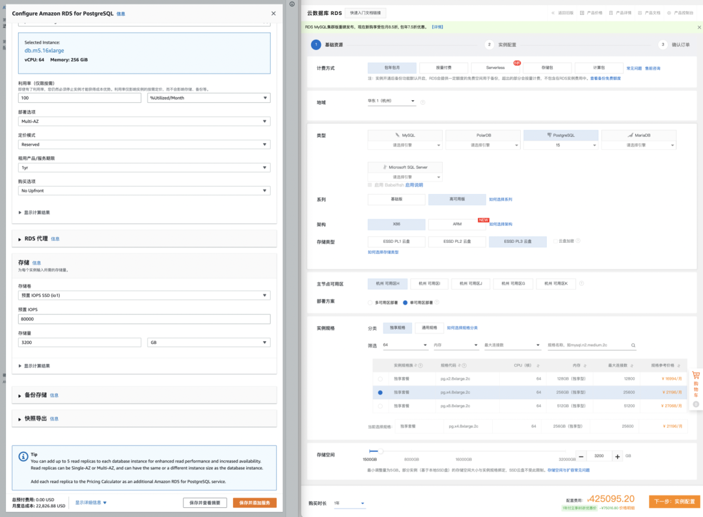
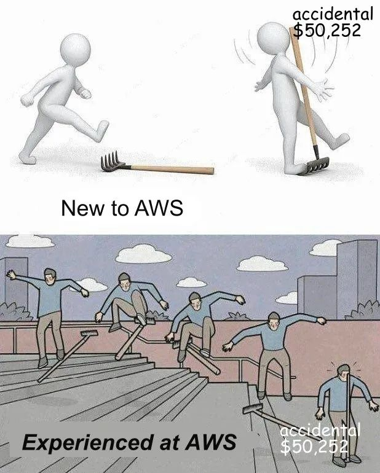
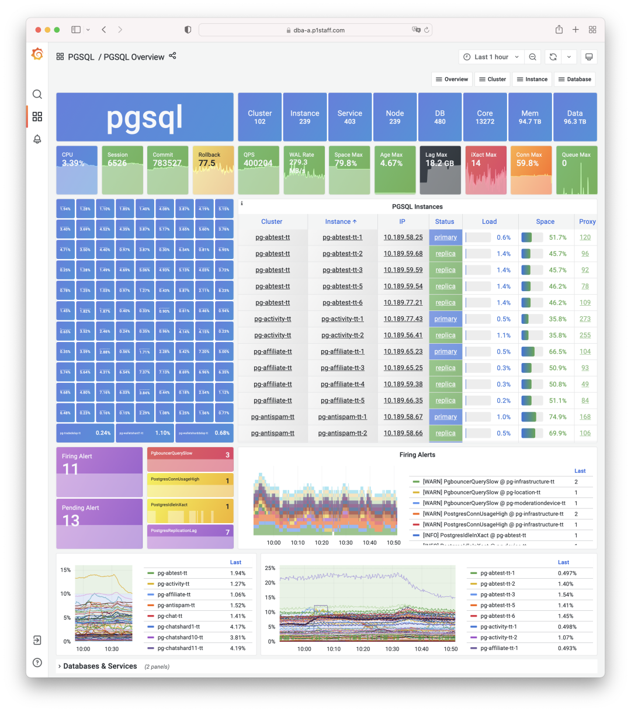
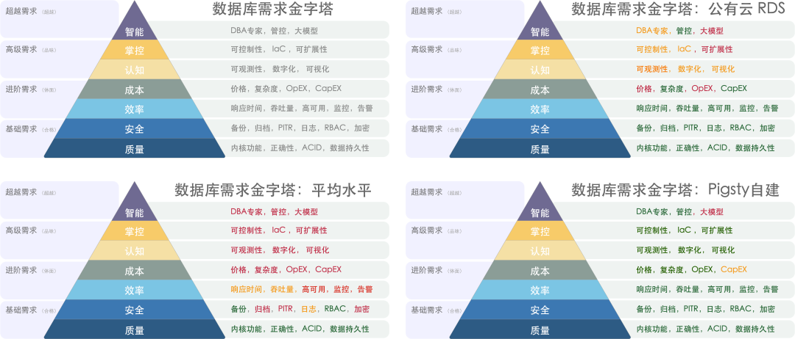
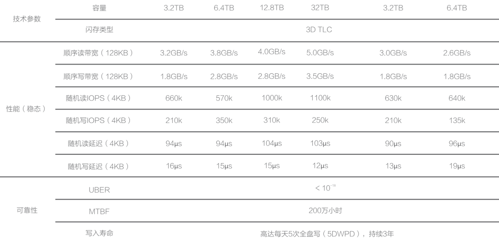
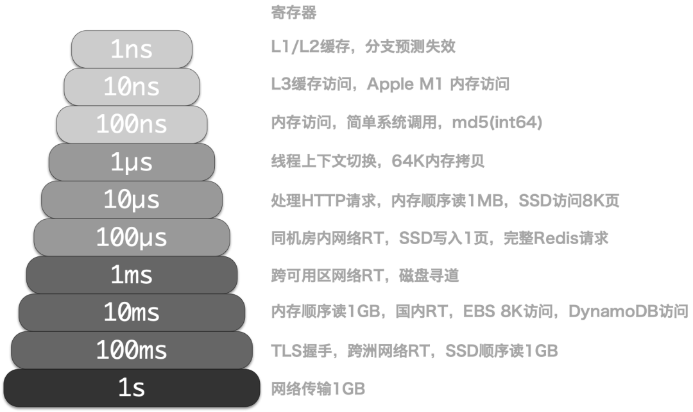
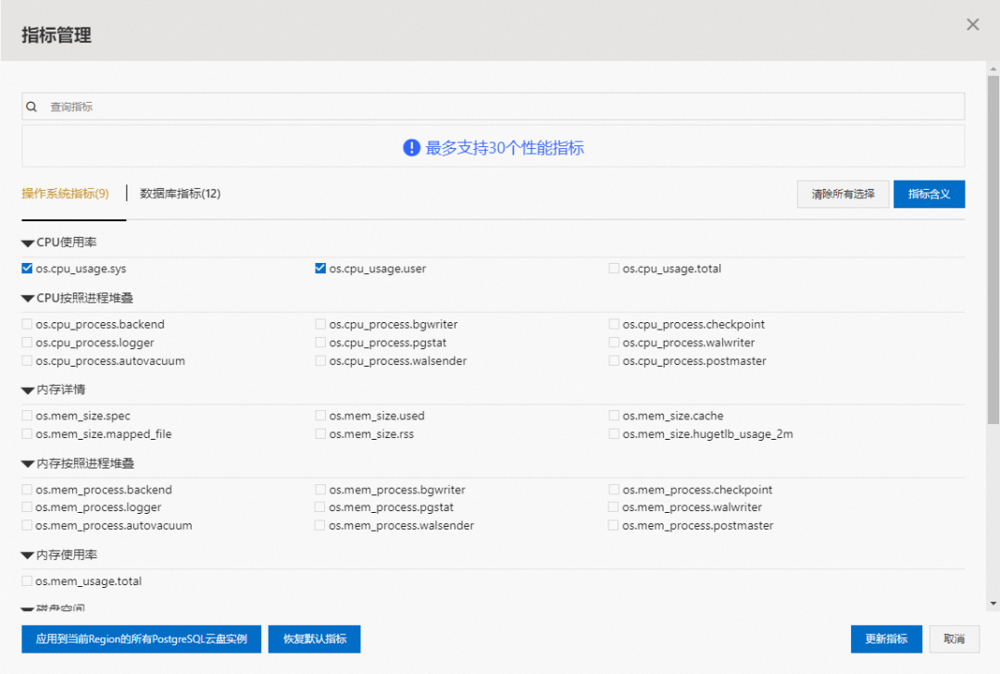
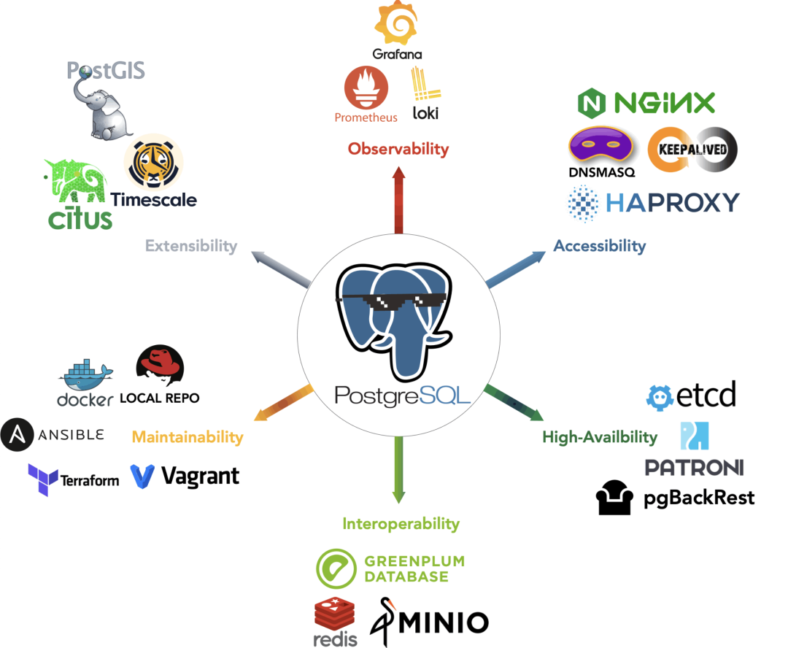
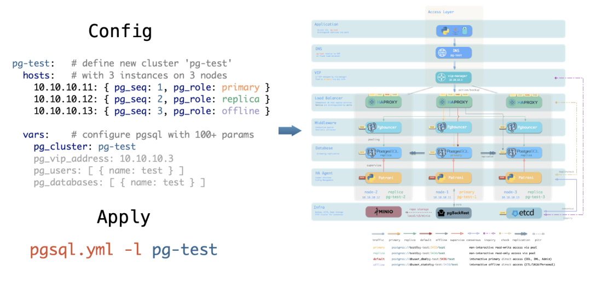
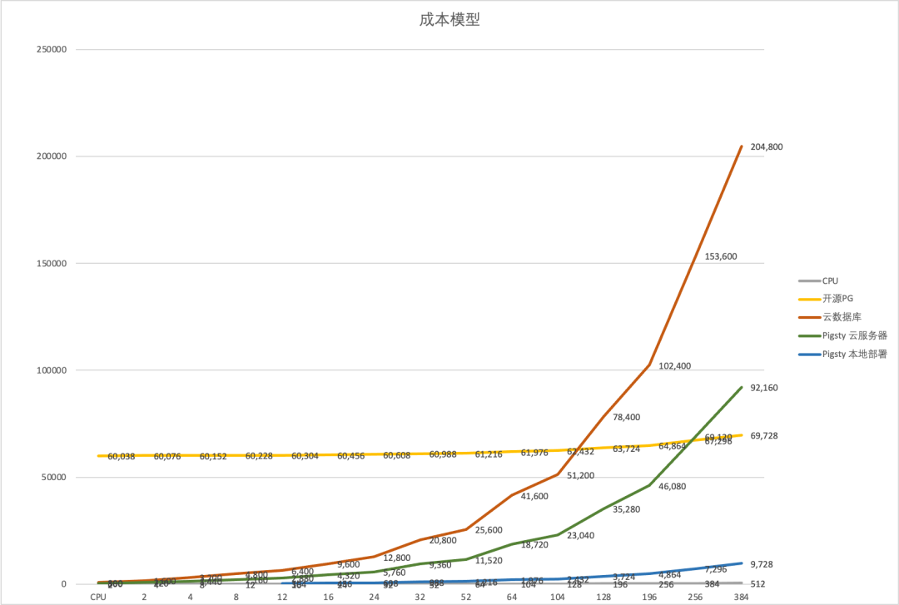

寒冬来袭，大厂纷纷开始裁员，进入降本增效模式，作为公有云杀猪刀一哥的云数据库，故事还能再讲下去吗？

近日，Basecamp & HEY 联合创始人 DHH 的一篇文章【1,2】引起热议，主要内容可以概括为一句话：

> “我们每年在云数据库（RDS/ES）上花50万美元，你知道50万美元可以买多少牛逼的服务器吗？
>
> **我们要下云，拜拜了您呐！“**

**所以，50 万美元可以买多少牛逼的服务器 ？**

---------

## 荒谬定价

> 磨刀霍霍向猪羊

**我们可以换一种问法，服务器和RDS都卖多少钱？**

以我们自己数据库大量使用的物理机型为例：Dell R730， 64核384GB内存，加装一块 3.2 TB MLC的NVME SSD。像这样的一台服务器部署标准的生产级 PostgreSQL，单机可以承载十几万的TPS，只读点查询可以干到四五十万。要多钱呢？算上电费网费IDC托管代维费用，按照5年报废均摊，整个生命周期成本七万五千上下，合每年一万五。当然，如果要在生产中使用，高可用是必须的，所以通常一组数据库集群需要两到三台物理机，也就是每年3万到4.5万。

这里没有算入DBA费用：两三个人管几万核真没多少。

如果您直接购买这样规格的云数据库，则费用几何呢？让我们看看国内阿里云的收费【3】。因为基础版（乞丐版）实在是没法生产实用（请参考：《[云数据库：删库到跑路](http://mp.weixin.qq.com/s?__biz=MzU5ODAyNTM5Ng==&mid=2247485093&idx=1&sn=5815f71f1d832101d35a75f5aa4acd3c&chksm=fe4b337ec93cba68fbf30eb0ed50d052c6e8972d42cf506051b5016668f4555edaa0756688dc&scene=21#wechat_redirect)》），我们选用高可用版，通常底下是两到三个实例。包年包月，引擎 PostgreSQL 15 on x86，华东1默认可用区，独享的64核256GB实例：pg.x4m.8xlarge.2c，并加装一块3.2TB的ESSD PL3云盘。每年的费用在25万（3年）到75万（按需）不等，其中存储费用约占1/3。

让我们再来看看公有云一哥AWS【4】【5】。AWS上与此最接近的是 db.m5.16xlarge ，也是64核256GB多可用区部署，同理，我们加装一块最大8万IOPS，3.2TB的 io1 SSD磁盘，查询AWS全球与国区的报价，总体在每年160 ～ 217万元不等，存储费用约占一半，整体成本如下表所示：

| 付费模式            | 价格              | 折合每年（万¥）  |
|-----------------|-----------------|-----------|
| IDC自建（单物理机）     | ¥7.5w / 5年      | 1.5       |
| IDC自建（2～3台组HA）  | ¥15w / 5年       | 3.0 ~ 4.5 |
| 阿里云 RDS 按需      | ¥87.36/时        | 76.5      |
| 阿里云 RDS 月付（基准）  | ¥4.2w / 月       | 50        |
| 阿里云 RDS 年付（85折） | ¥425095 / 年     | 42.5      |
| 阿里云 RDS 3年付（5折） | ¥750168 / 3年    | 25        |
| AWS 按需          | $25,817 / 月     | 217       |
| AWS 1年不预付       | $22,827 / 月     | 191.7     |
| AWS 3年全预付       | 12w$ + 17.5k$/月 | 175       |
| AWS 中国/宁夏按需     | ¥197,489 / 月    | 237       |
| AWS 中国/宁夏1年不预付  | ¥143,176 / 月    | 171       |
| AWS 中国/宁夏3年全预付  | ¥647k + 116k/月  | 160.6     |

我们可以对比一下自建与云数据库的成本差异：

| 方式                                                                 | 折合每年（万元）  |
|--------------------------------------------------------------------|-----------|
| IDC托管服务器 64C / 384G / 3.2TB NVME SSD 660K IOPS (2～3台)              | 3.0 ~ 4.5 |
| 阿里云 RDS PG 高可用版 pg.x4m.8xlarge.2c, 64C / 256GB / 3.2TB ESSD PL3    | 25 ～ 50   |
| AWS RDS PG 高可用版 db.m5.16xlarge, 64C / 256GB / 3.2TB io1 x 80k IOPS | 160 ～ 217 |

所以问题来了，**如果你用云数据库1年的钱，就够你买几台甚至十几台性能更好的服务器，那么使用云数据库的意义到底在哪里**？当然，公有云的大客户通常可以有商务折扣，但再怎么打折，数量级上的差距也是没法弥补的吧？

**用云数据库到底是不是在交智商税？**

---------

## 适用场景

> 没有银弹

**数据库是数据密集型应用的核心**，应用跟着数据库走，所以数据库选型需要非常审慎。而评价一款数据库需要从许多维度出发：可靠性，安全性，简单性，可伸缩性，可扩展性，可观测性，可维护性，成本性价比，等等等等。甲方真正在意的是这些属性，而不是虚头巴脑的技术炒作：存算分离，Serverless，HTAP，云原生，超融合……，这些必须翻译成工程的语言：**牺牲了什么换来了什么**，才有实际意义。

公有云的鼓吹者很喜欢往给它脸上贴金：节约成本，灵活弹性，安全可靠，是企业数字化转型的万灵药，是汽车对马车的革命，又好又快还便宜，诸如此类，可惜没几条是实事求是的。绕开这些虚头巴脑的东西，云数据库相比专业的数据库服务真正有优势的属性只有一条：**弹性**。具体来说是两点：**启用成本低，可伸缩性强**。

**启动成本低**，意味着用户不需要进行机房建设，人员招聘培训，服务器采购就可以开始用；**可伸缩性强**，指的是各种配置升降配，扩缩容比较容易；因此公有云真正适用的场景核心就是这两种：

1. **起步阶段，流量极小的简单应用**
2. **毫无规律可循，大起大落的负载**

前者主要包括简单网站，个人博客，小程序小工具，演示/PoC，Demo，后者主要包括低频的的数据分析/模型训练，突发的秒杀抢票，明星并发出轨等特殊场景。

**公有云的商业模型就是租赁**：租服务器，租带宽，租存储，租专家。它和租房，租车，租充电宝没有本质区别。当然，租服务器和运维外包实在是不怎么中听，所以有了云这个名字，听起来更有赛博地主的感觉。而租赁这种模式的特点，就是弹性。

**租赁模型有租赁的好处**，出门在外，共享充电宝可以解决临时应急性的小规模充电需求。但对于大量日常从家到单位两点一线的人来说，每天用共享充电宝给手机电脑充电，毫无疑问是非常荒谬的，何况共享充电宝租一个小时4块钱，租几个小时的钱，就够你把它直接买下来了。租车可以很好的满足临时的、突发的、一次性用车需求：外地出差旅游，临时拉一批货。但如果你的出行需求是频繁的，本地性，那么购置一辆自动驾驶的车也许是最省事省钱的选择。

**问题的关键还是在于租售比**，房子的租售比几十年，汽车的租售几年，而公有云服务器的租售比通常只有几个月。如果你的业务能够稳定活几个月以上，为什么要租，而不是直接买呢？

所以，云厂商赚的钱，要么来自VC砸钱求爆发增长的科技创企，要么来自灰色寻租空间比云溢价还高的特殊单位，要么是人傻钱多的狗大户，要么是零零散散的站长/学生/VPN个人用户。聪明的高净值企业客户，谁会放着便宜舒适的大House不住，跑去挤着租住方舱医院人才公寓呢？

**如果您的业务符合公有云的适用光谱，那是最好不过；但为了不需要的灵活性与弹性支付几倍乃至十几倍溢价，那是纯交智商税****。**

---------

## 成本刺客

> 任何信息不对称都可以构成盈利空间，但你无法永远欺骗所有人。

公有云的弹性就是针对其商业模式设计的：**启动成本极低，维持成本极高**。低启动成本吸引用户上云，而且良好的弹性可以随时适配业务增长，可是业务稳定后形成供应商锁定，尾大不掉，极高的维持成本就会让用户痛不欲生了。这种模式有一个俗称 —— **杀猪盘**。

在我职业生涯的第一站中，就有这样一次杀猪经历让我记忆犹新。作为前几个被逼上A云的内部BU，A云直接出工程师加入手把手提供上云服务。用ODPS全家桶换掉了自建的大数据/数据库全家桶。应该说，服务确实不错，只不过，每年的存储计算开销从千万出头飙升到接近一亿，利润几乎都转移到A云了，堪称终极成本刺客。

后来在下一站，情况则完全不同。我们管理着两万五千核规模，450W QPS的 PostgreSQL 与 Redis 数据库集群。像这种规格的数据库，如果按AWS RCU/WCU 计费，每年几个亿就出去了；即使全买长期包年包月再加个大商务折扣，至少五六千万是肯定是少不了的。而我们总共两三个DBA，几百台服务器，人力+资产均摊每年统共不到一千万。

这里我们可以用一种简单的方式来核算单位成本：一核算力（含mem/disk）使用一个月的综合成本，简称**核·月**。我们核算过自建各机型的成本，以及云厂商给出的报价，大致结果如下：

|               硬件算力                |  单价   |
|:---------------------------------:|:-----:|
|    IDC自建机房（独占物理机 A1: 64C384G）     |  19   |
|     IDC自建机房（独占物理机 B1: 40C64G）     |  26   |
|     IDC自建机房（独占物理机 C2: 8C16G）      |  38   |
|        IDC自建机房（容器，超卖200%）         |  17   |
|        IDC自建机房（容器，超卖500%）         |   7   |
|      UCloud 弹性虚拟机（8C16G，有超卖）      |  25   |
|       阿里云 弹性服务器 2x内存（独占无超卖）       |  107  |
|       阿里云 弹性服务器 4x内存（独占无超卖）       |  138  |
|       阿里云 弹性服务器 8x内存（独占无超卖）       |  180  |
|  AWS C5D.METAL 96C 200G (按月无预付)   |  100  |
|   AWS C5D.METAL 96C 200G(预付3年)    |  80   |
|              **数据库**              |       |
|   AWS RDS PostgreSQL db.T2 (4x)   |  440  |
|   AWS RDS PostgreSQL db.M5 (4x)   |  611  |
|  AWS RDS PostgreSQL db.R6G (8x)   |  786  |
| AWS RDS PostgreSQL db.M5 24xlarge | 1328  |
|        阿里云 RDS PG 2x内存（独占）        |  260  |
|        阿里云 RDS PG 4x内存（独占）        |  320  |
|        阿里云 RDS PG 8x内存（独占）        |  410  |
|            ORACLE数据库授权            | 10000 |

所以这里问题就来了，单价二十块的服务器硬件，为什么可以卖出上百块，而且装上云数据库软件还可以再翻几番？**运维是金子做的，还是服务器是金子做的？**

常用的回应话术是：***数据库是基础软件里的皇冠明珠，凝聚着无数无形知识产权BlahBlah***。因此软件的价格远超硬件非常合理。如果是 Oracle 这样的顶尖商业数据库，或者索尼任天堂的主机游戏，这么说也过得去。

但公有云上的云数据库（RDS for PostgreSQL/MySQL/....），本质上是开源数据库内核换皮魔改封装，加上自己管控软件和共享DBA人头服务。那这种溢价率就非常荒谬了：数据库内核是免费的呀，**你家管控软件是金子做的，还是DBA是金子做的？**

**公有云的秘密就在这里：****用廉价的存算资源获客，用云数据库杀猪****。**

尽管国内公有云 IaaS （存储、计算、网络）的收入占营收接近一半，但毛利率只有 15% ～ 20%，而公有云 PaaS 的营收虽然不如 IaaS，但 PaaS 的毛利率可以达到 50%，完爆卖资源吃饭的 IaaS 。**而 PaaS 中最具代表性的，就是云数据库**。

正常来说，如果不是把公有云单纯当作一个 IDC 2.0 或者 CDN供应商来用，最费钱的服务就是数据库。公有云上的存储、计算、网络资源贵吗？严格来说不算特别离谱。IDC托管物理机代维的核月成本大约为二三十块，而公有云上一核 CPU 算力用一个月的价格，大概在七八十块到一两百块，考虑到各种折扣与活动，以及弹性溢价，勉强处在可以接受的合理范围。

但云数据库就非常离谱了，同样是一核算力用一个月，云数据库价格比起对应规格的硬件可以翻几倍乃至十几倍。便宜一些阿里云，核月单价两百到四百，贵一些的 AWS，核月单价可以七八百甚至上千。

如果说您只有一两核的 RDS ，那也别折腾了，交点税就交点吧。但如果您的业务上了量还不赶紧从云上下来，那可真的是在交智商税了。

------------------

## 足够好吗？

> 不要误会，云数据库只是及格品大锅饭。

关于云数据库/云服务器的成本，如果您能跟销售聊到这儿，话术就该变成：***虽然我们贵，但是我们好呀！***

**但是，云数据库真的好吗？**

应该说，对于玩具应用，小微网站，个人托管，以及土法野路子自建数据库来，毫无技术认知的甲方来说，RDS也许足够好了。但在高净值客户与数据库专家看来，RDS不过是及格线上的大锅饭产品罢了。

说到底，公有云源于大厂内部的运维能力外溢，大厂人自己厂里技术啥样门儿清，大可不必有啥莫名的崇拜。（Google也许算个例外）。

以 **性能** 为例，性能的核心指标是 **延迟 / 响应时间**，特别是长尾延迟，会直接影响用户体验：没有人愿意等着划一下屏幕转几秒圈圈。而在这一点上，**磁盘**起到决定性作用。

我们生产环境数据库中使用的是本地 NVME SSD，典型4K写延迟为15µs，读延迟94µs。因而，PostgreSQL简单查询的响应时间通常为 100 ~ 300µs，应用侧的查询响应时间通常为 200 ~ 600µs；对于简单查询，我们的 SLO 是命中1ms内，未命中10ms内，超过10ms算慢查询，要打回去优化。

而 AWS 提供的EBS服务用fio实测性能极其拉垮【6】，默认的gp3读写延迟为 40ms，io1 读写延迟为10ms，整整差了近三个数量级，而且IOPS最大也只有八万。RDS使用的存储就是EBS，如果连一次磁盘访问都需要10ms，那这就根本没法整了。io2 倒是使用了自建同款 NVMe SSD，然而远程块存储相比本地磁盘延迟直接翻倍。

确实，有时候云厂商会提供性能足够好的本地的NVME SSD，但都会非常鸡贼的设定各种限制条件，来避免用户来使用EC2来自建数据库。AWS的限制方式是只有NVME SSD Ephemeral Storage，这种盘一旦遇上EC2重启就自动抹干净了，根本没法用。阿里云的限制方式是给你卖天价，相比直接采购硬件，**阿里云的 ESSD PL3 则高达 200 倍**。以 3.2TB 规格的企业级 PCI-E SSD 卡为参照基准，AWS 上售租比为 1个月，阿里云上为 9 天，租用此时长即可买下整块磁盘。若在阿里云以采购三年最大优惠五折计算，租用三年的时间可购买 123 块同款硬盘近 400TB 永久所有权。

**再以** **可观测性** **为例，没有一家RDS的监控能称得上是“好”**。就以监控指标数量来说吧，虽然说知道服务死了还是活着只需要几个指标，但如果想进行故障根因分析，需要越多越好的监控指标来构建良好的Context。而大多数RDS都只是做了一些基本的监控指标，和简陋到可怜的监控面板。以阿里云RDS PG为例【7】，所谓的“增强监控”，里面只有这么点可怜的指标 ， AWS里和PG数据库相关的指标也差不多不到100个，而我们自己的监控系统里主机指标有800多类，PGSQL数据库指标610类，REDIS指标257类，整个大约三千类指标，在数量上完爆这些RDS。

> 公开 [Demo](https://demo.pigsty.cc)：https://demo.pigsty.cc

至于**可靠性**，以前我对RDS的可靠性还抱有基本的信任，直到一个月前A云香港机房那场丑闻。租的机房，服务器喷水消防，OSS故障，大量RDS不可用也切不了；然后A云自己整个Region的管控服务竟然因为一个单AZ的故障自己挂点了，**连自己的管控API都做不到异地容灾，那做云数据库异地容灾岂不是天大的笑话**。

当然，并不是说自建就不会出现这些问题，只是稍微靠谱点的IDC托管都不至于犯这么离谱的错误。安全性也不用多说，最近闹的出过的几次大笑话，比如著名的SHGA；一堆样例代码里硬编码AK/SK，云RDS更安全吗？别搞笑啦，经典架构起码还有VPN堡垒机扛着一层，而公网上暴露端口弱密码裸奔的数据库简直不要太多，攻击面肯定是更大了无疑。

**云数据库另一个广为人所诟病的是其可扩展性**。RDS是不给用户 dbsu 权限的，这也意味着用户是不能在数据库中安装扩展插件，而 PostgreSQL 的插件恰恰就是其醍醐味，没有扩展的PostgreSQL就像可乐不加冰，酸奶不加糖一样。更严重的问题是**在一些故障出现时，用户甚至都丧失了自我救助的能力**，参见《[云数据库：从删库到跑路](http://mp.weixin.qq.com/s?__biz=MzU5ODAyNTM5Ng==&mid=2247485093&idx=1&sn=5815f71f1d832101d35a75f5aa4acd3c&chksm=fe4b337ec93cba68fbf30eb0ed50d052c6e8972d42cf506051b5016668f4555edaa0756688dc&scene=21#wechat_redirect)》中的真实案例：WAL归档与PITR这么基础性的功能，在RDS中竟然是一个付费的升级功能。至于可维护性，有些人说云数据库可以点点鼠标就创建销毁多方便呀，说这话的人肯定没经历过重启每个数据库都要收手机短信验证码的山炮场景。**有 Database as Code 式的管理工具，真正的工程师绝对不会用这种“ClickOps”**。

不过任何事物存在都有其道理，云数据库也不是一无是处，在**可伸缩性**上，云数据库确实卷出了新高度，比如各种 Serverless 的花活，但这也是给云厂商自己省钱超卖用的，对用户来说确实没有太大意义。

------------------

## 淘汰DBA？

> 被云厂商垄断，想招都找不到，还淘汰？

**云数据库的另一种鼓吹思路是，用了RDS，你就不用DBA啦！**

例如这篇知名点炮文《[你怎么还在招聘DBA](https://mp.weixin.qq.com/s/DtRFnh8LgtfesCNMNl3eNw)》【8】里说：我们有数据库自治服务！RDS和DAS能帮你解决这些数据库相关的问题，DBA都要下岗了，哈哈哈哈。我相信任何认真看过这些所谓“自治服务”，“AI4DB”官方文档【9】【10】的人都不会相信这种鬼话：**连一个足够好用的监控系统都算不上的小模块，能让数据库自治起来，这不是在说梦话？**

DBA，Database Administrator，数据库管理员，以前也叫做数据库协调员、数据库程序员。DBA是一个横跨于研发团队与运维团队的广博角色，涉及DA、SA、Dev、Ops、以及SRE的多种职责，负责各种与数据与数据库有关的问题：设置管理策略与运维标准，规划软硬件架构，协调管理数据库，验证表模式设计，优化SQL查询，分析执行计划，乃至于处理紧急故障以及抢救数据。

**DBA的第一点价值在于安全兜底**：**他是企业核心数据资产的守护者，也是可以轻易对企业造成致命伤害的人**。在蚂蚁金服有个段子，能搞死支付宝的，除了监管就是DBA了。高管们通常也很难意识到 DBA 对于公司的重要性，直到出了数据库事故，一堆CXO紧张地站在DBA背后观看救火修复过程时…。比起避免一场数据库故障所造成的损失，例如：全美停航，Youtube宕机，工厂停产一天，雇佣DBA的成本显得微不足道。

**DBA的第二点价值在于模型设计与优化**。许多公司并不在乎他们的查询是纯狗屎，他们只是觉得“硬件很便宜”，砸钱买硬件就好了。然而问题在于，一个调整不当的查询/SQL或设计不当的数据模型与表结构，可以对性能产生几个数量级的影响。总会在某一个规模，堆硬件的成本相比雇佣一个靠谱DBA的成本高得令人望而却步。实话说，**我认为大多数公司在IT软硬件开销中花费最大的是：开发人员没有正确使用数据库**。

**DBA的基本功是管理DB，但灵魂在于A**：Administration ，如何管住研发人员创造的熵，需要的可不仅仅是技术。“自治数据库”也许可以帮助你分析负载创建索引，但没有任何可能帮你理解业务需求，去Push业务去优化表结构，而这一点在未来的二三十年里，都看不到任何被云替代的可能。

无论是公有云厂商，还是以Kubernetes为代表的云原生/私有云，或者是类似 Pigsty 【11】这样的本地开源RDS替代，**其核心价值都在于****尽可能多地使用软件，而不是人来应对系统复杂度**。那么，**云软件会革了运维与DBA的命吗**？

**云并不是什么都不用管的运维外包魔法**。根据复杂度守恒定律，无论是系统管理员还是数据库管理员，管理员这个岗位消失的唯一方式是，它们被重命名为“DevOps Engineer”或SRE。**好的云软件可以帮你屏蔽运维杂活，解决70%的日常高频问题，然而总是会有那么一些复杂问题只有人才能处理**。你可能需要更少的人手来打理这些云软件，但总归还是需要人来管理【12】。毕竟，**你也需要懂行的人来协调处理，才不至于被云厂商嘎嘎割韭菜当傻逼。**

**在大型组织中，一个好的DBA是至关重要的**。然而优秀的DBA相当稀有，供不应求，以至于这个角色在大多数组织中只能外包：包给专业的数据库服务公司，包给云数据库RDS服务团队。找不到DBA供应的组织只能将这个职责 **内包** 给自己的研发/运维人员，直到公司的规模足够大，或者吃到足够的苦头之后，一些Dev/Ops才会培养出相应的能力来。

**DBA不会被淘汰，只会被集中到云厂商中垄断提供服务。**

------------------

## 垄断阴影

> 在2020年，计算自由的敌人是云计算软件。

**比起“淘汰DBA”，云的出现蕴含着更大的威胁**。我们需要担心的是这样一幅图景：公有云（或果子云）坐大，控制硬件与运营商上下游，垄断计算，存储，网络，顶尖专家资源，形成事实标准。假如所有顶级DBA都被挖到云厂商去集中提供共享专家服务，普通的企业组织就彻底失去了用好数据库的能力，最终只能选择被公有云收税杀猪。最终，所有IT资源集中于云厂商，只要控制住这几个关键少数，就可以控制整个互联网。这毫无疑问与互联网诞生的初衷相悖。

引用 DDIA 作者 Martin Kelppmann 的一段话【13】来说：

> **在2020年，计算自由的敌人是云计算软件**
>
> —— 即主要在供应商的服务器上运行的软件，而你的所有数据也存储在这些服务器上。这些“云软件”也许有一个客户端组件（手机App，网页App，跑在你浏览器中的JavaScript），但它们只能与供应商的服务端共同工作。而云软件存在很多问题：
>
> - 如果提供云软件的公司倒闭，或决定停产，软件就没法工作了，而你用这些软件创造的文档与数据就被锁死了。对于初创公司编写的软件来说，这是一个很常见的问题：这些公司可能会被大公司收购，而大公司没有兴趣继续维护这些初创公司的产品。
> - 谷歌和其他云服务可能在没有任何警告和追索手段的情况下，突然暂停你的账户。例如，您可能在完全无辜的情况下，被自动化系统判定为违反服务条款：其他人可能入侵了你的账户，并在你不知情的情况下使用它来发送恶意软件或钓鱼邮件，触发违背服务条款。因而，你可能会突然发现自己用Google Docs或其它App创建的文档全部都被永久锁死，无法访问了。
> - 而那些运行在你自己的电脑上的软件，即使软件供应商破产了，它也可以继续运行，直到永远。（如果软件不再与你的操作系统兼容，你也可以在虚拟机和模拟器中运行它，当然前提是它不需要联络服务器来检查许可证）。例如，互联网档案馆有一个超过10万个历史软件的软件集锦，你可以在浏览器中的模拟器里运行！相比之下，如果云软件被关闭，你没有办法保存它，因为你从来就没有服务端软件的副本，无论是源代码还是编译后的形式。
> - 20世纪90年代，无法定制或扩展你所使用的软件的问题，在云软件中进一步加剧。对于在你自己的电脑上运行的闭源软件，至少有人可以对它的数据文件格式进行逆向工程，这样你还可以把它加载到其他的替代软件里（例如OOXML之前的微软Office文件格式，或者规范发布前的Photoshop文件）。有了云软件，甚至连这个都做不到了，因为数据只存储在云端，而不是你自己电脑上的文件。
>
> **如果所有的软件都是免费和开源的，这些问题就都解决了**。然而，开源实际上并不是解决云软件问题的必要条件；即使是闭源软件也可以避免上述问题，只要它运行在你自己的电脑上，而不是供应商的云服务器上。请注意，互联网档案馆能够在没有源代码的情况下维持历史软件的正常运行：如果只是出于存档的目的，在模拟器中运行编译后的机器代码就够了。也许拥有源码会让事情更容易一些，但这并不是关键，**最重要的事情，还是要有一份软件的副本**。
>
> 我和我的合作者们以前曾主张过**本地优先软件**的概念，这是对云软件的这些问题的一种回应。本地优先的软件在你自己的电脑上运行，将其数据存储在你的本地硬盘上，同时也保留了云计算软件的便利性，比如，实时协作，和在你所有的设备上同步数据。开源的本地优先的软件当然非常好，但这并不是必须的，本地优先软件90%的优点同样适用于闭源的软件。云软件，而不是闭源软件，才是对软件自由的真正威胁，原因在于：**云厂商能够突然心血来潮随心所欲地锁定你的所有数据，其危害要比无法查看和修改你的软件源码的危害大得多**。因此，普及本地优先的软件显得更为重要和紧迫。

有力就会有反作用力，与云软件相对应的本地优先软件开始如雨后春笋一般出现。例如，以Kubernetes为代表的 Cloud Native 运动就是一例。“Cloud Native”，云厂商将 Native 解释 “原生”：“原生诞生在公有云环境里的软件”；而其真正的含义应为 “本地”，即与 Cloud 相对应的 “Local” —— 本地云 / 私有云 / 专有云 / 原生云，叫什么不重要，重要的是它运行在用户想运行的任何地方（包括云服务器），而不是仅仅是公有云所独有！

以 K8S为代表的开源项目，将原本公有云才有的资源调度/智能运维能力普及到所有企业中，让企业在本地也可以运行起‘云’一样的能力。对于无状态的应用来说，它已经是一个足够好的 “云操作系统” 内核。Ceph/Minio也提供了 S3 对象存储的开源替代，只有一个问题仍然没有答案，有状态的，生产级的数据库服务如何管理与部署？

时代在呼唤 RDS 的开源替代物。

------------------

## 解决方案

> Pigsty —— 开源免费，开箱即用，更好的 RDS PG 替代

我希望，未来的世界人人都有自由使用优秀服务的事实权利，而不是只能被圈养在几个公有云厂商提供的猪圈（Pigsty）里吃粑粑。这就是我要做 Pigsty 的原因 —— **一个更好的，开源免费的 PostgreSQL RDS替代**。让用户能够在任何地方（包括云服务器）上，一键拉起有比云RDS更好的数据库服务。

Pigsty 是是对 PostgreSQL 的彻底补完，**更是对云数据库的辛辣嘲讽**。它本意是“猪圈”，但更是 Postgres In Great STYle 的缩写，即“**全盛状态下的 PostgreSQL**”。它是一个完全基于开源软件的，可以运行在任何地方的，浓缩了 PostgreSQL 使用管理最佳实践的 Me-Better  RDS 开源替代。用真实世界的大规模，高标准 PostgreSQL 集群打磨而来的解决方案，它是为了满足探探自己管理数据库的需求而生，在八个维度上进行了许多有价值的工作：

**可观测性（Observability）是天；天行健君子以自强不息**；Pigsty使用现代可观测性技术栈为 PostgreSQL 打造了一款无与伦比的监控系统，从全局大盘概览到单个表/索引/函数等对象的秒极历史详情指标一览无遗，让用户对系统能够做到洞若观火，进而掌控一切。此外，Pigsty的监控系统还可以独立使用，监控第三方数据库实例。

**可控制性（Controllability）是地；地势坤君子以厚德载物**；Pigsty提供Database as Code的能力：使用表现力丰富的声明式接口描述数据库集群的状态，并使用幂等的剧本进行部署与调整。让用户拥有精细定制的能力的同时又无需操心实现细节，解放心智负担，让数据库操作与管理的门槛从专家级降低到新手级。

**可伸缩性（Scalability）是水；水洊至习坎君子以常德行**；Pigsty提供预制通用调参模板（OLTP / OLAP / CRIT / TINY），自动优化系统参数，并可通过级联复制无限扩展只读能力，也使用Pgbouncer连接池优化海量并发连接；Pigsty确保 PostgreSQL 的性能可以在现代硬件条件下充分发挥：单机可达数万并发连接/百万级单点查询QPS/十万级单条写入TPS。

**可维护性（Maintainability）是火；明两作离大人以继明照于四方**；Pigsty 允许在线摘除添加实例以扩缩容，Switchover/滚动升级进行升降配，提供基于逻辑复制的不停机迁移方案，将维护窗口压缩至亚秒级，让系统整体的可演化性，可用性，可维护性提高到一个新的水准。

**安全性（Security）是雷；洊雷震君子以恐惧修省**；Pigsty提供了一套遵循最小权限原则的访问控制模型，并带有各种安全特性开关：流复制同步提交防丢失，数据目录校验和防腐败，网络流量SSL加密防监听，远程备份AES-256防泄漏。只要物理硬件与密码安全，用户无需担心数据库的安全性。

**简单性（Simplicity）是风；随风巽君子以申命行事**；使用Pigsty的难度不会超过任何云数据库，它旨在以最小的复杂度成本交付完整的RDS功能，模块化设计允许用户自行组合选用所需的功能。Pigsty提供基于Vagrant的本地开发测试沙箱，与Terraform的云端IaC一键部署模板，让您在任意新EL节点上一键完成离线安装，完整复刻环境。

**可靠性（Reliability）是山；兼山艮君子以思不出其位**；Pigsty提供了故障自愈的高可用架构应对硬件问题，也提供开箱即用的PITR时间点恢复为人为删库与软件缺陷兜底，并通过长时间、大规模的生产环境运行与高可用演练验证其可靠性。

**可扩展性（Extensibility）是泽：丽泽兑君子以朋友讲习**；Pigsty深度整合PostgreSQL生态核心扩展PostGIS、TimescaleDB、Citus 、PGVector、以及大量扩展插件；Pigsty提供模块化设计的Prometheus/Grafana可观测性技术栈，以及MINIO，ETCD，Redis、Greenplum 等组件的监控与高可用部署与PostgreSQL 组合使用；

**更重要的是，Pigsty是完全开源免费的自由软件**，采用 AGPL v3.0 协议。我们用爱发电，而您可以用几十块核·月的纯硬件成本，跑起运行功能完备甚至更好的RDS服务。无论你是初心者还是资深DBA，无论你管理着上万核的大集群还是1核2G的小水管，无论你已经用了RDS还是在本地搭建过数据库，只要你是 PostgreSQL 用户，Pigsty都会对您有所帮助，完全免费。**您可以专注于业务中最有趣或最有价值的部分，将杂活丢给软件来解决**。

尽管Pigsty 本身旨在用数据库自动驾驶软件替代人肉数据库运维，但正如上所述，再好的软件也没法解决 100% 的问题。总会有一些的冷门低频疑难杂症需要专家介入处理。我们提供免费的社区答疑，如果您觉得安装使用维护有困难，需要下云迁移或者疑难杂症兜底，我们也提供顶尖的数据库专家咨询服务，性价比相对公有云数据库的[工单/SLA](/cloud/sla/)极有竞争力。Pigsty帮助用户用好 PostgreSQL，而我们帮助用户用好 Pigsty。

Pigsty简单易用，人力成本与复杂度RDS持平，但资源成本差异确是天翻地覆。且不说自建机房的20块和几百块的云数据库怎么比，考虑到 RDS 对比同规格 EC2 都有几倍的溢价，您完全可以折中：使用云服务器部署 Pigsty RDS，既保留了云的弹性，又可以原地省掉五六成开销。如果是IDC自建或者代维，成本砍掉90%都不一定打得住。

> RDS成本与规模成本曲线

Pigsty 允许您践行最终极的 FinOps 理念 —— 用几乎接近于纯资源的价格，在任何地方（ECS，资源云，机房服务器甚至本地笔记本虚拟机）运行生产级的 PostgreSQL RDS 数据库服务。**让云数据库的能力成本，从正比于资源的边际成本，变为约等于0的固定学习成本**。

**如果您可以用几分之一的成本来使用更好的 RDS 服务，那么再用云数据库就真的是纯纯的智商税了。**

------------------

## Reference

【1】[为什么我们要离开云](https://world.hey.com/dhh/why-we-re-leaving-the-cloud-654b47e0)

【2】[上云“被坑”十年终放弃，寒冬里第一轮“下云潮”要来了？](https://www.infoq.cn/article/qoq3v6jfenwwzmpg4fre)

【3】[阿里云RDS for PostgreSQL定价](https://rdsbuy.console.aliyun.com/create/rds/PostgreSQL)

【4】[AWS Pricing Calculator](https://calculator.aws/#/addService/RDSPostgreSQL)

【5】 [AWS Pricing Calculator](https://calculator.amazonaws.cn/#/?trk=pricing-ban) （中国宁夏）

【6】[FIO 测试 AWS EBS性能](https://github.com/Vonng/pgtpc/blob/master/fio/aws-ebs-bench.md)

【7】[阿里云RDS PG 增强监控](https://help.aliyun.com/document_detail/299200.html)

【8】[你为什么还在招DBA](https://mp.weixin.qq.com/s/DtRFnh8LgtfesCNMNl3eNw)

【9】[阿里云RDS PG 数据库自治服务](https://help.aliyun.com/document_detail/159166.html)

【10】[OpenGauss AI for DB](https://docs.opengauss.org/zh/docs/3.0.0/docs/Developerguide/AI4DB-数据库自治运维.html)

【11】[Me-Better RDS PostgreSQL 替代 Pigsty](https://pigsty.cc/)

【12】[Pigsty v2 正式发布：更好的RDS PG开源替代](https://mp.weixin.qq.com/s/9lceZdyUZU9AzsqlAcpjTA)

【13】[是时候和GPL说再见了](https://mp.weixin.qq.com/s/DJsDRO18saZaxe3oyzzYrA)

【14】[云数据库是不是智商税？](https://mp.weixin.qq.com/s/c8bpK4o3H7-EyRqVdNDndQ)

【15】[大厂裁员轰轰烈烈，哪个技术岗位可以独善其身？](https://mp.weixin.qq.com/s/rtx4UWkuvrKf7gtd6pFr-A)

【16】[蹭个热度--要不要DBA和云数据库](https://mp.weixin.qq.com/s/UZVoQxFYbG7WlJ1JC-gclQ)

【17】[你怎么不招DBA](https://mp.weixin.qq.com/s/LFnWliDxPQnVePkDWsIVag)

【18】[DBA还是一份好工作吗？](https://mp.weixin.qq.com/s/Py3o31w3db5E9FsviAZeCA)

【19】[云RDS：从删库到跑路](https://mp.weixin.qq.com/s/AGEW1iHQkQy4NQyYC2GonQ)
