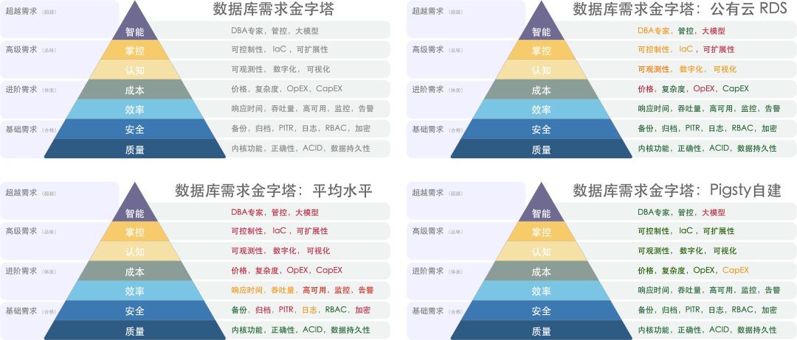
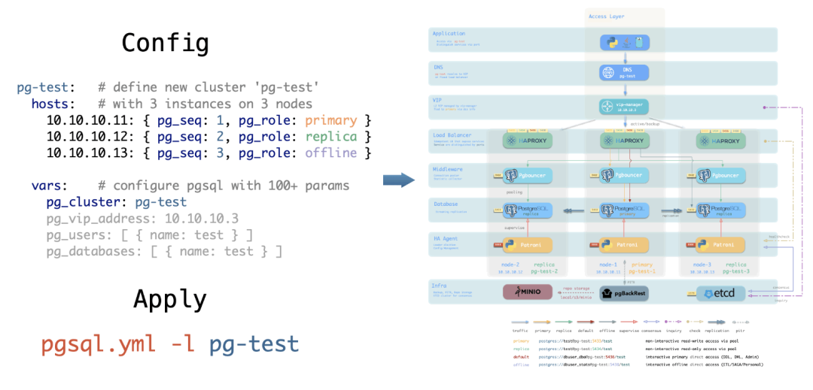

As the season of layoffs hits big tech companies, cost-cutting and efficiency are top of mind. Public cloud databases, often referred to as the "slaughterhouse knives" of the cloud, are under increasing scrutiny. The question now is: *Can their dominance continue?*

Recently, DHH (David Heinemeier Hansson), co-founder of Basecamp and HEY, published a thought-provoking piece that has sparked a lot of debate. His core message is succinct:

> "We spend \$500,000 a year on cloud databases (RDS/ES). Do you know how many powerful servers that kind of money could buy?
>
> **We’re off the cloud. Goodbye!**"

**So, How Many Powerful Servers Could $500,000 Buy?**

---------

## Absurd Pricing

> Sharpening the knives for the sheep and pigs

**Let's rephrase the question: how much do servers and RDS (Relational Database Service) cost?**

Taking the physical server model we heavily use as an example: Dell R730, 64 cores, 384GB of memory, equipped with a 3.2 TB MLC NVME SSD. A server like this, running a standard production-level PostgreSQL, can handle up to hundreds of thousands of TPS (Transactions Per Second), and read-only queries can reach four to five hundred thousand. How much does it cost? Including electricity, internet, IDC (Internet Data Center) hosting, and maintenance fees, and amortizing the cost over a 5-year depreciation period, the total lifecycle cost is around seventy-five thousand, or fifteen thousand per year. Of course, for production use, high availability is a must, so a typical database cluster would need two to three physical servers, amounting to an annual cost of thirty to forty-five thousand dollars.

This calculation does not include the cost of DBA (Database Administrator) salaries: managing tens of thousands of cores with just two or three people is not that expensive.

If you directly purchase a cloud database of this specification, what would the cost be? Let's look at the pricing from Alibaba-Cloud in China. Since the basic version is practically unusable for production (for reference, see: "Cloud Database: From Deletion to Desertion"), we'll choose the high-availability version, which usually involves two to three instances. Opting for a yearly or monthly subscription, for an exclusive use of a 64-core, 256GB instance with PostgreSQL 15 on x86 in East China 1 availability zone, and adding a 3.2TB ESSD PL3 cloud disk, the annual cost ranges from 250,000 (for a 3-year contract) to 750,000 (on-demand), with storage costs accounting for about a third.

Let's also consider AWS, the leading public cloud provider. The closest equivalent on AWS is the db.m5.16xlarge, also with 64 cores and 256GB across multiple availability zones. Similarly, we add a 3.2TB io1 SSD disk with up to 80,000 IOPS, and review the global and China-specific pricing from AWS. The overall cost ranges from 1.6 million to 2.17 million yuan per year, with storage costs accounting for about half. The table below summarizes the costs:

| Payment Model                            | Price                | Cost Per Year (¥10k) |
|------------------------------------------|----------------------|----------------------|
| Self-hosted IDC (Single Physical Server) | ¥75k / 5 years       | 1.5                  |
| Self-hosted IDC (2-3 Server HA Cluster)  | ¥150k / 5 years      | 3.0 ~ 4.5            |
| AWS (On-demand)                          | $25,817 / month      | 217                  |
| AWS (1-year, no upfront)                 | $22,827 / month      | 191.7                |
| AWS (3-year, full upfront)               | $120k + $17.5k/month | 175                  |
| AWS China/Ningxia (On-demand)            | ¥197,489 / month     | 237                  |
| AWS China/Ningxia (1-year, no upfront)   | ¥143,176 / month     | 171                  |
| AWS China/Ningxia (3-year, full upfront) | ¥647k + ¥116k/month  | 160.6                |

Comparing the costs of self-hosting versus using a cloud database:

| Method                                                                                 | Cost Per Year (¥10k) |
|----------------------------------------------------------------------------------------|----------------------|
| Self-hosted Servers 64C / 384G / 3.2TB NVME SSD 660K IOPS (2-3 servers)                | 3.0 ~ 4.5            |
| Alibaba-Cloud RDS PG High-Availability pg.x4m.8xlarge.2c, 64C / 256GB / 3.2TB ESSD PL3 | 25 ~ 50              |
| AWS RDS PG High-Availability db.m5.16xlarge, 64C / 256GB / 3.2TB io1 x 80k IOPS        | 160 ~ 217            |

So, the question arises, **if the cost of using a cloud database for one year is enough to buy several or even more than a dozen better-performing servers, what then is the real benefit of using a cloud database?** Of course, large public cloud customers can usually receive business discounts, but even with discounts, the magnitude of the cost difference is hard to ignore.

**Is using a cloud database essentially paying a "tax" for lack of better judgment?**

---------

## Comfort Zone

> No Silver Bullet

**Databases are the heart of data-intensive applications**, and since applications follow the lead of databases, choosing the right database requires great care. Evaluating a database involves many dimensions: reliability, security, simplicity, scalability, extensibility, observability, maintainability, cost-effectiveness, and more. What clients truly care about are these attributes, not the fluffy tech hype: decoupling of compute and storage, Serverless, HTAP, cloud-native, hyper-converged... These must be translated into the language of engineering: **what is sacrificed for what is gained** to be meaningful.

Public cloud proponents like to gild it: cost-saving, flexible elasticity, reliable security, a panacea for enterprise digital transformation, a revolution from horse-drawn carriage to automobile, good, fast, and cheap, and so on. Unfortunately, few of these claims are realistic. Cutting through the fluff, the only real advantage of cloud databases over professional database services is **elasticity**, specifically in two aspects: **low startup costs and strong scalability**.

**Low startup costs** mean that users don't need to build data centers, hire and train personnel, or purchase servers to get started; **strong scalability** refers to the ease of upgrading or downgrading configurations and scaling capacity. Thus, the core scenarios where public cloud truly fits are these two:

1. **Initial stages, simple applications with minimal traffic**
2. **Workloads with no predictable pattern, experiencing drastic fluctuations**

The former mainly includes simple websites, personal blogs, small apps and tools, demos/PoC, and the latter includes low-frequency data analysis/model training, sudden spike sales or ticket grabs, celebrity concurrent affairs, and other special scenarios.

**The business model of the public cloud is essentially renting**: renting servers, bandwidth, storage, experts. It's fundamentally no different from renting houses, cars, or power banks. Of course, renting servers and outsourcing operations doesn't sound very appealing, hence the term "cloud" sounds more like a cyber landlord. The characteristic of the renting model is its elasticity.

**The renting model has its benefits**, for example, shared power banks can meet the temporary, small-scale charging needs when out and about. However, for many people who travel daily between home and work, using shared power banks to charge phones and computers every day is undoubtedly absurd, especially when renting a power bank for an hour costs about the same as buying one outright after just a few hours. Renting a car can perfectly meet temporary, emergency, or one-off transportation needs: traveling or hauling goods on short notice. But if your travel needs are frequent and local, purchasing an autonomous car might be the most convenient and cost-effective choice.

**The key issue is the rent-to-own ratio**, with houses taking decades, cars a few years, but public cloud servers usually only a few months. If your business can sustain for more than a few months, why rent instead of buying outright?

Thus, the money cloud vendors make comes either from VC-funded tech startups seeking explosive growth, from entities in gray areas where the rent-seeking space exceeds the cloud premium, from the foolishly wealthy, or from a mishmash of webmasters, students, VPN individual users. Smart, high-net-worth enterprise customers, who could enjoy a comfortable, affordable big house, why would they choose to squeeze into rental cube apartments?

**If your business fits within the suitable spectrum for the public cloud, that's fantastic; but paying several times or even more than a tenfold premium for unnecessary flexibility and elasticity is purely a tax on lack of intelligence**.

---------

## The Cost Assassin

> Profit margins lie in information asymmetry, but you can't fool everyone forever.

The elasticity of public clouds is designed for their business model: **low startup costs, high maintenance costs**. Low startup costs lure users to the cloud, and the excellent elasticity adapts to business growth at any time. However, once the business stabilizes, vendor lock-in occurs, making it difficult to switch providers, and the high maintenance costs become unbearable for users. This model is colloquially known as the **pig slaughtering scam**.

In the first stop of my career, I had such a pig slaughtering experience that remains vivid in my memory. As one of the first internal BUs forced onto A Cloud, A Cloud directly sent engineers to handhold us through the cloud migration process. We replaced our self-built big data/database suite with ODPS. The service was indeed decent, but the annual cost of storage and computing soared from tens of millions to nearly a hundred million, almost transferring all profits to A Cloud, making it the ultimate cost assassin.

At my next stop, the situation was entirely different. We managed a PostgreSQL and Redis database cluster with 25,000 cores and 4.5 million QPS. For databases of this size, if charged by AWS RCU/WCU, the cost would be billions annually; even with a long-term, yearly subscription and a substantial business discount, it would still cost at least fifty to sixty million. Yet, we had only two or three DBAs and a few hundred servers, with a total annual cost of manpower and assets of less than ten million.

Here, we can calculate the unit cost in a simple way: the comprehensive cost of using one core (including memory/disk) for a month, termed as **core·month**. We have calculated the costs of self-built server types and compared them with the quotes from cloud providers, with the following rough results:

|               硬件算力                |  单价   |
|:---------------------------------:|:-----:|
|    IDC自建机房(独占物理机 A1: 64C384G)     |  19   |
|     IDC自建机房(独占物理机 B1: 40C64G)     |  26   |
|     IDC自建机房(独占物理机 C2: 8C16G)      |  38   |
|        IDC自建机房(容器，超卖200%)         |  17   |
|        IDC自建机房(容器，超卖500%)         |   7   |
|      UCloud 弹性虚拟机(8C16G，有超卖)      |  25   |
|       阿里云 弹性服务器 2x内存(独占无超卖)       |  107  |
|       阿里云 弹性服务器 4x内存(独占无超卖)       |  138  |
|       阿里云 弹性服务器 8x内存(独占无超卖)       |  180  |
|  AWS C5D.METAL 96C 200G (按月无预付)   |  100  |
|   AWS C5D.METAL 96C 200G(预付3年)    |  80   |
|              **数据库**              |       |
|   AWS RDS PostgreSQL db.T2 (4x)   |  440  |
|   AWS RDS PostgreSQL db.M5 (4x)   |  611  |
|  AWS RDS PostgreSQL db.R6G (8x)   |  786  |
| AWS RDS PostgreSQL db.M5 24xlarge | 1328  |
|        阿里云 RDS PG 2x内存(独占)        |  260  |
|        阿里云 RDS PG 4x内存(独占)        |  320  |
|        阿里云 RDS PG 8x内存(独占)        |  410  |
|            ORACLE数据库授权            | 10000 |

So, the question arises, why can server hardware priced at twenty units be sold for hundreds, and why does installing cloud database software on it multiply the price? **Is it because the operations are made of gold, or is the server made of gold?**

A common response is: ***Databases are the crown jewels of foundational software, embodying countless intangible intellectual properties BlahBlah***. Thus, it's reasonable for the software to be priced much higher than the hardware. This reasoning might be acceptable for top-tier commercial databases like Oracle, or console games from Sony and Nintendo.

But for cloud databases (RDS for PostgreSQL/MySQL/...) on public clouds, which are essentially rebranded and modified open-source database kernels with added control software and shared DBA services, this markup is absurd: the database kernel is free. **Is your control software made of gold, or are your DBAs made of gold?**

The secret of public clouds lies here: **they acquire customers with 'cheap' S3 and EC2, then "slaughter the pig" with RDS**.

Although nearly half of the revenue of domestic public cloud IaaS (storage, computing, network) comes with only a 15% to 20% gross margin, the revenue from public cloud PaaS may be lower, but its gross margin can reach 50%, utterly outperforming the resource-selling IaaS. **And the most representative of PaaS services is the cloud database**.

Normally, if you're not using public cloud as just an IDC 2.0 or CDN provider, the most expensive service would be the database. Are the storage, computing, and networking resources on the public cloud expensive? Strictly speaking, not outrageously so. The cost of hosting and maintaining a physical machine in an IDC is about twenty to thirty units per core·month, while the price of using one CPU core for a month on the public cloud ranges from seventy to two hundred units, considering various discounts and activities, as well as the premium for elasticity, it's barely within an acceptable range.

However, cloud databases are outrageously expensive, with the price for the same computing power per month being several times to over ten times higher than the corresponding hardware. For the cheaper Alibaba-Cloud, the price per core·month ranges from two hundred to four hundred units, and for the more expensive AWS, it can reach seven to eight hundred or even more than a thousand.

If you're only using one or two cores of RDS, then it might not be worth the hassle to switch, just consider it a tax. But if your business scales up and you're still not moving away from the cloud, then you're really paying a tax on intelligence.

------------------

## Good Enough?

> Make no mistake, RDS are just mediocre solutions.

When it comes to the cost of cloud databases/cloud/ servers, if you manage to bring this up with a sales representative, their pitch usually shifts to: Yes, we are expensive, but we are good!

**But, is RDS really that good?**

It could be argued that for toy applications, small websites, personal hosting, and self-built databases by those without technical knowledge, RDS might be good enough. However, from the perspective of high-value clients and database experts, RDS is seen as nothing more than a barely passable, communal pot meal.

At its core, the public cloud stems from the operational capabilities that overflowed from major tech companies. People within these companies are well aware of their own technological capabilities, so there’s no need for any undue idolization. (Google might be an exception).

Take **performance** as an example, where the core metric is **latency/response time**, especially tail latency, which directly impacts user experience: nobody wants to wait several seconds for a screen swipe to register. Here, **disks** play a crucial role.

In our production environment, we use local NVME SSDs, with a typical 4K write latency of 15µs and read latency of 94µs. Consequently, the response time for a simple query on PostgreSQL is usually between 100 ~ 300µs, and the response time on the application side typically ranges from 200 ~ 600µs; for simple queries, our SLO is to achieve within 1ms for hits, and within 10ms for misses, with anything over 10ms considered a slow query that needs optimization.

AWS's EBS service, when tested with fio, shows disastrously poor performance【6】, with default gp3 read/write latencies at 40ms and io1 at 10ms, a difference of nearly three orders of magnitude. Moreover, the maximum IOPS is only eighty thousand. RDS uses EBS for storage, and if even a single disk access takes 10ms, it’s just not workable. io2 does use the same kind of NVMe SSDs as we do, but remote block storage has double the latency compared to local disks.

Indeed, sometimes cloud providers do offer sufficiently good local NVMe SSDs, but they cunningly impose various restrictions to prevent users from using EC2 to build their own databases. AWS restricts this by offering NVMe SSD Ephemeral Storage, which is wiped clean upon EC2 restart, rendering it unusable. Alibaba-Cloud, on the other hand, sells at exorbitant prices, with **Alibaba-Cloud's ESSD PL3 being 200 times more expensive** compared to direct hardware purchases. For a reference, a 3.2TB enterprise-grade PCI-E SSD card, AWS’s rental ratio is one month, while Alibaba-Cloud’s is nine days, meaning the cost of renting for this period is equivalent to purchasing the entire disk. If purchasing on Alibaba-Cloud with a three-year maximum discount at 50% off, the cost of three years of rent could buy 123 of the same disks, nearly 400TB in total ownership.

**Observability is another example where no RDS monitoring can be considered "good"**. Just looking at the number of monitoring metrics, while knowing whether a service is dead or alive may require only a few metrics, fault root cause analysis benefits from as many monitoring metrics as possible to build a good context. Most RDS services only provide basic monitoring metrics and rudimentary dashboards. For example, Alibaba-Cloud RDS PG【7】's so-called "enhanced monitoring" includes only a few pitiful metrics. AWS and PG database-related metrics are also less than 100, while our own monitoring system includes over 800 types of host metrics, 610 types for PGSQL database, 257 types for REDIS, totaling around three thousand metrics, dwarfing those of RDS.

> Public [Demo](https://demo.pigsty.cc): https://demo.pigsty.cc

As for **reliability**, I used to have basic trust in the reliability of RDS, until the scandal in A Cloud's Hong Kong data center a month ago. The rented data center had a fire suppression incident with water spraying, OSS malfunction, and numerous RDS services became unusable and could not be switched over; then, A Cloud's entire Region's control services crashed due to a single AZ failure, **making a mockery of the idea of remote disaster recovery for cloud databases**.

Of course, this is not to say that self-hosting would not have these issues, but a somewhat reliable IDC hosting would not commit such egregious errors. Security needs no further discussion; recent high-profile incidents, such as the infamous SHGA; hardcoding AK/SK in a bunch of sample codes, is cloud RDS more secure? Don’t make me laugh. At least traditional architecture has a VPN bastion as a layer of protection, while databases exposed on the public network with weak passwords are all too common, undeniably increasing the attack surface.

**Another widespread criticism of cloud databases is their extensibility**. RDS does not grant users dbsu permissions, meaning users cannot install extension plugins in the database. PostgreSQL's charm lies in its extensions; without extensions, PostgreSQL is like cola without ice, yogurt without sugar. A more severe issue is that **in some failure scenarios, users even lose the ability to help themselves**, as seen in the real case of "[Cloud Database: From Deleting Databases to Running Away](http://mp.weixin.qq.com/s?__biz=MzU5ODAyNTM5Ng==&mid=2247485093&idx=1&sn=5815f71f1d832101d35a75f5aa4acd3c&chksm=fe4b337ec93cba68fbf30eb0ed50d052c6e8972d42cf506051b5016668f4555edaa0756688dc&scene=21#wechat_redirect)": WAL archiving and PITR, basic functionalities, are charged features in RDS. Regarding maintainability, some say cloud databases are convenient as they can be created and destroyed with just a few clicks, but those people have likely never experienced the ordeal of receiving SMS verification codes for restarting each database. **With Database as Code style management tools, true engineers would never resort to such "ClickOps"**.

However, everything has its rationale for existence, and cloud databases are not entirely without merit. In terms of **scalability**, cloud databases have indeed reached new heights, such as various Serverless offerings, but this is more about saving money and overselling for cloud providers, offering little real benefit to users.

------------------

## The Obsolescence of DBAs?

> Dominated by cloud vendors, hard to hire, and now obsolete?

**Another pitch from cloud databases is that with RDS, you don't need a DBA anymore!**

For instance, this infamous article, ["Why Are You Still Hiring DBAs?"](https://mp.weixin.qq.com/s/DtRFnh8LgtfesCNMNl3eNw), argues: We have autonomous database services! RDS and DAS can solve these database-related issues for you, making DBAs redundant, haha. I believe anyone who seriously reviews these so-called "autonomous services" or "AI4DB" official documents will not buy into this nonsense: **Can a module, hardly a decent monitoring system, truly autonomize database management? This is simply a pipe dream.**

DBA, Database Administrator, historically also known as database coordinators or database programmers, is a role that spans across development and operations teams, covering responsibilities related to DA, SA, Dev, Ops, and SRE. They manage everything related to data and databases: setting management policies and operational standards, planning hardware and software architecture, coordinating database management, verifying table schema designs, optimizing SQL queries, analyzing execution plans, and even handling emergencies and data recovery.

**The first value of a DBA is in security fallback**: **They are the guardians of a company's core data assets and can potentially inflict fatal damage on the company**. There's a joke at Ant Financial that besides regulatory bodies, DBAs could bring Alipay down. Executives often fail to recognize the importance of DBAs until a database incident occurs, and a group of CXOs anxiously watches the DBA firefighting and fixing... Compared to the cost of avoiding a database failure, such as a nationwide flight halt, Youtube downtime, or a factory's day-long shutdown, hiring a DBA seems trivial.

**The second value of a DBA is in model design and optimization**. Many companies do not care if their queries perform poorly, thinking "hardware is cheap," and solve problems by throwing money at hardware. However, improperly tuned queries/SQL or poorly designed data models and table structures can degrade performance by orders of magnitude. At some scale, the cost of stacking hardware becomes prohibitively expensive compared to hiring a competent DBA. Frankly, **I believe the largest IT expenditure in most companies is due to developers not using databases correctly**.

**A DBA's basic skill is managing DBs, but their essence lies in Administration**: managing the entropy created by developers requires more than just technical skills. "Autonomous databases" might help analyze loads and create indexes, but they cannot understand business needs or push for table structure optimization, and this is something unlikely to be replaced by cloud services in the next two to three decades.

Whether it's public cloud vendors, cloud-native/private clouds represented by Kubernetes, or local open-source RDS alternatives like Pigsty, **their core value is to use software as much as possible, not manpower, to deal with system complexity**. So, **will cloud software revolutionize operations and DBA roles**?

**Cloud is not a maintenance-free outsourcing magic**. According to the law of complexity conservation, the only way for the roles of system administrators or database administrators to disappear is for them to be rebranded as "DevOps Engineers" or SREs. **Good cloud software can shield you from mundane operational tasks and solve 70% of routine issues, but there will always be complex problems that only humans can handle**. You might need fewer people to manage these cloud services, but you still need people【12】. After all, **you need knowledgeable individuals to coordinate and manage, so you don't get exploited by cloud vendors**.

**In large organizations, a good DBA is crucial**. However, excellent DBAs are quite rare and in high demand, leading to this role being outsourced in most organizations: either to professional database service companies or to cloud database RDS service teams. Organizations unable to find DBA providers must internally assign this responsibility to their development/operations staff, until the company grows large enough or suffers enough setbacks for some Dev/Ops to develop the necessary skills.

**DBAs won't become obsolete; they will just be monopolized by cloud vendors to provide services.**

------------------

## The Shadow of Monopoly

> In 2020, the adversary of computing freedom was cloud computing software.

**Beyond the "obsolescence of DBAs," the emergence of the cloud harbors a larger threat**. We should be concerned about a scenario where public clouds (or "Fruit Clouds") grow dominant, controlling both hardware and operators up and down the stream, monopolizing computation, storage, networking, and top-tier expert resources to become the de facto standards. If all top-tier DBAs are poached by cloud vendors to provide centralized shared expert services, ordinary business organizations will completely lose the capability to utilize databases effectively, eventually left with no choice but to be "taxed" by public clouds. Ultimately, all IT resources would be concentrated in the hands of cloud vendors, who, by controlling a critical few, could control the entire internet. This is undeniably contrary to the original intent behind the creation of the internet.

Let me reference Martin Kelppmann:

 **In the 2020s, the enemy of freedom in computing is cloud software**

> i.e. software that runs primarily on the vendor’s servers, with all your data also stored on those servers. This cloud software may have a client-side component (a mobile app, or the JavaScript running in your web browser), but it only works in conjunction with the vendor’s server. And there are lots of problems with cloud software:
>
>
> * If the company providing the cloud software goes out of business or decides to discontinue a product, the software stops working, and you are locked out of the documents and data you created with that software. This is an especially common problem with software made by a startup, which may get acquired by a bigger company that has no interest in continuing to maintain the startup’s product.
> * Google and other cloud services may suddenly suspend your account with no warning and no recourse, for example if an automated system thinks you have violated its terms of service. Even if your own behaviour has been faultless, someone else may have hacked into your account and used it to send malware or phishing emails without your knowledge, triggering a terms of service violation. Thus, you could suddenly find yourself permanently locked out of every document you ever created on Google Docs or another app.
> * With software that runs on your own computer, even if the software vendor goes bust, you can continue running it forever (in a VM/emulator if it’s no longer compatible with your OS, and assuming it doesn’t need to contact a server to check for a license check). For example, the Internet Archive has a collection of over 100,000 historical software titles that you can run in an emulator inside your web browser! In contrast, if cloud software gets shut down, there is no way for you to preserve it, because you never had a copy of the server-side software, neither as source code nor in compiled form.
> * The 1990s problem of not being able to customise or extend software you use is aggravated further in cloud software. With closed-source software that runs on your own computer, at least someone could reverse-engineer the file format it uses to store its data, so that you could load it into alternative software (think pre-OOXML Microsoft Office file formats, or Photoshop files before the spec was published). With cloud software, not even that is possible, since the data is only stored in the cloud, not in files on your own computer.
>
> If all software was free and open source, these problems would all be solved. However, making the source code available is not actually necessary to solve the problems with cloud software; even closed-source software avoids the aforementioned problems, as long as it is running on your own computer rather than the vendor’s cloud server. Note that the Internet Archive is able to keep historical software working without ever having its source code: for purposes of preservation, running the compiled machine code in an emulator is just fine. Maybe having the source code would make it a little easier, but it’s not crucial. The important thing is having a copy of the software at all.
>
> My collaborators and I have previously argued for **local-first software**, which is a response to these problems with cloud software. Local-first software runs on your own computer, and stores its data on your local hard drive, while also retaining the convenience of cloud software, such as real-time collaboration and syncing your data across all of your devices. It is nice for local-first software to also be open source, but this is not necessary: 90% of its benefits apply equally to closed-source local-first software.
>
> Cloud software, not closed-source software, is the real threat to software freedom, because the harm from being suddenly locked out of all of your data at the whim of a cloud provider is much greater than the harm from not being able to view and modify the source code of your software. For that reason, it is much more important and pressing that we make local-first software ubiquitous. If, in that process, we can also make more software open-source, then that would be nice, but that is less critical. Focus on the biggest and most urgent challenges first.
>

However, where there is action, there is reaction; local-first software began to emerge as a countermeasure to cloud software. For instance, the Cloud Native movement, represented by Kubernetes, is a prime example. "Cloud Native," as interpreted by cloud vendors, means "software that is natively developed in a public cloud environment"; but its real significance should be "local," as in the opposite of "Cloud" — "Local" cloud / private cloud / proprietary cloud / native cloud, the name doesn't matter. What matters is that it can run anywhere the user desires (including on cloud servers), not just exclusively in public clouds!

Open-source projects, like Kubernetes, have democratized resource scheduling/smart operations capabilities previously unique to public clouds, enabling enterprises to run 'cloud'-like capabilities locally. For stateless applications, it already serves as a sufficiently robust "cloud operating system" kernel. Open-source alternatives like Ceph/Minio offer S3 object storage solutions, leaving only one question unanswered: how to manage and deploy stateful, production-grade database services?

The era is calling for an open-source alternative to RDS.

------------------

## Answer & Solution

> Pigsty —— Battery-Included, Local-First **PostgreSQL** Distribution as an Open-Source **RDS** Alternative

I envision a future where everyone has the factual right to freely use superior services, not confined within the pens (Pigsty) provided by a few public cloud vendors, feeding on subpar offerings. This is why I created Pigsty — **a better, open-source, free alternative to PostgreSQL RDS**. It enables users to launch a database service better than cloud RDS with just one click, anywhere (including on cloud servers).

Pigsty is a comprehensive complement to PostgreSQL, **and a spicy critique of cloud databases**. Its name signifies "pigpen," but it also stands for Postgres In Great STYle, symbolizing PostgreSQL at its peak. It is a solution distilled from best practices in managing and using PostgreSQL, entirely based on open source software and capable of running anywhere. Born from real-world, high-standard PostgreSQL clusters, it was developed to fulfill the database management needs of Tantan, performing valuable work across eight dimensions:

**Observability is akin to heaven; as heaven maintains vigor through movement, a gentleman should constantly strive for self-improvement**; Pigsty utilizes a modern observability tech stack to create an unparalleled monitoring system for PostgreSQL, offering a comprehensive overview from global dashboards to granular historical metrics for individual tables/indexes/functions, enabling users to see through the system and control everything. Additionally, Pigsty's monitoring system can operate independently to monitor third-party database instances.

**Controllability is akin to earth; as earth's nature is broad and bearing, a gentleman should carry the world with broad virtue**; Pigsty provides Database as Code capabilities: describing the state of database clusters through expressive declarative interfaces and employing idempotent scripts for deployment and adjustments. This allows users to customize finely without worrying about implementation details, freeing their mental capacity and lowering the barrier from expert to novice level in database operations and management.

**Scalability is like water; as water flows and encompasses all, a gentleman should maintain virtue consistently**; Pigsty offers pre-configured tuning templates (OLTP / OLAP / CRIT / TINY), automatically optimizes system parameters, and can infinitely scale read capabilities through cascading replication. It also utilizes Pgbouncer for connection pool optimization to handle massive concurrent connections; Pigsty ensures PostgreSQL's performance is maximized under modern hardware conditions: achieving tens of thousands of concurrent connections, million-level single-point query QPS, and hundred thousand-level single transaction TPS.

**Maintainability is like fire; as fire illuminates, a great person should illuminate the surroundings**; Pigsty allows for online instance addition or removal for scaling, Switchover/rolling upgrades for scaling up or down, and offers a downtime-free migration solution based on logical replication, minimizing maintenance windows to sub-second levels, thus enhancing the system's evolvability, availability, and maintainability to a new standard.

**Security is like thunder; as thunder signifies awe, a gentleman should reflect and be cautious**; Pigsty offers an access control model following the principle of least privilege, along with various security features: synchronous commit for replication to prevent data loss, data directory checksums to prevent corruption, SSL encryption for network traffic to prevent eavesdropping, and AES-256 for remote backups to prevent data leaks. As long as physical hardware and passwords are secure, users need not worry about database security.

**Simplicity is like wind; as wind follows its path, a gentleman should decree and act accordingly**; Using Pigsty is no more difficult than any cloud database. It aims to deliver complete RDS functionality with the least complexity, allowing users to choose and combine modules as needed. Pigsty offers a Vagrant-based local development testing sandbox and Terraform cloud IaC for one-click deployment templates, enabling offline installation on any new EL node and complete environment replication.

**Reliability is like a mountain; as a mountain stands firm, a gentleman should be steadfast in thought**; Pigsty provides a high-availability architecture with self-healing capabilities to address hardware issues and offers out-of-the-box PITR for recovery from accidental data deletion and software flaws, verified through long-term, large-scale production environment operation and high-availability drills.

**Extensibility is like a lake; as a lake reflects beauty, a gentleman should discuss and practice with friends**; Pigsty deeply integrates core PostgreSQL ecosystem extensions like PostGIS, TimescaleDB, Citus, PGVector, and numerous extension plugins. It offers a modular design of the Prometheus/Grafana observability tech stack, and high-availability deployment of MINIO, ETCD, Redis, Greenplum, etc., in combination with PostgreSQL.

**More importantly, Pigsty is entirely open-source and free software**, licensed under AGPL v3.0. Powered by passion, you can run a fully functional, even superior RDS service at the cost of mere hardware expenses per month. Whether you are a beginner or a seasoned DBA, managing a massive cluster or a small setup, whether you're already using RDS or have set up databases locally, if you are a PostgreSQL user, Pigsty will be beneficial to you, completely free. **You can focus on the most interesting or valuable parts of your business and leave the routine tasks to the software**.

> RDS Cost and Scale Cost Curve

Pigsty allows you to practice the ultimate FinOps principle — running production-level PostgreSQL RDS database services anywhere (ECS, resource cloud, data center servers, even local notebook virtual machines) at prices close to pure resource costs. **Turning the cost capability of cloud databases from being proportional to marginal resource costs to virtually zero fixed learning costs**.

**If you can use a better RDS service at a fraction of the cost, then continuing to use cloud databases is truly just a tax on your intellect.**

------------------

## Reference

【1】[Why we're leaving the cloud](https://world.hey.com/dhh/why-we-re-leaving-the-cloud-654b47e0)

【2】[上云“被坑”十年终放弃，寒冬里第一轮“下云潮”要来了？](https://www.infoq.cn/article/qoq3v6jfenwwzmpg4fre)

【3】[Aliyun RDS for PostgreSQL Pricing](https://rdsbuy.console.aliyun.com/create/rds/PostgreSQL)

【4】[AWS Pricing Calculator](https://calculator.aws/#/addService/RDSPostgreSQL)

【5】 [AWS Pricing Calculator](https://calculator.amazonaws.cn/#/?trk=pricing-ban) (China NingXia)

