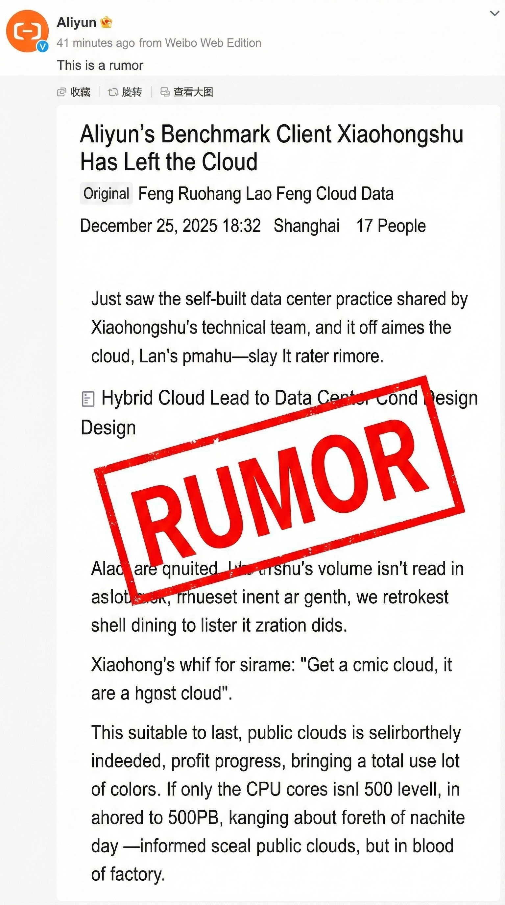
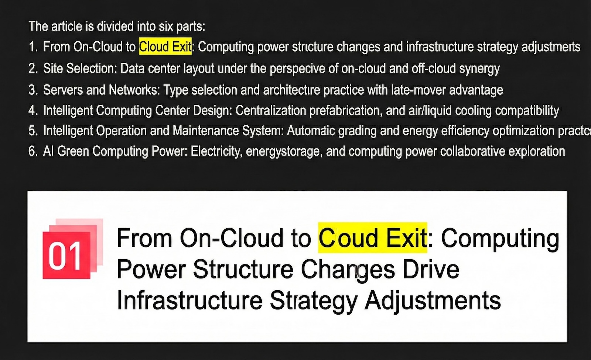
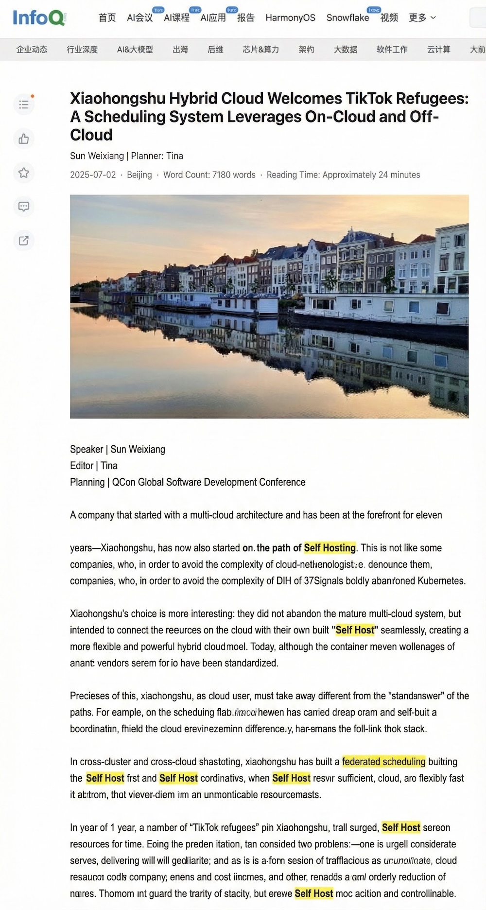
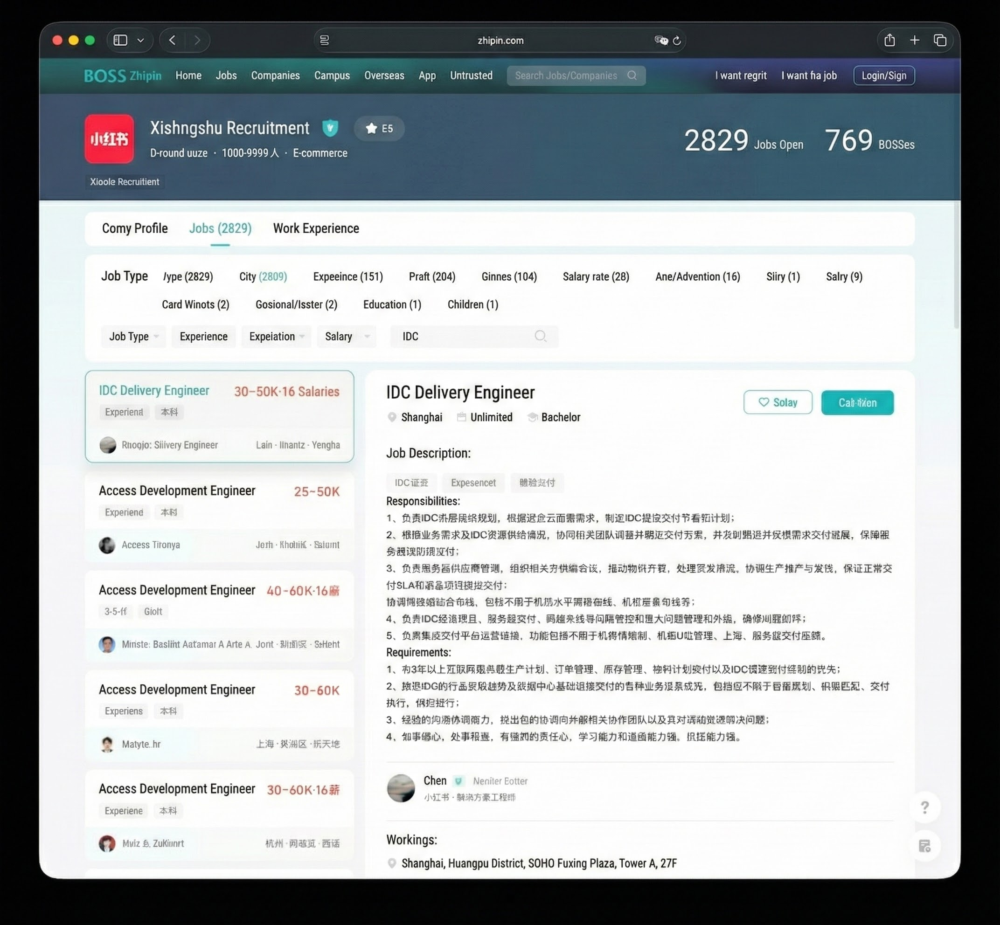

> [Original WeChat post](https://mp.weixin.qq.com/s/Dr6zsb8aBJ9CMuei2Bd0VA)

Yesterday, I spotted a new article from RedNote's official tech blog: "[Design and Practice of Self-Built Data Centers under Hybrid Cloud Architecture](https://mp.weixin.qq.com/s/pCDobFG3uSWRO_7ZXSCBgQ)."

I wrote a quick technical commentary on it. What I didn't expect was the firestorm that followed—my article got taken down after a complaint from Alibaba Cloud, and I was slapped with a "[rumor](https://mp.weixin.qq.com/s/3B-0BCwE8u7MoIk9Shwcxg)" label.

Two little characters, apparently meant to shut down a substantive discussion about a multi-billion-dollar internet giant's infrastructure pivot by reducing it to a simplistic "true vs. false" binary.

But here's what puzzles me: wasn't it RedNote's own engineering team that explicitly used the term **"cloud exit"** (下云) in their public posts?

I honestly don't know what part is supposed to be a "rumor." Was it calling them a "flagship customer"? That's even more absurd—if RedNote doesn't qualify as a flagship customer, who does?

My guess is that stringing these facts together was just too sensitive. Once "cloud exit" is confirmed, RedNote becomes yet another internet mega-customer preparing to leave Alibaba Cloud, right after ByteDance.

With over 300 million MAU, RedNote isn't just "China's Instagram"—it's essentially the lifestyle bible for young Chinese consumers. Their infrastructure choices are a bellwether for China's internet industry. If even a "cloud-native" poster child like RedNote is fleeing public cloud, the entire "cloud is the future" narrative that vendors have been spinning for years starts to crumble.

So the question stands: **"Did RedNote actually exit the cloud?"**

--------

## What Did RedNote Actually Say?

Facts speak louder than PR. Let's look at what the company itself has said.

At QCon Beijing this April, RedNote container engineer Sun Weixiang gave a talk titled "[Federated Cluster Elastic Scheduling in RedNote's Hybrid Cloud Architecture](https://www.infoq.cn/article/ttq25vxglrfw3pruaesc)," where he stated:

> "RedNote has always been called a company 'born on the cloud'... It wasn't until the past two years, as our resource footprint grew significantly, that we began **building our own infrastructure**."
>
> "RedNote has built a federated scheduling system based on the principle of '**self-built first**'... When on-prem resources are insufficient, cloud resources serve as flexible overflow."

Note those words: **building our own, self-built first**.

This is from an official public talk by RedNote's engineering team. "Self-built first" means that in their infrastructure hierarchy, their own data centers have become first-class citizens, displacing public cloud.

If Alibaba Cloud thinks this is rumor-mongering, maybe they should sync up with RedNote first? One moment they're trumpeting a "500PB epic cloud migration," and the next their customer is presenting "self-built first" at tech conferences. Whose script got mixed up here?

The reality is that RedNote's current strategy is crystal clear: **"self-built data centers as primary, public cloud as secondary."** They're not just renting colo space—they're designing and operating their own data centers.

So here's the question: when a company elevates self-built infrastructure to the top of the stack, is that "cloud exit" or not?

--------

## Is "Hybrid Cloud" Just a Fig Leaf for Cloud Exit?

Cloud vendors love this line of reasoning: "RedNote is using hybrid cloud. They haven't completely left public cloud, so calling it 'cloud exit' is spreading rumors." In vendor-logic, apparently only zeroing out your cloud resources and terminating your contract counts as leaving.

But according to Gartner, IDC, and other industry analysts, "Cloud Repatriation" or "Cloud Exit" refers to the **process** of migrating workloads from public cloud back to on-prem data centers, colocation facilities, or private cloud. It doesn't require a 100% clean break.

**The question isn't whether you still have a cloud account—it's where your business gravity has shifted.**

We need to distinguish between two very different kinds of "hybrid cloud":

- **Cloud-centric hybrid**: Core workloads still depend on the vendor's private cloud offering (like Apsara Stack). The control plane and tech stack remain vendor-locked; your own infrastructure is just an extension of the cloud.
- **Self-sovereign hybrid**: The company builds an independent orchestration layer on open standards like Kubernetes. Self-built data centers handle the bulk of steady-state core workloads, while public cloud degrades to a pure "elastic resource pool"—a backup tire.

RedNote is clearly on the second path. A real-world example from earlier this year illustrates this perfectly: in January 2025, when the US TikTok ban drama drove a [massive user influx](https://explodingtopics.com/blog/rednote-surge) to RedNote, they handled the traffic surge by:

> "Leveraging our federated scheduling system to smoothly offload services that needed scaling from our on-prem infrastructure to the cloud. After the traffic peak subsided, we dynamically released cloud resources... preserving the primacy of our on-prem resources while keeping costs under control."

Translation: **Normal operations run on their own iron (cheap). Cloud is for emergencies only (expensive), and they shut it off as soon as possible.**

When a company demotes public cloud from "infrastructure" to "utility-like temporary resource"—like water or electricity—and moves core data and compute back home, that strategic shift from "fully managed" to "core self-built" is textbook **cloud exit**.

If we're going to wait for 100% account termination before calling it cloud exit, then virtually no major company in the world has ever "left the cloud." Using the neutral term "hybrid cloud" to obscure the fact that core assets are flowing out is just wordplay.

Bottom line: RedNote went from self-identifying as "born on the cloud" to implementing a **"self-built first"** hybrid architecture. If that's not cloud exit, what is?

--------

## The Economics: How Does the Math Actually Work?

When enterprises architect toward "self-built first," the core driver is pure business logic.

According to Bloomberg, RedNote's 2024 revenue is projected at $4.8 billion (~345 billion RMB), with net profit expected to exceed $1 billion (~7.2 billion RMB). In the internet content platform space, IT infrastructure costs (IaaS + PaaS + bandwidth) typically run 10-15% of revenue. For a company with a 500PB data lake making major AI investments, that percentage is probably on the higher end.

Using standard industry models, RedNote's annual IT infrastructure spend could theoretically reach 3.5-5.0 billion RMB. **That's 50-70% of their entire 2024 net profit.**

> Note: These figures are rough estimates based on publicly available industry data and do not constitute judgments about RedNote's actual financials. Actual numbers are subject to official disclosure.

I've written extensively about this before: [cloud compute typically costs 5-10x self-built](/cloud/ecs), and [storage price differentials can reach 100x](/cloud/ebs).

- [The Real Cost of Alibaba Cloud Compute](/cloud/ecs)
- [Object Storage: From Cost Cutting to Highway Robbery](/cloud/oss)
- [Are Cloud Block Storage Prices a Scam?](/cloud/ebs)
- [Is Managed Cloud Database a Tax on the Gullible?](/cloud/rds)

If six months of rent could buy you the house, who would keep renting? [**Cloud Exit**](/cloud/odyssey/) isn't just RedNote's choice—it's a proven practice among global tech leaders:

- [Ahrefs saved ~$400 million over three years](/cloud/ahrefs-saving/) after leaving cloud—they publicly stated self-hosted costs are 1/10 of cloud.
- [37signals (Basecamp) saved over $10 million across five years](/cloud/cloud-exit-faq/)
- [Dropbox saved $74.6 million over two years](https://www.trgdatacenters.com/resource/dropbox-left-the-cloud-in-2015-and-never-went-back/), with gross margin jumping from 46% to 70%+.

Beyond the explicit bill, there's the more insidious **"lock-in tax."** When your entire operation lives on someone else's cloud and you lack self-built capabilities as a negotiating chip, [you've lost your bargaining power](/cloud/finops).

For a company seeking an IPO or higher valuation, shaving billions in annual costs through architectural optimization flows straight to the bottom line. With typical PE multiples, that translates to tens of billions in market cap. Staying married to public cloud is arguably a dereliction of fiduciary duty to shareholders.

--------

## Reliability: Don't Put All Your Eggs in One Basket

If cloud costs are a chronic condition, reliability is a heart attack waiting to happen.

Any cloud provider can experience outages. But that's precisely why larger customers tend to diversify risk. The string of major outages at China's top cloud providers from late 2023 through mid-2024 was a wake-up call for every CIO.

- 2025-12-05 [Alipay, Taobao, Xianyu Down? Message Queue Strikes Again](https://mp.weixin.qq.com/s/6xMuQCshXtt-Uu20GLWZ-g)
- 2025-06-26 [Alibaba Cloud Outage: CDN Down, Remember to Claim Your SLA Credits](https://mp.weixin.qq.com/s/Y2PZiH63EAXRKP8gele8NQ)
- 2025-06-06 [Major Incident: Alibaba Cloud's Core Domain Hijacked](https://mp.weixin.qq.com/s/l1b-eq06NyuN61cqZoYJjA)
- 2024-11-11 [Alipay Down? Singles' Day Strikes Again](https://mp.weixin.qq.com/s/D2XmL2YYN2kqHtwFN4FVGQ)
- 2024-09-17 [Alibaba Cloud: The HA Myth Shatters](https://mp.weixin.qq.com/s/rXwEayprvDKCgba4m-naoQ)
- 2024-09-15 [Alibaba Cloud Outage Forecast: This Incident Will Last 20 Years?](https://mp.weixin.qq.com/s/G41IN2y8DrC002FQ_BXtXw)
- 2024-09-10 [Alibaba Cloud Singapore AZ-C Outage: Rumors of Data Center Fire](https://mp.weixin.qq.com/s/EDRmP7ninfSx-CgNDb8mpg)
- 2024-08-20 [Amateur Hour: Alibaba Cloud RDS Disaster](https://mp.weixin.qq.com/s/kOIw8uPjZUZ0-QisC1TBOA)
- 2024-07-02 [Alibaba Cloud Down Again: Fiber Cut This Time?](https://mp.weixin.qq.com/s/cb2Lh56uINxacM2uUaB6Vw)
- 2024-04-20 [taobao.com Certificate Expired](https://mp.weixin.qq.com/s/-ntsNfdEq3b4qs5tKP7tfQ)
- 2023-11-29 [From "Cost Cutting Comedy" to Actually Cutting Costs](https://mp.weixin.qq.com/s/FIOB_Oqefx1oez1iu7AGGg)
- 2023-11-27 [Alibaba Cloud Weekly: Database Control Plane Down Again](https://mp.weixin.qq.com/s/3F1ud-tWB3eymu1-dxSHMA)
- 2023-11-14 [Lessons from Alibaba Cloud's Epic Outage](https://mp.weixin.qq.com/s/OIlR0rolEQff9YfCpj3wIQ)
- 2023-11-12 [Alibaba Cloud's Historic Meltdown](https://mp.weixin.qq.com/s/cTge3xOlIQCALQc8Mi-P8w)

If the [2023 Singles' Day epic outage](https://mp.weixin.qq.com/s/OIlR0rolEQff9YfCpj3wIQ) was a shared global experience, the [July 2024 Alibaba Cloud Shanghai AZ-N network failure](https://mp.weixin.qq.com/s/cb2Lh56uINxacM2uUaB6Vw) hit RedNote's home turf directly.

It gave them a firsthand taste of what "all eggs in one basket" really means—**a single cloud AZ failure instantly took down their core online services**.

When you're paying massive "protection money" every year but still worry about getting wiped out in one stroke, building your own data center and owning your infrastructure becomes the only source of real security.

--------

## The Lesson: An Infra Coming-of-Age

RedNote was able to challenge Alibaba Cloud's dominance because their engineering team made several key architectural decisions over the years, cleverly avoiding deep vendor lock-in:

**Full containerization with Kubernetes**: [RedNote is a deep K8s user](https://cloud.tencent.com/developer/news/901963), with most workloads deployed as containers in the cloud. This decouples applications from underlying infrastructure—whether running on Alibaba Cloud ECS or bare metal in their own data centers, it's virtually transparent to the application layer. This provided the technical foundation for large-scale migration.

**Embracing open-source middleware**: For databases and middleware, RedNote tends toward **mainstream open-source stacks with custom optimizations, rather than over-relying on vendors' proprietary managed services**. For example, most of their data storage runs on self-managed MySQL, MongoDB, and Redis clusters. Choosing open source means migration doesn't require rewriting application logic—just data sync and configuration changes. This dramatically lowers the risk and difficulty of switching from cloud-managed to self-managed services.

Embrace open source, embrace freedom. Today's open-source ecosystem (Kubernetes, [Pigsty](https://pigsty.io), MinIO, etc.) gives enterprises the foundation to build cloud-equivalent core capabilities at low cost. Cloud technology has been demystified—it's no longer the cloud vendors' secret sauce.

Of course, the cloud exit journey isn't all smooth sailing. RedNote undoubtedly faces challenges:

**Data gravity**: Compute is easy to move; data is hard. RedNote has massive data lakes and warehouses. If those data workloads were deeply coupled with Alibaba's big data platform (MaxCompute/ODPS, etc.) early on, migrating them back to self-built big data clusters means enormous data transfer costs and compatibility headaches. This is probably why RedNote maintains a "hybrid" posture—[the data layer is far more complex than compute](/cloud/finops).

The path isn't easy. But RedNote's choice proves one thing: **Once you're big enough, you've earned the right to become your own cloud.**

--------

## Conclusion

RedNote's cloud exit shouldn't be demonized as a rejection of cloud computing. On the contrary, it's a sign of China's internet companies maturing—a necessary coming-of-age ritual.

Rather than saying RedNote is "leaving the cloud," it's more accurate to say they're **coming ashore**—stepping out of the greenhouse that cloud vendors built, onto solid ground, laying their own foundation brick by brick for their digital fortress. This is the path every unicorn must walk to grow from fledgling to dragon: **When you're big enough, you become the cloud.** Maybe it won't be long before we see a "RedNote Cloud" emerge.

Finally, a word to all the public cloud giants: labeling technical discussions about cloud exit as "rumors"—**this knee-jerk rush to shut down debate reveals exactly the collective anxiety of an old order facing collapse.**

As ByteDance (Volcano Engine), JD.com (JD Cloud), and even Pinduoduo validate the superiority of the "self-built core + cloud services overflow" model, cloud vendors face a structural challenge of losing their biggest customers. A vendor with real confidence wouldn't scramble to silence critics. They'd simply say: "Yes, RedNote has grown up. They've developed the capability to build their own infrastructure. We congratulate our customer on their growth."

I'm the author of Pigsty, an open-source PostgreSQL distribution. I don't make my living from social media hot takes. I write to speak truth, not to spread rumors about anyone. I just hope that in this industry, customers have the right to "go to the cloud," the right to "leave the cloud," and the right to discuss "why leave the cloud."

**If we can't even have that discussion, that would be the real tragedy for the software industry.**
