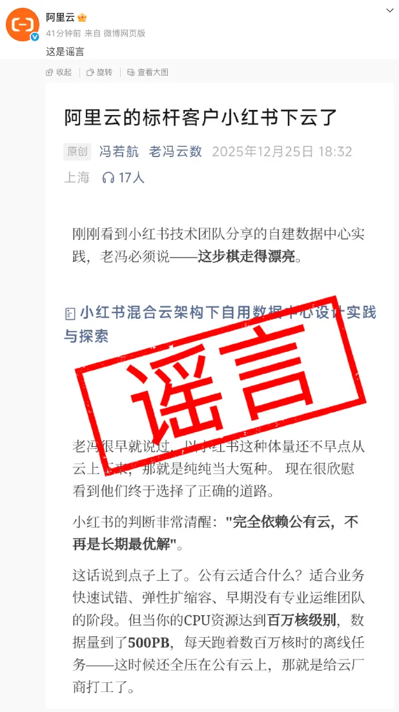
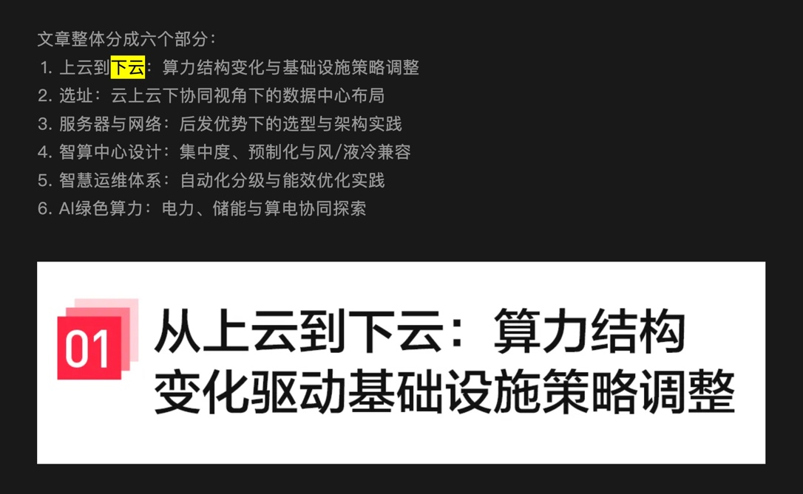
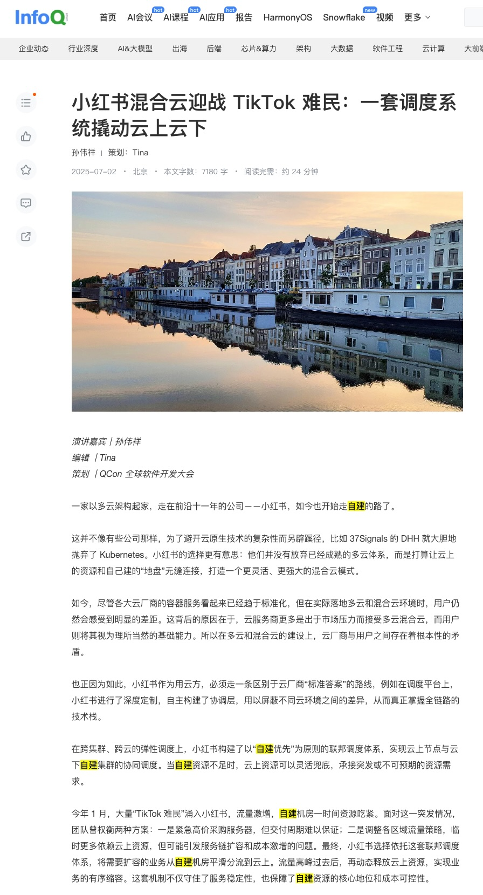
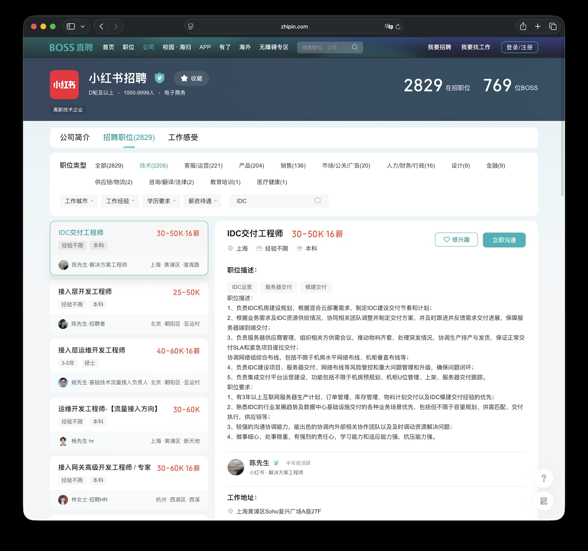

> [微信公众号原文](https://mp.weixin.qq.com/s/Dr6zsb8aBJ9CMuei2Bd0VA)

昨天，老冯看到小红书技术公众号发了篇新文章《[小红书混合云架构下自用数据中心设计实践与探索](https://mp.weixin.qq.com/s/pCDobFG3uSWRO_7ZXSCBgQ)》，
写了一篇简单的技术评论，没想到文章发出后反响激烈，不仅被阿里云投诉删除，还被扣了个 [“谣言”](https://mp.weixin.qq.com/s/3B-0BCwE8u7MoIk9Shwcxg) 的帽子。

短短二字，似乎想把一场关乎百亿级互联网巨头基础设施战略转向的深刻讨论，封杀在“真与假”的二元对立之中。

但这确实让我感到十分诧异。难道不是小红书技术团队自己在公众号文章里明明白白使用了 **“下云”** 的表述吗？

我也不知道 **“谣”** 在哪里，难道是在 “标杆客户”？那就更离谱了，小红书要是不算标杆客户，那谁算？

俺寻思，大概还是这些事实串起来太敏感了：一旦“下云”这件事坐实，小红书将成为继字节跳动之后又一家准备撤离阿里云的互联网巨头级客户。

作为月活超 3 亿、不仅是 “中国版 Instagram” 更是当代年轻人生活方式圣经的超级 APP，小红书的基础设施选择就像是中国互联网下半场的风向标代表 —— 
如果连小红书这样的“云原生”代表企业都开始逃离公有云， 那么公有云厂商多年来编织的 “上云是大势所趋” 叙事神话将面临崩塌。

问题就来了，**“小红书究竟有没有下云呢？”**

-------

## 小红书官方是怎么说的？

事实胜于雄辩，我们先看当事人怎么说。

在今年 4 月的 QCon 北京大会上，小红书容器研发专家孙伟祥在《[混合云架构下的小红书联邦集群弹性调度实践](https://www.infoq.cn/article/ttq25vxglrfw3pruaesc)》演讲中明确透露：

> “小红书一直被称作一家‘长在云上’的公司……直到近两年，随着资源总量达到较大规模，才开始开展 **自建云** 工作。”
>
> “小红书构建了以 ‘自建优先’ 为原则的联邦调度体系……当自建资源不足时，云上资源可以灵活兜底。”

请注意这几个字：**开展自建，自建优先**。

这可是小红书技术团队对外的公开演讲。“自建优先”四个字，意味着在基础设施的顶层设计上，自有机房已经取代公有云成为了“一等公民”。

阿里云如果觉得这是造谣，是否应该先去和小红书核对一下口径？人家前脚刚配合宣传完“500PB 史诗级迁云”，后脚就在技术大会上讲 **“自建优先”**，到底是谁的剧本拿错了？

事实上，小红书目前的策略非常清晰：**“自建机房为主、公有云为辅”**。他们不仅不满足于租机房，甚至已经开始设计和运营自己的数据中心。

事实上，小红书目前的策略非常清晰：“自建机房为主、公有云为辅”。他们不仅不满足于租机房，甚至已经开始设计和运营自己的数据中心。

那么问题来了：这种“自建上位”的行为，算 “下云” 吗？

-------

## 混合云，是“下云”的遮羞布吗？

云厂商最喜欢用的一套逻辑是：“小红书用的是混合云，并没有彻底离开公有云，所以说“下云”是造谣。” 
也许在某些云厂商的逻辑里，似乎只有把云上资源全部清空、彻底解约，才叫“下云”。

在 Gartner、IDC 等权威咨询机构的定义中，“云遣返”（Cloud Repatriation/Cloud Exit）是指
企业将工作负载从公共云环境迁移回本地数据中心、托管设施或私有云的 **过程**，这一过程并不要求 100% 的彻底断舍离。

**判断“下云”与否，不看你是否还保留着云账号，而要看业务重心的“主权”在哪里。**

我们需要区分两种截然不同的“混合云”：

* 以云为核的混合云：核心业务依然依赖公有云的专有云版本（如 Apsara Stack），控制面和技术栈依然被云厂商锁定，自建机房只是云的延伸与补充。
* 自主可控的混合云：企业基于 Kubernetes 等开源标准构建独立的调度体系。自建数据中心承载绝大多数稳态核心业务，公有云退化为纯粹的“弹性资源池”和“备胎”。

小红书走的正是第二条路。今年年初的一个真实案例，就侧面印证了这一态势： 2025 年 1 月，由于美国 TikTok 禁令风波，大量用户涌入小红书。
[小红书在应对流量激增时透露](https://explodingtopics.com/blog/rednote-surge)：

> “最终，小红书选择依托联邦调度体系，将需要扩容的业务从自建机房平滑分流到云上。
> 流量高峰过去后，再动态释放云上资源…保障了自建资源的核心地位和成本可控性。”

翻译成大白话就是：**平时主力跑在自家机房（便宜），云上资源只是应急备用（贵），用完立刻关掉**。

当一家企业把公有云从“基础设施”降级为“水电煤一样的临时工具”，把核心数据和算力搬回自己家。这种从“全量托管”到“核心自建”的战略重心转移，就是最典型的 **“下云”**。

如果非要等到 100% 销户才叫下云，那这个世界上恐怕没有一家大公司能算“下云”了。用“混合云”这个中性词汇来掩盖客户核心资产流失的事实，是典型的文字游戏。

说到底，小红书从一个自我定义为“原生长在云上”的公司，演进为使用 **“自建优先”** 的混合云架构，如果这都不算“下云”，那什么才算？

-------

## 下云这笔账，到底该怎么算？

企业通过技术架构调整实现“自建优先”，背后的核心驱动力就是商业理性。

根据 Bloomberg 等媒体口径，小红书 2024 年的营收预计达到 48 亿美元（约 345 亿人民币），净利润预计突破 10 亿美元（72 亿人民币）。 
在互联网内容平台行业，IT 基础设施成本（IaaS+PaaS+带宽）通常占营收的 10% 到 15%。
对于拥有 500PB 数据湖且大力投入 AI 的小红书，这个比例只高不低。

若按照行业通用模型推算，小红书每年的 IT 基础设施投入理论上可能高达 35亿 - 50亿人民币。
这相当于小红书 2024 年全年净利润的 50-70%！

> 注：以上数据为基于公开行业数据的粗略估算，不构成对小红书实际财务状况的判断。实际数字以小红书官方披露为准。

老冯在之前的专栏里多次分析过：[云上算力的费用往往是自建的5-10倍](/cloud/ecs)，
[存储价格的差异更是能达到百倍](/cloud/ebs)。

- [剖析阿里云算力真实成本](/cloud/ecs)
- [对象存储：从降本到杀猪](/cloud/s3)
- [云盘是不是杀猪盘？](/cloud/ebs)
- [云数据库是不是智商税](/cloud/rds)

如果半年的房租就能买下这套房子，谁还会会选择租房住呢？因而 [**下云**](/cloud/odyssey/) 并非小红书一家之选，而是全球科技先锋的前沿实践：

- [Ahrefs 下云后，三年节省约 4 亿美元](/cloud/ahrefs-saving/)，他们公开表示自建成本仅为用云的 1/10。
- [37 Signals（Basecamp）下云五年节省超 1,000 万美元](/cloud/cloud-exit-faq/)
- [Dropbox 下云后，两年节省 7,460 万美元，毛利率直接从 46% 飙升到 70%+](https://www.trgdatacenters.com/resource/dropbox-left-the-cloud-in-2015-and-never-went-back/)。

除了显性的账单成本，更可怕的是 **“锁定税”。 当你的身家性命全在云上，且没有自建能力作为谈判筹码时，[你就丧失了议价权](/cloud/finops#下云核心是自建)**。

对于正在寻求 IPO 或更高估值的小红书来说，通过架构优化每年节省数亿乃至十亿级别的成本，直接转化为净利润，这将通过PE带来百亿美元级别的市值提升。 继续赖在公有云上，才是对股东财富的挥霍。

--------

## 安全感：鸡蛋不能放在一个篮子里

如果说云成本是“慢性病”，那么可靠性就是“心脏病”。

任何一家云厂商都有可能发生故障。但正因如此，规模越大的客户越倾向于分散风险。
2023 年底到 2024 年中，国内头部云厂商接连发生的大规模故障，给所有 CIO 上了一课。

- 2025-12-05 [支付宝淘宝闲鱼崩了？又是消息队列的锅？](/cloud/alipay-crash/)
- 2025-06-26 [阿里云故障，CDN挂了，记得申请SLA赔付](https://mp.weixin.qq.com/s/Y2PZiH63EAXRKP8gele8NQ)
- 2025-06-06 [大故障：阿里云核心域名被拖走了](https://mp.weixin.qq.com/s/l1b-eq06NyuN61cqZoYJjA)
- 2024-11-11 [支付宝崩了？双十一整活王又来了](https://mp.weixin.qq.com/s/D2XmL2YYN2kqHtwFN4FVGQ)
- 2024-09-17 [阿里云：高可用容灾神话的破灭](/cloud/aliyun-ha/)
- 2024-09-15 [阿里云故障预报：本次事故将持续至20年后？](https://mp.weixin.qq.com/s/G41IN2y8DrC002FQ_BXtXw)
- 2024-09-10 [阿里云新加坡可用区C故障，网传机房着火](https://mp.weixin.qq.com/s/EDRmP7ninfSx-CgNDb8mpg)
- 2024-08-20 [草台班子唱大戏，阿里云RDS翻车记](/cloud/rds-failure/)
- 2024-07-02 [阿里云又挂了，这次是光缆被挖断了？](https://mp.weixin.qq.com/s/cb2Lh56uINxacM2uUaB6Vw)
- 2024-04-20 [taobao.com 证书过期](https://mp.weixin.qq.com/s/-ntsNfdEq3b4qs5tKP7tfQ)
- 2023-11-29 [从降本增笑到真的降本增效](/cloud/smile/)
- 2023-11-27 [阿里云周爆：云数据库管控又挂了](https://mp.weixin.qq.com/s/3F1ud-tWB3eymu1-dxSHMA)
- 2023-11-14 [我们能从阿里云史诗级故障中学到什么](/cloud/aliyun/)
- 2023-11-12 [【阿里】云计算史诗级大翻车来了](https://mp.weixin.qq.com/s/cTge3xOlIQCALQc8Mi-P8w)

如果说 [2023 年双十一史诗故障](/cloud/aliyun/) 还算是 "全球同此凉热"，
那么 2024年7月 [阿里云上海可用区 N 因网络故障](https://mp.weixin.qq.com/s/cb2Lh56uINxacM2uUaB6Vw) 则精准打击了小红书的大本营 。
让小红书亲身体验了一把何谓 “把鸡蛋放在一个篮子里” —— **单一云可用区的故障，瞬间令其主要线上服务陷入不可用**。

当你每年交着巨额的保护费，却依然还要担心被“一波带走”时，自建数据中心、掌握基础设施的主动权，就成了唯一的安全感来源。

--------

## 小红书的启示：技术的成人礼？

小红书之所以敢于挑战阿里云的权威，在于其技术团队这些年在架构演进中做对了几件关键事情，巧妙避开了 **深度供应商锁定** 的陷阱：

**全面容器化与Kubernetes**：[小红书是K8s的深度用户，大量业务以容器形式部署在云上](https://cloud.tencent.com/developer/news/901963)。
这使得应用和底层基础设施解耦——无论运行在阿里云ECS上，还是自建机房的裸机上，对应用来说几乎无差别。这为大规模迁移提供了技术基础。

**拥抱开源中间件**：在数据库和中间件选型上，小红书倾向于使用 **业界主流的开源技术栈并自行定制优化，而非过度依赖云厂商的封闭托管服务**。
例如，他们的大部分数据存储采用自建的 MySQL， MongoDB， Redis 集群。选择开源方案意味着迁移时无需重写应用逻辑，只需做好数据同步和配置切换即可。
这极大降低了从云托管服务切换到自托管服务的难度和风险。

拥抱开源，就是拥抱自由。 今天的开源生态（如 Kubernetes, [Pigsty](https://pigsty.cc), MinIO 等），已经让企业具备了低成本构建“平替”云厂商核心能力的基础。
云技术已经祛魅，早已不再是云厂商的独家秘籍了。

当然，“下云”之路并非坦途，我相信小红书在推进过程中也会面临各种挑战：

**数据重力的牵绊**：计算易迁移，数据难迁移。小红书有海量的数据湖和数仓。如果这些数据工作负载早期深度绑定了阿里云的大数据平台（如MaxCompute/ODPS等），
那么要将其迁回自建的大数据集群，将面临巨大的数据搬迁成本和兼容性问题。这可能也是目前小红书保持“混合架构”状态的原因
—— [数据层的处理要比计算层复杂得多](/cloud/finops#数据库是最大风险点)。

但小红书的选择证明了：**只要规模足够大，你就有资格成为自己的云**。

--------

## 结语

小红书的“下云”尝试，不应被妖魔化成对云计算的否定，恰恰相反，这是中国互联网企业走向成熟的标志，是一场必经的“成人礼”。

与其说小红书 “下云”，倒不如说它是 **上岸** 了 —— 从云厂商构筑的温室中走出来，踏上了坚实的地基，一砖一瓦地搭建属于自己的数字城堡。
而这，正是所有超级独角兽从雏鹰到巨龙的必经之路 —— **当你的规模足够大，你就成了云本身**。也许用不了多久，我们还能看到一个新的 “红薯云” 出现。

最后，我想对所有的公有云巨头说一句：将关于“下云”的技术探讨定性为“谣言”，**这种急于“盖棺定论”的应激反应，恰恰暴露了行业旧秩序面临崩塌时的集体焦虑。**

随着字节跳动（火山引擎）、京东（京东云）甚至拼多多等巨头纷纷验证了“自建内核+云服务外溢”模式的优越性， 云厂商正面临核心客户流失的结构性挑战。
真正有底气的厂商，不应该急于封口，而应该大大方方地表示：“是的，小红书长大了，他们具备了自研基础设施的能力，我们祝贺客户的成长。”

老冯我自己是开源 PostgreSQL 发行版 Pigsty 的作者，不靠自媒体吃饭，写文章只是为了说点真话，也没兴趣去造谣谁。
我只是希望，在这个行业里，客户不仅有选择“上云”的权利，也有选择“下云”的权利，更有讨论“为什么要下云”的权利。

**如果连这点讨论的空间都没有，那才是中国软件行业的悲哀。**

