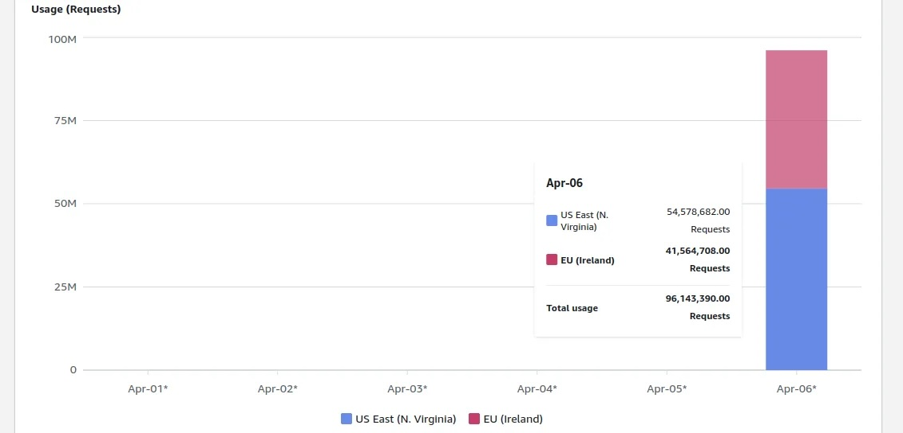
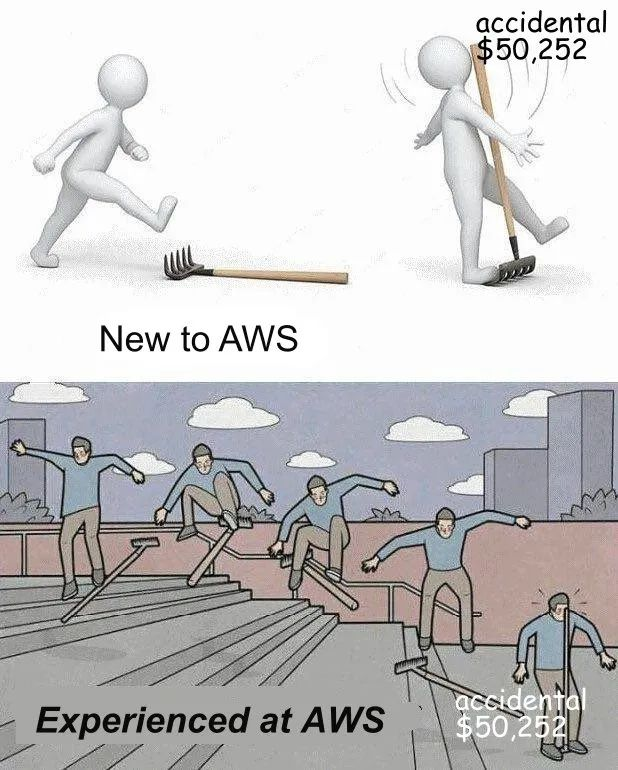

公有云上的黑暗森林法则出现了：**只要你的 S3 对象存储桶名暴露，任何人都有能力刷爆你的云账单。**


------

试想一下，你在自己喜欢的区域创建了一个空的、**私有的** AWS S3 存储桶。第二天早上，你的 AWS 账单会是什么样子？

几周前，我开始为客户开发一个文档索引系统的概念验证原型 (PoC)。我在 `eu-west-1` 区域创建了一个 S3 存储桶，并上传了一些测试文件。两天后我去查阅 AWS 账单页面，主要是为了确认我的操作是否在免费额度内。结果显然事与愿违 —— 账单超过了 **1300美元**，账单面板显示，执行了将近 **1亿次** S3 PUT 请求，仅仅发生在一天之内！



> 我的 S3 账单，按每天/每个区域计费

------

## 这些请求从哪儿来？

默认情况下，AWS 并不会记录对你的 S3 存储桶的请求操作。但你可以通过 [**AWS CloudTrail**](https://docs.aws.amazon.com/AmazonS3/latest/userguide/cloudtrail-logging.html) 或 [**S3 服务器访问日志**](https://docs.aws.amazon.com/AmazonS3/latest/userguide/ServerLogs.html) 启用此类日志记录。开启 CloudTrail 日志后，我立刻发现了成千上万的来自不同账户的写请求。

**为何会有第三方账户对我的 S3 存储桶发起未授权请求？**

这是针对我的账户的类 DDoS 攻击吗？还是针对 AWS 的？事实证明，**一个流行的开源工具的默认配置，会将备份存储至 S3 中。这个工具的默认存储桶名称竟然和我使用的完全一致**。这就意味着，每一个部署该工具且未更改默认设置的实例，都试图将其备份数据存储到我的 S3 存储桶中！

> 备注：遗憾的是，我不能透露这个工具的名称，因为这可能会使相关公司面临风险（详情将在后文解释）。

所以，大量未经授权的第三方用户，试图在我的私有 S3 存储桶中存储数据。但为何我要为此买单？

**对未授权的请求，S3也会向你收费！**

在我与 AWS 支持的沟通中，这一点得到了证实，他们的回复是：

> 是的，S3 也会对未授权请求（4xx）收费，这是符合预期的。

因此，如果我现在打开终端输入：

```bash
aws s3 cp ./file.txt s3://your-bucket-name/random_key
```

我会收到 **`AccessDenied`** 错误，**但你要为这个请求买单**。

还有一个问题困扰着我：为什么我的账单中有一半以上的费用来自 **us-east-1** 区域？我在那里根本没有存储桶！原来，未指定区域的 S3 请求默认发送至 **us-east-1**，然后根据具体情况进行重定向。而你还需要支付重定向请求的费用。

### 安全层面的问题

现在我明白了，为什么我的 S3 存储桶会收到数以百万计的请求，以及为什么我最终面临一笔巨额的 S3 账单。当时，我还想到了一个点子。如果所有这些配置错误的系统，都试图将数据备份到我的 S3 存储桶，如果我将其设置为 “**公共写入**” 会怎样？我将存储桶公开不到 30 秒，就在这短短时间内收集了超过 10GB 的数据。当然，我不能透露这些数据的主人是谁。但这种看似无害的配置失误，竟可能导致严重的数据泄漏，令人震惊！

------

## 我从中学到了什么？

**第一课：任何知道你S3存储桶名的人，都可以随意打爆你的AWS账单**

除了删除存储桶，你几乎无法防止这种情况发生。当直接通过 S3 API 访问时，你无法使用 CloudFront 或 WAF 来保护你的存储桶。标准的 S3 PUT 请求费用仅为每一千请求 0.005 美元，但一台机器每秒就可以轻松发起数千次请求。

**第二课：为你的存储桶名称添加随机后缀可以提高安全性。**

这种做法可以降低因配置错误或有意攻击而受到的威胁。至少应避免使用简短和常见的名称作为 S3 存储桶的名称。

**第三课：执行大量 S3 请求时，确保明确指定 AWS 区域。**

这样你可以避免因 API 重定向而产生额外的费用。

------

## 尾声

1. 我向这个脆弱开源工具的维护者报告了我的发现。他们迅速修正了默认配置，不过已部署的实例无法修复了。

2. 我还向 AWS 安全团队报告了此事。我希望他们可能会限制这个不幸的 S3 存储桶名称，但他们不愿意处理第三方产品的配置不当问题。

3. 我向在我的存储桶中发现数据的两家公司报告了此问题。他们没有回复我的邮件，可能将其视为垃圾邮件。

4. AWS 最终同意取消了我的 S3 账单，但强调了这是一个例外情况。

感谢你花时间阅读我的文章。希望它能帮你避免意外的 AWS 费用！


------

## 下云老冯评论

公有云上的黑暗森林法则出现了：**只要你的 S3 对象存储桶名暴露，任何人都有能力刷爆你的 AWS 账单**。只需要知道你的存储桶名称，别人不需要知道你的 ID，也不需要通过认证，直接强行 PUT / GET 你的桶，不管成败，都会被收取费用。

这引入了一种类似于 DDoS 的新攻击类型 —— DoCC （Denial of Cost Control），刷爆账单攻击。

在一些群里，AWS 的售后，与工程师给出了他们的解释 —— “AWS设计收费策略有一个原则：就是如果AWS产生了成本（用户本身有一定原因），就一定要向用户收费”，AWS 销售给出的解释则是这个客户不会使用 AWS ，应该参加 AWS SA 考试培训后再上岗。

但从常理来看，这完全不合理 —— 由别人发起的，连 Auth 都没有通过的请求，为什么要向用户收费？而用户除了选择不用这一个选项之外，似乎压根没有办法防止这种情况发生 —— 这是一个设计上的漏洞，也是一个安全上的漏洞。

但是在 AWS 看来，该特性被视为 Feature，而不是安全漏洞或者 Bug，可以用来咔咔爆用户的金币。同样的设计逻辑贯穿在 AWS 的产品设计逻辑中，例如，Route53 查询没有解析的域名也会收费，所以知道域名是 AWS 解析的话，也可以进行 DDoS。


---------------

我并不确定本土云厂商是否使用了同样的处理逻辑。但他们基本都是直接或间接借鉴 AWS 的。所以有比较大的概率，也会是一样的情况。


> 作为信安专业出身，我很清楚业界的一些玩法，比如打DDoS 卖高防 —— 来自某群友的截图


---------------

在 《[**Cloudflare圆桌访谈**](https://mp.weixin.qq.com/s?__biz=MzU5ODAyNTM5Ng==&mid=2247487400&idx=1&sn=cf5b94165d2791030e0e874dca8383c7&scene=21#wechat_redirect)》中，我也提到过安全问题，比如监守自盗刷流量的问题。

> 最后我想说一下安全，我认为安全才是 Cloudflare 核心价值主张。为什么这么说，还是举一个例子。有一个独立站长朋友用了某个头部本土云 CDN ，最近两年有莫名其妙的超多流量。一个月海外几个T流量，一个IP 过来吃个10G 流量然后消失掉。后来换了个地方提供服务，这些奇怪的流量就没了。运行成本变为本来的 1/10，这就有点让人细思恐极 —— **是不是这些云厂商坚守自盗，在盗刷流量？或者是是云厂商本身（或其附属）组织在有意攻击，从而推广他们的高防 IP 服务？** 这种例子其实我是有所耳闻的。
>
> 因此，在使用本土云 CDN 的时候，很多用户会有一些天然的顾虑与不信任。但 Cloudflare 就解决了这个问题 —— 第一，流量不要钱，按请求量计费，所以刷流量没意义；第二，它替你抗 DDoS，即使是 Free Plan 也有这个服务，CF不能砸自己的招牌 —— 这解决了一个用户痛点，就是把账单刷爆的问题 —— 我确实有见过这样的案例，公有云账号里有几万块钱，一下子给盗刷干净了。用 Cloudflare 就彻底没有这个问题，我可以确保账单有高度的确定性 —— 如果不是确定为零的话。

Well，总的来说，账单被刷爆，也算一种公有云上独有的安全风险了 —— 希望云用户保持谨慎小心，一点小失误，也许就会在账单上立即产生难以挽回的损失。



