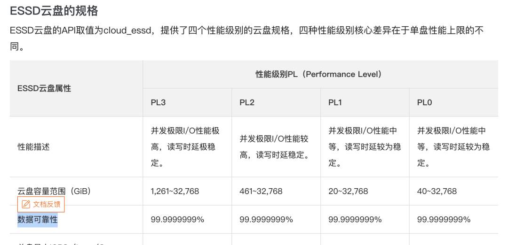

In the world of cloud computing, Service Level Agreements (SLAs) are seen as a cloud provider's commitment to the quality of its services. However, a closer examination of these SLAs reveals that they might not offer the safety net one might expect: you might think you've insured your database for peace of mind, but in reality, you've bought a placebo that provides emotional comfort rather than actual coverage.

----------------

## Insurance Policy or Placebo?

One of the reasons many users opt for cloud services is for the "safety net" they supposedly provide, often referring to the **SLA** when asked what this "safety net" entails. Cloud experts liken purchasing cloud services to buying insurance: certain failures might never occur throughout many companies' lifespans, but should they happen, the consequences could be catastrophic. In such cases, a cloud service provider's SLA is supposed to act as this safety net. Yet, when we actually review these SLAs, we find that this "policy" isn't as useful as one might think.

Data is the lifeline of many businesses, and cloud storage serves as the foundation for nearly all data storage on the public cloud. Let's take cloud storage services as an example. Many cloud service providers boast of their cloud storage services having nine nines of **data reliability** [1]. However, upon examining their SLAs, we find that these crucial promises are conspicuously absent from the SLAs [2].

What is typically included in the SLAs is the service's **availability**. Even this promised availability is superficial, paling in comparison to the core business reliability metrics in the real world, with compensation schemes that are practically negligible in the face of common downtime losses. **Compared to an insurance policy, SLAs more closely resemble placebos that offer emotional value.**

----------------

## Subpar Availability

The key metric used in cloud SLAs is availability. Cloud service availability is typically represented as the proportion of time a resource can be accessed from the outside, usually over a one-month period. If a user cannot access the resource over the Internet due to a problem on the cloud provider's end, the resource is considered unavailable/down.

Taking the industry benchmark AWS as an example, most of its services use a similar SLA template [3]. The SLA for a single virtual machine on AWS is as follows [4]. This means that in the best-case scenario, if an EC2 instance on AWS is unavailable for less than 21 minutes in a month (99.9% availability), AWS compensates nothing. In the worst-case scenario, only when the unavailability exceeds 36 hours (95% availability) can you receive a 100% credit return.

> **Instance-Level SLA**
>
> For each individual Amazon EC2 instance (“Single EC2 Instance”), AWS will use commercially reasonable efforts to make the Single EC2 Instance available with an Instance-Level Uptime Percentage of at least 99.5%, in each case during any monthly billing cycle (the “Instance-Level SLA”). In the event any Single EC2 Instance does not meet the Instance-Level SLA, you will be eligible to receive a Service Credit as described below.
>
> | **Instance-Level Uptime Percentage**               | **Service Credit Percentage** |
> | -------------------------------------------------- | ----------------------------- |
> | Less than 99.5% but equal to or greater than 99.0% | 10%                           |
> | Less than 99.0% but equal to or greater than 95.0% | 30%                           |
> | Less than 95.0%                                    | 100%                          |
>
> Note: In addition to the Instance-Level SLA, AWS will not charge you for any Single EC2 Instance that is Unavailable for more than six minutes of a clockhour. This applies automatically and you do not need to request credit for any such hour with more than six minutes of Unavailability.

> https://aws.amazon.com/compute/sla/

For some internet companies, a 15-minute service outage is enough to jeopardize bonuses, and a 30-minute outage is sufficient for leadership changes. The actual availability of core systems running most of the time might have five nines, six nines, or even infinite nines. Cloud providers, incubated from major internet companies, using such inferior availability metrics is indeed disappointing.

What's more outrageous is that these compensations are not automatically provided to you after a failure occurs. Users are required to measure downtime themselves, submit evidence for claims within a specific timeframe (**usually two months**), and request compensation to receive any. This requires users to collect monitoring metrics and log evidence to negotiate with cloud providers, and the compensation returned is not in cash but in vouchers/duration compensations — **meaning virtually no real loss for the cloud providers and no actual value for the users, with almost no chance of compensating for the actual losses incurred during service interruptions.**

----------------

## Is the "Safety Net" Meaningful?

For businesses, a "safety net" means minimizing losses as much as possible when failures occur. Unfortunately, SLAs are of little help in this regard.

The impact of service unavailability on business varies by industry, time, and duration. A brief outage of a few seconds to minutes might not significantly affect general industries, **however, long-term outages (several hours to several days) can severely affect revenue and reputation**.

In the Uptime Institute's 2021 data center survey [5], several of the most severe outages cost respondents an average of nearly $1 million, not including the worst 2% of cases, which suffered losses exceeding $40 million.

However, SLA compensations are a drop in the ocean compared to these business losses. Taking the `t4g.nano` virtual machine instance in the `us-east-1` region as an example, priced at about $3 per month. If the unavailability is less than 7 hours and 18 minutes (99% monthly availability), AWS will pay 10% of the monthly cost of that virtual machine, a total compensation of 30 cents. If the virtual machine is unavailable for less than 36 hours (95% availability within a month), the compensation is only 30% — less than $1. **Only if the unavailability exceeds a day and a half, can users receive a full refund for the month — $3**. Even if compensating for thousands of instances, this is virtually negligible compared to the losses.

In contrast, the traditional insurance industry genuinely provides coverage for its customers. For instance, SF Express charges 1% of the item's value for insurance, but if the item is lost, they compensate the full amount. Similarly, commercial health insurance costing tens of thousands yearly can cover millions in medical expenses. "Insurance" in this industry truly means you get what you pay for.

Cloud service providers charge far more than the BOM for their expensive services (see: "Are Public Clouds a Pig Butchering Scam?" [7]), but when service issues arise, their so-called "safety net" compensation is merely vouchers, which is clearly unfair.

----------------

## Vanished Reliability

Some people use cloud services to "pass the buck," absolving themselves of responsibility. However, some critical responsibilities cannot be shifted to external IT suppliers, such as **data security**. Users might tolerate temporary service unavailability, but the damage caused by lost or corrupted data is often unacceptable. **Blindly trusting exaggerated promises can have severe consequences, potentially a matter of life and death for a startup.**

In storage products offered by various cloud providers, it's common to see promises of nine nines of reliability [1], implying a one in a billion chance of data loss when using cloud disks. Examining actual reports on cloud provider disk failure rates [6] casts doubt on these figures. However, as long as providers are bold enough to make, stand by, and honor such claims, there shouldn't be an issue.

Yet, upon examining the SLAs of various cloud providers, this promise disappears! [2]

In the 2018 sensational case "The Disaster Tencent Cloud Brought to a Startup Company!" [8], the startup believed the cloud provider's promises and stored data on server hard drives, only to encounter what was termed "silent disk errors": "Years of accumulated data were lost, causing nearly ten million yuan in losses." Tencent Cloud expressed apologies to the company, willing to compensate the actual expenses incurred on Tencent Cloud totaling 3,569 yuan and, with the aim of helping the business quickly recover, promised an additional compensation of 132,900 yuan

----------------

## What Exactly is an SLA

Having discussed this far, proponents of cloud services might play their last card: although the post-failure "safety net" is a facade, what users need is to avoid failures as much as possible. According to the SLA promises, there is a 99.99% probability of avoiding failures, which is of the most value to users.

However, SLAs are deliberately confused with the actual reliability of the service: Users should not consider SLAs as reliable indicators of service availability — not even as accurate records of past availability levels. For providers, an SLA is not a real commitment to reliability or a track record but a marketing tool designed to convince buyers that the cloud provider can host critical business applications.

The UPTIME INSTITUTE's annual data center failure analysis report shows that many cloud services perform below their published SLAs. The analysis of failures in 2022 found that efforts to contain the frequency of failures have failed, and the cost and consequences of failures are worsening [9].

> **Key Findings Include**:
> 
> - **High outage rates haven’t changed significantly.** One in five organizations report experiencing a “serious” or “severe” outage (involving significant financial losses, reputational damage, compliance breaches and in some severe cases, loss of life) in the past three years, marking a slight upward trend in the prevalence of major outages. According to Uptime’s 2022 Data Center Resiliency Survey, 80% of data center managers and operators have experienced some type of outage in the past three years – a marginal increase over the norm, which has fluctuated between 70% and 80%.
> - **The proportion of outages costing over $100,000 has soared in recent years.** Over 60% of failures result in at least $100,000 in total losses, up substantially from 39% in 2019. The share of outages that cost upwards of $1 million increased from 11% to 15% over that same period.
> - **Power-related problems continue to dog data center operators.** Power-related outages account for 43% of outages that are classified as significant (causing downtime and financial loss). The single biggest cause of power incidents is uninterruptible power supply (UPS) failures.
> - **Networking issues are causing a large portion of IT outages.** According to Uptime’s 2022 Data Center Resiliency Survey, networking-related problems have been the single biggest cause of all IT service downtime incidents – regardless of severity – over the past three years. Outages attributed to software, network and systems issues are on the rise due to complexities from the increasing use of cloud technologies, software-defined architectures and hybrid, distributed architectures.
> - **The overwhelming majority of human error-related outages involve ignored or inadequate procedures.** Nearly 40% of organizations have suffered a major outage caused by human error over the past three years. Of these incidents, 85% stem from staff failing to follow procedures or from flaws in the processes and procedures themselves.
> - **External IT providers cause most major public outages.** The more workloads that are outsourced to external providers, the more these operators account for high-profile, public outages. Third-party, commercial IT operators (including cloud, hosting, colocation, telecommunication providers, etc.) account for 63% of all publicly reported outages that Uptime has tracked since 2016. In 2021, commercial operators caused 70% of all outages.
> - **Prolonged downtime is becoming more common in publicly reported outages.** The gap between the beginning of a major public outage and full recovery has stretched significantly over the last five years. Nearly 30% of these outages in 2021 lasted more than 24 hours, a disturbing increase from just 8% in 2017.
> - **Public outage trends suggest there will be at least 20 serious, high-profile IT outages worldwide each year.** Of the 108 publicly reported outages in 2021, 27 were serious or severe. This ratio has been fairly consistent since the Uptime Intelligence team began cataloging major outages in 2016, indicating that roughly one-fourth of publicly recorded outages each year are likely to be serious or severe.

Rather than compensating users, SLAs are more of a "punishment" for cloud providers when their service quality fails to meet standards. The deterrent effect of the punishment depends on the certainty and severity of the punishment. Monthly duration/voucher compensations impose virtually no real cost on cloud providers, making the severity of the punishment nearly zero; compensation also requires users to submit evidence and get approval from the cloud provider, meaning the certainty is not high either.

Compared to experts and engineers who might lose bonuses and jobs due to failures, the punishment of SLAs for cloud providers is akin to a slap on the wrist. If the punishment is meaningless, then cloud providers have no incentive to improve service quality. When users encounter problems, they can only wait and die, and the service attitude towards small customers, in particular, is arrogantly dismissive compared to self-built/third-party service companies.

More subtly, cloud providers have absolute power over the SLA agreement: they reserve the right to unilaterally adjust and revise SLAs and inform users of their effectiveness, leaving users with only the right to choose not to use the service, without any participation or choice. As a default "take-it-or-leave-it" clause, it blocks any possibility for users to seek meaningful compensation.

Thus, SLAs are not an insurance policy against losses for users. In the worst-case scenario, it's an unavoidable loss; at best, it provides emotional comfort. Therefore, when choosing cloud services, we need to be vigilant and fully understand the contents of their SLAs to make informed decisions.

----------------

## Reference

【1】[阿里云 ESSD云盘](https://help.aliyun.com/document_detail/122389.html) 

【2】[阿里云 SLA 汇总页](https://help.aliyun.com/document_detail/56773.htm)

【3】[AWS SLA 汇总页](https://aws.amazon.com/cn/legal/service-level-agreements/)

【4】[AWS EC2 SLA 样例](https://d1.awsstatic.com/legal/AmazonComputeServiceLevelAgreement/Amazon_Compute_Service_Level_Agreement_Chinese_Simplfied_(CN)2022-05-25.pdf)

【5】[云SLA更像是惩罚用户而不是补偿用户](https://journal.uptimeinstitute.com/cloud/-slas-punish-not-compensate/) 

【6】[NVMe SSD失效率统计](https://www.usenix.org/system/files/atc22-lu.pdf) 

【7】[公有云是不是杀猪盘](https://mp.weixin.qq.com/s/UxjiUBTpb1pRUfGtR9V3ag)

【8】[腾讯云给一家创业公司带来的灾难！](https://www.doit.com.cn/p/312087.html)

【9】[Uptime Institute 2022 故障分析](https://www.businesswire.com/news/home/20220608005265/en/Uptime-Institute%E2%80%99s-2022-Outage-Analysis-Finds-Downtime-Costs-and-Consequences-Worsening-as-Industry-Efforts-to-Curb-Outage-Frequency-Fall-Short)