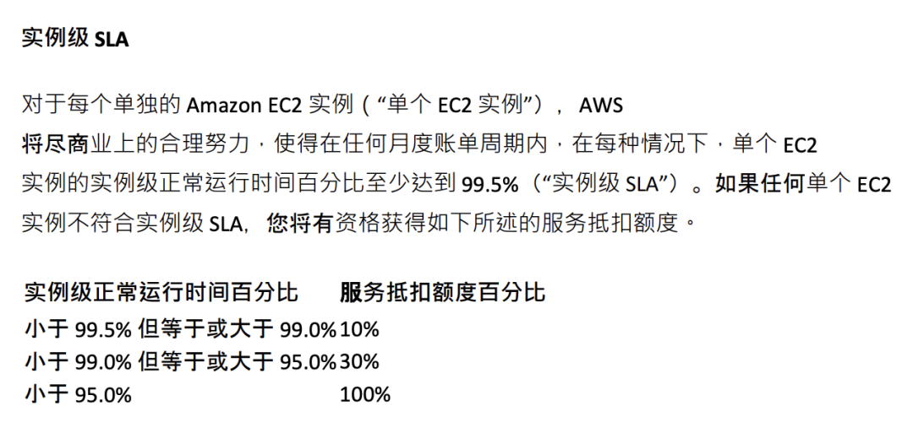
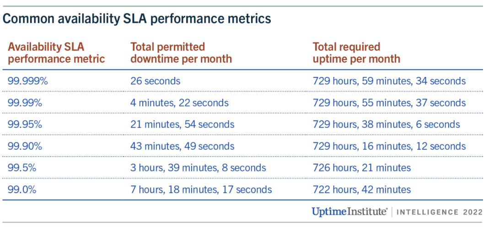
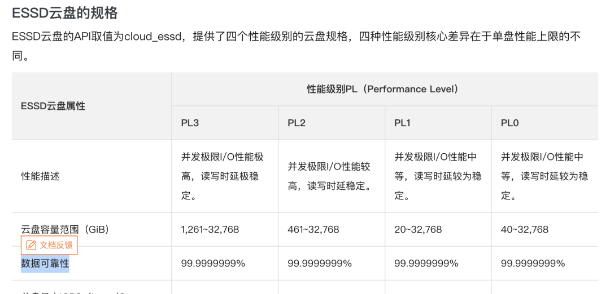
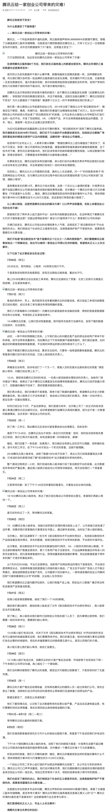
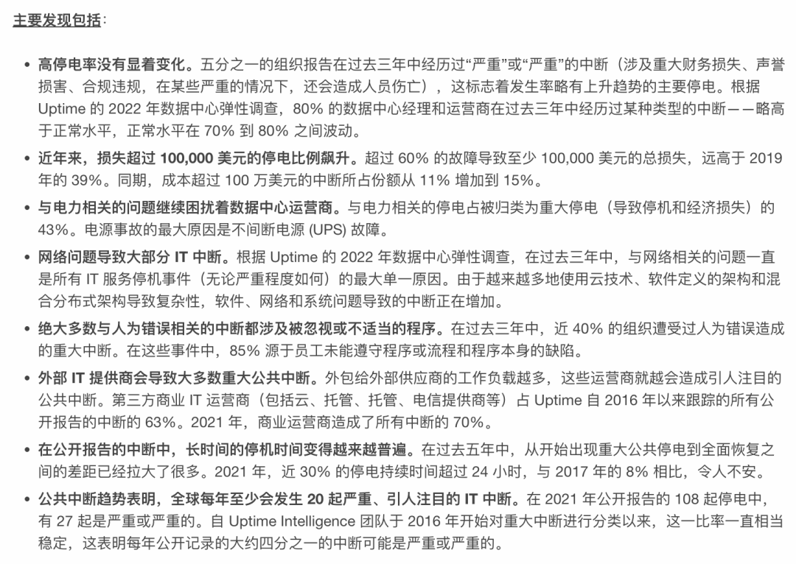

在云计算的世界里，服务等级协议（SLA）被视为云厂商对其服务质量的承诺。然而，当我们深入研究这些 SLA 时，会发现它们并不能像期望的那样“兜底”：你以为给自己的数据库上了保险可以高枕无忧，但其实白花花的银子买的是提供情绪价值的安慰剂。

----------------

## 保险单还是安慰剂？

许多用户购买云服务的一个原因是“兜底”，而问他们所谓“兜底”到底指的是什么，很多人会回答“**SLA**”。云专家将购买云服务比作购买保险：一些故障可能在许多公司的整个生命周期中都不会出现，但一旦遇到，后果可能就是毁灭性的。在这种情况下，云服务提供商的 SLA 就是兜底保险。然而，当我们实际查看这些 SLA 时，会发现这份“保单”并不像想象中那样有用。

数据是许多企业的生命线，云盘是公有云上几乎所有数据存储的基石，所以让我们以云盘服务为例。许多云服务提供商在其产品介绍中都会宣称他们的云盘服务具有 9个9 的**数据可靠性**【1】。然而当查看其 SLA 时，就会发现这些最为重要的承诺压根没有写入 SLA 【2】。

写入 SLA 的通常只有服务的**可用性**。而且这种可用性的承诺也流于表面，相比真实世界的核心业务可靠性指标极其逊色，赔偿方案相比常见停机损失来说约等于没有。**比起保险单，SLA 更像是提供情绪价值的安慰剂。**

----------------

## 拉胯的可用性

云 SLA 中使用的关键指标是可用性。云服务可用性通常表示为：可以从外部访问该资源的时间占比，通常使用一个月作为衡量周期。如果由于云厂商的问题，导致用户无法通过 Internet 访问该资源，则该资源将被视为不可用（Unavailable / Down）。

以业界标杆 AWS 为例，AWS 大部分服务使用类似的 SLA 模板3。AWS 上的单个虚拟机提供以下 SLA【4】。这意味着在最好情况下，如果 AWS 上EC2 一个月内不可用时间在 21 分钟内（99.9%），AWS 一分钱不赔。在最坏情况下，只有当不可用时间超过36小时（95%），您才能获得 100% 的代金券返还。

对于一些互联网公司来说，15分钟的服务故障就足以让奖金泡汤，30分钟的故障足够让领导下课。绝大多数时间实际运行的核心系统可用性可能有5个9，6个9，甚至无穷多个9。从互联网大厂孵化出来的云厂商使用如此逊色的可用性指标，实在是让人看了摇头。

更过分的是，当故障发生后，这些补偿也不是自动提供给你的。用户需要在时效（**通常是两个月**）内，自己负责衡量停机时间，提出申诉举证，并要求赔偿才会有。这要求用户去收集监控指标与日志证据和云厂商扯皮，换回来的也不是现金，而是代金券/时长补偿 —— **对云厂商而言可以说没有任何实质损失，对用户来说没有任何实际意义，几乎没有可能弥补服务中断产生的实际损失。**

----------------

## “兜底”有意义吗？

对于企业来说，**兜底**意味着在故障发生后如何尽可能减少损失。不幸的是，SLA 在这里帮不上什么忙。

服务不可用对业务造成的影响因行业、时间、长度而异。几秒钟几分钟的短暂的故障，可能对一般行业影响不大，**然而长时间（几个小时到几十个小时）的故障会严重影响收入与声誉**。

在 Uptime Institute 2021年数据中心调查中【5】，几场最严重停机故障给受访者造成的平均成本近100万美元，最惨重的 2% 不在其中，他们遭受的损失超过 4000 万美元。

然而，SLA 补偿对于这些业务损失来说是杯水车薪。以 `us-east-1` 区域的 `t4g.nano` 虚拟机实例为例，价格约为每月 3 美元。如果不可用时间少于 7 小时 18 分钟（月可用性 99%），AWS 将支付该虚拟机每月成本的 10%，总补偿为 30 美分。如果虚拟机不可用时间少于 36 小时（一个月内 95% 的可用性），补偿仅为 30% —— 不到 1 美元。**如果不可用时间超过一天半，用户才能收到当月的全额退款 —— 3美元**。即使是补偿个成千上万台，与损失相比也可基本忽略不计。

相比之下，传统的保险行业是实打实地为客户兜底。例如，顺丰快递的保价费用为物品价值 1%，但如果物品丢失，他们会全额赔偿。同样，每年几万商业医保，出问题真能兜底几百万。“保险”这个行业也是一分钱一分货的。

云服务提供商收取了远超BOM的昂贵服务费（参见：《公有云是不是杀猪盘》【7】），但当服务出现问题时，他们提供的补偿所谓的“兜底”却只是一些代金券，这显然是有失公平的。

----------------

## 消失的可靠性

有些人使用云服务是为了“**甩锅**”，推卸自己的责任。有一些重要的责任是无法推卸给外部 IT 供应商的。比如**数据安全**。用户可以忍受一段时间的服务不可用，但数据丢乱错带来的伤害往往是无法接受的。**轻信浮夸承诺的后果实在是太过严重，以至于对于一个创业公司就是生与死的区别。**

在各家云厂商的存储类产品中，经常能看到“承诺 99.9999999%” 9个9的可靠性【1】，可以理解为，使用云盘出现数据丢失的概率是十亿分之一。考察云厂商硬盘故障率的实际报告【6】，非常让人怀疑这个数字是拍脑袋想出来的。但只要敢说敢赔敢作敢当，那就没问题。

然而翻开各家云厂商的 SLA 就会发现，这一条“承诺”消失了！【2】

在2018年轰动的《腾讯云给一家创业公司带来的灾难！》 【8】案例中，这家创业公司就相信了云厂商的承诺，把数据放在服务器硬盘上，结果遇到了所谓“硬盘静默错误”：“几年来积累的数据全部丢失，造成近千万元的损失”。腾讯云向该公司表达歉意，愿意赔偿该公司在腾讯云产生的实际消费共计3569元，本着帮助用户迅速恢复业务的目的，承诺为该公司提供13.29万元现金或云资源的额外补偿。达到其消费金额的 37 倍！多么慷慨，多么仁慈，但这对于用户来说能弥补损失哪怕是零头吗？不行。

如果您是企业主或IT负责人，会觉得这样的甩锅有意义吗？

----------------

## SLA 到底是什么

话都讲到这里，云服务的鼓吹者会祭出最后一招：虽然出了故障后的兜底是个摆设，但是用户需要的是尽可能不出故障，按照 SLA 中的承诺，我们有 99.99% 的概率不出故障，这才是对用户最有价值的。

**然而，SLA 被有意地与服务的真实可靠性相混淆** ：**用户不应该将 SLA 视作来服务可用性的可靠预测指标 —— 甚至是过去可用性水平的真实记录**。**对于厂家来说，SLA 并不是真正的可靠性承诺或历史战绩，而是一种营销工具，旨在让买家相信云厂商可以托管关键业务应用。**

UPTIME INSTITUTE 发布的年度数据中心故障分析报告表明，很多云服务的真实表现低于其发布的 SLA 。对 2022 年故障分析发现：行业遏制故障频率的努力落空，故障成本和后果正在不断恶化【9】。

**与其说是 SLA 是对用户的补偿，不如说 SLA 是对云厂商服务质量没达标时的“惩罚”**。**惩罚的威慑取决于惩罚的确定性及惩罚的严重性**。月消的时长/代金券赔付对云厂商来说并没有什么实际成本，所以惩罚的**严重性**趋近于零；赔付还需要需要用户自己举证主张并得到云厂商的批准，这意味着**确定性**也不会很高。

比起会因为故障丢掉奖金与工作的专家工程师来说，SLA的惩罚对于云厂商属于是自罚三杯，不痛不痒。如果惩罚没有意义，那么云厂商也没有动力会提供更好的服务质量。用户遇到问题时只能提供单等死，服务态度比起自建/三方服务公司可谓天差地别，对小客户更是趾高气扬。

更微妙的是，云厂商对于 SLA协议具有绝对的权力：云厂商有权单方调整修订SLA并告知用户生效，用户只有**选择不用**的权利，没有任何参与权和选择权。作为默认签署无法拒绝的“霸王条款”，堵死了用户进行真正有意义赔偿追索的可能性。

所以，SLA 对用户来说不是兜底损失的保险单。在最坏的情况下，它是吃不了兜着走的哑巴亏。在最好的情况下，它才是提供情绪价值的安慰剂。因此，当我们选择云服务时，我们需要擦亮双眼，清楚地了解其 SLA 的内容，以便做出明智的决策。

----------------

## Reference

【1】[阿里云 ESSD云盘](https://help.aliyun.com/document_detail/122389.html) 

【2】[阿里云 SLA 汇总页](https://help.aliyun.com/document_detail/56773.htm)

【3】[AWS SLA 汇总页](https://aws.amazon.com/cn/legal/service-level-agreements/)

【4】[AWS EC2 SLA 样例](https://d1.awsstatic.com/legal/AmazonComputeServiceLevelAgreement/Amazon_Compute_Service_Level_Agreement_Chinese_Simplfied_(CN)2022-05-25.pdf)

【5】[云SLA更像是惩罚用户而不是补偿用户](https://journal.uptimeinstitute.com/cloud/-slas-punish-not-compensate/) 

【6】[NVMe SSD失效率统计](https://www.usenix.org/system/files/atc22-lu.pdf) 

【7】[公有云是不是杀猪盘](https://mp.weixin.qq.com/s/UxjiUBTpb1pRUfGtR9V3ag)

【8】[腾讯云给一家创业公司带来的灾难！](https://www.doit.com.cn/p/312087.html)

【9】[Uptime Institute 2022 故障分析](https://www.businesswire.com/news/home/20220608005265/en/Uptime-Institute%E2%80%99s-2022-Outage-Analysis-Finds-Downtime-Costs-and-Consequences-Worsening-as-Industry-Efforts-to-Curb-Outage-Frequency-Fall-Short)