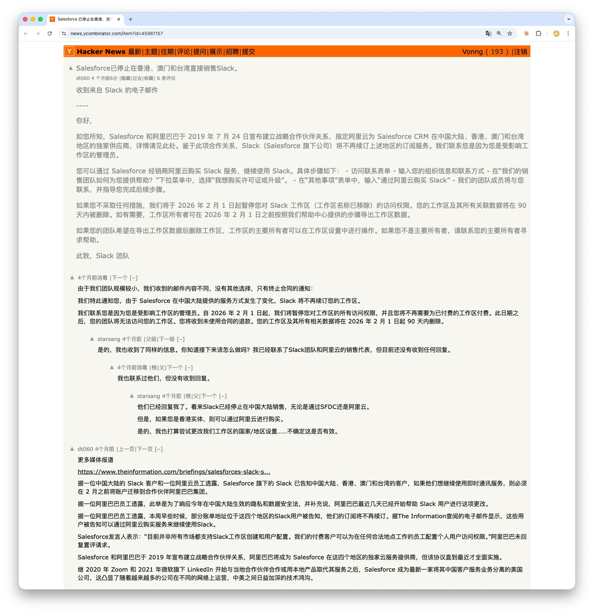

**What Slack's withdrawal from Greater China reveals about the digital age's most overlooked risk**

---

April 1, 2026. April Fools' Day.

But for the thousands of Slack-using teams across Hong Kong, Macau, and mainland China, what happened that day was no joke.

They opened Slack that morning and, instead of messages from colleagues, found a terse notice: your workspace has been deactivated. Every message, file, channel, and workflow—the organizational memory accumulated over years—was inaccessible.

No discussion. No transition. The countdown to data deletion had begun.

---

## 1. What Happened

In November 2025, Salesforce-owned Slack notified users in Greater China that, citing the strategic partnership Salesforce established with Alibaba in 2019, it would stop renewing subscriptions directly for customers in the region. Affected users needed to make arrangements by February 2026. ([The Information's report](https://www.theinformation.com/briefings/salesforces-slack-stop-direct-service-china-farm-alibaba); [this Hacker News thread](https://news.ycombinator.com/item?id=45961157) quotes two different versions of the notification email in full.)

> https://news.ycombinator.com/item?id=45961519

But customers of different sizes received two very different letters.

The email to large customers offered a way forward: continue buying Slack service through an Alibaba Cloud reseller. Small teams received a farewell instead: "Effective February 1, 2026, we will suspend all access to your workspace… Your workspace and all associated data will be deleted within 90 days thereafter." There was no alternative and no migration path. ([An HN user posted the full termination notice sent to small teams](https://news.ycombinator.com/item?id=45961519).)

Then, on April 1, 2026, the workspaces were deactivated. Multiple users reported on Reddit that they logged in that day to find their workspaces locked. Some said they had received no notice at all; others said the notice had gone only to Workspace Owners and Workspace Admins, not ordinary members. Even among Workspace Owners and Admins, many said no email had arrived. ([Gizchina's report](https://www.gizchina.com/tech/slack-terminates-services-across-greater-china-triggering-user-backlash/); [yage.ai's detailed analysis](https://yage.ai/share/slack-china-workspace-exit-en-20260402.html).)

Slack's support template confirmed the policy: "A notice was sent to workspace Owners and Admins." But when the consequence is the permanent loss of a team's data, "we notified the administrators" is an answer that may be technically true and still be disastrous in practice.

---

## 2. Alibaba Cloud: A Way Out for Whom?

The supposed escape hatch—"moving to Alibaba Cloud"—was far less straightforward than it sounded.

A Slack support template that surfaced on April 1 showed that renewing through an Alibaba Cloud reseller was available only to some paying customers in Hong Kong. For users in mainland China and Macau, the template said: "Slack via Alibaba Cloud is not available in China and Macau." ([The yage.ai analysis quotes the full template](https://yage.ai/share/slack-china-workspace-exit-en-20260402.html).)

In other words, if you were in mainland China or Macau, the "Alibaba Cloud migration" was never meant for you. If you were a small team, you were not offered it regardless of location.

And even if the Alibaba Cloud route worked, you would merely be moving from one platform you do not control to another. The platform dynamic would remain unchanged: you would still be a tenant, not an owner.

---

## 3. Your Data—Can You Take It With You?

This is the part of the story that deserves the closest scrutiny. One response is that Slack provided a 90-day countdown to deletion, so users should have exported their data during that period. But there are two problems with that argument.

**First, there was indeed a window before deactivation, but many people missed it.** From the November 2025 notice to the April 2026 shutdown, users had almost five months to prepare—if they received the notice.
Many users say they did not. Under Slack's contractual model, notices go to the Customer—in practice, the workspace Owner of record—not to every Authorized User. On a 50-person team, perhaps only one person receives contractual notices, and that person may never see the email.

**Second, once a workspace is deactivated, self-service export disappears with it.** Slack's data-export feature requires an administrator to sign in and use the admin console (Settings → Workspace settings → Import/Export Data).
Once the workspace is deactivated, the admin console is inaccessible and the self-service export path is gone. From then on, your only option is to ask Slack support to return the data. Whether that works depends on your paid plan, support response times, and Slack's discretion. ([Slack's official export documentation](https://slack.com/help/articles/201658943-Export-your-workspace-data).)

More importantly, even while a workspace is active, the Free and Pro plans can export messages only from public channels. Exporting direct messages and private channels on plans below Business+ requires a separate application, which Slack may deny. ([Slack's official guide to import and export tools](https://slack.com/help/articles/204897248-Guide-to-Slack-import-and-export-tools).)

The reality is this: data you thought you owned may be neither visible nor portable at the very moment you need it most. Not because it is legally someone else's, but because the technical control is not yours.

---

## 4. This Is Not the First Time

This is not the first time a SaaS platform has abruptly cut users off from their data. But the triggers differ, and the distinctions matter.

**The first category is sanctions compliance.** In 2018, Slack blocked accounts associated with Iran to comply with U.S. Office of Foreign Assets Control sanctions. Those affected included a scholar of Iranian heritage pursuing a doctorate in Vancouver, a Belgian who had visited Iran once years earlier, and a team whose entire company workspace was deactivated after its CTO vacationed in Crimea. Enforcement was extremely blunt. Slack later apologized, revised its policy, and acknowledged that it had blocked some accounts in error. ([Slack's official apology](https://slack.com/blog/news/an-apology-and-an-update).) In 2019, GitHub imposed similar restrictions on developers in Iran, Syria, and Crimea, blocking access to private repositories. It later obtained an OFAC license and restored full service to users in Iran in 2021. ([GitHub's trade-controls policy](https://docs.github.com/en/site-policy/other-site-policies/github-and-trade-controls).)

**The second category is commercial withdrawal.** That is what happened with Slack in Greater China in 2026. Hong Kong is not comprehensively embargoed in the way Iran is. The United States maintains sanctions targeting particular individuals and entities in Hong Kong, but no comprehensive trade embargo. The main driver behind Slack's exit was the cost of compliance: providing SaaS directly in mainland China requires local infrastructure deployment, data-security assessments, and regulatory review. When those costs outweighed the revenue, Salesforce chose to leave. That is an understandable business decision. To users, however, the result is functionally indistinguishable from a sanctions-driven shutdown.

**The third category is government blocking.** In February 2026, the Indian government reportedly blocked Supabase domains under Section 69A of the Information Technology Act. For several days, many Indian developers could not reach their backend services, and production applications suffered authentication failures and broken database connections. Supabase later confirmed that the blocking order had been revoked on March 3; the disruption lasted about eight days. ([Analysis of the Supabase block in India](https://articles.uvnetware.com/news/why-supabase-stopped-working-india-2026/).)

Three kinds of incident, with three different triggers: U.S. sanctions, commercial withdrawal, and government blocking. **But all share the same failure mode: the availability of your critical infrastructure depends on a decision by an outside party you cannot control.**

---

## 5. This Is a Structural Problem, Not a Moral One

Slack did not leave Greater China because it hates Chinese users. Nobody singled you out; nobody set out to hurt you. Business logic simply reached a point where your region was no longer worth serving, so you were optimized away. That is precisely the frightening part: **it can destroy you without anyone acting maliciously.**

When you use SaaS, the Terms of Service you accept usually contain a clause allowing the provider to terminate service after reasonable notice. "Reasonable notice" may be a single email you never receive. "Termination" may mean that your admin console is locked and the self-service export path is closed. Your data may still legally be yours—Slack's privacy policy does define Customer Data as data under the customer's control—but legal ownership and technical control are two different things.

Then there is the U.S. CLOUD Act. A service provider subject to U.S. jurisdiction may be compelled through valid legal process, such as a subpoena or search warrant, to disclose data in its possession, custody, or control, regardless of which country's servers hold it. This does not mean the government can simply "take it whenever it wants." It does mean that your data is caught in a legal contest in which you have no seat at the table.

So the question is not "Who owns the data?" Under the contract and the law, it belongs to you. **The question is how much control you actually have over its availability and portability, the jurisdiction governing it, and the underlying technology.** The Slack episode provides the answer: the moment the provider decides to leave, your control over all four vanishes.

---

## 6. If You Still Use SaaS

I am not saying, "Replace every SaaS product immediately." For many teams, SaaS remains the most practical choice.
But you should ask yourself one question: **If a core tool you use today—messaging, source-code hosting, a database, or file storage—became inaccessible tomorrow, could your business keep running?**

If the answer is no, what you need to do is simple, and you should start now.

**The minimum: export regularly and test recovery.** This requires no self-hosting, only discipline. If you use Slack, export a complete message archive every month, because self-service export vanishes once the workspace is deactivated. If you use GitHub, make sure every repository has a complete local clone. With any managed database, make sure scheduled backups are running—and verify that the restore procedure actually works. A fire extinguisher looks like wasted space until there is a fire.

**The next step: consider self-hosting core systems.** If your business depends on a SaaS product so completely that "if it dies, we die," that product is worth self-hosting.

Take the central use case here: messaging. Mattermost is a mature open-source alternative to Slack with a very similar experience, and many organizations with stringent security requirements have adopted it.
For data-sovereignty reasons, the French government deployed its own secure messaging system, Tchap, using Matrix and Element.

By 2026, the barrier to self-hosting has fallen dramatically. One VPS, one PostgreSQL instance, one container, and an AI coding assistant to help write the configuration, pull the image, and set up the reverse proxy: a usable instance really can be online within an hour.
I added a self-hosted Mattermost template to PIGSTY long ago: PostgreSQL with high availability and point-in-time recovery, plus a container running stateless Mattermost. A few commands are enough to stand up a messaging system you own.

For a team with even modest technical capability, the numbers work: in return, you get complete control over your data and service availability. For a team without operations expertise, the minimum—regular exports and recovery drills—is still far better than doing nothing.

Of course, some will say that if Slack is unavailable, they can use Lark, DingTalk, or WeCom. These products from China's tech giants offer remarkably cost-effective alternatives.
That is true. But they are still SaaS. You have merely exchanged one platform operator you cannot control for another, and they may expose you to a different class of compliance risk. If the platform dynamic does not change, neither does your position.

---

## 7. Data Sovereignty Is an Engineering Problem

People have talked about "data sovereignty" for years. It is not a political slogan; it is a question that must be answered with engineering.

It has three layers: physical location—which country's data center holds the data; legal jurisdiction—which country's laws bind the operator; and technical control—whether you can access, export, migrate, and delete the data whenever you choose. Only when you control all three do you truly control your data.

The most practical way to achieve all three is open-source software plus self-hosted deployment. Open source provides technical transparency and portability; self-hosting gives you control over physical location and legal jurisdiction.
It is not the only path. Contractual guarantees, multi-cloud redundancy, and data-escrow agreements can each provide protection at some layers. But it is the only path that does not depend on any third party's goodwill.

By 2026, the entire self-hosted alternative stack has matured. For messaging there are Mattermost, Rocket.Chat, and Matrix/Element. For source-code hosting there are Gitea and GitLab. You can run PostgreSQL yourself, while projects such as Supabase have mature open-source, one-click self-hosting options. For object storage there is MinIO; for identity and access management, Keycloak. They all share three properties: they are open source, they can run on your own infrastructure, and they put the data in your hands.

---

## 8. Conclusion

Among the teams that lost their Slack data after April 1, 2026, someone must have thought: if we had used a self-hosted system, none of this would have happened.

But most people will change nothing. They will curse Slack for a few days, switch to another SaaS product, hand their data to someone else, and keep believing, "It won't happen to me."

Until next time.

Data autonomy is not a technical preference or a political position. It is an answer to a simple question: **Who actually controls your most important assets?**

If the answer is anyone but you, you are betting your business continuity on someone else's business decisions.

And the odds are turning against you.

---

*Ruohang Feng · April 2026*

*This article is not business advice, but it is a friendly warning.*
