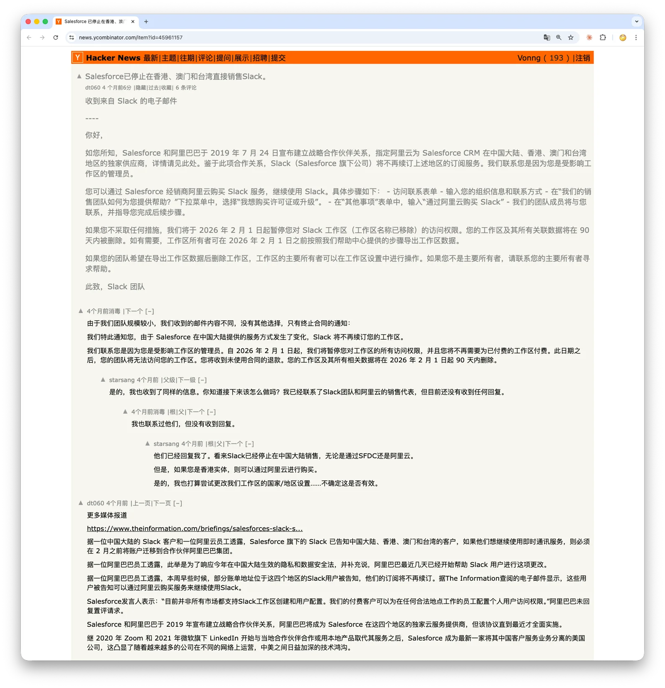

**从 Slack 大中华区关停，看数字时代最被忽视的风险**

---

2026 年 4 月 1 日，愚人节。

但对成千上万使用 Slack 的香港、澳门、大陆团队来说，这一天发生的事情一点也不好笑。

早上打开 Slack，看到的不是同事们的消息，而是一行冷冰冰的提示：你的工作区已被停用。所有消息、文件、频道、工作流，多年积累的组织记忆，全部不可访问。

没有商量，没有过渡，数据进入删除倒计时。

---

## 一、发生了什么

2025 年 11 月，Salesforce 旗下的 Slack 向大中华区用户发出通知：由于 Salesforce 与阿里巴巴在 2019 年建立的战略合作关系，Slack 将不再直接续约该区域的订阅，受影响用户需要在 2026 年 2 月前做出安排。([来源：The Information 报道](https://www.theinformation.com/briefings/salesforces-slack-stop-direct-service-china-farm-alibaba)；[Hacker News 讨论帖](https://news.ycombinator.com/item?id=45961157) 中有两封不同版本通知邮件的全文)

> https://news.ycombinator.com/item?id=45961519

但不同规模的用户，收到的是完全不同的两封信。

大客户的邮件里有一条出路：通过阿里云 reseller 继续购买 Slack 服务。小团队收到的则是一封告别信，“你的服务将在 2026 年 2 月 1 日终止，工作区和全部数据将在停用后 90 天内删除。”没有替代方案，没有迁移路径。([HN 用户贴出的小团队终止通知原文](https://news.ycombinator.com/item?id=45961519))

2026 年 4 月 1 日，工作区被实际停用。多名用户在 Reddit 上报告：当天登录发现工作区已锁死，此前没有收到任何通知，或者说，通知只发给了工作区的 Owner 和 Admin，普通成员不在通知对象内；而即便是 Owner 和 Admin，也有大量人声称没有收到邮件。([gizchina 报道](https://www.gizchina.com/tech/slack-terminates-services-across-greater-china-triggering-user-backlash/)；[yage.ai 长文分析](https://yage.ai/share/slack-china-workspace-exit-en-20260402.html))

Slack 客服的回复模板确认了这一点：“我们已提前通知了工作区的 Owner 和 Admin。”但当后果是团队永久丧失工作数据时，“我们通知了管理员”是一个技术上成立、体验上灾难的答案。

---

## 二、阿里云：谁的出路？

所谓“迁移到阿里云”的出路，也远没有听起来那么通畅。

4 月 1 日流出的 Slack 支持模板显示：通过阿里云 reseller 续购的路径仅适用于部分香港付费客户；对大陆和澳门用户，模板原文写着 “Slack via Alibaba Cloud is not available in China and Macau”。([yage.ai 分析文引用了完整模板](https://yage.ai/share/slack-china-workspace-exit-en-20260402.html))

换句话说，如果你是大陆或澳门的用户，“阿里云迁移”从一开始就不是为你准备的。如果你是小团队，不管你在哪里，你连这个选项都看不到。

而即便阿里云真的能迁移成功，你从一个你无法控制的平台，搬到了另一个你无法控制的平台。平台逻辑没变，你依然是租客，不是业主。

---

## 三、你的数据，你能拿走吗？

这是整个事件中最值得深究的部分。有人会说：Slack 给了 90 天的删除倒计时，用户应该趁这段时间导出数据。但这里有两层问题。

**第一层：停用前的窗口期确实存在，但很多人错过了。** 从 2025 年 11 月通知到 2026 年 4 月停用，最长有将近 5 个月的准备时间，如果你收到了通知的话。
而大量用户报告称没有收到。在 Slack 的用户协议模型里，合同项下的通知只送给 Customer（即工作区 Owner），不送给每一个 Authorized User。一个 50 人的团队，可能只有一个人在通知链上，而那个人可能根本没看到那封邮件。

**第二层：一旦工作区被停用，自助导出能力也一并消失。** Slack 的数据导出功能需要管理员登录后台操作（设置 → 工作区设置 → 导入/导出数据）。
工作区停用后，后台不可访问，自助导出通道就断了。后续你只能联系 Slack 客服请求数据返还，这取决于你的付费计划、客服响应速度和 Slack 的裁量。([Slack 官方导出文档](https://slack.com/help/articles/201658943-Export-your-workspace-data))

更关键的是：即使在正常状态下，免费和 Pro 计划也只能导出公共频道的消息；私聊和私有频道的导出，在 Business+ 以下需要单独申请，Slack 有权拒绝。([Slack 官方导入/导出指南](https://slack.com/help/articles/204897248-Guide-to-Slack-import-and-export-tools))

所以现实是：你以为你拥有的数据，在你最需要它的那一刻，你可能既看不到，也拿不走，不是因为法律上它不属于你，而是因为技术上的控制权不在你手里。

---

## 四、这不是第一次

这不是 SaaS 平台第一次让用户突然失去对数据的访问。但不同事件的触发机制不同，值得分开看。

**第一类：制裁合规。** 2018 年，Slack 为合规美国 OFAC 制裁，封禁了所有与伊朗相关的账户，包括一个在加拿大温哥华读博的伊朗裔学者、几年前去伊朗旅游过一次的比利时人、一个 CTO 去克里米亚度假导致整个公司工作区被停用的团队。执行极其粗暴，事后 Slack 道歉并修正了策略，承认误封了一批账户。([Slack 官方道歉博客](https://slack.com/blog/news/an-apology-and-an-update)) 2019 年，GitHub 对伊朗、叙利亚、克里米亚开发者实施了类似限制，封锁私有仓库访问，事后在 2021 年获得 OFAC 许可恢复了伊朗用户的全部服务。([GitHub 贸易管制说明](https://docs.github.com/en/site-policy/other-site-policies/github-and-trade-controls))

**第二类：商业退出。** 这就是 2026 年 Slack 大中华区的情况。香港不是伊朗那种全面禁运辖区，美国对香港存在针对特定个人和实体的制裁项目，但没有全面贸易禁运。Slack 退出的核心驱动力是合规成本：在中国直接提供 SaaS 服务需要本地基础设施部署、数据安全评估、监管审查，成本极高。当成本超过收入，Salesforce 选择退出。这是一个可以理解的商业决策，但对用户来说，结果和制裁关停没有本质区别。

**第三类：国家封锁。** 2026 年 2 月，印度政府据报道依据《信息技术法》第 69A 条对 Supabase 域名实施了网络封锁，导致大量印度开发者在数天内无法访问后端服务，生产环境的应用出现认证失效和数据库连接中断。Supabase 后来确认封锁令在 3 月 3 日被撤销，整个封锁持续约 8 天。([Supabase 印度封锁分析](https://articles.uvnetware.com/news/why-supabase-stopped-working-india-2026/))

三类事件，三种触发因素，美国制裁、商业退出、政府封锁，**但共同的失效模式只有一个：你对关键基础设施的可用性，取决于一个你无法控制的外部主体的决策。**

---

## 五、这不是道德问题，是结构问题

Slack 退出大中华区，不是因为它恨中国用户。没有人针对你，没有人要害你。只是商业逻辑运转到了某个节点，你所在的区域不再有利可图，于是你被优化掉了。这恰恰是最可怕的部分，**它不需要恶意，就能摧毁你。**

当你使用 SaaS 时，你签署的 Terms of Service 里通常包含一条：服务商有权在合理通知后终止服务。“合理通知”可能只是一封你没收到的邮件。“终止服务”意味着你的管理后台被锁死，自助导出通道关闭。你的数据在法律上也许还是你的，Slack 的隐私政策确实把 Customer Data 定义为客户控制的数据，但法律意义上的归属和技术意义上的可控是两回事。

再加上美国 CLOUD Act：对于受美国司法管辖的服务商，美国政府可以基于有效法律程序（如法庭传票或搜查令）要求其披露所控制的数据，不论数据存放在哪个国家的服务器上。这不是“随时拿走”，但它意味着你的数据处于一个你无法参与的法律博弈中。

所以问题不是“数据属于谁”，在合同和法律框架里，它属于你。**问题是：可用性、可迁移性、司法管辖和技术控制权，有多少真正在你手里？** Slack 事件已经给出了答案：在服务商决定退出的那一刻，以上全部归零。

---

## 六、如果你还在用 SaaS

我不是说“立刻把所有 SaaS 都换掉”。对很多团队来说，SaaS 依然是最务实的选择。
但你应该问自己一个问题：**如果你今天用的核心工具，即时通讯、代码托管、数据库、文件存储，明天突然进不去了，你的业务还能运转吗？**

如果答案是“不能”，你需要做的事情很简单，而且现在就应该开始。

**底线：定期导出，验证恢复。** 这不需要自建任何东西，只需要纪律。用 Slack，每月导出一次完整消息归档，因为一旦工作区被停用，自助导出就断了。用 GitHub，确保每个仓库在本地有完整克隆。用任何托管数据库，确保有定时备份在跑，并且你验证过恢复流程能真的跑通。灭火器看起来很“浪费空间”，直到火灾来了。

**进阶：核心系统考虑自建。** 如果你的业务对某个 SaaS 的依赖程度已经到了“它挂我就死”的地步，那它就值得自建。

拿这次的核心场景来说，即时通讯。Mattermost 是成熟的开源 Slack 替代品，体验高度接近，已被大量高安全级别的机构采用。
法国政府基于 Matrix/Element 协议部署了自己的安全通讯系统 Tchap，正是出于数据主权的考量。

自建的门槛在 2026 年已经大幅降低：一台 VPS，一个 PostgreSQL 实例，一个容器，AI 编程助手帮你写配置、拉镜像、配反代，部署一个可用的实例，确实可以在一小时内完成。
老冯在 PIGSTY 里很早以前就做了自建 Mattermost 的模板：一个自带高可用 PITR 的 PG，加上一个跑无状态 Mattermost 的容器，几行命令，就可以轻松搭建一套属于自己的 IM。

对于稍微有点技术能力的团队来说，这笔账是划算的，因为你换来的是对数据和可用性的完全控制。对于没有运维能力的团队，底线方案（定期导出 + 恢复演练）也远好于什么都不做。

当然，有人会说：不用 Slack 我还可以用飞书、钉钉、企业微信，这些国内大厂提供了极具性价比的替代品。
没错。但它们本质上依然是 SaaS，只是换了一个你无法控制的平台方。而且它们可能面临另一个维度的合规风险。平台逻辑不变，你的处境就不会变。

---

## 七、数据主权是一个工程问题

“数据主权”这个词说了很多年，但它不是政治口号，它是一个需要工程手段来回答的问题。

它有三个层次：物理位置（数据在哪国的机房）、法律管辖（运营商受哪国法律约束）、技术控制（你能否随时访问、导出、迁移、删除数据）。三层全部满足，你才真正掌握你的数据。

而实现这三层最切实可行的路径是开源软件加自建部署。开源保证技术透明和可迁移，自建保证物理和法律层面的控制权。
这不是唯一的路，合同保障、多云冗余、数据托管协议都能在某些层面提供保护，但它是唯一一条不依赖于任何第三方善意的路。

整条自建替代链在 2026 年已经成熟：即时通讯有 Mattermost、Rocket.Chat、Matrix/Element；代码托管有 Gitea、GitLab；
数据库用 PostgreSQL 自建，像 Supabase 也有成熟的开源一键自建方案；对象存储有 MinIO；身份认证有 Keycloak。这些方案的共同特点是：开源、可自部署、数据在你手里。

---

## 八、结语

2026 年 4 月 1 日之后，那些失去 Slack 数据的团队里，一定有人在想：如果当初我们用的是自建的方案，今天根本不会有这个问题。

但大多数人不会做改变。他们会骂几天 Slack，然后换一个新的 SaaS，继续把数据交给别人保管，继续相信“这种事不会发生在我身上”。

直到下一次。

数据自主不是一种技术偏好，不是一种政治立场。它是对一个简单问题的回答：**你最核心的资产，控制权到底在谁手里？**

如果答案不是你自己，那你就是在用自己的业务连续性，去赌别人的商业决策。

而这场赌局的赔率，正在对你越来越不利。

---

*老冯 · 2026 年 4 月*

*本文不构成任何商业建议，但构成一个善意的提醒*
