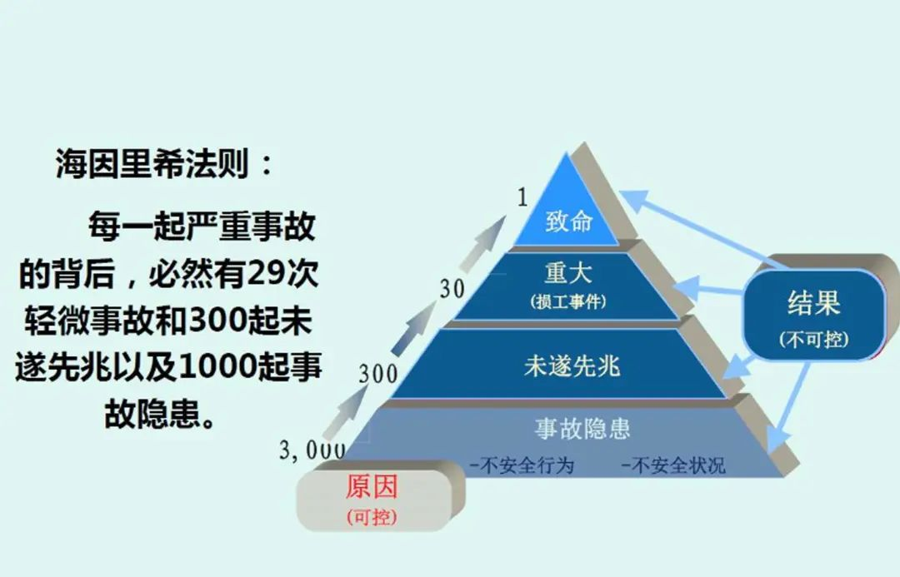
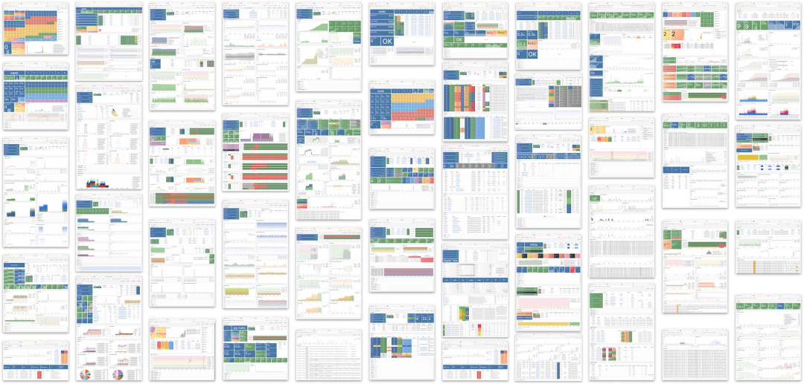
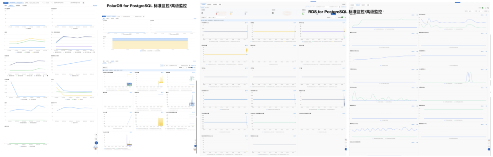

Year-end is performance rush time, but internet giants are having major incidents one after another. They've turned "cost reduction and efficiency improvement" into literal "**cost reduction jokes**" — this is no longer just a meme, but official self-mockery.

Right after Double 11, Alibaba-Cloud had a [**globally historic epic disaster**](/cloud/aliyun/) that broke industry records, then started November's cascade failure mode. After several minor incidents, came another [**cloud database management plane**](http://mp.weixin.qq.com/s?__biz=MzU5ODAyNTM5Ng==&mid=2247486512&idx=1&sn=43d6340fce93bfbf5439cc2cd8e3b8dd&chksm=fe4b39ebc93cb0fd192c69d9f589ccd36f1c1eb5d34fffc357cf0b8177c746c4b3445ea5f63a&scene=21#wechat_redirect) cross-border two-hour major outage — from monthly explosions to weekly explosions to daily explosions.

But before the dust settled, **Didi** had an outage lasting over 12 hours with **hundreds of millions** in losses — Alibaba's substitute Gaode ride-hailing directly exploded with orders and made a fortune, truly "what's lost in the east is gained in the west."

I already did a [**postmortem**](http://mp.weixin.qq.com/s?__biz=MzU5ODAyNTM5Ng==&mid=2247486468&idx=1&sn=7fead2b49f12bc2a2a94aae942403c22&chksm=fe4b39dfc93cb0c92e5d4c67241de0519ae6a23ce6f07fe5411b95041accb69e5efb86a38150&scene=21#wechat_redirect) for the silent Alibaba-Cloud in "[What Can We Learn from Alibaba-Cloud's Epic Failure](http://mp.weixin.qq.com/s?__biz=MzU5ODAyNTM5Ng==&mid=2247486468&idx=1&sn=7fead2b49f12bc2a2a94aae942403c22&chksm=fe4b39dfc93cb0c92e5d4c67241de0519ae6a23ce6f07fe5411b95041accb69e5efb86a38150&scene=21#wechat_redirect)": Auth failed due to misconfiguration, suspected root cause is OSS/Auth circular dependency — one wrong whitelist/blacklist configuration and it deadlocks.

Didi's problem was reportedly a **Kubernetes** upgrade disaster. This shocking recovery time usually relates to storage/database issues. Reasonable speculation of root cause: accidentally downgraded k8s master, jumping multiple versions at once — etcd metadata got corrupted, all nodes failed, and couldn't be quickly rolled back.

Failures are unavoidable, whether hardware defects, software bugs, or human operational errors — the probability can never drop to zero. However, **reliable systems** should have **fault tolerance and resilience** — able to anticipate and handle these failures, minimizing impact and shortening overall failure time as much as possible.

Unfortunately, these internet giants performed far below standards — at least their actual performance was far from their claimed "***1-minute detection, 5-minute handling, 10-minute recovery***."

-------------

## Cost-Reduction Jokes

According to **Heinrich's Law**, behind one major incident are 29 accidents, 300 near-misses, and thousands of incident risks. In aviation, if similar things happened — not even needing actual consequential accidents, just two consecutive incident precursors — not even accidents yet — severe industry safety overhauls would immediately begin comprehensively.

Reliability is important, not just for critical services like air traffic control/flight systems. We also expect more mundane services and applications to run reliably — cloud vendor global unavailability incidents almost equal power/water outages. Transportation platform outages mean transportation network partial paralysis. E-commerce platform and payment tool unavailability causes huge income and reputation losses.

The internet has penetrated every aspect of our lives, yet effective regulation of internet platforms hasn't been established. Industry leaders choose to play dead when facing crises — not even anyone coming out for frank crisis PR and incident postmortems. No one answers: why do these failures occur? Will they continue occurring? Have other internet platforms conducted self-examinations? Have they confirmed their backup plans still work?

We don't know the answers to these questions. But we can be sure that unrestricted complexity accumulation plus massive layoffs are showing consequences. Service failures will become increasingly frequent until they become the new normal — anyone could be the next unlucky "butt of jokes." To escape this grim fate, we need real "cost reduction and efficiency improvement."

-------------

## Cost Reduction and Efficiency Improvement

When failures occur, they go through a process of **problem perception, analysis and location, resolution and handling**. All these require system R&D/operations personnel to invest brainpower for handling. In this process, there's a basic empirical rule:

Failure handling time **t** = 

System and problem complexity **W** / Available online intellectual power **P**.

Failure handling optimization aims to shorten failure recovery time `t` as much as possible. For example, Alibaba likes talking about "1-5-10" stability indicators: 1-minute detection, 5-minute handling, 10-minute recovery — setting a hard time indicator.

With time limits fixed, you either reduce costs or improve efficiency. However, **cost reduction should target system complexity costs, not personnel costs; efficiency improvement shouldn't be about presentation talking points and jokes, but available online intellectual power and management effectiveness**. Unfortunately, many companies did neither well, turning cost reduction and efficiency improvement into cost reduction jokes.

-------------

## Reducing Complexity Costs

**Complexity** has various aliases — technical debt, spaghetti code, mud swamps, architectural circus gymnastics. Symptoms might manifest as: state space explosion, tight coupling between modules, tangled dependencies, inconsistent naming and terminology, performance problem hacks, special cases to work around, etc.

**Complexity is a cost**, so **simplicity** should be a key goal when building systems. However, many technical teams don't consider this when making plans, instead making things as complex as possible: tasks solvable with a few services must be split into dozens using microservices philosophy; not many machines, but insist on Kubernetes for elastic gymnastics; tasks solvable with single relational databases must be split among different components or distributed databases.

These behaviors introduce massive **accidental complexity** — complexity emerging from specific implementations, not inherent to the problem itself. A typical example is many companies like shoving everything onto K8S regardless of need: etcd/Prometheus/CMDB/databases. Once problems occur, circular dependencies cascade, one major failure brings everything down permanently.

Another example: where complexity costs should be paid, many companies are unwilling to pay: putting one oversized K8S in one data center instead of multiple small clusters for gray deployment, blue-green deployment, rolling upgrades. Finding version-by-version compatibility upgrades troublesome, insisting on jumping multiple versions at once.

In dysfunctional engineering cultures, many engineers take pride in boring large-scale systems and high-wire architectural gymnastics — but technical debt from these stunts becomes karma during failures.

"**Intellectual power**" is another important issue. **Intellectual power is hard to aggregate spatially** — team intellectual power often depends on the level of a few key soul figures and their communication costs. For example, when databases have problems, database experts are needed; when Kubernetes has problems, K8S experts are needed.

However, when you put databases into Kubernetes, separate database experts and K8S experts' intellectual bandwidth is hard to combine — you need dual-expertise experts to solve problems. Auth service and object storage circular dependencies are similar — you need engineers familiar with both. Using two separate experts isn't impossible, but their synergy easily gets pulled down to negative returns by quadratically growing communication costs. The "more people, dumber" phenomenon during failures follows this logic.

When system complexity costs exceed team intellectual power, disaster-level failures easily occur. This is hard to see normally because debugging, analyzing, and resolving a problematic service's complexity far exceeds the complexity of getting services up and running. Normally it seems fine to lay off two here, three there — systems still run.

However, organizational tacit knowledge is lost as veterans leave. When lost to a certain degree, the system becomes walking dead — just waiting for some trigger to knock it down and explode. In the ruins, new generations of young novices gradually become veterans, then lose cost-effectiveness and get fired, cycling endlessly in the loop above.

-------------

## Increasing Management Effectiveness

Can't Alibaba-Cloud and Didi recruit excellent enough engineers? Not really — **their management levels and philosophies are inferior, not using these engineers well**. I've worked at Alibaba, also at Nordic-style startups like Tantan and foreign companies like Apple. I deeply understand the management level gaps. I can give a few simple examples:

**First is on-call duty**. At Apple, our team had over ten people across three time zones: Berlin Europe, Shanghai China, California USA, with work hours connecting end-to-end. Engineers in each location had complete brainpower for handling various problems, ensuring on-call capability during work hours at any moment, without affecting respective life quality.

At Alibaba, on-call usually became R&D concurrent responsibility, 24-hour potential surprises, even middle-of-night alert bombardments were common. Domestic giants can actually throw people at the real places needing it, but become stingy instead: waiting for sleepy-eyed R&D to wake up, turn on computers, connect VPN might take several minutes. The real places where people and resources could be thrown, they don't throw.

**Second is system building**. For example, from failure handling reports, if core infrastructure service changes have no testing, monitoring, alerting, validation, gray deployment, rollback, with circular dependency architectures not thought through, they indeed deserve the "amateur hour" title. Still giving a specific example: **monitoring systems**. Well-designed monitoring systems can drastically shorten failure determination time — essentially pre-analyzing server metrics/logs, and this part often requires the most intuition, inspiration, insight, and is most time-consuming.

Not being able to locate root causes reflects inadequate observability construction and failure preparedness. Taking databases as an example, when I worked as PostgreSQL DBA, I built this [**monitoring system**](http://mp.weixin.qq.com/s?__biz=MzU5ODAyNTM5Ng==&mid=2247485827&idx=1&sn=9b13273b559fa63e96d4ac77268bd00a&chksm=fe4b3c58c93cb54e87b062c6db4b3a712037e25dbfbe69aa50ad9b79abf2c97967b625fe1a7f&scene=21#wechat_redirect) (https://demo.pigsty.cc[1]). As shown in the left image, dozens of dashboards tightly organized — any PG failure can be immediately located within 1 minute by drilling down 2-3 levels with mouse clicks, then quickly handled and recovered according to playbooks.

Looking at Alibaba-Cloud RDS for PostgreSQL and PolarDB cloud database monitoring systems, everything is just this pitiful single page of charts. If they're using this thing to analyze and locate failures, no wonder others need dozens of minutes.

**Third is management philosophy and insight**. For example, stability construction needs 10 million investment. There's always opportunistic amateur hours jumping out saying: we only need 5 million or less — then maybe do nothing, just **bet** no problems occur. Win the bet, make easy money; lose the bet, leave. But it's also possible this team has real skills using technology to reduce costs. But how many people in leadership positions have enough insight to truly distinguish this?

Another example: advanced failure experience is actually very valuable wealth for engineers and companies — these are lessons fed with real money. However, many managers' first thought when problems occur is to "sacrifice a programmer/operations engineer," giving away this wealth to the next company for free. Such environments naturally produce blame-shifting culture, do-nothing-wrong attitudes, and muddling through.

**Fourth is people-first**. Taking myself as an example, at Tantan I almost fully automated my work as DBA. Why did I do this? First, I could enjoy the dividends of technological progress — automating my own work let me have plenty of time for tea and newspapers. The company wouldn't fire me for automation and daily tea drinking, so no security concerns, allowing free exploration. I single-handedly created a complete [open source RDS](http://mp.weixin.qq.com/s?__biz=MzU5ODAyNTM5Ng==&mid=2247485518&idx=1&sn=3d5f3c753facc829b2300a15df50d237&chksm=fe4b3d95c93cb4833b8e80433cff46a893f939154be60a2a24ee96598f96b32271301abfda1f&scene=21#wechat_redirect).

But could such things happen in Alibaba-like environments? — "*Today's best performance is tomorrow's minimum requirement*". OK, you did automation, right? Results show underutilized work time, so managers find garbage tasks or garbage meetings to fill your time. Worse, you painstakingly built systems, eliminated your own irreplaceability, immediately facing the fate of successful rabbits dying and hunting dogs being cooked, finally having achievements stolen by people good at PPTs and talking.

So the final optimal game strategy is naturally: capable ones go solo, performers sit on trains shaking bodies pretending to move forward until major disasters.

Most terrifyingly, domestic giants emphasize people are replaceable screws, human resources to be "mined out" by 35, with frequent layoffs and last-place elimination. If **job security** becomes an urgent problem, who can settle down to work steadily?

Mencius said: "**If the ruler treats ministers like hands and feet, ministers treat the ruler like heart and belly; if the ruler treats ministers like dogs and horses, ministers treat the ruler like strangers; if the ruler treats ministers like dirt, ministers treat the ruler like enemies**." This backward management level is where many companies really need efficiency improvement.