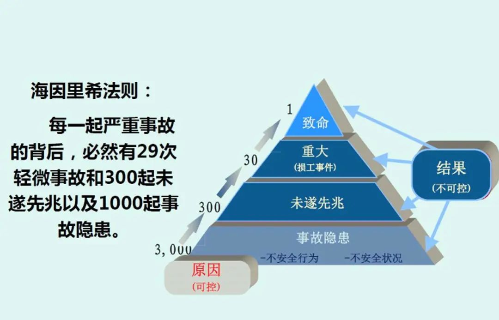
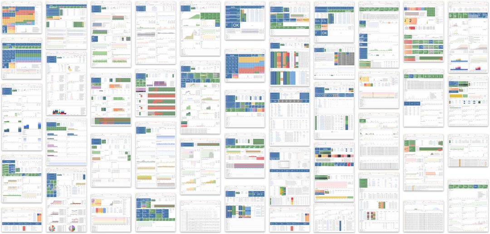

年底正是冲绩效的时间，互联网大厂大事故却是一波接一波。硬生生把降本增效搞成了“**降本增笑**” —— 这已经不仅仅是梗了，而是来自官方的自嘲。

双十一刚过，阿里云就出了打破行业纪录的 [**全球史诗级大翻车**](/cloud/aliyun)，然后开始了11月连环炸模式，在几次小故障后，又来了一场[**云数据库管控面**](http://mp.weixin.qq.com/s?__biz=MzU5ODAyNTM5Ng==&mid=2247486512&idx=1&sn=43d6340fce93bfbf5439cc2cd8e3b8dd&chksm=fe4b39ebc93cb0fd192c69d9f589ccd36f1c1eb5d34fffc357cf0b8177c746c4b3445ea5f63a&scene=21#wechat_redirect)跨国俩小时大故障—— 从月爆到周爆再到日爆。

但话音未落，**滴滴**又出现了一场超过12小时的大失效，资损**几个亿** —— 替代品阿里旗下的高德打车直接爆单赚翻，堪称失之桑榆，收之东隅。

我已经替装死的阿里云做过[**复盘**](http://mp.weixin.qq.com/s?__biz=MzU5ODAyNTM5Ng==&mid=2247486468&idx=1&sn=7fead2b49f12bc2a2a94aae942403c22&chksm=fe4b39dfc93cb0c92e5d4c67241de0519ae6a23ce6f07fe5411b95041accb69e5efb86a38150&scene=21#wechat_redirect)了《[我们能从阿里云史诗级故障中学到什么](http://mp.weixin.qq.com/s?__biz=MzU5ODAyNTM5Ng==&mid=2247486468&idx=1&sn=7fead2b49f12bc2a2a94aae942403c22&chksm=fe4b39dfc93cb0c92e5d4c67241de0519ae6a23ce6f07fe5411b95041accb69e5efb86a38150&scene=21#wechat_redirect)》：Auth因为配置失当挂了，推测根因是 OSS/Auth 循环依赖，一改错黑白名单就死锁了。

滴滴的问题，据说是 **Kubernetes** 升级大翻车。这种惊人的恢复时长通常会与存储/数据库有关，合理推测根因是：不小心降级了 k8s master ，还一口气跳了多个版本 ——  etcd 中的元数据被污染，最后节点全都挂掉，而且无法快速回滚。

故障是难以避免的，无论是硬件缺陷，软件Bug，还是人为操作失误，发生的概率都不可能降为零。然而**可靠的系统**应当具有**容错韧性** —— 能够预料并应对这些故障，并将冲击降低至最小程度，尽可能缩短整体失效时间。

不幸的是在这一点上，这些互联网大厂的表现都远远有失水准 —— 至少实际表现与其声称的 “***1分钟发现、5分钟处置、10分钟恢复***” 相距甚远。

-------------

## 降本增笑

根据**海因法则**，一起重大故障背后有着29次事故，300次未遂事故以及数千条事故隐患。在民航行业如果出现类似的事情 —— 甚至不需要出现真正造成任何后果的事故，只是连续出现两起事故征候 —— 甚至都还不是事故，那么可怕严厉的行业安全整顿马上就会全面展开。

可靠性很重要，不仅仅是对于空中交管/飞行控制系统这类关键服务而言，我们也期望更多平凡的服务与应用能够可靠地运行 —— 云厂商的全局不可用故障几乎等同于停电停水，出行平台宕机意味着交通运力网络部分瘫痪，电商平台与支付工具的不可用则会导致收入和声誉的巨大损失。

互联网已经深入至我们生活的各个层面，然而针对互联网平台的有效监管还没有建立起来。行业领导者在面对危机时选择躺尸装死 —— 甚至都没人出来做一个坦率的危机公关与故障复盘。没有人来回答；这些故障为什么会出现？它们还会继续出现吗？其他互联网平台为此做了自纠自查了吗？它们确认自己的备用方案依然有效了吗？

这些问题的答案，我们不得而知。但可以确定的是，毫无节制堆积复杂度与大规模裁员的恶果开始显现，服务故障失效会越来越频繁以至于成为一种新常态 —— 谁都随时可能会成为下一个惹人笑话的“倒霉蛋”。想要摆脱这种暗淡的前景命运，我们需要的是真正的“降本增效”

-------------

## 降本增效

当故障出现时，都会经过一个 **感知问题，分析定位，解决处理** 的过程。所有的这些事情都需要系统的研发/运维人员投入脑力进行处理，而在这个过程中有一条基本经验法则：

处理故障的耗时 **t** = 

系统与问题复杂度 **W** / 在线可用的智力功率 **P**。

故障处理的优化的目标是尽可能缩短故障恢复时间 `t` ，例如阿里喜欢讲的 “1-5-10” 稳定性指标：1 分钟发现、5 分钟处置、10 分钟恢复，就是设置了一个时间硬指标。

在时间限制死的情况下，要么降本，要么增效。只不过，**降本要降的不是人员成本，而是系统的复杂度成本；增效不是增加汇报的谈资笑料，而是在线可用的智力功率与管理的有效性**。很不幸的是，很多公司这两件事都没做好，活生生地把降本增效搞成了降本增笑。

-------------

## 降低复杂度成本

**复杂度**有着各种别名 —— 技术债，屎山代码，泥潭沼泽，架构杂耍体操。症状可能表现为：状态空间激增、模块间紧密耦合、纠结的依赖关系、不一致的命名和术语、解决性能问题的 Hack、需要绕开的特例等等。

**复杂度是一种成本**，因而**简单性**应该是构建系统时的一个关键目标。然而很多技术团队在制定方案时并不会将其纳入考虑，反而是怎么复杂怎么来：能用几个服务解决的任务，非要用微服务理念拆分成几十个服务；没多少机器，却非要上一套 Kubernetes 玩弹性杂耍；单一关系型数据库就能解决的任务，非要拆给几种不同的组件或者倒腾个分布式数据库。

这些行为都会引入大量的**额外复杂度** —— 即由具体实现中涌现，而非问题本身固有的复杂度。一个最典型的例子，就是许多公司不管需要不需要，都喜欢把什么东西都往 K8S 上怼，etcd / Prometheus / CMDB / 数据库，一旦出现问题就循环依赖大翻车，一次大挂就彻底起不来了。

再比如应该支付复杂度成本的地方，很多公司又不愿意支付了：一个机房就放一个特大号 K8S ，而不是多个小集群灰度验证，蓝绿部署，滚动升级。一个版本一个版本的兼容性升级嫌麻烦，非要一次性跳几个版本。

在畸形的工程师文化中，不少工程师都会以傻大黑粗的无聊规模与高空走钢丝的架构杂耍为荣 —— 而这些折腾出来欠下的技术债都会在故障的时候变为业报回来算账。

“**智力功率**” 则是另一个重要的问题。**智力功率很难在空间上累加** —— 团队的智力功率往往取决于最资深几个灵魂人物的水平以及他们的沟通成本。比如，当数据库出现问题时需要数据库专家来解决；当 Kubernetes 出现问题时需要 K8S 专家来看问题；

然而当你把数据库放入 Kubernetes 时，单独的数据库专家和 K8S 专家的智力带宽是很难叠加的 —— 你需要一个双料专家才能解决问题。认证服务和对象存储循环依赖也同理 —— 你需要同时熟悉两者的工程师。使用两个独立专家不是不可以，但他们之间的协同增益很容易就会被平方增长的沟通成本拉低到负收益，故障时人一多就变傻就是这个道理。

当系统的复杂度成本超出团队的智力功率时，就很容易出现翻车性的灾难。然而这一点在平时很难看出来：因为调试分析解决一个出问题的服务的复杂度，远远高于将服务拉起运行的复杂度。平时好像这里裁两个人，那里裁三个，系统还是能正常跑的嘛。

然而组织的默会知识随着老司机离开而流失，流失到一定程度后，这个系统就已经是期货死人了 —— 只差某一个契机被推倒引爆。在废墟之中，新一代年轻嫩驴又逐渐变为老司机，随即丧失性价比被开掉，并在上面的循环中不断轮回。

-------------

## 增加管理效能

阿里云和滴滴招不到足够优秀的工程师吗？并不是，**而是其的管理水平与理念低劣，用不好这些工程师**。我自己在阿里工作过，也在探探这种北欧风格的创业公司和苹果这样的外企待过，对其中管理水平的差距深有体会。我可以举几个简单的例子：

**第一点是值班OnCall**，在 Apple 时，我们的团队有十几号人分布在三个时区：欧洲柏林，中国上海，美国加州，工作时间首尾衔接。每一个地方的工程师都有着完整处理各种问题的脑力功率，保证任一时刻都有在工作时间待命OnCall的能力，同时也不会影响各自的生活质量。

而在阿里时，OnCall 通常变成了研发需要兼任的职责，24小时随时可能有惊喜，即使是半夜告警轰炸也屡见不鲜。本土大厂在真正可以砸人的地方，反而又吝啬起来：等研发睡眼惺忪爬起来打开电脑连上 VPN，可能已经过去好几分钟了。在真正可以砸人砸资源解决问题的地方反而不砸了。

**第二点是体系建设**，比如从故障处理的报告看，核心基础设施服务变更如果没测试，没监控，没告警，没校验，没灰度，没回滚，架构循环依赖没过脑袋，那确实配得上草台班子的称号。还是说一个具体的例子：**监控系统**。设计良好的监控系统可以极大缩短故障的判定时间 —— 这种本质上是对服务器指标/日志提前进行了数据分析，而这一部分往往是最需要直觉、灵感与洞察力，最耗费时间的步骤。

定位不到根因这件事，就是反映出可观测性建设和故障预案不到位。拿数据库举个例子吧，我做 PostgreSQL DBA 的时候做了这个[**监控系统**](http://mp.weixin.qq.com/s?__biz=MzU5ODAyNTM5Ng==&mid=2247485827&idx=1&sn=9b13273b559fa63e96d4ac77268bd00a&chksm=fe4b3c58c93cb54e87b062c6db4b3a712037e25dbfbe69aa50ad9b79abf2c97967b625fe1a7f&scene=21#wechat_redirect) (https://demo.pigsty.cc[1])，如左图，几十个Dashboard 紧密组织，任何PG故障用鼠标点点下钻两三层，1分钟不用就能立即定位各种问题，然后迅速按照预案处理恢复。

再看一下阿里云 RDS for PostgreSQL 与 PolarDB 云数据库用的监控系统，所有的东西就这可怜巴巴的一页图，如果他们是拿这个玩意来分析定位故障，那也怪不得别人要几十分钟了。

**第三点是管理理念与洞察力**，比如，稳定性建设需要投入一千万，总会有机会主义的草台班子跳出来说：我们只要五百万或者更少 —— 然后可能什么都不做，就**赌**不会出现问题，赌赢了就白赚，赌输了就走人。但也有可能，这个团队有真本事用技术降低成本，可是又有多少坐在领导位置上的人有足够的洞察力可以真正分辨这一点呢？

再比如，高级的故障经验对于工程师和公司来说其实是一笔非常宝贵的财富 —— 这是用真金白银喂出来的教训。然而很多管理者出了问题第一时间想到的就是要“开个程序员/运维祭天”，把这笔财富白送给下家公司。这样的环境自然而然就会产生甩锅文化、不做不错、苟且偷安的现象。

**第四点是以人为本**。以我自己为例，我在探探将自己作为 DBA 的数据库管理工作几乎全自动化了。我会做这件事的原因：首先是我自己能享受到技术进步带来的红利 —— 自动化自己的工作，我就可以有大把时间喝茶看报；公司也不会因为我搞自动化每天喝茶看报就把我开了，所以没有安全感的问题，就可以自由探索，一个人搞出一整套完整的 [开源 RDS](http://mp.weixin.qq.com/s?__biz=MzU5ODAyNTM5Ng==&mid=2247485518&idx=1&sn=3d5f3c753facc829b2300a15df50d237&chksm=fe4b3d95c93cb4833b8e80433cff46a893f939154be60a2a24ee96598f96b32271301abfda1f&scene=21#wechat_redirect) 出来。

但这样的事在类似阿里这样的环境中可能会发生吗？—— “*今天最好的表现是明天最低的要求*” ，好的，你做了自动化对不对？结果工作时间不饱和，管理者就要找一些垃圾活或者垃圾会议给你填满；更有甚者，你幸幸苦苦的建立好了体系，把自己的不可替代性打掉了，立即面临狡兔死走狗烹的结果，最后被干写PPT出嘴的人摘了桃子。那么最后的博弈优势策略当然是能打的出去单干，能演的坐在列车上摇晃身体假装前进直到大翻车。

最可怕的是，本土大厂讲究人都是可替换的螺丝钉，是35岁就“开采完”的人矿，末位淘汰大裁员也不鲜见。如果 **Job Security** 成为迫在眉睫的问题，谁还能安下心来踏实做事呢？

孟子曰：“**君之视臣如手足，则臣视君如腹心；君之视臣如犬马，则臣视君如国人；君之视臣如土芥，则臣视君如寇仇**”。这种落后的管理水平才是很多公司真正应该增效的地方。