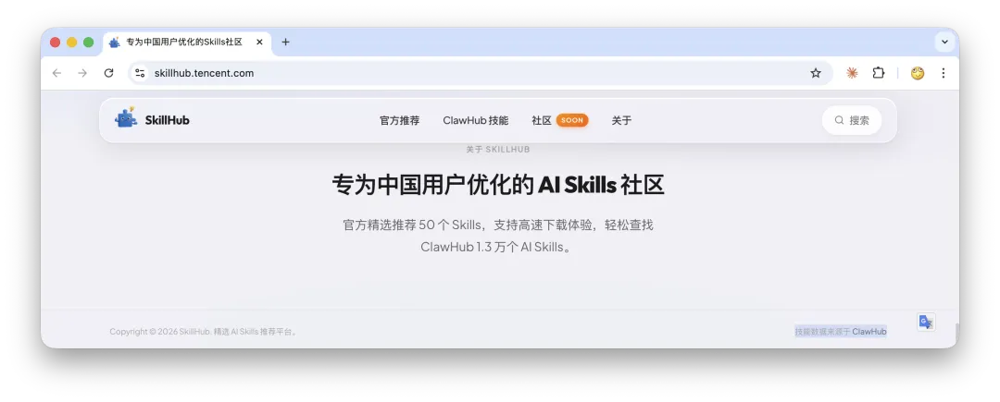
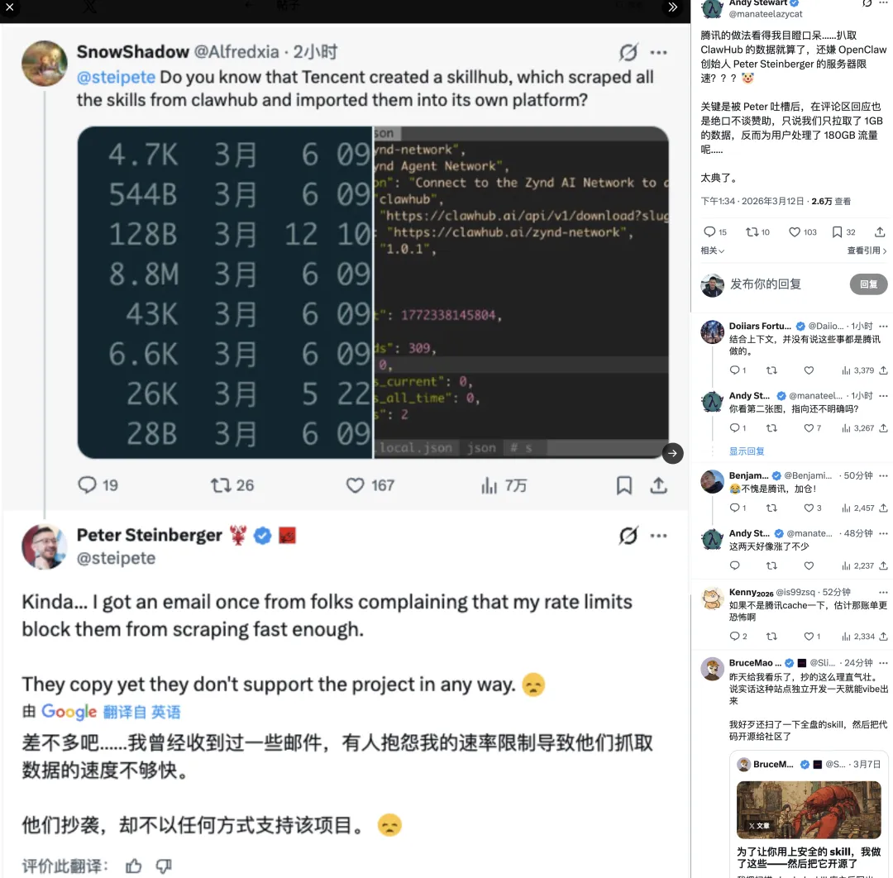
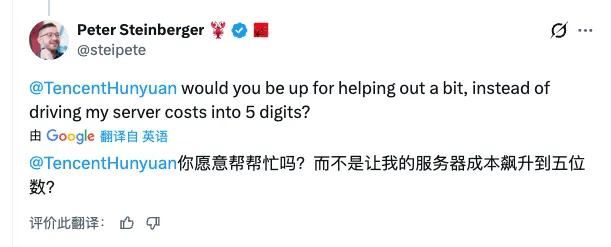
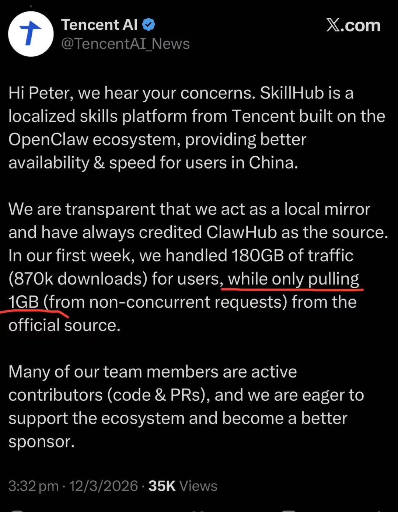
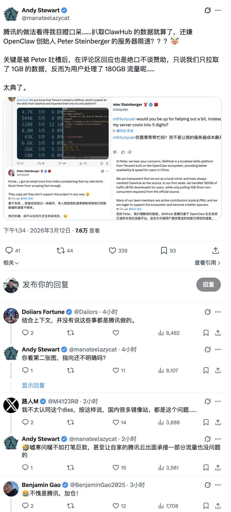
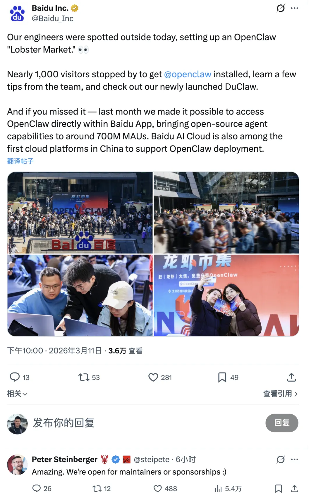

> 谨以此文致敬被腾讯云 “帮助” 的开源项目。

------

## 一、好消息：鹅厂又出手“帮忙”了

2026年3月11日，腾讯云悄然上线了一个叫 **SkillHub** 的平台——把 OpenClaw 官方技能市集 ClawHub 上的 **13,000 多个技能包**，整个搬到了自家服务器上。右下角贴心地标注了一行小字：“技能数据来源于 ClawHub”。

好家伙。标注了出处就叫“镜像”，不标注就叫“原创”。鹅厂这波格局打开了。

------

## 二、龙虾之父的愤怒

事情是 X 平台用户 SnowShadow（@Alfredxia）首先曝出来的：他直接 @ 了 OpenClaw 创始人 Peter Steinberger，质问他是否知道腾讯建了个 SkillHub 把 ClawHub 的技能全搬了过去。

Peter 的回应堪称经典（大意）：

> “差不多吧……我曾经收到过一些邮件，有人抱怨我的速率限制导致他们抓取数据的速度不够快。他们抄袭，却不以任何方式支持项目。😞”

你品品——**人家来投诉你的反爬机制太强了，影响他们搬运的效率。**

Peter 随后直接 @ 了腾讯混元的官方账号，质问（大意）：“你们愿意帮帮忙吗？而不是把我的服务器成本飙升到五位数？”

注意，**五位数美元**。一个独立开发者维护的开源项目，因为大规模抓取等行为，服务器账单直奔五位数。

------

## 三、鹅厂的回应：数学课代表上线

面对质问，腾讯 AI 官方账号的回应堪称教科书级公关。核心就一句话：

> “在第一周，我们为用户处理了 180GB 的流量（87 万次下载），而仅从官方来源拉取了 1GB（来自非并发请求）。”

来，做道数学题：把人家 13,000 个技能包全搬到自己服务器之后，中国用户的请求自然就不再走 ClawHub 了。于是腾讯得意地宣布——**看，我只从上游拉了 1GB，但为用户服务了 180GB！**

> 老冯注：200GB 流量包，腾讯云 CDN 标价约 68 元人民币，内部成本大致在 10 到 20 元区间。

这个逻辑就好比有人照着你的店开了一个在对面，然后跟你说：“你看，自从我开业以来，你门口的客流量下降了很多，我帮你减轻了经营压力。”

知名开发者 Andy Stewart（@manateelazycat）在 X 上的点评一针见血（大意）：

> “腾讯的做法看得我目瞪口呆……扒取 ClawHub 的数据就算了，还嫌人家服务器限速？被吐槽后在评论区回应，绝口不谈赞助，只说我们只拉取了 1GB，反而为用户处理了 180GB 流量……太典了。”

**太典了**——被人指着鼻子说“你把我服务器成本推到五位数了”，回应不是道歉、不是谈赞助，而是掏出计算器说：我帮你省流量了呢。

Peter 后来也把话说明白了：他并非反对做镜像，而是指出腾讯完全可以先沟通、做个官方认可的镜像站、双向同步下载统计。合规是一回事，**礼貌是另一回事**。一家万亿市值的公司，连提前发封邮件打个招呼的基本体面都没有。

------

## 四、十三路诸侯围剿小龙虾

腾讯不是唯一嗅到“龙虾味”的大厂。有网友整理了一份壮观的表格——**13 家国内互联网大厂跟进 OpenClaw**：字节有 ArkClaw，腾讯有 QClaw + SkillHub，京东、小米、华为、美团、阿里、百度、网易有道、月之暗面、MiniMax、智谱、360 纷纷入场，一键部署的、做托管版的、做移动端的、接入自家生态的……好一出“群雄逐虾”。

论坛上有网友一语道破天机（大意）：

> “又能接入大模型卖 token，又能作为用户输入入口。你不占的地盘，别人来占。”

对这些大厂来说，OpenClaw 生态的本质是**一个新的流量入口和触达用户的渠道**。而腾讯的 SkillHub 事件，不过是这场“诸侯圈地运动”中姿势最难看的一个——别人好歹还在做自己的客户端和部署方案，腾讯直接把人家的技能市集整个搬了。

科技圈有句老话：“在深圳，你只需要担心一件事——你的产品还没被腾讯看上。” 从当年各种往事到如今的 SkillHub，模式何其相似：**看你做得好，我就来个一样的，反正我有流量、有用户、有服务器。** 不过这次有个进步——至少标注了来源，鹅史上已经算“诚意满满”了。

------

## 五、写在最后

这件事说穿了很简单：**一家万亿市值的公司，未经沟通照搬了一个独立开发者维护的开源项目数据，被发现后声称“我帮你减轻了负担”。**

开源不等于随便搬。你可以用，但最起码的尊重——事前打个招呼、力所能及赞助一下——这不是法律义务，而是基本体面。当然，这个标准也许对鹅厂要求有点高了……

既然腾讯说“我们渴望支持生态系统，成为更好的赞助商”——那建议从给 Peter 的服务器账单报销开始？五位数美元，对鹅厂来说大概也就是个食堂午餐的预算。GitHub Sponsors 链接在那里摆着呢。

------

**声明：本文所有事实均来源于公开报道及当事人在 X 等公开平台的发言，引用部分均为大意转述。本文仅代表个人观点，如有事实错误，欢迎指正。**

**信息来源：IT之家、TechFlow、PANews 等公开报道；Peter Steinberger (@steipete)、Andy Stewart (@manateelazycat)、Tencent AI (@TencentAI_News)、SnowShadow (@Alfredxia) 等公开发言。**
