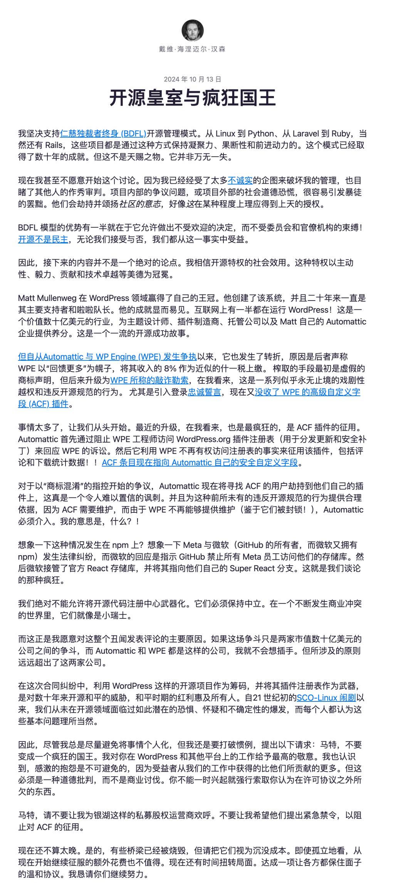

"**I want to be blunt: for years, we've been like fools while they made a fortune off what we developed**." — This famous quote from Redis Labs CEO Ofer Bengal has become a vivid footnote to the WordPress community civil war and the conflict between open source communities and commercial interests.

I believe this incident is highly representative and instructive — when open source ideals conflict with commercial interests, what should be done? How should an open source project founder protect their interests and maintain community health and sustainable development? What insights can this bring to the PostgreSQL community and conflicts between other open source software communities and cloud vendors?

--------

## Background and Context

Recently, the WordPress turmoil has been making waves, with numerous articles already covering it. Simply put, there's a public conflict between two major companies in the WordPress community. One side is Automattic, the other is WP Engine — both sell WP hosting services with annual revenues around $500 million each. However, Automattic's boss Matt Mullenweg is the co-founder of the WordPress project.

The trigger was WordPress co-founder and Automattic CEO Matt Mullenweg publicly criticizing WP Engine at the recent WordCamp conference, describing WP Engine as a "cancer" to the community and questioning its contribution to the WordPress ecosystem. He pointed out that while both WP Engine and Automattic have annual revenues of approximately $500 million, WP Engine only contributes 40 hours of development resources per week, while Automattic contributes 3,988 hours weekly. Mullenweg believes WP Engine profits from modified GPL code but fails to adequately give back to the community.

Then, the verbal sparring quickly escalated to legal disputes, with both sides sending cease and desist letters; the intimidation further escalated to action: Automattic controls the WordPress website, infrastructure, including the extension plugin registry, so they directly hijacked an extension plugin that WP Engine had acquired. More specifically, WP Engine had acquired a WP extension plugin called ACF with over 2 million active installations, and Automattic forked this extension and took over the old extension's name on WordPress.org.

Finally, social media platforms erupted with flame wars between the two companies, which I won't reproduce here — various dramas flying everywhere. The most famous of these are two blog posts by cloud exit pioneer and Ruby on Rails creator DHH. Here are DHH's original blog posts:

- [Automattic is doing open source dirty](https://world.hey.com/dhh/automattic-is-doing-open-source-dirty-b95cf128)

- [Open source royalty and mad kings](https://world.hey.com/dhh/open-source-royalty-and-mad-kings-a8f79d16)

Then Mullenweg's two blog responses:

- [Response to DHH](https://ma.tt/2024/10/on-dhh/)

- [Those Other Lawsuits](https://ma.tt/2024/10/other-lawsuits/)

--------

## Vonng's Commentary

I have no financial relationship with WordPress, but as an open source community founder, participant, and maintainer, I emotionally sympathize with Automattic and its boss — WP project founder Matt Mullenweg. I can understand his anger and frustration, but I really can't endorse his impulsive actions after receiving the cease and desist letter.

From a moral perspective, is it reasonable for WP Engine to freeload off the community with minimal contribution? No, it's not reasonable. But legally, you're using the GPL license — under this license, is it legal for others to make big money through hosting services while complying with open source agreements? What legal basis do you have for demanding tithes and hijacking plugins? None!

---------------

So where's the problem? Open source is essentially a form of gift-giving, and the giver shouldn't expect any reciprocation from the recipient. If you anticipate that recipients will make a fortune with your gift, causing you psychological imbalance, or that recipients will use your gift to compete against your own business, **then you shouldn't have given it to them in the first place**. However, the problem is that traditional open source models have no way to achieve this — **the discriminatory boundary problem**.

Open source software as a gift has a default giving scope — the entire human world, Public Domain! Because open source "doesn't allow" discriminatory clauses. **But you only want to give your software gift to users, not commercial competitors**. What can you do under traditional open source licenses? There's no good solution. You write excellent software, use Apache 2.0 license, great — cloud vendors and competitors install your software on their servers and sell it to users for big profits, while you, the developer, get encouragement from commercial opponents (mockingly) — **please keep up the good work and continue working for us for free.**

--------------

In ancient times, competition was about virtue; in medieval times, about strategy; today, it's about force. In ancient times, open source software participants were basically so-called "pro-sumers" (producer-consumers). Everyone benefited from others' contributions, and participants were basically from the elite class without economic pressure, so this model could work. Thriving healthy open source software communities could accommodate a batch of pure consumers and expect some would eventually become pro-sumers.

But hosting services represented by traditional public cloud vendors, by controlling the final delivery link, capture most of the value in the open source ecosystem. If they're willing to be decent open source community participants actively giving back, this model can barely continue; otherwise, it becomes unbalanced — when community consumers exceed producers' capacity, the open source model faces crisis.

---------

How to solve this problem? Open source communities have actually provided their own answer. In "[Redis Going Closed Source is a Disgrace to 'Open-Source' and Public Clouds](https://vonng.com/en/db/redis-not-oss/)", I've already analyzed in detail — for example, in the database field, it's not hard to see that relationships between leading database companies/communities and cloud vendors have been escalating in recent years. [Redis changed its open source license to RSAL/SSPL](https://vonng.com/en/db/redis-not-oss/), [ElasticSearch changed to AGPLv3](https://vonng.com/en/db/elastic-license/), [MongoDB uses the more restrictive SSPL](https://vonng.com/en/db/mongo-sspl/), MinIO and Grafana also switched to the more restrictive AGPLv3. [Oracle slacks off on MySQL open source version](https://vonng.com/en/db/mysql-vs-pg/), and even [the most friendly PostgreSQL ecosystem is starting to show different voices](https://vonng.com/en/pg/pg-vs-cloud/).

We must understand that open source licenses are like charters for open source communities. Switching open source licenses is essentially an act of re-demarcating community boundaries. Through "implicit discriminatory clauses" in AGPLv3/SSPL or other more restrictive open source agreements, participants who don't align with open source community values are legally excluded.

-----------

The community boundary problem is the **most important issue** facing all open source communities — its importance is even above "whether to be open source" and "dictatorship vs democracy". Many "open source software" communities/companies are very willing to lose the "open source" designation for deeper discrimination and boundary needs — such as using "SSPL" and other licenses not recognized as open source by OSI.

"Who are we? Who are our friends, and who are our enemies?" This is the fundamental question of building communities and establishing order. Contributors who contribute to open source software are obviously the core; users who use and consume the software can be the community body; while competitors and "cloud hosting service" providers who sideline, freeload, and parasitize far more than they contribute are obviously enemies of the community.

Of course, open source communities/companies should more precisely distinguish friends from enemies, expand their circle of friends, and isolate their enemies: Dell and Inspur selling servers, Hetzner, Linode, DigitalOcean, 21Vianet providing hosting servers, even public cloud IaaS departments, Cloudflare/Akamai providing access/CDN services can all be friends, while public cloud PaaS departments/teams/even specific groups that take community-developed open source software to sell without equivalent reciprocation are obviously competitors. Making friends happy and enemies suffer is a basic principle of effective operation.

The WordPress community civil war example gives us excellent insight — Automattic originally held the moral high ground and righteous cause. But they didn't handle the "enemies in the open world" problem well during the community legislative architecture phase. Instead, they used public resources for private purposes in commercial competition, employing improper means that violate basic open source community principles, leading to their current embarrassing situation — like a tumor patient who didn't prevent cancer early on and angrily cut out their own tumor with a knife.

I believe open source software community/company operators can certainly learn many lessons from this case.