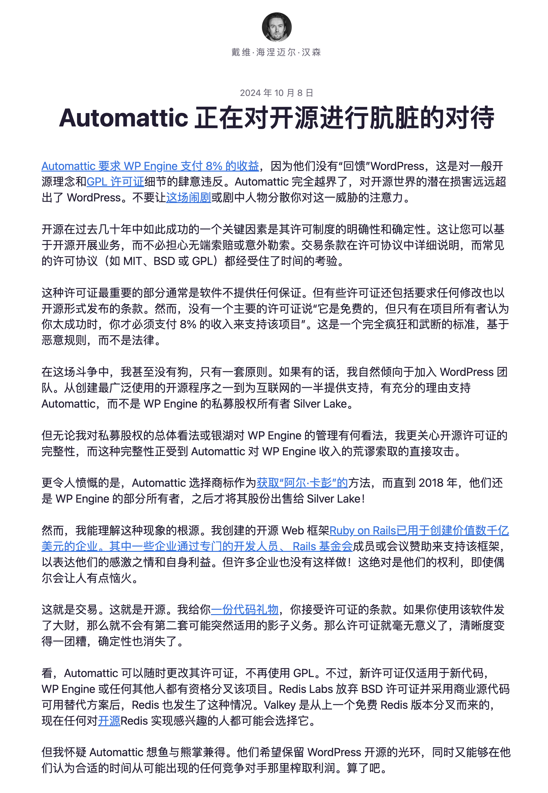
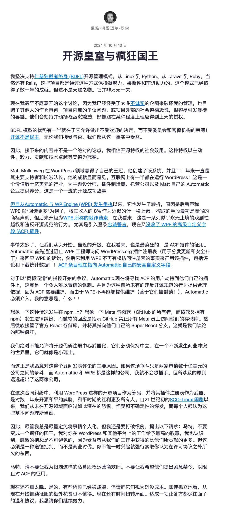
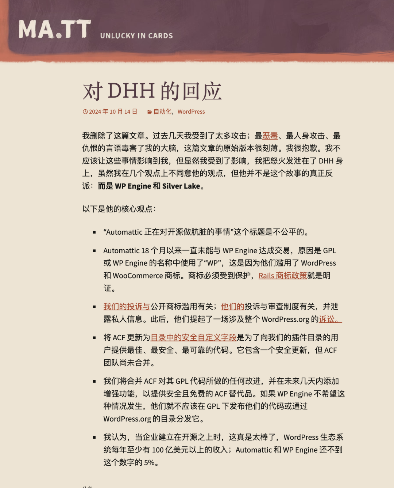
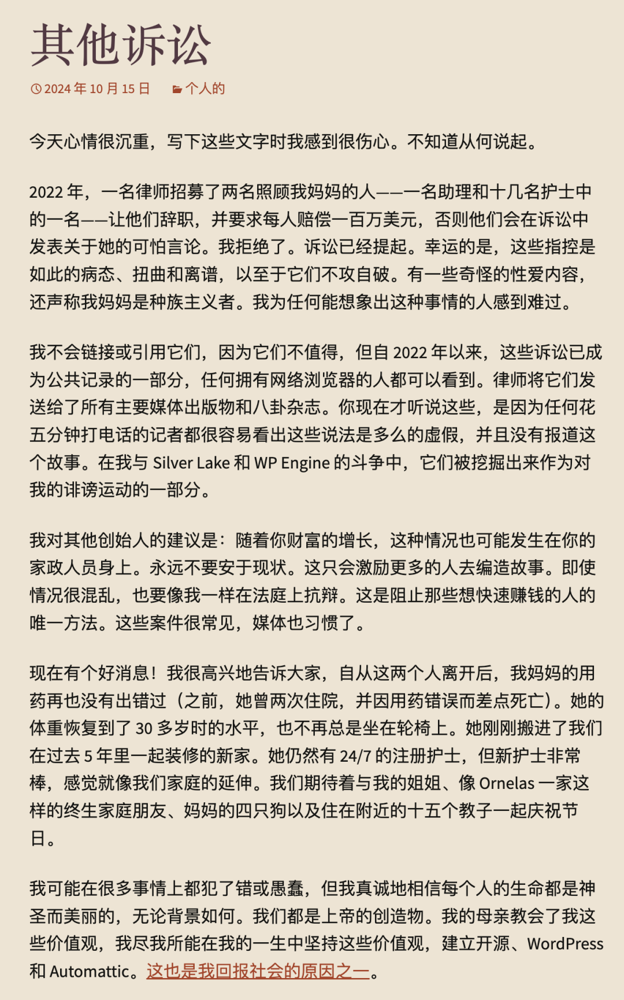

“**我想直率地说：多年来，我们就像个傻子一样，他们拿着我们开发的东西大赚了一笔**”。 —— Redis Labs 首席执行官 Ofer Bengal 的这句名言，成为 WordPress 社区内战，以及开源社区与商业利益之间的冲突的生动注脚。

我认为这个事件非常有代表性和启发意义 —— 当开源理想与商业利益出现冲突时，应该怎么做？一个开源项目的创始人，应当用什么样的方式来保护自己的利益，并维护社区的健康与可持续发展？这对 PostgreSQL 社区和其他开源软件社区与云厂商之间的冲突又能带来什么启示？

--------

## 前因后果

最近，WordPress 风波沸沸扬扬，已经有不少文章报道过了。简单来说就是两家 WordPress 社区的两家主要公司发生了公开冲突。一方是 Automattic，另一方是 WP Engine，这俩公司都卖 WP 托管服务，年营收都是五亿美元左右。不过，A 公司的老板 Matt Mullenweg 是 WordPress 项目的联合创始人。

事情的导火索是 WordPress 联合创始人兼 Automattic CEO Matt Mullenweg 在最近的 WordCamp 大会上公开批评 WP Engine ，将 WP Engine 形容为社区的 “癌症”，质疑其对 WordPress 生态系统的贡献。他指出 WP Engine 和 Automattic 每年的收入均约为 5 亿美元，但 WP Engine 每周仅贡献 40 小时的开发资源，而 Automattic 则每周贡献了 3,988 小时。Mullenweg 认为，WP Engine 通过修改版的 GPL 代码盈利，却未能充分回馈社区。

然后，嘴炮很快升级成为了法律纠纷，双方都向对方发出了律师函；然后威吓又进一步升级为行动：Automattic 控制着 Word Press 网站，基础设施，包括扩展插件的 Registry，所以直接把 WP Engine （收购）的一个扩展插件截胡了。更具体来说，是 WP Engine 收购的一个 WP 扩展插件，ACF，有两百多万活跃安装用户，A 公司把这个扩展分叉了，然后占用了 WP 上老扩展的名字。

最后，在各路社交媒体上，都出现了两遍公司的骂战，这我就不放了，反正各种 Drama 满天飞。这里面最有名的要数下云先锋， Ruby on Rails 作者 DHH 得两篇博客了，以下是 DHH 两篇博客原文：

- [Automattic is doing open source dirty](https://world.hey.com/dhh/automattic-is-doing-open-source-dirty-b95cf128)

- [Open source royalty and mad kings](https://world.hey.com/dhh/open-source-royalty-and-mad-kings-a8f79d16)

然后是当事人 Mullenweg 的两篇博客回应

- [Response to DHH](https://ma.tt/2024/10/on-dhh/)

- [Those Other Lawsuits](https://ma.tt/2024/10/other-lawsuits/)

--------

## 老冯评论

我跟 WordPress 没啥利益关系，但作为一个开源社区的创始人，参与者，维护者，我在感情上是同情 Automattic 和其老板 —— WP 项目创始人 Matt Mullenweg ，我能理解他的愤怒沮丧心情，但确实没法苟同他在收到律师函之后的失智冲动举动。

从道德层面来说，WP Engine 白嫖社区却鲜有贡献合不合情理？不合情理。但从法律上来说，你用的 GPL 协议，按这个协议，别人在遵守开源协议的前提下，通过托管服务赚大钱是不是合法的？你向别人收取什一税，截胡插件有什么法律依据？没有！

---------------

那么问题在哪里呢？开源本质上是一种礼物馈赠，赠与者不应该对受赠人的回报有什么期待。如果你预期到，受赠人会拿着你送的礼物大赚一笔让你自己心里失衡，或者受赠人干脆用你的礼物回头抢你自己的生意，**那你在第一天就不应该送给他**。然而问题在于，传统的开源模型中没有办法实现这一点，**即歧视性划界问题**。

开源软件作为一个礼物，默认的赠送范围是 —— 整个人类世界，Public Domain！因为开源“不允许”歧视性条款。**但你只想把你的软件礼物赠送给用户，而不是商业竞争对手**，在传统开源协议下有什么办法呢？没有什么好办法，你写了一个很好的软件，使用 Apache 2.0 协议，很好，云厂商和竞争对手把你的软件装到他们的服务器上卖给用户大赚一笔，而你这个开发者得到了商业对手的鼓励（嘲讽） —— **请再接再厉，继续给我们打白工吧。**

--------------

上古竞于道德，中世逐于智谋，当今争于气力。在上古时代，开源软件的参与者基本上都属于所谓的 “Pro-sumer”（产消合一者）。每个人都从其他人的贡献中获益，参与者也基本上都属于少部分没有经济压力的精英阶层，所以这种模式可以玩得转。繁荣健康的开源软件社区可以容得下一批纯消费者，并期待他们最终会有一部分成为产消合一者。

但以经典公有云厂商为代表的托管服务，通过掌控最终的交付环节，攫取捕获了开源生态的大部分价值。如果他们愿意成为体面的开源社区参与者积极回馈，这个模式还可以勉强继续运转下去，否则就会失衡 —— 社区秩序的消费者超出生产者的能力，开源模式就会面临危机。

---------

怎么解决这个问题呢？开源社区其实已经给出了自己的答案。在 [Redis不开源是“开源”之耻，更是公有云之耻](https://mp.weixin.qq.com/s/W5kOLxeJCIHjnWbIHc1Pzw) 中我已经详细分析过了 —— 例如在数据库领域，不难发现近几年头部的数据库公司/社区与云厂商之间的关系都在进一步紧张升级中。 [Redis 修改开源协议为 RSAL/SSPL](https://mp.weixin.qq.com/s/W5kOLxeJCIHjnWbIHc1Pzw)，[ElasticSearch 修改协议为 AGPLv3](https://mp.weixin.qq.com/s/NdeeYn10qQ0xBPL-67IXdQ)，[MongoDB 使用更严苛的 SSPL](https://mp.weixin.qq.com/s/I3ug7Qv9jz3-uD3x_N1jKw)，MinIO 和 Grafana 也转换到了更严苛的 AGPLv3 上来。[Oracle 在 MySQL 开源版上摆烂](https://mp.weixin.qq.com/s/1zlDPie_bVvP7eO6_uTkSw)，包括[最为友善的 PostgreSQL 生态，也开始出现了不一样的声音](https://mp.weixin.qq.com/s/qNcqGHL-wVTSB7Kxko2eNw)。

我们要知道，开源许可证对于开源社区来说，就像章程一样。切换开源许可证本质上来说，就是一种重新划分社区共同体边界的行为。通过 AGPLv3 / SSPL 或者其他更严苛开源协议中的 “隐性歧视条款”，将不符合开源社区价值观的参与者，通过法律排除在外。

-----------

共同体边界的问题，是所有开源社区面临的**最重要的问题** —— 它的重要性甚至在 “是否开源” 和 “独裁还是民主” 之上。很多“开源软件”社区/公司非常愿意为更深度地歧视与划界需求，而丧失 “开源” 的名分 —— 例如使用不被 OSI 认定为开源的 “SSPL“ 等协议。

“谁是我们？谁是我们的朋友，谁是我们的敌人？”  这是构建社区，建立秩序的基本问题。为开源软件做贡献的贡献者显然是核心，使用、消费软件的用户可以是社区主体；而架空，白嫖，吸血远大于贡献的竞争对手与“云托管服务”供应商，显然会是社区的敌人。

当然，开源社区/公司应该更精准地划分敌友，扩大自己的朋友圈，孤立自己的敌人：卖服务器的Dell浪潮，提供托管服务器的 Hentzer，Linode，DigitalOcean，世纪互联，甚至是公有云  IaaS 部门，提供接入/CDN 服务的  Cloudflare / Akamai 都可以是朋友，而把社区吭哧吭哧开发的开源软件拿去卖而不做对等回馈的公有云 PaaS 部门 / 团队 / 甚至具体的小组，那显然是竞争对手。让亲者快而仇者痛，这是有效运营的的基本原则。

WordPress 社区内战的例子给了我们一个很好的启示 ——  Automattic 本来是占据了情理和大义名分的。但他没有在架构社区立法的阶段处理解决好“开放世界中的敌人” 的问题。反而在商业竞争中公器私用，使用了违法开源社区基本原则的不当手段，导致自己陷入现在这个尴尬的局面中 —— 这就跟肿瘤患者没有及早预防癌症的出现，一怒之下用刀剜开自己的肿瘤一样痛苦。

我相信，开源软件的社区/公司运营者一定能从这个案例学习到不少经验与教训。
