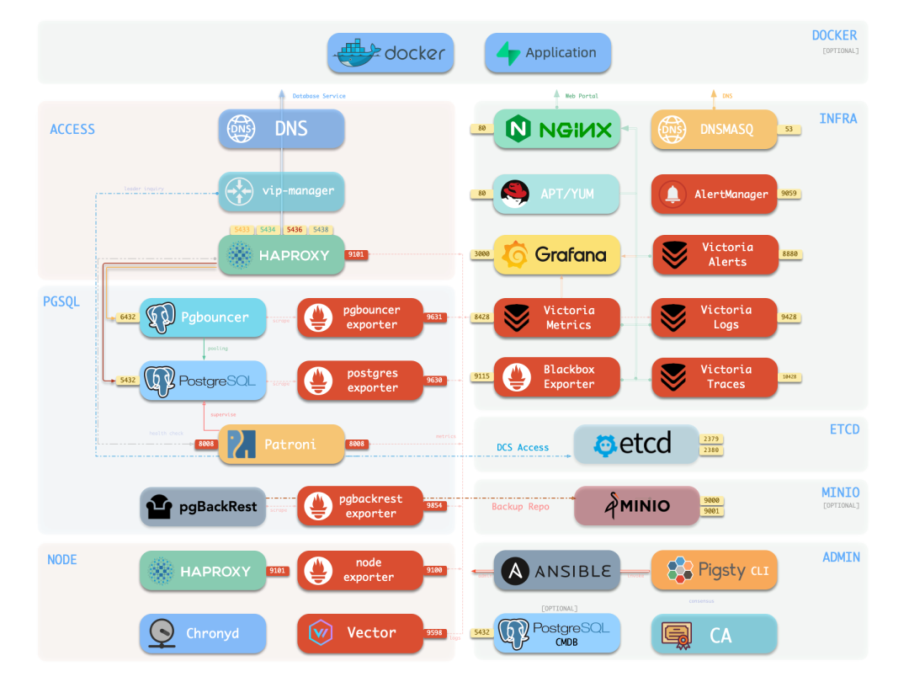
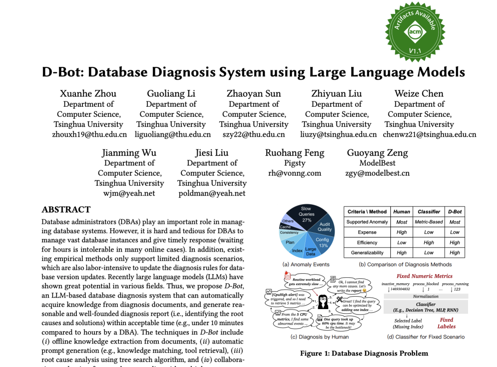

凌晨三点，数据库告警炸了。

你尝试把告警信息甩给一个 “顶级” DBA Agent。它见多识广，熟读 PostgreSQL 文档，能写出漂亮的诊断 SQL，对每一个内核参数的含义倒背如流。
它愣住了：集群拓扑是什么样的？主从都在哪些服务器上？监控面板怎么看？日志哪里找？上次类似故障怎么解的？我该用什么工具执行什么操作？

**什么都不知道。**

而隔壁那个用普通模型、但深度接入了完整运维环境的 Agent，已经定位到根因、完成了切换重启、发出了复盘报告。

原理很朴素 —— **一个熟悉环境的普通人，会比来到陌生环境的天才更能干。这就是强龙不压地头蛇**。
没有上下文的智力，是空转的。没有 Runtime 的 Agent，是虚浮的。

------

## OtterTune：一个价值 1200 万美元的教训

2020 年，CMU 数据库网红教授 Andy Pavlo 带着学生创办了 OtterTune —— 用 AI 做数据库自动调优。
顶级学术团队、拿了 1200 万美元投资、瞄准 PostgreSQL 和 MySQL 两大主流数据库，背景不可谓不豪华。

产品逻辑概括一下：**给我一个数据库连接串，AI 就能帮你调优。**

2024 年 6 月，OtterTune 宣布关门。表面原因是收购交易破裂。
但在老冯看来，根本的问题是：**一个连接串能做的事情，价值实在太少了。**

通过连接串，你能看到 `pg_stat_statements` 里的慢查询、`pg_settings` 里的配置参数、几个系统视图的统计信息。然后呢？调几个 knob，优化几条 SQL。仅此而已。

但真正的数据库运维远不止这些。一个连接串连的是一个 PostgreSQL 实例，但现实中你面对的是什么？
一个集群包含多个实例——主库、从库、离线副本、同步备份；集群之上还有水平分片；顶层可能有上百套集群分属不同业务组。
除了数据库自身的指标，你还需要备份状态、高可用组件状态、连接池指标、主机 CPU/内存/磁盘/网络指标。这些东西 **全部在连接串的外面**。

一个只拿到连接串的 Agent，就像一个只能通过猫眼观察房间的人 —— 视野极其有限。
更尴尬的是：连接串里能做的那些事，恰恰是大模型裸聊就能做得不错的事。
你让 Claude 或 GPT 直接看一条慢 SQL，它给出的优化建议已经相当靠谱了。**你做的事情 LLM 直接就能做，那你的壁垒在哪？**

OtterTune 踩的坑，本质上是一个 Runtime 问题：**它试图在没有运行时环境的情况下做运维。** 面对一个抽象的裸 PostgreSQL 做优化
—— 它有一个强大的大脑，但没有手，没有眼睛，甚至没有身体，这就像请霍金表演体操一样荒诞。

> PS: 我知道他们开始第二轮创业了，这次还是做 PostgreSQL 调优，希望他们这次能走上正路

------

## Manus：真正的核心是那个沙箱

如果 OtterTune 是反面教材，那 Manus 就是正面案例。

2025 年 3 月，Manus 横空出世，迅速成为现象级产品。很多人研究它为什么成功，把注意力放在它积累的那些 Markdown 提示词上，或者放在它用了哪个大模型上。

**盯错地方了**

Manus 真正的核心不是提示词，也不是大模型。它的核心是那个 **虚拟机沙箱** —— 每个用户会话都运行在一个独立的云端 Linux 虚拟机中，
里面有完整的文件系统、浏览器、Shell 终端、代码解释器。Agent 在这个确定性的环境中工作，能读写文件、执行代码、浏览网页、部署应用。

Manus 自己也说得很清楚：“The power of Sandbox lies in its completeness”

正是这个完备且确定的沙箱，让大模型的能力得以充分释放。没有这个沙箱，同样的模型只是一个聊天机器人。有了这个沙箱，它变成了一个能真正完成任务的 Agent。
而且 Manus 换过好几次底层模型 —— 从 GPT 到 Claude —— 效果一直在线。

最近爆火的 OpenClaw 也验证了同样的道理。它之所以能让人喊出 "AI with hands"，不是因为底层模型有多强，而是因为它深度接入了宿主操作系统 —— 
文件系统、Shell、浏览器、日历、消息应用全都通过 CLI 打通了。[把它丢到一个空白的云虚拟机里](https://mp.weixin.qq.com/s/1MnOjJShQrezxSKRpk4zNw)，脱离了这些本地环境的手脚，它就只是又一个普通的聊天机器人而已。

Manus 和 OpenClaw 的成功验证了同一件事：**LLM 是大脑，但真正重要的是身体**。

------

## 大脑、身体和确定性

Manus 的启示可以再往下推一层。

生物学上，智能的实现依赖三个要素：**传感器**（感知环境）、**决策器**（处理信息）、**执行器**（作用于环境）。一个只有大脑没有身体的生物，不叫智能体，只是缸中之脑。

Agent 也是一样。大模型是决策器，但你还需要传感器和执行器 —— 也就是 **可观测性** 和 **可控制性**。三者构成了 Agent 的 **身体**。而这个身体要能正常工作，需要一个前提：**确定性**。

你不能把大脑丢到一个陌生的环境里，让它操纵一条奇形怪状的机械臂。大脑必须 “认识” 自己的身体，知道发出什么信号会产生什么动作，接收什么反馈意味着什么状态。大脑和身体之间需要一套稳定的、可预期的协议。

**这就是 Runtime 的本质：Agent 的确定性身体。**

以 DBA Agent 为例，一个完整的 Runtime 意味着：

**传感器** —— 完整的可观测性。不只是一个连接串能看到的那点东西，而是从主机指标、连接池状态、高可用组件心跳、备份任务进度到数据库内部统计的全栈监控，这些信息有机地融合在一起，提供从单实例到整个数据平台的层层视角。

**执行器** —— 完整的可操控性。配置变更、高可用切换、备份恢复、滚动升级。不是调用别人的 API，而是直接掌控基础设施的"形状"。如果你只是调云厂商的接口，你的 Agent 永远被原作者的想象力所限制。

**确定性** —— 可预测的行为和可追溯的记录。同样的操作，同样的条件，同样的结果。每一步都有记录，每一次变更都可回滚。不确定的环境里跑不出确定的结果。

五年前我做 PostgreSQL 监控的时候就发现了这个问题 _如果想做最好的监控系统，不能只靠一个连接串。连接串确实能做一些事，但离 “做好” 差得太远。
要把可观测性做到极致，**你必须直接掌控 Runtime，直接控制基础设施的形状**。这也是 Pigsty 从一个 PostgreSQL 监控系统项目，演变为一个完整的 PostgreSQL 发行版的关键契机。监控如此，管控亦然，智能更是如此。

OtterTune 有大脑，没有身体。结局是注定的。Manus 造了一个确定性的身体（沙箱），大脑的能力才得以释放。

------

## DBA Agent 的身体，只有三个选择

让我们用一个具体的 Agent 场景为例 —— DBA Agent。
Coding Agent 的上下文 是代码目录，DBA Agent 的上下文是什么？

**什么是 DBA Agent 的身体？谁能提供 DBA Agent 的身体**

**第一条路：云厂商。** RDS、Cloud SQL、Azure Database——监控、告警、备份、高可用都有。但这是别人的身体。
你的 Agent 只能在厂商画好的圈子里活动，运维知识沉淀在厂商平台上与 Vendor 绑定，换个云就清零。
如果你像 OtterTune 那样寄生在云厂商的接口上做 Agent，你的设计天花板就是云厂商 API 的天花板。**这不是身体，这是笼子。**

**第二条路：Kubernetes。** K8s Operator 理论上也能提供自动化运维能力。
但 K8s 给数据库引入了大量不必要的复杂度 —— 存储编排、网络策略、状态管理、CRD 抽象层层叠叠。
Agent 要在 K8s 上做数据库运维，需要理解的概念比直接管理数据库多出一个数量级。
**K8s 的抽象层产生了巨大的阻抗，让 Agent 离它真正要管的东西——数据库本身——越来越远。** 
这不是在给 Agent 提供身体，这是在给它套上一层厚重的太空服。

**第三条路：Pigsty。** 一个开源的 PostgreSQL 发行版，直接基于原生 Linux 提供全家桶级的确定性 Runtime。
完整的可观测性体系覆盖从主机到数据库的全栈监控，生产级的高可用和自动化备份恢复，444 扩展开箱可用，整套基础设施使用 IaC 来管理。

Pigsty 与云厂商数据库运行时的区别：**这是一套开源免费，属于你自己的身体。** Runtime 的每一层都是开放的
—— Agent 可以直接读取监控指标、查询日志、调用标准运维接口。
没有黑盒，没有围墙。运维知识沉淀在你自己的基础设施上。可以在任何云环境，以及你自己的笔记本到数据中心上运行。

Pigsty 与 K8s 的区别：**没有不必要的抽象层。** Agent 直接面对数据库和操作系统，操作路径短，确定性高。用比喻来说：
云厂商是租来的剧场，设施齐全但规矩多、租金贵，演完了布景带不走。K8s 是过度设计的剧场，光学会怎么开灯就要三天。
**Pigsty 是你自己建的剧场——设施齐全，布局简洁，演员可以自由发挥，积累的一切属于你。**

------

## 已经有人上台了

清华大学的数据库团队在 2024 年就开始做这件事了。他们的 D-Bot 项目在完整的 Pigsty 运维环境中，探索 Agent 自主诊断故障、分析根因、生成修复建议的能力。
这个选择本身就很有说明性：不是拿一个连接串远程试探，而是在一个有监控、有工具、有知识库、有操作接口的完整 Runtime 中工作。

> 老冯也参与了这篇 VLDB 论文：[D-Bot: Database Diagnosis System using Large Language Models](https://www.vldb.org/pvldb/vol17/p2514-li.pdf)

学术研究需要可复现的环境，而基础设施即代码天然满足这个需求。同样的配置部署一百次，环境都一模一样。这正是 Agent 所需要的确定性。
与此同时，我自己也在开发 DBA Agent。谁比基础设施的建造者更了解自己的 Runtime？一个开放的 Runtime 上，学术团队在探索边界，基础设施建造者在打磨核心，社区开发者在贡献创意。生态正在形成。

如果你对 DBA 智能体感兴趣，Pigsty 可能是最好的试炼场。它提供了真实企业环境中 PostgreSQL 服务所需的一切上下文 —— 
完整的 [**高可用**](https://mp.weixin.qq.com/s?__biz=MzU5ODAyNTM5Ng==&mid=2247490952&idx=1&sn=bb69cb746fe7adb0adb9255e608f751f&scene=21#wechat_redirect) 与 PITR，
以及 Best of Breed 的[ **可观测性**](https://mp.weixin.qq.com/s?__biz=MzU5ODAyNTM5Ng==&mid=2247490769&idx=1&sn=e9716235d5f32dd3123a87afda5abb71&scene=21#wechat_redirect)。

------

## 龙会换代，地不会变

回到凌晨三点。

同样的告警，但这次 Agent 运行在完整的 Runtime 上——它自己的身体里。它看到了监控面板上的异常曲线，从日志中定位到根因，确认了集群拓扑和主从状态，
按标准流程完成了故障切换，验证了切换后的健康状态，生成了复盘报告。全程自动，全程可追溯。

模型可能是 GPT，可能是 Claude，可能是某个开源模型，**这不重要。** Agent 本身可能就是几个简单的 Skills 和 Claude.md ，这也不重要。
Agent 时代的护城河不是更聪明的大脑，而是更确定的身体。在这个确定性的身体中，一个简单的 CLAUDE.md 文件，就足够让中等智能水准的 LLM 表现出 中级 DBA 的水平来。

OtterTune 用 1200 万美元证明了：没有身体的大脑走不通。Manus 用一个沙箱证明了：给大脑一个确定性的身体，它就能创造奇迹。
强龙来了一条又一条，每条都比上一条更强。但地头蛇在自己的地盘上深耕日久，壁垒越积越厚。

龙会换代，地不会变，这才是 Agent 时代的护城河。
