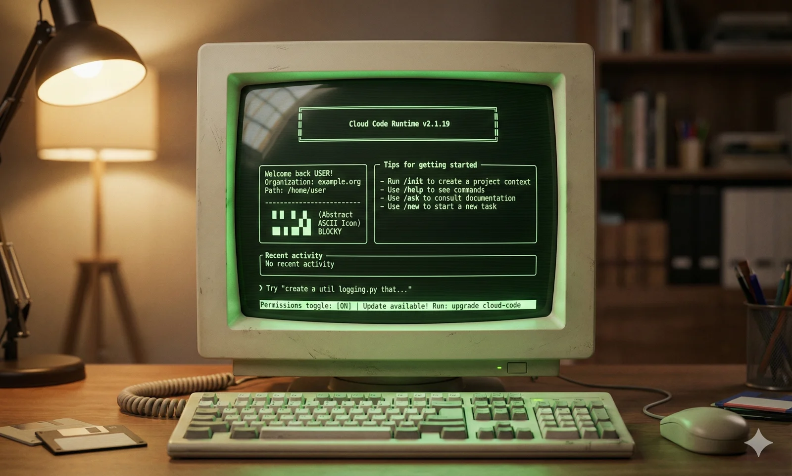

2025 is the year of the coding agent explosion. Claude Code writes your code, runs your tests, fixes your bugs, and autonomously completes complex engineering tasks. It's the second seismic shift since ChatGPT dropped.

But watch how these agents actually work, and you'll notice something striking: **their underlying operations are remarkably primitive**. They directly manipulate your filesystem and terminal. Sure, there are some built-in confirmation mechanisms, but fundamentally they rely on a "trust model" rather than an "isolation model." It's like early programs that could overwrite arbitrary memory addresses—system security depends entirely on programmer discipline.

**This reminds me of DOS in the 1980s.**



DOS worked. You could write programs, edit documents, play games. But it lacked everything we expect from a modern OS: no memory protection, no multitasking, no standardized device interfaces. Every application touched hardware directly. Programmers handled all the low-level details themselves.

**Today's AI agents are standing at the same starting point.**

It took us 30 years to evolve from DOS to modern operating systems. The agent ecosystem is speedrunning that history. My core thesis: **the evolution of operating systems is the best lens for understanding agent infrastructure's future**. This analogy doesn't just explain the present—it predicts the most critical technical directions (and biggest opportunities) for the next 2-3 years.


---

## The Framework: Five Subsystems of Agent OS

In traditional computing, the CPU provides compute, RAM provides temporary storage, and disk provides persistent storage. In the agent world, we can find precise analogues: **the LLM is the new CPU, the context window is the new RAM, the database is the new disk, and agents are applications.**

The LLM's context window behaves exactly like memory—after each inference completes, all state vanishes. Kill the power (end the session), and everything resets to zero. This "amnesia" means: **all state management must be externalized**—which is precisely why we need an "operating system."


What sits between applications and resources? The abstraction we call an "operating system." An OS manages resources, provides abstractions, and coordinates components through several key subsystems:

| Subsystem | Traditional OS | Agent OS | Current State |
|-----------|----------------|----------|---------------|
| Memory Management | Virtual memory, page swapping | Context Engineering, RAG | Most complex, highest value, biggest opportunity |
| File System | ext4/ZFS | State persistence, memory storage | Highly deterministic (databases) |
| Process Management | fork/exec/scheduler | Agent lifecycle, task orchestration | Red ocean (LangGraph et al.) |
| I/O Management | Device drivers | Tool calling, MCP/CLI | Currently hot (MCP, Skills) |
| Security | Permissions, audit, sandbox | Isolation, observability, decision audit | About to explode (E2B etc.) |

These five subsystems form the skeleton of Agent OS. Let me break them down by importance.

---

## Memory Management: The Most Important Battlefield

What's the most important insight from the operating system analogy? **Memory management (Context Engineering) will be the most complex battlefield—and the biggest opportunity.**

### The Lesson of History: Is 640KB Enough?

In 1981, IBM PC designers thought 640KB of memory "should be enough." This became one of computing's most famously wrong predictions. Today, when we say 128K context is "already pretty big," we're making the same mistake.

**Context window** is the LLM's scarcest resource. 128K tokens sounds large, but consider the overhead: system prompts eat 10-20K, tool definitions eat 10-20K, context documents eat 50-80K... actual conversation space might be down to a few tens of K.

Congrats, you reinvented the 640KB problem.

### Virtual Memory: The OS Revolution

Looking back at OS history, virtual memory was one of Unix's most important innovations.

Before virtual memory, programmers managed physical memory allocation themselves. If a program needed more memory than physically available, it crashed—or you manually implemented complex swap logic. Virtual memory changed everything: it gave each program the "illusion" of owning the entire address space. The OS handled page swapping behind the scenes, moving infrequently-used data to disk and bringing it back when needed.

This abstraction unleashed enormous productivity—**programmers no longer worried about physical memory limits.**

**In the agent world, we need the same revolution.**

### The Manus Lesson: Context is Everything

Manus is one of 2025's most successful general-purpose agents. Their team shared a core conclusion in [Context Engineering for AI Agents](https://manus.im/blog/Context-Engineering-for-AI-Agents-Lessons-from-Building-Manus):

> "Most agent failures aren't model failures—they're context failures."

This isn't empty talk. The Manus team rewrote their framework four times. Through trial and error, they distilled several key practices:

**KV-Cache hit rate is the most important metric.** Cache hits mean the model doesn't have to "re-read the entire book." On Claude, cached tokens cost 1/10th of uncached ones. This means context organization is critical—it's the difference between a viable product and a money pit.

**File system as external memory.** Manus treats the file system as "infinite context" external storage. Agents can write and read files at will—essentially a low-cost "virtual memory." This maps naturally to swap: when RAM runs out, spill cold data to disk and page it back when needed.

**Todo lists as attention steering.** They found that having the agent "recite" its current todo list at the start of each step effectively prevents goal drift. This is essentially a cache warming technique—preheating important information into the hot cache, increasing the probability it gets attended to.

### The DeepSeek Lesson: Memory Hierarchy

DeepSeek's [Engram paper](https://github.com/deepseek-ai/Engram) (January 2026) provides another key perspective: **storage hierarchy**.

They discovered a "U-shaped curve"—**optimal resource allocation is 75-80% for "Brain" (compute), 20-25% for "Book" (memory)**. This ratio reveals a deep insight: agents shouldn't cram everything into context (all RAM), nor rely entirely on external retrieval (all disk). They need an intelligent tiered architecture.

This maps perfectly onto the computer storage hierarchy:


The key insight: higher tiers are faster, more expensive, and smaller. They need automatic management (just as CPUs don't require programmers to manually manage L1/L2 cache). They need intelligent swapping.

Some will say: doesn't "long context" solve this problem? Not enough memory? Just pay more. But even with 10M token context windows, we still need intelligent memory management.

A 64GB RAM machine still needs virtual memory—efficient resource management is core OS value.


> My 64GB laptop had Word eat 200GB of memory. It somehow didn't immediately die. Modern OSes are weirdly magical.

---

## External Storage: The Highest-Certainty Opportunity

When discussing memory management, a natural question emerges: where does swapped-out data go?

In traditional operating systems, the answer is disk. In Agent OS, currently it's usually markdown files on the filesystem. But the ultimate answer will definitely be **databases**. If Context Engineering is the most complex technical battlefield, databases are the **highest-certainty commercial opportunity**.

Microsoft CEO Satya Nadella saw this endgame early: [**the database is IT's core; all applications are essentially wrappers around databases**](/db/ai-agent-era). AI will rebuild every application and workflow, but this still requires databases—agents will eventually strip away all the wrappers and operate databases directly.


### The Database's Multiple Roles in Agent Architecture

What role should databases play in agent architecture? The answer: **far more than "storing data."**

1. **Long-term memory storage**: The agent's "hippocampus"—conversation history, learned knowledge, user preferences
2. **State persistence**: The agent's "hard drive"—checkpoints/snapshots, task state, recovery points
3. **Vector index**: The agent's "page table"—semantic retrieval, similarity matching, context swap-in decisions
4. **Coordination service**: The agent's "IPC mechanism"—distributed locks, task queues, event notifications
5. **Audit log**: The agent's "black box"—immutable records of all operations, compliance, replayability

For an agent storage layer that must simultaneously fulfill these five roles, PostgreSQL is currently the most competitive option, for two reasons:

**Unified data plane.** Relational models, vector embeddings (pgvector), full-text search, JSON, time-series data—all handled with ACID/SQL in a single database. No need to maintain multiple systems and glue code.

**Native model familiarity.** PostgreSQL is the world's most popular database. Frontier LLMs trained on massive amounts of PostgreSQL documentation. When an agent calls `psql` or writes PG SQL, it barely needs additional schema hints. This isn't mysticism—it's training data distribution.

The market is validating this direction: in 2025, Databricks acquired Neon, Snowflake acquired Crunchy Data, and PostgreSQL ecosystem company valuations hit record highs. One data point from Neon is particularly notable: 80% of their databases are created by AI agents, not humans.

### Where's PostgreSQL's Ceiling?

A more radical, more interesting possibility: PostgreSQL doesn't just play storage—it becomes the **Runtime itself**. PostgreSQL's extreme extensibility and thriving extension ecosystem mean it already has nearly all the primitives a complete Runtime needs.

[](/pg/pg-eat-db-world)

Theoretically, `psql` command-line functionality is a superset of bash. It might just have a shot at becoming Yet Another Runtime—at which point the database isn't an external store anymore, but the orchestration core. How far this path goes remains to be validated, but "Database as Runtime" is genuinely interesting—and it's the direction I'm currently exploring.

---

## Process Management: the Deep Water Is Empty

At their core, virtually all current agent frameworks are the same while loop:

```python
while not done:
    thought = llm.think(context)
    action = llm.decide(thought)
    result = tools.execute(action)
    context.update(result)
```

Think → Act → Observe → Repeat. LangGraph, CrewAI, AutoGen... peel off the branding, and the cores are eerily similar. A Braintrust engineer [wrote bluntly](https://www.braintrust.dev/blog/agents): "The canonical agent architecture is a while loop with tools."

When the core abstraction is simple enough for any undergrad to implement, it can't be a moat. Even more fatal: model vendors naturally have the best runtimes. OpenAI's Assistants API, Anthropic's Claude Code—these are already top-tier agent execution environments. Cloud vendors are also harvesting: Azure Agent Loop, Google ADK, AWS Bedrock Agents. When runtime becomes a platform standard, what can independent framework companies even sell?

So on the surface, this looks like a red ocean. But there's a cognitive trap here: the "Agent Loop" everyone's competing on **isn't real "process management."**

If we take the OS analogy seriously, process management is far more than a while loop. It includes at minimum:

- **Concurrent scheduling**: Multiple agents running simultaneously—who gets the GPU? Who calls the API first? How are resources allocated?
- **State persistence**: Agent crashes halfway through—how do you resume from checkpoint?
- **Inter-process communication**: Agent A's output needs to reach Agent B—what protocol? How do you sync shared state?
- **Graceful termination**: How do you let an agent "safely exit" rather than just `kill -9`?

Current frameworks have almost no good answers to these questions. The reason is simple: most agent applications today are still at the "single agent, short task, one-shot execution" stage—like single-tasking DOS programs. **They don't need complex process management.** Slap a chat interface on it, and you're probably good enough.

But this stage won't last long. When agents become long-running background services—like a 7×24 DBA agent monitoring your databases, or a support agent continuously processing tickets—real process management needs will emerge. That's where the "fake red ocean" may hide a real blue ocean.

---

## I/O Management: The Protocol War vs. The Real Issue

Tool calling is the agent's interface with the outside world—analogous to device drivers in traditional OS. This space is hot right now, but the surface "protocol war" might be obscuring deeper issues.

MCP has achieved massive adoption success. Anthropic claims over 10,000 active MCP servers, 97 million monthly SDK downloads, and donated it to the Linux Foundation in December.


> [One Year of MCP, Anthropic](https://www.anthropic.com/news/donating-the-model-context-protocol-and-establishing-of-the-agentic-ai-foundation)

But adoption isn't the same thing as technical destiny. MCP's success is largely because it filled a "usability" gap—letting non-technical users connect tools to agents. However, from an architectural perspective, it might have taken a wrong turn:

- **Token overhead is shocking**: [MCP server tool metadata alone can consume tens of thousands of tokens](https://www.anthropic.com/engineering/code-execution-with-mcp), while equivalent CLI approaches might need only hundreds
- **Reinventing the wheel**: The "tool discovery, invocation, composition" problems MCP tries to solve? Unix CLI has elegantly done this for 55 years

**CLI's advantages are severely underestimated.** All frontier models trained on massive amounts of CLI documentation, man pages, and Stack Overflow. When you ask Claude to use `grep`, `psql`, or `curl`, it barely needs additional schema definitions—these tools' usage is already "internalized" in model weights. More importantly, CLI naturally embodies Unix philosophy: text streams, pipe composition, single responsibility. This is exactly the composability agents need. The Unix ecosystem has 55 years of accumulation. We should stand on giants' shoulders, not start from scratch.

**But CLI isn't the perfect endpoint either.** It has fatal problems: inconsistent output formats (some JSON, some tables, some plain text), wildly varying error handling, lack of standardized discovery mechanisms. That's why Skills emerged as a sort of "CLI user guide"—essentially patching CLI documentation to be more agent-friendly.

My prediction: **the winner won't be MCP, nor bare CLI, but "Agent-native CLI"**—command-line tools with structured output, standardized error codes, and built-in discovery mechanisms. Imagine: every command has a `--json` output option, error codes follow unified semantics (like HTTP status codes), and commands include `--desc` parameters outputting machine-readable capability descriptions. This doesn't require inventing new protocols—just making existing tools more consistent. Like how RESTful APIs didn't invent HTTP, just made it more principled.

> I just built an [cli toool for PostgreSQL](https://pigsty.io/docs/pig/pg/), to practice this idea. 


---

## Security and Observability: The Trust Infrastructure

What's the biggest security risk in today's agent ecosystem? **Prompt Injection**—but that's just the tip of the iceberg. The deeper question: **how do we trust a system that acts autonomously?**

**Prompt Injection is the AI era's Buffer Overflow.** Traditional buffer overflows happened because programs didn't distinguish between "**instructions**" and "**data**"—attackers could write instructions into data areas for the CPU to execute. Prompt Injection is essentially the same problem: LLMs don't architecturally distinguish "System Prompt (instructions)" from "User Input (data)." A malicious user input—or even a malicious webpage the agent reads—can hijack agent behavior.

This analogy reveals a brutal reality: Buffer Overflow took decades to get hardware-level mitigations (NX bit, ASLR, Stack Canary). **Prompt Injection currently has no architectural solution**—we rely only on "please don't do bad things" prompts and various heuristic detections. This is not a stable equilibrium.

**Sandboxing is necessary but nowhere near sufficient.** [E2B is used by 88% of Fortune 100 companies](https://venturebeat.com/ai/how-e2b-became-essential-to-88-of-fortune-100-companies-and-raised-21-million). Firecracker microVMs are used by Manus and others. The sandbox logic is "even if the agent gets tricked, it can't cause too much damage." That's right, but it solves "capability restriction," not "behavior understanding." **That's why observability might be more important than sandboxing.**

Imagine this scenario: your agent runs safely in a sandbox for a week, triggering zero alerts. But you have no idea what decisions it made, why it made them, or whether it was probed by malicious inputs. This "safety" is illusory—you just don't know what you don't know.

Sandboxing is the floor. Observability is the ceiling.

Real trust requires three layers of infrastructure:

| Layer | Function | Analogy |
|-------|----------|---------|
| **Sandbox** | Limits what the agent can do | Prison walls |
| **Observability** | Understands what the agent is doing and why | Security cameras |
| **Audit Log** | Post-hoc tracing of complete decision chains | Black box recorder |

**Observability's core is "decision provenance"**: What inputs did the agent see? What was its reasoning process? Why did it choose this action over that one? This information is crucial not just for security, but equally for debugging and improvement. When an agent errs, you need to replay the entire decision process—just like how database WAL lets you replay transactions.

**Audit logs are compliance requirements.** Finance, healthcare, government—these industries have strict audit requirements. When an agent makes a trading decision for a client, when an agent gives medical advice, regulators will ask: why did it do this? What was the basis? This isn't optional—it's market access table stakes.

My prediction: **2026-2027, "Agent Observability" will become an independent category**, just like APM (Application Performance Monitoring) exploded in the cloud-native era. Whoever can provide complete agent traces—from input to reasoning to action to result—will occupy a key position in the enterprise market.

Sandboxing solves the "distrust" problem. Observability solves the "building trust" problem. Both are indispensable, but the latter might have greater commercial value.


> I recently built an [observability solution for Claude Code](https://pigsty.io/docs/piglet)—you can see the complete details of its decision-making process.

---

## Conclusion: The Missing Kernel

In 1991, the GNU Project had been running for eight years. Richard Stallman and his followers had built an entire suite of free software tools: the GCC compiler, Emacs editor, Bash shell, coreutils... covering nearly every aspect of an operating system.

**—Except for a kernel.**

GNU's own kernel, Hurd, was mired in endless design debates and couldn't ship. All the tools were in place, yet the core that would glue everything together was missing.

Then a Finnish college student posted to a mailing list:

> "I'm doing a (free) operating system (just a hobby, won't be big and professional like gnu)..."

That "hobby" filled in the last piece of the puzzle. GNU's tools plus Linux's kernel formed what we now call GNU/Linux—the foundation of the cloud era.

**The 2025 agent ecosystem is at the same moment.**

We have plenty of "tools": LangChain, CrewAI, AutoGen handle task orchestration; MCP and Skills handle tool calling; PostgreSQL handles persistent storage; various RAG solutions handle knowledge retrieval; E2B and Firecracker handle security isolation...

But we're missing a new "Agent OS Kernel"—an operating system layer that truly glues everything together: unified context scheduling, recoverable process state, standardized I/O interfaces, complete trust infrastructure and observability.

This kernel might be hiding in someone's side project right now, just like Linux in 1991—inconspicuous, unnoticed, called "just a hobby" by its author. But it will become the future.

The script of history is already written:

- **Memory management** will be the most complex technical battlefield—whoever makes context swap in and out as transparently as virtual memory will define next-gen infrastructure
- **Databases** are the highest-certainty commercial opportunity—PostgreSQL isn't just storage, it has potential to become the Runtime
- **Process management** looks like a red ocean, but the deep water is empty—when agents become long-running services, real scheduling and recovery needs will emerge
- **I/O**'s endgame isn't a new protocol, but Agent-Native CLI—55 years of Unix philosophy won't be easily disrupted
- **Trust layer** will become enterprise market admission tickets—sandboxing is the floor, observability is the key

The real watershed isn't models getting stronger—it's **system capability catching up**. Once this infrastructure takes shape, agents will transform from "toys that can write code" into "processes you can trust with your business."

Who will write the Linux kernel of the agent era? I don't know. 
This is an era full of opportunity and possibility. At history's turning point, anything is possible.

In the 1980s, someone was writing DOS programs in a garage. In the 1990s, someone was writing the Linux kernel in a dorm room. On some late night in 202x, someone might be at a terminal right now, typing the first line of Agent OS code.

Whoever builds this infrastructure is defining the next era.
