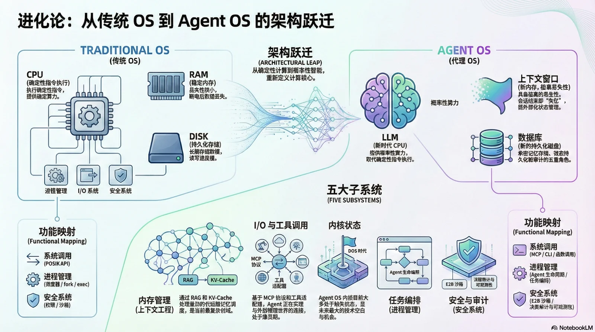
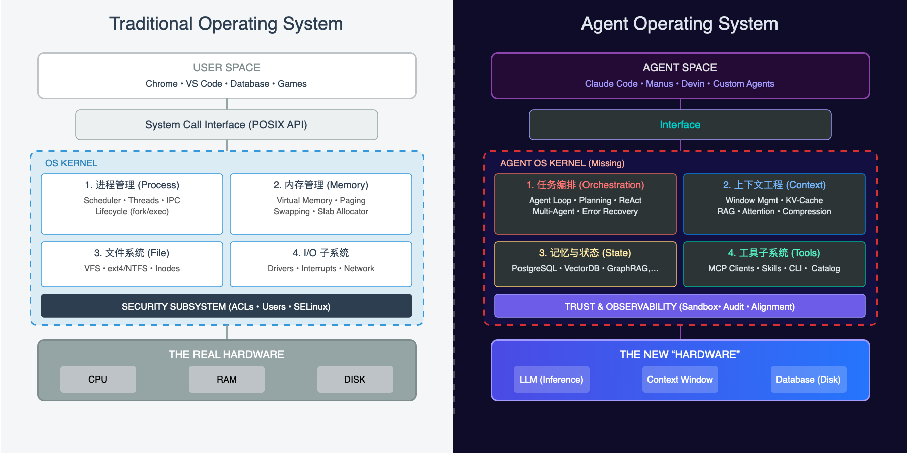
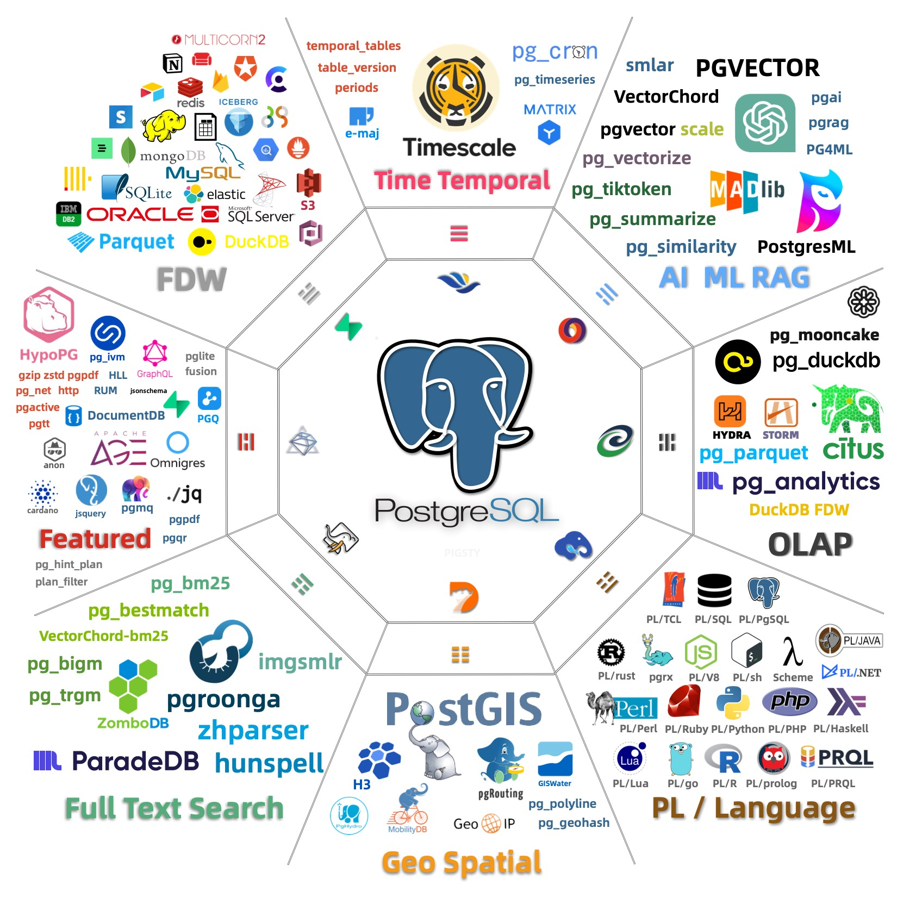
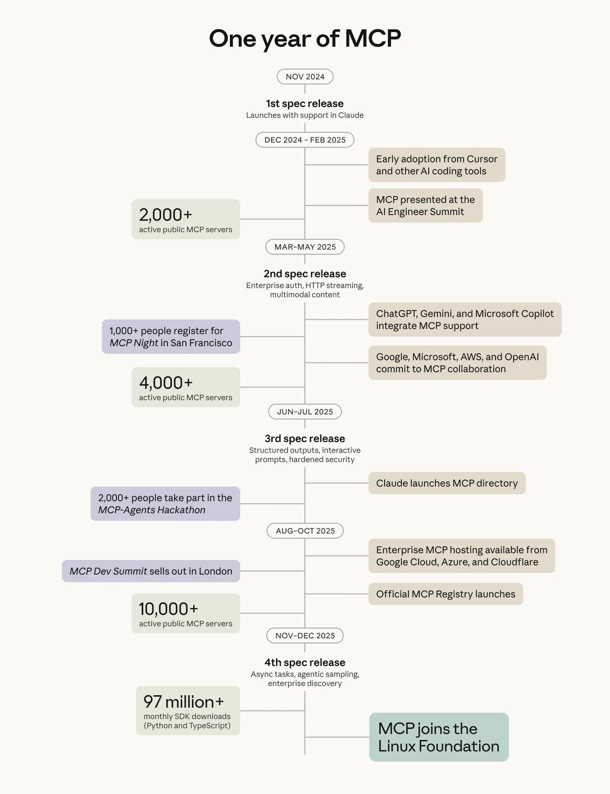
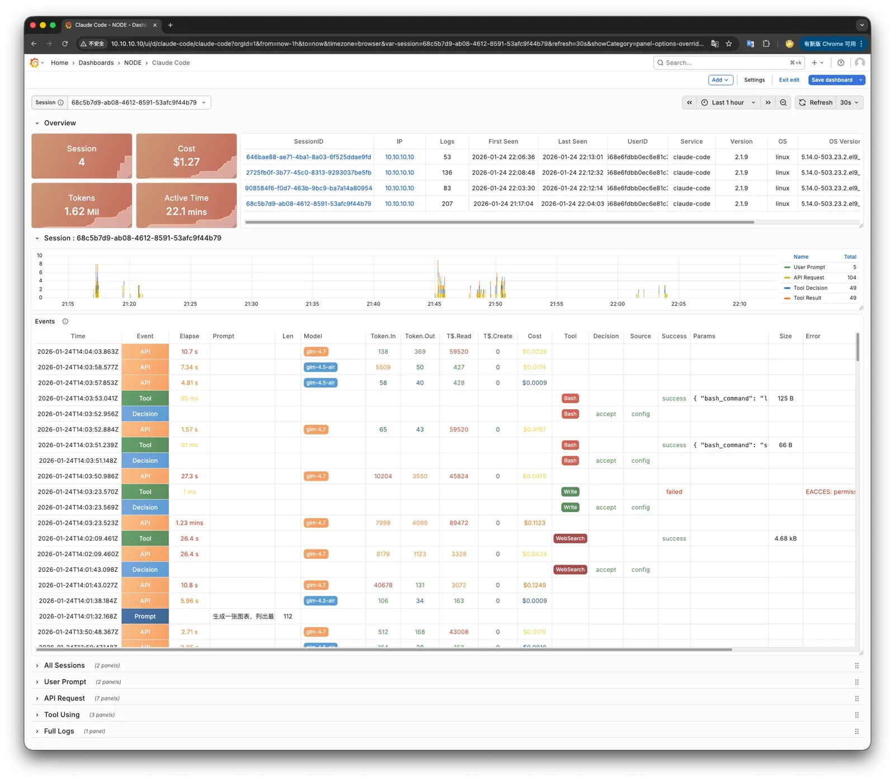

2025 年，编程 Agent 大爆发。Claude Code 能帮你写代码、跑测试、修 Bug，自主完成复杂工程任务，
堪称 ChatGPT 横空出世后的第二次史诗级大地震。

但仔细观察这些 Agent 的工作方式，你会发现一个惊人的事实：**它们的底层操作极其 “原始”**。
它直接操作你的文件系统和终端，虽然有一些内置的确认机制，但本质上仍依赖 “信任模型” 而非 “隔离模型”。
这就像早期程序可以随意覆写任何内存地址一样 —— 系统的安全边界，取决于程序员的自觉。

**这让我想起了 1980 年代的 DOS。**

DOS 也能用——你可以在上面写程序、编辑文档、玩游戏。但它缺乏现代操作系统的一切：
没有内存保护，没有多任务，没有标准化的设备接口。
每个应用都直接操作硬件，程序员要自己处理所有底层细节。

**现在，AI Agent 正站在同一个起点。**

我们花了 30 年才从 DOS 演化到现代操作系统，而 Agent 生态正在压缩式地重演这段历史。
本文的核心论点是：**用操作系统的演化历史来理解 Agent 基础设施的未来**。
这个类比不仅能帮我们理解现状，还能预测接下来 2-3 年最关键的技术方向——以及最大的机会。




--------

## 一、核心框架：Agent OS 的五大子系统

在传统计算机中，CPU 是算力来源，RAM 是临时存储，磁盘是持久存储。在 Agent 世界中，我们可以找到精确的对应：
**LLM 是新 CPU，Context Window 是新内存，数据库是新磁盘，Agent 是应用。**

LLM 的上下文窗口与内存一模一样——每次推理完成后，所有状态都消失了。关掉电源（结束会话），一切归零。
这种"失忆症"意味着：**所有状态管理都必须外部化** —— 这正是我们需要"操作系统"的根本原因。



在应用与资源中间的抽象，正是我们所熟悉的"操作系统"。
操作系统是什么？是一个管理资源、提供抽象、协调各组件的系统，它由几个重要的子系统组成：

| 子系统    | 传统 OS         | Agent OS                 | 当前状态              |
|--------|---------------| ------------------------ |-------------------|
| 内存管理   | 虚拟内存、页面置换     | Context Engineering、RAG | 最复杂，价值最高，机会最大     |
| 文件系统   | ext4/ZFS      | 状态持久化、记忆存储     | 高度确定性（数据库）        |
| 进程管理   | fork/exec/调度器 | Agent 生命周期、任务编排 | 卷成红海（LangGraph 等） |
| I/O 管理 | 设备驱动          | 工具调用、MCP/CLI        | 正在火爆（MCP、Skills）  |
| 安全系统   | 权限、审计、沙箱     | 隔离、可观测性、决策审计     | 即将爆发（E2B 等）       |

这五大子系统构成了 Agent OS 的核心骨架。接下来，我将按重要性逐一展开。


--------

## 二、内存管理：最复杂也最重要的战场

操作系统类比能带给我们的最重要洞察是什么？—— **内存管理（Context Engineering）将是最复杂的战场，也是最大的机会所在。**

### 历史的教训：640KB 够用吗？

1981 年，IBM PC 的设计者们认为 640KB 内存 “应该够用了”。这成为计算机历史上最著名的错误预言。今天，当我们说 128K 上下文“已经很大了”时，正在犯同样的错误。

**上下文窗口**（Context Window） 是 LLM 最稀缺的资源。128K tokens 看起来很大，但考虑到各种开销占用：
系统提示词占用 10-20K，工具定义占用 10-20K，上下文文档占用 50-80K …… 留给实际对话的空间可能只剩小几十K。这就像 1980 年代的 640KB 限制一样窘迫。

### 虚拟内存：操作系统的革命性创新

回顾操作系统历史，虚拟内存是 Unix 最重要的创新之一。

在虚拟内存出现之前，程序员必须自己管理物理内存分配。如果程序需要的内存超过物理内存，就只能崩溃或手动实现复杂的换入换出逻辑。虚拟内存改变了这一切——它给每个程序一个"幻觉"，好像它拥有整个地址空间。操作系统在背后自动处理页面置换，把不常用的数据换出到磁盘，需要时再换入。

这个抽象释放了巨大的生产力——**程序员不再需要关心物理内存的限制**。

**在 Agent 世界，我们正需要同样的革命。**


### Manus 的启示：上下文至关重要

Manus 是 2025 年最成功的通用 Agent 之一，他们的团队在博客 [Context Engineering for AI Agents](https://manus.im/blog/Context-Engineering-for-AI-Agents-Lessons-from-Building-Manus) 中分享了一个核心结论：

> "大多数 Agent 的失败不是模型的失败——而是 Context 的失败。"

这不是空谈。Manus 团队为此重写了四次框架，通过反复试错，总结出几个关键实践：

**KV-Cache 命中率是最重要的指标。缓存命中 ≈ 模型不用重复 “重新读一遍整本书”。
在 Claude 上，缓存命中的 token 成本是未命中的 1/10，这意味着 Context 的组织方式至关重要，直接决定了 Agent 的成本和延迟。

**文件系统作为外部记忆。** Manus 把文件系统当作"无限 Context"的外挂存储。Agent 可以随时写入和读取文件，相当于一个低成本的"虚拟内存"。这是对 swap 的天然映射——当 RAM 不够时，把不常用的数据换出到磁盘。

**Todo List 作为注意力操控。** 他们发现让 Agent 在每一步开始时"复述"当前的 todo list，可以有效防止目标漂移。这本质上是一种缓存预热技巧——把重要信息预热到高速缓存里，增加其被注意到的概率。


### DeepSeek 的启示：内存层次结构

DeepSeek 在 2026 年 1 月发表的 [Engram 论文](https://github.com/deepseek-ai/Engram) 提供了另一个关键视角：**存储层次结构**。

他们发现了一个"U 型曲线"——**最优的资源分配是 75-80% 给"Brain"（计算），20-25% 给"Book"（记忆）**。这个比例揭示了一个深刻洞察：
Agent 不应该把所有信息都塞进 Context（全放 RAM），也不应该完全依赖外部检索（全放磁盘），而是需要一个智能的分层架构。

这就与计算机的存储层级体系能完美对上


关键洞察是：越往上越快、越贵、越小；需要自动管理（就像 CPU 不需要程序员手动管理 L1/L2 Cache）；需要智能换入换出。

有人会说："长上下文"难道不能解决这个问题吗？——内存不够，加钱就好了。但即使 Context Window 变成 10M tokens，我们仍然需要智能的内存管理。

就像 64GB RAM 的电脑仍然需要虚拟内存 —— 高效的资源管理本身就是 OS 的核心价值。


> 老冯的 64G 笔记本被 Word 吃了 200G 内存，竟然没立即死掉


--------

## 三、外存（数据库）：确定性最高的机会

当我们讨论内存管理时，一个自然的问题浮现：换出去的数据存在哪里？

在传统操作系统中，答案是磁盘。在 Agent OS 中，目前通常是文件系统上的 Markdown 文档，但最终的答案一定是数据库。如果说 Context Engineering 是最复杂的技术战场，那么数据库则是**确定性最高的商业机会**。

微软 CEO 纳德拉早就看到了这个终局 —— [**数据库是IT 的核心，所有的应用本质上都是数据库的封装层**](/db/ai-agent-era)。
AI 会重做一切应用与流程软件，但这也离不开数据库——Agent 最终会替代掉所有的包装，直接操作数据库。


### 数据库在 Agent 架构中的多重角色

数据库在 Agent 架构中要扮演什么角色？答案是：**远不只是“存数据”**。

1. **长期记忆存储**：Agent 的"海马体"——对话历史、学到的知识、用户偏好
2. **状态持久化**：Agent 的"硬盘"——Checkpoint/快照、任务状态、恢复点
3. **向量索引**：Agent 的"页表"——语义检索、相似度匹配、Context 换入决策
4. **协调服务**：Agent 的"IPC 机制"——分布式锁、任务队列、事件通知
5. **审计日志**：Agent 的"黑匣子"——所有操作的不可篡改记录、合规、可重放

对于需要同时承担上述五重角色的 Agent 存储层，PostgreSQL 是目前最有竞争力的选项，原因有二：

统一的数据平面。 关系模型、向量嵌入（pgvector）、全文搜索、JSON、时序数据——可以在单一数据库中使用 ACID / SQL 统一处理，不需要维护多套系统与胶水组件。

模型的原生熟悉度。PostgreSQL 是全世界最流行的数据库，前沿 LLM 在海量 PostgreSQL 文档上训练过。
Agent 调用 `psql` 工具或者写 PG 的 SQL 几乎不需要额外 Schema 提示。这不是玄学，是训练数据分布决定的。

市场也在验证这个方向：2025 年 Databricks 收购 Neon、Snowflake 收购 Crunchy Data，PostgreSQL 生态公司估值屡创新高。
Neon 披露的一个数据尤其值得注意：他们 80% 的数据库是由 AI Agent 而非人类创建的。

### PostgreSQL 的上限在哪里？



一种更激进，更有趣的可能性是：PostgreSQL 不只扮演存储，而成为 Runtime 本身。
PostgreSQL 极致的可扩展性与繁荣的扩展生态，让它已经具备了一个 完整 Runtime 所需的几乎所有原语。

理论上 `psql` 命令行功能是 bash 的超集，未必就没有机会成为 Yet another runtime —— 这时候数据库就不再扮演一个外部存储，而成为编排核心。
这条路能走多远还需要验证，但 “Database as Runtime” 这个方向确实很有趣，这也是老冯正在探索的道路。


--------

## 进程管理：表面红海，深水无人

当前所有 Agent 框架的核心，几乎都是同一个 while loop。

```python
while not done:
    thought = llm.think(context)
    action = llm.decide(thought)
    result = tools.execute(action)
    context.update(result)
```

Think → Act → Observe → Repeat。LangGraph、CrewAI、AutoGen …… 剥开花哨的外衣，内核惊人地相似。
Braintrust 的工程师直接撰文宣称："The canonical agent architecture is a while loop with tools"。

当核心抽象简单到任何本科生都能实现时，它就不可能成为护城河。 
更致命的是，模型厂商天然拥有最好的 Runtime：OpenAI 的 Assistants API、Anthropic 的 Claude Code 本身就是顶级的 Agent 执行环境。
云厂商也在收割：Azure Agent Loop、Google ADK、AWS Bedrock Agents——当 Runtime 成为平台标配，独立框架公司还能卖什么？

所以表面上看，这是一片红海。但这里有一个认知陷阱：大家卷的那个 "Agent Loop"，根本不是真正的"进程管理"。
如果认真用操作系统来类比，进程管理远不止一个 while loop。它至少包括：

- **并发调度**：多个 Agent 同时运行，谁先用 GPU？谁先调 API？资源如何分配？
- **状态持久化**：Agent 跑到一半崩了，怎么从断点恢复？
- **进程间通信**：Agent A 的输出要传给 Agent B，用什么协议？共享状态怎么同步？
- **优雅终止**：怎么让 Agent "安全退出"而不是直接 kill -9？

这些问题，目前的框架几乎都没有好答案。原因很简单：现在大多数 Agent 应用还停留在 “单 Agent、短任务、一次性执行” 的阶段 —— 
就像 DOS 时代的单任务程序，**根本不需要复杂的进程管理**。弄个 Happy / IM 软件 对接一下，聊天派活可能也就够了。

但这个阶段不会持续太久。当 Agent 开始变成长时间运行的后台服务——比如一个 7×24 监控数据库的 DBA Agent，或者一个持续处理工单的客服 Agent ——
真正的进程管理需求就会浮现。届时，谁能提供可靠的调度、恢复、通信机制，谁就能在这片"伪红海"中找到真正的蓝海。


------

## I/O 管理：协议之争的表象与本质

工具调用是 Agent 与外部世界交互的接口，相当于传统 OS 的设备驱动。这个领域正在火爆，但表面的“协议之争”可能掩盖了更本质的问题。
MCP 在采用度上取得了巨大成功。 Anthropic 称已有超过 10,000 个活跃 MCP 服务器，每月 9,700 万次 SDK 下载，并于 12 月捐赠给了 Linux 基金会。



> [One Year of MCP, Anthropic](https://www.anthropic.com/news/donating-the-model-context-protocol-and-establishing-of-the-agentic-ai-foundation)

但采用度不等于技术先进性。MCP 的成功很大程度上是因为它填补了一个“易用性”的空白
—— 让非技术用户也能给 Agent 接入工具。
然而从架构视角看，它可能走了弯路：

- **Token 开销惊人**：[MCP 服务器仅工具元数据就可能消耗上万 tokens](https://www.anthropic.com/engineering/code-execution-with-mcp)，而等效的 CLI 方案可能只需要几百
- **重新发明轮子**：MCP 试图解决的"工具发现、调用、组合"问题，Unix CLI 已经优雅地做了 55 年

**CLI 的优势被严重低估了。** 所有前沿模型都在海量的 CLI 文档、man pages、Stack Overflow 上训练过。
当你让 Claude 用 `grep`、`psql`、`curl`，它几乎不需要额外的 Schema 定义 —— 这些工具的用法已经"内化"在模型权重里了。
更重要的是，CLI 天然符合 Unix 哲学：文本流、管道组合、单一职责。这正是 Agent 需要的可组合性。
Unix 生态已经有了 55 年的积累，我们应该站在巨人的肩膀上，而不是另起炉灶。

**但 CLI 也不是完美的终点。** 它有几个致命问题：输出格式不一致（有的 JSON、有的表格、有的纯文本）、错误处理五花八门、缺乏标准化的发现机制。
这就是为什么 Skills 作为一种"CLI 使用指南"出现了 —— 它本质上是在弥补 CLI 文档不够 Agent-friendly 的问题。

我的判断是：**最终的赢家不会是 MCP，也不会是裸 CLI，而是 “Agent-native CLI”** —— 输出结构化、错误码标准化、自带发现机制的命令行工具。
设想一下：每个命令都有 `--json` 输出选项，错误码遵循统一的语义（如 HTTP 状态码）， 自带 `--desc` 参数输出机器可读的能力描述。
这不需要发明新协议，只需要让现有工具变得更规范 —— 就像 RESTful API 没有发明 HTTP，只是让它更有章法。


--------

## 安全与可观测性：信任基础设施

当前 Agent 生态最大的安全隐患是什么？**Prompt Injection（提示词注入）**——但这只是冰山一角。更深层的问题是：**我们如何信任一个会自主行动的系统？**

**Prompt Injection 是 AI 时代的 Buffer Overflow。** 传统的缓冲区溢出是因为程序没有区分 “**指令**” 和 “**数据**”，攻击者可以在数据区写入指令让 CPU 执行。Prompt Injection 本质上是同样的问题：LLM 没有在架构层面区分 “System Prompt（指令）” 和 “User Input（数据）” 。一个恶意的用户输入——甚至是 Agent 读取的一个恶意网页——就可以劫持 Agent 的行为。

这个类比揭示了一个残酷的现实：Buffer Overflow 花了几十年才有了硬件级别的缓解方案（NX bit、ASLR、Stack Canary）。**Prompt Injection 目前没有任何架构级别的解决方案**——我们只能靠“请不要做坏事”的 prompt 和各种启发式检测。这不是一个稳定的平衡态。

**沙箱是必要的，但远远不够。** [E2B 已经被 88% 的 Fortune 100 公司使用](https://venturebeat.com/ai/how-e2b-became-essential-to-88-of-fortune-100-companies-and-raised-21-million)，Firecracker 微虚拟机被 Manus 等产品采用。沙箱的逻辑是"即使 Agent 被骗了，它也造不成太大伤害"。这是对的，但它解决的是"限制能力"，而不是"理解行为"。**这就是为什么可观测性可能比沙箱更重要。**

想象一个场景：你的 Agent 在沙箱里安全地运行了一周，没有触发任何告警。但你完全不知道它做了什么决策、为什么做这些决策、有没有被恶意输入试探过。这种"安全"是虚假的——你只是不知道自己不知道什么。真正的信任需要三层基础设施：

| 层次         | 功能                              | 类比       |
| ------------ | --------------------------------- | ---------- |
| **沙箱**     | 限制 Agent 能做什么               | 监狱的围墙 |
| **可观测性** | 理解 Agent 在做什么、为什么这么做 | 监控摄像头 |
| **审计日志** | 事后追溯完整决策链路              | 飞机黑匣子 |

**可观测性的核心是 “决策溯源”**：Agent 看到了什么输入？它的 reasoning 过程是什么？它为什么选择了这个 action 而不是那个？
这些信息不仅对安全至关重要，对调试和改进同样不可或缺。当 Agent 出错时，你需要能够回放整个决策过程，就像数据库的 WAL 让你可以重放事务一样。

**审计日志是合规刚需。** 金融、医疗、政府——这些行业对审计有严格要求。当一个 Agent 替客户做了交易决策，当一个 Agent 给出了医疗建议，监管机构会问：
它为什么这么做？依据是什么？这不是可选项，而是市场准入的门槛。

我预测：**2026-2027 年，“Agent 可观测性” 会成为一个独立的赛道**，就像 APM（应用性能监控）在云原生时代的爆发一样。谁能提供完整的 Agent trace——从输入到推理到行动到结果——谁就能在企业市场占据关键位置。

沙箱解决的是"不信任"的问题，可观测性解决的是"建立信任"的问题。两者缺一不可，但后者的商业价值可能更大。



> 老冯最近刚为 Claude Code [做了一个可观测性方案](https://pigsty.cc/docs/piglet)，可以看到它决策操作的完整详情。


--------

## 结语：缺失的内核

1991 年，GNU 项目已经运转了八年。Richard Stallman 和他的追随者们构建了一整套自由软件工具：
GCC 编译器、Emacs 编辑器、Bash shell、coreutils……几乎涵盖了操作系统的方方面面。

 —— **唯独缺少一个内核**。

GNU 自己的内核 Hurd 陷入了无尽的设计争论，迟迟无法完成。所有的工具都已就位，却缺少那个把一切粘合在一起的核心。

就在这时，一个芬兰大学生在邮件列表里发了一个帖子：

> "I'm doing a (free) operating system (just a hobby, won't be big and professional like gnu)..."

他写的那个"业余爱好"，填补了最后一块拼图。GNU 的工具加上 Linux 的内核，构成了我们今天所说的 GNU/Linux —— 云时代的基石。

**2025 年的 Agent 生态，正处在同样的时刻。**

我们有了大量的"工具"：LangChain、CrewAI、AutoGen 等框架解决了任务编排；MCP、Skills 解决了工具调用；
PostgreSQL 解决了持久化存储；各种 RAG 方案解决了知识检索；E2B、Firecracker 解决了安全隔离……

但我们缺少一个新的 “Agent OS Kernel” —— 一个真正能把这一切粘合起来的操作系统层：
统一的上下文调度、可恢复的进程状态、标准化的 I/O 接口、完整的信任基础设施与可观测性。

这个内核也许正躲在某个人的 side project 里，就像 1991 年的 Linux 一样——不起眼，没有引发关注，被作者自己称为 “只是个爱好”。但它将成为未来。

历史的剧本已经写好：

- **内存管理**将是最复杂的技术战场——谁能让 Context 像虚拟内存一样透明地换入换出，谁就能定义下一代基础设施
- **数据库**是确定性最高的商业机会——PostgreSQL 不仅是存储，更有潜力成为 Runtime
- **进程管理**表面红海，深水无人——当 Agent 成为长期运行的服务，真正的调度和恢复需求才会浮现
- **I/O** 的终局不是新协议，而是 Agent-Native CLI —— 55 年的 Unix 哲学不会被轻易颠覆
- **信任层**将成为企业市场的入场券 —— 沙箱是底线，可观测性才是关键

真正的分水岭不是模型变得更强，而是 **系统能力的补齐** 。这套东西一旦成型，Agent 才会从 “会写代码的玩具” 变成 “可以托付业务的进程”。

谁会写出 Agent 时代的 Linux 内核？我不知道。也许是某个小作坊，
说不定是石破天老爷子的 DBOS，或者是老冯的 Pigsty PG 集装箱？
—— 这是一个充满机会与可能性的时代，在历史的转折节点上，一切皆有可能。

1980 年代，有人在车库里写 DOS 程序；1990 年代，有人在宿舍里写 Linux 内核。
202x 的某个深夜，也许正有人在某个终端里，敲下 Agent OS 的第一行代码。
谁在构建这些基础设施，谁就在定义下一个时代。

