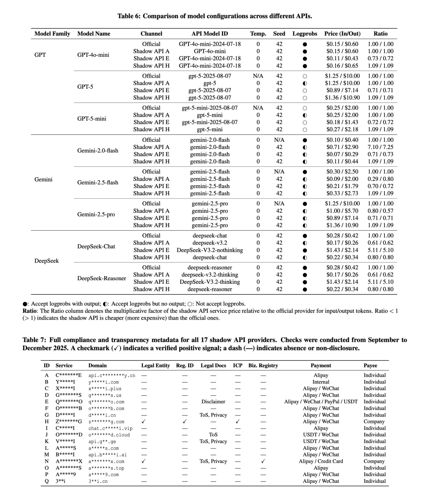
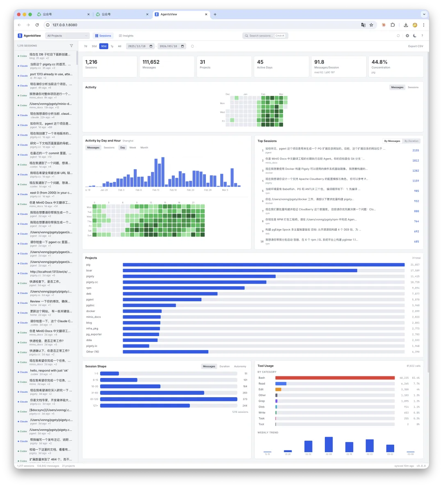
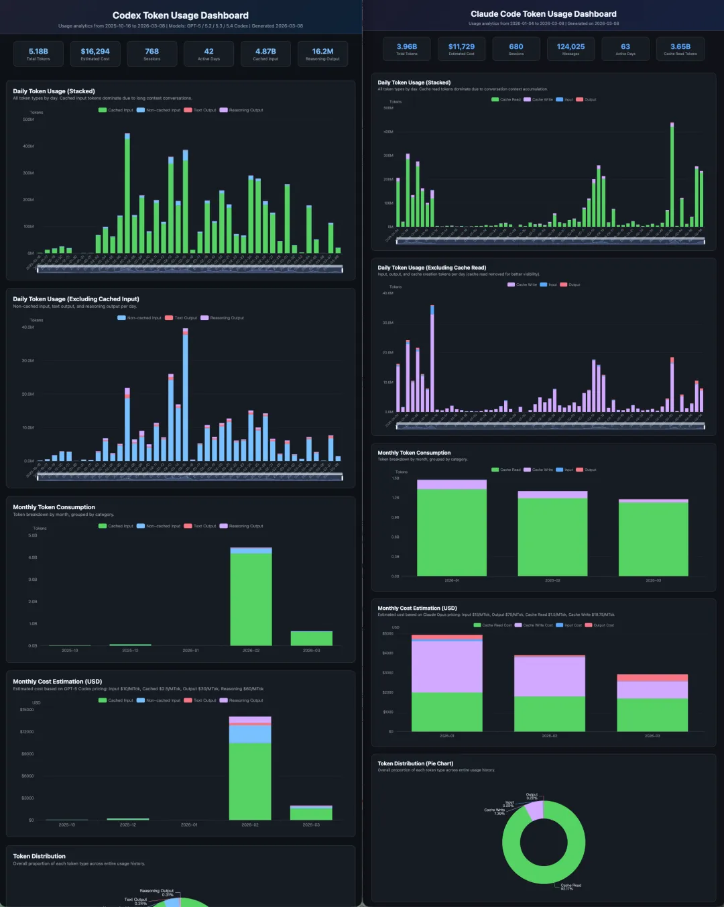
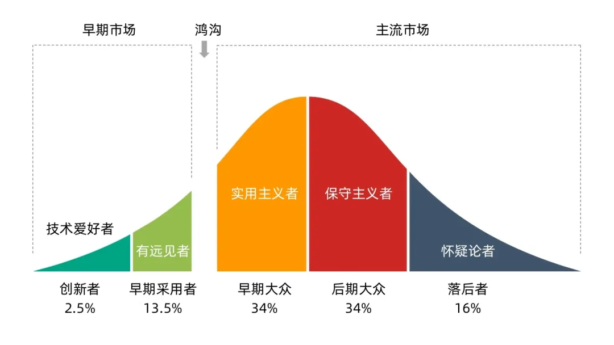

It is not every day that you pay one dollar and receive fifty dollars' worth of compute in return. But that is more or less what frontier AI subscriptions look like right now.

## 1. Paying $200 and burning $5,000 of compute

Recent reporting cited internal Cursor analysis suggesting that Anthropic's $200-per-month Claude Code tier can support thousands of dollars of model consumption per user. My own usage lined up with that story almost exactly.

I pay for two heavy-duty subscriptions: Claude and Codex. Combined, their weighted API list-price equivalent usage came out to around **$22,000** in a month.

Of course, list price and actual cost are not the same thing. But even after discounting toward likely real operating cost, the subsidy is still huge. The rough conclusion is simple: a plan that costs a few hundred dollars can easily imply several thousand dollars of real model spend.

## 2. Is $200 expensive?

At first glance, yes. These subscriptions are not cheap in consumer terms.

But if an agent can replace or multiply the output of a highly paid engineer on certain tasks, the economics flip. A few thousand RMB a month for a tool that can unlock an order-of-magnitude productivity jump is extraordinary.

That is the basic working assumption behind a one-person AI-native company: a small subscription bill can leverage what used to require a much larger payroll.

The real question is not whether the plan sounds expensive in isolation. The real question is whether you can turn it into output that would otherwise require paid labor, time, or API spend. If the answer is yes, then the plan is absurdly cheap.

## 3. Why Chinese users face extra friction

For users in mainland China, three barriers remain:

- network access,
- platform risk controls,
- and international payment rails.

Those barriers also created a gray market of middlemen selling accounts and API access. That market comes with two major risks:

1. **Data security**: your code, documents, and thought process pass through someone else's infrastructure.
2. **Model fraud**: some resellers claim they serve frontier models while silently substituting weaker ones.

If you can access official subscriptions, they are usually the safer and better-value path.

## 4. Burning the quota is harder than it sounds

People obsess over how many tokens they can burn. I care much more about the value created.

Anybody can generate mountains of useless code. The real test is whether you can use the quota on work that actually matters.

My own recent output included product shipping, packaging work, translation, docs, website refreshes, and sustained content production.

## 5. Why this window exists

Today's AI subscription economics are unusual because these companies are still in a market-share land grab. The subsidy is part of that strategy.

There is also a reciprocal exchange happening: expert users provide extremely valuable usage traces, workflows, and evaluation signals. In that sense, the platform is buying real-world training data by underpricing compute.

Palantir's Alex Karp recently argued that AI companies cannot indefinitely fire white-collar workers, reject military customers, and still expect the political system to leave them alone.

Whatever happens politically, one thing seems clear: **this unusually favorable subscription window will not last forever**.

## 6. What about local models?

I am very interested in local inference, especially on Apple Silicon. But my current conclusion is simple: local models are not yet a full replacement for the best cloud coding-agent experience.

Local models are improving fast, and the privacy benefits are real. But if your job depends on high-end coding agents today, the strongest cloud subscriptions still dominate on output quality, reliability, and end-to-end task completion.

## 7. The account-risk problem is real

Subscription access is valuable enough that account bans and risk controls have become part of the operating reality.

The result is a weird market condition: the best-value AI tooling in the world is available, but access friction keeps it effectively gated.

## 8. The early-adopter window

Heavy users are living inside a rare moment: extremely capable systems, consumer-priced access, and vendors still willing to subsidize aggressive usage.

If you can use these tools well, this is probably the cheapest frontier-model labor you will ever be offered.
