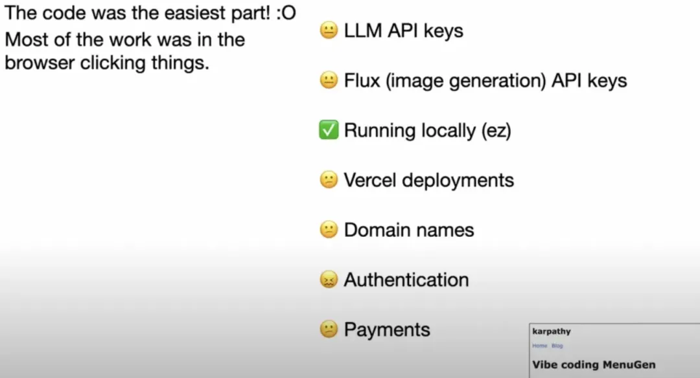
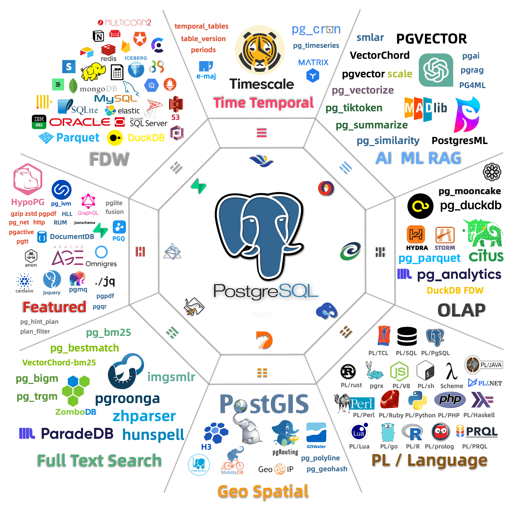
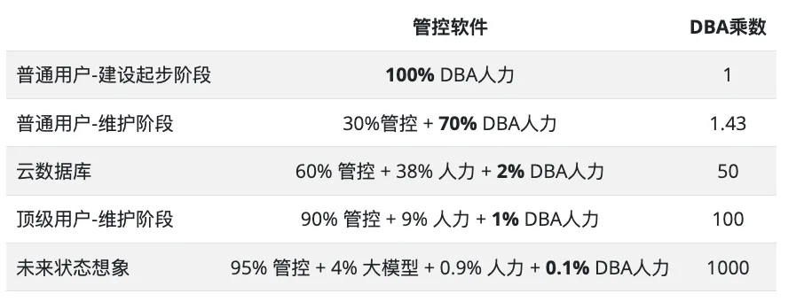
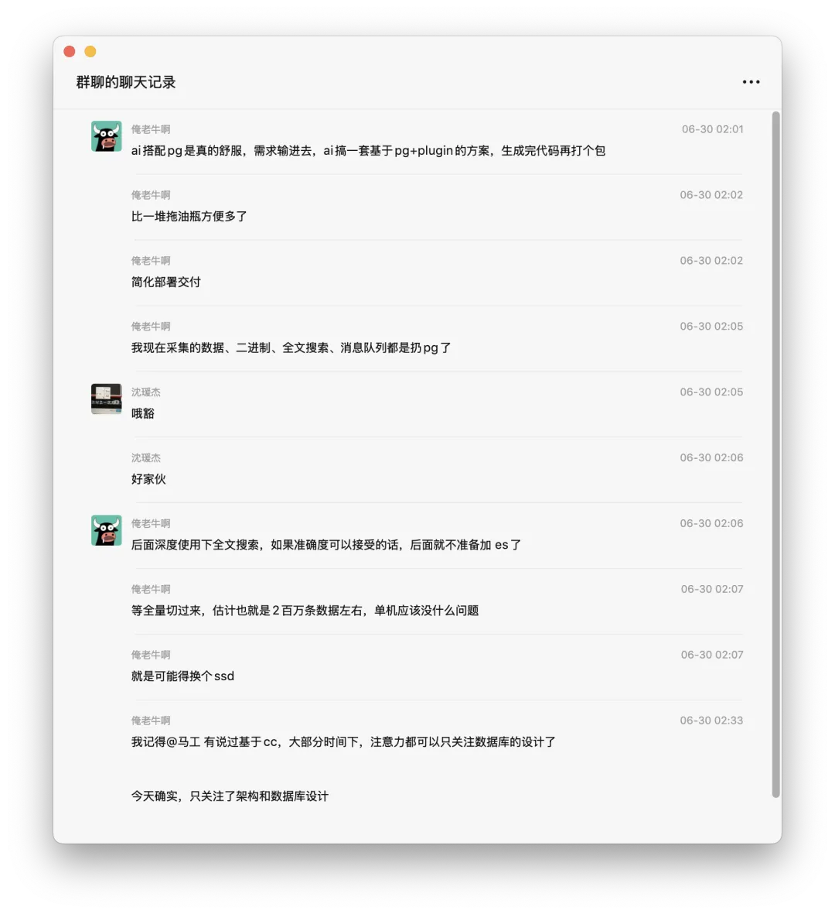

前天在 HOW 2025 大会的圆桌上，萧主席问了一些关于 AI，数据库 DBA 有趣的问题，以下是老冯的观点，整理发出。

## OLTP / OLAP ，谁先被革命？

**问题**：**OLTP / OLAP 领域，AI 在哪个领域更有可能先带来 “革命性” 的变化，DBA， 数据分析师，架构师又该如何应对这些变化。**

**老冯**：“革命性”的意思说白了就是直接把工作岗位干没了。对于 OLTP 领域，这意味着 AI 干掉 DBA ，对于 OLAP 领域，这意味着干掉数据分析师，数据研发的工作。目前的趋势很显然，OLAP 领域的工作岗位正在被替代中，大量 NL2SQL 的方案正在涌现。

与此同时，Claude Code 正在以惊人的水平替代着中低级程序员，写 SQL 的数据分析师与数据研发作为一种 Coding 工种，也落在替代光谱中。我们可以看到各种各样的 “智能分析” / 表格，数据库 MCP，Text2SQL / NL 2SQL 的方案到处冒泡。

然而不同于 Github 上到处都是语料的编程数据样本，运维/数据库管理经验的公开数据积累是非常少的。SRE，DBA 则因为语料数据缺乏，加上反馈验证回路过长，在短期内还难以被直接替代。因此毫无疑问 AI 带来的 “革命性” 变化会首先发生在 OLAP 领域。 

一个鲜活的例子是，OpenAI 创始成员（[软件3.0时代，AI带来的范式转移](https://mp.weixin.qq.com/s?__biz=MzU5ODAyNTM5Ng==&mid=2247489945&idx=1&sn=dbffc2a15e923cef5abb5df9b73426a4&scene=21#wechat_redirect)），Vibe Coding 之父安德烈·卡帕西（Andrej Karpathy）在 YC AI创业学院发表了主题演讲就提到过，他花了一天时间就糊出来一个菜单配图的应用，但是花了整整一周时间才把这个应用给部署上线 —— OPS 部份成了 Vibe Coding 的瓶颈。

尽管如此，Agent 替代 DBA 也只是一个时间早晚的问题。也许三年，也许五年，最终 OLTP 领域的 DBA 工作也会在几年内被 AI 攻克。云计算和本地管控软件会自动化掉 70% - 90% 的工作，而 AI Agent 会处理剩下 9% 的工作，可能留下不到 1% 甚至 千分之一的疑难杂症给顶级 DBA 处理。

## 一体化还是专业化，如何选型？

**问题**：**数据库领域会走向 ”一体化“ 还是 ”专业化“，企业如何针对自己的需求进行合理选择？**

**老冯**：许多领域都存在一个 “钟摆”，根据力量强弱对比来回摆动。在当下，硬件性能突飞猛进，数据库（PostgreSQL）扩展越来越丰富。现在数据库领域的钟摆显然在向 “一体化” 摆动的，而留给专业化组件的生态位越来越小了。

前些日子，有个朋友问我一个向量 RAG 场景，应该用 PostgreSQL + pgvector 还是 Milvus，我问你有多少数据量 —— 两千万条。我回复说这个数量级您就别折腾了，一百多GB的数据放 PG 洒洒水，十几TB 的PG向量表我都见过照样跑的好好的。你要是数据量再翻个几百倍，[有淘宝图搜图百亿千亿量级的场景，用一个专用向量数据库很合理](https://mp.weixin.qq.com/s?__biz=MzU5ODAyNTM5Ng==&mid=2247486505&idx=1&sn=a585c9ff22a81a8efe6b87ce9bd66cb1&scene=21#wechat_redirect)，而你现在已经用着PG，这么点规模就开始折腾，那不是给自己找事吗？

同理，我也见过好几次有业务号称自己有超高增长，一上来就要申请一套水平分片库，最后只有 几十GB数据的滑稽故事。如果你的数据连几十TB都没有，那根本用不上什么分布式 NewSQL 数据库 ——[ OpenAI 可以用一套一主四十从PG支持五亿月活](https://mp.weixin.qq.com/s?__biz=MzU5ODAyNTM5Ng==&mid=2247489761&idx=1&sn=9aeb45c299618fef1dd28635720bfa86&scene=21#wechat_redirect)，那 99.99% 的业务也可以靠一个 PostgreSQL 解决所有问题。[分布式数据库是伪需求](https://mp.weixin.qq.com/s?__biz=MzU5ODAyNTM5Ng==&mid=2247489590&idx=1&sn=5dab5e2601bcc88cbc3fc8ec210efaec&scene=21#wechat_redirect)，[甚至也开始对 OLAP 分析/大数据成立了](https://mp.weixin.qq.com/s?__biz=MzU5ODAyNTM5Ng==&mid=2247489788&idx=1&sn=23befb6797fdd4ac7a073d49802aa980&scene=21#wechat_redirect)。

我们可以把 PostgreSQL 这样的数据库比做智能手机，它可以打电话，GPS 导航，照相，干各种各样的事情。确实存在专业的场景 —— 比如航海需要卫星电话，商业摄影可能需要专业单反相机，但这些小众领域相比智能手机的市场规模差了好几个数量级，而绝大多数用户都只需要一款手机就足够解决他们的问题了。

我认为在当下，对象存储[，APM，OLAP 这几个领域](https://mp.weixin.qq.com/s?__biz=MzU5ODAyNTM5Ng==&mid=2247489822&idx=1&sn=64d32013b4197f9803ad4cf6688925db&scene=21#wechat_redirect)还值得有专用数据库产品。其他的数据库细分领域生态位基本已经收敛到上面的状态。而且使用专用组件的门槛也越来越高，越来越远离大部份应用的规模。我们可以期待再将来的某个时间点，[实现数据库世界的统一与收敛](https://mp.weixin.qq.com/s?__biz=MzU5ODAyNTM5Ng==&mid=2247487513&idx=2&sn=ffb27fc934b6dce3d8571af0e228d21f&scene=21#wechat_redirect)（[数据库火星撞地球：当PG爱上DuckDB](https://mp.weixin.qq.com/s?__biz=MzU5ODAyNTM5Ng==&mid=2247489279&idx=1&sn=ca161963f98ec000a4d3bba41edaea85&scene=21#wechat_redirect) / Timescale / Promescale ）。

过早优化是万恶之源 —— 为了自己不需要的属性付出复杂度，成本，人力，一致性维护上的代价没有意义。企业在数据库选型的时候一定要擦亮眼睛，不要为了自己并不需要的东西而瞎忙活 —— 而 PostgreSQL 毫无疑问就是数据库领域的默认安全牌。

## AI 时代的 DBA，何去何从？

**问题**：从 DBA 到 DBAA，DBA 如何适应 AI 时代的变化与冲击

[最近我用 Claude Code 和 Cursor 重新糊了一遍 Pigsty 的官方网站](https://mp.weixin.qq.com/s?__biz=MzU5ODAyNTM5Ng==&mid=2247489908&idx=1&sn=5bc755ee33be1fc868c200ed0c8f2df9&scene=21#wechat_redirect)，效果非常不错。你可以把 Claude Code 当成一个月薪一百美元的高级工程师（实际上你可以用 20刀套餐，买好几个！），勤勤恳恳的二十四小时给你干活。这意味着什么？这意味一个光杆架构师现在有了一整个待命的高级程序员团队。

AI 是极度利好专家的，在专家手中的 AI 能发挥出普通工程师 10x 的表现 —— 这背后的逻辑是专家能一步到位提出正确的问题，精准的上下文，以及直觉判断，并且有能力对 Code Agent 的方案进行 Verfiy。而普通开发者则往往缺乏答案验证能力与问出正确问题的健全直觉。而架构师可以指挥一堆 Code Agent 替代初级工程师去出活。

这也意味着，IT 领域将很有可能出现阶层固化与分裂 —— 初级工程师的上升路径被 Code Agent 锁死了，被固化为 Code Agent 的传声筒与人肉胶水。而且因为没有那么多场景和故障再给新人打磨练手成长，以后高级的DBA 和架构师可能也就是那么多。

对于金字塔尖的专家来说，这是一个重大利好，这意味着专家的能力可以通过以下两种方式实现高速复制：通过 Coding Agent，[将专家的经验更快的沉淀为可复制的管控软件，消灭 90% 的数据库杂活](https://mp.weixin.qq.com/s?__biz=MzU5ODAyNTM5Ng==&mid=2247486903&idx=1&sn=01c57499f41e8f51045bb8dd52586595&scene=21#wechat_redirect)；然后在前面的基础上，再通过 DBA Agent，将专家的经验沉淀为 Prompt / 知识库，解决 9% 的常规问题，剩下的 1% （也许是 0.1% ）的活，再由专家人工解决。

这意味着一个 DBA 数据库专家可以通过管控与Agent 实现几百倍到上千倍的杠杆。例如，许多客户咨询我的问题，我是丢给 GPT o3-pro 解决的，我只需要问出正确的问题并验证回答有效性，就可以完成原本需要十几倍时间的工作。而这就是超级个体与一人公司的运作方式，让我在一个人服务十几个客户的情况下依然可以时间自由。我将这种新的模式称为 Service as Software （SaaS）。

实际上这也是云厂商云数据库 RDS 团队的工作模式，像德哥这样的顶级 PG DBA 专家可以通过云管控软件，一二三四线客服与 Agent 服务成千上万的客户。当然，他以前可能要依赖云平台的能力，但现在有了开源的 PG 管控平台 Pigsty，他完全可以出来当一个 PG 顾问，用 Pigsty 交付，用 Agent 辅助，自己负责问问题与兜底，同样成为一个数据库超级个体。

对于普通的 DBA 来说，我认为这里也有很多机会。一个显著的趋势是，数据库的专业知识成为了 Vibe Coding 中不可替代性最强的部份。为什么这么说，让我们看看现在的 AI / SaaS 创业者都是怎么交付，怎么出活儿的。

最佳实践通常是用 Next.js 糊个前端托管到 Vercel 或者 Cloudflare 上，后面对接一个 Supabase 这样的 “BaaS” 数据库 —— 后端被完全省略掉了，而前端用 Vibe Coding 去糊相对容易，唯独对 Supabase 底下的 Postgres 的掌握与理解，是相对稀缺的技能。而自建维护生产级 PostgreSQL / Supabase 集群，则基本上成为了整套 Stack 中的瓶颈卡点。

这对 DBA 是一个非常大的利好 —— 因为 Claude Code 把大家的编程能力拉到了同一个水准，那么比拼的就是通用的整合能力，以及稀缺的数据库 / DBA经验。而 PG DBA 群体恰好已经拥有了后者，那么相对于其他同级别工程师来说就占据了一个先天的优势。

而 PG DBA 应该充分利用好当下这个优势，使用 Code Agent （以及 开源 PostgreSQL 数据库管控 Pigsty）武装自己，把自己改造成新一代的全能架构师 + 管理者，在别人还在吭哧吭哧啃数据库硬骨头的时候抢先出击，占领生态位高地。

### 广告时间

老规矩，不打广告，写啥文章？😁

开源免费企业级 PostgreSQL 发行版：认准 Pigsty

https://pgsty.com ，这是市面上唯二两个可以[自建 Supabase ](https://mp.weixin.qq.com/s?__biz=MzU5ODAyNTM5Ng==&mid=2247488737&idx=1&sn=0bc6d0532addb19f70517cd8f8dcb098&scene=21#wechat_redirect)的开源 PostgreSQL 方案。 让你在虚拟机/物理机/云服务器上一键安装好带有高可用， 备份恢复，监控系统，IaC，连接池，访问控制的企业级 PostgreSQL / Supabase / MinIO / Redis / ... 数据库服务，并一条龙解决好 Nginx，域名，HTTPS，Docker，镜像，软件源翻墙等问题 ……
