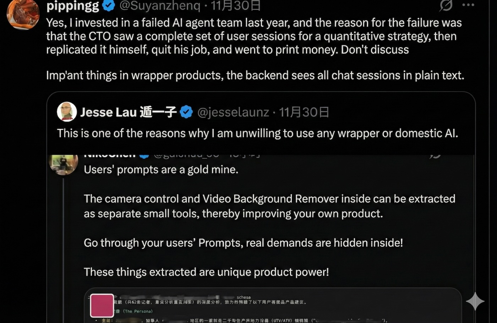

**Answers are depreciating, and your ability to ask questions determines your position in the AI era.**

Kevin Kelly once said: *"In the future, asking questions will be more valuable than answering them. When answers become commodities, good questions are the new wealth."* — We are living in the moment this prophecy comes true.

--------

## The Inflation of Answers

Economics has a basic principle: when a resource becomes extremely abundant, it loses value, while its complements become precious. Water is gold in the desert; worthless in the rainforest.

Answers are becoming rainforest water.

In the industrial age and even the early internet era, obtaining definitive "answers" was expensive—it required expert time, costly database access, or lengthy literature searches. Experts were valuable because they stored knowledge in their heads that we couldn't access.

But today, a fresh graduate intern, armed with a well-crafted prompt, can produce an industry report rivaling that of a senior consultant.

AI has pushed the marginal cost of "obtaining answers" to zero. Certainty itself has undergone hyperinflation.

As early as 1968, Picasso, with an artist's intuition, foresaw all of this. Facing the nascent computer, he said: ***"Computers are useless. They can only give you answers."*** Some thought this was artistic arrogance at the time. Now it reads like prophecy—generative AI is essentially a probability-based "fill-in-the-blank machine." It excels at filling gaps, but it can never tell you: **Where are the gaps?**

Defining the shape of the void, pointing to where the blanks are—this remains humanity's exclusive privilege.

-------

## Why Good Questions Are Scarce

Good questions are rare for three reasons.

**First, asking questions requires admitting ignorance.** In an age where everyone can pretend to be learned, "I don't know" has become a social risk. We'd rather stay silent than expose the boundaries of our cognition. But truly good questions are born precisely from honesty about the unknown.

**Second, asking questions requires defining the problem itself.** AI can answer "how to improve efficiency," but it can't tell you "what should I be asking?" Transforming vague confusion into a clear question is itself a creative act. A well-defined problem often already contains most of the answer.

**Third, asking questions requires courage.** Good questions often challenge the status quo, question assumptions, and offend authority. "Why have we always done it this way?" requires not IQ, but guts.

There's something even more fundamental: **Asking questions is essentially expressing values.** What you choose to pursue reveals what matters to you. Someone focused only on efficiency asks "how to finish faster"; someone focused on meaning first asks "is this worth doing?"

This is also why AI cannot truly replace human questioning—AI has no genuine concern. It can generate questions, but it won't be troubled by them. Truly powerful questions often come from those kept awake at night, tormented by their inquiries.

-------

## Implications

**The Collapse and Reinvention of "Knowledge Workers"**
: Previously, lawyers memorized statutes, doctors memorized case studies, engineers memorized APIs—this was called professional moat. Now? These are LLM fundamentals. What will truly be valuable in the future isn't people who can answer "how," but those who can pose the right questions, asking "why should we do this" and "what if we don't?"

**Education Faces Fundamental Restructuring**
: Our education system is basically an "answer training camp"—exams test whether you can give correct answers. But if answers become cheap, we need a "question training camp": the evaluation criterion shifts from "what do you know" to "what can you ask?" The student most deserving of praise in class isn't the one who answers fastest, but the one who asks a question that makes even the teacher pause to think.

**Innovation Is Reunderstood**
: Looking back at major historical breakthroughs, they often weren't because someone found a better answer, but because someone asked a question no one had asked before. Darwin didn't ask "how were species created" but "can species change?" Einstein didn't ask "how to measure the ether" but "what if there is no ether?" Jobs didn't ask "how to make a better phone" but "why must phones have keyboards?" The real bottleneck of innovation has never been answers—it's the ability to redefine the problem.

**Prompting as Programming**
: For programmers, your question is the source code, and AI is the compiler. A logically confused question inevitably compiles into a bug-ridden answer—Garbage In, Garbage Out. Behind good questions lies a deep understanding of the nature of things. You need cross-disciplinary vision to guide AI in connecting two unfamiliar domains; you must understand business logic better than AI to ask questions that expose gaps it cannot answer.

**The Poverty of Attention and the Tyranny of Algorithms**
: Herbert Simon said: "A wealth of information creates a poverty of attention." In the AIGC era, information production costs are nearly zero, and supply explodes exponentially. In this environment, asking questions isn't just a means of acquiring information—it's an attention filter. Those who don't ask become algorithmic subjects; those who ask become algorithmic masters.

**Questioning as Order Construction**
: From a thermodynamics perspective, massive unfiltered AIGC content is a high-entropy state. Every human question is a process of introducing negentropy—constructing local order within informational chaos. This capability will be far scarcer than "knowing facts" in the future.

-------

## Taste: The Ultimate Moat in the AI Era

When all AI models are trained on similar internet datasets, their outputs often exhibit a kind of "**smooth mediocrity**"—grammatically perfect, logically coherent, but lacking edge and soul. This is the so-called "**AI flavor**."

At this point, **taste**—a highly personalized capacity for selection, judgment, and appreciation—becomes the key differentiator between excellence and mediocrity.

When AI can generate hundreds of versions of copy, logos, or melodies, the act of "**creating**" becomes cheap, while the act of "**choosing**" becomes expensive. If questions are currency, taste is the investment acumen that determines which currencies to hold.

Having taste in questions means: knowing what questions aren't worth asking—this isn't avoidance, it's resource allocation; life is finite, you can't pursue everything; knowing what questions are worth protecting—when everyone asks "how to grow," you might feel the better question is "why grow at all"; knowing when to keep asking and when to accept—some questions derive their value precisely from keeping you perpetually puzzled; "who am I" might not be meant to be answered, but to be lived and experienced.

Where does taste come from? Not from books, not from asking AI. Taste is the judgment that precipitates after you've personally pursued questions, hit walls, and received feedback from reality. This is also why AI can't truly have "taste"—AI can give you all the options, but it doesn't know which option truly matters to you. Because it hasn't lived your life.

-------

## Conclusion

We're entering a peculiar era: knowing answers is becoming easier, knowing what to ask is becoming harder.

AI is an extremely powerful amplifier. If you're mediocre, it amplifies your mediocrity—letting you generate more mediocre content faster. If you're profound, it amplifies your depth—helping you validate those crazy hypotheses.

Don't settle for AI's first answer. Don't stop pursuing "why" just because answers are at your fingertips.

In the future, what distinguishes people won't be who knows more, but who can pose the question that makes AI pause for a moment—or even forces it to "hallucinate" to fill the gap.

Answers are endpoints; questions are starting points. In an era of cheap answers, the courage to ask, the skill to ask, the persistence to keep asking, and the taste in what to ask—these may be our last moat.

Consider this—this article was generated by AI, but ultimately, it was Feng's taste in questioning, his technique in follow-up, and his underlying values that shaped its final form.

-------

## Shameless Plug

My friend recently launched an interesting app called "JiaoQuanr" (焦圈儿)—an AI questioning community. It looks pretty rough around the edges, but the concept is solid: you can see what questions others are asking AI, add your own perspective to good questions, re-ask and follow up with multiple AI models, and share your questions with others.

The best part of this concept: if you're going there specifically to see others' questions and share your own publicly, you don't have to worry about your ideas and privacy being harvested by wrapper AIs.
