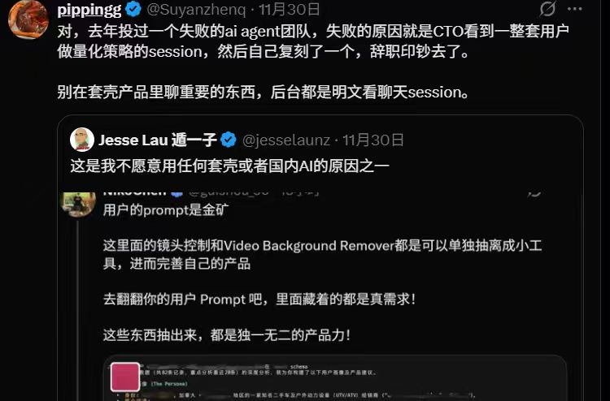

**答案正在贬值，而提问的能力，决定了你在AI时代的位置。**

凯文·凯利说过：*"未来提问将比回答更有价值。当答案成为商品时，好的问题就是新的财富。"* —— 我们现在就活在这个预言成真的时刻。

--------

## 答案的通货膨胀

经济学有个基本原理：当某种资源变得极度丰富时，它就失去价值，而与之互补的东西会变得珍贵。水在沙漠中是黄金，在雨林中一文不值。

答案就在成为雨林中的水。

在工业时代乃至互联网早期，获取确定的"答案"是昂贵的——它需要专家的时间、昂贵的数据库访问权限、或漫长的文献检索。
专家之所以值钱，是因为他们脑子里存着我们触不到的知识。
但今天，一个刚毕业的实习生，凭一条精心设计的提示词，就能输出一份媲美资深顾问的行业报告。

AI把"获取答案"的边际成本压到了零。确定性本身，发生了一场恶性通货膨胀。

早在1968年，毕加索就以艺术家的直觉预判了这一切。面对刚刚崭露头角的计算机，他说：***"计算机毫无用处，它们只能给你答案。"*** 
当时有人觉得这是艺术家的傲慢，现在看简直是一语成谶 —— 生成式人工智能本质上是一台基于概率的“填空机器”。它擅长填补空白，但它永远无法告诉你：**空白在哪里？**

定义空白的形状、指出空白的位置，这依然是人类独有的特权。

-------

## 好问题为什么稀缺

好问题难得，原因有三。

**第一，问问题需要承认无知。** 在人人都能假装博学的时代，"我不知道"成了社交风险。我们宁愿沉默，也不愿暴露认知边界。但真正的好问题，恰恰诞生于对未知的坦诚。

**第二，问问题需要定义问题本身。** AI可以回答"如何提高效率"，但它没法告诉你"我应该追问什么"。把模糊的困惑转化为清晰的问题，本身就是创造性行为。一个定义清楚的问题，往往已经蕴含了大半的答案。

**第三，问问题需要勇气。** 好问题往往挑战现状、质疑假设、冒犯权威。"我们为什么一直这样做？"这类问题需要的不是智商，而是胆量。

还有一个更根本的东西：**问问题本质上是在表达价值观。** 你选择追问什么，就是在宣告什么对你重要。一个只关心效率的人会问"如何更快完成"，一个关心意义的人会先问"这事值得做吗"。

这也是AI无法真正替代人类提问的原因 —— AI没有真正的在乎。它可以生成问题，但它不会被问题困扰。而真正有力量的问题，往往来自那些被问题折磨得夜不能寐的人。

-------

## 几个推演

**“知识工作者”的崩塌与重塑**
: 以前律师背法条、医生背病例、工程师背 API，这叫专业壁垒。现在？这些都是 LLM 的基本功。
未来真正值钱的，不是能回答 “怎么做（How）” 的人，而是能提出正确的问题，追问 “为什么要做（Why）” 和 “如果……会怎样（What if）” 的人。

**教育系统面临根本性重构**
: 我们的教育基本是个"答案训练营"——考试考的是你能不能给出正确答案。但如果答案变得廉价，我们需要的是一个"问题训练营"：评判标准从"你知道什么"转向"你能问出什么"。
课堂上最该被表扬的，不是最快给出答案的学生，而是问出让老师也要停下来思考的学生。

**创新的本质被重新理解**
: 回顾历史上的重大突破，它们往往不是因为找到了更好的答案，而是因为有人问了一个之前没人问的问题。
达尔文问的不是"物种怎么被创造的"，而是"物种会不会改变"；爱因斯坦问的不是"如何测量以太"，而是"如果根本没有以太呢"；
乔布斯问的不是"怎么做更好的手机"，而是"手机为什么必须有键盘"。创新的真正瓶颈从来不是答案，是重新定义问题的能力。

**提问即编程** 
: 对于程序员来说，你的问题就是源代码，AI是编译器。一个逻辑混乱的问题，必然编译出一个充满Bug的答案 —— Garbage In，Garbage Out。
好问题的背后，是对事物本质的深刻理解。你必须有跨学科的视野，才能引导AI把两个陌生领域连接起来；你必须比AI更懂业务逻辑，才能问出AI答不上来的漏洞。

**注意力的贫困与算法的暴政** 
: 赫伯特·西蒙说过：信息的丰富意味着注意力的匮乏。AIGC时代，信息生产成本几乎为零，供给呈指数级爆炸。
在这种环境下，提问不仅是获取信息的手段，更是一种注意力过滤器。不提问的人沦为算法的受体，提问的人成为算法的主人。

**提问作为一种秩序构建**
: 从热力学角度看，海量未经筛选的AIGC内容是一种高熵状态。
人类的每一次提问，都是一次引入负熵的过程——在信息的混沌中构建局部秩序。这种能力在未来将比"知道事实"稀缺得多。

-------

## 品味：AI时代的终极护城河

当所有AI模型都基于相似的互联网数据集训练，输出往往呈现一种 “**平滑的平庸**” —— 语法完美、逻辑通顺，但缺乏棱角和灵魂。这就是所谓的 “**AI 味**”。

此时 **品味** ——一种高度个人化的选择、判断和鉴赏能力——就成为区分卓越与平庸的关键。

当AI可以生成几百个版本的文案、Logo或旋律时，“**创作**” 的动作变得廉价，“**选择**” 的动作变得昂贵。如果问题是货币，品味就是决定该持有哪些货币的投资眼光。

在问题上有品味意味着：知道什么问题不值得问——这不是逃避，是资源配置，生命有限，你不可能追问所有事；
知道什么问题值得守护 —— 当所有人都在问 “怎么增长” 时，你可能觉得更该问的是 “为什么要增长”；
知道什么时候该追问，什么时候该接受 —— 有些问题的价值恰恰在于让你持续困惑，“我是谁” 可能不是用来回答的，而是用来活着去体验的。

品味从哪来？不是从书本里学的，不是从AI那里问来的。品味是你亲自追问过、碰壁过、被现实反馈过之后，沉淀下来的判断力。
这也是AI很难真正有"品味"的原因 —— AI可以给你所有选项，但它不知道哪个选项对你真正重要。因为它没有活过你的人生。

-------

## 结语

我们正在进入一个奇特的时代：知道答案越来越容易，知道该问什么越来越难。
AI是个极其强大的放大器。如果你平庸，它放大你的平庸 —— 让你更快地生成更多平庸的内容；
如果你深刻，它放大你的深刻 —— 帮你验证那些疯狂的设想。

不要满足于AI给你的第一个答案。不要因为答案唾手可得，就停止了对"为什么"的追寻。
在未来，区分人与人的，不再是谁知道得更多，而是谁能提出那个让AI沉默片刻、甚至被迫产生"幻觉"去填补的问题。

答案是终点，问题是起点。在答案廉价的时代，敢于追问、善于追问、持续追问，以及提问的品味，可能是我们最后的护城河。

就好比 —— 这篇文章是 AI 生成的，但说到底，还是老冯提问的品味，追问的技巧，内在的价值观，塑造出了它的最终形态。

-------

## 小广告

最近老冯的朋友新搞了个有意思的 App "焦圈儿"，一个 AI 提问社区。虽然看上去蛮粗糙，但这个点子真不赖 —— 
你可以看到别人在向 AI 问什么问题，对别人的好问题加入自己的理解，重新向几个AI提问与追问，并与他人分享自己的问题。

这个点子最好的部分是：如果你本来就是奔着看别人的问题，以及公开分享问题去的话，就不用担心你的点子和隐私被套壳 AI 给套走了。
