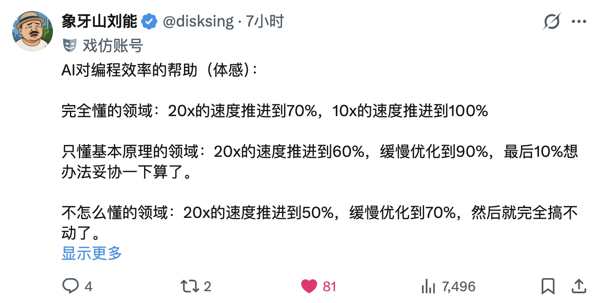

## The Window Is Closing

Recently I was chatting with a few friends in tech, and we landed on a question that silenced everyone:

> "Should we still hire fresh grads?"

Nobody could answer. Not because they didn't want to — because they didn't dare.

AI isn't "assisting" programmers. It's **redefining** the floor and ceiling of the profession.

This isn't one company's problem. It's a structural reorganization of the entire industry.

---

## The First Rung Got Yanked Out

The old programmer growth path was clear:

**Write code → Hit walls → Accumulate experience → Understand architecture → Make technical decisions**

This ladder worked for decades. But now there's a fatal problem: **AI took over the first rung.**

Redis creator Antirez recently put it well:

> "Programming is now automatic, vision is not (yet)."

The problem is: **vision is precisely what you build through programming.**

You have to write bad code yourself to know what good code looks like. You have to hit walls yourself to know where the walls are. You have to make wrong architectural decisions yourself to learn how to make right ones.

How do you translate "Vibe Coding"? The Chinese "atmosphere coding" is terrible. I'd call it **"intuition coding"** — and the core capability is the intuition built from years of domain experience.

Now AI handles "writing code," so how do newcomers develop intuition?

The most gut-wrenching line from that conversation:

> **"People without industry experience no longer have the chance to gain industry experience."**

---

## Arms Race: The Red Queen Effect

There's an even crueler reality: **every programmer is using AI, but when everyone uses it, everyone devalues together.**

Classic prisoner's dilemma. Or rather, the **Red Queen Effect**: you have to keep running just to stay in place.

Say 1 programmer + AI = 10x output. But market demand didn't grow 10x — it might even be [shrinking as agents replace translation-layer work](/db/neo-software).

Result? **The number of programmers the industry needs drops off a cliff.**

It's like someone published the secret martial arts manual — everyone can learn it, everyone is learning it. After everyone's done, the number of spots in the world hasn't changed. Competition just got way more intense.

The irony: skip it and others won't — you're out. Learn it and everyone learns it — everyone's grinding harder.

**Individual rationality, collective trap.**

---

## AI Is a Multiplier, Not an Adder

Young devs might think: if I use AI, I can catch up to senior devs, right?

Think again.

**AI is a multiplier, not an adder.**

- 10 years experience × AI = devastating output
- 1 year experience × AI = still junior, just faster at being junior

I've been averaging 3,800 lines of code per day this past month. For database-level work, I used to consider 200-300 lines of solid code per day a good pace. Now? 10x+ that.

ClawdBot's author is even more absurd — **30,000 lines per day**.

This isn't a gap with regular programmers anymore. This is **speciation**.

Lines of code isn't a great value metric — but it demonstrates one thing: **the execution bottleneck has been blown wide open.** Previously, even great ideas were throttled by implementation speed. Now, the only limits left are judgment and architectural ability.

Even if AI output quality falls short of a single top-tier programmer, it operates at 10x+ human thinking speed at a fraction of the cost. That's enough to change everything.

---

## The Senior Dev's Brief Window of Advantage

Conversely, **this AI wave favors veterans.**

Why?

**First, the experience lever is amplified.**

AI writes code, but can't decide *what* code to write. You need to know: should this feature be built? If so, what architecture? What pitfalls to avoid? What "good" looks like?

All experience. AI drives execution cost toward zero, but **decision-making value actually increases**.

**Second, domain knowledge becomes a moat.**

How connection pools die, how HA blows up, how to do emergency rollbacks in production, how to save data — this knowledge is sparse in training data but lethal in production. Those who know it become more valuable. Those who don't become more dangerous.

But this advantage is temporary — everyone's learning, and stronger people are grinding harder than you.

**Third, seniors can "self-agentify."**

Top programmers are now doing this: distilling years of experience, judgment, and decision patterns into systems/tools/frameworks, using AI as the execution layer, and producing at scale.

The polite way to put it: one person creates a new category. The blunt way: one person eliminates an industry.

A senior DBA used to mentor a team, hand-holding 2-3 usable people per year. Now the senior DBA distills experience into automation systems and DBA Agents. New hires use them directly, skipping the "learn by failing" phase. The middle layer gets squeezed. Only "wheel builders" and "wheel users" remain.

Domain knowledge is becoming the **weapon of mass destruction** that lets top programmers clone themselves at scale across the industry.

In an era where everyone wants to be an AI accelerationist, nobody's rice bowl is unbreakable.

---

## Open Source Changed, Too

Someone might say: fine, nobody's paying me to grind XP anymore, but I can contribute to open source for free to build experience, right?

Other industries know this pattern well — some nursing grads literally pay for positions at top hospitals to build their resumes. Programmers never had it that bad. Open-source communities were free training grounds.

But now, **the rules of open source have changed.**

More and more projects are explicitly rejecting **"AI Slop"** — low-quality PRs mass-generated by AI.

Why? Because **maintainers use AI too now.**

When maintainers can vibe-code all the implementations themselves, why would they need external PRs? Open-source maintainers were already overloaded. Now they've got a pile of AI-generated garbage PRs to review on top of that. The response? Raise the bar. Get pickier.

"Contributing to open source" used to be a solid path to building experience and reputation. That road is narrowing too.

------

## Young Devs' Situation: Strengths and Weaknesses

So where does this leave young programmers?

**The weaknesses are obvious:**

- **No runway.** Big companies are cutting headcount, small companies have no budget, mid-size companies are barely surviving.
- **The 10,000-hour rule hasn't disappeared, but the entry points have.** You're competing on new-era 10,000 hours, but can't even find the on-ramp.
- **Easy to be fooled by AI's "false empowerment."** Ship a few AI-assisted projects, think you're good — but you've only touched the surface. The fundamentals remain untouched.

But the strengths are equally significant:

- **Cognitive flexibility from having no legacy baggage**: no need to unlearn old workflows. Adopting new AI paradigms is more natural. Sometimes a veteran's outdated experience is actually a liability.
- **Time arbitrage, fewer detours**: seniors' judgment was bought with a decade of mistakes. You don't have a decade, but you can use AI to directly access "meta-knowledge about what mistakes to make." Learning conditions are dramatically better.
- **Low time/opportunity cost**: compared to seniors, more room to explore and fail.

**Open question: can judgment and intuition be "simulated"?**

Here's a counterintuitive possibility worth serious thought: **"learning by failing" may not be the only path to judgment.**

The traditional growth model: write code → fail → pain → lesson learned. After a decade, judgment lives in your bones.

But what if from day one you treat AI as a thinking partner — having it explain the reasoning behind every decision, simulate failure scenarios, play the role of a harsh code reviewer? Your path to judgment might look completely different from the veterans'.

It's like pilot training: you can't learn about real crashes by experiencing them. But flight simulators let you go through thousands of extreme scenarios safely. AI might be the programmer's flight simulator.

**But this path hasn't been fully validated yet.**

We don't know if "simulated failures" can truly replace "real failures." We don't know if AI-assisted judgment holds up under real production pressure. We don't even know what this new kind of judgment looks like — it might be completely different from the old guard's but equally effective, or it might look solid but shatter on contact.

**This is an open question.**

But if you're young, this might be your only chance to leapfrog. The old path is closed — you don't have a decade to slowly grind. Your only bet is that this new path works.

Good news: even if this path ultimately doesn't pan out, the AI collaboration skills, rapid learning ability, and systematic thinking you build along the way are valuable in their own right.

------

## Breaking Through

The door is closing, but a window's still open. The window is shrinking, and it shrinks a little more every day.

For those still willing to fight, my advice comes in three parts: master the right tools, take initiative, find the right people.

----

### 1. Master AI Tools, But Use Them Right

Claude Code isn't optional. It's a **core requirement**.

But the point isn't "use AI to write code for me." It's **"use AI to build judgment."**

What does that mean? Have AI explain:

- Why this design?
- What are the alternatives?
- What are the trade-offs?
- What goes wrong in production?

Don't just let AI do things for you. Make AI **teach** you why.

----

### 2. Find Your Mentor — Be More Agentic Than the Agent

Still waiting for a company to pay you to grind XP? Forget it.

You have to create your own opportunities. You need more agency than an Agent to fight your way out from between AI and the old guard.

An AI Agent's defining trait: give it a goal, it autonomously plans, executes, and self-corrects. As a human, you need even more of this initiative — proactively finding projects, resources, and mentors, not waiting to be assigned.

Through McLuhan's "obsolescence-retrieval" lens: what does AI obsolete? The paradigm of "knowledge scarcity" as a value source — you used to be valuable because you knew things others didn't. Now AI knows everything.

What does AI retrieve? Pre-printing-press knowledge transfer modes:

- Through dialogue (Socratic questioning)
- Through mentorship (apprenticeship)
- Through reputation and community (knowing *who* to trust matters more than knowing *what*)

The printing press crystallized knowledge into books, letting it exist independent of people. Huge progress, but with a cost — we started believing "knowledge is in books" rather than "knowledge is in people."

AI is reversing this. When anyone can invoke infinite knowledge, "knowing what" devalues. "Being who" becomes valuable again.

**For young devs: finding a mentor matters more than finding knowledge.**

Not the "carry me, senpai" fantasy, but the real work:

- Find people you want to become. Study their paths.
- Join their projects, even starting from the most peripheral contributions.
- Build reputation in the community. Let the right people notice you.
- Learn to ask good questions — this is itself the scarcest skill.

**Knowledge got democratized. Trust didn't.** Whoever builds trust, breaks through.

----

### 3. Bet on Things That Won't Get Flipped

What should young people actually learn?

My answer: **software engineering skills + infrastructure knowledge.**

> If I had to be specific: Claude Code (BMAD) + PostgreSQL (Pigsty).

Why these two?

**Software engineering skills** doesn't mean "can write code." It means: how do you turn a vague requirement into an executable plan? How do you design a maintainable system? How do you leverage AI to build complex projects? This is a whole new engineering practice, completely different from "can chat with AI."

**Infrastructure knowledge** means the stuff "close to the metal": operating systems, databases, networking, storage. These change slowly, have deep moats, and face minimal AI disruption. They're sparse in training data but critical in production. AI apps, agents — they all run on infrastructure.

What's not worth learning? Process software, SaaS, "translation layer" work, flashy coding tricks, and [MySQL, that legacy relic](https://mp.weixin.qq.com/s/gQZ3Q5JKV8gaBNhc1puPcA) — AI will flip all of these.

Writing code doesn't matter anymore. In the future there might not even be "programmers" as a job title. Only **software engineers**.

------

## Final Thoughts

The window is closing. That's a fact. Don't look away. But for those **willing to fight**, the road isn't dead.

Remember three things:

1. **Don't be fooled by AI's false empowerment.** AI amplifies your capability, not your delusions. But don't be paralyzed by doom narratives either — young people have their own advantages. The key is finding your path.

2. **Find leverage that lets you accumulate experience fast.** Projects, tools, mentors — don't start everything from zero. That just gets you left further behind.

3. **The competition in this era isn't "can you use AI" — it's "do you have something worth amplifying."** Find your IKIGAI, fast.

Time is short. Get moving.

---

## Shameless Plug

Writing blog posts without a plug is basically not writing. If you're interested in PostgreSQL, my open-source distribution **Pigsty** might help — it's a PostgreSQL solution that scales from your laptop to a full data center. One command spins up a best-in-class PG RDS on bare Linux: 400+ extensions, comprehensive monitoring, backup, and HA.

Vibe Coding godfather Andrej Karpathy said he built an app in a day but spent a full week getting it deployed. Pigsty turns a bare Linux cloud server into a complete agent/app runtime, solving the "last mile" problem of vibe coding, without worrying about database management details.

https://pigsty.cc
