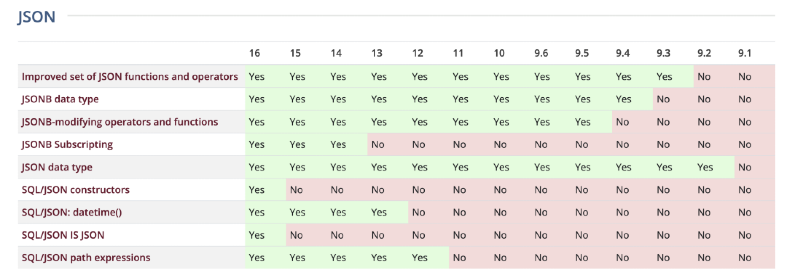
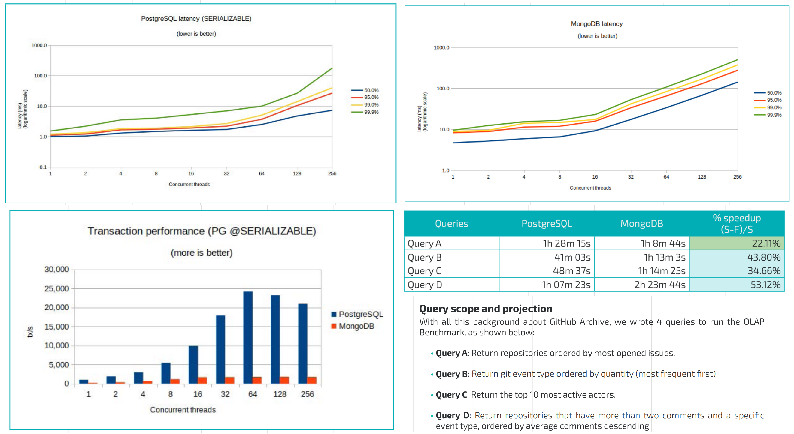
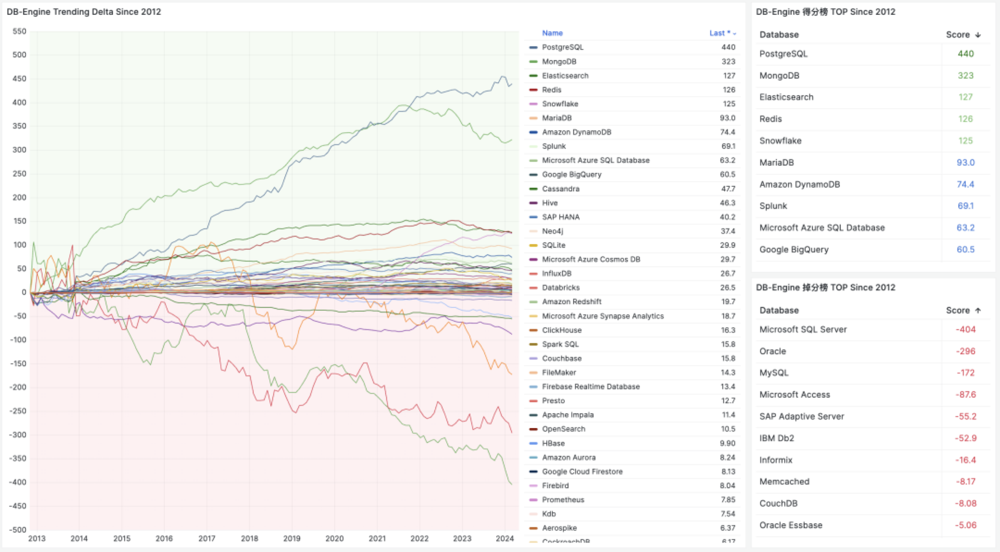
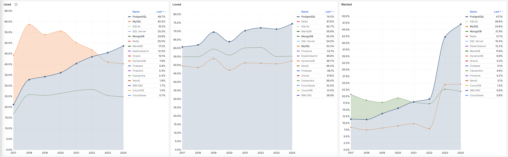
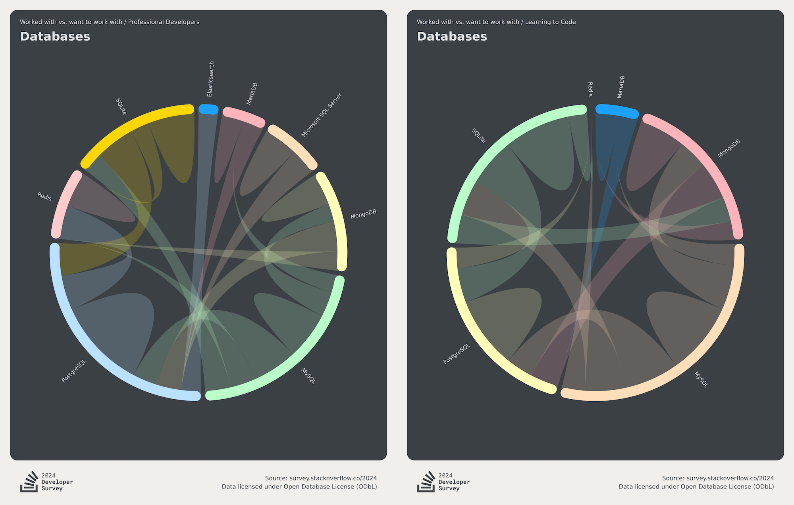

These past few days, MongoDB's marketing stunts have been dazzling: "[MongoDB Declares War on PostgreSQL](https://mp.weixin.qq.com/s/ypV31fanKB6ZsFzuRYTwmQ)", "[MongoDB Defeats PostgreSQL to Win $30 Billion Project](https://mp.weixin.qq.com/s/SJw6S6k82bxOq1pWP3kDfw)", and the original article from The Register "[MongoDB Prepares to Pummel PostgreSQL After Beating Strong Opponent](https://www.theregister.com/2024/08/30/mongodb_postgresql/)", presenting a stance of wanting to beat the old master with wild punches.

Friends smugly forwarded this to me specifically to see PostgreSQL's embarrassment, which made me feel helpless - **such ridiculous news actually has believers!** But the fact is - **such ridiculous stuff really does have believers!** Including some CEOs who fall for it and crash.

As Stonebraker the grandmaster said: "**Never underestimate the impact of good marketing on bad products**."

Selling things to a company valued at $30 billion and doing a $30 billion project are completely different things. Of course, you can't blame people for being dim - this is MongoDB's **consistent marketing trick** - if you don't carefully read the original text, it's hard to distinguish whether this $30 billion refers to project value or company valuation.

Currently, MongoDB is lackluster in products and technology; gets crushed by PostgreSQL in correctness, performance, functionality, and various dimensions; its popularity and reputation among developers continue to decline, along with DB-Engine popularity, MongoDB the company itself doesn't make money, stock price just got halved, and losses continue to expand; "marketing" might be the only thing MongoDB can offer.

However, integrity is the foundation of business, "good marketing can't save a rotten mango," and marketing built on lies and deception won't end well. Today I'll show everyone what rotten cotton is stuffed inside MongoDB's marketing silk brocade cover.

---------

## Bad Product Rises Through Marketing

Turing Award winner, database grandmaster Stonebraker made a brilliant assessment in his famous paper "[What goes around comes around... And Around](https://db.cs.cmu.edu/papers/2024/whatgoesaround-sigmodrec2024.pdf)" published at SIGMOD 2024: "Never underestimate the impact of good marketing on **bad products** - **like MySQL and MongoDB**."

There are many bad databases in this world - but those that can successfully blow bad products into treasures and sell them with silver tongues, MongoDB claims first place, and MySQL would only admit to second place.

Among all the stories about MongoDB's great deceptions, the most memorable is this LinkedIn post "[MongoDB 3.2 - Now Powered by PostgreSQL](https://mp.weixin.qq.com/s/e3_32Neoy5RVRBSozsa_7A)".
The brilliance of this article lies in it being a bloody accusation from a MongoDB partner: MongoDB ignored their partner's loyal advice, took a PostgreSQL and disguised it as their own analytics engine, then deceived users at the launch event.

As a MongoDB partner in the analytics field, the author was completely disheartened and publicly wrote an accusation - "*MongoDB's analytics engine is a PostgreSQL, so you might as well just use PostgreSQL directly*."

Such cases of deliberate fraud and deception are far from isolated. MongoDB also has many records of disparaging competing products to elevate itself. For example, in the official website article "[Migrating from PostgreSQL to MongoDB](https://www.mongodb.com/resources/compare/mongodb-postgresql/dsl-migrating-postgres-to-mongodb)", MongoDB claims to be a "**scalable, flexible, next-generation modern general-purpose database**",
while PostgreSQL is a "**complex and error-prone legacy monolithic relational database**". This completely ignores the fact that it's actually beaten by PostgreSQL in overall performance, functionality, correctness, and even its own touted big data throughput and scalability.

-----------

## Functionality Covered by PostgreSQL

JSON documents are indeed a feature beloved by internet application developers. However, databases providing this capability aren't limited to MongoDB. PostgreSQL provided SOTA-level JSON support ten years ago and continues to evolve and improve.

PostgreSQL's JSON support is the most mature and earliest among all relational databases (2012-2014), predating the SQL/JSON standard or directly influencing the establishment of the SQL/JSON standard (2016).
More importantly, its document feature implementation quality is high. In comparison - MySQL, which also claims to support JSON in marketing, is actually a crude BLOB skin change, [comparable to the 9.0 vector type](https://mp.weixin.qq.com/s/JgGCn9o2-DNPNqazPZXTtA).

Database grandmaster Stonebraker stated that the relational model with extensible types has covered every corner of the database world, and the NoSQL movement was a detour in database development history: **the relational model is backward compatible with the document model**.
The document model is essentially the same as the normalization vs denormalization debate from decades ago - 1. Any non-one-to-many relationships will lead to data duplication; 2. Pre-computed JOINs aren't necessarily faster than on-the-fly JOINs; 3. Data lacks independence.
Users can assume their application scenarios are independent KV-style cache access, but as soon as they add any slightly complex functionality, developers face the data duplication dilemma discussed decades ago.

PostgreSQL is functionally a superior replacement for MongoDB, so it can be backward compatible with MongoDB use cases - PostgreSQL can do what MongoDB can't; and MongoDB can do what PostgreSQL can also do: you can create a table with only a `data JSONB` column in PG, then use various JSON queries and indexes to process this data; if you really think spending a few seconds creating a table is still an additional burden, there are various PostgreSQL-based solutions in the ecosystem that provide MongoDB APIs or even MongoDB wire protocol.

For example, the FerretDB project achieves MongoDB wire protocol compatibility on PostgreSQL clusters through middleware - MongoDB applications don't even need to change client drivers or modify business code to migrate to PostgreSQL.
(Another one with native compatibility is [SQL Server](https://mp.weixin.qq.com/s/c2TmMo0DflkSUli1BsLthQ)); PongoDB directly simulates PG as MongoDB on the NodeJS client driver side.
Additionally, there's `mongo_fdw` allowing PG to read data from MongoDB using SQL, and `wal2mongo` extracting PG changes as BSON.

For example, the [**FerretDB**](/pg/ferretdb) project achieves MongoDB wire protocol compatibility on PostgreSQL clusters through middleware - MongoDB applications don't even need to change client drivers or modify business code to migrate to PostgreSQL. (Another with native wire compatibility is [**SQL Server**](/pg/pg-replace-mssql)); **PongoDB** directly simulates PG as MongoDB on the NodeJS client driver side. Additionally, there's `mongo_fdw` allowing PG to read data from MongoDB using SQL, and `wal2mongo` extracting PG changes as BSON.

In terms of usability, major cloud vendors all offer ready-to-use PG RDS services. For open-source self-building, there are ready-to-use solutions like [**Pigsty**](https://pigsty.cc/), and serverless Neon makes PG's entry barrier so low that you can start using it with one command.

Furthermore, compared to MongoDB's SSPL license (no longer an open source license), PostgreSQL's BSD-like open source license is obviously much friendlier. PG can provide better superior functional replacement without software licensing fees - Do more pay less! Hard not to win.

-----------

## Crushed in Correctness and Performance

For databases, **correctness is paramount** - the neutral distributed transaction testing framework JEPSEN evaluated MongoDB's correctness: the results can be described as "**a complete mess**" (BTW: another troubled brother is [**MySQL**](/db/bad-mysql)).

Of course, MongoDB's strength is shameless "deception." Despite JEPSEN raising so many issues, on MongoDB's official website, their introduction to Jespen's evaluation goes: "*So far, causal consistency has generally been limited to research projects... MongoDB is one of the first commercial databases we know of to provide an implementation*"

This example once again demonstrates MongoDB's marketing shamelessness - using extremely refined language arts, carefully selecting an undigested peanut from a pile of bullshit, while glossing over various fatal flaws in correctness/consistency.

-------

Another interesting point is **performance**. As a dedicated document database, **performance** should be its killer feature over general-purpose databases.

An earlier article "[The Great Migration from MongoDB to PostgreSQL](https://mp.weixin.qq.com/s/V4V5eTWEb02NBIO5kfZt7A)" attracted MongoDB users' attention. A friend @flyingcrp in my user group asked such a question - why can a single plugin or feature in PG compete with someone else's complete product?

Of course, there are friends with opposite views - PG's JSON performance definitely can't beat specialized domain products - if a dedicated database can't even beat general-purpose databases in performance, what's the point of living?

This discussion piqued my interest. Are these propositions valid? So I did some simple research and discovered some very interesting and shocking conclusions: for example, in MongoDB's specialty - JSON storage and retrieval performance, PostgreSQL already crushes MongoDB.

A [PG vs Mongo performance comparison evaluation report](https://info.enterprisedb.com/rs/069-ALB-339/images/PostgreSQL_MongoDB_Benchmark-WhitepaperFinal.pdf) from ONGRES and EDB detailed the performance comparison between the two in OLTP/OLAP, with clear results.

Another more recent [performance comparison](https://medium.com/@yurexus/can-postgresql-with-its-jsonb-column-type-replace-mongodb-30dc7feffaf3) focused on testing performance under JSONB/GIN indexes, concluding: PostgreSQL JSONB columns are MongoDB replacements.

Currently, [**single-machine PostgreSQL performance**](/pg/pg-performence/) can easily scale to tens of TB to hundreds of TB, supporting hundreds of thousands of point write QPS and millions of point query QPS. Using only PostgreSQL to support business to millions of daily active users / millions in revenue or even direct IPO is no problem.

Honestly, MongoDB's performance is completely outdated, and its proud "built-in sharding" scalability appears meaningless in the current era of [**rapid software architecture and performance advancement**](/pg/pg-scalability) and [**hardware following Moore's Law exponential development**](/cloud/bonus/).

--------

## Declining Popularity and Heat

If we observe DB-Engine popularity scores, it's clear that over the past decade, the two databases with the greatest growth have been PostgreSQL and MongoDB. These two can be said to be the biggest winners in the data field during the mobile internet era.

But their difference is that PostgreSQL continues to grow, even becoming the [**most popular database**](/pg/pg-in-2024) in StackOverflow's global developer survey for three consecutive years with undiminished momentum. MongoDB started declining after 2021 and began to fade. Usage rates, reputation, and demand have all shown stagnation or downward development trends:

In StackOverflow's annual global developer survey, it provides migration relationship diagrams for major database users. It's clear that MongoDB users' largest outflow goes to PostgreSQL. Those who use MongoDB are often MySQL users.

MongoDB and MySQL are typical "beginner-oriented" databases that made many unprincipled compromising designs to please novices - from statistics, it's clear their usage rates are higher among beginners than among professional developers.
The opposite is PostgreSQL, which has much higher usage among professional developers than among beginners.

Every developer goes through a beginner state. I initially started dealing with databases through MySQL/Mongo, but many people stop there, while ambitious engineers continuously learn and improve, enhancing their taste and technical discrimination, using better and more powerful technologies to update their arsenal.

The trend is: more and more users are migrating from MongoDB and MySQL to the superior replacement PostgreSQL during their improvement process. This has created the new generation of the world's most popular database - PostgreSQL.

--------

## Reputation Already Stinks

Many developers who have used MongoDB have extremely bad impressions of it, including myself. My last encounter with MongoDB was in 2016. Our department had previously built a real-time statistics platform using MongoDB, storing application download/install/startup counters across the network, with several TB of data. I was responsible for migrating this online business's MongoDB to PostgreSQL.

During this process, I left with a **terrible impression** of MongoDB - I spent a lot of time cleaning up schema-chaotic garbage data in MongoDB. Including some mind-boggling problems (like Collections containing entire novels, SQL injection scripts, illegal null characters, Unicode code points and Surrogate Pairs, various flashy schemas), it was truly an epic-level garbage bin.

During this process, I also deeply studied MongoDB's query language and translated it to standard SQL. I even used Multicorn to write a MongoDB foreign data wrapper FDW to achieve this, and incidentally published a [paper about Mongo/HBase FDW](https://vonng.com/pdf/unified_access_layer_with_postgresql_fdw.pdf). (Quite coincidentally, I didn't know at the time - MongoDB officially also used FDW for analytics like this!)

Overall, during this deep usage and migration process, I was very disappointed with MongoDB, feeling my time was wasted on meaningless things.
Of course, I later discovered I wasn't the only one with this feeling. On HN and Reddit, there are countless mockeries and complaints about MongoDB:

- [Goodbye MongoDB. Hello PostgreSQL](http://developer.olery.com/blog/goodbye-mongodb-hello-postgresql/)
- [Postgres outperforms MongoDB and ushers new developer reality](http://www.enterprisedb.com/postgres-plus-edb-blog/marc-linster/postgres-outperforms-mongodb-and-ushers-new-developer-reality)
- [MongoDB is dead. Long live PostgreSQL :)](https://github.com/errbit/errbit/issues/614)
- [Why you should never use MongoDB](http://www.sarahmei.com/blog/2013/11/11/why-you-should-never-use-mongodb/)
- [SQL vs NoSQL Duel. Postgres vs Mongo](https://www.airpair.com/postgresql/posts/sql-vs-nosql-ko-postgres-vs-mongo)
- [Why I migrated away from MongoDB](http://svs.io/post/31724990463/why-i-migrated-away-from-mongodb)
- [Why you should never ever ever use MongoDB](http://cryto.net/~joepie91/blog/2015/07/19/why-you-should-never-ever-ever-use-mongodb/)
- [Is Postgres NoSQL database better than MongoDB?](http://www.aptuz.com/blog/is-postgres-nosql-database-better-than-mongodb/)
- [Goodbye MongoDB. Hello PostgreSQL](https://www.userlike.com/en/blog/2015/10/09/bye-by-mysql-and-mongodb-guten-tag-postgresql)

--------

**About this "MongoDB Challenges PG" news, HN comments are like this:**

--------

**About MongoDB, Reddit comments are like this:**

--------

**Developers specifically taking time to write articles criticizing it, MongoDB's malicious marketing deserves credit:**

--------

Partners [breaking into curses and whistleblowing](https://mp.weixin.qq.com/s/e3_32Neoy5RVRBSozsa_7A), I think MongoDB is unique:

--------

## MongoDB Has No Future

Stonebraker stated that the relational model with extensible types has covered every corner of the database world, and the NoSQL movement was a detour in database development history.
The "What Goes Around Comes Around" paper believes the future development trend of document databases is to move closer to relational databases, re-adding the SQL/ACID they once "despised" to make up for their intelligence gap with RDBMS, ultimately converging toward RDBMS.

But here's the problem: if these document databases eventually become relational databases anyway, why not just use PostgreSQL relational databases directly? Can users expect this lone commercial database company MongoDB to catch up with the entire PostgreSQL open source ecosystem in this race? - This ecosystem includes almost all software/cloud//tech giants - **only another ecosystem can defeat an ecosystem**.

While MongoDB continuously reinvents various wheels from the RDBMS world, clumsily following PG step by step in remedial studies, while simultaneously describing PG as a "complex and error-prone legacy monolithic relational database," PostgreSQL has grown into a multi-modal hyper-converged database beyond MongoDB's imagination. Through hundreds of extension plugins, it has become the [**all-around king and overlord of the database field**](/pg/pg-eat-db-world). JSON is merely the tip of the iceberg in its arsenal, with XML, full-text search, vector embeddings, AI/ML, geospatial information, time-series data, distribution, message queues, FDWs, and support for over twenty stored procedure languages.

Using PostgreSQL, you can do many things beyond imagination: you can send HTTP requests within the database, parse with XPATH, schedule crawlers with Cron plugins, store data locally then analyze with machine learning extensions, call large models to create vector embeddings, build knowledge graphs with graph extensions, write stored procedures in over twenty languages including JS, and even launch HTTP servers within the database to serve externally. This incredible capability is something MongoDB and other "pure" relational databases can hardly match.

MongoDB simply lacks the ability to fight PostgreSQL head-on in products and technology, so it can only use dirty tricks in marketing, sneakily creating obstacles, but this approach only makes more people see its true face.

As a public company, MongoDB's stock price has already experienced a major halving, with continuously expanding losses. Backwardness in products and technology, plus dishonesty in operations, makes people doubt its future.

I believe no developer, entrepreneur, or investor should bet on MongoDB 
- **this is indeed a database without hope or future**.

