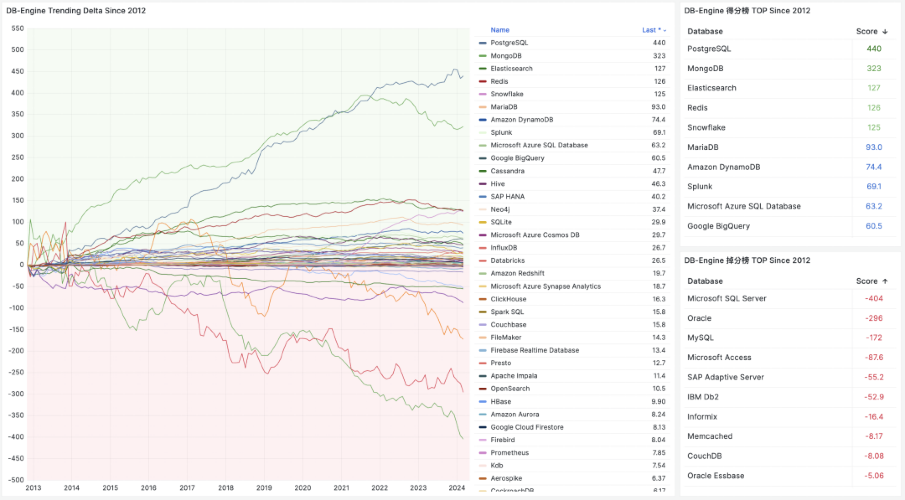
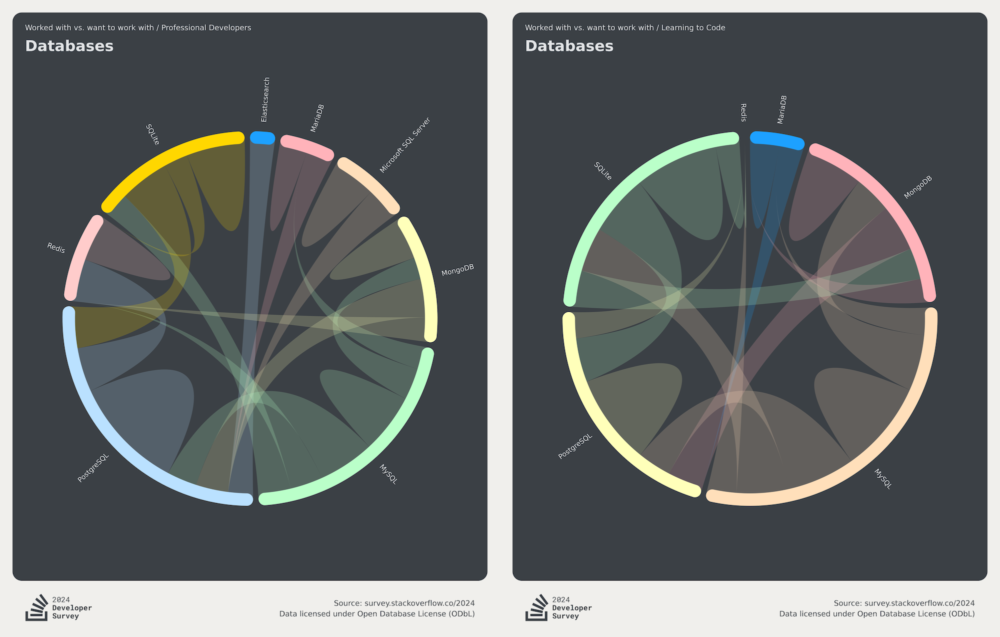

这两天 MongoDB 整的营销花活让人眼花缭乱：《[MongoDB向PostgreSQL宣战](https://mp.weixin.qq.com/s/ypV31fanKB6ZsFzuRYTwmQ)》，《[MongoDB 击败 PostgreSQL 赢下价值 300 亿美元项目](https://mp.weixin.qq.com/s/SJw6S6k82bxOq1pWP3kDfw)》，以及原文 The Register 的《[MongoDB在战胜强敌之后准备乱拳干翻 PostgreSQL](https://www.theregister.com/2024/08/30/mongodb_postgresql/)》，活生生一副要乱拳打死老师傅的架势。

有朋友得意洋洋的特意转给我想看 PG 的笑话，这着实让我感到无奈 —— **这么离谱的新闻都有人信！** 但事实是 —— **这么离谱的东西真就有人信！** 包括某些CEO也照样会中招翻车。诚如石破天祖师爷所说：“**永远不要低估好营销对烂产品的影响**”。

把东西卖给估值300亿的公司，和做 300 亿的项目完全是两码事。当然，这不能怪人家眼拙，这是 MongoDB **在营销上的一贯伎俩** —— 如果不仔细看原文，很难区分这个 300 亿指的是项目价值还是公司估值。

在当下，MongoDB 在产品和技术上乏善可陈；在正确性，性能，功能以及各种维度上被 PostgreSQL 按在地上摩擦；在开发者中的流行度与口碑，以及DB-Engine 热度都不断下滑，MongoDB 公司本身也不赚钱，股价也刚经过大腰斩，亏损继续扩大；“营销” 也许是 MongoDB 唯一能拿出手的东西了。

然而诚信是商业的根本，“好营销救不了烂芒果”，建立在谎言与忽悠之上的营销不会有好下场。今天我就来带大家看看，MongoDB 营销的锦绣丝绸被套里，填进去的都是些什么烂棉花。

---------

## 烂产品靠营销上位

图灵奖得主，数据库祖师爷 Stonebraker 老爷子在最近在 SIGMOD 2024 发表的名著级论文《[What goes around comes around... And Around](https://db.cs.cmu.edu/papers/2024/whatgoesaround-sigmodrec2024.pdf)》中对此有过精辟的评价：“绝对不要低估好营销对**烂产品**的影响 —— **比如 MySQL 与 MongoDB**”。

这个世界上有许多烂数据库 —— 但能用三寸不烂之舌把烂货成功吹成宝贝卖出去的，MongoDB 说自己是第一，MySQL 也只自认老二屈居人下。

在所有关于 MongoDB 大忽悠的故事中，最让人印象深刻的是 LinkedIn 上的这篇《[MongoDB 3.2 —— 现由 PostgreSQL 强力驱动](https://mp.weixin.qq.com/s/e3_32Neoy5RVRBSozsa_7A)》 。
这篇文章的精彩之处在于，它是由 MongoDB 合作伙伴发出的血泪控诉：MongoDB 无视了自己合作伙伴的忠言劝告，拿了一个 PostgreSQL 伪装成自己的分析引擎，并在发布会上忽悠用户。

作者作为 MongoDB 在分析领域的合作伙伴彻底灰心丧气，公开撰文发起控诉 —— “*MongoDB 的分析引擎是一个 PostgreSQL ，那你们真还不如直接去用 PostgreSQL*”。

像这样刻意造假忽悠的案例绝非个例，MongoDB 还在贬低同业产品自抬身价上有诸多记录。例如在官网文章《[从PostgreSQL迁移到MongoDB](https://www.mongodb.com/resources/compare/mongodb-postgresql/dsl-migrating-postgres-to-mongodb)》中，MongoDB 宣称自己是 “**可扩展灵活的新一代现代通用数据库**”，
而 PostgreSQL 是 “**复杂且容易出错的老旧单片关系数据库**”。完全无视了其实自己在整体的性能，功能，正确性，甚至自己标榜的应对大数据量的吞吐与可伸缩性上完全被 PostgreSQL 吊打的事实。

-----------

## 功能被PGSQL覆盖

JSON 文档确实是一个很受互联网应用开发者喜爱的特性。然而提供这一能力的数据库并非只有 MongoDB 。PostgreSQL 在十年前就已经提供了 SOTA 水平的 JSON 支持，并且仍然在不断演进改善。

PostgreSQL 的 JSON 支持是所有关系型数据库中最成熟与最早的（2012-2014），早于 SQL/JSON 标准或者说直接影响了 SQL/JSON 标准建立（2016）。
更重要的是，它的文档特性实现质量很高。相比之下 —— 同样在营销上号称支持 JSON 的MySQL，实际上是个简陋的 BLOB 换皮，[跟 9.0 向量类型有一拼](https://mp.weixin.qq.com/s/JgGCn9o2-DNPNqazPZXTtA)）。

数据库祖师爷 Stonebraker 表示过，带有可扩展类型的关系模型早已覆盖了数据库世界的各个角落，而 NoSQL 运动是数据库发展历史上的一段弯路：**关系模型是向下兼容文档模型的**。
文档模型跟几十年前范式化 vs 反范式化的大讨论实质是一样的 —— 1.只有有任何非一对多的关系，就会出现数据重复；2. 用预计算的JOIN未必比现场JOIN更快；3 数据没有独立性。
用户可以假设自己的应用场景是独立 KV 式缓存访问，但哪怕只要添加一个稍微复杂一点的功能，开发者就会面临几十年前就讨论过的数据重复困境。

PostgreSQL 在功能上是 MongoDB 的上位替代，所以可以对 MongoDB 的用例做到向下兼容 —— PostgreSQL 能做的MongoDB 做不了；而 MongoDB 能做的 PostgreSQL 也能做：你可以在PG中创建一个只有 `data JSONB` 列的表，然后使用各种 JSON 查询与索引来处理这里的数据；如果你确实觉得花几秒钟建表仍然是一个额外负担，那么在生态中还有各种各样基于 PostgreSQL 提供 MongoDB API，甚至 MongoDB 线缆协议的解决方案。

例如，FerretDB 项目通过中间件的方式在 PostgreSQL 集群上实现了 MongoDB 线缆协议兼容性 —— MongoDB 应用甚至都不需要更换客户端驱动，修改业务代码就能迁移到 PostgreSQL 上。
（另一被原位兼容的是 [SQL Server](https://mp.weixin.qq.com/s/c2TmMo0DflkSUli1BsLthQ) ）； PongoDB 则是直接在 NodeJS 客户端驱动侧将 PG 仿真成一个 MongoDB。
此外还有 `mongo_fdw`，可以让 PG 从 MongoDB 中用 SQL 读取数据，`wal2mongo` 将 PG 变更抽取为 BSON。

例如 [**FerretDB**](/pg/ferretdb) 项目通过中间件的方式在 PostgreSQL 集群上实现了 MongoDB 线缆协议兼容性 —— MongoDB 应用甚至都不需要更换客户端驱动，修改业务代码就能迁移到 PostgreSQL 上。（另一被原位线缆兼容的是 [**SQL Server** ](/pg/pg-replace-mssql)）；**PongoDB** 则是直接在 NodeJS 客户端驱动侧将 PG 仿真成一个 MongoDB。此外还有 `mongo_fdw`，可以让 PG 从 MongoDB 中用 SQL 读取数据，`wal2mongo` 将 PG 变更抽取为 BSON。

在易用性上，各家云厂商都推出了开箱即用的 PG RDS 服务，想要开源自建也有 [**Pigsty**](https://pigsty.cc/zh/) 这样开箱即用的解决方案，还有 Serverless 的 Neon 更是让PG上手门槛低到一行命令就能直接用起来。 

此外，相比于 MongoDB 使用的 SSPL 协议（已经不再是一个开源协议了），PostgreSQL 使用的类 BSD 开源协议显然要友善的多，PG可以在不需要软件授权费的情况下，提供更好的上位功能替代 —— Do more pay less! 不赢都难。

-----------

## 正确性与性能被吊打

对于数据库来说，**正确性至关重要** —— 中立的分布式事务测试框架 JEPSEN 对 MongoDB 的正确性做过评测：结果可以用 “**一塌糊涂**”形容（BTW：另一个难兄难弟是 [**MySQL**](/db/bad-mysql)）。

当然，MongoDB 的强项就是面不改色心不跳的 “忽悠“，尽管 JEPSEN 提了这么多的问题，在 MongoDB 官网上，关于 Jespen 的评测是这么介绍的：”*到目前为止，因果一致性通常仅限于研究项目......MongoDB 是我们所知的第一个提供实现的商业数据库之一*“

这个例子再次体现了 MongoDB 在营销上的脸皮 —— 用一种极其精致的语言艺术，从一大坨 Bullshit 中精心挑选出了一颗未消化的花生米，而一笔带过在正确性/一致性上的各种致命硬伤。

-------

另一个有趣的点是**性能**。作为一个专用的文档数据库，**性能** 应当是其相对于通用数据库的杀手级特性。

先前有一篇《《[从 MongoDB 到 PostgreSQL 的大迁移](https://mp.weixin.qq.com/s/V4V5eTWEb02NBIO5kfZt7A)》引发了 MongoDB 用户的关注，我的用户群里有位朋友 @flyingcrp 问了这样一个问题 —— 为什么PG上的一个插件或者功能点就能顶得上别人一个完整的产品？

当然也不乏持相反观点的朋友 —— PG的 JSON 性能肯定比不过细分领域的专业产品 —— 一个专用数据库如果连性能都干不过通用数据库，那还活个什么劲儿？

这个讨论引起了我的兴趣，这些命题成立吗？于是，我做了一些简单的检索与研究，结果发现了一些非常有趣且震惊的结论：例如，在 MongoDB 的看家本领 —— JSON 存储与检索性能上，PostgreSQL 已经吊打 MongoDB 了。

来自 ONGRES 与 EDB 的一份 [PG vs Mongo 性能对比评测报告](https://info.enterprisedb.com/rs/069-ALB-339/images/PostgreSQL_MongoDB_Benchmark-WhitepaperFinal.pdf)  详细对比了两者在 OLTP / OLAP 上的性能，结果一目了然。

另一份更近一点的[性能对比](https://medium.com/@yurexus/can-postgresql-with-its-jsonb-column-type-replace-mongodb-30dc7feffaf3) 着重测试了 JSONB / GIN 索引下的表现对比，得出的结论也是：PostgreSQL JSONB 列是 MongoDB 的替代。

在当下，[**单机 PostgreSQL 性能**](/pg/pg-performence) 可以轻松 Scale 到几十TB ～ 几百TB数量级，支撑几十万的点写入 QPS 与几百万的点查询 QPS。只用 PostgreSQL 支撑业务到百万日活 / 百万美元营收甚至直接 IPO 都毫无问题。

老实说，MongoDB 的性能已经完全跟不上时代了，而它引以为傲的“内置分片”可伸缩性，[**在软件架构与性能突飞猛进**](/pg/pg-scalability)，[**硬件遵循摩尔定律指数发展**](/cloud/bonus/) 的当下显得毫无意义。

--------

## 流行度热度在衰退

如果我们观察 DB-Engine 热度分数，不难看出过去十年中，拥有最大增长的两个数据库就是 PostgreSQL 与 MongoDB 。可以说这两者是移动互联网时代中数据领域的最大赢家。

但它们的区别在于，PostgreSQL 仍然在继续增长，甚至已经在 StackOverflow 全球开发者调研中，连续三年成为 [**最流行的数据库**](/pg/pg-in-2024) 并势头不减赢麻了。而 MongoDB 在 2021 年开始就掉头向下开始过气。使用率，口碑，需求度都出现了停滞或扭头向下的发展趋势：

在 StackOverflow 年度全球开发者调研中，提供了主要的数据库用户的转移关系图。不难看出，MongoDB 用户的最大流出项就是 PostgreSQL。而会去使用 MongoDB 的往往是 MySQL 用户。

MongoDB 和 MySQL 属于那种典型的 “面向初学者” 的数据库，针对小白做了许多无底线讨好性的妥协设计 —— 从统计中不难看出它们在新手中的使用率比专业开发者中更高。
与之相反的则是 PostgreSQL，在专业开发者中的使用比例要比新手中高得多。

任何开发者都会经历初学者状态，我最初也是从 MySQL / Mongo 开始与数据库打交道的，但很多人就止步于此，而有追求的工程师则会不断学习进步，提升自己的品味与技术鉴别力，使用更好用、更强大的技术来更新自己的武器库。

而趋势是：越来越多的用户在提升的过程中，从 MongoDB 和 MySQL 迁移到了上位替代 PostgreSQL 中。从而成就了新一代世界上最流行的数据库 —— PostgreSQL。

--------

## 风评已然臭不可闻

许多使用过 MongoDB 的开发者都对其留下了极其恶劣的印象，包括我自己。我上一次和 MongoDB 打交道是在 2016 年。我们部门先前用 MongoDB 搭建了一套实时统计平台，存放全网应用下载/安装/启动计数器，几 TB 规模的数据。我负责把这套在线业务的 MongoDB 迁移到 PostgreSQL。

在这个过程中，我对 MongoDB 留下了**糟糕的印象** —— 我花费了很多时间清洗 MongoDB 中模式错乱的垃圾数据。包括一些匪夷所思的问题（比如 Collection 里有整本的小说，SQL 注入的脚本，非法的零字符、Unicode码位与Surrogate Pair，各种花里胡哨的模式），堪称是一个史诗级的垃圾箱。

在这个过程中，我也深入研究了 MongoDB 的查询语言，并将其翻译为标准 SQL。我甚至使用 Multicorn 写了一个 MongoDB 的外部数据源包装器 FDW 来做到这一点，顺便还水了篇 [关于 Mongo/HBase FDW 的论文](https://vonng.com/pdf/unified_access_layer_with_postgresql_fdw.pdf)。（比较巧的是，我那时候确实不知道 —— MongoDB 官方竟然也是这么用FDW干分析的！）

总体来说，在这趟深度使用与迁移过程中，我对 MongoDB 感到非常失望，感觉到自己的时间被毫无意义的东西给浪费掉了。
当然后来我也发现，并不是只有我一个人有这种感受，在 HN 和 Reddit 上有无数关于 MongoDB 的嘲讽与吐槽：

- [告别 MongoDB。迎接 PostgreSQL](http://developer.olery.com/blog/goodbye-mongodb-hello-postgresql/)
- [Postgres 性能优于 MongoDB，并引领开发者新现实](http://www.enterprisedb.com/postgres-plus-edb-blog/marc-linster/postgres-outperforms-mongodb-and-ushers-new-developer-reality)
- [MongoDB 已死。PostgreSQL 万岁 :)](https://github.com/errbit/errbit/issues/614)
- [你永远不应该使用 MongoDB 的理由](http://www.sarahmei.com/blog/2013/11/11/why-you-should-never-use-mongodb/)
- [SQL vs NoSQL 决斗。Postgres vs Mongo](https://www.airpair.com/postgresql/posts/sql-vs-nosql-ko-postgres-vs-mongo)
- [为什么我放弃了 MongoDB](http://svs.io/post/31724990463/why-i-migrated-away-from-mongodb)
- [为什么你永远永远永远不该使用 MongoDB](http://cryto.net/~joepie91/blog/2015/07/19/why-you-should-never-ever-ever-use-mongodb/)
- [Postgres NoSQL 比 MongoDB 更好吗？](http://www.aptuz.com/blog/is-postgres-nosql-database-better-than-mongodb/)
- [再见 MongoDB。你好 PostgreSQL](https://www.userlike.com/en/blog/2015/10/09/bye-by-mysql-and-mongodb-guten-tag-postgresql)

--------

**关于这篇《MongoDB挑战PG》的新闻，HN评论区是这样的：**

--------

**关于 MongoDB，Reddit 里的评论是这样的：**

--------

**能让开发者专门抽出时间写文章来骂它，MongoDB 的恶劣营销功不可没：**

--------

能让合作伙伴[破口大骂，吹哨揭发](https://mp.weixin.qq.com/s/e3_32Neoy5RVRBSozsa_7A)，我看 MongoDB 也是独此一家：

--------

## MongoDB没有未来

Stonebraker 表示过，带有可扩展类型的关系模型早已覆盖了数据库世界的各个角落，而 NoSQL 运动是数据库发展历史上的一段弯路。
《种瓜得瓜》一文认为未来文档数据库的发展趋势是向关系数据库靠拢，重新把自己当初“鄙视”的 SQL / ACID 给加回来，以弥补自己与 RDBMS 的智力差距，最终趋同于 RDBMS 。

但是问题就来了，如果这些文档数据库最终还是要变成关系数据库，那么为什么不直接用 PostgreSQL 关系数据库呢？难道用户可以指望 MongoDB 这孤家寡人的一家商业数据库公司，能够在这个赛道赶上整个 PostgreSQL 开源生态？—— 这个生态可是包含了几乎所有软件/云/科技巨头在内 —— **能战胜一个生态的，只有另一个生态**。

在 MongoDB 不断重新发明 RDBMS 世界的各种轮子，拙劣地跟在 PG 后面亦步亦趋补课，又同时把 PG 描述为 “复杂且容易出错旧的单片关系数据库” 时。PostgreSQL 已经成长为一个超出 MongoDB 想象的多模态超融合数据库，它已经通过几百个扩展插件成为[**数据库领域的全能王霸主**](/pg/pg-eat-db-world)。JSON 仅仅是其武库中的冰山一角，还有 XML，全文检索，向量嵌入，AIML，地理信息，时序数据，分布式，消息队列，FDW，以及二十多种存储过程语言支持。

使用 PostgreSQL ，你可以做到许多超出想象的事情：你可以在数据库内发 HTTP 请求，用XPATH 解析，用 Cron 插件调度写爬虫，原地入库后用机器学习扩展分析，调用大模型创建向量Embedding 用图扩展构建知识图谱，用包括JS在内的二十多种语言编写存储过程，并在库内拉起 HTTP 服务器对外 Serve。这种匪夷所思的能力是 MongoDB 以及其他“纯”关系型数据库难望其项背的。

MongoDB 根本没有与 PostgreSQL 在产品、技术上堂堂正正一战的能力，因此只能在营销上使阴招，暗搓搓的下绊子，但这种做法只会让更多人看清它的真面目。

作为一个上市公司，MongoDB 的股价也已经经历了一次大腰斩，而且亏损持续扩大。产品与技术上的落后，以及运营上的不诚信，都让人怀疑它的未来。

我认为任何开发者，创业者，投资人都不应该把赌注押在 MongoDB 上 
—— **这确实是一个没有希望，也没有未来的数据库**。

