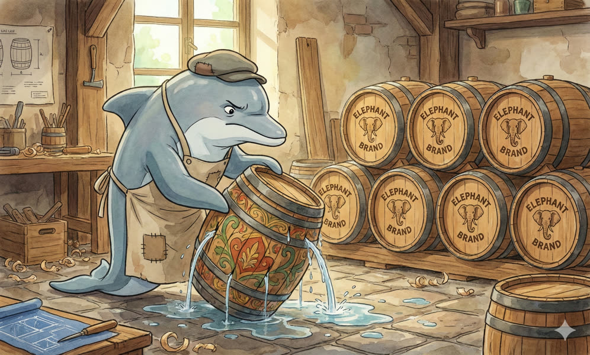
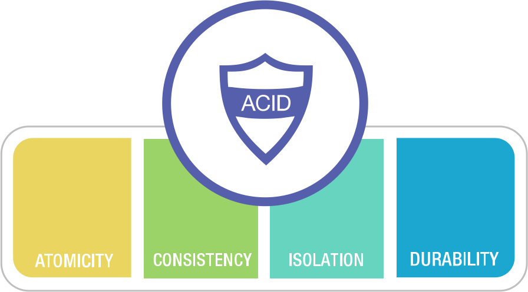
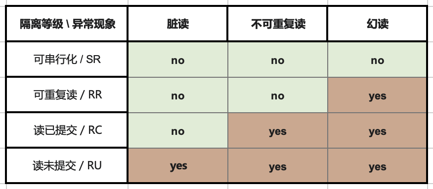
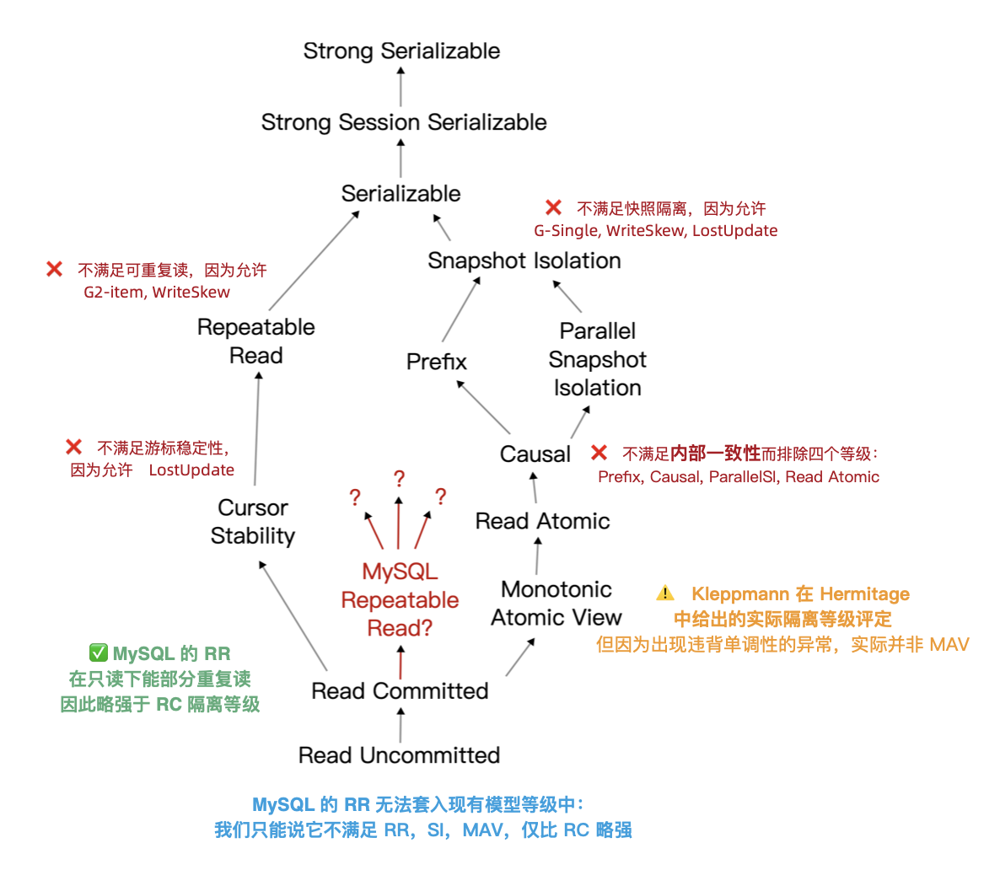
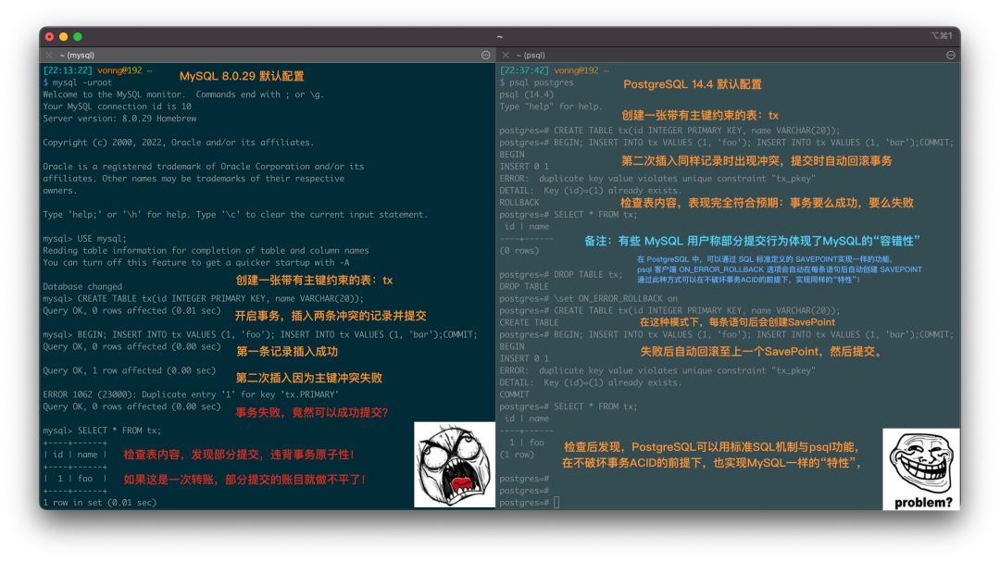
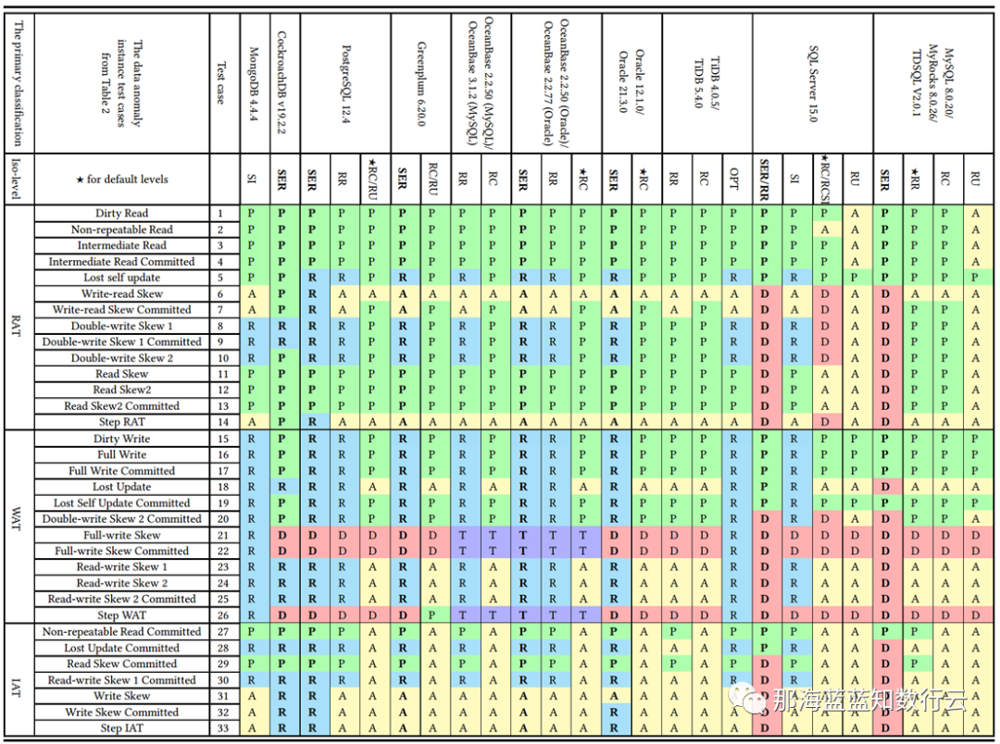
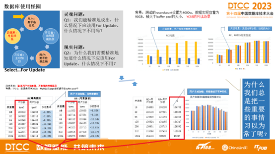
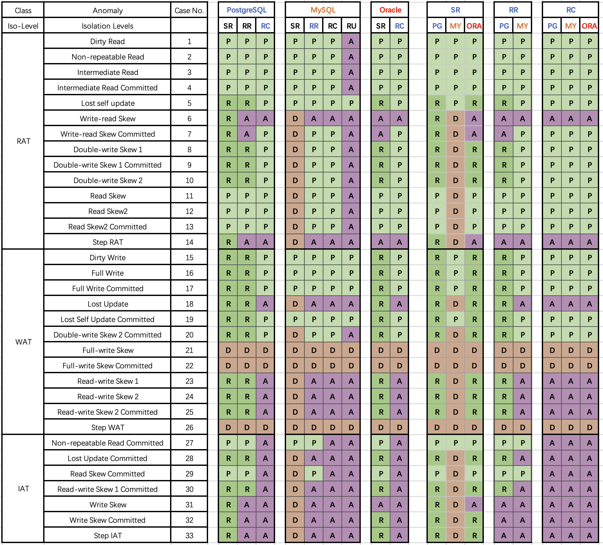
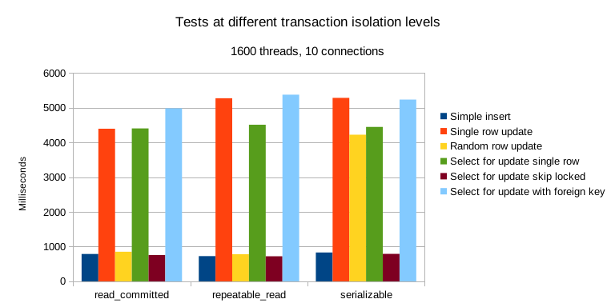
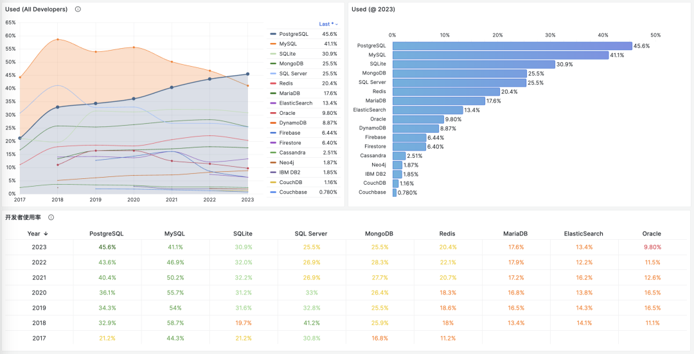

MySQL **was once** the world's most popular open-source relational database. However, popularity doesn't mean advanced, and popular things can have big problems. [JEPSEN's](https://jepsen.io/analyses/mysql-8.0.34) evaluation of MySQL's isolation levels pierced through this veneer — in **correctness**, the basic attribute any respectable database product must have, MySQL's performance is a complete mess.

MySQL documentation claims to implement **Repeatable Read/RR** isolation level, but the actual correctness guarantees provided are much weaker. JEPSEN, building on Hermitage research, further pointed out that MySQL's Repeatable Read/RR isolation level doesn't actually provide repeatable reads, and isn't even **atomic** or **monotonic**, failing to meet even the basic **Monotonic Atomic View/MAV** standard.

Furthermore, MySQL's **Serializable/SR** isolation level that can "avoid" these anomalies is difficult to use in production and isn't the best practice recognized by official documentation and community; moreover, under AWS RDS default configuration, MySQL SR doesn't truly meet "serializable" requirements; Professor Li Haixiang's analysis of MySQL consistency further points out SR's design flaws and problems.

In summary, **MySQL's ACID has flaws and doesn't match documentation promises** — this may lead to serious correctness issues. Although such problems can be avoided through explicit locking and other methods, users should indeed be fully aware of the trade-offs and risks here: when choosing MySQL for scenarios requiring correctness/consistency, please exercise extreme caution.


- [Why is correctness important?](#why-is-correctness-important)
- [What do Hermitage's results say?](#what-do-hermitages-results-say)
- [What new discoveries does JEPSEN have?](#what-new-discoveries-does-jepsen-have)
- [Isolation problems: Non-repeatable reads](#isolation-problems-non-repeatable-reads)
- [Atomicity problems: Non-monotonic views](#atomicity-problems-non-monotonic-views)
- [Serializability problems: Useless and terrible](#serializability-problems-useless-and-terrible)
- [Correctness vs performance trade-offs](#correctness-vs-performance-trade-offs)
- [References](#references)

[](https://mp.weixin.qq.com/s/gQZ3Q5JKV8gaBNhc1puPcA)

--------------------

## Why is correctness important?

Reliable systems need to handle various errors. In the harsh reality of data systems, many things can go wrong. Ensuring data isn't lost or corrupted and implementing reliable data processing is enormously challenging and error-prone work. The emergence of **transactions** solved this problem. Transactions are one of the greatest abstractions in data processing and the golden badge and dignity that relational databases take pride in.

The transaction abstraction reduces all possible outcomes to two situations: **either succeed and COMMIT, or fail and ROLLBACK**. With this safety net, programmers no longer need to worry about crashes during data processing, leaving behind the horrific accident scene of destroyed data consistency. Application error handling becomes much simpler because it no longer needs to worry about partial failure situations. The guarantees it provides are summarized by the four-letter acronym **ACID**.



Transaction **Atomicity/A** lets you abort transactions anytime before commit and discard all writes. Correspondingly, transaction **Durability/D** promises that once a transaction successfully commits, any written data won't be lost even if hardware failures or database crashes occur. Transaction **Isolation/I** ensures each transaction can pretend it's the only one running on the entire database — the database ensures that when multiple transactions are committed, the result is the same as if they ran serially one after another, even though they may actually run concurrently. Atomicity and Isolation serve **Consistency** — which is application **Correctness** — the C in ACID is an application property, not a transaction property itself, included to complete the acronym.

However, in engineering practice, complete **Isolation/I** is rare — users rarely use so-called "**Serializable/SR**" isolation levels because they have considerable performance costs. Some popular databases like Oracle don't even implement it — Oracle has an isolation level called "serializable," but it actually implements something called **snapshot isolation**, **which provides weaker guarantees than serializability**.



RDBMS allow different **isolation levels**, letting users trade off between **performance** and **correctness**. ANSI SQL92 used three **concurrent anomalies** to define four different **isolation levels**, standardizing this trade-off (poorly). Weaker isolation levels "theoretically" provide better performance but also allow more types of **concurrent anomalies**, affecting application correctness.

To ensure correctness, users can use additional concurrency control mechanisms like explicit locking or SELECT FOR UPDATE, but this introduces additional complexity and affects system simplicity. For financial scenarios, correctness is extremely important — accounting errors and reconciliation mismatches can have serious real-world consequences; however, for rough-and-ready internet scenarios, a few data errors may be acceptable — correctness priority usually yields to performance.
This laid the groundwork for **MySQL's** correctness problems as it rode the internet boom.


--------------------

## What do Hermitage's results say?

Before introducing JEPSEN's research, let's review the [Hermitage](https://github.com/ept/hermitage) project. This is a project initiated by Martin Kleppmann, author of the internet classic "DDIA," in **2014**, aimed at evaluating the **correctness** of various mainstream relational databases. The project designed a series of concurrent transaction scenarios to assess the actual level of databases' claimed isolation levels.


From Hermitage's evaluation results table, it's clear there are two flaws in mainstream database isolation level implementations, marked with red circles: Oracle's **Serializable/SR** is considered actually "**Snapshot Isolation/SI**" because it cannot avoid G2 anomalies.

MySQL's problems are more significant: because the default **Repeatable Read/RR** isolation level cannot avoid PMP/G-Single anomalies, Hermitage rated its actual level as **Monotonic Atomic View/MAV**.



It should be noted that ANSI SQL 92 isolation levels are a poor, crude, and widely criticized standard that only defined three anomaly phenomena and used them to distinguish four isolation levels — but there are actually many more anomaly types/isolation levels. The famous paper "A Critique of ANSI SQL Isolation Levels" proposed corrections and introduced several important new isolation levels, giving their strength relationship partial order diagram (left figure).

Under the new model, many databases' "**Read Committed/RC**" and "**Repeatable Read/RR**" are actually the more practical "**Monotonic Atomic View/MAV**" and "**Snapshot Isolation/SI**". But MySQL is indeed unique: in Hermitage's evaluation, MySQL's **Repeatable Read/RR** is far from **Snapshot Isolation/SI**, doesn't meet ANSI 92 **Repeatable Read/RR** standards, with actual level being **Monotonic Atomic View/MAV**. JEPSEN's research further pointed out that MySQL **Repeatable Read/RR** doesn't even meet **Monotonic Atomic View/MAV**, being only slightly stronger than **Read Committed/RC**.


--------------------

## What new discoveries does JEPSEN have?

JEPSEN is the most authoritative testing framework in the distributed systems field. They recently released research and evaluation for MySQL's latest version 8.0.34. Readers are recommended to [read the original text](https://jepsen.io/analyses/mysql-8.0.34) directly. Here's the paper abstract:

> MySQL is a popular relational database. We revisited the results of the [Hermitage](https://github.com/ept/hermitage) project initiated by Kleppmann (DDIA author) in 2014 and confirmed that MySQL's **Repeatable Read/RR** isolation level still exhibits G2-item, G-single, and lost update anomalies. Using the transaction consistency checking component Elle, we found that MySQL's repeatable read isolation level also violates internal consistency. More seriously — it violates Monotonic Atomic View (MAV): a transaction can first observe another transaction's results, then attempt to observe again but cannot reproduce the same results. As a bonus, we also found that AWS RDS's MySQL clusters frequently exhibit anomalies that violate serial requirements. This research was conducted independently, without compensation, and follows [Jepsen research ethics](https://jepsen.io/ethics).

MySQL 8.0.34's **RU**, **RC**, **SR** isolation levels comply with ANSI standard descriptions. And **Durability/D** under default configuration (RR, and `innodb_flush_log_at_trx_commit = on`) has no problems. The problem lies in MySQL's default **Repeatable Read/RR** isolation level:

1. Doesn't meet ANSI SQL92 repeatable read (G2, WriteSkew)
2. Doesn't meet snapshot isolation (G-single, ReadSkew, LostUpdate)
3. Doesn't meet cursor stability (LostUpdate)
4. **Violates internal consistency** (Hermitage disclosure)
5. **Violates read monotonicity** (JEPSEN new disclosure)


MySQL RR transactions observed phenomena violating internal consistency, monotonicity, and atomicity. This adjusted its rating to an undefined isolation level only slightly higher than RC.

In JEPSEN's tests, six anomalies were disclosed total. Since problems known from 2014 are skipped, we focus on JEPSEN's newly discovered anomalies. Here are several specific examples.


--------------------

## Isolation problems: Non-repeatable reads

In this test case (JEPSEN 2.3), a simple table `people` is used with `id` as primary key, pre-filled with one row of data.

```sql
CREATE TABLE people (
  id     int PRIMARY KEY,
  name   text not null,
  gender text not null
);
INSERT INTO people (id, name, gender) VALUES (0, "moss", "enby");
```

Then concurrently run a series of write transactions — each transaction first reads the `name` field of this row; then updates the `gender` field, immediately reading the `name` field again. Correct repeatable read means that in this transaction, the two reads of `name` should return consistent results.

```sql
SET TRANSACTION ISOLATION LEVEL REPEATABLE READ;
START TRANSACTION;                     -- Start RR transaction
SELECT name FROM people WHERE id = 0;  -- Result is "pebble"
UPDATE people SET gender = "femme" WHERE id = 0; -- Random update
SELECT name FROM people WHERE id = 0;  -- Result is "moss"
COMMIT;
```

But in test results, 126 out of 9048 transactions showed **internal consistency errors** — despite running at repeatable read isolation level, the actual names read still changed. This behavior contradicts MySQL's [isolation level documentation](https://dev.mysql.com/doc/refman/8.0/en/innodb-transaction-isolation-levels.html#isolevel_repeatable-read), which states: "Consistent reads within the same transaction read the snapshot established by the first read." It contradicts MySQL's [consistent read documentation](https://dev.mysql.com/doc/refman/8.0/en/innodb-consistent-read.html), which specifically states that "InnoDB assigns a point in time at a transaction's first read, and effects of concurrent transactions should not appear in subsequent reads."

ANSI/Adya repeatable read essentially means: once a transaction observes a value, it can count on that value staying stable for the rest of the transaction. MySQL is the opposite: **write requests are invitations for another transaction to sneak in and break the state the user just read**. Such isolation design and behavior is incredibly stupid. But there are even more outrageous things — like **monotonicity** and **atomicity** problems.


--------------------

## Atomicity problems: Non-monotonic views

Kleppmann rated MySQL repeatable read as [Monotonic Atomic View/MAV](https://jepsen.io/consistency/models/monotonic-atomic-view) in Hermitage. According to [Bailis et al.](https://amplab.cs.berkeley.edu/wp-content/uploads/2013/10/hat-vldb2014.pdf) definition, monotonic atomic view ensures that once transaction *T2* observes any result from transaction *T1*, *T2* observes all results from *T1*.

If MySQL's RR just re-acquires a snapshot each time it executes a write query, it could still provide MAV-level isolation guarantees if snapshots are monotonic — this is exactly how PostgreSQL's **Read Committed/RC** isolation level works.

However, in regular MySQL single-node deployments, this isn't the case: MySQL frequently violates monotonic atomic view at RR isolation level. JEPSEN's example (2.4) illustrates this: there's a `mav` table pre-filled with two records (`id=0,1`), with `value` field initially set to `0`.

```sql
CREATE TABLE mav (
  id      int PRIMARY KEY,
  `value` int not null,
  noop    int not null
);
INSERT INTO mav (id, `value`, noop) VALUES (0, 0, 0);
INSERT INTO mav (id, `value`, noop) VALUES (1, 0, 0);
```

The workload is mixed read-write transactions: write transactions increment the `value` field of both records in the same transaction; according to transaction atomicity, other transactions observing these two records should see `value` values growing in synchronized lockstep.

```sql
START TRANSACTION;
SELECT value FROM mav WHERE id = 0;    --> 0 Read 0
update mav SET noop = 73 WHERE id = 1; --> "Invite" new snapshot
SELECT value FROM mav WHERE id = 1;    --> 1 Read new value 1, so the other row should also be 1
SELECT value FROM mav WHERE id = 0;    --> 0 Read old value 0
COMMIT;
```

However, from this read transaction's perspective, it observed an "intermediate state." The read transaction first reads record 0's `value`, then sets record 1's `noop` to a random value (according to the previous case, it can see other transactions' changes), then reads records 0/1's `value` values sequentially. The result: reading record 0 got the new value, reading record 1 got the old value, meaning both **monotonicity** and **atomicity** have serious flaws.

MySQL's [consistent read documentation](https://dev.mysql.com/doc/refman/8.0/en/innodb-consistent-read.html) extensively discusses snapshots, but this behavior **doesn't look like snapshots at all**. Snapshot systems typically provide consistent, point-in-time views of database state. They're usually atomic: either containing all of a transaction's results or none at all. Even if MySQL somehow got a **non-atomic snapshot** from the write transaction's **intermediate state**, it should have seen row 0's new value before getting row 1's new value. However, this isn't the case: this read transaction observed row 1's changes but didn't see row 0's change results. **What kind of snapshot is this**?

Therefore, MySQL's Repeatable Read/RR isolation level is neither atomic nor monotonic. It's even worse than most databases' **Read Committed/RC**, which are essentially atomic and monotonic **Monotonic Atomic View/MAV**.


Another noteworthy issue: MySQL's default configuration transactions exhibit phenomena violating **atomicity**. I raised this issue for industry discussion in [an article two years ago](https://mp.weixin.qq.com/s/KBypNeeM4puvzGiKFJ1FmQ). The MySQL community's view is that this is a configurable feature through `sql_mode`, not a flaw.

But this argument can't change the fact: MySQL indeed violates the principle of least surprise, allowing users to do such atomicity-violating stupid things under default configuration. Similarly, there's the `replica_preserve_commit_order` parameter.




--------------------

## Serializability problems: Useless and terrible

Can **Serializable/SR** prevent the above concurrent anomalies? Theoretically yes, serializability is designed for this purpose. But disturbingly, JEPSEN observed that MySQL at **Serializable/SR** isolation level also exhibited "Fractured Read-Like" anomalies in AWS RDS clusters — a G2 anomaly example. This anomaly is prohibited by **RR** and should only appear at **RC** or lower levels.

Deep investigation found this phenomenon relates to MySQL's [`replica_preserve_commit_order`](https://dev.mysql.com/doc/refman/8.0/en/replication-options-replica.html#sysvar_replica_preserve_commit_order) parameter: disabling this parameter allows MySQL to provide higher parallelism during log replay at the cost of correctness. When this option is disabled, JEPSEN also observed similar G-Single and G2-Item anomalies at local cluster SR isolation level.

Serializable systems should guarantee transactions appear to execute in total order — not preserving this order on replicas is terrible. This parameter was previously disabled by default (8.0.26 and below) but changed to enabled by default in MySQL 8.0.27 (2021-10-19). However, AWS RDS cluster parameter groups still use the old default value "OFF" and lack relevant documentation, causing such phenomena.

Although this anomalous behavior can be avoided by enabling this parameter, using Serializable itself isn't behavior encouraged by MySQL officials/community. The prevailing view in the MySQL community is: avoid using **Serializable/SR** isolation level unless absolutely necessary; MySQL documentation states: *"`SERIALIZABLE` enforces stricter rules than `REPEATABLE READ`, mainly used for **special situations** like XA transactions and solving concurrency and deadlock problems."*

Similarly, Professor Li Haixiang (former Tencent T14), who specializes in database consistency research, evaluated actual isolation levels of various databases including MySQL (InnoDB/8.0.20) in his "Third Generation Distributed Database" series, providing the more detailed "**[Consistency Eight Immortals Diagram](https://mp.weixin.qq.com/s/_BhAjcMkmthTf8Zw3RWKDw)**" from another perspective.



In the diagram, blue/green represents correctly using rules/rollback to avoid anomalies; **yellow A represents anomalies occurring, more yellow "A"s mean more correctness problems**; red "D" indicates using performance-affecting deadlock detection to handle anomalies, **more red Ds mean more serious performance problems**.

Clearly, PostgreSQL SR and CockroachDB SR built on it have the best correctness, followed by Oracle SR; they mainly avoid concurrent anomalies through mechanisms and rules; while MySQL's correctness level is unbearable to look at.

Professor Li Haixiang detailed this analysis in his special article "[The Utterly Useless MySQL](https://mp.weixin.qq.com/s/__mnrLBN88RPgpET0kq3vg)": although MySQL's **Serializable/SR** can ensure correctness through extensive use of deadlock detection algorithms, handling concurrent anomalies this way seriously affects database **performance and practical value**.


--------------------

## Correctness vs performance trade-offs

Professor Li Haixiang posed a question in "[Third Generation Distributed Database: The Kicking Era](https://mp.weixin.qq.com/s/zz_184uqiSXQ1nSYENGuxg)": **How to trade off system correctness and performance?**

There are some "habitual" strange circles in the database community. For example, many databases' default isolation level is **Read Committed/RC**, and many people say "setting database isolation level to **RC** is sufficient"! But why? Why set to RC? Because they think RC level provides better database performance.

As shown below, there's a vicious cycle: users want better database performance, so developers set application isolation level to RC. However, users, especially those in finance, insurance, securities, telecom industries, expect data correctness guarantees, so developers have to add `SELECT FOR UPDATE` locking in SQL statements to ensure data correctness. This causes serious database system performance degradation. Test results in TPC-C and YCSB scenarios show that user-initiated locking causes serious database system performance degradation, while strong isolation level performance loss isn't that severe.



Using weak isolation levels seriously deviates from the original intent of the "transaction" abstraction — **writing reliable transactions in important databases with lower isolation levels is extremely complex**, and the number and impact of errors related to weak isolation levels are widely underestimated[13]. Using weak isolation levels essentially **kicks** the correctness & performance responsibility that should be guaranteed by the database to application developers.

The root of habitually using weak isolation levels might be with Oracle and MySQL. For example, Oracle never provided true serializable isolation level (SR is actually **Snapshot Isolation/SI**), even today. So they had to promote *"**using RC isolation level**"* as a good thing. Oracle was one of the most popular databases in the past, so later followers copied this approach.



The stereotype that weak isolation levels perform better might come from MySQL — SR implemented with extensive **deadlock detection** (marked red) indeed performs poorly. **But this isn't necessarily true for other DBMS**. For example, PostgreSQL's **Serializable Snapshot Isolation (SSI)** algorithm introduced in 9.1 can provide complete serializability with [little performance loss](https://lchsk.com/benchmarking-concurrent-operations-in-postgresql) compared to **Snapshot Isolation/SI**.



Furthermore, [hardware performance improvements and price collapses under Moore's Law](https://mp.weixin.qq.com/s/1OSRcBfd58s0tgZTUZHB9g) make OLTP performance no longer scarce — in the current era where [a single server can run Twitter](https://thume.ca/2023/01/02/one-machine-twitter/), abundant hardware performance really doesn't cost much. Compared to potential losses and mental burden from data errors, worrying about performance losses from serializable isolation levels is indeed unnecessary worry.

Times have changed, and software/hardware progress makes "**default serializable isolation, prioritizing 100% correctness**" practically feasible. Trading correctness for slight performance gains is becoming inappropriate even for rough-and-ready internet scenarios. New generation distributed databases like CockroachDB and FoundationDB all chose to use **Serializable** isolation level by default.

**Doing the right thing is important, and correctness shouldn't be subject to trade-offs**. On this point, the two open-source relational database giants MySQL and PostgreSQL chose completely opposite paths in early implementation: MySQL pursued performance while sacrificing correctness; while academic PostgreSQL pursued correctness while sacrificing performance. In the first half of the internet boom, MySQL took the lead with performance advantages. But when performance is no longer the core consideration, correctness becomes MySQL's **fatal bleeding point**.

There are many ways to solve performance problems — even waiting for exponential hardware performance growth is a practical approach (like PayPal); while correctness problems often involve global architectural reconstruction and can't be solved overnight. Over the past decade, PostgreSQL stayed true while innovating, making great strides while ensuring best correctness. [Many scenarios now outperform MySQL](https://mp.weixin.qq.com/s/651zXDKGwFy8i0Owrmm-Xg); functionally, it [comprehensively crushes MySQL](https://mp.weixin.qq.com/s/y3qY9eBfOic6tQYOiErIHg) through ecosystem-introduced vector, JSON, GIS, time-series, full-text search extensions.



In StackOverflow's 2023 global developer survey, PostgreSQL's developer usage rate officially surpassed MySQL, becoming [the world's most popular database](https://mp.weixin.qq.com/s/xewE87WEaZHp-K5hjuk65A). MySQL, with its terrible correctness and difficulty achieving high performance, should seriously consider its breakthrough path.


------

## References

`[1]` JEPSEN: *https://jepsen.io/analyses/mysql-8.0.34*

`[2]` Hermitage: *https://github.com/ept/hermitage*

`[4]` Jepsen Research Ethics: *https://jepsen.io/ethics*

`[5]` `innodb_flush_log_at_trx_commit`: *https://dev.mysql.com/doc/refman/8.0/en/innodb-parameters.html#sysvar_innodb_flush_log_at_trx_commit*

`[6]` Isolation Level Documentation: *https://dev.mysql.com/doc/refman/8.0/en/innodb-transaction-isolation-levels.html#isolevel_repeatable-read*

`[7]` Consistent Read Documentation: *https://dev.mysql.com/doc/refman/8.0/en/innodb-consistent-read.html*

`[9]` Monotonic Atomic View/MAV: *https://jepsen.io/consistency/models/monotonic-atomic-view*

`[10]` Highly Available Transactions: Virtues and Limitations, Bailis et al.: *https://amplab.cs.berkeley.edu/wp-content/uploads/2013/10/hat-vldb2014.pdf*

`[12]` `replica_preserve_commit_order`: *https://dev.mysql.com/doc/refman/8.0/en/replication-options-replica.html#sysvar_replica_preserve_commit_order*

`[13]` Number and impact of errors related to weak isolation levels widely underestimated: *https://dl.acm.org/doi/10.1145/3035918.3064037*

`[14]` Testing PostgreSQL concurrency performance: *https://lchsk.com/benchmarking-concurrent-operations-in-postgresql*

`[15]` Running Twitter on a single server: *https://thume.ca/2023/01/02/one-machine-twitter/*