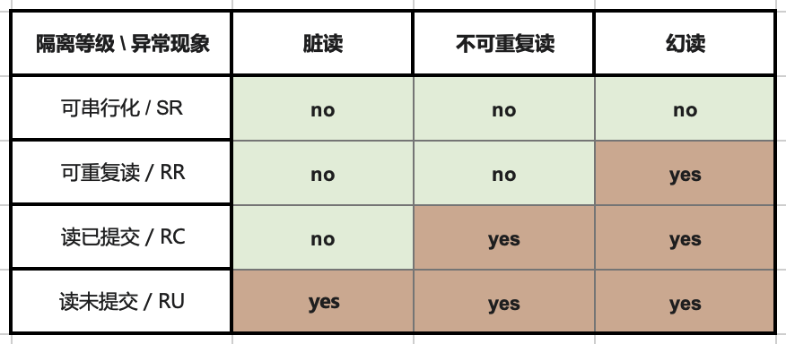
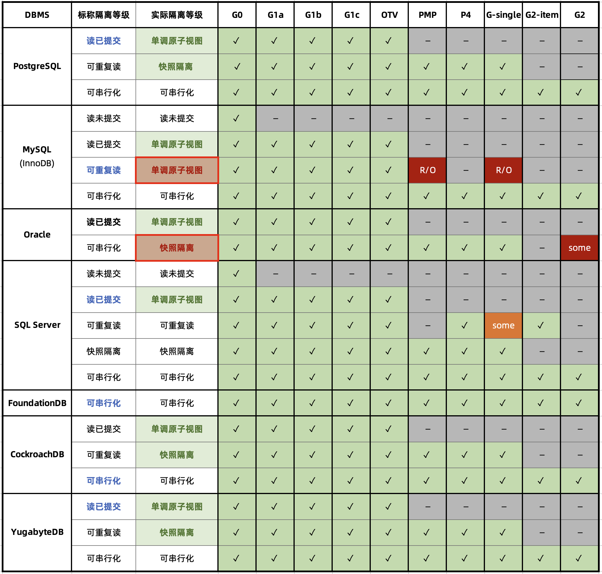
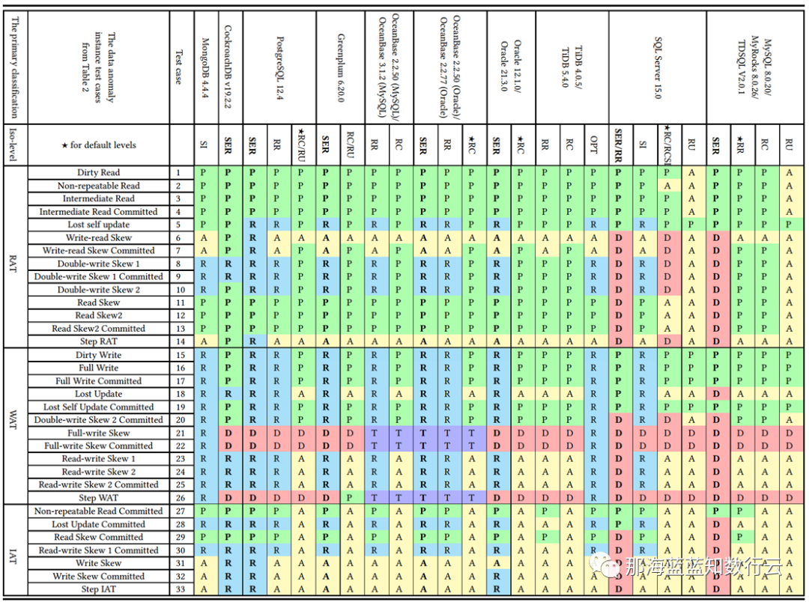
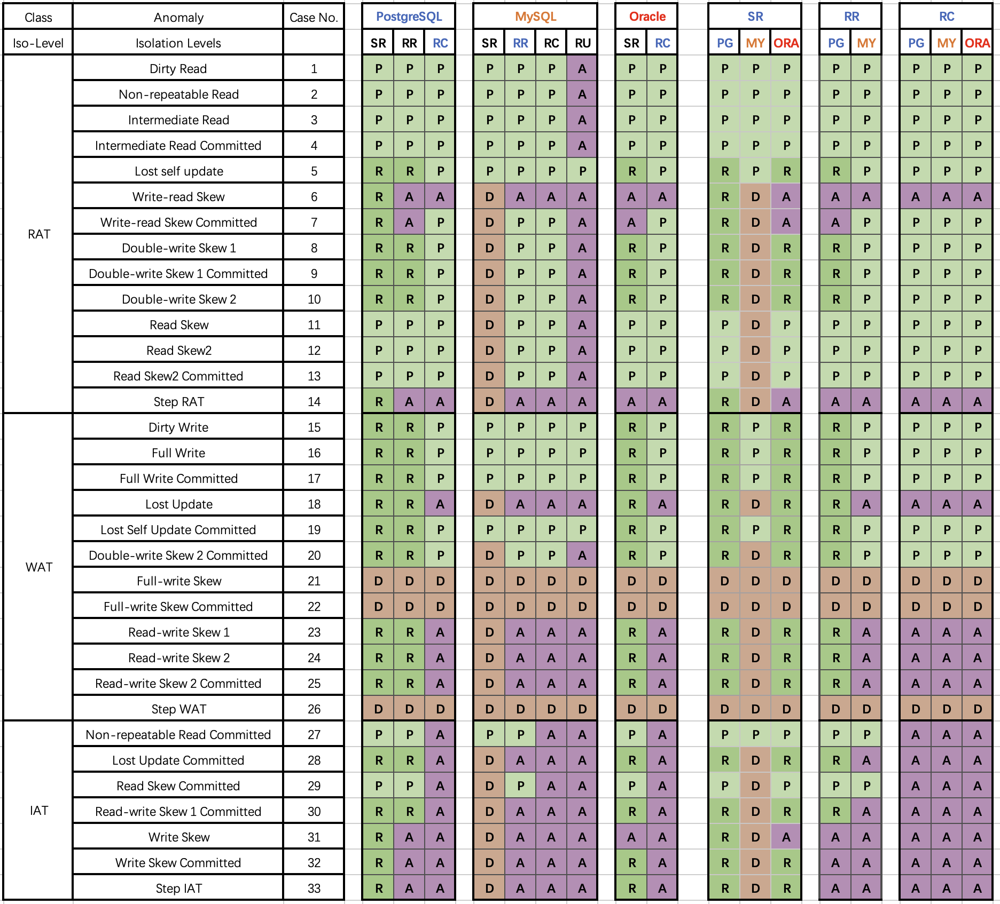

MySQL **曾经**是世界上最流行的开源关系型数据库，然而流行并不意味着先进，流行的东西也会出大问题。[JEPSEN](https://jepsen.io/analyses/mysql-8.0.34) 对 MySQL 的隔离等级评测捅穿了这层窗户纸 —— 在**正确性**这个体面数据库产品必须的基本属性上，MySQL 的表现一塌糊涂。

MySQL 文档声称实现了 **可重复读/RR** 隔离等级，但实际提供的正确性保证却弱得多。JEPSEN 在 Hermitage 的研究基础上进一步指出，MySQL 的 可重复读/RR 隔离等级实际上并不可重复读，甚至既不**原子**也不**单调**，连 **单调原子视图/MAV** 的基本水平都不满足。

此外，能“避免”这些异常的 MySQL **可串行化/SR** 隔离等级难以生产实用，也非官方文档与社区认可的最佳实践；而且在AWS RDS默认配置下，MySQL SR 也没有真正达到“串行化”的要求；而李海翔教授的对 MySQL 一致性的分析进一步指出了 SR 的设计缺陷与问题。

综上， **MySQL 的 ACID 存在缺陷，且与文档承诺不符** —— 这可能会导致严重的正确性问题。尽管可以通过显式加锁等方式规避此类问题，但用户确实应当充分意识到这里的利弊权衡与风险：在对正确性/一致性有要求的场景中选用 MySQL 时，请务必保持谨慎。


- [正确性为什么很重要？](#正确性为什么很重要)
- [Hermitage的结果怎么说？](#hermitage的结果怎么说)
- [JEPSEN 又有什么新发现？](#jepsen-又有什么新发现)
- [隔离性问题：不可重复读](#隔离性问题不可重复读)
- [原子性问题：非单调视图](#原子性问题非单调视图)
- [串行化问题：鸡肋且糟糕](#串行化问题鸡肋且糟糕)
- [正确性与性能的利弊权衡](#正确性与性能的利弊权衡)
- [参考](#参考)

[](https://mp.weixin.qq.com/s/gQZ3Q5JKV8gaBNhc1puPcA)

--------------------

## 正确性为什么很重要？

可靠的系统需要应对各种错误，在数据系统的残酷现实中，更是很多事情都可能出错。要保证数据不丢不错，实现可靠的数据处理是一件工作量巨大且极易错漏的事情。而**事务**的出现解决了这个问题。事务是数据处理领域最伟大的抽象之一，也是关系型数据库引以为傲的金字招牌和尊严所在。

事务这个抽象让所有可能的结果被归结为两种情况：**要么成功完事 COMMIT，要么失败了事 ROLLBACK**，有了后悔药，程序员不用再担心处理数据时半路翻车，留下数据一致性被破坏的惨不忍睹的车祸现场。应用程序的错误处理变得简单多了，因为它不用再担心部分失败的情况了。而它提供的保证，用四个单词的缩写，被概括为 **ACID**。


事务的**原子性/A**让你在提交前能随时中止事务并丢弃所有写入，相应地，事务的**持久性/D**则承诺一旦事务成功提交，即使发生硬件故障或数据库崩溃，写入的任何数据也不会丢失。事务的**隔离性/I**确保每个事务可以假装它是唯一在整个数据库上运行的事务 —— 数据库会确保当多个事务被提交时，结果与它们一个接一个地串行运行是一样的，尽管实际上它们可能是并发运行的。而原子性与隔离性则服务于 **一致性/Consistency** —— 也就是应用的**正确性/Correctness** —— ACID 中的C是应用的属性而非事务本身的属性，属于用来凑缩写的。

然而在工程实践中，完整的**隔离性/I**是很少见的 —— 用户很少会使用所谓的 “**可串行化/SR**” 隔离等级，因为它有可观的性能损失。一些流行的数据库如 Oracle 甚至没有实现它 —— 在 Oracle 中有一个名为 “可串行化” 的隔离级别，但实际上它实现了一种叫做 **快照隔离（snapshot isolation）** 的功能，**这是一种比可串行化更弱的保证**。



RDBMS 允许使用不同的**隔离级别**，供用户在**性能**与**正确性**之间进行权衡。ANSI SQL92 用三种**并发异常（Anomaly）**，划分出四种不同的**隔离级别**，将这种利弊权衡进行了（糟糕的）标准化。：更弱的隔离级别“理论上”可以提供更好的性能，但也会出现更多种类的**并发异常（Anomaly）**，这会影响应用的正确性。

为了确保正确性，用户可以使用额外的并发控制机制，例如显式加锁或 SELECT FOR UPDATE ，但这会引入额外的复杂度并影响系统的简单性。对于金融场景而言，正确性是极其重要的 —— 记账错漏，对账不平很可能会在现实世界中产生严重后果；然而对于糙猛快的互联网场景而言，错漏几条数据并非不可接受 —— 正确性的优先级通常会让位于性能。
这也为伴随互联网东风而流行的 **MySQL** 的正确性问题埋下了祸根。


--------------------

## Hermitage的结果怎么说？

在介绍 JEPSEN 的研究之前，我们先来回顾一下 [Hermitage](https://github.com/ept/hermitage)  项目。。这是互联网名著 《DDIA》 作者 Martin Kelppmann 在 **2014** 年发起的项目，旨在评测各种主流关系数据库的**正确性**。项目设计了一系列并发运行的事务场景，用于评定数据库标称隔离等级的实际水平。



从 Hermitage 的评测结果表格中不难看出，在主流数据库的隔离级别实现里有两处缺陷，用红圈标出：Oracle 的 **可串行化/SR** 因无法避免 G2 异常，而被认为实际上是 “**快照隔离/SI**”。

MySQL 的问题更为显著：因为默认使用的 **可重复读/RR** 隔离等级无法避免 PMP / G-Single 异常，Hermitage 将其实际等级定为 **单调原子视图/MAV**。


需要指出 ANSI SQL 92 隔离等级是一个糟糕简陋且广为诟病的标准，它只定义了三种异常现象并用它们区分出四个隔离等级 —— 但实际上的异常种类/隔离等级要多得多。著名的《A Critique of ANSI SQL Isolation Levels》论文对此提出了修正，并介绍了几种重要的新隔离等级，并给出了它们之间的强弱关系偏序图（图左）。

在新的模型下，许多数据库的 “**读已提交/RC**” 与 “**可重复读/RR**” 实际上是更为实用的 “**单调原子视图/MAV**” 和 “**快照隔离/SI**” 。但 MySQL 确实别具一格：在 Hermitage 的评测中，MySQL的 **可重复读/RR** 与 **快照隔离/SI** 相距甚远，也不满足 ANSI 92 **可重复读/RR** 的标准，实际水平为 **单调原子视图/MAV。**而 JEPSEN 的研究进一步指出，MySQL **可重复读/RR** 实际上连 **单调原子视图/MAV** 都不满足，仅仅略强于 **读已提交/RC** 。


--------------------

## JEPSEN 又有什么新发现？

JEPSEN 是分布式系统领域最为权威的测试框架，他们最近发布了针对 MySQL 最新的 8.0.34 版本的研究与测评。建议读者直接[阅读原文](https://jepsen.io/analyses/mysql-8.0.34)，以下是论文摘要：

> MySQL 是流行的关系型数据库。我们重新审视了 Kleppmann （DDIA作者）在2014年发起的 [Hermitage](https://github.com/ept/hermitage) 项目结果，并确认了在当下 MySQL 的 **可重复读/RR** 隔离等级依然会出现 G2-item、G-single 和丢失更新异常。我们用事务一致性检查组件 —— Elle，发现了 MySQL 可重复读隔离等级也违反了内部一致性。更有甚者 —— 它违反了单调原子视图（MAV）：即一个事务可以先观察到另一个事务的结果，再次尝试观察后却又无法复现同样的结果。作为彩蛋，我们还发现 AWS RDS 的 MySQL集群经常出现违反串行要求的异常。这项研究是独立进行的，没有报酬，并遵循 [Jepsen研究伦理](https://jepsen.io/ethics)。

MySQL 8.0.34 的 **RU**，**RC**，**SR** 隔离等级符合 ANSI 标准的描述。且默认配置（RR，且`innodb_flush_log_at_trx_commit = on`）下的 **持久性/D** 并没有问题。问题出在MySQL 默认的 **可重复读/RR** 隔离等级上：

1. 不满足 ANSI SQL92 可重复读（G2，WriteSkew）
2. 不满足快照隔离（G-single, ReadSkew, LostUpdate）
3. 不满足游标稳定性（LostUpdate）
4. **违反内部一致性**（Hermitage 披露）
5. **违反读单调性**（JEPSEN新披露）


 MySQL RR 下的事务观察到了违反内部一致性、单调性、原子性的现象。这使得其评级被进一步调整至一个仅略高于 RC 的未定隔离等级水平上。

在 JEPSEN 的测试中共披露了六项异常，其中在2014年已知的问题我们先跳过，这里重点关注 JEPSEN 的新发现的异常，下面是几个具体的例子。


--------------------

## 隔离性问题：不可重复读

在这个测试用例（JEPSEN 2.3）中是用来一张简单的表 `people` ，`id` 作为主键，预填充一行数据。

```sql
CREATE TABLE people (
  id     int PRIMARY KEY,
  name   text not null,
  gender text not null
);
INSERT INTO people (id, name, gender) VALUES (0, "moss", "enby");
```

随即并发运行一系列写事务 —— 每个事务先读这一行的 `name` 字段；然后更新 `gender` 字段，随即再次读取 `name` 字段。正确的可重复读意味着在这个事务中，两次对 `name` 的读取返回的结果应该是一致的。

```sql
SET TRANSACTION ISOLATION LEVEL REPEATABLE READ;
START TRANSACTION;                     -- 开启RR事务
SELECT name FROM people WHERE id = 0;  -- 结果为 "pebble"
UPDATE people SET gender = "femme" WHERE id = 0; -- 随便更新点什么
SELECT name FROM people WHERE id = 0;  -- 结果为 “moss”
COMMIT;
```

但是在测试结果中 ，9048个事务中的126个出现了**内部一致性错误** —— 尽管是在 可重复读 隔离等级上运行的，但是实际读到的名字还是出现了变化。这样的行为与 MySQL 的[隔离级别文档](https://dev.mysql.com/doc/refman/8.0/en/innodb-transaction-isolation-levels.html#isolevel_repeatable-read)矛盾，该文档声称：“同一事务中的一致读取，会读取第一次读取建立的快照”。它与 MySQL 的[一致性读文档](https://dev.mysql.com/doc/refman/8.0/en/innodb-consistent-read.html)相矛盾，该文档特别指出，“InnoDB 在事务的第一次读时分配一个时间点，并发事务的影响不应出现在后续的读取中”。

ANSI / Adya 可重复读实质是：一旦事务观察到某个值，它就可以指望该值在事务的其余部分保持稳定。MySQL 则相反：**写入请求是邀请另一个事务潜入，并破坏用户刚刚读取的状态**。这样的隔离设计与行为表现确实是难以置信地愚蠢。但这儿还有更离谱的事情 —— 比如**单调性**和**原子性**问题。


--------------------

## 原子性问题：非单调视图

Kleppmann 在 Hermitage 中将 MySQL 可重复读评级为[单调原子视图/MAV](https://jepsen.io/consistency/models/monotonic-atomic-view)。根据 [Bailis 等](https://amplab.cs.berkeley.edu/wp-content/uploads/2013/10/hat-vldb2014.pdf) 的定义，单调原子视图确保一旦事务 *T2* 观察到事务*T1* 的任意结果，*T2* 即观察到 *T1* 的所有结果。

如果 MySQL 的 RR 只是在每次执行写入查询时重新获取一个快照，那么如果快照是单调的，它还是可以提供 MAV 等级的隔离保证 —— 而这正是 PostgreSQL **读已提交/RC** 隔离级别的工作原理。

然而在常规的 MySQL 单节点部署中，情况并非如此：MySQL 在 RR 隔离等级时经常违反单调原子视图。JEPSEN（2.4）的这个例子用于说明这一点：这里有一张 `mav` 表，预填充两条记录（`id=0,1`），`value` 字段初始值都是 `0`。

```sql
CREATE TABLE mav (
  id      int PRIMARY KEY,
  `value` int not null,
  noop    int not null
);
INSERT INTO mav (id, `value`, noop) VALUES (0, 0, 0);
INSERT INTO mav (id, `value`, noop) VALUES (1, 0, 0);
```

负载是读写混合事务：有写入事务会在同一个事务里去同时自增这两条记录的 `value` 字段；根据事务的原子性，其他事务在观察这两行记录时，`value` 的值应当是保持同步锁定增长的。

```sql
START TRANSACTION;
SELECT value FROM mav WHERE id = 0;    --> 0 读取到了0
update mav SET noop = 73 WHERE id = 1; --> “邀请”新的快照进来
SELECT value FROM mav WHERE id = 1;    --> 1 读取到了新值1，那么另一行的值应该也是1才对
SELECT value FROM mav WHERE id = 0;    --> 0 结果读取到了旧值0
COMMIT;
```

然而在上面这个读取事务看来，它观察到了“中间状态”。读取事务首先读0号记录的 `value`，然后将 1 号记录的 `noop` 设置为一个随机值（根据上面一个案例，就能看见其他事务的变更了），接着再依次读取 0/1 号记录的 `value` 值。结果出现这种情况：读取0号记录拿到了新值，读取1号记录时获取到了旧值，这意味着**单调性**和**原子性**都出现了严重缺陷。

MySQL 的[一致性读取文档](https://dev.mysql.com/doc/refman/8.0/en/innodb-consistent-read.html)广泛讨论了快照，但这种行为看起来**根本不像快照**。快照系统通常提供数据库状态的一致的、时间点的视图。它们通常是原子性的：要么包含事务的所有结果，要么全都不包含。即使 MySQL 以某种方式从写入事务的**中间状态**拿到了**非原子性快照**，它也必须得在获取行1新值前看到行0的新值。然而情况并非如此：此读取事务观察到行1的变化，但却没有看到行0的变化结果，**这算哪门子快照**？

因此，MySQL 的可重复读/RR 隔离等级既不原子，也不单调。在这一点上它甚至比不上绝大多数数据库的 **读已提交/RC**，起码它们实质上还是原子且单调的 **单调原子视图/MAV**。


另外一个值得一提的问题是：MySQL 默认配置下的事务会出现违背**原子性**的现象。我已经在[两年前的文章](https://mp.weixin.qq.com/s/KBypNeeM4puvzGiKFJ1FmQ)中抛出该问题供业界讨论，MySQL 社区的观点认为这是一个可以通过 `sql_mode` 进行配置的特性而非缺陷。

但这种说法无法改变这一事实：MySQL确实违反了最小意外原则，在默认配置下允许用户做出这种违背原子性的蠢事来。与之类似的还有 `replica_preserve_commit_order` 参数。


--------------------

## 串行化问题：鸡肋且糟糕

**可串行化/SR** 可以阻止上面的并发异常出现吗？理论上可以，可串行化就是为这个目的而设计的。但令人深感不安的是，JEPSEN 在 AWS RDS 集群中观察到，MySQL 在 **可串行化/SR** 隔离等级下也出现了 “Fractured Read-Like” 异常，这是G2异常的一个例子。这种异常是被 **RR** 所禁止的，应该只会在 **RC** 或更低级别出现。

深入研究发现这一现象与 MySQL 的 [`replica_preserve_commit_order`](https://dev.mysql.com/doc/refman/8.0/en/replication-options-replica.html#sysvar_replica_preserve_commit_order) 参数有关：禁用此参数允许 MySQL 以正确性作为代价，在重放日志时提供更高的并行性。当此选项被禁用时，JEPSEN在本地集群的 SR 隔离级别中也观察到了类似的 G-Single 和 G2-Item 异常。

可串行化系统应该保证事务（看起来是）全序执行，不能在副本上保留这个顺序是一件非常糟糕的事情。因此这个参数过去（8.0.26及以下）默认是禁用的，而在 MySQL 8.0.27 （2021-10-19）中被修改为默认启用。但是 AWS RDS 集群的参数组仍然使用“OFF”的旧默认值，并且缺少相关的文档说明，所以才会出现这样的现象。

尽管这一异常行为可以通过启用该参数进行规避，但使用 Serializable 本身也并非 MySQL 官方/社区鼓励的行为。MySQL 社区中普遍的观点是：除非绝对必要，否则应避免使用 **可串行化/SR** 隔离等级；MySQL 文档声称：*“`SERIALIZABLE` 执行比 `REPEATABLE READ` 更严格的规则，主要用于**特殊情况**，例如 XA 事务以及解决并发和死锁问题。”*

无独有偶，专门研究数据库一致性的李海翔教授（前鹅厂T14）在其《第三代分布式数据库》系列文章中，也对包括 MySQL （InnoDB/8.0.20）在内的多种数据库的实际隔离等级进行了测评，并从另一个视角给出了下面这幅更为细化的 “《[一致性八仙图](https://mp.weixin.qq.com/s/_BhAjcMkmthTf8Zw3RWKDw)》”。



在图中蓝/绿色代表正确用规则/回滚避免异常；**黄色的A代表出现异常，黄色“A”越多，正确性问题就越多**；红色的“D”指使用了影响性能的死锁检测来处理异常，**红色D越多，性能问题就越严重**；

不难看出，正确性最好的是 PostgreSQL SR 与基于其构建的 CockroachDB SR，其次是 Oracle SR；都主要是通过机制与规则避免并发异常；而 MySQL 的正确性水平令人不忍直视。

李海翔教授在专文《[一无是处的MySQL](https://mp.weixin.qq.com/s/__mnrLBN88RPgpET0kq3vg)》对此有过详细分析：尽管MySQL的 **可串行化/SR** 可以通过大面积使用死锁检测算法保证正确性，但这样处理并发异常，会严重影响数据库的**性能与实用价值**。


--------------------

## 正确性与性能的利弊权衡

李海翔教授在《[第三代分布式数据库：踢球时代](https://mp.weixin.qq.com/s/zz_184uqiSXQ1nSYENGuxg)》中抛出了一个问题：**如何对系统的正确性与性能进行利弊权衡？**

数据库圈有一些“习惯成自然”的怪圈，例如很多数据库的默认隔离等级都是 **读已提交/RC**，有很多人会说“数据库的隔离级别设置为 **RC** 足够了”！可是为什么？为什么要设置为 RC ？因为他们觉得 RC 级别数据库性能好。

可如下图所示，这里存在一个死循环：用户希望数据库性能更好，于是开发者把应用的隔离级别设置为RC。然而用户，特别是金融保险证券电信等行业的用户，又期望保证数据的正确性，于是开发者不得不在 SQL 语句中加入 `SELECT FOR UPDATE` 加锁以确保数据的正确性。而此举又会导致数据库系统性能下降严重。在TPC-C和YCSB场景下测试结果表明，用户主动加锁的方式会导致数据库系统性能下降严重，反而是强隔离级别下的性能损耗并没有那么严重。


使用弱隔离等级其实严重背离了“事务”这个抽象的初衷 —— **在较低隔离级别的重要数据库中编写可靠事务极其复杂**，而与弱隔离等级相关的错误的数量和影响被广泛低估[13]。使用弱隔离级别本质上是把本应由数据库来保证的正确性 & 性能责任**踢**给了应用开发者。

惯于使用弱隔离等级这个问题的根，可能出在 Oracle 和 MySQL 上。例如，Oracle 从来没有提供真正的可串行化隔离等级（SR 实际上是 **快照隔离/SI**），直到今天亦然。因此他们必须将*“**使用 RC 隔离等级**”* 宣传为一件好事。Oracle 是过去最流行的数据之一，所以后来者也纷纷效仿。



而使用弱隔离等级性能更好的刻板印象可能源于 MySQL —— 大面积使用**死锁检测**（标红）实现的 SR 性能确实糟糕。**但对于其他 DBMS 来说并非必然如此**。例如，PostgreSQL 在 9.1 引入的 **可串行化快照隔离（SSI）** 算法可以在提供完整可串行化前提下，相比**快照隔离/SI** [并没有多少性能损失](https://lchsk.com/benchmarking-concurrent-operations-in-postgresql)。


更进一步讲，[摩尔定律加持下的硬件的性能进步与价格坍缩](https://mp.weixin.qq.com/s/1OSRcBfd58s0tgZTUZHB9g)，让OLTP性能不再成为稀缺品 —— 在[单台服务器就能跑起推特](https://thume.ca/2023/01/02/one-machine-twitter/)的当下，超配充裕的硬件性能实在用不了几个钱。而比起数据错漏造成的潜在损失与心智负担，担心可串行化隔离等级带来的性能损失确实是杞人忧天了。

时过境迁，软硬件的进步让 “**默认可串行化隔离，优先确保100%正确性**” 这件事切实可行起来。为些许性能而牺牲正确性这样的利弊权衡，即使对糙猛快的互联网场景也开始显得不合时宜了。新一代的分布式数据库诸如 CockroachDB 与 FoundationDB 都选择了默认使用 **可串行化** 隔离等级。

**做正确的事很重要，而正确性是不应该拿来做利弊权衡的**。在这一点上，开源关系型数据库两巨头 MySQL 和 PostgreSQL 在早期实现上就选择了两条截然相反的道路：MySQL 追求性能而牺牲正确性；而学院派的 PostgreSQL 追求正确性而牺牲了性能。在互联网风口上半场中，MySQL 因为性能优势占据先机乘风而起。但当性能不再是核心考量时，正确性就成为了 MySQL 的**致命出血点**。

解决性能问题有许多种办法，甚至坐等硬件性能指数增长也是一种切实可行的办法（如 Paypal）；而正确性问题往往涉及到全局性的架构重构，解决起来绝非一夕之功。过去十年间，PostgreSQL守正出奇，在确保最佳正确性的前提下大步前进，[很多场景的性能都反超了 MySQL](https://mp.weixin.qq.com/s/651zXDKGwFy8i0Owrmm-Xg)；而在功能上更是籍由其扩展生态引入的向量、JSON，GIS，时序，全文检索等扩展特性[全方位碾压 MySQL](https://mp.weixin.qq.com/s/y3qY9eBfOic6tQYOiErIHg)。


PostgreSQL 在 2023 年 StackOverflow 的全球开发者用户调研中，开发者使用率正式超过了 MySQL ，成为[世界上最流行的数据库](https://mp.weixin.qq.com/s/xewE87WEaZHp-K5hjuk65A)。而在正确性上一塌糊涂，且与高性能难以得兼的 MySQL ，确实应该好好思考一下自己的破局之路了。


------

## 参考

`[1]` JEPSEN: *https://jepsen.io/analyses/mysql-8.0.34*

`[2]` Hermitage: *https://github.com/ept/hermitage*

`[4]` Jepsen研究伦理: *https://jepsen.io/ethics*

`[5]` `innodb_flush_log_at_trx_commit`: *https://dev.mysql.com/doc/refman/8.0/en/innodb-parameters.html#sysvar_innodb_flush_log_at_trx_commit*

`[6]` 隔离级别文档: *https://dev.mysql.com/doc/refman/8.0/en/innodb-transaction-isolation-levels.html#isolevel_repeatable-read*

`[7]` 一致性读文档: *https://dev.mysql.com/doc/refman/8.0/en/innodb-consistent-read.html*

`[9]` 单调原子视图/MAV: *https://jepsen.io/consistency/models/monotonic-atomic-view*

`[10]` Highly Available Transactions: Virtues and Limitations，Bailis 等: *https://amplab.cs.berkeley.edu/wp-content/uploads/2013/10/hat-vldb2014.pdf*

`[12]` `replica_preserve_commit_order`: *https://dev.mysql.com/doc/refman/8.0/en/replication-options-replica.html#sysvar_replica_preserve_commit_order*

`[13]` 与弱隔离等级相关的错误的数量和影响被广泛低估: *https://dl.acm.org/doi/10.1145/3035918.3064037*

`[14]` 测试PostgreSQL的并行性能: *https://lchsk.com/benchmarking-concurrent-operations-in-postgresql*

`[15]` 在单台服务器上跑起推特: *https://thume.ca/2023/01/02/one-machine-twitter/*
