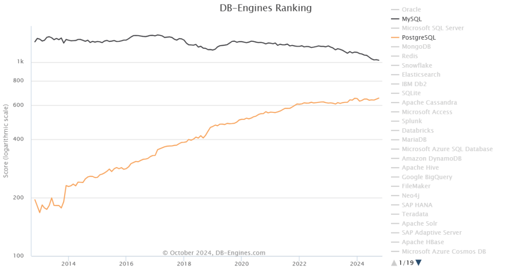

> Author: [Peter Zaitsev](https://www.percona.com/blog/author/pz/) | Translator: [Feng Ruohang](https://vonng.com) ([@Vonng](https://vonng.com/en/)) | [WeChat Article](https://mp.weixin.qq.com/s/xveP91NMYF4NFlIX_JcpYA)

Percona's CEO Peter Zaitsev recently published a blog discussing whether MySQL can still keep up with PostgreSQL's momentum.

As the flag-bearer of the MySQL ecosystem, Percona has developed the well-known PT series tools, MySQL backup tools, monitoring tools, and distributions. Their views represent to a considerable extent the MySQL community's thinking.

> Author: [Peter Zaitsev](https://www.percona.com/blog/author/pz/), Percona CEO, Original: [How Can MySQL Catch Up with PostgreSQL's Momentum?](https://www.percona.com/blog/how-can-mysql-catch-up-with-postgresqls-momentum/)
>
> Translator: [Feng Ruohang](https://vonng.com/en), Vonng, author of [Pigsty](https://pigsty.io), PostgreSQL wizard, database veteran, cloud computing mudslide.

## How Can MySQL Catch Up with PostgreSQL's Momentum?

When I talk to MySQL community veterans, I often hear this question: "*Why is MySQL so excellent and still more popular than PostgreSQL (at least according to DB-Engines' methodology), yet its position is constantly declining while PostgreSQL's popularity is growing unstoppably?*" Can the MySQL ecosystem do something to reverse this trend? Let's dive deep into this!

Let's look at why PostgreSQL has been performing so strongly while MySQL is on a downward trajectory. I think it comes down to ownership and governance, licensing, community, architecture, and open source product momentum.

## Ownership and Governance

MySQL has never been as "community-driven" as PostgreSQL. However, when MySQL was owned by the small Swedish company MySQL AB and steered by Benevolent Dictator For Life (BDFL) Michael "Monty" Widenius, it gained significant community trust, and more importantly, large corporations didn't see it as a particular threat.

Now the situation is different - Oracle owns MySQL, and many large companies in the industry, especially cloud vendors, see Oracle as a competitor. Obviously, they have no reason to contribute code and marketing to create value for their competitor. Additionally, Oracle, owning the MySQL trademark, will always have additional priority on MySQL.

In contrast, PostgreSQL is community-operated, with every commercial vendor in the field starting from the same line - large companies like EDB have no special treatment compared to small companies in the PostgreSQL ecosystem.

This means large companies are more willing to contribute and recommend PostgreSQL as their first choice because it doesn't create value for their competitors, and they have greater influence over PostgreSQL project direction. Hundreds of small companies make PostgreSQL ubiquitous globally through local "grassroots" community development and marketing efforts.

**What can the MySQL community do to address this issue?** **The MySQL community can do very little** - this is entirely in Oracle's hands. As I wrote in [Can Oracle Save MySQL?](/db/can-oracle-save-mysql/), transferring MySQL to a neutral foundation (like Linux or Kubernetes projects) would provide an opportunity to compete with PostgreSQL. However, I'm not very hopeful because I think Oracle is more interested in "hard" monetization right now rather than expanding adoption.

## Licensing

MySQL uses a dual licensing model: GPLv2 and commercial licenses purchasable from Oracle, while PostgreSQL uses the very permissive PostgreSQL license.

This practically means you can easily create [PostgreSQL derivatives](https://wiki.postgresql.org/wiki/PostgreSQL_derived_databases) using commercial licenses or embed them into commercially licensed projects without any "workarounds." People building such products are naturally supporting and promoting PostgreSQL.

MySQL does allow cloud vendors to create their own commercial branches - Amazon Aurora with MySQL compatibility is the most well-known and successful such branch, but this is not allowed when distributing software.

**What can the MySQL community do?** **Again, not much** - the only company that can relicense MySQL under a permissive license is Oracle, and I have no reason to believe they would want to loosen control, although "open core" and "cloud-only" versions often work well with permissively licensed "core" software.

## Community

I think when we consider open source communities, it's best to consider [three different communities](https://peterzaitsev.com/there-are-three-open-source-communities-not-just-one/), not just one.

First, the **user community**. MySQL still performs well in this area, although PostgreSQL is increasingly becoming the preferred database for new applications. However, user communities tend to be the result of work from the other communities.

Second, the **contributor community**. PostgreSQL has a stronger contributor community, which is not surprising since it's driven by numerous organizations rather than a single organization. We host events for contributors and write books on how to contribute to PostgreSQL. PostgreSQL's extensible architecture also helps easily extend PostgreSQL and publicly share work.

Finally, the **vendor community**. I think this is where the main problem lies - not many companies are interested in promoting MySQL because doing so might just create value for Oracle. You might ask, wouldn't this encourage all of Oracle's "partners" to promote MySQL? It might, and there are indeed some partner-supported MySQL events globally, but these pale in comparison to vendor support for PostgreSQL because it's "their project."

**What can the MySQL community do?** The community can still play a role here - although current conditions make the work harder and less rewarding, we can still do many things. If you care about MySQL's future, I encourage you to organize and participate in various events, especially outside the narrow MySQL ecosystem, write articles, record videos, publish books. Promote them on social media and submit them to Hacker News.

Particularly, don't miss the [FOSDEM 2025 MySQL Devroom](https://www.mysqlandfriends.eu/) call for papers!

This is also where Oracle can participate - they can engage in these activities without reducing profitability and interact with potential contributors - host events where external contributors can participate, share plans with them, support their contributions - at least when they align with your "MySQL community" blueprint.

## Architecture

Some PostgreSQL peers believe that PostgreSQL's better momentum stems from better architecture and cleaner codebase. I think this might be a factor, but not the main reason - the reasons here are worth discussing.

PostgreSQL is designed to be highly extensible with a large number of powerful extension plugins already implemented, while MySQL's extensibility possibilities are very limited. One notable exception is the storage engine interface - MySQL supports multiple different storage engines, while PostgreSQL has only one (although forks like [Neon](https://neon.tech/) or [OrioleDB](https://www.orioledb.com/) can change this through patching).

This extensibility makes innovation on PostgreSQL easier (especially with a stronger contributor community supporting PG) without needing to incorporate new features into the core codebase.

**What can the MySQL community do?** I think even though MySQL's extensibility is limited, we can still achieve a lot through [various types of plugins](https://dev.mysql.com/doc/extending-mysql/8.0/en/plugin-types.html) and ["components"](https://dev.mysql.com/doc/refman/8.4/en/components.html) that MySQL already supports.

We first need to establish a "community plugin marketplace" for MySQL, which would encourage developers to build more plugins and give them more exposure. We also need Oracle's support - committing to extend MySQL's plugin architecture and empowering developers to build plugins - even if this creates some competition with Oracle's products. For example, if MySQL had plugins to create custom data types and pluggable indexes, we might already see MySQL alternatives to PGVector.

## Open Source Product Momentum

Choosing a database is a long-term bet because switching databases isn't easy. Ask those who chose Oracle decades ago and are now locked in. This means when choosing a database, you need to consider the future - not only whether these databases will still exist in ten years, but whether they can still meet future technical needs as they evolve.

As I wrote in the article ["Oracle Finally Killed MySQL!"](https://mp.weixin.qq.com/s/1zlDPie_bVvP7eO6_uTkSw), I think Oracle has shifted significant development focus to proprietary commercial and cloud-exclusive MySQL versions - almost abandoning MySQL Community Edition. While today's MySQL still performs excellently in many applications, it's indeed falling behind and becoming outdated. Many in the MySQL community are questioning whether it has a future.

**What can the MySQL community do?** Again, the decision is in Oracle's hands because they're the only ones who can decide MySQL's official roadmap. You might ask, what about our [Percona Server for MySQL](https://www.percona.com/mysql/software/percona-server-for-mysql)? I believe at Percona, we do provide a leading open source alternative to Oracle MySQL, but because we focus on complete MySQL compatibility, we must be cautious about changes made to MySQL to avoid breaking this compatibility or making upstream merging costs too high. [MariaDB](https://mariadb.org/) made different trade-offs - unrestricted innovation has made it increasingly incompatible with MySQL, getting further from MySQL with each new version.

## MariaDB

Speaking of MariaDB, you might ask, hasn't MariaDB already solved all these problems as much as possible? - after all, isn't MariaDB managed by institutions like the MariaDB Foundation? Hold on, I think MariaDB is [a flawed foundation](https://www.percona.com/blog/open-source-and-flawed-foundations/) that doesn't own all intellectual property, **especially trademarks**, and cannot provide a level playing field for all vendors. It still has the trademark monopoly problem because only one company can provide all "MariaDB" related services, ranking higher than all other companies.

However, MariaDB might have a window of opportunity; with MariaDB (the company) just being [acquired by K1](https://k1.com/k1-acquires-mariadb/), MariaDB's governance and trademark ownership have a chance to move closer to PostgreSQL's model. **However, I'm not very hopeful** because loosening control over trademark intellectual property isn't what private equity companies typically do.

Of course, the MariaDB Foundation could also choose to gain complete control over trademarks by renaming the project to SomethingElseDB, but this would mean MariaDB loses all brand recognition - this is also unlikely to happen.

MariaDB has also significantly diverged from MySQL, and reconciling these differences would require years of effort, but I think if there are sufficient resources and community will, this might be a solvable problem.

### Summary

As you can see, due to MySQL's ownership and governance model, the MySQL community is limited in what it can do. In the long run, I think the only way for the MySQL community to compete with PostgreSQL is for all important participants to unite (like the [Valkey project](https://valkey.io/)) and create a MySQL alternative under a different brand - this could solve most of the above problems.