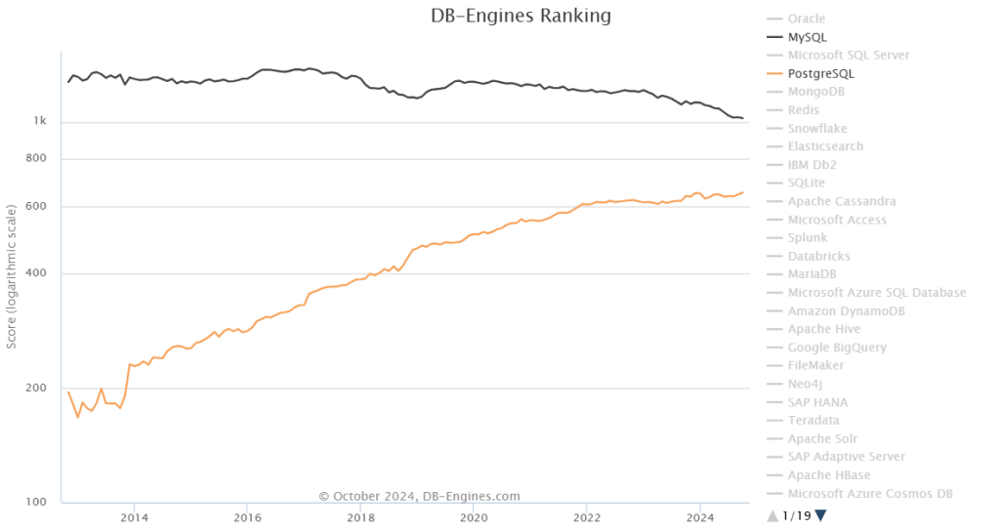

> 作者：[Peter Zaitsev](https://www.percona.com/blog/author/pz/) | 译：[冯若航](https://vonng.com)（[@Vonng](https://vonng.com/en/)）| [微信公众号](https://mp.weixin.qq.com/s/xveP91NMYF4NFlIX_JcpYA)

Percona 的老板 Peter Zaitsev最近发表一篇博客，讨论了MySQL是否还能跟上PostgreSQL的脚步。

Percona 作为MySQL 生态扛旗者，Percona 开发了知名的PT系列工具，MySQL备份工具，监控工具与发行版。他们的看法在相当程度上代表了 MySQL 社区的想法。

> 作者：[Peter Zaitsev](https://www.percona.com/blog/author/pz)，Percona 老板，原文：[How Can MySQL Catch Up with PostgreSQL’s Momentum?](https://www.percona.com/blog/how-can-mysql-catch-up-with-postgresqls-momentum/)
>
> 译者：[冯若航](https://vonng.com/en)，Vonng，[Pigsty](https://pigsty.io) 作者，PostgreSQL 大法师，数据库老司机，云计算泥石流。

## MySQL还能跟上PostgreSQL的步伐吗？

当我与MySQL社区的老前辈交谈时，我经常听到这样的问题：“*为什么MySQL如此出色，依然比PostgreSQL更受欢迎（至少根据DB-Engines的统计方法），但它的地位却在不断下降，而PostgreSQL的受欢迎程度却在不可阻挡地增长？*” 在MySQL 生态能做些什么扭转这一趋势吗？让我们来深入探讨一下！

让我们看看为什么PostgreSQL一直表现如此强劲，而MySQL却在走下坡路。我认为这归结为所有权与治理、许可证、社区、架构以及开源产品的势能。

## 所有权和治理

MySQL 从未像 PostgreSQL 那样是“社区驱动”的。然而，当 MySQL 由瑞典小公司 MySQL AB 拥有，且由终身仁慈独裁者（BDFL）Michael “Monty” Widenius掌舵时，它获得了大量的社区信任，更重要的是，大公司并没有将其视为特别的威胁。

现在情况不同了——Oracle 拥有 MySQL，业界的许多大公司，特别是云厂商，将 Oracle 视为竞争对手。显然它们没有理由去贡献代码与营销，为你的竞争对手创造价值。此外，拥有 MySQL 商标的 Oracle 在 MySQL 上总是会有额外的优先权。

相比之下，PostgreSQL 由社区运营，领域内的每个商业供应商都站在同一起跑线上—— 像 EDB 这样的大公司与PostgreSQL 生态系统中的小公司相比，没有特殊的优待。

这意味着大公司更愿意贡献并推荐 PostgreSQL 作为首选，因为这不会为他们的竞争对手创造价值，而且他们对PostgreSQL 项目的方向有更大的影响力。数百家小公司通过本地“草根”社区的开发和营销努力，使 PostgreSQL 在全球无处不在。

**MySQL社区能做些什么来解决这个问题？** **MySQL 社区能做的很少**——这完全掌握在 Oracle 手中。正如我在[《Oracle能拯救MySQL吗？》](https://mp.weixin.qq.com/s/1zlDPie_bVvP7eO6_uTkSw)中所写，将 MySQL 移交给一个中立的基金会（如 Linux 或 Kubernetes 项目）将提供与 PostgreSQL 竞争的机会。不过，我并不抱太大希望，因为我认为Oracle此刻更感兴趣的是“硬性”变现，而不是扩大采用率。

## 许可证

MySQL 采用双许可证模式： GPLv2 和可从 Oracle 购买的商业许可证，而PostgreSQL则采用非常宽松的 PostgreSQL 许可证。

这实际上意味着您可以轻松创建使用商业许可的 [PostgreSQL衍生版本](https://wiki.postgresql.org/wiki/PostgreSQL_derived_databases)，或将其嵌入到商业许可的项目中，而无需任何“变通方法”。构建此类产品的人们当然是在支持和推广 PostgreSQL。

MySQL 确实允许云供应商创建自己的商业分支，具有MySQL兼容性的 Amazon Aurora 是最知名和最成功的此类分支，但在软件发行时这样做是不允许的。

**MySQL社区能做什么？**  **还是那句话，能做的不多** ——唯一能在宽松许可证下重新授权MySQL的公司是Oracle，而我没有理由相信他们会想要放松控制，尽管“开放核心”和“仅限云”的版本通常与宽松许可的“核心”软件配合良好。

## 社区

我认为，当我们考虑开源社区时，最好考虑 [三个不同的社区](https://peterzaitsev.com/there-are-three-open-source-communities-not-just-one/)，而不仅仅是一个。

首先，**用户社区**。MySQL在这方面仍然表现不错，尽管 PostgreSQL 正日益成为新应用的首选数据库。然而，用户社区往往是其他几个社区工作的成果。

其次，**贡献者社区**。PostgreSQL 有着更强大的贡献者社区，这并不奇怪，因为它是由众多组织而非单一组织驱动的。我们举办了针对贡献者的活动，还编写了关于如何为 PostgreSQL 作出贡献的书籍。PostgreSQL 的可扩展架构也有助于轻松扩展 PostgreSQL，并公开分享工作成果。

最后，**供应商社区**。我认为这正是主要问题所在，没有那么多公司有兴趣推广 MySQL，因为这样做可能只是为Oracle 创造价值。你可能会问，这难道不会鼓励所有 Oracle 的“合作伙伴”去推广 MySQL 吗？可能会，在全球范围内也确实有一些合作伙伴支持的MySQL活动，但这些与供应商对 PostgreSQL 的支持相比，简直微不足道，因为这是 “属于他们的项目”。

**MySQL社区能做什么？** 这里社区还是可以发挥一点作用的 —— 尽管当前的状况使得工作更困难，回报更少，但我们仍然可以做很多事情。如果你关心 MySQL 的未来，我鼓励你组织与参与各种活动，尤其是在狭窄的 MySQL生态之外，去撰写文章、录制视频、出版书籍。在社交媒体上推广它们，并将它们提交到 Hacker News。

特别是，不要错过[ FOSDEM 2025 MySQL Devroom ](https://www.mysqlandfriends.eu/)的征稿！

这也是 Oracle 可以参与的部分，它们可以在不减少盈利的情况下参与这些活动，并与潜在的贡献者互动 —— 举办一些外部贡献者可以参与的活动，与他们分享计划，支持他们的贡献 —— 至少在他们与你的“MySQL社区”蓝图一致的情况下。

## 架构

一些 PostgreSQL 同行认为，PostgreSQL 发展势头更好的原因源于更好的架构和更干净的代码库。我认为这可能是一个因素，但并非主要原因，这里的原因值得讨论。

PostgreSQL 的设计高度可扩展，而且已经实现有大量强大的扩展插件，而 MySQL 的扩展可能性则非常有限。一个显著例外是存储引擎接口 —— MySQL支持多种不同的存储引擎，而 PostgreSQL 只有一个（尽管像 [Neon](https://neon.tech/) 或 [OrioleDB](https://www.orioledb.com/) 这样的分叉可以通过打补丁来改变这一点）。

这种可扩展性使得在 PostgreSQL 上进行创新更加容易，（特别是PG还有着一个更强大的贡献者社区支持），而无需将新功能纳入核心代码库中。

**MySQL社区能做些什么？** 我认为即使 MySQL 的可扩展性很有限，我们仍然可以通过MySQL已经支持的[各种类型的插件](https://dev.mysql.com/doc/extending-mysql/8.0/en/plugin-types.html)和[“组件”](https://dev.mysql.com/doc/refman/8.4/en/components.html)来实现很多功能。

我们首先需要为MySQL建立一个“社区插件市场”，这将鼓励开发者构建更多插件并让它们得到更多曝光。我们还需要Oracle的支持 —— 承诺扩展MySQL的插件架构，赋能开发者构建插件 —— 即使这会与Oracle的产品产生一些竞争。例如，如果 MySQL 有插件可以创建自定义数据类型和可插拔索引，或许我们已经会看到 MySQL 的 PGVector替代品了。

## 开源产品的势头

选择数据库是一个长期的赌注，因为更换数据库并不容易。去问问那些几十年前选择了 Oracle 而现在被其束缚的人吧。这意味着在选择数据库时，你需要考虑未来，不仅要考虑这些数据库在十年后是否依然存在，而且要考虑随着时间的发展，它是否还能满足未来的技术需求。

正如我在文章 [《Oracle最终还是杀死了MySQL！》](https://mp.weixin.qq.com/s/1zlDPie_bVvP7eO6_uTkSw) 中所写到的，我认为Oracle已经将大量开发重心转移到专有商业版和云专属的 MySQL 版本上 —— 几乎放弃了 MySQL 社区版。虽然今日的 MySQL 仍然在许多应用中表现出色，但它确实正在落后过气中，MySQL 社区中的许多人都在质疑它是还有未来。

**MySQL社区能做什么？** 还是那句话，决定权在 Oracle 手中，因为他们是唯一能决定 MySQL 官方路线的人。你可能会问，那么我们的 [Percona Server for MySQL](https://www.percona.com/mysql/software/percona-server-for-mysql) 呢？我相信在Percona，我们确实提供了一个领先的 Oracle MySQL的开源替代品，但因为我们专注于完整的 MySQL 兼容性，所以必须谨慎对待对 MySQL 所做的变更，以避免破坏这种兼容性或使上游合并成本过高。[MariaDB](https://mariadb.org/) 做出了不同的利弊权衡；不受限制的创新使其与MySQL 的兼容性越来越差，而且每个新版本都离 MySQL 越来越远。

## MariaDB

既然提到了MariaDB，你可能会问，MariaDB 不是已经尽可能地解决了所有这些问题吗？—— 毕竟 MariaDB 不是由 MariaDB基金会等机构管理的吗？别急，我认为MariaDB是 [一个有缺陷的基金会](https://www.percona.com/blog/open-source-and-flawed-foundations/)，它并不拥有所有的知识产权，**尤其是商标**，无法为所有供应商提供公平的竞争环境。它仍然存在商标垄断问题，因为只有一家公司可以提供所有 “MariaDB” 相关的服务，地位高于其他所有公司。

然而，MariaDB 可能有一个机会窗口；随着 MariaDB（公司）刚刚被[K1收购](https://k1.com/k1-acquires-mariadb/)，MariaDB的治理和商标所有权有机会向 PostgreSQL 的模式靠近。**不过，我并不抱太大希望**，因为放松对商标知识产权的控制并不是私募股权公司所惯常做的。

当然，MariaDB 基金会也可以选择通过将项目更名为 SomethingElseDB 来获得对商标的完全控制，但这意味着MariaDB 将失去所有的品牌知名度；这也不太可能发生。

MariaDB 也已经与 MySQL 有了显著的分歧，调和这些差异将需要多年的努力，但我认为如果有足够的资源和社区意愿，这也许是一个可以解决的问题。

### 总结

正如你所看到的，由于 MySQL 的所有权和治理方式，MySQL 社区在其能做的事情上受到限制。从长远来看，我认为 MySQL 社区唯一能与 PostgreSQL 竞争的方法是所有重要的参与者联合起来（就像[Valkey项目](https://valkey.io/)那样），在不同的品牌下创建一个 MySQL 的替代品 —— 这可以解决上述大部分问题。

