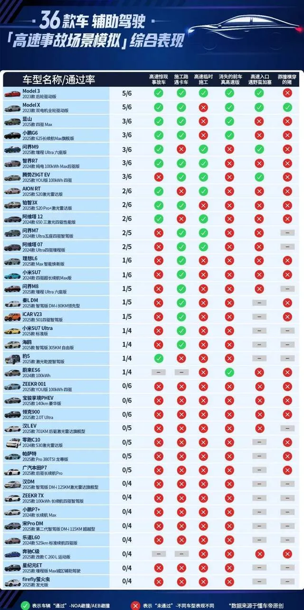

I rented a car today, drove from Shanghai back to Ningbo. Yesterday I watched Dongchedi’s autonomous-driving showdown—closed highway + real city roads + 30+ “smart driving” models. Everyone faceplanted except Tesla. The episode aired and every Tesla at the local rental counter vanished, so I ended up in a gas car. Next time.

The video cured my decision fatigue: if I ever buy an EV, it’ll be a Tesla. I don’t care about sofas or fridges; I just want to stop being my own chauffeur. Competent autpilot is the only product feature that matters.

The show was glorious. They reserved a stretch of highway, lined up the usual snake oil, and said “show me.” The clowns immediately tripped over their own marketing. Even CCTV joined the release, which forced the “遥遥领先” crowd to mumble “no comment.”

> Update: CCTV chickened out and removed “joint release.” https://www.sohu.com/a/917915599_133588

My only thought after watching: **when will domestic software—databases, OSes, clouds, LLMs—get the same treatment?** Give us a Dongchedi for core infrastructure (backed by someone with a spine) and let’s see who can actually ship.

Right now the “indigenous database” scene is peak scam: too many hustlers, not enough marks. The marketing tactics are every bit as ridiculous as the smart-driving hype—loud boasts, under the hood it’s just mutilated open source with negative value add.

The xinchuang crowd (databases, OS, LLMs, clouds) needs its own “Dongchedi vs. autopilot” moment. Drag them onto a “closed highway” test, map the line between “usable” and “delusional,” and stop the grift before production systems pay the price.

Sure, it probably takes a pile of deadly incidents to trigger that reckoning—autonomous driving killed people before a TV show finally called BS. Maybe our industry needs a few nationwide outages before regulators or media cares.

But if we could run a public, brutal benchmark first, maybe we won’t need the blood sacrifice. That’s my half-baked idea for the weekend. Maybe it doesn’t have to be databases—cloud vendors deserve a turn in the dunk tank too. 😏

> Prompt for the illustration: “Ghibli style, 3:2 aspect. On a highway, a Tesla Cybertruck plows through a swarm of domestic EVs. Parts flying, flames everywhere, Tesla driving off into the sunset.”
