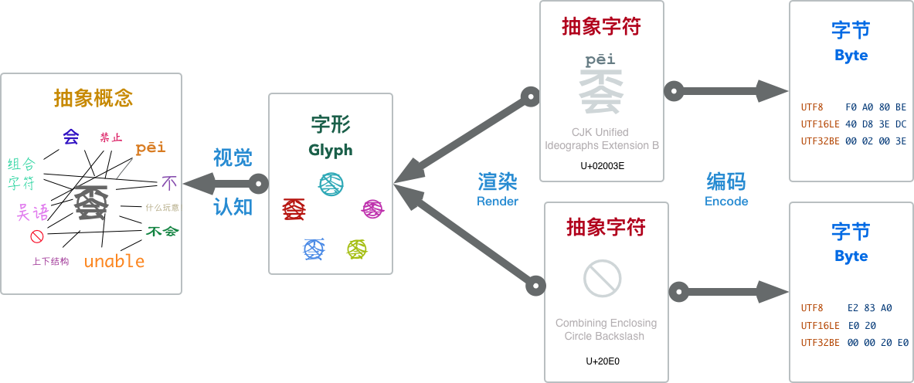
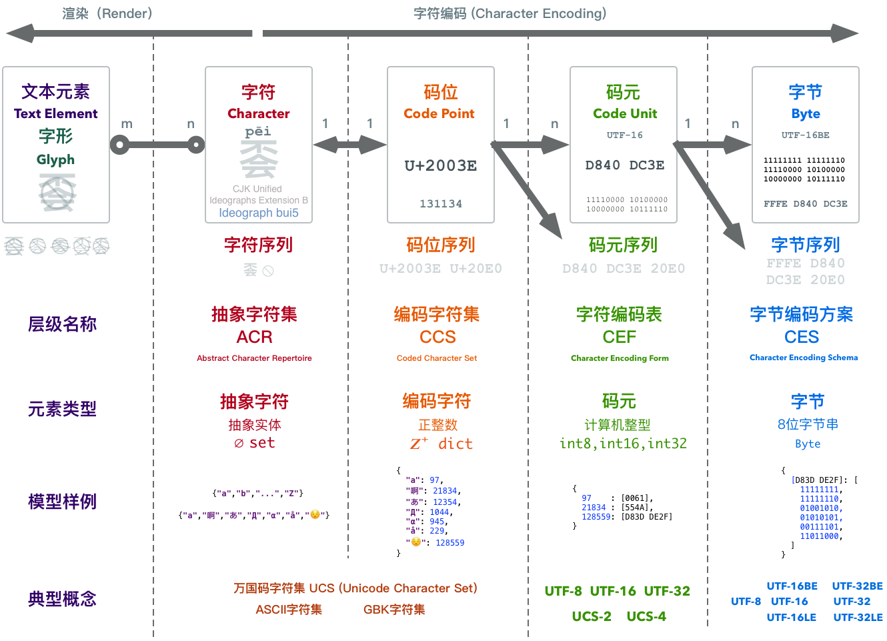
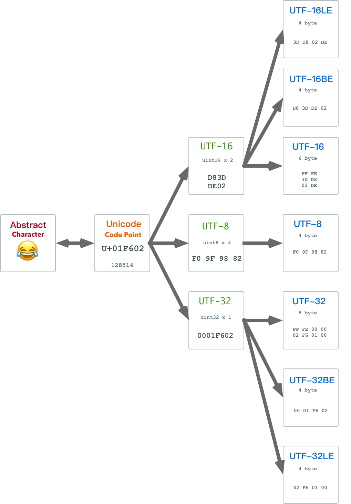

Programmers deal with **Code** (both programming code and encoding), and character encoding is the most fundamental type of encoding. The problem of **how to represent characters using binary numbers** - this **character encoding** problem is not as simple as it appears. In fact, its complexity far exceeds most people's imagination: input, comparison and sorting, search, reversal, line breaks and word segmentation, case conversion, locale settings, control characters, combining characters and normalization, collation rules, handling special requirements in different languages, variable-length encoding, byte order and BOM, surrogates, historical compatibility, regex compatibility, subtle and serious security issues, and much more.

Without understanding the basic principles of character encoding, even simple operations like string comparison, sorting, and random access can easily lead you into pitfalls. Based on my observations, many engineers and programmers know almost nothing about character encoding itself, having only vague intuitive understanding of terms like ASCII, Unicode, and UTF. Therefore, I'm attempting to write this educational article, hoping to clarify these issues.


------------

## 0x01 Basic Concepts

> Everything is number  —— Pythagoras

To explain character encoding, we first need to understand what encoding is, and what characters are.

### Encoding

From a programmer's perspective, we have many **fundamental** data types: integers, floats, strings, pointers. Programmers take them for granted, but from the physical nature of digital computers, only one type is truly fundamental: binary numbers.

**Encoding (Code)** is the bridge for mapping conversions between these high-level types and their underlying binary representations. Encoding consists of two parts: **encoding (encode)** and **decoding (decode)**. Take the ubiquitous natural number as an example. The number 42, this purely abstract mathematical concept, might be represented as the binary bit string `00101010` in a computer (assuming 8-bit integer). The process from abstract number 42 to binary representation `00101010` is **encoding**. Correspondingly, when a computer reads the binary bit string `00101010`, it interprets it as the abstract number 42 based on **context**. This process is **decoding**.

Any 'high-level' data type has encoding and decoding processes with its underlying binary representation. For example, single-precision floating-point numbers - this seemingly fundamental type also has a quite complex encoding process. In `float32`, 1.0 and -2.0 are represented as the following binary strings:

````
0 01111111 00000000000000000000000 = 1
1 10000000 00000000000000000000000 = −2
````

Strings are no exception. Strings are so important and fundamental that almost all languages implement them as built-in types. A string is first a **string** - a sequence composed of similar things in order. For strings, it's a sequence composed of **characters**. String or character encoding is actually the rules for mapping abstract character sequences to their binary representations.

However, before discussing character encoding issues, let's first look at what **characters** are.

### Characters

Characters refer to letters, numbers, punctuation, ideographic writing (like Chinese characters), symbols, or other textual "**atoms**". They are abstract entities representing the smallest semantic units in written language. The characters discussed here are all **abstract characters** - their precise definition is: information units used for organizing, controlling, and displaying text data.

Abstract characters are abstract symbols, independent of concrete forms: distinguishing **characters** from **glyphs** is very important. What we see on screen as tangible things are **glyphs** - they are visual representations of abstract characters. Abstract **characters** are presented as **glyphs** through **rendering**. The **glyphs** presented by the user interface are perceived by the human eye, cognized by the human brain, and finally restored to abstract entity concepts in the human mind. Glyphs serve as media in this process but should never be equated with abstract characters themselves.



Note that while **most** of the time glyphs and characters correspond one-to-one, there are still some many-to-many cases: one glyph might be composed of multiple characters, for example, the abstract character `à` (the fourth tone 'a' in Pinyin). We consider it a single 'character', but it can either be truly a single character or be composed of character `a` and the grave accent character `	̀`.

On the other hand, one character might also be composed of multiple glyphs, for example, many Arabic and Hindi scripts - symbols composed of many graphic elements (glyphs), complex like paintings, are actually single characters.

```python
>>> print u'\u00e9', u'e\u0301',u'e\u0301\u0301\u0301'
é é é́́
```

Collections of glyphs constitute **fonts**, but those belong to **rendering** content: rendering is the process of mapping character sequences to glyph sequences. That's another topic as complex as character encoding. This article won't cover rendering but will focus on the other side: **the process of converting abstract characters to binary byte sequences** - i.e., **Character Encoding**.

### Approach

We might think, if there's a table that can map all **characters** one-to-one to **byte(s)**, wouldn't the problem be solved? Actually, for English and some Western European texts, this is a very intuitive idea. ASCII does exactly this: through ASCII encoding tables, it uses 7 bits in one byte to encode 128 characters as corresponding binary values. One character corresponds exactly to one byte (injection but not surjection - half the bytes have no corresponding characters). One step to completion - simple, clear, efficient.

Computer science originated in Europe and America, so text processing initially meant English text processing. However, computers are good things that people of all nations want to use. But language and writing are extremely complex problems: learning one language is already quite mind-boggling, let alone designing an encoding standard that can handle languages and scripts from around the world. From simple ASCII to today's unified **Unicode standard**, people encountered various problems and took some detours.

Fortunately, in computer science, there's a saying: "*Any problem in computer science can be solved by adding another level of indirection*". The model and architecture of character encoding has also evolved continuously with history. Let's first overview the architectural system of modern encoding models.


------------

## 0x02 Model Overview

Modern encoding models are divided into five levels from bottom to top:
- **Abstract Character Repertoire (ACR)**
- **Coded Character Set (CCS)**
- **Character Encoding Form (CEF)**
- **Character Encoding Schema (CES)**
- **Transfer Encoding Syntax (TES)**

Many familiar terms can be categorized into corresponding levels of this model. For example, **Unicode Character Set (UCS)**, ASCII character set, GBK character set - these all belong to Coded Character Set CCS. The common UTF8, UTF16, UTF32 concepts all belong to **Character Encoding Form CEF**, though there are also Character Encoding Schema CES with the same names. The familiar `base64` and `URLEncode` belong to **Transfer Encoding Syntax TES**.

The relationships between these concepts can be represented by the following diagram:



We can see that to convert an abstract character to binary, it actually goes through several conceptual conversions. Between abstract character sequences and byte sequences, there are two intermediate forms: code point sequences and code unit sequences. Simply put:

* The collection of all abstract characters to be encoded is called the **Abstract Character Set**.
* Because we need to refer to specific characters in the set, each abstract character is assigned a unique natural number as an identifier. This assigned natural number is called the character's **Code Point**.
* Code points correspond one-to-one with characters in the character set. Abstract characters in the character set form an **Coded Character Set** after **encoding**.

* **Code points** are positive integers, but computer integer representation ranges are finite, so we need to reconcile the contradiction between infinite code points and finite integer types. **Character Encoding Form** maps **code points** to **Code Unit Sequences**, converting integers to computer integer types.
* Multi-byte integer types in computers have big-endian and little-endian byte order issues. **Character Encoding Schema** specifies solutions to byte order problems.

Why doesn't the Unicode standard directly map abstract characters to binary representations like ASCII? Actually, if there were only one character encoding scheme, like UTF-8, it would indeed be one step to completion. Unfortunately, due to historical reasons (like thinking 65536 characters would absolutely be enough...), we have several encoding schemes. But regardless, compared to the various encoding schemes that different countries developed on their own, Unicode's encoding schemes are already very simple. It can be said that each level was introduced out of necessity to solve problems:

* Abstract character set to coded character set solves the problem of **uniquely identifying characters** (glyphs cannot uniquely identify characters);
* Coded character set to character encoding form solves the mapping problem from **infinite natural numbers** to **finite computer integer types** (reconciling infinite and finite);
* Character encoding schema solves byte order problems (resolving transmission ambiguity).

Let's look at the details between each level.


------------

## 0x03 Character Sets

Character sets, as the name suggests, are collections of characters. What characters are was explained in the first section. In modern encoding models, there are two different levels of character sets: **Abstract Character Repertoire ACR** and **Coded Character Set CCS**.

### Abstract Character Repertoire ACR

Abstract character repertoire, as the name suggests, refers to **collections of abstract characters**. There are already many standard character set definitions. US-ASCII, UCS (Unicode), GBK - these familiar names are all (or at least are) abstract character repertoires.

US-ASCII defines a collection of 128 abstract characters. GBK selected over twenty thousand Chinese, Japanese, and Korean characters and other characters to form a character set, while UCS attempts to accommodate all abstract characters. They are all abstract character repertoires.

* The abstract character English letter `A` belongs to US-ASCII, UCS, and GBK character sets.
* The abstract character Chinese character `蛤` doesn't belong to US-ASCII, but belongs to GBK and UCS character sets.
* The abstract character Emoji `😂` doesn't belong to US-ASCII and GBK character sets, but belongs to UCS character set.

Abstract character repertoires can be represented using `set`-like data structures:

```python
# ACR
{"a","啊","あ","Д","α","å","😯"}
```

### Coded Character Set CCS

An important property of sets is **orderlessness**. Elements in sets are all unordered, so characters in abstract character repertoires are **unordered**.

This brings up a problem: how do we refer to a specific character in the character set? We can't use the glyph of an abstract character to refer to its entity, because as mentioned earlier, what looks like the same glyph might actually be composed of different character combinations (like glyph `à` has two character combination methods). For abstract characters, we need to assign them uniquely corresponding IDs. In relational database terms, the character data table needs a primary key. This **Code Point Allocation** operation is called **Encoding**. It **associates** abstract characters with positive integers.

If all characters in an abstract character repertoire have corresponding **Code Points**, this collection upgrades to a mapping: like changing from a `set` data structure to a `dict`. We call this mapping a **Coded Character Set CCS**.

```python
# CCS
{
  "a": 97,
  "啊": 21834,
  "あ": 12354,
  "Д": 1044,
  "α": 945,
  "å": 229,
  "😯": 128559
}
```

Note that this mapping is injective - each abstract character has a unique positive integer code point, but not all positive integers have corresponding abstract characters. Code points are divided into seven categories: graphic, format, control, surrogate, noncharacter, reserved. Code points in ranges like Surrogate (D800-DFFF) don't correspond to any characters when used alone.

The difference between abstract character repertoires and coded character sets is usually trivial, since specifying characters usually also specifies an order, assigning a numeric ID to each character. So we usually refer to them collectively as **character sets**. Character sets solve the problem of unidirectionally mapping abstract characters to natural numbers. So since computers have already solved the integer encoding problem, can we directly use the integer binary representation of character code points?

Unfortunately, there's another problem. Character sets can be open or closed. For example, the ASCII character set defines 128 abstract characters and will never add more. It's a closed character set. Unicode attempts to collect all characters and is constantly expanding. As of Unicode 9.0.0 in June 2016, it has collected 128,237 characters and will continue to grow in the future. It's an open character set. Open means the number of characters has no upper limit - new characters can be added at any time, like Emoji, with new expression characters introduced to Unicode almost every year. This creates an inherent contradiction: **the contradiction between infinite natural numbers and finite integer values**.

Character Encoding Form is designed to solve this problem.


------------

## 0x04 Character Encoding Form

Character sets solve the mapping problem from abstract characters to natural numbers. Representing natural numbers as binary is another core problem of character encoding. **Character Encoding Form (CEF)** converts a natural number into **one or more** computer internal integer values. These integer values are called **Code Units**. **Code units are the smallest bit combinations that can be used for processing or exchanging encoded text**.

Code units are closely related to data representation, usually computer character processing code units are multiples of one byte: 1 byte, 2 bytes, 4 bytes. Corresponding to several basic integer types: `uint8`, `uint16`, `uint32` - single-byte, double-byte, four-byte integers. Integer operations often use the computer's word length as a basic unit, usually 4 or 8 bytes.

Once, people thought using 16-bit short integers to represent characters would be enough. 16-bit short integers can represent 2^16 states, which is 65536 characters - seemingly more than enough. But programmers rarely learn from this kind of thing: Chinese characters alone might have one hundred thousand, and an encoding aimed at being compatible with all world characters can't ignore this. Therefore, if **using one integer to represent one code point**, double-byte short integer `int16` isn't sufficient to represent all characters. On the other hand, four-byte int32 can represent about 4.1 billion states - probably won't need that many characters before entering the interstellar space civilization age. (Actually, less than 140,000 characters have been allocated so far).

Based on different code unit units used, we have three character encoding forms: UTF8, UTF-16, UTF-32.

| Attribute\Encoding |     UTF8     |     UTF16     |     UTF32      |
|:-----:|:------------:|:-------------:|:--------------:|
| Code Unit  |   `uint8`    |   `uint16`    |    `uint32`    |
| Code Unit Length  | 1byte = 8bit | 2byte = 16bit | 4byte =  32bit |
| Encoding Length  | 1 code point = 1~4 code units  |  1 code point = 1 or 2 code units  |   1 code point = 1 code unit    |
| Unique Feature  |   ASCII Compatible    |    BMP Optimized    |      Fixed-length Encoding      |

### Fixed-length and Variable-length Encoding

Double-byte integers can only represent 65536 states, which is insufficient for the current 140,000 characters. On the other hand, four-byte integers can represent about 4.2 billion states. Probably won't encounter so many characters until humans enter deep space. Therefore, for code units, if we adopt four bytes, we can ensure encoding is **fixed-length**: one (character-representing) natural number code point can always be represented by **one** `uint32`. But if using `uint8` or `uint16` as code units, characters exceeding single code unit representation range need multiple code units to represent. Therefore, this is **variable-length encoding**. Thus, UTF-32 is fixed-length encoding, while UTF-8 and UTF-16 are variable-length encodings.

When designing encoding, **fault tolerance** is the most important consideration: computers aren't absolutely reliable - problems like bit flips and data corruption are quite possible. A basic requirement of character encoding is **self-synchronization**. For variable-length encoding, this problem is especially important. Applications must be able to parse character boundaries from binary data to correctly decode characters. If there are subtle errors in text data causing boundary parsing errors, we hope the error's impact is limited to that character, rather than all subsequent text boundaries losing synchronization and becoming unreadable garbage.

To ensure character boundaries naturally emerge from encoded binary, all variable-length encoding schemes should ensure no **overlap** between encodings: for example, in a double-code-unit character, its second code unit shouldn't itself be another character's representation. Otherwise, when errors occur, programs cannot distinguish whether it's a separate character or part of some double-code-unit character, failing to meet self-synchronization requirements. We can see in UTF-8 and UTF-16 that their encoding tables are designed with this requirement in mind.

Let's look at three specific encoding forms: UTF-32, UTF-16, UTF-8.

### UTF32

The simplest encoding scheme uses a four-byte standard integer `int32` to represent one character, i.e., adopting four-byte 32-bit unsigned integers as code units - UTF-32. Often, computers internally process characters this way. For example, in C and Go languages, many APIs use `int` to receive single characters.

UTF-32's most prominent feature is **fixed-length encoding** - one code point is always encoded as one code unit, thus having advantages of random access and simple implementation: the nth character is the nth code unit in the array, simple to use, even simpler to implement. Of course, this encoding method has a drawback: extremely wasteful storage. Although there are over 100,000 characters total, even Chinese commonly used characters usually have code points within 65535, representable with two bytes. For pure English text, one byte per character is sufficient. Therefore, using UTF32 might lead to 2-4 times storage consumption - real money. Of course, when memory and disk capacity aren't limited, UTF32 might be the most worry-free approach.

### UTF16

UTF16 is variable-length encoding using double-byte 16-bit unsigned integers as code units. Code points between U+0000-U+FFFF use single 16-bit code units, while code points between U+10000-U+10FFFF use two 16-bit code units. This pair of code units is called **Surrogate Pairs**.

UTF16 is optimized for the **Basic Multilingual Plane (BMP)** - the part with code points within U+FFFF representable by single 16-bit code units. Anyway, for high-frequency common characters within BMP, UTF-16 can be treated as fixed-length encoding, having random access benefits like UTF32 but saving half the storage space.

UTF-16 originates from early Unicode standards when people thought 65536 code points were sufficient for all characters. Then Chinese characters alone were enough to blow it up... **Surrogate** was a patch for this. By reserving some code points as special markers, UTF-16 was transformed into variable-length encoding. Many programming languages and operating systems born in that era were affected (Java, Windows, etc.).

For applications needing to balance performance and storage, UTF-16 is an option. Especially when the processed character set is limited to BMP, it can be completely treated as fixed-length encoding. Note that UTF-16 is essentially variable-length, so when characters beyond BMP appear, calculating and processing as fixed-length encoding might cause errors or even crashes. This is why many applications can't properly handle Emoji.

### UTF8

UTF8 is completely variable-length encoding using single-byte 8-bit unsigned integers as code units. Code points within 0xFF use single-byte encoding and remain completely consistent with ASCII; code points between U+0100-U+07FF use two bytes; code points between U+0800-U+FFFF use three bytes; code points beyond U+FFFF use four bytes, with potential future extension to up to 7 bytes per character.

UTF8's biggest advantages are: byte-oriented encoding, ASCII compatibility, and self-synchronization capability. As everyone knows, only multi-byte types have big-endian/little-endian byte order issues - if code units are single bytes, there's no byte order problem at all. Compatibility, or ASCII transparency, allows the vast historical programs and files using ASCII encoding to continue working under UTF-8 encoding without any changes (within ASCII range). Finally, self-synchronization mechanisms give UTF-8 good fault tolerance.

These features make UTF-8 very suitable for information transmission and exchange. Most text files on the internet use UTF-8 encoding. Go and Python3 also adopt UTF-8 as their default encoding.

Of course, UTF-8 also has costs. For Chinese, UTF-8 usually uses three bytes for encoding. Compared to double-byte encoding, this brings 50% additional storage overhead. Meanwhile, variable-length encoding cannot perform random character access, making processing more complex than "fixed-length encoding" and having higher computational overhead. Chinese text processing applications that don't care much about correctness but have strict performance requirements might not like UTF-8.

A huge advantage of UTF-8 is that it has no byte order issues. UTF-16 and UTF-32 have to worry about whether big-endian or little-endian bytes come first. This problem is usually solved in **Character Encoding Schema** through BOM.



### Character Encoding Schema

Character Encoding Form CEF solves how to encode **natural number code points** into **code unit sequences**. Regardless of which code units are used, computers have corresponding integer types. But can we say the encoding problem is solved? Not yet. Suppose a character is split into several code units forming a code unit sequence according to UTF16 - since each code unit is a `uint16`, each actually consists of two bytes. Therefore, when serializing code unit sequences into byte sequences, we encounter problems: should each code unit have high-order bytes first or low-order bytes first? This is the big-endian/little-endian byte order problem.

For network exchange and local processing, big-endian and little-endian each have advantages, so different systems often adopt different byte orders. To indicate the byte order of binary files, people introduced the concept of **Byte Order Mark (BOM)**. BOM is a special byte sequence placed at the beginning of encoded byte sequences to indicate the byte order of text sequences.

Character Encoding Schema is essentially Character Encoding Form with byte serialization schemes. I.e.: CES = CEF that solves endianness problems. Different choices for endianness identification methods produce several different character encoding schemas:

- UTF-8: No endianness problem.
- UTF-16LE: Little-endian UTF-16, no BOM
- UTF-16BE: Big-endian UTF-16, no BOM
- UTF-16: Endianness specified by BOM
- UTF-32LE: Little-endian UTF-32, no BOM
- UTF-32BE: Big-endian UTF-32, no BOM
- UTF-32: Flexible endianness with BOM

UTF-8 uses bytes as code units, so there's actually no byte order problem. The other two UTFs have three corresponding character encoding schemas each: a big-endian version, a little-endian version, and an adaptive big-little-endian version with BOM.

Note that in the current context, UTF-8, UTF-16, UTF-32 are actually CES-level concepts - i.e., CEF with byte serialization schemes - which can confuse with CEF-level concepts with the same names. Therefore, when discussing UTF-8, UTF-16, UTF-32, we must distinguish whether they're CEF or CES. For example, UTF-16 as an encoding schema produces byte sequences with BOM, while UTF-16 as an encoding form produces code unit sequences without the BOM concept.


------------

## 0x05 UTF-8

After introducing the modern encoding model, let's deep dive into a specific encoding schema: UTF-8. UTF-8 maps Unicode code points to 1-4 bytes, satisfying the following rules:

| **Scalar Value**                      | Byte 1        | Byte 2        | Byte 3        | Byte 4        |
|------------------------------|------------|------------|------------|------------|
| `00000000 0xxxxxxx`          | `0xxxxxxx` |            |            |            |
| `00000yyy yyxxxxxx`          | `110yyyyy` | `10xxxxxx` |            |            |
| `zzzzyyyy yyxxxxxx`          | `1110zzzz` | `10yyyyyy` | `10xxxxxx` |            |
| `000uuuuu zzzzyyyy yyxxxxxx` | `11110uuu` | `10uuzzzz` | `10yyyyyy` | `10xxxxxx` |

Rather than rote memorization, UTF-8's encoding rules can be naturally derived from several constraints:

1. Maintain compatibility with ASCII encoding, hence the first row rule.
2. Need self-synchronization mechanism, so need to preserve current character length information in the first byte.
3. Need fault tolerance mechanism - no overlap allowed between code units, meaning bytes 2,3,4,... cannot have code units that byte 1 might have.

`0, 10, 110, 1110, 11110, …` are non-conflicting byte prefixes. The `0` prefix is used by ASCII-compatible rule corresponding code units. The suboptimal `10` prefix is allocated to suffix bytes as prefix, indicating they're auxiliary parts of some character. Correspondingly, `110,1110,11110` prefixes are used for length marking in first bytes. For example, `110` prefix first byte indicates the current character has one additional auxiliary byte, while `1110` prefix first byte indicates two additional auxiliary bytes. Therefore, UTF-8 encoding rules are actually very simple. Here's a Go function showing the logic of encoding a code point into UTF-8 byte sequence:

```go
func UTF8Encode(i uint32) (b []byte) {
	switch {
	case i <= 0xFF: 	/* 1 byte */
		b = append(b, byte(i))
	case i <= 0x7FF: 	/* 2 byte */
		b = append(b, 0xC0|byte(i>>6))
		b = append(b, 0x80|byte(i)&0x3F)
	case i <= 0xFFFF: 	/* 3 byte*/
		b = append(b, 0xE0|byte(i>>12))
		b = append(b, 0x80|byte(i>>6)&0x3F)
		b = append(b, 0x80|byte(i)&0x3F)
	default: 			/* 4 byte*/
		b = append(b, 0xF0|byte(i>>18))
		b = append(b, 0x80|byte(i>>12)&0x3F)
		b = append(b, 0x80|byte(i>>6)&0x3F)
		b = append(b, 0x80|byte(i)&0x3F)
	}
	return
}
```


------------

## 0x06 Character Encoding in Programming Languages

After covering the modern encoding model, let's look at two examples from real programming languages: Go and Python2. Both are very simple and practical languages. But in character encoding model design, they represent two extremes: one positive example and one negative example.

### Go

One of Go language's creators, Ken Thompson, is also UTF-8's inventor (as well as creator of C language, Go language, and Unix). Therefore, Go's character encoding implementation is exemplary. Go's syntax is similar to C and Python - very simple. It's also a relatively new language that discarded historical baggage and directly uses UTF-8 as default encoding.

UTF-8 encoding has a special place in Go language - both source code text encoding and string internal encoding use UTF-8. Go avoided pitfalls that predecessor languages stepped in. Using UTF8 as default encoding was a very wise choice. In comparison, Java and Javascript use UCS-2/UTF16 as internal encoding. Early on they had random access advantages, but when Unicode grew beyond BMP, even this advantage disappeared. In contrast, byte order, Surrogate, and space redundancy troubles remain headache-inducing.

Go language has three important basic text types: `byte`, `rune`, `string` - representing byte, character, and string respectively. Among them:

* Byte `byte` is actually an alias for `uint8`. `[]byte` represents byte sequences.
* Character `rune` is essentially an alias for `int32`, representing a Unicode **code point**. `[]rune` represents code point sequences
* String `string` is essentially a UTF-8 encoded binary byte array (underlying byte array) plus a length field.

Corresponding encoding and decoding operations are:

* **Encoding**: Use `string(rune_array)` to convert **character arrays** to UTF-8 encoded strings.
* **Decoding**: Use `for i,r := range str` syntax to iterate characters in strings, actually sequentially restoring binary UTF-8 byte sequences to code point sequences.

More detailed content can be found in documentation. I've also written a blog post explaining Go language text types in detail.

### Python2

If Go can serve as an exemplary implementation of character encoding handling, then Python2 can be the most typical negative example. Python2 uses ASCII as default encoding and default source file encoding. Therefore, without understanding character encoding knowledge and some Python2 design choices, handling non-ASCII encoding can easily lead to errors. Actually, just looking at how different Python3 and Python2 are in character encoding handling gives you an idea. Python2 is still used by many people, so there are actually many pitfalls. The most serious problems are:

* Python2's default encoding scheme is very unreasonable.
* Python2's string types and string literals easily cause confusion.

**The first problem** is Python2's very unreasonable default encoding scheme:

-  Python2 uses `'xxx'` as **byte string literals** with type `<str>`, but `<str>` is essentially **byte strings** not **character strings**.
- Python2 uses `u'xxx'` as **character string literal** syntax with type `<unicode>`. `<unicode>` is true **character strings** where every character belongs to UCS.

Meanwhile, Python2 interpreter's default encoding scheme (CES) is US-ASCII. As contrast, languages like Java, C#, Javascript all use UTF-16 as internal default encoding scheme. Go language's internal default encoding scheme uses UTF-8. Python2 defaulting to US-ASCII is truly bizarre, though this has historical reasons. Python3 obediently changed to UTF-8.

**The second problem**: Python's default 'string' type `<str>` is more accurately called byte string - accessing each element by subscript gives you a byte. The `<unicode>` type is true character strings - accessing each element by subscript gives you a character (though each character might have different lengths underneath). The relationship between character string `<unicode>` and byte string `<str>` is:

* Character string `<unicode>` is encoded through character encoding scheme to get byte string `<str>`
* Byte string `<str>` is decoded through character encoding scheme to get character string `<unicode>`

Why call it `<str>` if it's byte string? Also, using quotes without any prefix for str literal syntax is very counter-intuitive. Therefore, many people fell into pitfalls. Of course, the type design of `<str>` and `<unicode>` and their relationship design itself is unproblematic. What should be criticized are the **names** of these two types and their **literal representation methods**. As for how to improve, Python3 has provided the answer. After understanding character encoding models, what operations are correct should be clear to readers.


> [WeChat Original Article](https://mp.weixin.qq.com/s/Yzd64oCjjlk4brERhKBuKA)