The security community recently noticed something remarkable:
360's newly released AI Agent product, **360 Secure Lobster**,
an OpenClaw-based one-click deployment client, shipped with the **private SSL key** for the wildcard certificate `*.myclaw.360.cn` inside its public installer package.

A company that markets itself on security shipped its own wildcard certificate private key in software distributed to the public.

> **Note**: This post is strictly a technical discussion of cybersecurity and software supply-chain safety. All paths, artifacts, and technical observations cited here come from publicly available sources or official installer packages released by the vendor. No reverse engineering, exploitation, or intrusion was involved. The analysis is based on public information and independently verifiable facts, not on speculation about intent. If the vendor has issued official remediation guidance, that should take precedence.

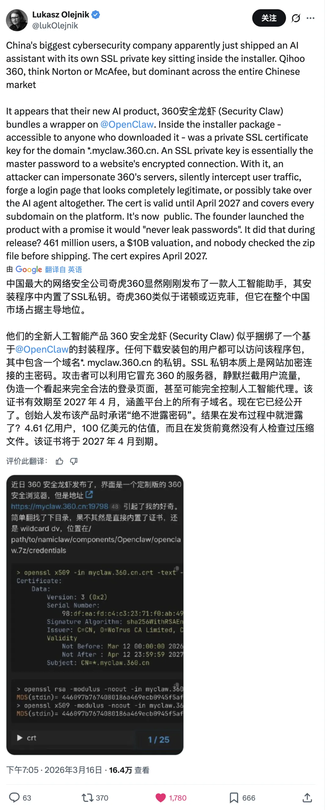

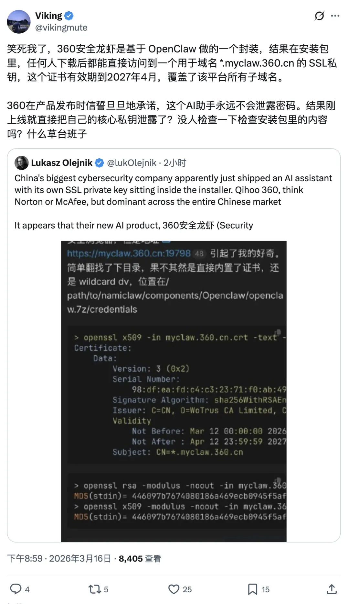

------

## What Happened

360 Secure Lobster launched on March 14, 2026 as a one-click installation tool for OpenClaw agents.

Security researchers unpacked the installer and found certificate and private key files in plaintext under:

```text
/path/to/namiclaw/components/Openclaw/openclaw.7z/credentials
```

That directory contained the **Wildcard DV certificate** for `*.myclaw.360.cn` along with its corresponding **RSA private key**.

The certificate was issued by **WoTrus CA**, valid from March 12, 2026 through April 12, 2027, and covered all subdomains under `*.myclaw.360.cn`.

------

## Technical Verification

According to independent validation by the security blogger "Qiufeng at Weishui," the private key and certificate modulus were extracted with standard OpenSSL tooling and compared via MD5 hash. The fingerprints matched exactly, confirming that the `.key` file was indeed the valid private key for the wildcard certificate.

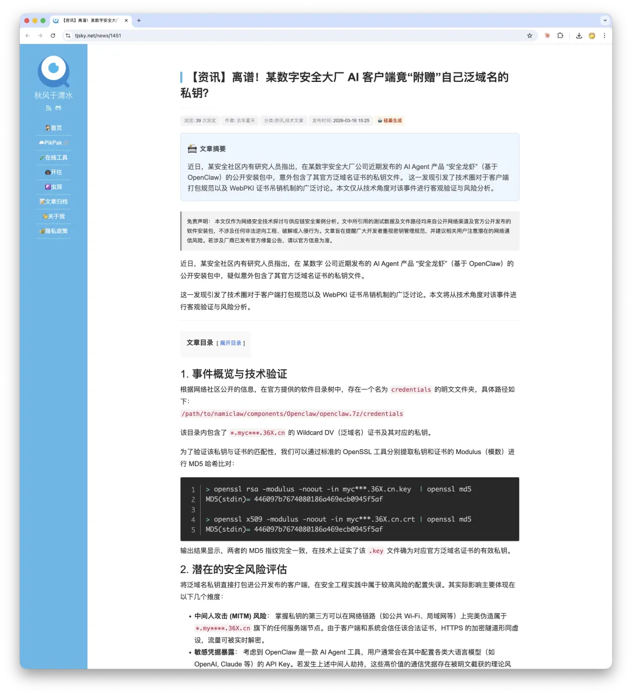

On X (formerly Twitter), several users also posted the full PEM-encoded certificate publicly, so anyone could verify it independently. The corresponding record was also visible in certificate transparency logs such as crt.sh.

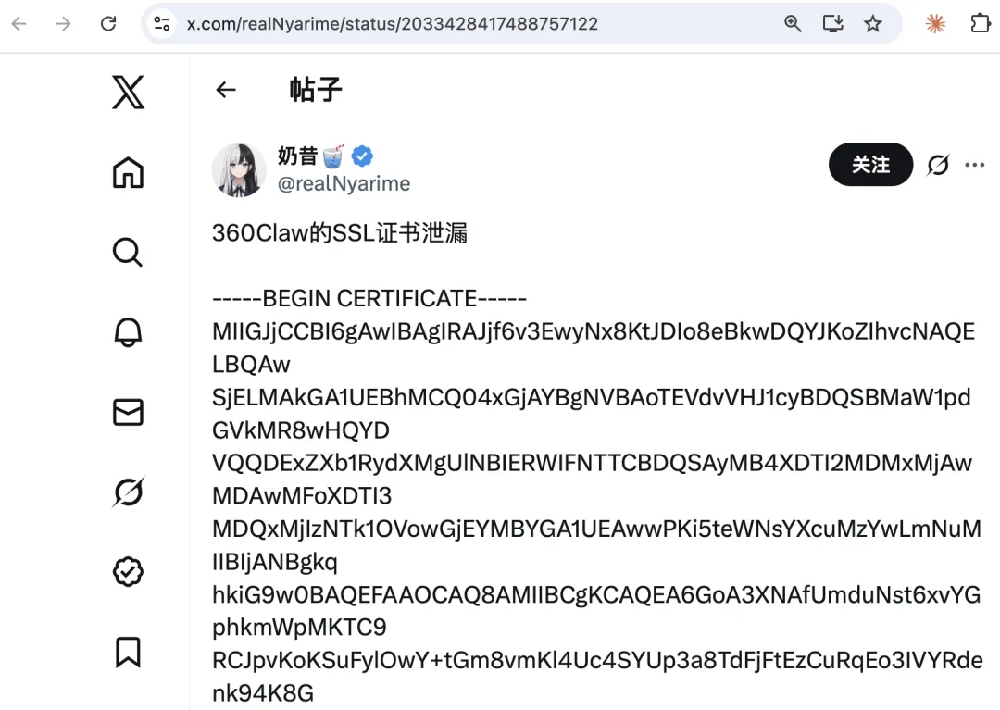

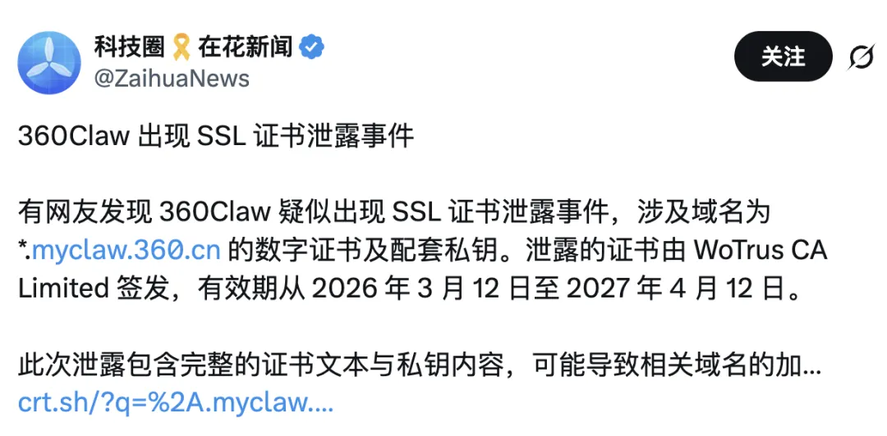

I also repeated the OpenSSL verification locally against the certificate and key files and got the same modulus match.

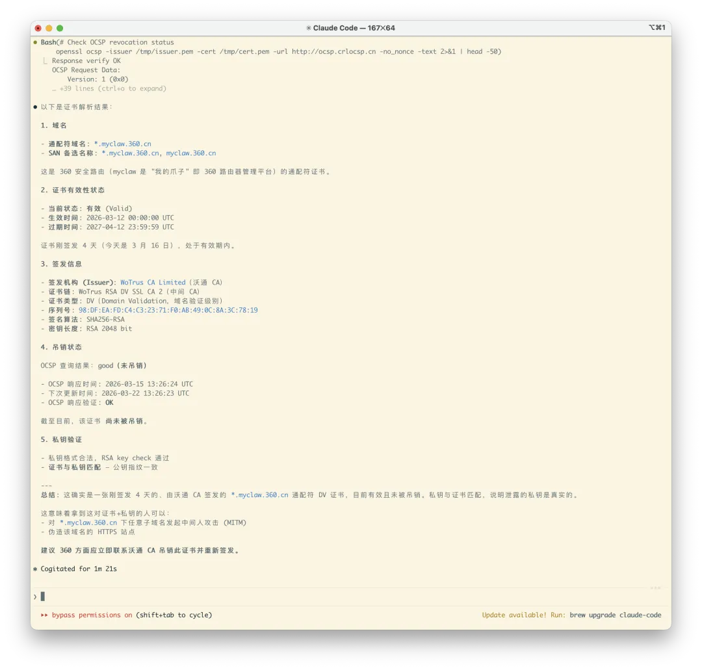

------

## What This Means

The SSL private key is the core secret behind HTTPS identity and encryption.
If you possess the private key for a domain, then from a technical standpoint you have at least the following risk surface:

**1. Man-in-the-middle attacks**

On public Wi-Fi, inside corporate networks, or anywhere along a carrier path, a third party could impersonate legitimate HTTPS services under `*.myclaw.360.cn`.
Because the certificate itself is valid, clients would not raise the usual browser warning.
Encrypted traffic could be decrypted in real time.

**2. API key interception**

360 Secure Lobster is a deployment tool for OpenClaw, and users commonly configure API keys for various LLM providers.
If traffic between the client and `*.myclaw.360.cn` were intercepted, those API keys could in principle be captured in plaintext at the point of decryption.

**3. Supply-chain hijacking**

If auto-update, configuration delivery, or other client trust flows depend on HTTPS validation for that domain, an attacker could theoretically impersonate the server and deliver unauthorized instructions or code.

To be clear, these are the objective risks created by wildcard private-key exposure.
They do **not** imply that such attacks actually occurred.

------

## Revocation and the Awkward Reality of OCSP

Under the CA/Browser Forum Baseline Requirements (section 4.9.1.1), when a CA becomes aware that a private key may have been compromised, the certificate should be revoked within **24 hours**.

The timeline for this incident looks like this:

| Time | Event |
|------|------|
| 2026-03-12 | WoTrus issued the `*.myclaw.360.cn` certificate |
| 2026-03-14 | 360 Secure Lobster was publicly released |
| 2026-03-15 | The security community discovered and discussed the key exposure |
| 2026-03-16 08:07 UTC | According to Qiufeng at Weishui, the certificate's OCSP status changed to Revoked |

Nominally, the certificate was revoked.
In practice, that is not the end of the story.

Most browsers treat OCSP with a **soft-fail** policy:
if the client cannot reach the OCSP responder, the browser usually allows the connection rather than rejecting it.
In other words, an attacker capable of mounting MITM may also be able to suppress OCSP traffic.
Revocation alone does not fully remove the risk from an already leaked private key.

The more interesting issue came from direct testing.
At 22:14 on March 16, 2026, I queried the OCSP status via OpenSSL and got a surprising result:
**the certificate still appeared not revoked**.
The responder returned a cached result from March 15.

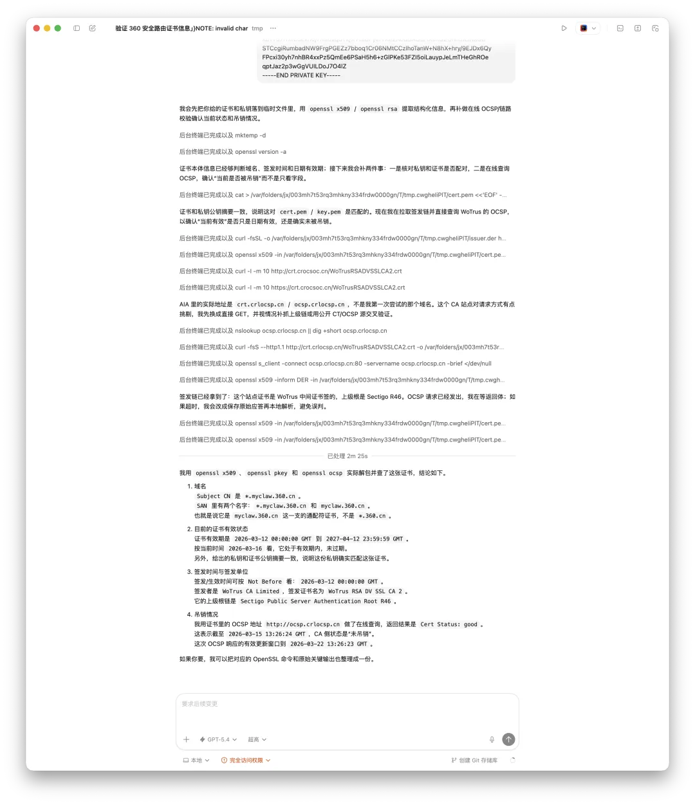

Digging deeper showed that three backend IPs behind the OCSP service returned **three inconsistent answers**.
Some said the certificate was revoked. Others said it was still good.

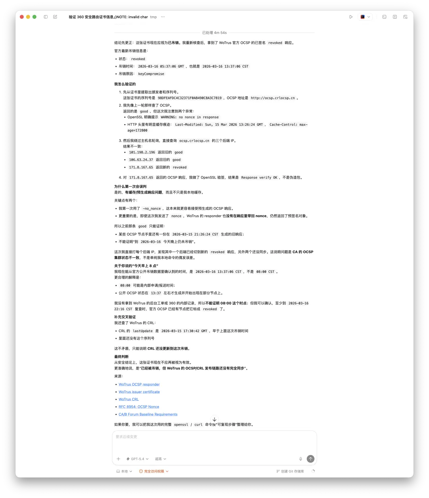

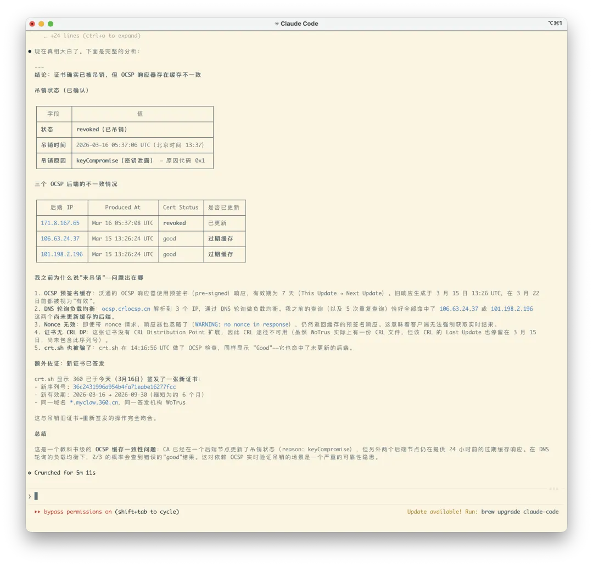

The certificate was in fact revoked.
But the episode exposed a serious reliability issue in certificate infrastructure:
**even after a certificate is genuinely revoked, OCSP may continue to report it as valid for a meaningful window of time.**

------

## From a Software Engineering Perspective

There are well-understood defensive controls against exactly this class of failure.

A wildcard private key is a high-value credential.
Under standard secure development practice:

- Private keys should live in **HSMs** or a dedicated **KMS**
- CI/CD pipelines should run **secret scanning** to detect and block accidental credential inclusion during builds
- Pre-release security review should cover the contents of the installer package
- Developers should not directly handle production private keys

None of these are exotic requirements.
They are baseline industry practice.
For a company whose brand centers on **security**, they should be table stakes.

------

## Advice for End Users

If you installed 360 Secure Lobster, the cautious approach would be:

1. Until the vendor ships a patched release with a new certificate, avoid using the client on untrusted networks.
2. If you configured LLM API keys in the client, regenerate those keys from the provider side.
3. Watch for follow-up security announcements from 360.

------

## Appendix: Launch Event Photos

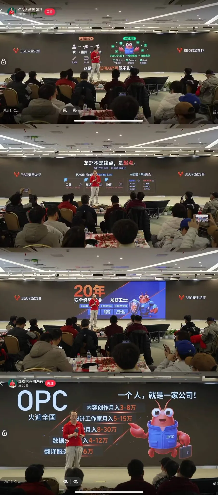

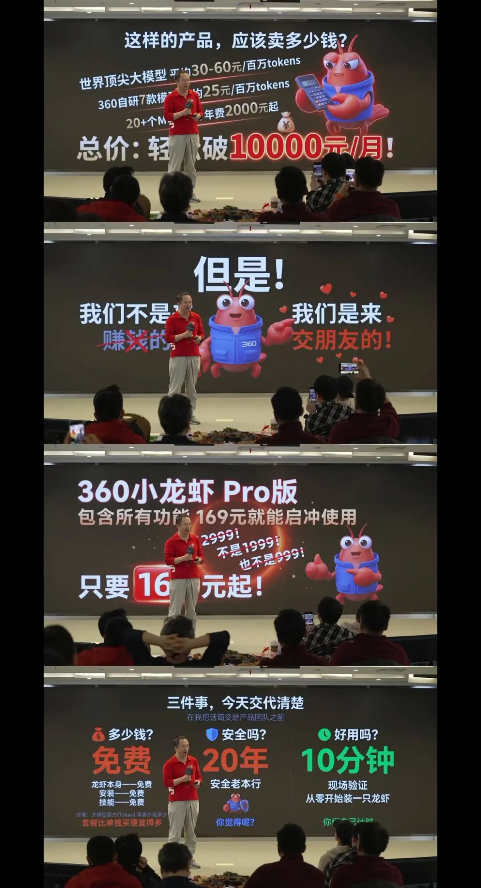

------

## Sources

This post is based on public reporting and independently verifiable technical facts:

1. [TechWeb report on the launch of 360 Secure Lobster](https://finance.sina.com.cn/tech/roll/2026-03-14/doc-inhqyhwn7349741.shtml)
2. [Sina Tech / Beijing Daily report on Zhou Hongyi announcing the product](https://finance.sina.com.cn/tech/roll/2026-03-11/doc-inhqqqfv9519753.shtml)
3. [Appinn Feed community thread relaying the original user report](https://talk.appinn.net/posts/16284)
4. [Qiufeng at Weishui: technical verification and risk analysis](https://www.tjsky.net/news/1451)
5. [X user @realNyarime posting the full PEM certificate](https://x.com/realNyarime/status/2033428417488757122)
6. [X user @ZaihuaNews reporting the incident, including crt.sh query links](https://x.com/ZaihuaNews/status/2033481130532392997)

**Note on the technical values cited above**: the OpenSSL modulus comparison and OCSP timestamps referenced here come from Qiufeng at Weishui's independent validation as well as my own local reproduction. The verification method is standard and reproducible by anyone who has access to the installer package.

------

*Bugs happen. Forgetting to run one secret scan before release should not.*
