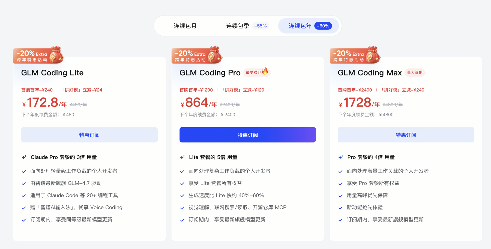
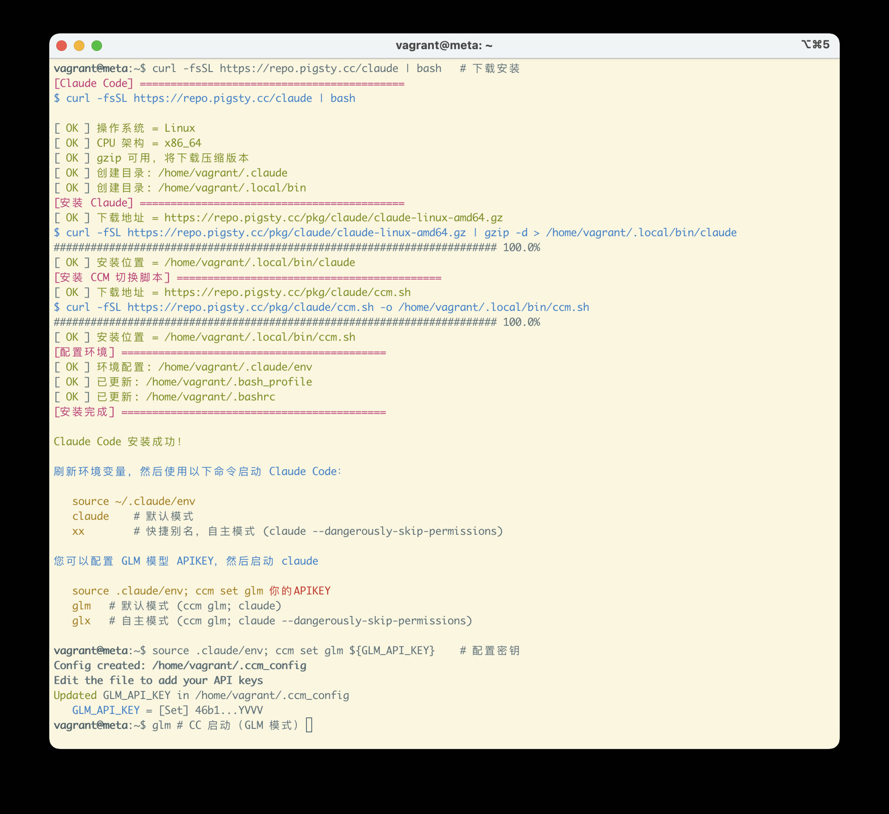
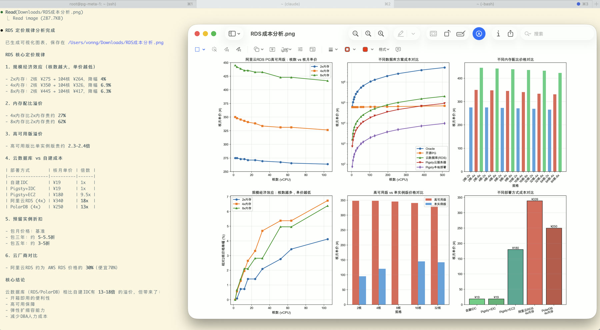

# Claude Code 免翻墙安装使用教程

在《[2025年度总结](/misc/2025)》里老冯提到过，过去一年 Claude Code 让我的生产力翻了 20 倍。
有朋友问我是不是吹牛——真没有，其实老冯说的还保守了。

这玩意实际上相当于月薪5万的工程师全天候帮你干活，而只要 1800¥ 的工资。
前几个月有个刚毕业的师妹问我怎么找工作，我给她的建议就一个：去把 Claude Code 整明白，比什么都管用。

今天这篇教程，就是教你怎么在完全不翻墙的情况下，用上 Claude Code。
（以及用 1/10 的国产开源替代 GLM 换掉 Claude Opus）


--------

## 什么是 Claude Code？

Claude Code（下面简称 CC）是美国 Anthropic 公司出品的 AI 编程助手。
你可以把它理解成一个能帮你干活的智能秘书 —— 你用中文告诉它要做什么，它就自动帮你执行。
它能干什么？几乎所有你在电脑上能干的事：

- 写代码、改代码、调试程序
- 翻译文章、润色写作、处理文档
- 数据分析、处理 Excel，PDF、汇总信息
- 帮你糊个网站、做个小工具，写脚本

我举个例子：Pigsty 官网首页 pigsty.cc，就是我一条命令让 CC 原地生成的。
小白能用吗？ 能。CC 不只是程序员的工具。你不需要会写代码，只需要会打字、会描述需求就行。
“理论上” 任何你用电脑能干的事情，CC 都能做。


### 一个关键概念区分

注意，CC 不是大模型，CC 是使用大模型进行写代码的应用，是一个智能 Agent。
你可以把它想象成 **驾驶舱**，而大模型则是发动机。驾驶舱好，发动机好，效果才好。


市面上 AI 编程工具不少—— Cursor、Copilot、Cline、Trae 等等，但 CC 目前是这个领域的绝对王者，没有之一。
CC 默认搭配的是 Claude Opus 4.5，编程能力当前最强的大模型。最好的驾驶舱 + 最好的发动机，效果自然拉满。

默认情况下，CC 连接的是 Anthropic 自家的 Claude 模型，但 CC 也支持换发动机，接入别家的模型。

这就是今天这篇教程的核心思路：

> 驾驶舱用最好的（Claude Code），发动机用便宜且不用翻墙的国产替代（GLM 4.7）。


--------

## 国内使用 Claude Code 有什么挑战

想在国内用 Claude 模型并不容易 —— 这玩意是两边一起封锁。
你至少需要：① 能翻墙 ② 有外币信用卡或外区 Apple ID，这两道门槛拦住了 99% 的人。

但是，现在有了国产替代了。

国内智谱最近发布了 GLM 4.7 模型，编程能力相当不错。
官方宣传说和 Claude Opus 4.5 “只差 2%” —— 老冯实测下来，中等难度的任务确实能胜任。

最关键的是：国内合法可用、不用翻墙、价格便宜。

| 方案             | 月成本       | 能力水平     | 门槛      |
|----------------|-----------|----------|---------|
| Claude Max 订阅  | ~¥ 1800/月 | 顶级（100分） | 翻墙 + 外卡 |
| GLM 4.7 Max 包年 | ~¥ 144/月  | 够用（85分）  | 无       |

打个比方，原来是月薪五万的顶级程序员，每个月付 ¥1800，现在换成月薪三万五的国产程序员，每个月只要 ¥144 块钱。（如果是 lite 套餐，每个月 14 块钱）。
能力稍弱一点，但价格只要十分之一，而且合法合规，不需要翻墙。



所以，你要问老冯，能力上 GLM 4.7 能不能吊打 Claude Opus 4.5，
那肯定是不行的（吊打个青春版 Haiku 也许可以）。但是，在性价比上， GLM 4.7 确实无敌。

> 现在活动首购包年 1700 块。也就是 Claude Max 一个月的价格。最低档 172.8 包年，折合每个月才 14 块钱，10 天后结束。
> 老冯的推荐码链接：[https://www.bigmodel.cn/glm-coding?ic=AUWYSKOKLN](https://www.bigmodel.cn/glm-coding?ic=AUWYSKOKLN)

老冯自己也整了一个，作为日常 Claude 额度用爆之后的替补。
说起来，这还真是第一次真金白银的给国产模型交钱买单。

我准备用 openCode 配 GLM，放在 Pigsty 里当 DBA Agent，
哗哗哗扫描日志看监控 —— 这个价格拿来干粗活，真是一点都不心疼。


--------

## 快速上手

那么言归正传，国内不翻墙该怎么用呢？简单来说就是三行命令，几秒就搞定：

```bash
curl -fsSL https://repo.pigsty.cc/claude | bash   # 下载安装
source .claude/env; ccm set glm 你的APIKEY         # 配置密钥
glm                                               # CC 启动（GLM 模式）
```

Linux/MacOS 都可以，不需要翻墙，下面老冯会详细说明。


### 第一步：打开终端贴命令

接下来要在终端里敲命令。终端是什么？ 就是一个打字输入命令的窗口。别被这词吓到，你就把它当成"用打字来操作电脑"就行。

- macOS： 按 Command + 空格，输入「终端」，回车
- Windows： 按 Win + R，输入 powershell，回车

打开后你会看到一个黑乎乎（或白乎乎）的窗口，光标在闪。这就是终端。


在终端里复制粘贴下面的命令，按回车：

**macOS / Linux：**

```bash
curl -fsSL https://repo.pigsty.cc/claude | bash
```



Windows 的话，老冯已经很久不用了，所以这个安装脚本是 Claude 照着Mac/Linux写的，我也没验证过，仅供参考

```powershell
irm https://repo.pigsty.cc/cc.ps1 | iex
```

等几秒钟，就安装完了。老冯在国内的仓库里放了 claude code 的二进制，下载它就不需要翻墙了。

CC 装好了如果你直接启动它（`claude`），它会默认去连 Claude 官方模型（需要翻墙）
所以为了全程不翻墙，你还需要配置一个国产的模型，比如 GLM 4.7。


### 第二步，注册GLM拿密钥

既然要用 GLM 当发动机，首先得去智谱那边拿一把"钥匙"（API Key）。

- 打开 https://bigmodel.cn/ 用手机号注册登录
- 点击右上角「API密钥」
- 点击「添加新的 API Key」，随便起个名字
- 把生成的密钥那串字符复制保存好（后面要用）


新用户有免费试用额度，够你先不花钱体验一阵子。用爽了可以买套餐，包年最便宜 173 块。

拿到 API Key 之后，在终端里执行下面的命令，把你的 API Key 写入配置文件：

```bash
ccm set glm 46b1axxxxxxxxxxxxxceYVVV # 替换成你的 API KEY，写入配置文件
```

这个脚本，其实老冯找了个 Claude Code 切换脚本改了改 [ccm](https://github.com/foreveryh/claude-code-switch) 可以很方便的切换不同模型。
你也可以用 kimi，qwen，glm，minmax，deepseek 等其他家的模型。


### 第三步：运行 claude code

启动 CC 很简单，第三条命令：**`glm`** 一敲就完事了。

这实际上是一个别名，`alias glm="ccm glm; claude"`，它会先使用 `ccm` 配置环境变量，填入 GLM 的环境变量，然后再启动 CC。

运行 `ccm glm` 会配置当前环境，这样启动 `claude` 就会使用 GLM 模型。
如果你想要运行原生的 Claude 模型，退出会话，直接敲 `claude` 就行了。

还有一些方便的快捷命令，定义在 `~/.claude/env` 里面：

```bash
xx    # 等同于 claude --dangerously-skip-permissions，YOLO 模式
glm   # 等同于 ccm glm; claude，使用 GLM 模型启动 Claude Code
glx   # 等同于 ccm glm; claude --dangerously-skip-per
ccm   # Claude Code 切换脚本
```

如果你看到模型这里写着 `GLM-4.7`，就说明正确配置了


--------

## 接下来干点什么？

接下来，你可以从命令行中启动 CC 了，这里内置了简短的别名 `xx` / `glx` 是 `claude --dangerously-skip-permissions` 的别名，也就是 “放手去干” / YOLO 模式。

正常模式的 CC 就像一个谨小慎微的实习生，什么问题都要问你，所以 YOLO 模式才是 CC 的精髓。
当然搞砸了也是会有小概率发生的，所以请始终做好数据备份哈哈。不过注意，root 用户是没法用 YOLO 模式的。

然后你就可以发挥想象力了，让它帮你干活。任何你能用电脑完成的工作，理论上它都可以干 —— 不限于写代码。
举个例子，你可以丢给它一个 Excel 表格，让它读取，分析，帮你处理数据，生成报告。
它会自己想办法去解决问题。比如老冯就随便丢给它个 Excel，让它分析总结一下，再画点图什么的。



你可以先用免费档位的 GLM 4.7 试用一阵子，看看效果怎么样。等用爽了再考虑买套餐。


--------

## 添加更多能力

Claude Code 最强大的功能之一就是通过 MCP 协议，添加各种 “功能”。

Agent 跟人一样，要是不能上网搜东西会很蠢。
不过需要注意，国产 GLM 4.7 的免费试用中是不带 [**联网搜索**](https://docs.bigmodel.cn/cn/coding-plan/mcp/search-mcp-server)/网页读取/视觉能力的，
不过那个订阅方案里是带的。所以要是用爽了，还是得搞一个订阅。

当你有了付费计划之后，可以继续在终端里面执行这些命令，把这些能力给加上：

```bash
GLM_API_KEY="继续填入你的 API KEY"

claude mcp add -s user -t http web-search-prime https://open.bigmodel.cn/api/mcp/web_search_prime/mcp --header "Authorization: Bearer ${GLM_API_KEY}"
claude mcp add -s user zai-mcp-server --env Z_AI_API_KEY=${GLM_API_KEY} -- npx -y "@z_ai/mcp-server"
claude mcp add -s user -t http web-reader https://open.bigmodel.cn/api/mcp/web_reader/mcp --header "Authorization: Bearer ${GLM_API_KEY}"
claude mcp add -s user -t http zread https://open.bigmodel.cn/api/mcp/zread/mcp --header "Authorization: Bearer ${GLM_API_KEY}"
```

有了这些能力，你的 CC 就可以实时去网上找答案，读取网页内容，处理图片了。
还有各种的 MCP 市场里，也都提供了各种各样花里胡哨的能力。可以按需加装。

当然，广告时间 —— 要是你也准备搞个 GLM 4.7，欢迎使用老冯的推荐码， `AUWYSKOKLN` 可以省 10%。


> 老冯的推荐码链接：[https://www.bigmodel.cn/glm-coding?ic=AUWYSKOKLN](https://www.bigmodel.cn/glm-coding?ic=AUWYSKOKLN)


--------

## 总结

- Claude Code = 驾驶舱，大模型 = 发动机
- 驾驶舱用最好的（CC），发动机用国产的（GLM）→ 不翻墙也能用
- 老冯提供了墙内镜像和一键脚本，三行命令搞定
- 用起来很简单：启动 CC → 用中文说需求 → 让它干活

有问题欢迎留言，老冯会持续更新这篇教程。 https://vonng.com/db/claude-code-intro/


