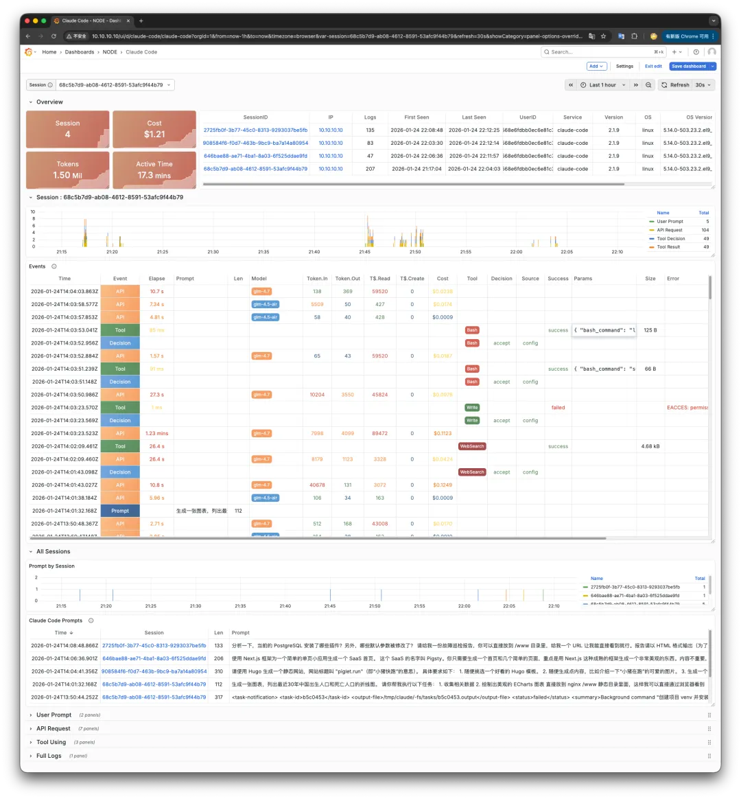
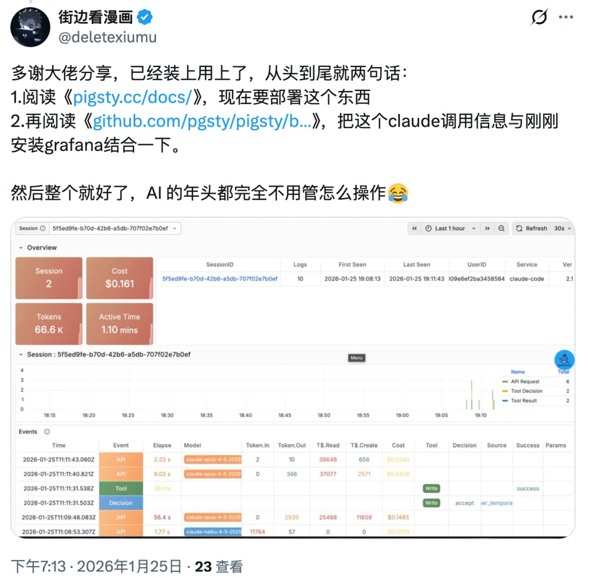
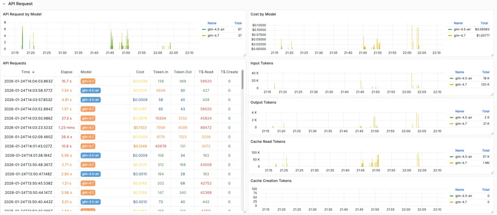
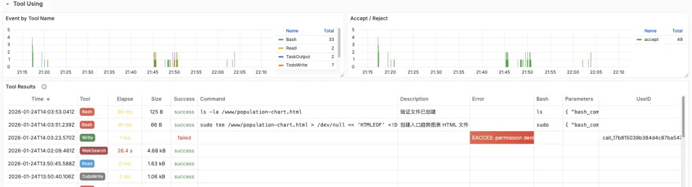
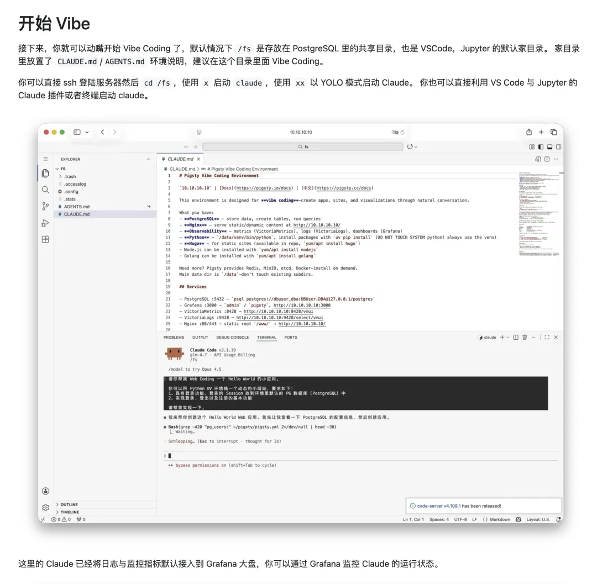
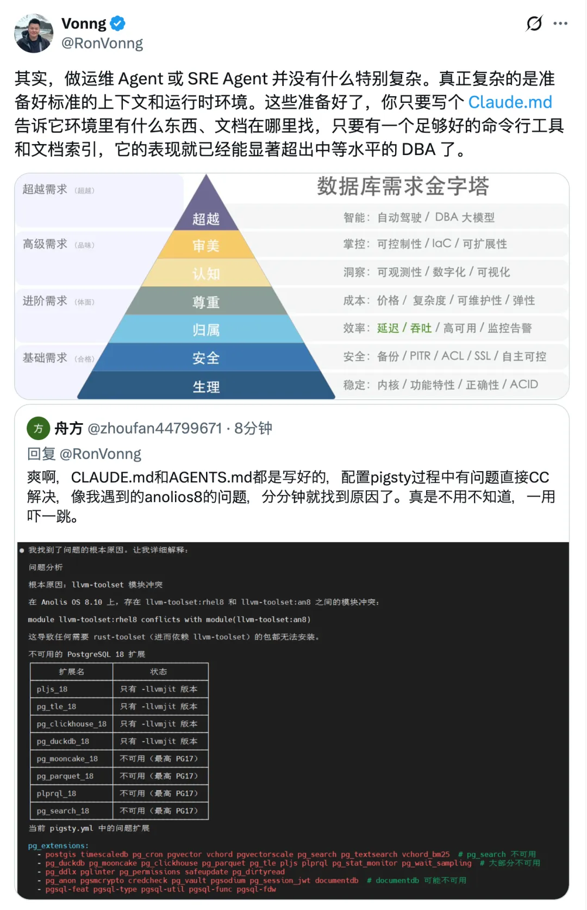

Yesterday I [tweeted](https://x.com/RonVonng/status/2014972720489091514): "Built a Claude Code Grafana dashboard to see how it makes decisions, uses tools, and burns through API credits." Didn't expect so much interest.


So let's talk about Claude Code observability.

---

## Why Observability?

Simple idea: I want to understand Claude Code's internals. It's not open source ([well, it was leaked once](https://mp.weixin.qq.com/s/xaeVafPxUfAgQSzl-n3w2w)), but you can reverse-engineer its behavior through metrics and logs.



Claude Code exports OTEL-format metrics and logs. Config is straightforward — set a few env vars and it pushes to any OTEL-compatible backend. Then visualize with Grafana.

```bash
# Claude Code OTEL config
export CLAUDE_CODE_ENABLE_TELEMETRY=1             # Enable telemetry
export OTEL_METRICS_EXPORTER=otlp
export OTEL_LOGS_EXPORTER=otlp
export OTEL_EXPORTER_OTLP_PROTOCOL=http/protobuf
export OTEL_LOG_USER_PROMPTS=1                    # Set to 0 to hide prompts
export OTEL_RESOURCE_ATTRIBUTES="job=claude"      # Add your own labels
export OTEL_EXPORTER_OTLP_METRICS_ENDPOINT=http://10.10.10.10:8428/opentelemetry/v1/metrics     # VictoriaMetrics
export OTEL_EXPORTER_OTLP_LOGS_ENDPOINT=http://10.10.10.10:9428/insert/opentelemetry/v1/logs    # VictoriaLogs
export OTEL_EXPORTER_OTLP_METRICS_TEMPORALITY_PREFERENCE=cumulative
```

> Put this in `.bash_profile`, `/etc/profile.d/claude.sh`, or the `env` field in `~/.claude/settings.json`.

The hard part: where do you get a monitoring stack and Grafana? Seeing the demand, I built a turnkey config template.

---

## The Monitoring Stack

Grab a Linux box, run a few commands, and you get a complete Claude Code environment with everything pre-configured — including monitoring. Or just point your existing Claude Code at it.


Here's the thing: if you already use Claude Code, you don't need to understand the details. Just tell it "there's this thing that does this" and give it a VM. It'll figure out the rest. Saw someone in the comments say exactly that:



---

## Event Types

- [Claude Code observability docs](https://code.claude.com/docs/en/monitoring-usage)

The dashboard is simple: select a session ID at the top, events appear below. Drag the timeline to see what happened during task execution.

Four main event types:

1. **User Prompt**: What you said or the prompt you gave
2. **API Request**: Calls to the model API
3. **Tool Decision**: System decides which tool to use
4. **Tool Result**: What the tool returned

Each event has its own fields. One glance at the dashboard and you understand the entire task flow.

Example: the simplest event is User Prompt. Send Claude Code a message, get an event:


After **User Prompt** comes **API Request** — the model call. Note the `model` field: Claude Code distinguishes between fast and quality models. Here I'm using GLM-4.7 as an example; simple quick requests go to GLM-4.5-air.

API Request has key fields: `Cost`, plus four token metrics. `Token.In/Out` for input/output tokens, `Token Cache Read` for cache hits.



After **API Request** comes **Tool Decision**: which tool to use. Bash, Read, Write, Search, etc. Includes `Decision Source/Result` — what criteria (config file, user prompt, etc.) led to "approve" or "reject."

After **Tool Decision** comes **Tool Result**. The key tool execution event. Fields include: command, description, error, arguments, user ID, success status.



There are other event types, but these four are the main ones. More details: https://docs.anthropic.com/en/docs/claude-code/monitoring

---

## The Sandbox

"Give a man a fish vs. teach a man to fish" — I know. But theory without a working example is useless. So I built a turnkey sandbox with a complete Victoria monitoring stack and Grafana dashboards. Spin it up on any 1C2G Linux VM in minutes.

Beyond Claude Code monitoring, this sandbox does more. It comes pre-configured with common web coding tools: Claude Code, VS Code, Open Code. Includes PostgreSQL and Nginx. Need a cloud dev environment? This works.



You can also use GLM models without VPN — just add one config line. The beauty of Claude Code: if you're already using it, you don't need to sweat the details. **Just tell it what you want and let it vibe.**

```yaml
# Switch to other models, e.g., GLM 4.7
claude_env:
  ANTHROPIC_BASE_URL: https://open.bigmodel.cn/api/anthropic
  ANTHROPIC_API_URL: https://open.bigmodel.cn/api/anthropic
  ANTHROPIC_AUTH_TOKEN: your_api_service_token  # Your API key
  ANTHROPIC_MODEL: glm-4.7
  ANTHROPIC_SMALL_FAST_MODEL: glm-4.5-air
```

The real power of PIGLET.RUN: provide deterministic infrastructure, and Claude Code can handle most of the work. It plays the role of a mid-level DBA or developer — writing code, debugging, testing, deploying. Extremely productive. I'll write a dedicated DBA Agent post later.


