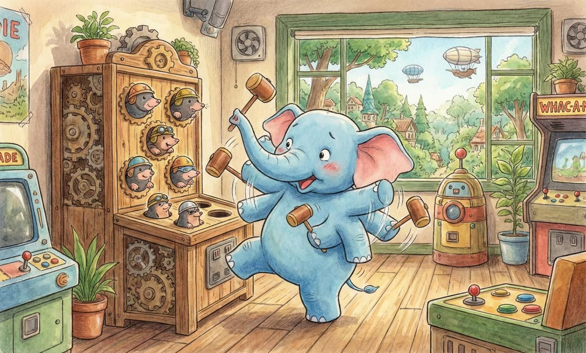
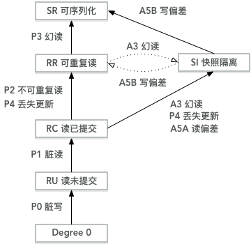
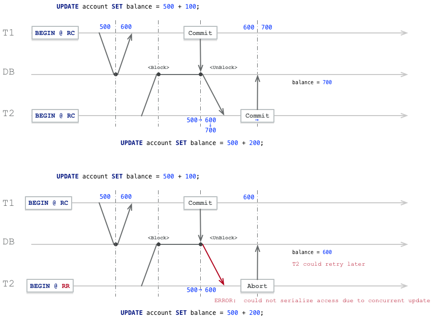
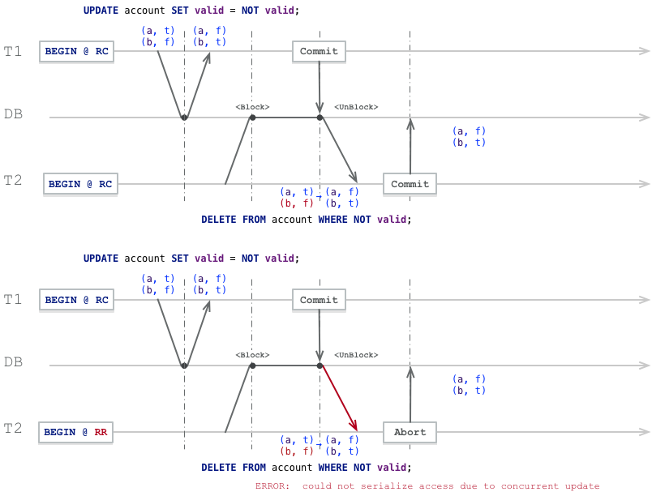

Concurrent programs are hard to write correctly and even harder to write well. Many programmers haven't truly figured out these problems - they just dump them all on the database. Concurrency anomalies aren't just theoretical problems: these anomalies have caused significant financial losses and consumed countless hours of financial auditors' efforts. But even the most popular and powerful relational databases (usually considered "ACID" databases) use weak isolation levels, so they may not prevent these concurrency anomalies from occurring.

Rather than blindly relying on tools, we should have a deep understanding of the types of concurrency problems that exist and how to prevent them. This article will explain the isolation levels defined in the SQL92 standard and their flaws, as well as isolation levels in modern models and the anomalous phenomena that define these levels.

[](https://mp.weixin.qq.com/s/xw_rwxXgIuCL-pcRZHF03w)

-------------

## 0x01 Introduction

Most databases are accessed by multiple clients simultaneously. If they each read and write different parts of the database, this is fine, but if they access the same database records, they may encounter **concurrency anomalies**.

The diagram below shows a simple concurrency anomaly case: two clients simultaneously increment a counter in the database. (Assuming the database has no auto-increment operation) Each client needs to read the current value of the counter, add 1, and write back the new value. Because there are two increment operations, the counter should increase from 42 to 44; but due to concurrency anomalies, it actually only increases to 43.


> **Figure: Race condition between two clients simultaneously incrementing a counter**

The I in transaction ACID properties, namely **Isolation**, is designed to solve this problem. Isolation means that **concurrently executing transactions are isolated from each other**: they cannot step on each other. Traditional database textbooks formalize **isolation** as **serializability**, which means each transaction can pretend it's the only one running on the entire database. The database ensures that when transactions have committed, the result is the same as if they ran sequentially (one after another), even though they may actually run concurrently.

If two transactions don't touch the same data, they can safely run **in parallel**, since neither depends on the other. Concurrency problems (race conditions) only arise when one transaction reads data being simultaneously modified by another transaction, or when two transactions try to **simultaneously** modify the same data. There are no problems between read-only transactions, but as soon as at least one transaction involves writes, **conflicts** or concurrency anomalies may occur.

Concurrency anomalies are hard to find through testing because such errors only trigger under special timing conditions. Such timing may be rare and often difficult to reproduce. It's also hard to reason about concurrency problems, especially in large applications where you may not know if other application code is accessing the database. Application development is already troublesome with just one user at a time; having many concurrent users makes it much more difficult because any data can change at any time.

For this reason, databases have long tried to hide concurrency problems from application development by providing **transaction isolation**. Theoretically, isolation can make programmers' lives easier by pretending no concurrency occurs: **serializable** isolation level means the database guarantees that transaction effects are equivalent to actual serial execution (i.e., one transaction at a time, without any concurrency).

Unfortunately, isolation isn't that simple in practice. **Serializability** has performance costs, and many databases and applications are unwilling to pay this price. Therefore, systems usually use **weaker isolation levels** to prevent some, but not all, concurrency problems. These weak isolation levels are difficult to understand and can lead to subtle bugs, but they're still used in practice. Some popular databases like Oracle 11g don't even implement serializability. Oracle has an isolation level called "serializable", but it actually implements something called **snapshot isolation**, **which provides weaker guarantees than serializability**.

Before studying real-world concurrency anomalies, let's first review the transaction isolation levels defined by the SQL92 standard.

-------------

## 0x02 SQL92 Standard

According to the ANSI SQL92 standard, three **phenomena** distinguish four isolation levels, as shown in the table below:

| Isolation Level | Dirty Write P0 | Dirty Read P1 | Non-repeatable Read P2 | Phantom P3 |
|:------:|:----:|:-----:|:--------:|:-----:|
| Read Uncommitted RU | ✅ | ⚠️ | ⚠️ | ⚠️ |
| Read Committed RC | ✅ | ✅ | ⚠️ | ⚠️ |
| Repeatable Read RR | ✅ | ✅ | ✅ | ⚠️ |
| Serializable SR | ✅ | ✅ | ✅ | ✅ |

* Four **phenomena** are abbreviated as P0, P1, P2, P3, where P is the first letter of **Phenomena**.
* **Dirty write** is not specified in the standard, but is an anomaly that any isolation level must avoid

These four anomalies can be summarized as follows:

**P0 Dirty Write**

Transaction T1 modifies a data item, and another transaction T2 modifies the data item that T1 modified before T1 commits or rolls back.

In any case, transactions must avoid this situation.

**P1 Dirty Read**

Transaction T1 modifies a data item, and another transaction T2 reads this data item before T1 commits or rolls back.

If T1 chooses to roll back, then T2 actually read a data item that doesn't exist (uncommitted).

**P2 Non-repeatable or Fuzzy Read**

Transaction T1 reads a data item, then another transaction T2 modifies or deletes that data item and commits.

If T1 tries to re-read that data item, it will see the modified value or find the value has been deleted.

**P3 Phantom**

Transaction T1 reads a set of data items satisfying some **search condition**, and transaction T2 **creates** new data items satisfying that search condition and commits.

If T1 queries again using the same *search condition*, it will get different results from the first query.

### Problems with the Standard

The SQL92 standard's definition of isolation levels is **flawed** - vague, imprecise, and not implementation-independent as standards should be. The standard actually targets lock-based scheduling implementations, making MVCC-based implementations difficult to categorize. Several databases implement "repeatable read", but the guarantees they actually provide vary greatly. Despite appearing standardized on the surface, no one really knows what **repeatable read** means.

The standard has other problems, such as P3 only mentioning creation/insertion cases, but actually any write can cause anomalous phenomena. Additionally, the standard is vague about **serializability**, only saying "the SERIALIZABLE isolation level must guarantee what is commonly known as fully serializable execution".

> ### Phenomena vs Anomalies
>
> **Phenomena** and **anomalies** are not the same. **Phenomena** are not necessarily **anomalies**, but **anomalies** are definitely **phenomena**. For example, in the dirty read case, if T1 rolls back and T2 commits, this is definitely an **anomaly**: seeing something that doesn't exist. But regardless of whether T1 and T2 choose to roll back or commit, this is a **phenomenon** that could lead to dirty reads. Generally speaking, **anomalies** are strict interpretations, while **phenomena** are broad interpretations.

-------------

## 0x03 Modern Model

In contrast, modern isolation and consistency levels provide clearer explanations of this problem, as shown in the figures:



> **Figure: Isolation level partial order diagram**


> **Figure: Consistency and isolation level partial order**

The right subtree mainly discusses consistency levels under multi-replica scenarios, which we'll skip. For convenience, this diagram removes MAV, CS, I-CI, P-CI and other isolation levels, mainly focusing on **snapshot isolation SI**.

**Table: Various isolation levels and their possible anomalous phenomena**

| Level\Phenomenon | P0 | P1 | P4C | P4 | P2 | P3 | A5A | A5B |
|----------|:--:|:--:|:---:|:---:|:---:|:--:|:---:|:---:|
| Read Uncommitted RU | ✅ | ⚠️ | ⚠️ | ⚠️ | ⚠️ | ⚠️ | ⚠️ | ⚠️ |
| Read Committed RC | ✅ | ✅ | ⚠️ | ⚠️ | ⚠️ | ⚠️ | ⚠️ | ⚠️ |
| Cursor Stability CS | ✅ | ✅ | ✅ | ⚠️? | ⚠️? | ⚠️ | ⚠️ | ⚠️? |
| Repeatable Read RR | ✅ | ✅ | ✅ | ✅ | ✅ | ⚠️ | ✅ | ✅ |
| Snapshot Isolation SI | ✅ | ✅ | ✅ | ✅ | ✅ | ✅? | ✅ | ⚠️ |
| Serializable SR | ✅ | ✅ | ✅ | ✅ | ✅ | ✅ | ✅ | ✅ |

> Items marked with ? indicate possible anomalies, depending on specific implementation.

### Actual Isolation Levels of Mainstream Relational Databases

Correspondingly, mapping the isolation levels that mainstream relational databases claim for "standard compatibility" to the modern isolation level model:

**Table: Comparison between claimed and actual isolation levels of mainstream relational databases**

| Actual\Claimed | PostgreSQL/9.2+ | MySQL/InnoDB | Oracle(11g) | SQL Server |
|---------|:---------------:|:------------:|:-----------:|:----------:|
| Read Uncommitted RU | | RU | | RU |
| Read Committed RC | RC | RC, RR | RC | RC |
| Repeatable Read RR | | | | RR |
| Snapshot Isolation SI | RR | | SR | SI |
| Serializable SR | SR | SR | | SR |

### PostgreSQL Example

If we look at the **ANSI SQL92 standard**, PostgreSQL actually only has two isolation levels: RC and SR.

| Isolation Level | Dirty Read P1 | Non-repeatable Read P2 | Phantom P3 |
|-------|:-----:|:--------:|:-----:|
| RU, RC | ✅ | ⚠️ | ⚠️ |
| RR, SR | ✅ | ✅ | ✅ |

Among them, P2 and P3 anomalies may occur in RU and RC isolation levels. While RR and SR can avoid all P1, P2, P3 anomalies.

Of course, if we follow the modern isolation level model, PostgreSQL's RR isolation level is actually snapshot isolation SI, which cannot solve the A5B write skew problem. Only after introducing **Serializable Snapshot Isolation SSI** in version 9.2 did it have true SR:

| Claimed | Actual | P2 | P3 | A5A | P4 | A5B |
|:--:|:--:|:--:|:--:|:---:|:--:|:---:|
| RC | RC | ⚠️ | ⚠️ | ⚠️ | ⚠️ | ⚠️ |
| RR | SI | ✅ | ✅ | ✅ | ✅ | ⚠️ |
| SR | SR | ✅ | ✅ | ✅ | ✅ | ✅ |

As a rough understanding, RC level can be viewed as statement-level snapshots, while RR level can be viewed as transaction-level snapshots.

### MySQL Example

MySQL's RR isolation level is considered not to provide true snapshot isolation/repeatable read because it cannot prevent lost update problems.

| Claimed | Actual | P2 | P3 | A5A | P4 | A5B |
|:--:|:--:|:--:|:--:|:---:|:--:|:---:|
| RC | RC | ⚠️ | ⚠️ | ⚠️ | ⚠️ | ⚠️ |
| RR | RC | ✅ | ✅? | ✅ | ⚠️ | ⚠️ |
| SR | SR | ✅ | ✅ | ✅ | ✅ | ✅ |

Reference test cases: [ept/hermitage/mysql](ept/hermitage/mysql)

-------------

## 0x04 Concurrency Anomalies


Looking back at this diagram, each anomaly level is precisely defined by the anomalies that may occur. If all anomalies that appear in isolation level A do not appear in isolation level B, we consider isolation level A weaker than isolation level B. But if some anomalies appear in level A but are avoided in level B, while other anomalies appear in level B but are avoided in A, these two isolation levels cannot be compared in strength.

For example, in this diagram: RR and SI are clearly stronger than RC. But the relative strength between RR and SI is difficult to compare. SI can avoid phantom reads P3 that may occur in RR, but will have write skew A5B problems; RR won't have write skew A5B, but may have P3 phantom reads.

Preventing dirty writes and dirty reads can be simply prevented by read locks and write locks on data items, formalized as:

```
P0: w1[x]...w2[x]...((c1 or a1) and (c2 or a2)) in any order)

P1: w1[x]...r2[x]...((c1 or a1) and (c2 or a2)) in any order)
A1: w1[x]...r2[x]...(a1 and c2 in any order)
```

Because most databases use RC as the default isolation level, anomalies like dirty write P0 and dirty read P1 are usually rarely encountered, so we won't elaborate.

Below, using PostgreSQL as an example, we'll introduce several concurrency anomalous phenomena that may occur under normal circumstances:

* P2: Non-repeatable read
* P3: Phantom read
* A5A: Read skew
* P4: Lost update
* A5B: Write skew

These five anomalies have two classification methods. First, they can be classified by isolation level.

* P2, P3, A5A, P4 are anomalies that occur in RC but not in RR; A5B occurs in RR but not in SR.

The second classification method is by conflict type: conflicts between read-only transactions and read-write transactions, and conflicts between read-write transactions.

* P2, P3, A5A are concurrency anomalies between read transactions and write transactions, while P4 and A5B are concurrency anomalies between read-write transactions.

### Read-Write Anomalies

Let's first consider a relatively simple case: conflicts between a read-only transaction and a read-write transaction. For example:

* P2: Non-repeatable read
* A5A: Read skew (a common non-repeatable read problem)
* P3: Phantom read

In PostgreSQL, these three anomalies all occur at RC isolation level, but using RR (actually SI) isolation level won't have these problems.

### Non-repeatable Read P2

Suppose we have an account table storing users' bank account balances, where id is the user identifier and balance is the account balance, defined as follows:

```sql
CREATE TABLE account(
    id      INTEGER PRIMARY KEY,
    balance INTEGER
);
```

For example, in transaction 1, two identical queries are performed before and after, but between the two queries, transaction 2 writes and commits, resulting in different query results.

```sql
START TRANSACTION ISOLATION LEVEL READ COMMITTED; -- T1, RC, read-only
START TRANSACTION ISOLATION LEVEL READ COMMITTED; -- T2, RC, read-write

SELECT * FROM account WHERE k = 'a';  -- T1, query account a, see no results
INSERT INTO account VALUES('a', 500); -- T2, insert record (a,500)
COMMIT; -- T2, commit

SELECT * FROM account WHERE id = 'a'; -- T1, repeat query, get result (a,500)
COMMIT; -- T1 is confused, why do identical queries have different results?
```

For transaction 1, executing the same query within the same transaction actually produces different results, meaning the read results are **not repeatable**. This is an example of non-repeatable read, phenomenon **P2**. This occurs in PostgreSQL's RC level, but if we set transaction T1's isolation level to RR, this problem won't occur:

```sql
START TRANSACTION ISOLATION LEVEL REPEATABLE READ; -- T1, RR, read-only
START TRANSACTION ISOLATION LEVEL READ COMMITTED;  -- T2, RC, read-write

SELECT * FROM counter WHERE k = 'x'; -- T1, query returns no results
INSERT INTO counter VALUES('x', 10); -- T2, insert record (x,10) @ RR
COMMIT; -- T2, commit

SELECT * FROM counter WHERE k = 'x'; -- T1, still returns no results
COMMIT; -- T1, under RR, two query results remain consistent.
```

Formal representation of non-repeatable read:

```c
P2: r1[x]...w2[x]...((c1 or a1) and (c2 or a2) in any order)
A2: r1[x]...w2[x]...c2...r1[x]...c1
```

### Read Skew A5A

Another type of read-write anomaly is **read skew (A5A)**: Consider an intuitive example where a user has two accounts: a and b, each with 500 yuan.

```sql
-- Suppose there's an account table, user has two accounts a, b, each with 500 yuan.
CREATE TABLE account(
    id      INTEGER PRIMARY KEY,
    balance INTEGER
);
INSERT INTO account VALUES('a', 500), ('b', 500);
```

Now the user submits a request to transfer 100 yuan from account b to account a, and checks their account balance from the webpage. At RC isolation level, the following operation history might confuse the user:

```sql
START TRANSACTION ISOLATION LEVEL READ COMMITTED; -- T1, RC, read-only, user observation
START TRANSACTION ISOLATION LEVEL READ COMMITTED; -- T2, RC, read-write, system transfer

SELECT * FROM account WHERE id = 'a'; -- T1, user queries account a, 500 yuan

UPDATE account SET balance -= 100 WHERE id = 'b'; -- T2, system deducts 100 yuan from account b
UPDATE account SET balance += 100 WHERE id = 'a'; -- T2, system adds 100 yuan to account a
COMMIT; -- T2, system transfer transaction commits

SELECT * FROM account WHERE id = 'a'; -- T1, user queries account b, 400 yuan
COMMIT; -- T1, user is confused, why is my total balance (400+500) missing 100 yuan?
```

In this example, the read-only transaction **read an inconsistent snapshot of the system**. This phenomenon is called **read skew**, denoted as A5A. But actually, the root cause of read skew is non-repeatable read. As long as P2 is avoided, A5A can naturally be avoided.

But read skew is a very common problem. In some scenarios, we want consistent state snapshots, and read skew is unacceptable. A typical scenario is **backup**. Usually for large databases, backup takes several hours. While the backup process runs, the database still accepts write operations. Therefore, if read skew exists, the backup might contain some old parts and some new parts. If restoring from such a backup, inconsistencies (like missing money) become permanent. Additionally, some long-running analytical queries usually want to run on consistent snapshots. If a query sees different things at different times, the returned results may be meaningless.

Snapshot isolation is the most common solution to this problem. PostgreSQL's RR isolation level is actually snapshot isolation, providing transaction-level consistent snapshot functionality. For example, if we set T1's isolation level to repeatable read, this problem won't occur.

```sql
START TRANSACTION ISOLATION LEVEL REPEATABLE READ; -- T1, RR, read-only, user observation
START TRANSACTION ISOLATION LEVEL READ COMMITTED;  -- T2, RC, read-write, system transfer

SELECT * FROM account WHERE id = 'a'; -- T1 user queries account a, 500 yuan

UPDATE account SET balance -= 100 WHERE id = 'b'; -- T2 system deducts 100 yuan from account b
UPDATE account SET balance += 100 WHERE id = 'a'; -- T2 system adds 100 yuan to account a
COMMIT; -- T2, system transfer transaction commits

SELECT * FROM account WHERE id = 'a'; -- T1 user queries account b, 500 yuan
COMMIT; -- T1 doesn't observe T2's write results {a:600,b:400}, but observes a consistent snapshot.
```

Formal representation of read skew:

```c
A5A: r1[x]...w2[x]...w2[y]...c2...r1[y]...(c1 or a1)
```

### Phantom Read P3

In ANSI SQL92, phantom read is the phenomenon used to distinguish RR and SR. It's often confused with non-repeatable read P2. The only difference is whether a **predicate** (Where condition) is used when reading columns. Changing the previous example from querying account existence to counting accounts meeting specific conditions becomes a so-called "phantom read" problem.

```sql
START TRANSACTION ISOLATION LEVEL READ COMMITTED; -- T1, RC, read-only
START TRANSACTION ISOLATION LEVEL READ COMMITTED; -- T2, RC, read-write

SELECT count(*) FROM account WHERE balance > 0;  -- T1, query number of accounts with deposits. 0
INSERT INTO account VALUES('a', 500); -- T2, insert record (a,500)
COMMIT; -- T2, commit

SELECT count(*) FROM account WHERE balance > 0;  -- T1, query number of accounts with deposits. 1
COMMIT; -- T1 is confused, where did this person come from?
```

Similarly, after transaction 1 uses PostgreSQL's RR isolation level, transaction 1 won't see changes in results satisfying predicate P.

```sql
START TRANSACTION ISOLATION LEVEL REPEATABLE READ; -- T1, RR, read-only
START TRANSACTION ISOLATION LEVEL READ COMMITTED;  -- T2, RC, read-write

SELECT count(*) FROM account WHERE balance > 0;  -- T1, query number of accounts with deposits. 0
INSERT INTO account VALUES('a', 500); -- T2, insert record (a,500)
COMMIT; -- T2, commit

SELECT count(*) FROM account WHERE balance > 0;  -- T1, query number of accounts with deposits. 0
COMMIT; -- T1, read consistent snapshot (though not the freshest)
```

This rather trivial distinction exists because lock-based isolation level implementations often need additional predicate lock mechanisms to solve this special type of read-write conflict problem. But MVCC-based implementations, using PostgreSQL's SI as an example, naturally solve all these problems in one step.

Formal representation of phantom read:

```
P3: r1[P]...w2[y in P]...((c1 or a1) and (c2 or a2) any order)
A3: r1[P]...w2[y in P]...c2...r1[P]...c1
```

Phantom reads occur in MySQL's RC and RR isolation levels, but not in PostgreSQL's RR isolation level (actually SI).

### Write-Write Anomalies

The above sections discussed anomalies that read-only transactions might encounter during concurrent writes. Usually these read anomalies might disappear with a retry, but if writes are involved, the problem becomes more serious, because the temporarily inconsistent state read might become permanent through writes...

So far we've only discussed what read-only transactions can see during concurrent writes. If two transactions execute writes concurrently, there can be more interesting write-write anomalies:

* **P4: Lost Update**: Exists in PostgreSQL's RC level, doesn't exist in RR level (exists in MySQL's RR).
* **A5B: Write Skew**: Exists in PostgreSQL's RR isolation level.

Among them, **write skew (A5B)** can be viewed as a generalized case of **lost update (P4)**. **Snapshot isolation** can solve **lost update** problems but cannot solve **write skew** problems. Solving **write skew** requires **true serializable** isolation level.

### Lost Update P4 - Example 1

Still using the account table from above, suppose there's an account x with balance 500 yuan.

```sql
CREATE TABLE account(
    id      TEXT PRIMARY KEY,
    balance INTEGER
);
INSERT INTO account VALUES('x', 500);
```

Two transactions T1, T2 want to deposit money into this account, say 100 and 200 respectively. From a sequential execution perspective, regardless of which transaction executes first, the final result should be balance = 500 + 200 + 100 = 800.

```sql
START TRANSACTION ISOLATION LEVEL READ COMMITTED; -- T1
START TRANSACTION ISOLATION LEVEL READ COMMITTED; -- T2

SELECT balance FROM account WHERE id = 'x'; -- T1, query current balance = 500
SELECT balance FROM account WHERE id = 'x'; -- T2, query current balance = 500

UPDATE account SET balance = 500 + 100; -- T1, add 100 yuan to original balance
UPDATE account SET balance = 500 + 200; -- T2, add 200 yuan to original balance, blocked by T1.

COMMIT; -- T1, before commit can see balance as 600. After T1 commits, T2's block is released, T2 performs update.
COMMIT; -- T2, T2 commits, before commit can see balance as 700
-- Final result is 700
```

But the wonderful timing led to unexpected results - the final account balance is 700 yuan, transaction 1's transfer update was lost!

But surprisingly, both transactions saw UPDATE 1 update results, both checked their update results were correct, both received successful transaction commit confirmations. Yet transaction 1's update was lost - this is quite awkward. At minimum, transactions should know this problem might occur, rather than just letting it slide.

If using RR isolation level (mainly T2, T1 can be RC, but for symmetry preferably both use RR), the later-executing update statement will error and abort the transaction. This allows the application to know better and retry.

```sql
START TRANSACTION ISOLATION LEVEL REPEATABLE READ;  -- T1, RC is also okay here
START TRANSACTION ISOLATION LEVEL REPEATABLE READ;  -- T2, key is T2 must be RR

SELECT balance FROM account WHERE id = 'x'; -- T1, query current balance = 500
SELECT balance FROM account WHERE id = 'x'; -- T2, query current balance = 500

UPDATE account SET balance = 500 + 100; -- T1, add 100 yuan to original balance
UPDATE account SET balance = 500 + 200; -- T2, add 200 yuan to original balance, blocked by T1.

COMMIT; -- T1, before commit can see balance as 600. After T1 commits, T2's block is released
-- T2 Update errors: ERROR: could not serialize access due to concurrent update

ROLLBACK; -- T2, T2 can only rollback
-- Final result is 600, but T2 knows the error and can retry, eventually achieving correct result 800 in a non-competitive environment.
```



Of course, we can see that in the RC isolation level case, when T1 commits and releases T2's block, the Update operation can already see T1's changes (balance=600). But transaction 2 still used its previously calculated increment value to overwrite T1's write. For this special case, atomic operations can be used, for example: `UPDATE account SET balance = balance + 100;`. Such statements can correctly update accounts concurrently even at RC isolation level. But not all problems can be simple enough to solve with atomic operations - let's look at another example.

### Lost Update P4 - Example 2

Let's look at a more subtle example: conflict between `UPDATE` and `DELETE`.

Suppose business rules allow each person at most two accounts, users can choose at most one account as valid, and administrators periodically delete invalid accounts.

The account table has a field valid indicating whether the account is valid, defined as shown:

```sql
CREATE TABLE account(
    id      TEXT PRIMARY KEY,
    valid   BOOLEAN
);
INSERT INTO account VALUES('a', TRUE), ('b', FALSE);
```

Now consider this situation: a user wants to switch their valid account while an administrator wants to clean up invalid accounts.

From a sequential execution perspective, regardless of whether the user switches first or the administrator cleans first, the common result is: one account will always be deleted.

```sql
START TRANSACTION ISOLATION LEVEL READ COMMITTED;  -- T1, user changes valid account
START TRANSACTION ISOLATION LEVEL READ COMMITTED;  -- T2, administrator deletes account

UPDATE account SET valid = NOT valid; -- T1, atomic operation, flips valid/invalid account status
DELETE FROM account WHERE NOT valid;  -- T2, administrator deletes invalid accounts.

COMMIT; -- T1, commits, T1 commit releases T2's block
-- T2 DELETE executes, returns DELETE 0

COMMIT; -- T2, T2 can commit normally, but checking shows it didn't delete any records.
-- Regardless of whether T2 chooses commit or rollback, final result is (a,f),(b,t)
```

From the diagram below, we can see transaction 2's DELETE originally locked row `(b,f)` for deletion but was blocked by transaction 1's concurrent update. When T1 commits and releases T2's block, transaction 2 sees transaction 1's commit result: the row it locked no longer meets the deletion condition, so it has to abandon deletion.



Correspondingly, using RR isolation level at least gives T2 knowledge of the error, and retrying at appropriate timing can achieve sequential execution effects.

```sql
START TRANSACTION ISOLATION LEVEL REPEATABLE READ;  -- T1, user changes valid account
START TRANSACTION ISOLATION LEVEL REPEATABLE READ;  -- T2, administrator deletes account

UPDATE account SET valid = NOT valid; -- T1, atomic operation, flips valid/invalid account status
DELETE FROM account WHERE NOT valid;  -- T2, administrator deletes invalid accounts.

COMMIT; -- T1, commits, T1 commit releases T2's block
-- T2 DELETE errors: ERROR: could not serialize access due to concurrent update
ROLLBACK; -- T2, T2 can only rollback
```

### SI Isolation Level Summary

The above-mentioned anomalies, including P2, P3, A5A, P4, all occur in RC but not in SI. Particularly note that P3 phantom read problems occur in RR but not in SI. In ANSI standard terms, SI can be considered serializable. SI solves problems in one word: providing true **transaction-level snapshots**. Therefore, various read-write anomalies (P2, P3, A5A) won't appear anymore. Moreover, SI can also solve **lost update (P4)** problems (MySQL's RR can't solve this).

Lost update is a **very common** problem, so there are quite a few ways to deal with it. Typical methods include: atomic operations, explicit locking, conflict detection. Atomic operations are usually the best solution, provided your logic can be expressed with atomic operations. If the database's built-in atomic operations don't provide necessary functionality, another choice to prevent lost updates is for applications to **explicitly lock** objects to be updated. Then the application can execute read-modify-write sequences, forcing other transactions attempting to read the same object simultaneously to wait until the first **read-modify-write sequence** completes. (e.g., MySQL and PostgreSQL's `SELECT FOR UPDATE` clause)

Another approach to dealing with lost updates is automatic conflict detection. If the transaction manager detects lost updates, it aborts transactions and forces them to retry their **read-modify-write sequences**. An advantage of this approach is that databases can efficiently perform this check combined with snapshot isolation. In fact, PostgreSQL's repeatable read, Oracle's serializable, and SQL Server's snapshot isolation levels all automatically detect lost updates and abort problematic transactions. However, MySQL/InnoDB's repeatable read doesn't detect **lost updates**. Some experts believe databases must prevent lost updates to be called providing **snapshot isolation**, so under this definition, MySQL doesn't provide snapshot isolation.

But as the saying goes, "success and failure both due to snapshots" - each transaction can see consistent snapshots, but this brings some additional problems. At SI level, a problem called **write skew (A5B)** can still occur: for example, two transactions based on stale snapshots update data that each other read, only to discover after commit that constraints were violated. **Lost update** is actually a special case of **write skew**: two write transactions compete to write the same record. Competing writes to the same data can be detected by the database's **lost update detection** mechanism, but what if two transactions based on their snapshots write different data items?

### Write Skew A5B

Consider an on-call duty example: Internet companies usually require several operations staff on duty simultaneously, but the bottom line is at least one person on duty. Operations staff can skip shifts as long as at least one colleague is on duty:

```sql
CREATE TABLE duty (
  name   TEXT PRIMARY KEY,
  oncall BOOLEAN
);

-- Alice and Bob are both on duty
INSERT INTO duty VALUES ('Alice', TRUE), ('Bob', True);
```

Suppose the application logic constraint is: no one being on duty isn't allowed. That is: `SELECT count(*) FROM duty WHERE oncall` value must be greater than 0. Now suppose operations staff A and B are both on duty, both feel unwell and decide to take leave. Unfortunately both press the skip-duty button simultaneously. The following execution sequence will lead to anomalous results:

```sql
START TRANSACTION ISOLATION LEVEL REPEATABLE READ;  -- T1, Alice
START TRANSACTION ISOLATION LEVEL REPEATABLE READ;  -- T2, Bob

SELECT count(*) FROM duty WHERE oncall; -- T1, query current on-duty count, 2
SELECT count(*) FROM duty WHERE oncall; -- T2, query current on-duty count, 2

UPDATE duty SET oncall = FALSE WHERE name = 'Alice'; -- T1, thinking others are on duty, Alice skips
UPDATE duty SET oncall = FALSE WHERE name = 'Bob';   -- T2, also thinking others are on duty, Bob skips

COMMIT; -- T1
COMMIT; -- T2

SELECT count(*) FROM duty; -- Observer, result is 0, no one is on duty!
```

Both transactions saw the same consistent snapshot, first checked skip conditions, found two operations staff on duty, so skipping themselves is okay, then updated their duty status and committed. After both transactions committed, no operations staff are on duty, violating application-defined consistency.

But if the two transactions didn't execute **simultaneously (concurrently)** but had sequential order, the later transaction would find skip conditions weren't met during checking and terminate. Therefore, concurrency between transactions caused anomalous phenomena.

For transactions, they clearly saw 2 people on duty before executing skip operations, saw 1 person on duty after executing skip operations, but why did they see 0 after commit? This is like seeing illusions, but this isn't the same as **phantom read** defined by SQL92 standard. The standard-defined phantom read is due to unclean non-repeatable read issues, reading things that shouldn't be read (non-repeatable reads for predicate queries), while here it's because snapshots exist, transactions can't realize the records they read have been changed.

The key issue is **read-write dependencies between different read-write transactions**. If a transaction reads some data as premises for action, then if when the transaction performs subsequent write operations, those read rows have been modified by other transactions, this means **the premises the transaction depends on may have changed**.

Formal representation of write skew:

```c#
A5B: r1[x]...r2[y]...w1[y]...w2[x]...(c1 and c2 occur)
```

#### Common Characteristics of Such Problems

Transactions take action based on a **premise** (facts at transaction start, e.g., "currently two operations staff are on duty"). Later when transactions want to commit, original data may have changed - premises may no longer hold.

1. A `SELECT` query finds rows meeting conditions and checks whether some constraints are satisfied (at least two operations staff on duty).

2. Based on first query results, application code decides whether to continue. (May continue operation or abort with error)

3. If the application decides to continue, it executes writes (insert, update, or delete) and commits the transaction.

   **This write's effect changes the precondition in step 2.** In other words, if repeating step 1's SELECT query after committing the write, different results would be obtained. Because writes change the set of rows meeting search conditions (only one operations staff on duty).

In SI, each transaction has its own consistent snapshot. But SI doesn't provide **linearizability (strong consistency)** guarantees. The snapshot copy transactions see may become *stale* due to other transactions' writes, but writes in transactions can't realize this.

#### Connection with Lost Updates

As a special case, if different read-write transactions write to the **same data object**, this becomes the **lost update problem**. Usually occurs in RC, avoided in RR/SI isolation levels. Concurrent writes to the same object can be detected by databases, but if writing to different data objects, violating application logic-defined constraints, then databases at RR/SI isolation levels are powerless.

#### Solutions

There are many solutions to deal with these problems. Serializability is certainly okay, but there are other methods, such as **locks**.

##### Explicit Locking

```sql
START TRANSACTION ISOLATION LEVEL REPEATABLE READ;  -- T1, user changes valid account
START TRANSACTION ISOLATION LEVEL REPEATABLE READ;  -- T2, administrator deletes account

SELECT count(*) FROM duty WHERE oncall FOR UPDATE; -- T1, query current on-duty count, 2
SELECT count(*) FROM duty WHERE oncall FOR UPDATE; -- T2, query current on-duty count, 2

WITH candidate AS (SELECT name FROM duty WHERE oncall FOR UPDATE)
SELECT count(*) FROM candidate; -- T1

WITH candidate AS (SELECT name FROM duty WHERE oncall FOR UPDATE)
SELECT count(*) FROM candidate; -- T2, blocked by T1

UPDATE duty SET oncall = FALSE WHERE name = 'Alice'; -- T1, execute update
COMMIT; -- T1, releases T2's block

-- T2 errors: ERROR: could not serialize access due to concurrent update
ROLLBACK; -- T2 can only rollback
```

Using `SELECT FOR UPDATE` statements can explicitly lock rows to be updated. When subsequent transactions want to acquire the same lock, they'll be blocked. This method is called pessimistic locking in MySQL. This approach essentially belongs to **materializing conflicts**, converting write skew problems into lost update problems, thus allowing RR level to solve problems that originally required SR level.

In extreme cases (e.g., tables without unique indexes), explicit locking might degrade to table locks. Regardless, this approach has relatively serious performance problems and may more frequently cause deadlocks. Therefore, there are optimizations based on predicate locks and index range locks.

##### Explicit Constraints

If application logic-defined constraints can be expressed using database constraints, that's most convenient. Because transactions check constraints at commit time (or statement execution time), transactions violating constraints will be aborted. Unfortunately, many application constraints are difficult to express as database constraints or difficult to bear the performance burden of such database constraint representations.

##### Serializability

Using serializable isolation level can avoid this problem - this is the definition of serializability: avoiding all serialization anomalies. This might be the simplest method, just use `SERIALIZABLE` transaction isolation level.

```sql
START TRANSACTION ISOLATION LEVEL SERIALIZABLE;  -- T1, Alice
START TRANSACTION ISOLATION LEVEL SERIALIZABLE;  -- T2, Bob

SELECT count(*) FROM duty WHERE oncall; -- T1, query current on-duty count, 2
SELECT count(*) FROM duty WHERE oncall; -- T2, query current on-duty count, 2

UPDATE duty SET oncall = FALSE WHERE name = 'Alice'; -- T1, thinking others are on duty, Alice skips
UPDATE duty SET oncall = FALSE WHERE name = 'Bob';   -- T2, also thinking others are on duty, Bob skips

COMMIT; -- T1
COMMIT; -- T2, errors and aborts
-- ERROR: could not serialize access due to read/write dependencies among transactions
-- DETAIL: Reason code: Canceled on identification as a pivot, during commit attempt.
-- HINT: The transaction might succeed if retried.
```

When transaction 2 commits, it discovers the rows it read have been changed by T1, so the transaction is aborted. Retrying later will likely not have problems.

PostgreSQL uses SSI to implement serializable isolation level, which is an optimistic concurrency control mechanism: if there's enough spare capacity and contention between transactions isn't too high, optimistic concurrency control techniques often perform much better than pessimistic ones.

Database **constraints** and **materializing conflicts** are convenient in some scenarios. If application constraints can be represented by database constraints, transactions will realize conflicts and abort conflicting transactions during writes or commits. But not all problems can be solved this way - serializable isolation level is a more general solution.

-------------

## 0x06 Concurrency Control Techniques

This article briefly introduced concurrency anomalies, which are also problems that transaction ACID's "isolation" seeks to solve. This article briefly described isolation levels defined by ANSI SQL92 standard and their flaws, and briefly introduced isolation levels in modern models (simplified). Finally, it detailed several anomalous phenomena that distinguish isolation levels. Of course, this article only discusses anomalous problems, not solutions and implementation principles. The implementation principles behind these isolation levels will be left for the next article. But here's a brief mention:

From a broad sense, there are two major categories of concurrency control techniques: **Multi-Version Concurrency Control (MVCC)** and **Strict Two-Phase Locking (S2PL)**, each with multiple variants.

In MVCC, each write operation creates a new version of data items while retaining old versions. When transactions read data objects, the system selects one version to ensure mutual isolation between transactions. MVCC's main advantage is "reads don't block writes, and writes don't block reads". In contrast, S2PL-based systems must block read operations when write operations occur because writers acquire exclusive locks on objects.

PostgreSQL, SQL Server, Oracle use an MVCC variant called **Snapshot Isolation (SI)**. To implement SI, some RDBMS (e.g., Oracle) use undo segments. When writing new data objects, old versions are first written to undo segments, then new objects overwrite data areas. PostgreSQL uses a simpler method: new data objects are directly inserted into related table pages. When reading objects, PostgreSQL uses **visibility check rules** to select appropriate object versions as responses for each transaction.

But as database technology has developed, these two techniques are no longer so distinct - they've entered a state of mutual integration: for example, in PostgreSQL, DML operations use SI/SSI, while DDL operations still use 2PL. But specific details will be left for the next article.

## Reference

[1] Designing Data-Intensive Application, ch7

[2] Highly Available Transactions: Virtues and Limitations

[3] A Critique of ANSI SQL Isolation Levels

[4] Granularity of Locks and Degrees of Consistency in a Shared Data Base

[5] Hermitage: Testing the 'I' in ACID