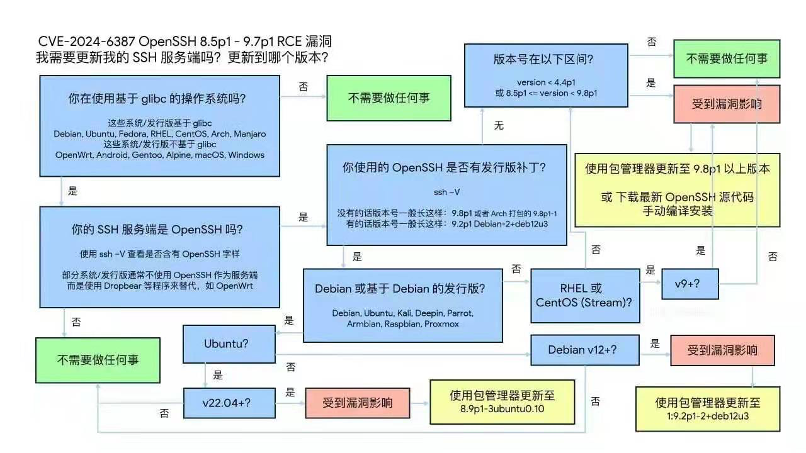

漏洞描述，CVE-2024-6387: https://nvd.nist.gov/vuln/detail/CVE-2024-6387

基本上影响的都是比较新版本的操作系统，老的系统，比如 CentOS 7.9，RockyLinux 8.9 ，Ubuntu 20.04，Debian 11 因为 OpenSSH 版本老逃过一劫。

在 Pigsty 支持的操作系统发行版中，RockyLinux 9.3，Ubuntu 22.04，Debian 12 受到影响：

```bash
ssh -V

OpenSSH_8.7p1, OpenSSL 3.0.7 1 Nov 2022                       # rockylinux 9.3
OpenSSH_8.9p1 Ubuntu-3ubuntu0.6, OpenSSL 3.0.2 15 Mar 2022    # ubuntu 22.04
OpenSSH_9.2p1 Debian-2+deb12u2, OpenSSL 3.0.11 19 Sep 2023    # debian 12
```


--------

## 诊断方法



漏洞公告：

RockyLinux 9+: https://rockylinux.org/news/2024-07-01-openssh-sigalrm-regression

Debian 12+: https://security-tracker.debian.org/tracker/CVE-2024-6387

Ubuntu 22.04+: https://ubuntu.com/security/CVE-2024-6387


--------

## 处理方法

使用系统的默认包管理器升级 `openssh-server` 即可。

升级后的版本参考：

```bash
# rockylinux 9.3  : 8.7p1-34.el9      -------> 8.7p1-38.el9_4.1    
# ubuntu 22.04    :                   -------> 8.9p1-3ubuntu0.6    
# debian 12       :                   -------> 1:9.2p1-2+deb12u2   
```

```bash
systemctl restart sshd
```

### rocky9.3

```bash
$ rpm -q openssh-server
openssh-server-8.7p1-34.el9.x86_64      # vulnerable

$ yum install openssh-server
openssh-server-8.7p1-38.el9_4.1.x86_64  # fixed
```

### debian12

```bash
$ dpkg -s openssh-server


$ apt install openssh-server
Version: 1:9.2p1-2+deb12u2              # fixed
```


### ubuntu22.04

```bash
$ dpkg -s openssh-server

$ apt install openssh-server
Version: 1:8.9p1-3ubuntu0.6
```


--------

## 后续改进

在 Pigsty 的下个版本 v2.8 中，默认会下载并安装当前最新版本的 `openssh-server`，从而修复此漏洞。


