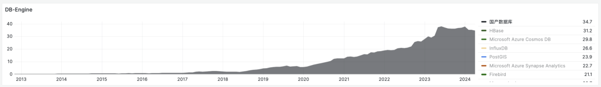

> [WeChat Public Account](https://mp.weixin.qq.com/s/AqcYpOgVj91JnkB1B3s4sA)

Friends often ask me, can Chinese domestic databases really compete? To be honest, **it's a question that offends people**. So let's try speaking with data - I hope the charts provided in this article can help readers understand the database ecosystem landscape and establish more accurate proportional awareness.

------

## Data Sources and Research Methods

There are many ways to evaluate whether a database "can compete", but **popularity** is the most common metric. For any technology, popularity determines user scale and ecosystem prosperity. Only this kind of final existential result can convince everyone.

Regarding database popularity, I think three data sources can serve as references: [**StackOverflow Global Developer Survey**](http://mp.weixin.qq.com/s?__biz=MzU5ODAyNTM5Ng==&mid=2247485933&idx=3&sn=ea360aa7a59a4cd23ad5f9a9f415a0a0&chksm=fe4b3c36c93cb520bda4596136e927d7cf92c597a76c04077c256588b2428202bdb7f004c08b&scene=21#wechat_redirect)[1], **DB-Engine Database Popularity Ranking**[2], and **Motianlun Chinese Domestic Database Ranking**[3].

------

Among these, the most valuable reference is the StackOverflow 2017-2023 global developer questionnaire survey - first-hand data obtained through sample surveys has high credibility and persuasiveness, with excellent **horizontal comparability** (horizontal comparison between different databases); seven years of consecutive survey results also provide sufficient **longitudinal comparability** (comparing a database with its own past history).

------

Second is the **DB-Engine** database popularity ranking. DB-Engine is a comprehensive trending index that combines indirect data from Google, Bing, Google Trends, StackOverflow, DBA Stack Exchange, Indeed, Simply Hired, LinkedIn, and Twitter into a **trending index**.

Trending indices have good **longitudinal comparability** - we can use them to judge whether a database's popularity trend is rising or declining, because the evaluation criteria are consistent. But they perform poorly in **horizontal comparability** - for example, you can't distinguish users' search purposes. So trending indicators can only serve as rough references for **horizontal comparison** between different databases - but their accuracy at the **order of magnitude** level is still OK.

------

The third data source is Motianlun's "**Chinese Domestic Database Ranking**", which includes 287 Chinese domestic databases. Its main value is providing us with a directory of Chinese domestic databases. Here we simply consider - databases included here count as "**Chinese domestic databases**" - although these database teams may not necessarily self-identify as domestic databases.

With these three data sources, we can attempt to answer this question - what is the actual level of Chinese domestic databases' popularity and influence internationally?

------

## Anchor Point: TiDB

**TiDB** is the only database appearing in all three rankings simultaneously, so it can serve as an **anchor point**.

In the [StackOverflow 2023 Survey](http://mp.weixin.qq.com/s?__biz=MzU5ODAyNTM5Ng==&mid=2247485933&idx=3&sn=ea360aa7a59a4cd23ad5f9a9f415a0a0&chksm=fe4b3c36c93cb520bda4596136e927d7cf92c597a76c04077c256588b2428202bdb7f004c08b&scene=21#wechat_redirect), TiDB appeared for the first time in the database popularity ranking as the last place, and is the only selected "Chinese domestic database". In the left figure, TiDB's developer usage rate is **0.20%**, compared to first-place PostgreSQL (45.55%) and second-place MySQL (41.09%), showing a popularity difference of about **two to three hundred times**.

------

The second DB-Engine data can cross-verify this point - TiDB has the highest score among Chinese domestic databases on DB-Engine - in April 2024, it scored **5.14**. Compared to the four kings of relational databases ([**PostgreSQL**](https://mp.weixin.qq.com/s?__biz=MzU5ODAyNTM5Ng==&mid=2247487055&idx=1&sn=9d7bd8b6d9b07478dba7f87d0a663535&scene=21#wechat_redirect), [**MySQL**](https://mp.weixin.qq.com/s?__biz=MzU5ODAyNTM5Ng==&mid=2247486710&idx=1&sn=261e4754df6c85954b50d8f68f277abe&scene=21#wechat_redirect), Oracle, SQL Server), this is also a **few hundred times** difference.

------

In the Motianlun Chinese domestic database ranking, TiDB has long occupied the top position. Although OceanBase, PolarDB, and openGauss have been inserted ahead in recent years, it's still in the first tier. Calling it a Chinese domestic database benchmark isn't too problematic.

If we use TiDB as a reference anchor point and integrate these three data sources, we can immediately draw an interesting conclusion: **Chinese domestic databases look talented and full of elites, but even the most competitive Chinese domestic database has popularity and influence less than one percent of top open-source databases...**

Overall, these products classified as "Chinese domestic databases" have international influence that can be rated as: **negligible**.

------

## Negligible Weaklings

Among the **478** databases included in DB-Engine globally, we can find **46** products listed in Motianlun's Chinese domestic database directory. Plotting their popularity over the past twelve years on a chart yields the figure below - at first glance, it shows a "thriving" and vigorous development momentum.

------

However, when we plot the four kings of relational databases: [**PostgreSQL**](https://mp.weixin.qq.com/s?__biz=MzU5ODAyNTM5Ng==&mid=2247487055&idx=1&sn=9d7bd8b6d9b07478dba7f87d0a663535&scene=21#wechat_redirect), [**MySQL**](https://mp.weixin.qq.com/s?__biz=MzU5ODAyNTM5Ng==&mid=2247486710&idx=1&sn=261e4754df6c85954b50d8f68f277abe&scene=21#wechat_redirect), Oracle, SQL Server on the same chart, it looks completely different - you can barely see any "Chinese domestic database".

------

**Adding up all Chinese domestic database popularity scores doesn't even reach a fraction of PostgreSQL's popularity.** They fit seamlessly into the "Others" statistical category without any sense of discord.

------

If we view all Chinese domestic databases as one entity, they could rank 26th on this list with 34.7 points, accounting for **five thousandths** of the total score. (The top black band)

This number roughly summarizes the international influence (DB-Engine) of Chinese domestic databases: **Although accounting for 1/10 in quantity** (nearly half if calculated by Motianlun), **total influence is only five thousandths. The strongest among them, TiDB, has a combat power of only 5...**

Of course, I emphasize again that trending/index data has very poor horizontal comparability and should only be used as reference at the order of magnitude level - but this is sufficient to draw some conclusions...

------

## Databases in Decline

From DB-Engine's trending data, Chinese domestic databases began rising from 2017-2020, entered their peak from 2021, reached a plateau in May 2023, and since early this year, have shown declining trends. This aligns with many industry experts' judgments - in 2024, Chinese domestic databases entered a shakeout and settlement period - many database companies will close, go bankrupt, or be merged.

If we remove some leading "domestic" databases that have done well with overseas open-source efforts, this declining trend becomes more obvious.

------

**But decline isn't unique to Chinese domestic databases** - **actually most databases are in decline**. DB-Engine's popularity data trends over the past 12 years can reveal this - although DB-Engine's trending indicators have poor horizontal comparability, their longitudinal comparability is quite good - so they still have great reference value for judging popularity and decline trends.

We can process the chart - using a certain year as zero point to see changes in popularity scores from that moment, thus seeing which databases are thriving and developing, and which are falling behind and declining.

**If we focus on the most recent three years, it's not hard to find that among all databases, only PostgreSQL and Snowflake have significant popularity growth**. The biggest losers are SQL Server, Oracle, MySQL, and MongoDB... Analysis of data warehouse components (broadly databases) have slight growth in recent years, **while most other databases are in decline channels**.

------

If we use DB-Engine's earliest recorded November 2012 as reference zero point, **PostgreSQL is the biggest winner in the database field over the past 12 years**; while the biggest losers are still the SQL Server, Oracle, MySQL triumvirate of relational databases.

The rise of the NoSQL movement gave MongoDB, ElasticSearch, and Redis considerable growth during the 2012-2022 internet golden decade, but this growth momentum has ended in recent years and entered decline channels, living off existing user bases.

As for the NewSQL movement, so-called new-generation distributed databases: if NoSQL at least had its moment of glory, then NewSQL can be said to have fizzled out before it even shined. "Distributed databases" are hyped very intensely in China's marketing, to the point where everyone seems to treat it as a database category that can stand alongside "centralized databases". But if we dig deeper, it's not hard to find - **this is actually just a very niche small database field**.

Some NoSQL components' popularity can still be placed on the same coordinate chart as PostgreSQL without looking awkward, while all NewSQL players combined have popularity scores that don't match PostgreSQL's fraction - just like "Chinese domestic databases".

**This data reveals the basic landscape of the database field: except for PostgreSQL, major databases are all in decline...**

------

## The Disguised PostgreSQL Civil War

This data reveals the basic landscape of the database field - **except for PostgreSQL, major databases are all in decline**, whether SQL, NoSQL, NewSQL, or **Chinese domestic databases**. This indeed raises an interesting question, making one wonder - **why?**

For this question, I proposed a simple explanation in "[**PostgreSQL is Devouring the Database World**](https://mp.weixin.qq.com/s?__biz=MzU5ODAyNTM5Ng==&mid=2247487055&idx=1&sn=9d7bd8b6d9b07478dba7f87d0a663535&scene=21#wechat_redirect)": **PostgreSQL is devouring the entire database world through its powerful extension plugin ecosystem**. According to Occam's razor principle - the simplest explanation is often closest to the truth.

------

The core focus of the entire database world has shifted to King Kong vs Godzilla: two open-source giant databases [PostgreSQL](https://mp.weixin.qq.com/s?__biz=MzU5ODAyNTM5Ng==&mid=2247487055&idx=1&sn=9d7bd8b6d9b07478dba7f87d0a663535&scene=21#wechat_redirect) and [MySQL](https://mp.weixin.qq.com/s?__biz=MzU5ODAyNTM5Ng==&mid=2247486710&idx=1&sn=261e4754df6c85954b50d8f68f277abe&scene=21#wechat_redirect) have usage rates far ahead of other databases. All other topics pale in comparison, whether NewSQL or Chinese domestic databases.

> This battle looks like it will take several more years to end, but in the eyes of visionaries, this dispute was settled years ago.

------

After the Linux kernel unified the server operating system world, former competitors BSD, Solaris, Unix all became historical footnotes. We're witnessing the same thing happening in the database field - **in this era, trying to invent new practical database kernels is equivalent to Don Quixote tilting at windmills.**

Just like today, although there are so many Linux operating system distributions on the market, everyone chooses to use the same Linux kernel. Being well-fed and idle enough to magic-modify OS kernels belongs to creating difficulties where none exist, and would be viewed as **hillbilly** behavior by the industry.

So, **not all Chinese domestic databases can't compete - the competitive Chinese domestic databases are actually disguised PostgreSQL and MySQL**. If PostgreSQL is destined to become the Linux kernel of the database field, then who will become Postgres's Debian/Ubuntu/Suse/RedHat?

------

**Competition among Chinese domestic databases has become competition within PostgreSQL/MySQL ecosystems**. Whether a Chinese domestic database can compete depends on its "**P-content**" - the purity and version freshness of PostgreSQL kernel content. The newer the version, the less magic-modification, the higher the added value, the higher the usage value, and the more competitive.

Alibaba's PolarDB, which looks most competitive among Chinese domestic databases (the only one selected for Gartner's Leaders Quadrant), is customized based on PostgreSQL 14 from three years ago and maintains PG kernel's main integrity, having the highest P-content. In contrast, openGauss chose to fork based on PG 9.2 from 12 years ago and magic-modified it beyond recognition by its own father, so it has lower P-content. Between them are: AntDB based on PG 13, Renmin University's Kingbase on PG 12, old Polar on PG 11, TBase on PG XL, ...

------

**Therefore, the real essential question of whether Chinese domestic databases can compete is: who can represent the advanced productive forces of the PostgreSQL world?**

Kernel-making vendors are lukewarm - MariaDB as MySQL's father fork is even on the verge of delisting, while AWS, which freeloads kernels to make services and sell RDS, can make a fortune and even reach the top of global database market share through this model - undoubtedly proving: **database kernels are no longer important, what the market lacks is service capability integration**.

------

In this competition, public cloud RDS got the first entry ticket. While [**Pigsty**](http://mp.weixin.qq.com/s?__biz=MzU5ODAyNTM5Ng==&mid=2247485518&idx=1&sn=3d5f3c753facc829b2300a15df50d237&chksm=fe4b3d95c93cb4833b8e80433cff46a893f939154be60a2a24ee96598f96b32271301abfda1f&scene=21#wechat_redirect), which attempts to provide better, cheaper RDS for PostgreSQL locally, challenges cloud databases, and over a dozen [**Kubernetes Operators**](https://mp.weixin.qq.com/s?__biz=MzU5ODAyNTM5Ng==&mid=2247486587&idx=1&sn=16521d6854711a4fe429464aeb2df6bd&scene=21#wechat_redirect) trying to solve RDS localization challenges through cloud-native methods are gearing up, eager to pull RDS down from its throne.

Real competition happens in the service/[**management and control**](http://mp.weixin.qq.com/s?__biz=MzU5ODAyNTM5Ng__&mid=2247486903&idx=1&sn=01c57499f41e8f51045bb8dd52586595&chksm=fe4b386cc93cb17a2d2fad903e809107162cc1e67e8ad7c8bfdd51de657c97f32f912cabe550&scene=21#wechat_redirect) dimension, not kernels.

**The database field is moving from Cambrian explosion to Jurassic mass extinction**, **and in this process, 1% of seeds will inherit 99% of the future and evolve new ecosystems and rules**. I hope database users can make wise choices and decisions, standing on the side of the future and hope, rather than wasting life on things without prospects, such as...

------

### References

Note: Charts and data used in this article are publicly published on the Pigsty Demo site: https://demo.pigsty.cc/d/db-analysis/

`[1]` StackOverflow Global Developer Survey: *https://survey.stackoverflow.co/2023/?utm_source=so-owned&utm_medium=blog&utm_campaign=dev-survey-results-2023&utm_content=survey-results#most-popular-technologies-database-prof*

`[2]` DB-Engine Database Popularity Ranking: *https://db-engines.com/en/ranking_trend*

`[3]` Motianlun Chinese Domestic Database Ranking: *https://www.modb.pro/dbRank*

`[4]` DB-Engine Data Analysis: *https://demo.pigsty.cc/d/db-analysis*

`[5]` StackOverflow 7-Year Survey Data: *https://demo.pigsty.cc/d/sf-survey*