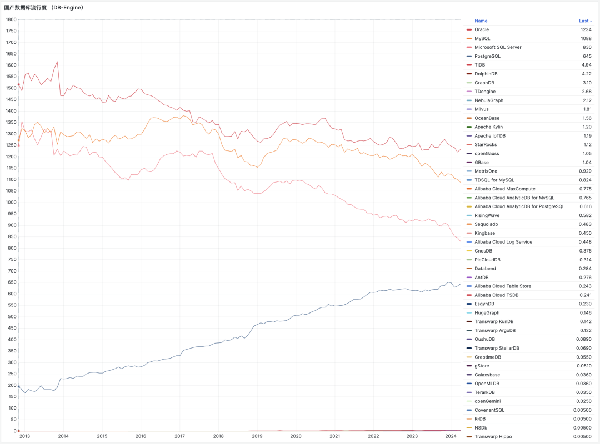
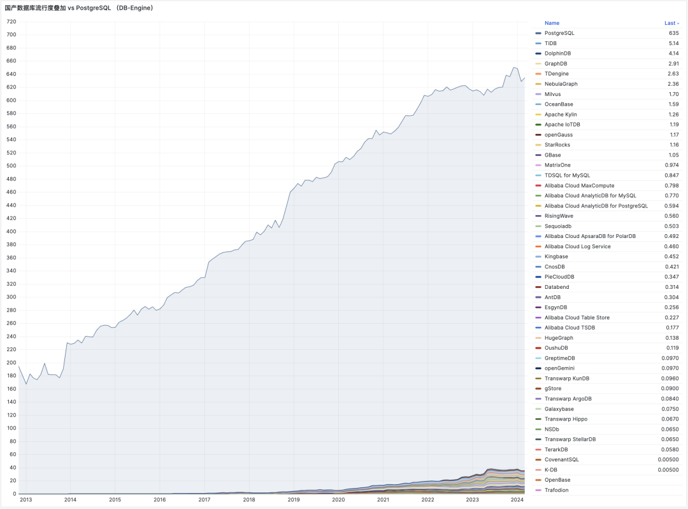
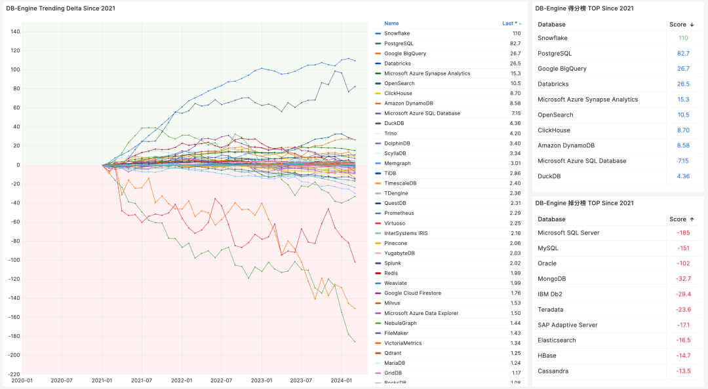
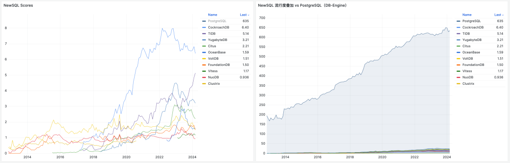
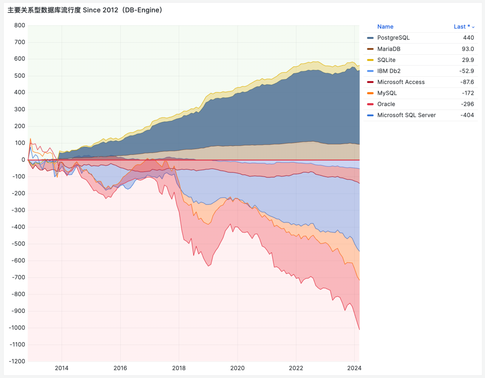
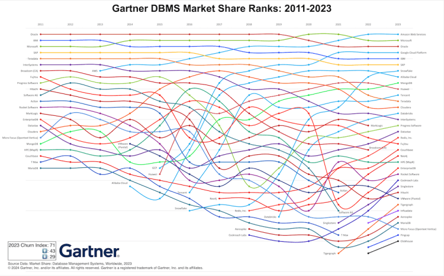

> [微信公众号](https://mp.weixin.qq.com/s/AqcYpOgVj91JnkB1B3s4sA)

总有朋友问我，国产数据库到底能不能打？说实话，**是个得罪人的问题**。所以我们不妨试试用数据说话 —— 希望本文提供的图表，能够帮助读者了解数据库生态格局，并建立更为准确的比例感认知。

------

## 数据来源与研究方法

评价一个数据库“能不能打”有许多种方式，但 “**流行度**” 是最常见的指标。对一项技术而言，流行度决定了用户的规模与生态的繁荣程度，唯有这种最终存在意义上的结果才能让所有人心服口服。

关于数据库流行度这个问题，我认为有三份数据可以作为参考：[**StackOverflow 全球开发者调研**](http://mp.weixin.qq.com/s?__biz=MzU5ODAyNTM5Ng==&mid=2247485933&idx=3&sn=ea360aa7a59a4cd23ad5f9a9f415a0a0&chksm=fe4b3c36c93cb520bda4596136e927d7cf92c597a76c04077c256588b2428202bdb7f004c08b&scene=21#wechat_redirect)[1]，**DB-Engine 数据库流行度排行榜**[2]，以及**墨天轮国产数据库排行榜**[3]。

------

其中最有参考价值的是 StackOverflow 2017 - 2023 年的全球开发者问卷调研 —— 样本调查获取的第一手数据具有高度的可信度与说服力，并且具有极好的 **横向可比性**（在不同数据库之间水平对比）；连续七年的调查结果也有着足够的 **纵向可比性** （某数据库和自己过去的历史对比）。

------

其次是 **DB-Engine** 数据库流行度排行榜， DB-Engine 属于综合性热搜指数，将 Google, Bing, Google Trends，StackOverflow，DBA Stack Exchange，Indeed, Simply Hired， LinkedIn，Twitter 上的间接数据合成了一个**热搜指数**。

热度指数有着很好的 **纵向可比性** —— 我们可以用它来判断某个数据库的流行度走势 —— 是更流行了还是更过气了，因为评分标准是一样的。但在 **横向可比性** 上表现不佳 —— 例如你没办法细分用户搜索的目的。所以热度指标在**横向对比**不同数据库时只能作为一个模糊的参考 —— 但在**数量级**上的准确性还是OK的。

------

第三份数据是墨天轮的 “**国产数据库排行榜**”，这份榜单收录了 287 个国产数据库，主要价值是给我们提供了一份国产数据库名录。这里我们简单认为 —— 收录在这里的数据库，就算“**国产数据库”**了 —— 尽管这些数据库团队不一定会自我认知为国产数据库。

有了这三份数据，我们就可以尝试回答这个问题 —— 国产数据库在国际上的流行度与影响力到底是什么水平？

------

## 锚点：TiDB

**TiDB** 是唯一一个，同时出现在三个榜单里的数据库，因此可以作为**锚点**。

在 [StackOverflow 2023 调研](http://mp.weixin.qq.com/s?__biz=MzU5ODAyNTM5Ng==&mid=2247485933&idx=3&sn=ea360aa7a59a4cd23ad5f9a9f415a0a0&chksm=fe4b3c36c93cb520bda4596136e927d7cf92c597a76c04077c256588b2428202bdb7f004c08b&scene=21#wechat_redirect) 中，TiDB 作为最后一名，首次出现在数据库流行度榜单里，也是唯一入选的 “国产数据库”。图左中，TiDB 的开发者使用率为 **0.20%**，与排名第一的 PostgreSQL (45.55%) 和排名第二的 MySQL (41.09%) 相比，流行度相差了大约 **两三百倍**。

------

第二份 DB-Engine 数据可以交叉印证这一点 —— TiDB 在 DB-Engine 上的评分是国产数据库中最高的 —— 在2024年4月份，为 **5.14** 分。关系型数据库四大天王（ [**PostgreSQL**](https://mp.weixin.qq.com/s?__biz=MzU5ODAyNTM5Ng==&mid=2247487055&idx=1&sn=9d7bd8b6d9b07478dba7f87d0a663535&scene=21#wechat_redirect)，[**MySQL**](https://mp.weixin.qq.com/s?__biz=MzU5ODAyNTM5Ng==&mid=2247486710&idx=1&sn=261e4754df6c85954b50d8f68f277abe&scene=21#wechat_redirect)，Oracle，SQL Server）相比，也是**小几百倍**的差距。

------

在墨天轮国产数据库排名中，TiDB 曾经长时间占据了榜首的位置，尽管最近两年前面加塞了 OceanBase， PolarDB，openGauss 三个数据库，但它还在第一梯队里，称其为国产数据库标杆没有太大问题。

如果我们以 TiDB 作为参考锚点，将这三份数据融合，立即就能得出一个有趣的结论：**国产数据库看上去人才济济，群英荟萃，但即使是最能打的国产数据库，流行度与影响力也不及头部开源数据库的百分之一… 。**

整体来看，这些被归类为“国产数据库”的产品，绝大多数在国际上的影响力可以评为：**微不足道**。

------

## 微不足道的战五渣

在 DB-Engine 收录的全球 **478** 款数据库中，可以找到 **46** 款列入墨天轮国产数据库名单的产品。将其过去十二年间的流行度绘制在图表上，得到下图 —— 乍看之下，好一片 “欣欣向荣”，蓬勃发展的势头。

------

然而，当我们把关系数据库四大天王：[**PostgreSQL**](https://mp.weixin.qq.com/s?__biz=MzU5ODAyNTM5Ng==&mid=2247487055&idx=1&sn=9d7bd8b6d9b07478dba7f87d0a663535&scene=21#wechat_redirect)，[**MySQL**](https://mp.weixin.qq.com/s?__biz=MzU5ODAyNTM5Ng==&mid=2247486710&idx=1&sn=261e4754df6c85954b50d8f68f277abe&scene=21#wechat_redirect)，Oracle，SQL Server 的热度趋势同样画在这张图上后，看上去就变得大不一样了 —— 你几乎看不到任何一个“国产数据库”了。

------

**把整个国产数据库的热度分数全加起来，也甚至还达不到 PostgreSQL 流行度的零头。** 整体合并入 “其他” 统计项中毫无任何违和感。

------

如果把所有国产数据库视作一个整体，在这个榜单里面可以凭 34.7 分排到第 26 名，占总分数的**千分之五**。（最上面一条黑带）

这个数字，差不多就是国产数据库国际影响力（DB-Engine）的一个摘要概括：**尽管在数量上占了 1/10**（如果以墨天轮算可以近半），**但总影响力只有千分之五。其中的最强者 TiDB，战斗力也只有5 ……**

当然再次强调，热度/指数类数据横向可比性非常一般，仅适合在数量级层面用作参考 —— 但这也足够得出一些结论了……

------

## 过气中的数据库们

从 DB-Engine 的热度趋势上看，国产数据库从 2017 - 2020 年开始起势，从 2021 年进入高潮，在 23年5月进入平台期，从今年年初开始，出现掉头过气的趋势。这和许多业内专家的判断一致 —— 2024 年，国产数据库进入洗牌清算期 —— 大量数据库公司将倒闭破产或被合并收编。

如果我们去掉个别出海开源做的还不错的头部“国产”数据库 —— 这个掉头而下的过气趋势会更加明显。

------

**但过气这件事，并非国产数据库所独有** — **其实绝大多数的数据库其实都正在过气中**。DB-Engine 过去12 年中的流行度数据趋势可以揭示这一点 —— 尽管 DB-Engine 热度指标的的横向可比性很一般，但纵向可比性还是很不错的 —— 因此在判断流行 & 过气趋势上仍然有很大的参考价值。

我们可以对图表做一个加工处理 —— 以某一年为零点，来看热度分数从此刻起的变化，从而看出那些数据库正在繁荣发展，哪些数据库正在落伍过气。

**如果我们将目光聚焦在最近三年，不难发现在所有数据库中，只有 PostgreSQL 与 Snowflake 的流行度有显著增长**。而最大的输家是 SQL Server，Oracle，MySQL，与 MongoDB …… 。分析数仓类组件（广义上的数据库）在最近三年有少量增长，**而绝大部分其他数据库都处在过气通道中**。

------

如果我们以 DB-Engine 最早有记录的 2012-11 作为参考零点，**那么 PostgreSQL 是过去 12 年中数据库领域的最大赢家**；而最大的输家依然是 SQL Server，Oracle，MySQL 御三家关系型数据库。

NoSQL 运动的兴起，让 MongoDB ，ElasticSearch，Redis 在 2012 - 2022 互联网黄金十年中获得了可观的增长，但这个增长的势头在最近几年已经结束了，并进入过气下降通道中，进入吃存量老本的状态。

至于 NewSQL 运动，即所谓的新一代分布式数据库。如果说 NoSQL 起码辉煌过，那么可以说 NewSQL 还没辉煌就已经熄火了。“分布式数据库” 在国内营销炒作的非常火热，以至于大家好像把它当作一个可以与 “集中式数据库” 分庭抗礼的数据库品类来看待。但如果我们深入研究就不难发现 —— **这其实只是一个非常冷门的数据库小众领域**。

一些 NoSQL 组件的流行度还能和 PostgreSQL 放到同一个坐标图中而不显突兀，而所有 NewSQL 玩家加起来的流行度分数也比不上 PostgreSQL 的零头 —— 和“国产数据库”一样。

**这些数据为我们揭示出数据库领域的基本格局：除了 PostgreSQL 之外的主要数据库都在过气中…**

------

## 改头换面的 PostgreSQL 内战

这几份数据为我们揭示出数据库领域的基本格局 —— **除了 PostgreSQL 之外的主要数据库都在过气中**，无论是 SQL，NoSQL，NewSQL，还是 **国产数据库** 。这确实抛出了一个有趣的问题，让人想问 —— **为什么？**。

对于这个问题，我在 《[**PostgreSQL 正在吞噬数据库世界**](https://mp.weixin.qq.com/s?__biz=MzU5ODAyNTM5Ng==&mid=2247487055&idx=1&sn=9d7bd8b6d9b07478dba7f87d0a663535&scene=21#wechat_redirect)》中提出了一种简单的解释：**PostgreSQL 正在凭借其强大的扩展插件生态，内化吞噬整个数据库世界**。根据奥卡姆剃刀原理 —— 最简单的解释往往也最接近真相。

------

整个数据库世界的核心焦点，都已经聚焦在了金刚大战哥斯拉上：两个开源巨无霸数据库 [PostgreSQL](https://mp.weixin.qq.com/s?__biz=MzU5ODAyNTM5Ng==&mid=2247487055&idx=1&sn=9d7bd8b6d9b07478dba7f87d0a663535&scene=21#wechat_redirect) 与 [MySQL](https://mp.weixin.qq.com/s?__biz=MzU5ODAyNTM5Ng==&mid=2247486710&idx=1&sn=261e4754df6c85954b50d8f68f277abe&scene=21#wechat_redirect) 的使用率与其他数据库远远拉开了距离。其他一切议题与之相比都显得微不足道，无论是 NewSQL 还是 国产数据库。

> 看上去这场搏杀还要再过几年才能结束，但在远见者眼中，这场纷争几年前就已经尘埃落定了。

------

Linux 内核一统服务器操作系统天下后，曾经的同台竞争者 BSD，Solaris，Unix 都成为了时代的注脚。而我们正在目睹同样的事情在数据库领域发生 —— **在这个时代里，想发明新的实用数据库内核，约等于堂吉柯德撞风车。**

好比今天尽管市面上有这么多的 Linux 操作系统发行版，但大家都选择使用同样的 Linux 内核，吃饱了撑着魔改 OS 内核属于没有困难创造困难也要上，会被业界当成 **山炮** 看待。

所以，**并非所有国产数据库都不能打，而是能打的国产数据库，其实是改头换面的 PostgreSQL 与 MySQL** 。如果 PostgreSQL 注定成为数据库领域的 Linux 内核，那么谁会成为 Postgres 的 Debian / Ubuntu / Suse / RedHat ？

------

**国产数据库的竞争，变成了 PostgreSQL / MySQL 生态内部的竞争**。一个国产数据库能打与否，取决于其 “**含P量**” —— 含有 PostgreSQL 内核的纯度与版本新鲜度。版本越新，魔改越少，附加值越高，使用价值就越高，也就越能打。

国产数据库看起来最能打的阿里 PolarDB （唯一入选 Gartner 领导者象限），基于三年前的 PostgreSQL 14 进行定制，且保持了 PG 内核的主体完整性，拥有最高的含P量。相比之下，openGauss 选择基于 12 年前的 PG 9.2 进行分叉，并魔改的亲爹都不认识了，所以含P量较低。介于两者中间的还有：PG 13 的 AntDB，PG 12 的人大金仓，PG 11 的老 Polar，PG XL 的 TBase ，……

------

**因此，国产数据库到底能不能打 —— 真正的本质问题是：谁能代表 PostgreSQL 世界的先进生产力？**

做内核的厂商不温不火，MariaDB 作为 MySQL 的亲爹 Fork 甚至都已经濒临退市，而白嫖内核自己做服务与扩展卖 RDS 的 AWS 可以赚的钵满盆翻，甚至凭借这种模式一路干到了全球数据库市场份额的榜首 —— 毫无疑问地证明：**数据库内核已经不重要了，市场上稀缺的是服务能力整合**。

------

在这场竞赛中，公有云 RDS 拿到了第一张入场券。而尝试在本地提供更好、更便宜、 RDS for PostgreSQL 的 [**Pigsty**](http://mp.weixin.qq.com/s?__biz=MzU5ODAyNTM5Ng==&mid=2247485518&idx=1&sn=3d5f3c753facc829b2300a15df50d237&chksm=fe4b3d95c93cb4833b8e80433cff46a893f939154be60a2a24ee96598f96b32271301abfda1f&scene=21#wechat_redirect) 对云数据库这种模式提出了挑战，同时还有十几款尝试用 云原生方式解决 RDS 本地化挑战的 [**Kubernetes Operator**](https://mp.weixin.qq.com/s?__biz=MzU5ODAyNTM5Ng==&mid=2247486587&idx=1&sn=16521d6854711a4fe429464aeb2df6bd&scene=21#wechat_redirect) 正在摩拳擦掌，跃跃欲试，要把 RDS 拉下马来。

真正的竞争发生在服务/[**管控**](http://mp.weixin.qq.com/s?__biz=MzU5ODAyNTM5Ng==&mid=2247486903&idx=1&sn=01c57499f41e8f51045bb8dd52586595&chksm=fe4b386cc93cb17a2d2fad903e809107162cc1e67e8ad7c8bfdd51de657c97f32f912cabe550&scene=21#wechat_redirect)维度，而不是内核。

**数据库领域正在从寒武纪大爆发走向侏罗纪大灭绝**，**在这一过程中，1% 的种子将会继承 99% 的未来，并演化出新的生态与规则**。我希望数据库用户们可以明智地选择与决策，站在未来与希望的一侧，而不要把生命浪费在没有前途的事物上，比如……

------

### References

注：本文使用的图表与数据，公开发布于 Pigsty Demo 站点：https://demo.pigsty.cc/d/db-analysis/

`[1]` StackOverflow 全球开发者调研: *https://survey.stackoverflow.co/2023/?utm_source=so-owned&utm_medium=blog&utm_campaign=dev-survey-results-2023&utm_content=survey-results#most-popular-technologies-database-prof*

`[2]` DB-Engine 数据库流行度排行榜: *https://db-engines.com/en/ranking_trend*

`[3]` 墨天轮国产数据库排行榜: *https://www.modb.pro/dbRank*

`[4]` DB-Engine 数据分析: *https://demo.pigsty.cc/d/db-analysis*

`[5]` StackOverflow 7年调研数据: **https://demo.pigsty.cc/d/sf-survey**