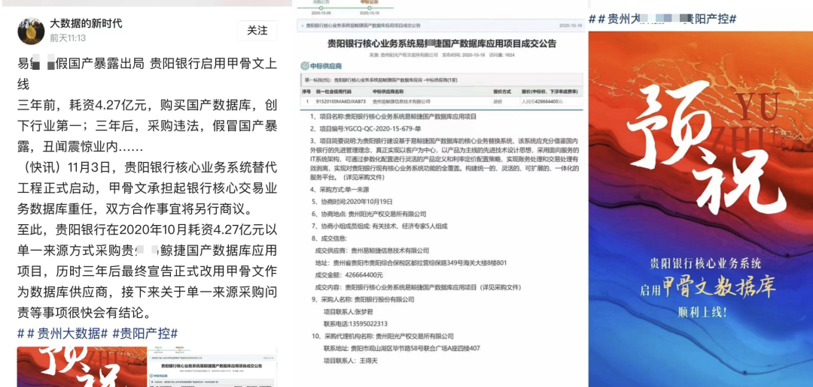
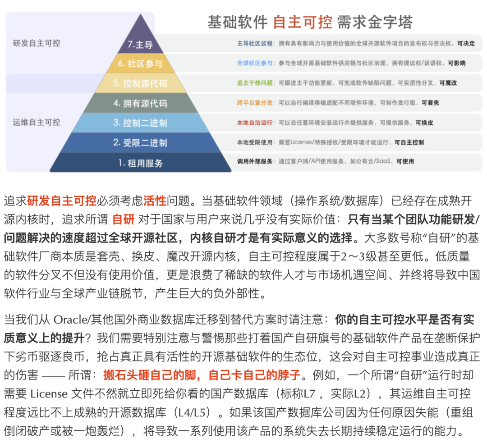
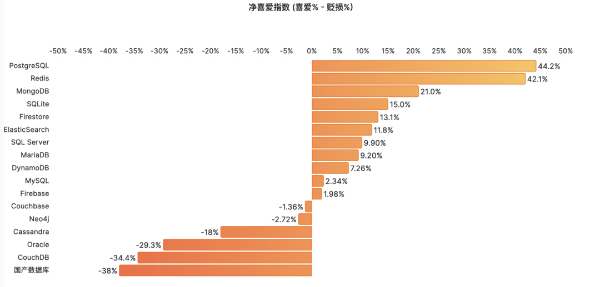
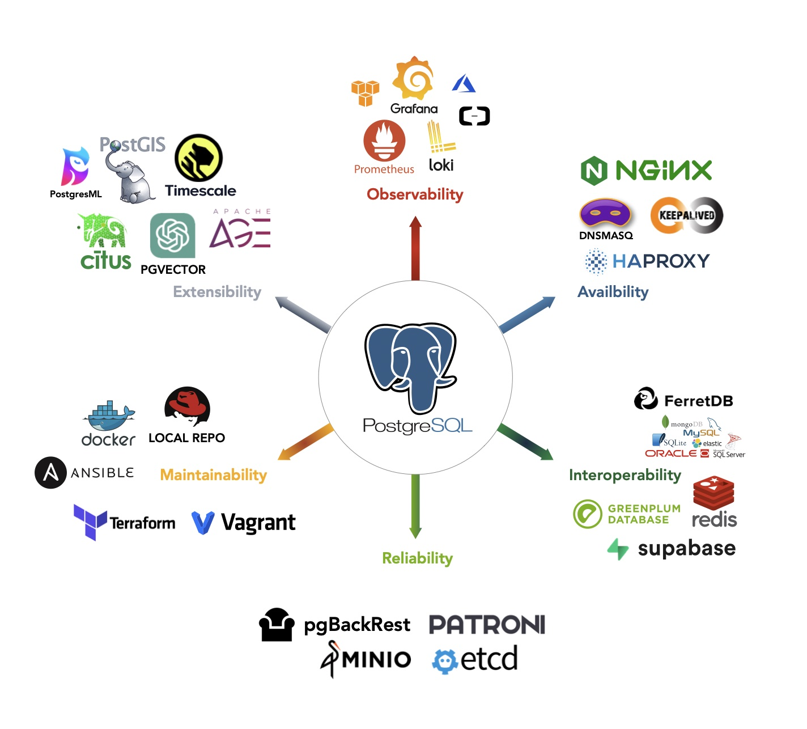

> [WeChat](https://mp.weixin.qq.com/s/vh1JE_BdaLetWtt5vvPDDw) | [Zhihu](https://zhuanlan.zhihu.com/p/664816961)

If "[cloud databases](/cloud/rds/)" can be considered passable products with slightly underwhelming cost ROI, then many "domestic databases" are simply shoddy, inferior products that can't be helped. Xinchuang OS/databases are essentially **IT pre-made meals in schools**. Users hold their noses while migrating, developers pretend to work hard, and everyone plays along with leaders who neither understand nor care about technology. Massive human and financial resources are squandered on worthless endeavors, wasting real opportunities. The [infrastructure software](http://mp.weixin.qq.com/s?__biz=MzU5ODAyNTM5Ng==&mid=2247486061&idx=1&sn=a1452dfa864f702d40bf612839a4e9e4&chksm=fe4b3fb6c93cb6a0aa5aef59d4381c49354ee0f741dd7e92c91549864ac58597f93a6ab886ed&scene=21#wechat_redirect) industry isn't being strangled by anyone - the real chokehold comes from the so-called "insiders."

------

## Monopolistic Relationship Business

The loudspeakers at Beijing Happy Valley's entrance keep shouting: "*Please don't buy inferior bottled water outside*", and vendors are driven far away. Once inside, the park sells you the same stuff at five times the price (or maybe even worse products like watered-down beer). Xinchuang databases and operating systems operate on essentially the same model - relationship businesses that survive on monopolistic protection. This shares striking similarities with pre-made meals in schools: Wagner's boss made enough money from contracting military/school meals to fund mercenary rebellions - talk about huge profits with minimal investment.

The problem is, while people eating pre-made meals might not have a choice, users of databases and operating systems can vote with their feet, choosing more advanced and free open-source OS/databases. What can be done about this? After all, many domestic databases are also picking up crumbs behind the global open-source OS/DB community. Countless domestic kernels are based on open-source PG, skinned and shell-swapped modifications. If anyone's being strangled in database kernels, it's definitely from eating too much variety and choking on it.

Many companies watch Oracle's massive harvesting with envy, drooling with desire - but if users choose to directly use readily available free open-source software, how can domestic databases cut their leeks? This amounts to state asset loss! For the underdog to turn the tables, they must first betray their teachers and ancestors: package up free open-source software and sell it to you at Oracle prices!

First, create a hard fork of the database, rename those two letters `pg`; mix in some garbage code for obfuscation, then stir it up with C++ - voilà, 100% autonomous code rate and independent intellectual property! Then find some university professors and old academicians to endorse it, arguing that open-source databases MySQL and PostgreSQL are trash. Finally, tell the leadership: hostile foreign forces are determined to destroy us, open source is imperialism's overt conspiracy to destroy our domestic software industry, we need to "***manage it***", we can't not resist!

Open-source community-led projects have become deeply globalized. It's nearly impossible for any single country to impose sanctions: ARM can be sanctioned, but can RISC-V? Windows can be sanctioned, but can Linux? Oracle/MySQL can be sanctioned, but can PostgreSQL? However, while others can't sanction you, you can "sanction" others by actively closing your own doors!

Such companies probably dream of national technological blockades: **doors can only be firmly shut when closed from both sides**. Once the doors are tightly shut, **whoever controls the technical IV drip controls the profit source**: those "domestic software" companies that master **exclusive wall-jumping privileges** only need to periodically collect breadcrumbs from the global open-source ecosystem and translate them in. Starving domestic users will then be grateful and cry out about "leading the world."

------

## Who Gets Hurt?

**Users are the most hurt**: their business systems were running fine, then suddenly they're required to "upgrade and transform." If it were positive transformation, there'd at least be some value, but what's being used to replace existing systems are all sorts of monsters and demons. If it were just pure open-source re-skinning, that would be one thing - buying some service support would still have value. The most outrageous are those who make self-righteous "optimizations" - castrated modification versions. Precious time that could be spent on more valuable things is now wasted on cutting feet to fit shoes, drinking watered-down beer, and being guinea pigs stepping on landmines.

**Database developers are hurt**, wasting their prime youth and technical careers on "playing house with databases" games with no future or hope - the products they create can only be force-fed to unlucky users through sales relationships, hearing nothing but anger, complaints, cold mockery, and sarcasm from user-side colleagues. Don't even mention technical influence and export earnings - international peers don't even bother to mock, and "sanctions" aren't worth giving. The entire job has no technical achievement satisfaction, and people become numb and cynical in daily self-doubt.

**National strength is hurt**. Various industries actively decouple from global software supply chains: stability, functionality, and combat effectiveness suffer. Autonomous control is a real need, but blindly promoting certain catalogs, distorting the essential meaning of autonomous control (twisting operational autonomous control into R&D autonomous control), using bad money to drive out good money, will cause substantial autonomous control capability to decline rather than improve.

Not to mention compared to open source, even Oracle is still a Paper License with many third-party service providers; some domestic databases die immediately without a license, and when the original manufacturer collapses, business systems suffer along with it. Switching from being "strangled" by leading foreign databases to being strangled by domestic suppliers doesn't improve autonomous control capability and additionally loses functional vitality.

> "[What Kind of Autonomous Control Do Infrastructure Software Need?](/db/sovereign-dbos)"

------

## Bad Money Drives Out Good

In CSDN's recent developer survey, 70% of respondents held negative impressions of "domestic databases": "**technically backward**", "**lacking innovation**" - this is a relatively mild way of putting it. Users' true inner evaluations are probably more direct: **false advertising, grandiose claims, backward productivity**. Why do domestic databases have such poor reputations? Is it because software engineers aren't patriotic?

According to statistics from CAICT and MoTianLun, there are now over 260 "domestic databases." Those based on open-source PostgreSQL/MySQL account for more than half. This is quite an outrageous number. In reality, a large number of database vendors don't have the capability to provide true "products" - they just simply re-skin and package open-source databases to provide services, supplemented by hyping pseudo-requirements like distributed systems and HTAP.

Truly self-developed databases show polarization: the very few products with genuine innovation contributions and usage value cherish their reputation and won't deliberately flaunt being "domestic." Most of the rest are often closed-door, technically backward homebrew databases, or inferior wheels from early open-source forks with negative castration. **There are indeed good companies doing solid work in domestic databases, but the "domestic" label has been polluted by a large number of mediocre and inferior products that have drilled into the database field**.

Even more heartbreaking is bad money driving out good money. The already scarce database R&D talent, squandered this way, will truly strangle the neck of the domestic database industry. Especially in the core OLTP/relational database field - due to the existence of open source, there's no shortage of sufficiently good kernels. Being able to use PostgreSQL/MySQL well and provide service support is far more valuable than the self-deceptive grand kernel smelting.

------

## Where Will the Way Out Be?

China's database industry doesn't lack excellent engineers, but extremely lacks excellent leaders or product managers. Or rather, such people exist but have no voice at all. Most importantly, **we need to find the right problems and right directions to focus on**. When soldiers are weak, one is weak; when generals are weak, all are weak: with the right direction, even one person can create valuable things; with the wrong direction, feeding a thousand kernel developers is still futile effort.

What's the current situation? Database kernels can't be rolled anymore! As a technology with four to five decades of history, things that could be tinkered with have been tinkered with. The industry no longer lacks sufficiently perfect database kernels - like PostgreSQL, feature-complete and open-source free (BSD-Like). Countless "domestic databases" are based on PG re-skinning and shell-swapping modifications. If anyone's being strangled on database kernels, **they're definitely choking from eating too much**.

So what's truly scarce? The ability to use existing kernels well. To solve this problem, there are two approaches: first is developing **extensions**, adding functionality to kernels in the form of incremental feature packages - solving problems in specific domains. Second is ecosystem integration, merging extensions, dependencies, bases, and infrastructure into complete products & solutions - database **distributions**.

Focusing on these two directions can generate real incremental user value, standing on giants' shoulders and deeply participating in global software supply chains, responding to the call to build a true "community of shared future for mankind." Conversely, forking existing mature open-source kernels is extremely foolish. DB/OS kernels like PostgreSQL and Linux are collective wisdom crystals of developers worldwide, tempered and tested by users globally in various scenarios. Expecting any single company to contend with them is unrealistic delusion.

If China wants to build its own world system and become a responsible major power, it should have global vision and carry the flag of the open-source movement: demonstrating the superiority of socialist public ownership in software information internet fields, **actively sponsoring, participating in, and leading global open-source software development, deeply participating in global software supply chains, and improving discourse power in global communities**. Closing doors behind open-source communities to pick up breadcrumbs, constantly doing re-skinning and shell-swapping modifications, creating software forks without usage value not only suppresses real technical innovation potential but also invites ridicule/self-isolation from global software supply chains, lowering one's own competitiveness. This must be carefully observed.

---------

## Lao Feng's Commentary

How can IT follower countries ensure autonomous control of software systems? [Switzerland's government passing open-source legislation](https://mp.weixin.qq.com/s/2fwQi0pf34sCnUzix2_ouw) walks at the forefront of the times, setting an example for other countries. It mentions that the US government's acceptance of open source (relative to Europe) is low because America has countless commercial software and cloud computing service companies - it's the IT world's hegemon, innovation source, and first mover.

For followers wanting to overturn this international order and challenge this software hegemony, the true kingly way is to fully embrace open source - [**software communism**](/cloud/paradigm/). This is also the true practice of **community of shared future for mankind** in the software world, and a practical, vigorously developing broad path.

European countries have always walked at the forefront of this. Even semi-European, semi-Asian Russia, after truly suffering sanctions, meets IT software needs through open source - Postgres Pro became the backbone of Russia's database world, quickly filling and supporting the void left by Oracle/MySQL's departure - completely without any "strangling" problems, and no strange "Russian domestic database/domestic operating system" industry.

"[**Nationalist domestic software**](https://mp.weixin.qq.com/s/aLXC7f2iYUfATNWsnyotkA)" is a complete dead end that will drag the entire industry into irredeemable abyss.
Some people have carefully woven a massive lie - "[**strangling**](/db/db-choke/)" to deceive the motherland, distorting the country's real need for software "[autonomous control](/db/sovereign-dbos/)" into the pseudo-need of "domestication" for private gain.
Even worse are those using unlimited nationalist marketing to seek unfair competitive advantages, polluting open-source software ecosystems through low-level repetitive construction and malicious hard-forking communities, creating division and decoupling to monopolize technical discourse power by isolating the software industry from the world - this poison will harm for unknown years.

------

General Secretary pointed out at the 11th collective study session of the 20th Central Political Bureau: "**Developing new quality productive forces is an inherent requirement and important focus for promoting high-quality development**". So what are new quality productive forces? In the infrastructure software field, open source is new quality productive forces, while "domesticated software" that re-skins and modifies open source, [this path won't lead to the world's forefront](/db/db-china/).

Abandoning the delusional requirement of "not changing a single line of code" in applications, open-source database kernels like PostgreSQL can replace Oracle long ago. Many domestic databases wearing PG's skin, under the banner of solving "Oracle" strangling, rush to do so-called "Oracle compatibility," but [completely miss the frontier development directions in the database field](https://mp.weixin.qq.com/s/79_PnX-a5iSfDMgz_VUx5A) - cloud vendors like AWS take open-source PostgreSQL/MySQL kernels with their own [RDS management](/cloud/dba-vs-rds) and dominate, punching Oracle, kicking SQL Server, already becoming the database market leader.

------

High-tech industries must rely on technological innovation. If you can use open-source PG to replace Oracle, so can others - the best outcome is nothing more than Oracle abandoning traditional databases to transform into cloud services, with traditional databases becoming low-profit manufacturing. Just like twenty years of PC industry. Twenty years ago, IBM, Dell, and HP were international players, and China's Lenovo said it wanted to become world-class. Today, Lenovo indeed achieved this, but the PC industry long ceased being high-tech - it's just the most boring ordinary manufacturing.

Even seemingly most capable [truly self-developed domestic distributed databases](/db/distributive-bullshit) like OB and Ti, the best ending they can expect is becoming the Changhong of the database industry, earning five points of profit. Then being ridden and ground into the ground by cloud vendor RDS and local-first RDS using open-source PostgreSQL kernels, along with the Oracle they obsess about replacing - just like IBM IMS twenty years ago, flushed into history's toilet.

--------

## Further Reading

[Can Domestic Databases Really Fight?](/db/db-china)

[Are Databases Really Being Strangled?](/db/db-choke)

[Are Domestic Databases the Great Steel Smelting?](https://mp.weixin.qq.com/s/aLXC7f2iYUfATNWsnyotkA)

[What Kind of Autonomous Control Do Infrastructure Software Really Need?](/db/sovereign-dbos/)

[Is China's Contribution to PostgreSQL Really Close to Zero?](https://mp.weixin.qq.com/s/79_PnX-a5iSfDMgz_VUx5A)

[Are Distributed Databases a Pseudo-Requirement?](/db/distributive-bullshit)

[Which EL Compatible Distribution is Strongest?](/db/rhel-compatibility)

[Airport Taxi Vicious Cycle and Domestic Database Strange Circle](https://mp.weixin.qq.com/s/uccjOkAR1zgur6tftHkzMg)

[Why the "Strangling" Narrative Misleads People](https://mp.weixin.qq.com/s?__biz=MzI0MjU2NTA1Mg==&mid=2247580340&idx=3&sn=5ada961106478ba5c3e447a82077f183&scene=21#wechat_redirect)

[Paradigm Shift — From Cloud to Local-First](https://mp.weixin.qq.com/s?__biz=MzU5ODAyNTM5Ng==&mid=2247485402&idx=2&sn=eaa19e09c22febd05adc6f71b3667333&scene=21#wechat_redirect)