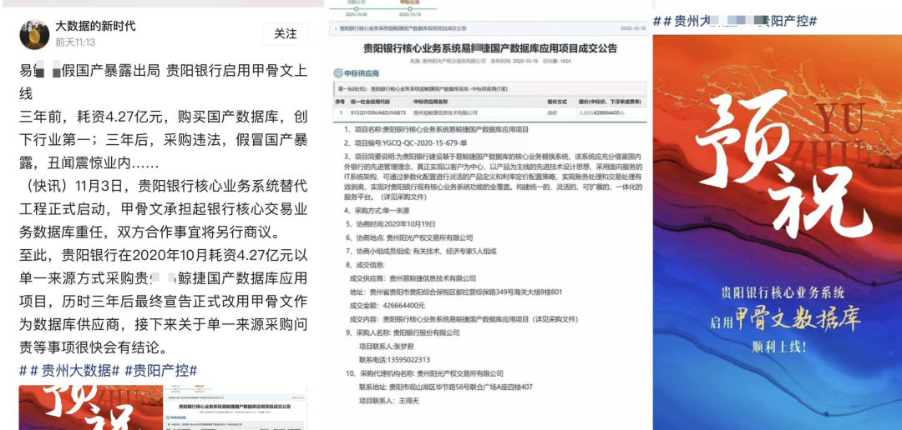

> [微信公众号](https://mp.weixin.qq.com/s/vh1JE_BdaLetWtt5vvPDDw) | [知乎](https://zhuanlan.zhihu.com/p/664816961)

如果说“[云数据库](/cloud/rds/)”算是成本ROI略欠体面的合格品，那么很多“国产数据库”就是烂泥扶不上墙的残次品。信创操作系统数据库约等于 **IT 预制菜进校园**。用户捏着鼻子迁移，开发者假装在卖力，陪着不懂也不在乎技术的领导演戏。大量人力财力被挥霍到没有价值的地方去，反而了浪费掉了真正的机会。[基础软件](http://mp.weixin.qq.com/s?__biz=MzU5ODAyNTM5Ng==&mid=2247486061&idx=1&sn=a1452dfa864f702d40bf612839a4e9e4&chksm=fe4b3fb6c93cb6a0aa5aef59d4381c49354ee0f741dd7e92c91549864ac58597f93a6ab886ed&scene=21#wechat_redirect)行业其实没人卡脖子，真正卡脖子的都是所谓“自己人”。

------

## 垄断关系生意

北京欢乐谷门口大喇叭一直在喊：“*请不要在门外购买劣质矿泉水*”，小贩都被轰的远远儿的。进去后园区就会把一样的东西用五倍的价格卖给你（当然也可能是掺尿内销啤酒这种更烂的东西）。信创数据库与操作系统大体就是这种模式，都是靠垄断保护吃饭的关系生意。这与预制菜进校园有异曲同工之妙：瓦格纳头子靠承包军队/学校伙食发的财都够搞雇佣兵造反了，堪称一本万利。

问题在于，吃预制菜的人不一定有得选，但用数据库和操作系统的用户可以用脚投票，选择更先进还不要钱的开源操作系统/数据库，这可如何是好呢？毕竟国产库很多也是跟在全球开源 OS/DB 社区屁股后面捡面包屑吃。无数国产内核基于开源PG换皮套壳魔改而成。如果说谁在数据库内核上被卡了脖子，那肯定是吃的花样太多给噎着了。

许多公司看 Oracle 大肆收割的眼红的不行不行，羡慕的哈喇子都要流下来了 —— 可如果用户选择直接去用唾手可及的免费开源软件，国产数据库还怎么去割韭菜？这属于国有资产流失啊！土鳖要翻身，得先欺师灭祖：把开源免费的软件包装一下，用 Oracle 的价格卖给你！

首先搞个数据库硬分叉，把 `pg` 这俩字母先重命名一下；掺点垃圾代码混淆，再换用 C++ 搅一搅 —— 100%代码自主率，自主知识产权都有啦。然后找几个高校教授老院士来站台论证一下，开源数据库 MySQL 和 PostgreSQL 都是渣渣。最后给领导讲一讲：境外势力亡我之心不死，开源都是帝国主义摧毁我们国产软件行业的阳谋，得 “***管一管***” ，不抵制不行啦！

开源社区主导的项目都已经深度全球化，单一国家想制裁几乎没有办法：ARM 可以制裁，RISC-V 可以制裁吗？Windows 可以制裁，Linux 可以制裁吗？Oracle / MySQL 可以制裁，PostgreSQL 可以制裁吗？但是别人制裁不了你，你可以“制裁”别人，主动把门给关上呀！

这类企业恐怕做梦都盼着国家被技术封锁：**门只有从两边一起关，才更容易关严实**。门关严实之后，**谁掌握了技术输液管，谁就掌握了利润源泉**：那些掌握了**独占翻墙权**的“国产软件”企业只要定期从全球开源生态拾取些面包渣翻译引入进来，饿的嗷嗷叫的国内用户就要感激涕零，高呼遥遥领先了。

------

## 谁受到了伤害？

**用户是最受伤的**：本来的业务系统跑的好好的，突然就被要求 “升级改造” 了。如果是正向改造，那起码还算是有一些价值，但用来替换现有系统的都是些什么牛鬼蛇神。如果是纯粹的开源换皮也就算了，买点服务兜底还算有价值，最离谱的就是那些做一些自以为是“优化”的魔改阉割版本 —— 大把时间本可以用于更有价值的事情，现在却浪费在削足适履，饮掺尿啤酒，当小白鼠踩坑上了。

**数据库开发者受了伤**，大好的青春年华与技术生涯浪费在没有未来，没有希望的“数据库过家家”游戏上 —— 做出来的东西只能靠销售关系强行填喂给倒霉的用户，听到的都是用户侧同行的怒骂吐槽与冷嘲热讽。就别提技术影响力和出口创汇了，国际同行都不屑于来耻笑一下，“制裁”也不稀得给一个。整个工作毫无技术成就感可言，人也在日复一日的自我怀疑中变得麻木与犬儒。

**国家实力受了伤**。各行业与全球软件产业链主动脱钩：稳定性，功能性，战斗力受创。自主可控是一个真实需求，但盲目推行某某名录，歪曲自主可控的实质内涵（将运维自主可控扭曲为研发自主可控），用劣币驱逐良币，会导致实质的自主可控能力不升反降。

且不说和开源比，就连 Oracle 好歹还是个 Paper License，也有很多三方服务供应商；而有的国产数据库没 License 就立即死给你看，原厂一完蛋，连带着业务系统跟着遭殃。从被国外领先数据库“卡脖子” 换为国内土鳖供应商卡脖子，并不会提高自主可控能力，还额外损失了功能活性

> 《[基础软件需要什么样的自主可控？](/db/sovereign-dbos)》

------

## 劣币驱逐良币

在CSDN最近的开发者调研中，在七成受访者对“国产数据库”持负面印象：“**技术落后**”，“**缺乏创新**”，这算是是一种比较温和的说法。用户心底真正的评价恐怕更为直白：**虚假宣传，大放卫星，落后生产力**。为什么国产数据库的风评如此之差，难道是软件工程师不爱国吗？

根据信通院与墨天轮统计，现在已经有了两百六十多款“国产数据库”。其中基于开源 PostgreSQL / MySQL 的占了半壁江山还多。这是相当离谱的数字，实际上，大量数据库厂商并没有能力提供真正意义上的“产品”，只是把开源数据库简单换皮包装提供服务，辅以炒作一些分布式、HTAP之类的伪需求。

真正自研的数据库出现两极分化：极少数真正有创新贡献与使用价值的产品爱惜羽毛，不会刻意标榜“国产”。而剩下的大多数往往多是闭门造车、技术落后的土法数据库，或者开源古早分叉、负向阉割出来的劣质轮子。**国产数据库并非没有踏实做事的好公司****，只是****“国产”这个标签被大量钻入数据库领域的平庸低劣产品污染**。

更让人扼腕的是劣币驱逐良币。本已稀缺的数据库研发人力经过这样的挥霍，反而会真正卡死国内数据库产业的脖子。特别是核心的OLTP/关系型数据库领域因为开源的存在，已经不缺足够好用的内核了。能把 PostgreSQL / MySQL 用好并提供服务支持，远比自欺欺人的大炼内核要有价值的多。

------

## 出路会在哪里？

中国数据库行业里优秀的工程师并不少，但极其匮乏优秀的领军人物或产品经理。或者说，这种人也有，但根本说不上话。最为重要的是，**要找到正确的问题与正确的方向去发力**。兵熊熊一个，将熊熊一窝：方向对了，即使只有一个人，也能做出有价值的东西；方向错了，养它一千个内核研发也是白努力。

当下的现状是什么？数据库内核已经卷不动了！作为一项有四五十年历史的技术，能折腾的东西已经被折腾的差不多了。业界已经不缺足够完美的数据库内核了 —— 比如 PostgreSQL，功能完备且开源免费（BSD-Like）。无数”国产数据库“基于PG换皮套壳魔改而成。如果说谁在数据库内核上被卡了脖子，**那肯定是吃饱了撑着给噎着的**。

那么，真正稀缺的是什么，是把现有的内核用好的能力。要解决这个问题，有两种思路：第一种是开发**扩展**，以增量功能包的方式为内核加装功能 —— 解决某一个特定领域的问题。第二种是整合生态，将扩展，依赖，底座，基础设施，融合成完整的产品 & 解决方案 —— 数据库**发行版**。

在这两个方向上发力，可以产生实打实的增量用户价值，站在巨人的肩膀上，并深度参与全球软件供应链，响应号召，打造真正意义上的“人类命运共同体”。相反，去分叉一个现有成熟开源内核是极其愚蠢的做法。像 PostgreSQL 与 Linux 这样的 DB/OS 内核是全世界开发者的集体智慧结晶，并通过全世界用户各种场景的打磨与考验，指望靠某一个公司的力量就能与之抗衡是不切实际的妄想。

中国想要打造自己的世界体系，成为负责任的大国，就应当胸怀天下，扛起开源运动的大旗来：展现社会主义公有制制度在软件信息互联网领域的优越性，**积极赞助、参与并引领全球开源软件事业的发展，深度参与全球软件供应链，提高在全球社区中的话语权**。关起门在开源社区后面捡面包屑吃，整天搞一些换皮套壳魔改的小动作，做一些没有使用价值的软件分叉，不仅压制了真正的技术创新潜能，更是会贻笑/自绝于全球软件产业链，拉低自己的竞争力。不可不察也。

---------

## 老冯评论

IT 后发国家如何保证软件系统的自主可控？[瑞士政府通过开源立法](https://mp.weixin.qq.com/s/2fwQi0pf34sCnUzix2_ouw)走在时代前沿，给其他国家打了个样。中说老美政府对开源接受度（相对欧洲）不高是因为美国国内有着无数商业软件、云计算服务公司，是 IT 世界的霸主、创新源泉与先发者。
而后发者如果想要颠覆这种国际秩序，挑战这种软件霸权，真正的王道就是彻底拥抱开源 —— [**软件共产主义**](/cloud/paradigm/)。这也是 **人类命运共同体理念** 在软件世界的真正实践，也是一条切实可行，蓬勃发展的康庄大道。

欧洲国家在这件事上一直走在前沿，即使是半欧半亚的俄罗斯，在真正遭受到制裁之后，也是通过开源来满足 IT 软件需求的 —— Postgres Pro 成为了俄罗斯数据库世界的扛把子，迅速填补支撑起了 Oracle / MySQL 离去后的空白 —— 完全没有什么“卡脖子” 问题，也没有什么奇奇怪怪的 “俄罗斯国产数据库/国产操作系统” 行业。

而 “[**民族主义国产软件**](https://mp.weixin.qq.com/s/aLXC7f2iYUfATNWsnyotkA)” 则是一条会把整个行业带入万劫不复无底深渊的彻底的死路。
有些人精心编制了一个弥天大谎 —— “[**卡脖子**](/db/db-choke/)” 来欺骗祖国，将国家对软件 “[自主可控](/db/sovereign-dbos/)” 的真需求歪曲成 “国产化” 的伪需求而谋取私利。
更是有通过无下限的民族主义营销谋取不正当竞争优势，通过低水平重复性建设、恶性硬分叉社区等行为污染开源软件生态，通过制造割裂与脱钩，让软件行业自绝于世界从而垄断技术话语权，这口毒奶将不知道贻害多少年。

------

总书记在第二十届中央政治局第十一次集体学习会议指出：“**发展新质生产力是推动高质量发展的内在要求和重要着力点**”。那么什么是新质生产力？在基础软件领域，开源就是新质生产力，而套壳换皮魔改开源的 “国产化软件”，[走这条路是走不到世界前列的](/db/db-china/)。

抛开应用 “一行代码不改” 的妄念需求，像 PostgreSQL 这样的开源数据库内核早就可以替代 Oracle 了。许多国产数据库套着PG的皮，打着解决 “Oracle” 卡脖子的幌子，一股脑地去做所谓 “Oracle兼容性” ，[却根本看不到数据库领域的前沿发展方向](https://mp.weixin.qq.com/s/79_PnX-a5iSfDMgz_VUx5A) —— AWS 这样的云厂商拿着开源的 PostgreSQL / MySQL 内核与自己的 [RDS 管控](/cloud/dba-vs-rds) 大杀四方，拳打 Oracle，脚踢 SQL Server，已经是数据库市场大哥大了。

------

高科技行业就是要依靠技术创新驱动。如果你能用开源的PG替代Oracle，那别人也能 —— 最好的结果无非就是甲骨文放弃传统数据库转型做云服务，传统数据库成为低利润的制造业。正如二十年的 PC 行业一样。二十年前 IBM 戴尔惠普都是国际玩家，中国联想说要做到世界一流。今天看联想确实做到了，但是 PC 行业早就不是高科技行业了，只是一个最无聊普通的制造业。

即使是 OB 与 Ti 这样看似最能打的[真自研国产分布式数据库](/db/distributive-bullshit)，所能期待的最好结局也不过是成为数据库行业的长虹，赚五个点的利润。然后被拿着开源 PostgreSQL 内核提供服务的 云厂商 RDS 和本地优先 RDS 骑脸输出按在地上摩擦，和他们心心念念替代的 Oracle 一起 —— 就像二十年前的 IBM IMS 一样，被冲进历史的马桶中。

--------

## 参考阅读

[国产数据库到底能不能打？](/db/db-china)

[数据库真被卡脖子了吗？](/db/db-choke)

[国产数据库是大炼钢铁吗？](https://mp.weixin.qq.com/s/aLXC7f2iYUfATNWsnyotkA)

[基础软件到底需要什么样的自主可控？](/db/sovereign-dbos/)

[中国对PostgreSQL的贡献约等于零吗？](https://mp.weixin.qq.com/s/79_PnX-a5iSfDMgz_VUx5A)

[分布式数据库是伪需求吗？](/db/distributive-bullshit)

[EL 兼容发行版哪家强？](/db/rhel-compatibility)

[机场出租车恶性循环与国产数据库怪圈](https://mp.weixin.qq.com/s/uccjOkAR1zgur6tftHkzMg)

[“卡脖子”一说，为什么误导人](https://mp.weixin.qq.com/s?__biz=MzI0MjU2NTA1Mg==&mid=2247580340&idx=3&sn=5ada961106478ba5c3e447a82077f183&scene=21#wechat_redirect)

[范式转移 — 从云到本地优先](https://mp.weixin.qq.com/s?__biz=MzU5ODAyNTM5Ng==&mid=2247485402&idx=2&sn=eaa19e09c22febd05adc6f71b3667333&scene=21#wechat_redirect)