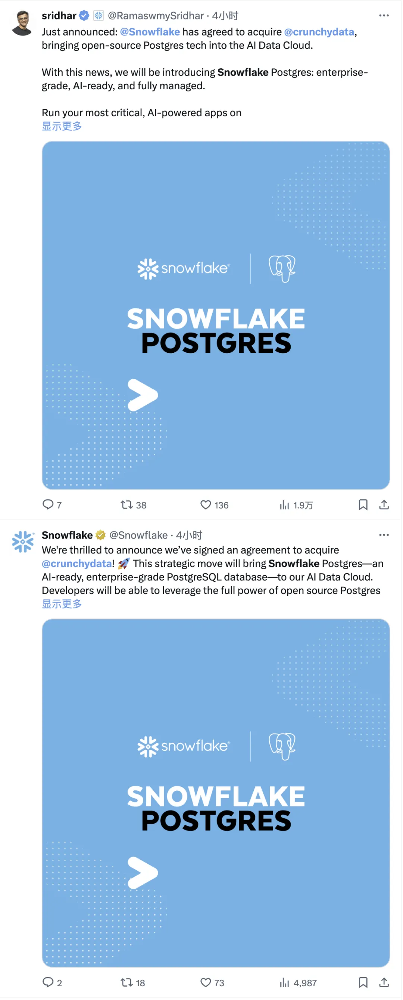
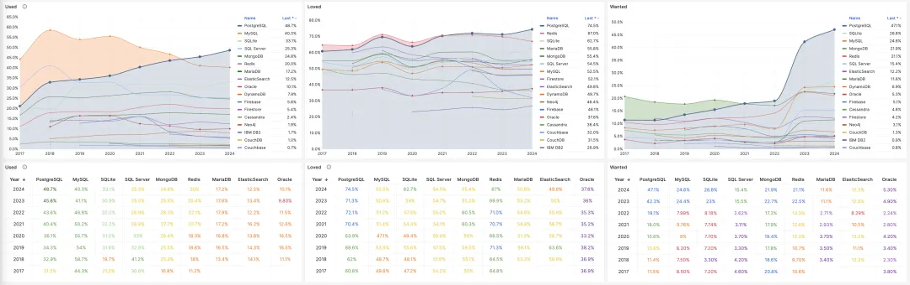
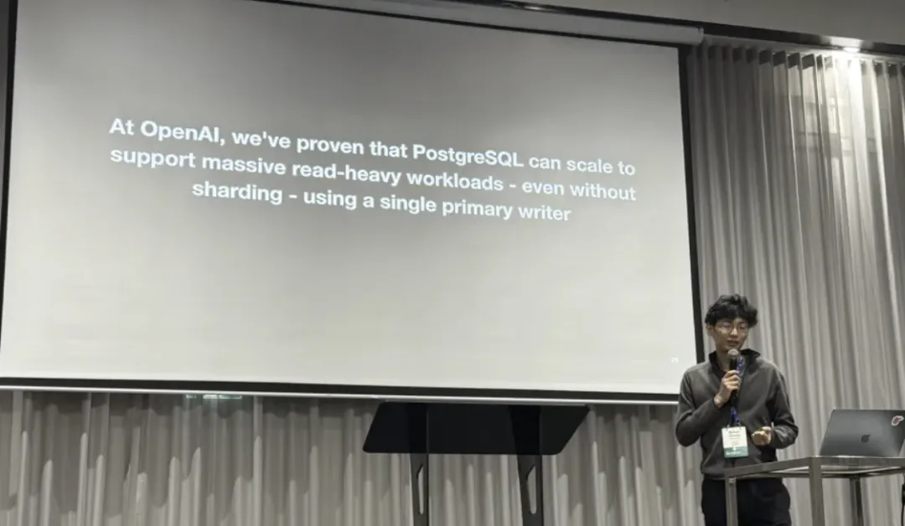
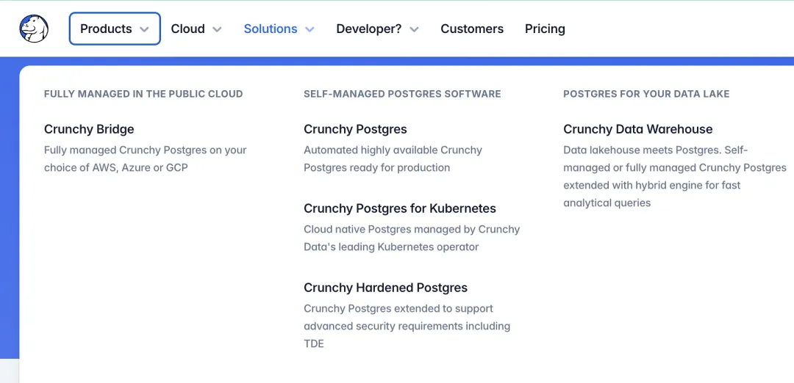
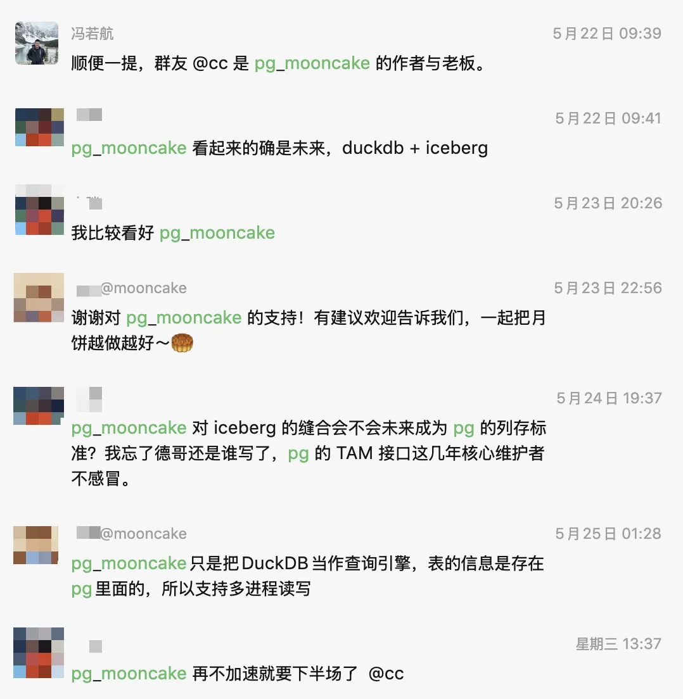
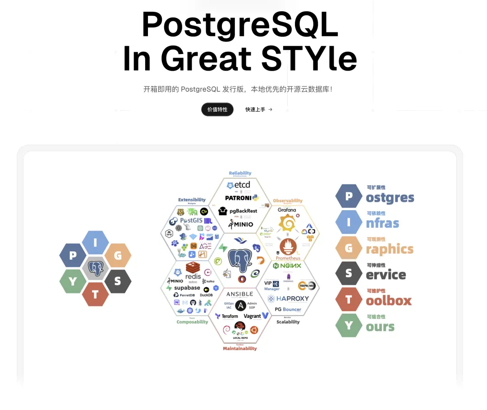
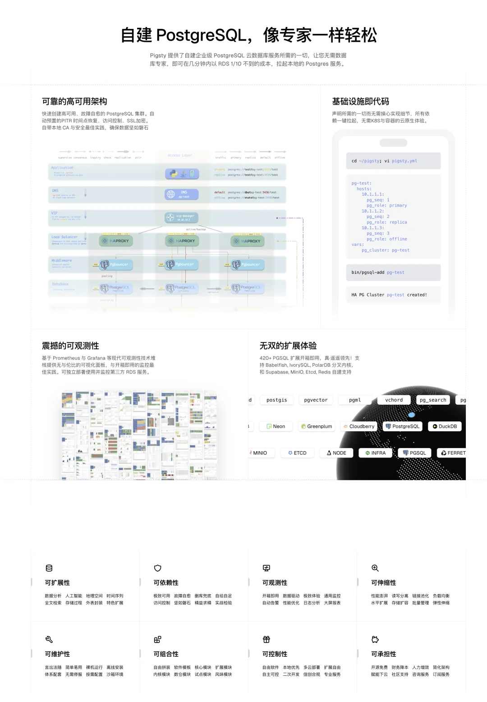

This morning, the industry exploded with news of an acquisition. Following Databricks' $1 billion acquisition of Neon, its rival Snowflake immediately followed by acquiring CrunchyData.

According to insiders, this deal was priced at $250 million. While the price is 1/4 of Neon's, unlike Databricks' stock swap, this time Snowflake paid real cash, giving it a distinctly "whatever Databricks buys, I buy" confrontational flavor.

But this isn't just a grudge match between two data warehouse giants - PostgreSQL has indeed captured all the favorable timing for database rise in the AI era. Combined with the industry rumors of [OpenAI acquiring Supabase](https://mp.weixin.qq.com/s?__biz=MzU5ODAyNTM5Ng==&mid=2247489695&idx=1&sn=eb0aa2286ecdbb014fd6b38023ae6749&scene=21#wechat_redirect), it's clear that the common thread among these acquisitions (or potential acquisition intentions) is that these are all PostgreSQL companies - PostgreSQL companies are becoming the hottest commodities in capital markets.

- [PG-Ecosystem Wins Capital Market Favor: Databricks Acquires Neon, Supabase Raises $200M, Microsoft Earnings Call Names PG](https://mp.weixin.qq.com/s?__biz=MzU5ODAyNTM5Ng==&mid=2247489652&idx=1&sn=d68e7fc8433a82c1f1de59a9da0738ba&scene=21#wechat_redirect)
- [Database Tea Room: OpenAI to Acquire Supabase?](https://mp.weixin.qq.com/s?__biz=MzU5ODAyNTM5Ng==&mid=2247489695&idx=1&sn=eb0aa2286ecdbb014fd6b38023ae6749&scene=21#wechat_redirect)

> WSJ: Snowflake to acquire Crunchy Data for $250 million[1]

-------

## Why PostgreSQL?

Why is this phenomenon occurring? Microsoft CEO Nadella has already made it very clear - the constant in the AI era is databases ("[SaaS is Dead? In the AI Era, Software Starts from Databases](https://mp.weixin.qq.com/s?__biz=MzU5ODAyNTM5Ng==&mid=2247489605&idx=1&sn=22aa5f6f18b871b2a216bc46dbaea42c&scene=21#wechat_redirect)"). The frontend might shrink to a dialog box or just be voice interaction, while part of the backend gets replaced by Agents and another part merges into databases

(like Supabase). Throughout the entire IT field, only databases remain indispensable in the AI era.

So who will become the database of the AI era? Among global developers, this question has long had consensus. [PostgreSQL became the most used, most loved, and most in-demand database among global developers three years ago](https://mp.weixin.qq.com/s?__biz=MzU5ODAyNTM5Ng==&mid=2247488057&idx=1&sn=6733b62b5cd48c62acd798fc48db1c92&scene=21#wechat_redirect).

For example, when I asked OpenAI friends **why they chose PostgreSQL**, they asked me back: "Isn't PostgreSQL the default choice and safe bet now? Not using PostgreSQL would need special reasons!" ("[OpenAI: Scaling PostgreSQL to New Heights](/db/openai-pg)").

Companies like OpenAI and Cursor can support their business with just a single master-slave PostgreSQL setup at "true Web Scale" application scale - other companies' scenarios are naturally even less challenging.

Now, PostgreSQL has not only become consensus among developers, entrepreneurs, and industry, but has also won capital's favor. Capital has already voted with its feet - PostgreSQL is the database of the AI era.

Many ask, why PostgreSQL? Lao Feng already explained this in "[PostgreSQL is Eating the Database World](https://mp.weixin.qq.com/s?__biz=MzU5ODAyNTM5Ng==&mid=2247487055&idx=1&sn=9d7bd8b6d9b07478dba7f87d0a663535&scene=21#wechat_redirect)". PostgreSQL is the only **framework** capable of devouring the entire database world.

Open source and advanced technology are PG's backbone, while its edge is "extensibility." **More and more database subdivisions are being integrated into the PostgreSQL ecosystem as "plugins"**. Powerful extensibility has not only made PostgreSQL the [de facto standard in the OLTP world](https://mp.weixin.qq.com/s?__biz=MzU5ODAyNTM5Ng==&mid=2247489822&idx=1&sn=64d32013b4197f9803ad4cf6688925db&scene=21#wechat_redirect), but also gives it a head start in [integrating OLAP big data ecosystems](https://mp.weixin.qq.com/s?__biz=MzU5ODAyNTM5Ng==&mid=2247488131&idx=1&sn=9dc6a377d0b24fb7b92cac840b229433&scene=21#wechat_redirect).

## About CrunchyData

The acquired CrunchyData is one of the main players in the [DuckDB stitching competition](https://mp.weixin.qq.com/s?__biz=MzU5ODAyNTM5Ng==&mid=2247489279&idx=1&sn=ca161963f98ec000a4d3bba41edaea85&scene=21#wechat_redirect). Their recent focus has been on PostgreSQL data warehousing (Crunchy Bridge). They also have a related open-source project `pg_parquet` that provides the ability to read and write Parquet files on S3 from PG. When it first came out, I packaged it and put it in the [Pigsty extension repository](https://mp.weixin.qq.com/s?__biz=MzU5ODAyNTM5Ng==&mid=2247488596&idx=1&sn=d60c8b73d154fd07201b5a81bc106805&scene=21#wechat_redirect), and some users are actually using it.

CrunchyData is a well-known company in the PostgreSQL ecosystem. Tom Lane, a core member of the PostgreSQL community, works at this company. Their core business can be roughly summarized as:

**A PostgreSQL database distribution**: Crunchy Certified PostgreSQL, basically still the usual high availability monitoring backup recovery stuff, with distinctive enterprise security features like SELinux integration/TDE and compliance certifications. Plus some remote DBA, training certification services.

A **Postgres Kubernetes Operator**. Lao Feng [isn't fond of putting databases in K8S](https://mp.weixin.qq.com/s?__biz=MzU5ODAyNTM5Ng==&mid=2247486587&idx=1&sn=16521d6854711a4fe429464aeb2df6bd&scene=21#wechat_redirect), but clearly CrunchyData's PGO is definitely a first-tier leading player in this field.

And the **PostgreSQL data warehouse** they've been pushing since last year - yes, stitching DuckDB and Iceberg stuff into PostgreSQL.

## Lao Feng's Commentary

Lao Feng thinks Snowflake's acquisition of CrunchyData is very wise. Besides PostgreSQL itself being genuinely useful (Snowflake has always wanted to enter the OLTP field) (constructive factor participation in distribution), there's also a hidden important thread (**destructive factor participation in distribution**).

### Big Data Futures Kill People

This involves a key industry insight - as the DuckDB manifesto says: [Big Data is Dead](https://mp.weixin.qq.com/s?__biz=MzU1NTg2ODQ5Nw==&mid=2247488697&idx=1&sn=53f5016903eb5560c2f3006a261385db&scene=21#wechat_redirect) (futures kill people). This trend actually showed signs ten years ago ("[The Lost Decade of Small Data: The Misdirection of Distributed Analytics](https://mp.weixin.qq.com/s?__biz=MzU5ODAyNTM5Ng==&mid=2247489788&idx=1&sn=23befb6797fdd4ac7a073d49802aa980&scene=21#wechat_redirect)"), but the real impact has only started showing in recent years - **that is, with modern hardware performance levels, single machines (PostgreSQL/DuckDB) are sufficient to handle data analysis for the vast majority (let's say 99.99%) of application scenarios**.

CrunchyData happened to start pushing this last year in my article "[PostgreSQL is eating the database world](/pg/pg-eat-db-world)", which would have a devastating effect on Snowflake, which started with data warehousing.

Simply put, if the de facto standard for OLTP is already PG, isn't it more convenient, cost-effective, and worry-free for users to directly use PG for OLAP rather than ETL to Snowflake or other big data solutions? We did this at Apple a few years ago, using PostgreSQL simultaneously as OLTP/OLAP for industrial control systems, solving all problems with one database and directly eliminating the entire "big data" department. But five years ago this was niche cutting-edge exploration; five years later this practice has entered mainstream view.

**The final kick to make this practice mainstream is PG stitching with DuckDB** (DuckLake or Iceberg). Once the stitching is good enough, PG's OLAP analysis performance directly enters the T0 tier, **then these OLAP/big data solutions have no way to survive** - I describe this as "[Mars Hitting Earth](https://mp.weixin.qq.com/s?__biz=MzU5ODAyNTM5Ng==&mid=2247489279&idx=1&sn=ca161963f98ec000a4d3bba41edaea85&scene=21#wechat_redirect)" in the database world.

The **key obstacle** to this is PG's storage engine table access interface (TAM). This happens to be in the hands of Tom Lane at CrunchyData.

### PG-Kernel's Veto Power

Over the past year, Tom Lane at CrunchyData has thrown quite a few wrenches into PG's table access interface (TAM), allowing CrunchyBridge to gain some advantages in data warehouse stitching (Duck/Iceberg), causing some controversy in the circle. For example, De Ge directly spoke about this:

- "[What? PostgreSQL big shot Tom Lane's company Crunchy 'imitating' DuckDB creativity?](https://mp.weixin.qq.com/s?__biz=MzA5MTM4MzY1Mw==&mid=2247485143&idx=1&sn=a31587a79f17f585f4506cca374f139d&scene=21#wechat_redirect)"
- "[Tom Lane gets 'revenge'? CrunchyData meets strongest open-source opponent pg_duckdb](https://mp.weixin.qq.com/s?__biz=MzA5MTM4MzY1Mw==&mid=2247486585&idx=1&sn=8b7f1dbb62430322930d9aa35d3cb1e5&scene=21#wechat_redirect)"

Now, if you're Snowflake's CEO, what's the most effective way to prevent (or guide/control) the PG Duck convergence trend? Directly control a core member of the PG community, master veto power over new features in the PG community, effectively block evolution of the PG TAM table access interface, thus locking the ceiling of pg and duckdb stitching. Acquiring CrunchyData actually achieves this effect.

Moreover, Snowflake can push some changes beneficial to integrating PG/Snowflake into the PG kernel, thus gaining advantage and initiative in OLAP world integration during PG's process of devouring the database world. Their competitors (like Supabase-acquired OrioleDB, pg_duckdb, pg_mooncake) will face some constraints, with a vague "using the emperor to command the princes" feeling.

For example, Neon's founder invested in pg_mooncake, and Databricks (Snowflake's rival) acquired Neon. Since the archrival already has PG OLAP analysis layout, this acquisition can also constrain competitors.

Of course, this path can at most be called "containment" and can't completely block it. For example, pg_mooncake recently started rewriting entirely in Rust, simply using TAM rather than being locked into it. Where there's a will, there's a way.

On the other hand, Supabase (rumored to be acquired by OpenAI) plans to use the [OrioleDB](https://mp.weixin.qq.com/s?__biz=MzU5ODAyNTM5Ng==&mid=2247489444&idx=1&sn=840f6632e27899b6764b8c0f96cd368e&scene=21#wechat_redirect) kernel, which also depends on several table access method patches that have been stuck and haven't entered the PG 18 kernel. This acquisition can also constrain other companies wanting to take this path - killing two birds with one stone.

### Talent is the Most Critical Factor

Databricks, Snowflake, and (OpenAI) have undoubtedly launched a new round of acquisition battles in the database market.

The logic behind this is clear: databases remain a solid core department in the AI era, and PostgreSQL is "unifying and conquering" the entire database world. Therefore, timely cultivation and acquisition of proxies in this field becomes very important. Those companies that dominate and excel admirably in the PostgreSQL field are now extremely few - this is a game of "musical chairs." Whoever can grab the core talent from these companies and bring them into their fold will be able to occupy larger ecological niches in the future.

In this regard, Lao Feng is quite proud, because among all these PostgreSQL companies, only Lao Feng is a "**one-person company**." Lao Feng knows very well how lively this field is - even I, an "individual entrepreneur," have a valuation of 100 million (by Lu Qi) - and more than one cloud vendor has offered 20 million trying to acquire, though they're all quite cunning, wanting to lock me in personally at cheaper prices. Anyway, Lao Feng is already profitable and stable - I'm not the one who's anxious.

The logic behind this is that a single top-tier talent can destroy attempts to achieve industry monopoly alliances - based on the current deployment scale of open-source Pigsty, causing over 100 million in losses to RDS annually is a very conservative estimate - and it's still growing. After all, who can beat zero-yuan shopping powered by love in price wars?

What's more, this "open-source cancer" has already spilled over from China to roll globally (40%+ users from overseas). Honestly - **this kind of world-changing table-flipping fun can't be matched by earning any amount of money.** Lao Feng is also working hard to see if I can make Pigsty the DeepSeek of the database field, haha.

### Ad Time

As usual, what's the point of writing articles without ads? 😁

Open-source free PostgreSQL distribution: Look for Pigsty

https://pigsty.io

