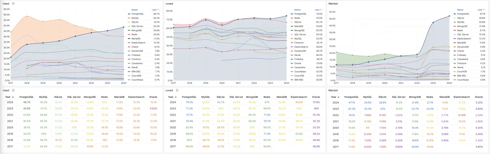
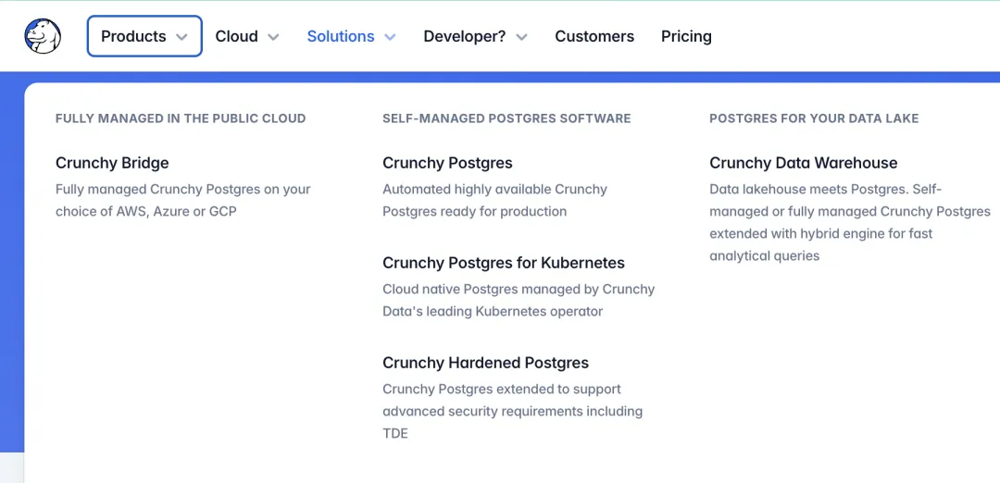
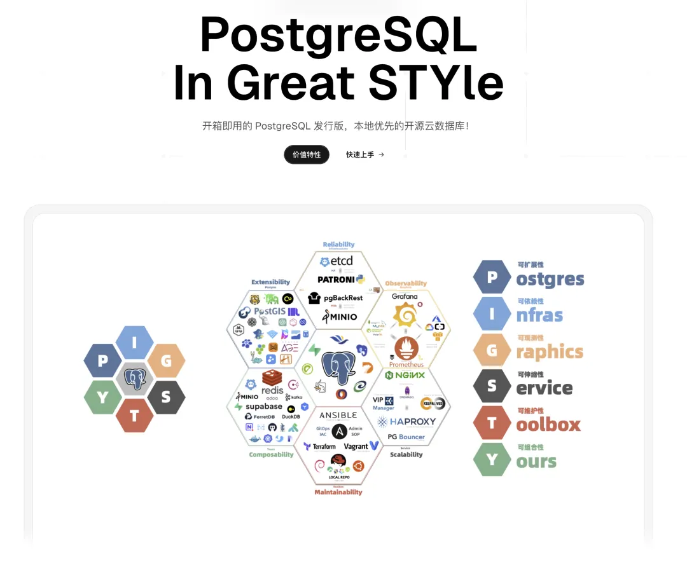

今天早上业界爆出一个收购案，继 Databricks 以十亿美元收购 Neon 之后，它的老对手 Snowflake 紧接着收购了 CrunchyData。

据知情人士透露，这笔交易的价格为 2.5亿美元。虽然价格是 Neon 的 1/4 ，但不同于 DataBricks 股票置换，这次 SnowFlake 是真金白银出了钱的，颇有 “Databricks 买啥我买啥” 针锋相对的意味。

但这并非两家数仓巨头的意气之争，而是 PostgreSQL 确实占尽了 AI 时代数据库崛起的天时 —— 加上业界正在流传的 [OpenAI 将收购 Supabase](https://mp.weixin.qq.com/s?__biz=MzU5ODAyNTM5Ng==&mid=2247489695&idx=1&sn=eb0aa2286ecdbb014fd6b38023ae6749&scene=21#wechat_redirect)，不难发现，这些收购案（或者潜在收购意向）的共同点是 —— 这些都是做 PostgreSQL 的公司 —— PostgreSQL 公司正在成为资本市场最抢手的香饽饽。

- [PG生态赢得资本市场青睐：Databricks收购Neon，Supabase融资两亿美元，微软财报点名PG](https://mp.weixin.qq.com/s?__biz=MzU5ODAyNTM5Ng==&mid=2247489652&idx=1&sn=d68e7fc8433a82c1f1de59a9da0738ba&scene=21#wechat_redirect)
- [数据库茶水间：OpenAI拟收购Supabase ？](https://mp.weixin.qq.com/s?__biz=MzU5ODAyNTM5Ng==&mid=2247489695&idx=1&sn=eb0aa2286ecdbb014fd6b38023ae6749&scene=21#wechat_redirect)

> WSJ: Snowflake 将以 2.5 亿美元收购 Crunchy Data[1]

-------

## 为什么是PostgreSQL？

为什么会出现这样的现象呢？微软 CEO 纳德拉已经说的很清楚了，AI 时代的不变量是数据库（《[SaaS已死？AI时代，软件从数据库开始](https://mp.weixin.qq.com/s?__biz=MzU5ODAyNTM5Ng==&mid=2247489605&idx=1&sn=22aa5f6f18b871b2a216bc46dbaea42c&scene=21#wechat_redirect)》）。前端可能会收缩成一个对话框或者干脆就是语音交互，而后端一部分被 Agent 替代，另一部份融入数据库里

（比如 Supabase）。整个 IT 领域中，只有数据库，依然在 AI 时代不可或缺。

那么谁会成为 AI 时代的数据库？在全球开发者中，这个问题早就已经有公论了。[PostgreSQL 早在三年前就已经成为全球开发者使用率最高，最喜爱，需求量最大的数据库](https://mp.weixin.qq.com/s?__biz=MzU5ODAyNTM5Ng==&mid=2247488057&idx=1&sn=6733b62b5cd48c62acd798fc48db1c92&scene=21#wechat_redirect)。

比如，当我问 OpenAI 的朋友，**你们为什么选型 PostgreSQL 的时候**，他反问了我一句：”PostgreSQL 难道不是现在的默认选择和安全牌吗？不用 PostgreSQL 才需要特殊的理由吧！“（《[OpenAI：将PostgreSQL伸缩至新阶段](/db/openai-pg)》）

像 OpenAI 和 Curosr 这样的公司，他们的 ”真·Web Scale“ 应用规模可以只用一套主从 PostgreSQL 支撑起其业务，其他的公司的场景自然也更不在话下。

而现在，PostgreSQL 不仅仅已经成为开发者，创业者，产业界的共识，更是赢得了资本的青睐。资本已经用脚投好票了 —— PostgresQL 就是 AI 时代的数据库。

很多人问，为什么是 PostgreSQL？ 这个问题，老冯已经在《[PostgreSQL 正在吞噬数据库世界](https://mp.weixin.qq.com/s?__biz=MzU5ODAyNTM5Ng==&mid=2247487055&idx=1&sn=9d7bd8b6d9b07478dba7f87d0a663535&scene=21#wechat_redirect)》 一文中解释过了。PostgreSQL 是唯一具有吞噬整个数据库世界能力的 **框架**。

开源与先进是 PG 的 BackBone，而它的 Edge 是 “可扩展性”。**越来越多的数据库细分领域开始以“插件”的形式被整合到 PostgreSQL 生态中，**强大的可扩展性不仅让 PostgreSQL 已经成为了 [OLTP 世界的事实标准](https://mp.weixin.qq.com/s?__biz=MzU5ODAyNTM5Ng==&mid=2247489822&idx=1&sn=64d32013b4197f9803ad4cf6688925db&scene=21#wechat_redirect) ，更是让它在 [整合 OLAP 大数据生态](https://mp.weixin.qq.com/s?__biz=MzU5ODAyNTM5Ng==&mid=2247488131&idx=1&sn=9dc6a377d0b24fb7b92cac840b229433&scene=21#wechat_redirect) 占尽先机。

## 关于 CrunchyData

本次被收购的 CrunchyData 就是 [DuckDB 缝合大赛](https://mp.weixin.qq.com/s?__biz=MzU5ODAyNTM5Ng==&mid=2247489279&idx=1&sn=ca161963f98ec000a4d3bba41edaea85&scene=21#wechat_redirect) 的主要玩家之一。他们最近主要发力的点就在于 PostgreSQL 数据仓库 （Crunchy Bridge），他们还有一个相关的开源项目 `pg_parquet` ，提供了在 PG 中读写 S3 上 Parquet 文件的能力，刚出来的时候我就打好了包放在 [Pigsty 扩展仓库](https://mp.weixin.qq.com/s?__biz=MzU5ODAyNTM5Ng==&mid=2247488596&idx=1&sn=d60c8b73d154fd07201b5a81bc106805&scene=21#wechat_redirect)中，也真的有一些用户在用。

CrunchyData 是 PostgreSQL 生态的知名公司，PostgreSQL 社区的核心组成员 Tom Lane 就任职于这家公司。他们的核心业务大致可以概括为以下几项：

**一个 PostgreSQL 数据库发行版**：Crunchy Certified PostgreSQL，大体上就还是那些高可用监控备份恢复的东西，比较有特色的是一些企业安全特性，比如 SELinux 集成/ TDE 与合规认证。还有一些远程DBA，培训认证之类的服务。

一个 **Postgres Kubernetes Operator**，老冯对 [K8S放数据库这种事不感冒](https://mp.weixin.qq.com/s?__biz=MzU5ODAyNTM5Ng==&mid=2247486587&idx=1&sn=16521d6854711a4fe429464aeb2df6bd&scene=21#wechat_redirect) ，但显然 CrunchyData 的 PGO 在这个领域绝对算是第一梯队的头部玩家。

以及从去年开始发力的 **PostgreSQL 数据仓库**，啊对，就是把 DuckDB 和 Iceberg 这些东西缝合进 PostgreSQL 里面。

## 老冯点评

老冯觉得 Snowflake 收购 CrunchyData 是很明智的，除了 PostgreSQL 本身确实非常有用之外（Snowflake一直想要进军 OLTP 领域）（建设性要素参与分配），还有一条隐藏的重要线索（**破坏性要素参与分配**）。

### 大数据期货死人

这里涉及到一条关键行业认知与洞察 —— 正如 DuckDB 宣言说的那样：[大数据已死](https://mp.weixin.qq.com/s?__biz=MzU1NTg2ODQ5Nw==&mid=2247488697&idx=1&sn=53f5016903eb5560c2f3006a261385db&scene=21#wechat_redirect)（期货死人）。其实这个趋势在十年前就出现苗头《[小数据的失落十年：分布式分析的错付](https://mp.weixin.qq.com/s?__biz=MzU5ODAyNTM5Ng==&mid=2247489788&idx=1&sn=23befb6797fdd4ac7a073d49802aa980&scene=21#wechat_redirect)》，但真正的影响在最近几年在开始显现 —— **也就是以现代硬件的表现水平，单机（PostgreSQL / DuckDB）已经足以处理绝大多数（let's say 99.99%）应用场景的数据分析了。**

CrunchyData 正好是在去年我那篇 《[PostgreSQL is eating the database world](/pg/pg-eat-db-world)），而这会对以数仓起家的 Snowflake 起到釜底抽薪的效果。

简单来说，OLTP 的事实标准已经是 PG 了，那么用户直接拿 PG 同样干 OLAP 是不是比 ETL 到 Snowflake 或者其他大数据方案更省事，省人，省心呢？几年前我们在 Apple 就是这么干的，同时用 PostgreSQL 作为工控系统的 OLTP / OLAP ，一个数据库搞定所有问题，直接省掉整个“大数据”部门。但五年前这算小众前沿探索，五年后这种实践已经进入大众视野了。

**现在这种实践成为主流的最后的临门一脚，就是 PG 缝合 DuckDB**，（DuckLake 或者 Iceberg） 一旦缝合足够好，PG 的 OLAP 分析性能直接进入 T0 梯队，**那么这些 OLAP / 大数据方案就没有活路了** —— 我将其形容为数据库世界中的 “[火星撞地球](https://mp.weixin.qq.com/s?__biz=MzU5ODAyNTM5Ng==&mid=2247489279&idx=1&sn=ca161963f98ec000a4d3bba41edaea85&scene=21#wechat_redirect)”。

这件事的**关键阻碍**是什么，是 PG 的存储引擎表访问接口（TAM）。这就正好卡在 CrunchyData 的 Tom Lane 手中。

### PG内核的否决权

过去一年，Tom Lane 在 CrunchyData 就给 PG 的表访问接口（TAM）使过不少绊子，这让 CrunchyBridge 能够在数仓缝合（Duck/Iceberg）上获得一些优势，圈子内引起了一些非议，比如德哥就直白的说过这个事：

- 《[什么? PostgreSQL大佬tom lane公司crunchy“模仿”DuckDB创意?](https://mp.weixin.qq.com/s?__biz=MzA5MTM4MzY1Mw==&mid=2247485143&idx=1&sn=a31587a79f17f585f4506cca374f139d&scene=21#wechat_redirect)》
- 《[Tom lane被“报复”? CrunchyData遇最强开源对手pg_duckdb](https://mp.weixin.qq.com/s?__biz=MzA5MTM4MzY1Mw==&mid=2247486585&idx=1&sn=8b7f1dbb62430322930d9aa35d3cb1e5&scene=21#wechat_redirect)》

好，现在如果你是 Snowfake 的 CEO，最有效地阻止（或引导控制） PG Duck 合流趋势的做法是什么？就是直接控制一名 PG 社区核心组的成员，掌握了 PG 社区新特性的 veto 一票否决权，就可以有效阻止 PG TAM 表访问接口的演进，从而锁死 pg 与 duckdb 缝合的天花板。收购 CrunchyData 实际上就起到了这个效果。

而且 Snowflake 还可以推动一些有利于整合 PG / Snowfalke 的变化进入 PG 内核，从而在 PG 吞噬数据库世界的进程中，在 OLAP 世界整合上占据先机与优势。而它的对手（比如 Supabase 收购的 OrioleDB ，pg_duckdb, pg_mooncake ）会受到一些牵制，隐隐有一种 “挟天子以令诸侯” 的感觉。

举个例子，Neon 创始人投资了 pg_mooncake ，而 Snowflake 的老对手 Databricks 收购了 Neon，既然死对头已经有了 PG OLAP 分析的布局，那么这一收购还能起到牵制竞争对手的效果。

当然，这条路最多只能说的上是 “牵制”，而堵不死。比如 pg_mooncake 最近就在整个用 Rust 重写，简单使用 TAM 而非锁死在上面。只要思想不滑坡，办法总比困难多。

另一方面，OpenAI 传言要收购的 Supabase，它准备使用 [OrioleDB](https://mp.weixin.qq.com/s?__biz=MzU5ODAyNTM5Ng==&mid=2247489444&idx=1&sn=840f6632e27899b6764b8c0f96cd368e&scene=21#wechat_redirect) 内核，也依赖几个表访问方法的补丁，一直卡着没进入 PG 18 内核，那么这一收购还能牵制住其他想走这条路的公司，可谓一石二鸟。

### 人才是最关键的因素

Databricks，Snowflake，以及（OpenAI） 毫无疑问的拉起了数据库市场中的新一轮抢购战斗。

背后的逻辑很清楚：数据库在 AI 时代依然是坚挺的核心部门，而 PostgreSQL 正在 “统一与征服” 整个数据库世界，那么及时培养收购自己在这个领域的代理人就非常重要了。那些在 PostgreSQL 领域独占鳌头，令人赞叹的优秀公司，如今只剩下极少数，这是一场“抢椅子”游戏，谁能抓住这些公司里的核心人才，将其收入囊中，谁就能抢先在未来占据更大的生态位。

在这一点上，老冯还是比较得意的，因为所有这些 PostgreSQL 公司里面，只有老冯是 “**一人公司**”。老冯很清楚这个领域有多热闹，就连我这个 “个体户” 都有一个亿的估值（by 陆奇） —— 而且已经有不只一家云厂商开价两千万尝试收购了，不过他们都很鸡贼的想用更便宜的价格直接挖走锁死我个人。反正老冯已经稳定盈利了，着急的也不是我。

背后的逻辑是，一个在野的顶级人才能毁坏达成行业垄断联盟的尝试 —— 以现在开源 Pigsty 使用的部署规模来看，给 RDS 每年造成过亿损失算是非常保守估计了 —— 而且还在不断增长，毕竟价格战谁打的过用爱发电的零元购呢？

何况现在这股 “开源癌” 已经从中国溢出来卷全球了（40+% 用户来自海外）。老实说 —— **这种改变世界的掀桌子乐趣是赚多少钱都比不了的。**老冯也努努力，看看能不能把 Pigsty 做成数据库领域的 DeepSeek，哈哈。

### 广告时间

老规矩，不打广告，写啥文章？😁

开源免费 PostgreSQL 发行版：认准 Pigsty

https://pigsty.io

