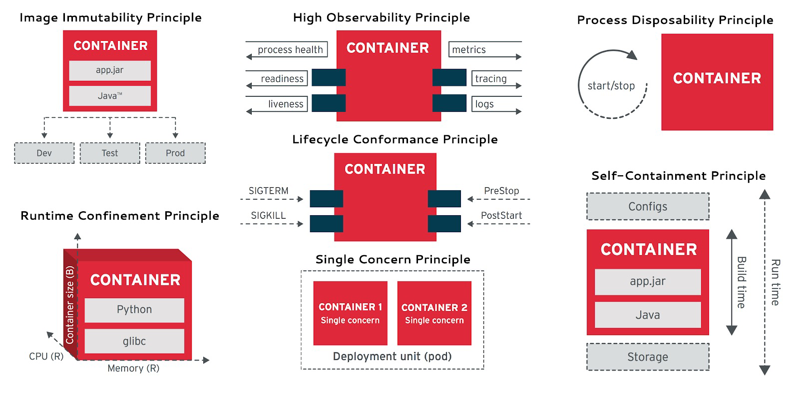
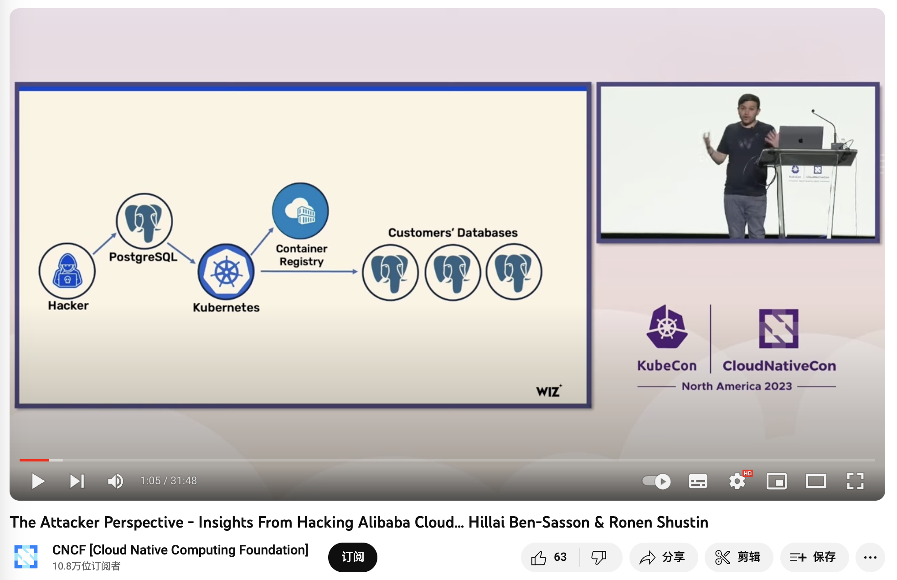

> [Medium](https://medium.com/@fengruohang/database-in-kubernetes-is-that-a-good-idea-daf5775b5c1f) ｜[Wechat](https://mp.weixin.qq.com/s/4a8Qy4O80xqsnytC4l9lRg)

Whether databases should be housed in Kubernetes/Docker remains highly controversial. While Kubernetes (k8s) excels in managing stateless applications, it has fundamental drawbacks with stateful services, especially databases like PostgreSQL and MySQL.

In the previous article, "Databases in Docker: Good or Bad," we discussed the pros and cons of containerizing databases. Today, let's delve into the trade-offs in orchestrating databases in K8S and explore why it's not a wise decision.

-----------

## Summary

Kubernetes (k8s) is an exceptional container orchestration tool aimed at helping developers better manage a vast array of complex stateless applications. Despite its offerings like StatefulSet, PV, PVC, and LocalhostPV for supporting stateful services (i.e., databases), these features are still insufficient for running production-level databases that demand higher reliability.

Databases are more like "**pets**" than "**cattle**" and require careful nurturing. Treating databases as "cattle" in K8S essentially turns external disk/file system/storage services into new "database pets." Running databases on EBS/network storage presents significant disadvantages in reliability and performance. However, using high-performance local NVMe disks will make the database bound to nodes and non-schedulable, negating the primary purpose of putting them in K8S.

Placing databases in K8S results in a **"lose-lose"** situation - K8S loses its simplicity in statelessness, lacking the flexibility to quickly relocate, schedule, destroy, and rebuild like purely stateless use. On the other hand, databases suffer several crucial attributes: reliability, security, performance, and complexity costs, in exchange for limited "elasticity" and utilization - something virtual machines can also achieve. For users outside public cloud vendors, the disadvantages far outweigh the benefits.

The "**cloud-native frenzy**," exemplified by K8S, has become a distorted phenomenon: adopting k8s for the sake of k8s. Engineers add extra complexity to increase their irreplaceability, while managers fear being left behind by the industry and getting caught up in deployment races. Using tanks for tasks that could be done with bicycles, to gain experience or prove oneself, without considering if the problem needs such "dragon-slaying" techniques - this kind of architectural juggling will eventually lead to adverse outcomes.

Until the reliability and performance of the network storage surpass local storage, placing databases in K8S is an unwise choice. There are other ways to seal the complexity of database management, such as RDS and open-source RDS solutions like [**Pigsty**](http://mp.weixin.qq.com/s?__biz=MzU5ODAyNTM5Ng==&mid=2247485518&idx=1&sn=3d5f3c753facc829b2300a15df50d237&chksm=fe4b3d95c93cb4833b8e80433cff46a893f939154be60a2a24ee96598f96b32271301abfda1f&scene=21#wechat_redirect), which are based on bare Metal or bare OS. Users should make wise decisions based on their situations and needs, carefully weighing the pros and cons.

---------

## The Status Quo

K8S excels in orchestrating stateless application services but was initially limited to stateful services. Despite not being the intended purpose of K8S and Docker, the community's zeal for expansion has been unstoppable. Evangelists depict K8S as the next-generation cloud operating system, asserting that databases will inevitably become regular applications within Kubernetes. Various abstractions have emerged to support stateful services: StatefulSet, PV, PVC, and LocalhostPV.

Countless cloud-native enthusiasts have attempted to migrate existing databases into K8S, resulting in a proliferation of CRDs and Operators for databases. Taking PostgreSQL as an example, there are already more than ten different K8S deployment solutions available: PGO, StackGres, CloudNativePG, PostgresOperator, PerconaOperator, CYBERTEC-pg-operator, TemboOperator,  Kubegres, KubeDB, KubeBlocks, and so on. The CNCF landscape rapidly expands, turning into a playground of complexity.

However, complexity is a cost. With "cost reduction" becoming mainstream, voices of reflection have begun to emerge. Could-Exit Pioneers like DHH, who deeply utilized K8S in public clouds, abandoned it due to its excessive complexity during the transition to [self-hosted open-source solutions](https://mp.weixin.qq.com/s/CicctyvV1xk5B-AsKfzPjw), relying only on Docker and a Ruby tool named Kamal as alternatives. Many began to question whether stateful services like databases suit Kubernetes.

K8S itself, in its effort to support stateful applications, has become increasingly complex, straying from its original intention as a container orchestration platform. Tim Hockin, a co-founder of Kubernetes, also voiced his rare concerns at this year's KubeCon in ["K8s is Cannibalizing Itself!"](https://mp.weixin.qq.com/s/9Q9kze9D2LT0-G2lXSvADg): "***Kubernetes has become too complex; it needs to learn restraint, or it will stop innovating and lose its base***."

----------

## Lose-Lose Situation

In the cloud-native realm, the analogy of "pets" versus "cattle" is often used for illustrating stateful services. "Pets," like databases, need careful and individual care, while "cattle" represent disposable, stateless applications (Disposability).

> Cloud Native Applications 12 Factors: **Disposability**

One of the leading architectural goals of K8S is to **treat what can be treated as cattle as cattle**. The attempt to "separate storage from computation" in databases follows this strategy: splitting stateful database services into state storage outside K8S and pure computation inside K8S. The state is stored on the EBS/cloud/ disk/distributed storage service, allowing the "stateless" database part to be freely created, destroyed, and scheduled in K8S.

Unfortunately, databases, especially OLTP databases, heavily depend on disk hardware, and network storage's reliability and performance still lag behind local disks by [orders of magnitude](https://mp.weixin.qq.com/s/UxjiUBTpb1pRUfGtR9V3ag). Thus, K8S offers the LocalhostPV option, allowing containers to use data volumes directly lies on the host operating system, utilizing high-performance/high-reliability local NVMe disk storage.

However, this presents a dilemma: should one use subpar cloud disks and tolerate poor database reliability/performance for K8S's scheduling and orchestration capabilities? Or use high-performance local disks tied to host nodes, virtually losing all flexible scheduling abilities? The former is like stuffing an anchor into K8S's small boat, slowing overall speed and agility; the latter is like anchoring and pinning the ship to a specific point.

Running a stateless K8S cluster is simple and reliable, as is running a stateful database on a physical machine's bare operating system. Mixing the two, however, results in a **lose-lose situation**: ***K8S loses its stateless flexibility and casual scheduling abilities, while the database sacrifices core attributes like reliability, security, efficiency, and simplicity in exchange for elasticity, resource utilization, and Day1 delivery speed that are not fundamentally important to databases***.

A vivid example of the former is the performance optimization of [PostgreSQL@K8S](https://mp.weixin.qq.com/s/SCImfwEvkCPqZhLGx758Sw), which KubeBlocks contributed. K8S experts employed various advanced methods to solve performance issues that did not exist on bare metal/bare OS at all. A fresh case of the latter is Didi's [K8S architecture juggling disaster](https://mp.weixin.qq.com/s/FIOB_Oqefx1oez1iu7AGGg); if it weren't for putting the stateful MySQL in K8S, would rebuilding a stateless K8S cluster and redeploying applications take 12 hours to recover?

-----------------------

## Pros and Cons

For serious technology decisions, the most crucial aspect is weighing the pros and cons. Here, in the order of "quality, security, performance, cost," let's discuss the technical trade-offs of placing databases in K8S versus classic bare metal/VM deployments. I don't want to write a comprehensive paper that covers everything. Instead, I'll throw some specific questions for consideration and discussion.

**Quality**

 K8S, compared to physical deployments, introduces additional failure points and architectural complexity, increasing the blast radius and significantly prolonging the average recovery time of failures. In ["Is it a Good Idea to Put Databases into Docker?"](https://mp.weixin.qq.com/s/kFftay1IokBDqyMuArqOpg), we provided an argument about reliability, which can also apply to Kubernetes — K8S and Docker introduce additional and unnecessary dependencies and failure points to databases, lacking community failure knowledge accumulation and reliability track record (MTTR/MTBF).

In the cloud vendor classification system, K8S belongs to PaaS, while RDS belongs to a more fundamental layer, IaaS. **Database services have higher reliability requirements than K8S**; for instance, many companies' cloud management platforms rely on an additional CMDB database. Where should this database be placed? You shouldn't let K8S manage things it depends on, nor should you add unnecessary extra dependencies. The [Alibaba-Cloud global epic failure](https://mp.weixin.qq.com/s/OIlR0rolEQff9YfCpj3wIQ) and [Didi's K8S architecture juggling disaster](https://mp.weixin.qq.com/s/FIOB_Oqefx1oez1iu7AGGg) have taught us this lesson. Moreover, maintaining a separate database system inside K8S when there's already one outside is even more unjustifiable.

**Security**

The database in a multi-tenant environment introduces additional attack surfaces, bringing higher risks and more complex audit compliance challenges. Does K8S make your database more secure? Maybe the complexity of K8S architecture juggling will deter script kiddies unfamiliar with K8S, but for real attackers, more components and dependencies often mean a broader attack surface.

In ["BrokenSesame Alibaba-Cloud PostgreSQL Vulnerability Technical Details"](https://mp.weixin.qq.com/s/Tvuy0kAiqh66sOwkr3WWMA), security personnel escaped to the K8S host node using their own PostgreSQL container and accessed the K8S API and other tenants' containers and data. This is clearly a K8S-specific issue — the risk is real, such attacks have occurred, and even Alibaba-Cloud, a local cloud industry leader, has been compromised.

> 《[The Attacker Perspective - Insights From Hacking Alibaba-Cloud](https://www.youtube.com/watch?v=d81qnGKv4EE)》

**Performance**

As stated in ["Is it a Good Idea to Put Databases into Docker?"](https://mp.weixin.qq.com/s/kFftay1IokBDqyMuArqOpg), whether it's additional network overhead, Ingress bottlenecks, or underperforming cloud disks, all negatively impact database performance. For example, as revealed in ["PostgreSQL@K8s Performance Optimization"](https://mp.weixin.qq.com/s/SCImfwEvkCPqZhLGx758Sw) — you need a considerable level of technical prowess to make database performance in K8S barely match that on bare metal.

> Latency is measured in **ms**, not **µs**; I almost thought my eyes were deceiving me.

Another misconception about efficiency is resource utilization. Unlike offline analytical businesses, critical online OLTP databases should not aim to increase resource utilization but rather deliberately lower it to enhance system reliability and user experience. If there are many fragmented businesses, resource utilization can be improved through PDB/shared database clusters. K8S's advocated elasticity efficiency is not unique to it — KVM/EC2 can also effectively address this issue.

In terms of **cost**, K8S and various Operators provide a decent abstraction, encapsulating some of the complexity of database management, which is attractive for teams without DBAs. However, the complexity reduced by using it to manage databases pales in comparison to the complexity introduced by using K8S itself. For instance, random IP address drifts and automatic Pod restarts may not be a big issue for stateless applications, but for databases, they are intolerable — many companies have had to attempt to modify kubelet to avoid this behavior, thereby introducing more complexity and maintenance costs.

As stated in ["From Reducing Costs and Smiles to Reducing Costs and Efficiency"](https://mp.weixin.qq.com/s/FIOB_Oqefx1oez1iu7AGGg) "Reducing Complexity Costs" section: **Intellectual power is hard to accumulate spatially**: when a database encounters problems, it needs database experts to solve them; when Kubernetes has problems, it needs K8S experts to look into them; however, when you put a database into Kubernetes, complexities combine, the state space explodes, but the intellectual bandwidth of individual database experts and K8S experts is hard to stack — you need a dual expert to solve the problem, and such experts are undoubtedly much rarer and more expensive than pure database experts. Such architectural juggling is enough to cause major setbacks for most teams, including top public clouds/big companies, in the event of a failure.

-----------------------

## The Cloud-Native Frenzy

An interesting question arises: if K8S is unsuitable for stateful databases, why are so many companies, including big players, rushing to do this? The reasons are not technical.

Google open-sourced its K8S battleship, modeled after its internal Borg spaceship, and managers, fearing being left behind, rushed to adopt it, thinking using K8S would put them on par with Google. Ironically, Google doesn't use K8S; it was more likely to disrupt AWS and mislead the industry. However, most companies don't have the manpower like Google to operate such a battleship. More importantly, their problems might need a simple vessel. Running MySQL + PHP, PostgreSQL + Go/Python on bare metal has already taken many companies to IPO.

Under [modern hardware conditions](https://mp.weixin.qq.com/s/1OSRcBfd58s0tgZTUZHB9g), the complexity of most applications throughout their lifecycle doesn't justify using K8S. Yet, the "cloud-native" frenzy, epitomized by K8S, has become a distorted phenomenon: adopting k8s just for the sake of k8s. Some engineers are looking for "advanced" and "cool" technologies used by big companies to fulfill their personal goals like job hopping or promotions or to increase their job security by adding complexity, not considering if these "dragon-slaying" techniques are necessary for solving their problems.

The cloud-native landscape is filled with fancy projects. Every new development team wants to introduce something new: Helm today, Kubevela tomorrow. They talk big about bright futures and peak efficiency, but in reality, they create a mountain of architectural complexities and a playground for "YAML Boys" - tinkering with the latest tech, inventing concepts, earning experience and reputation at the expense of users who bear the complexity and maintenance costs.

> CNCF Landscape

The cloud-native movement's philosophy is compelling - democratizing the elastic scheduling capabilities of public clouds for every user. K8S indeed excels in stateless applications. However, excessive enthusiasm has led K8S astray from its original intent and direction - simply doing well in orchestrating stateless applications, burdened by the ill-conceived support for stateful applications.

-----------------------

## Making Wise Decisions

Years ago, when I first encountered K8S, I too was fervent —— It was at TanTan. We had over twenty thousand cores and hundreds of database clusters, and I was eager to try putting databases in Kubernetes and testing all the available Operators. However, after two to three years of extensive research and architectural design, I calmed down and abandoned this madness. Instead, I architected our database service based on bare metal/operating systems. For us, the benefits K8S brought to databases were negligible compared to the problems and hassles it introduced.

Should databases be put into K8S? It depends: for public cloud vendors who thrive on overselling resources, elasticity and utilization are crucial, which are directly linked to revenue and profit, While reliability and performance take a back seat - after all, an availability below three nines means [compensating 25% monthly credit](https://vonng.com/cn/cloud//sla/). But for most user, including ourselves, these trade-offs hold different: One-time Day1 Setup, elasticity, and resource utilization aren't their primary concerns; reliability, performance, Day2 Operation costs, these core database attributes are what matter most.

We open-sourced our database service architecture — an out-of-the-box PostgreSQL distribution and a local-first RDS alternative: [Pigsty](https://vonng.com/cn/db/pigsty-intro/). We didn't choose the so-called "build once, run anywhere" approach of K8S and Docker. Instead, we adapted to different [OS distros](https://mp.weixin.qq.com/s/xHG8OURTYlmnQTorFkzioA) & major versions, and used Ansible to achieve a K8S CRD IaC-like API to seal management complexity. This was arduous, but it was the right thing to do - the world does not need another clumsy attempt at putting PostgreSQL into K8S. Still, it does need a production database service architecture that maximizes hardware performance and reliability.

> Pigsty vs StackGres

Perhaps one day, when the reliability and performance of distributed network storage surpass local storage and mainstream databases have some native support for storage-computation separation, things might change again — K8S might become suitable for databases. But for now, I believe putting serious production OLTP databases into K8S is immature and inappropriate. I hope readers will make wise choices on this matter.

-----------------------

## Reference

**[Database in Docker: Is that a good idea?](http://mp.weixin.qq.com/s?__biz=MzU5ODAyNTM5Ng==&mid=2247486572&idx=1&sn=274a51976bf8ae5974beb1d3173380c1&chksm=fe4b39b7c93cb0a14c4d99f8ffd1e00c36b972a8058fd99e9d06e6035c4f378b6d327892260b&scene=21#wechat_redirect)**

**[《Kubernetes is Rotten!》](https://mp.weixin.qq.com/s/9Q9kze9D2LT0-G2lXSvADg)**

**[《Curse of Docker?》](https://mp.weixin.qq.com/s/EWCblHU-vDC3ebV6ITE45A)**

**[《What can we learn from DiDi's Epic k8s Failure》](https://mp.weixin.qq.com/s/KFZCQFP1oB5YOrT3tHBRCQ)**

**[《PostgreSQL@K8s Performance Optimization》](https://mp.weixin.qq.com/s/0kbWa6AnkCr5jkN4WIgu5Q)**

**[《Running Database on Kubernetes》](https://questdb.io/blog/databases-on-k8s/)**

