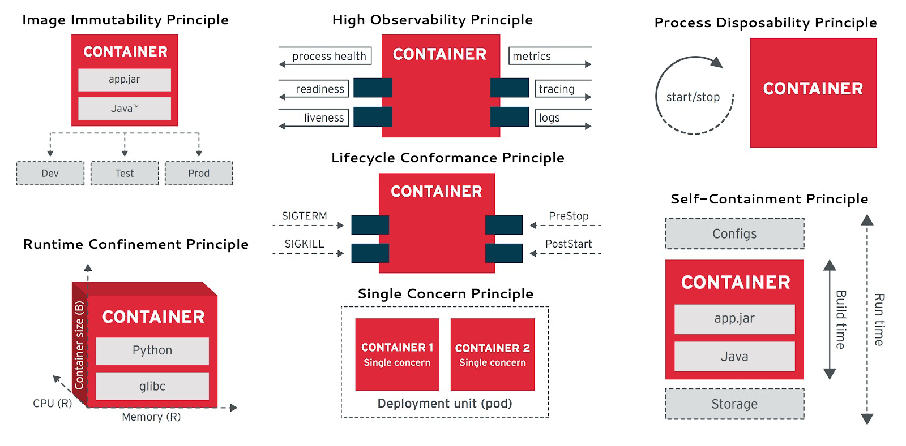
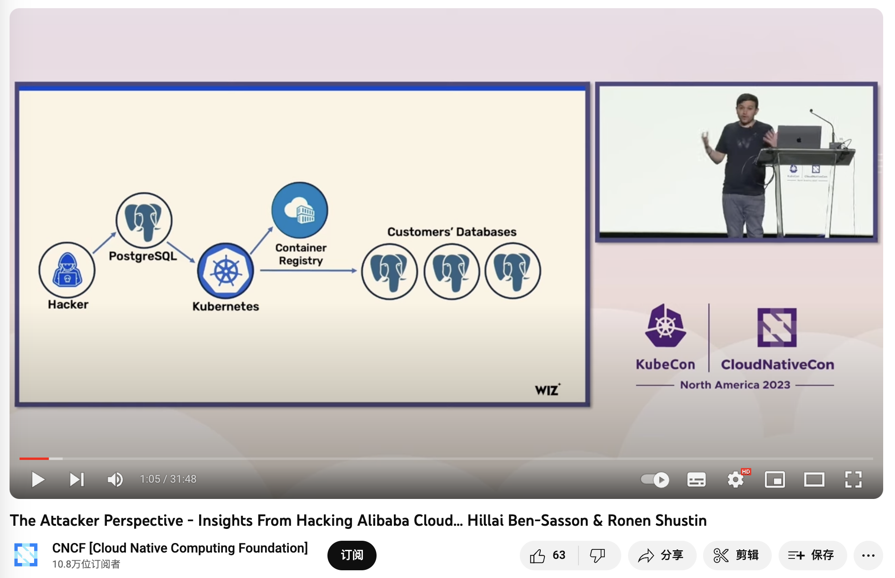
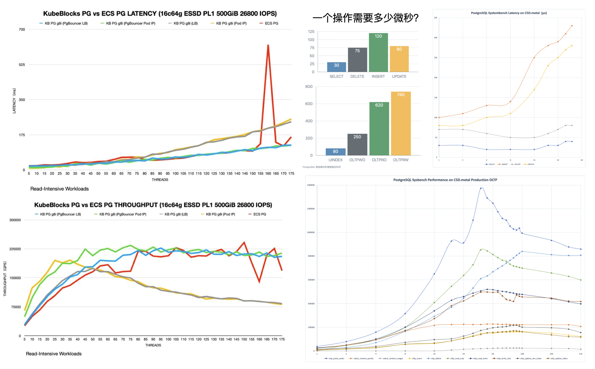
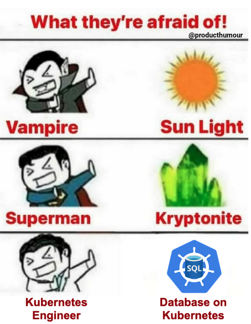
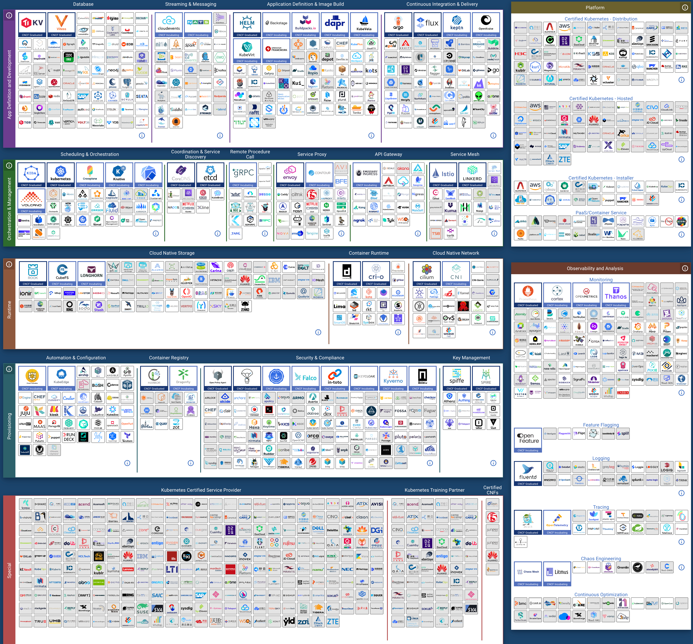
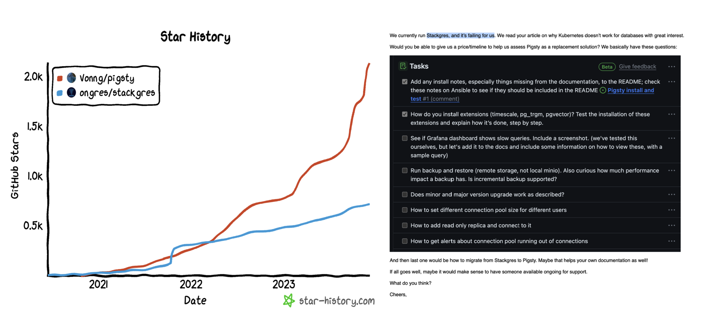

数据库是否应该放入 Kubernetes / Docker 里，到今天仍然是一个充满争议的话题。k8s 作为一个先进的容器编排工具，在无状态应用管理上非常趁手；但其在处理有状态服务 —— 特别是PostgreSQL和MySQL这样的数据库时，有着本质上的局限性。

在上一篇文章《[数据库放入Docker是个好主意吗？](https://mp.weixin.qq.com/s/kFftay1IokBDqyMuArqOpg)》中，我们已经讨论了容器化数据库的利弊权衡；今天我们就来聊一聊将数据库放入 K8S 中编排调度所涉及的利弊权衡 —— 并深入探讨为什么将数据库放入 K8S 中不是一个明智的选择。

------

## 摘要

Kubernetes （k8s）是一个非常优秀的容器编排工具，它的目标是帮助开发者更好地管理海量复杂的无状态应用服务。尽管它提供了诸如 StatefulSet、PV、PVC、LocalhostPV 等抽象原语用于支持有状态服务（i.e. 数据库），但这些东西对于运行有着更高可靠性要求的生产级数据库服务来说仍然远远不够。

数据库是“宠物”而非“家畜”，需要细心地照料呵护。将数据库放入K8S作为“牲畜”对待，本质上是将外部的磁盘/文件系统/存储服务变为了新的“数据库宠物”。使用 EBS/网络存储/云盘运行数据库，在可靠性与性能上有巨大劣势；然而如果使用高性能本地NVMe磁盘，与节点绑定无法调度的数据库又失去了放入K8S的主要意义。

将数据库放入 K8S 中会导致 **“双输”**  —— K8S 失去了无状态的简单性，不能像纯无状态使用方式那样灵活搬迁调度销毁重建；而数据库也牺牲了一系列重要的属性：可靠性，安全性，性能，以及复杂度成本，却只能换来有限的“弹性”与资源利用率 —— 但虚拟机也可以做到这些！对于公有云厂商之外的用户来说，几乎都是弊远大于利的。

以 K8S为代表的“云原生”狂热已经成为了一种畸形的现象：为了k8s而上k8s。工程师想提高不可替代性堆砌额外复杂度，管理者怕踩空被业界淘汰互相卷着上线。骑自行车就能搞定的事情非要开坦克来刷经验值/证明自己，却不考虑要解决的问题是否真的需要这些屠龙术 —— 这种架构杂耍行为终将招致恶果。

我们认为在分布式网络存储的可靠性与性能超过本地存储前，将数据库放入 K8S 是一种不明智的选择。解决数据库管理复杂度并非只有 K8S 一条道路，开箱即用的开源RDS —— [**Pigsty**](http://mp.weixin.qq.com/s?__biz=MzU5ODAyNTM5Ng==&mid=2247485518&idx=1&sn=3d5f3c753facc829b2300a15df50d237&chksm=fe4b3d95c93cb4833b8e80433cff46a893f939154be60a2a24ee96598f96b32271301abfda1f&scene=21#wechat_redirect) 基于裸操作系统提供了另一种选择。用户应当擦亮双眼，根据自己的真实情况与需求做出明智的利弊权衡与技术决策。

------

## 当下的现状

K8S 在无状态应用服务编排领域内表现出色，但一开始对于有状态的服务极其有限 —— 尽管运行数据库并不是 K8S 与 Docker 的本意，然而这阻挡不了社区对于扩张领地的狂热 —— 布道师们将 K8S 描绘为下一代云操作系统，断言数据库必将成为 Kubernetes 中的普通应用一员。而各种用于支持有状态服务的抽象也开始涌现：StatefulSet、PV、PVC、LocalhostPV。

有无数云原生狂热者开始尝试将现有数据库搬入 K8S 中，各种数据库的 CRD 与 Operator 开始出现 —— 仅以 PostgreSQL 为例，在市面上就已经可以找到至少十款以上种不同的 K8S 部署方案：PGO，StackGres，CloudNativePG，TemboOperator，PostgresOperator，PerconaOperator，Kubegres，KubeDB，KubeBlocks，……，琳琅满目。CNCF 的景观图就这样开始迅速扩张，成为了复杂度乐园。

然而复杂度也是一种成本，随着“降本增效”成为主旋律，反思的声音开始出现 —— 下云先锋 DHH 在公有云上深度使用了  K8S，但在[回归开源自建](https://mp.weixin.qq.com/s/CicctyvV1xk5B-AsKfzPjw)的过程中也因为过分复杂而放弃了它，仅仅用 Docker 与一个名为 Kamal 的Ruby小工具作为替代。许多人开始思考，像数据库这样的有状态服务到底适合放入 Kuberentes 中吗？

而 K8S 本身为了支持有状态应用，也变得越来越复杂，远离了容器编排平台的初心。以至于 Kubernetes 的联合创始人Tim Hockin 也在今年的 KubeCon 上罕见地发了声：[《K8s在被反噬！》](https://mp.weixin.qq.com/s/9Q9kze9D2LT0-G2lXSvADg)：“***Kubernetes 变得太复杂了，它需要学会克制，否则就会停止创新，直至丢失自己的基本盘*** ” 。

------

## 双输的选择

对于有状态的服务，云原生领域非常喜欢用一个“宠物”与“牲畜”的类比 —— 前者需要精心照料，细心呵护，例如数据库；而后者可以随意处置，一次性用完即丢，就是普通的无状态应用（Disposability）。

> 云原生应用12要素： **Disposability**

K8S的一个主要架构目标就是，**把能当畜生的都当畜生处理**。对数据库进行 “存算分离”就是这样一种尝试：把有状态的数据库服务拆分为K8S外的状态存储与K8S内的纯计算部分，状态放在云盘/EBS/分布式存储上，而“无状态”的数据库进程就可以塞进K8S里随意创建销毁与调度了。

不幸的是，数据库，特别是 OLTP 数据库是重度依赖磁盘硬件的，而网络存储的可靠性与性能相比本地磁盘仍然有[数量级上的差距](https://mp.weixin.qq.com/s/UxjiUBTpb1pRUfGtR9V3ag)。因而 K8S 也提供了LocalhostPV 的选项 —— 允许用户在容器上打一个洞，直接使用节点操作系统上的数据卷，直接使用高性能/高可靠性的本地 NVMe 磁盘存储。

但这让用户面临着一个抉择：是使用垃圾云盘并忍受糟糕数据库的可靠性/性能，换取K8S的调度编排统一管理能力？还是使用高性能本地盘，但与宿主节点绑死，基本丧失所有灵活调度能力？前者是把压舱石硬塞进 K8S 的小船里，拖慢了整体的灵活性与速度；后者则是用几根钉子把 K8S 的小船锚死在某处。

运行单独的纯无状态的K8S集群是非常简单可靠的，运行在物理机裸操作系统上的有状态数据库也是十分可靠的。然而将两者混在一起的结果就是**双输**：**K8S失去了无状态的灵活与随意调度的能力，而数据库牺牲了一堆核心属性：可靠性、安全性、效率与简单性，换来了对数据库根本不重要的“弹性”、资源利用率与Day1交付速度**。

关于前者，一个鲜活的案例是由 KubeBlocks 贡献的 [PostgreSQL@K8s 性能优化记](https://mp.weixin.qq.com/s/SCImfwEvkCPqZhLGx758Sw)。k8s 大师上了各种高级手段，解决了裸金属/裸OS上根本不存在的性能问题。关于后者的鲜活的案例是滴滴的[K8S架构杂耍大翻车](https://mp.weixin.qq.com/s/FIOB_Oqefx1oez1iu7AGGg)，如果不是将有状态的 MySQL 放在K8S里，单纯重建无状态 K8S 集群并重新发布应用，怎么会要12小时这么久才恢复？

------

## 利弊的权衡

对于严肃的生产技术选型决策，最重要的永远是利弊权衡。这里我们按照常用的“质量、安全、效率、成本”顺序，来聊一下K8S放数据库相对于经典裸金属/VM部署在技术上的利弊权衡。我并不想在这里写一篇面面俱到，好像什么都说了的论文，而是抛出一些具体问题，供大家思考与讨论。

------

在**质量**上：K8S相比物理部署新增了额外的失效点与架构复杂度，拉高了爆炸半径，并且会显著拉长故障的平均恢复时长。在《[数据库放入Docker是个好主意吗？](https://mp.weixin.qq.com/s/kFftay1IokBDqyMuArqOpg)》一文中，我们已经给出了关于可靠性的论证，同样的结论也可以适用于 Kubernetes —— K8S 与 Docker 会为数据库引入额外且不必要的依赖与失效点，而且缺乏社区故障知识积累与可靠性战绩证明（MTTR/MTBF）。

在云厂商的分类体系中，K8S属于PaaS，而RDS属于更底层的IaaS。**数据库服务比K8S有着更高的可靠性要求**：例如，许多公司的云管平台都会依赖一个额外的 CMDB 数据库。那么这个数据库应该放在哪里呢？你不应该把 K8S 依赖的东西交给 K8S 自己来管理，也不应该添加没有必要的额外依赖，[阿里云全球史诗大故障](https://mp.weixin.qq.com/s/OIlR0rolEQff9YfCpj3wIQ) 与 [滴滴K8S架构杂耍大翻车](https://mp.weixin.qq.com/s/FIOB_Oqefx1oez1iu7AGGg) 为我们普及了这个常识。而且，如果已经有了K8S外的数据库，再去维护一套K8S内的数据库体系就更得不偿失了。

------

在**安全** 上： 多租户环境中的数据库新增了额外的攻击面，带来了更高的风险与更复杂的审计合规挑战。K8S 会让你的数据库更安全吗？也许K8S架构杂耍的复杂度景象会劝退不熟悉K8S的脚本小子，但对真正的攻击者而言，更多的组件与依赖往往意味着更广的攻击面。

在《[BrokenSesame 阿里云PostgreSQL 漏洞技术细节](https://mp.weixin.qq.com/s/Tvuy0kAiqh66sOwkr3WWMA)》中，安全人员利用一个自己的 PostgreSQL 容器逃脱到K8S主机节点中，并可以访问 K8S API 与其他租户的容器与数据。而这很明显是 K8S 专有的问题 —— 风险是真实存在的，这样的攻击已经发生，并让本土云厂领导者阿里云中招翻车。

> 《[The Attacker Perspective - Insights From Hacking Alibaba Cloud](https://www.youtube.com/watch?v=d81qnGKv4EE)》

------

在**效率**上：如《[数据库放入Docker是个好主意吗？](https://mp.weixin.qq.com/s/kFftay1IokBDqyMuArqOpg)》所述，不论是额外的网络开销，Ingress 瓶颈，拉垮的云盘，对于数据库的性能都会产生负面影响。又比如《[PostgreSQL@K8s 性能优化记](https://mp.weixin.qq.com/s/SCImfwEvkCPqZhLGx758Sw)》 所揭示的 —— 你需要相当程度的技术水平功力，才能让 K8S 中的数据库性能堪堪持平于裸机。

> Latency 的单位是 **ms** 不是 **µs**，我差点以为自己眼花了。

另一个关于效率的误区是资源利用率， 不同于离线分析类业务，关键的在线 OLTP 数据库不仅不应当提高资源利用率，反而应当刻意压低资源利用率水位，从而提高系统的可靠性与用户的使用体验。如果有许许多多多零散业务，也可以通过 PDB / 共用共享数据库集群来提高资源利用率。K8S 所主张的弹性效率也并非其独有 —— KVM/EC2 也可以很好地解决这个问题。

------

在**成本**上，K8S与各种Operator提供了一个不错的抽象，封装了一部分数据库管理的复杂度，对于没有DBA的团队有一定的吸引力。然而使用它管理数据库所减少的复杂度，比起使用K8S本身引入的复杂度来说就相形见绌了。比如，随机发生的IP地址漂移与Pod自动重启，对于无状态应用来说可能并不是一个大问题，然而对数据库来说这就令人难以忍受了 —— 许多公司不得不尝试魔改 kubelet 以规避这一行为，进而又引入更多的复杂度与维护成本。

正如《[从降本增笑到降本增效](https://mp.weixin.qq.com/s/FIOB_Oqefx1oez1iu7AGGg)》“降低复杂度成本” 一节所述：**智力功率很难在空间上累加**：当数据库出现问题时需要数据库专家来解决；当 Kubernetes 出现问题时需要 K8S 专家看问题；然而当你把数据库放入 Kubernetes 时，复杂度出现排列组合，状态空间开始爆炸，然而单独的数据库专家和 K8S 专家的智力带宽是很难叠加的 —— 你需要一个双料专家才能解决问题，而这样的专家比起单纯的数据库专家无疑要少得多也贵得多。这样的架构杂耍足以让包括头部公有云/大厂在内的绝大多数团队，在遇到故障时出现大翻车。

------

## 云原生狂热

一个有趣的问题是，既然 K8S 并不适用于有状态的数据库，那么为什么还有这么多厂商 —— 包括 “大厂” 在争先恐后地做这件事呢？恐怕这里的原因并不是技术上的。

Google 照着内部的 Borg 宇宙飞船做了艘 K8S 战舰开源出来，老板们怕踩空被业界淘汰进而互相卷着上线，觉得自己用上 K8S 就跟Google一样牛逼了 —— 有趣的是Google自己不用K8S，开源出来搅屎AWS忽悠业界；然而绝大多数公司并没有 Google 那样的人手去操作战舰。更重要的是他们的问题可能只要一艘舢舨就解决了。裸机上的 MySQL + PHP , PostgreSQL+ Ruby / Python / Go ，已经让无数公司一路干到上市了。

在[现代硬件条件](https://mp.weixin.qq.com/s/1OSRcBfd58s0tgZTUZHB9g)下，绝大多数应用，终其生命周期的复杂度都不足以用到 K8S 来解决。然而，以 K8S为代表的“云原生”狂热已经成为了一种畸形的现象：为了k8s而上k8s。一些工程师的目的是去寻找足够“先进”足够酷的，最好是大公司在用的东西来满足自己跳槽，晋升等个人价值的需求，或者趁机堆砌复杂度以提高自己的 Job Security，而压根不是考虑要解决问题是否真的需要这些屠龙术。

云原生领域全景图中充斥着各种花里胡哨的项目，每个新来的开发团队都想引入一套新东西，今天一个 helm 明天一个 kubevela，说起来都是光明前途，效率拉满，实际上成为了 YAML Boy 的架构屎山与复杂度乐园 —— 折腾最新的技术，发明大把的概念，经验值和声望是自己的，复杂度代价反正是用户买单，搞出问题还可以再敲一笔维护费，简直完美！

> CNCF Landscape

云原生运动的理念是很有感召力的 —— 让本来是公有云专属的弹性调度能力普及到每一个用户身上，K8S 也确实在无状态应用上表现出色。然而过度的狂热已经让 K8S 偏离了原本的初心与方向 —— 简单地做好无状态应用编排调度这件事，被支持有状态应用的妄念拖累的也不再简单了。

------

## 明智地决策

几年前刚接触K8S时，我也曾有过这种皈依者狂热 —— 在探探我们也有着两万多核几百套数据库，我迫切地想要尝试将数据库放入 Kubernetes 中，并测遍了各种 Operator。然而在前后长达两三年的方案调研与架构设计中，我最终冷静下来，并放弃了这种疯狂的打算 —— 而是选择基于裸金属/裸操作系统架构我们自己的数据库服务。因为在对我们来说，K8S为数据库带来的收益相比其引入的问题与麻烦，实在是微不足道。

数据库应该放入K8S里吗？这取决于具体场景：对于从资源利用率里用超卖刨食吃的云厂商而言，弹性与资源利用率非常重要，它们直接与收入和利润挂钩；稳定可靠效率都得屈居其次 —— 毕竟可用性低于3个9也不过[是按SLA赔偿本月消费](/cloud/sla/)25%的代金券而已。但是对于我们自己，以及生态光谱中的大多数用户而言，这些利弊权衡就不成立了：一次性的 Day1 Setup效率，弹性与资源利用率并不是他们最关心的问题；可靠性、性能、Day2 Operation成本，这些数据库的核心属性才是最重要的。

我们将自己的数据库服务架构方案开源出来 —— 即开箱即用的 PostgreSQL 发行版与本地优先的 RDS 替代： [Pigsty](https://doc.pgsty.com/zh/)。我们没有选择 K8S 与 Docker 这种所谓 “***一次构建，到处运行*** ”  的讨巧办法，而是一个一个地去适配不同的[操作系统发行版](https://mp.weixin.qq.com/s/xHG8OURTYlmnQTorFkzioA)/不同的大版本，并使用 Ansible 实现类 K8S CRD IaC 的效果封装管理复杂度。这确实是一件非常幸苦的工作，但却是正确的事情 —— 这个世界并不需要又一个在 K8S 中放入PG数据库玩具积木的拙劣尝试，但确实需要一个最大化发挥出硬件性能与可靠性的生产数据库服务架构方案。

> Pigsty vs Stackgres

也许有一天，当分布式网络存储的可靠性与性能可以超过本地存储的表现时，以及当主流数据库都对存算分离有一定程度上的支持后，事情会再次发生变化 —— K8S 变得适用于数据库起来。但至少就目前来讲，我认为将严肃的生产 OLTP 数据库放入 K8S ，仍然是不成熟与不合时宜的。希望读者可以擦亮双眼，在这件事上做出明智的选择。

------

## 参考阅读

**[把数据库放入Docker是一个好主意吗？](http://mp.weixin.qq.com/s?__biz=MzU5ODAyNTM5Ng==&mid=2247486572&idx=1&sn=274a51976bf8ae5974beb1d3173380c1&chksm=fe4b39b7c93cb0a14c4d99f8ffd1e00c36b972a8058fd99e9d06e6035c4f378b6d327892260b&scene=21#wechat_redirect)**

**[《Kubernetes创始人发声！K8s在被反噬！》](https://mp.weixin.qq.com/s/9Q9kze9D2LT0-G2lXSvADg)**

**[《Docker 的诅咒：曾以为它是终极解法，最后却是“罪大恶极”？》](https://mp.weixin.qq.com/s/EWCblHU-vDC3ebV6ITE45A)**

**[《从滴滴的故障我们能学到什么》](https://mp.weixin.qq.com/s/KFZCQFP1oB5YOrT3tHBRCQ)**

**[《PostgreSQL@K8s 性能优化记》](https://mp.weixin.qq.com/s/0kbWa6AnkCr5jkN4WIgu5Q)**

**[《Running Database on Kubernetes》](https://questdb.io/blog/databases-on-k8s/)**

[**重新拿回计算机硬件的红利**](http://mp.weixin.qq.com/s?__biz=MzU5ODAyNTM5Ng==&mid=2247486489&idx=1&sn=f2be1be496de46ac5ca816ac39cfdf24&chksm=fe4b39c2c93cb0d4ff50dd6962370523a6271eab478fe9174c0c7a88fc88ea05fd3e51313ad3&scene=21#wechat_redirect)

[**从降本增笑到真的降本增效**](http://mp.weixin.qq.com/s?__biz=MzU5ODAyNTM5Ng==&mid=2247486527&idx=1&sn=8e26f644f2b908fd21c83b81d329155d&chksm=fe4b39e4c93cb0f22271127a154a6ac5c45947b2051b06b7667ee5c203d136b5d2e8f6577b10&scene=21#wechat_redirect)

[**重新拿回计算机硬件的红利**](http://mp.weixin.qq.com/s?__biz=MzU5ODAyNTM5Ng==&mid=2247486489&idx=1&sn=f2be1be496de46ac5ca816ac39cfdf24&chksm=fe4b39c2c93cb0d4ff50dd6962370523a6271eab478fe9174c0c7a88fc88ea05fd3e51313ad3&scene=21#wechat_redirect)

[**我们能从阿里云史诗级故障中学到什么**](http://mp.weixin.qq.com/s?__biz=MzU5ODAyNTM5Ng==&mid=2247486468&idx=1&sn=7fead2b49f12bc2a2a94aae942403c22&chksm=fe4b39dfc93cb0c92e5d4c67241de0519ae6a23ce6f07fe5411b95041accb69e5efb86a38150&scene=21#wechat_redirect)

[**是时候放弃云计算了吗？**](http://mp.weixin.qq.com/s?__biz=MzU5ODAyNTM5Ng==&mid=2247486366&idx=1&sn=c28407399af8b1ddeadf93e902ed23cc&chksm=fe4b3e45c93cb753dfd3cdbdd4eacd05ae6ce7d83eadf3105718cfa20180d6c3244652d88cc7&scene=21#wechat_redirect)

[**云SLA是不是安慰剂？**](http://mp.weixin.qq.com/s?__biz=MzU5ODAyNTM5Ng==&mid=2247485601&idx=1&sn=5521562d414b547a192b3dbc45ce720f&chksm=fe4b3d7ac93cb46c37f64f61593a102eb0a6c624a95fe37e0cccf2c03c766cda5ad268671e14&scene=21#wechat_redirect)
