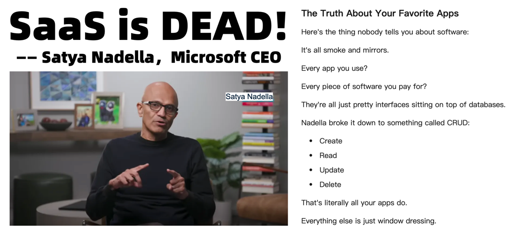

Databases are the core of business architecture - this is self-evident consensus. But what if we go further and **treat databases as business architecture itself**, putting business logic, web servers, and even entire front and back ends into databases? What sparks would that create? Will the future be a world where databases devour backends, frontends, operating systems, and even everything?


--------

## Database Drives the Future

Not long ago, Yurii, founder of Omnigres, gave a presentation titled "[Database Drives the Future](https://gamma.app/docs/The-Database-Drives-the-Future-41vma58e3502p70?mode=doc)" at the [7th PG Ecosystem Conference](https://mp.weixin.qq.com/s/Hybx7nIPAGfuyul-wDHU-A), proposing an interesting viewpoint - **databases are business architecture**.

His open-source project [Omnigres](https://omnigres.com/) does something "crazy": **stuffing all application logic, even web servers, into PostgreSQL databases**. Not just wrapping backends with REST interfaces, but cramming entire front and back ends into PG! How did he do it? Omnigres provides a suite of extension packages, including 33 PG "standard library" extension modules like `httpd`, `vfs`, `os`, `python`. After installation, a single SQL statement can turn PostgreSQL into an 'Nginx' running on port 8080:

```sql
CREATE EXTENSION omni_httpd CASCADE;
CREATE EXTENSION omni_vfs   CASCADE;

CREATE FUNCTION mount_point()
  returns omni_vfs.local_fs language sql AS $$SELECT omni_vfs.local_fs('/www')$$;

UPDATE omni_httpd.handlers
SET query = (SELECT omni_httpd.cascading_query(name, query) FROM
  (SELECT * FROM omni_httpd.static_file_handlers('mount_point', 0,true)) routes);
```


Seeing this magical approach, I once doubted whether this thing could actually work. But the fact is it actually ran and worked quite well.

Browsers can access HTML pages, and HTML pages can dynamically access HTTP servers and database stored procedures through JavaScript.
This means you can stuff a complete frontend-backend-database three-tier architecture application entirely into a database!


> The essence of this idea is: **stuffing all business logic, even web servers and entire front and back ends into PostgreSQL databases**.
> Let's look at an interesting example. Executing the following SQL in PostgreSQL will start a web server, serving `/www` as the root directory of a web server:
> My god, PostgreSQL database actually pulled up an HTTP server, running on port `8080` by default! You can use it as Nginx!
> Besides implementing httpd, he also implemented many "standard libraries" as PG extensions, including a complete package of 33 extension plugins, providing complete web application development capabilities within PostgreSQL!


--------

## Databases are the Core of Architecture

> *"If you show me your software architecture, I learn nothing about your business. But if you show me your data model, I can guess exactly what your business is."* — Michael Stonebraker

Database patriarch Mike Stonebraker has a famous saying: "If you show me your software architecture, I learn nothing about your business; but if you show me your data model, I can precisely know what your business does."

Coincidentally, Microsoft CEO Nadella [also recently stated publicly](https://mp.weixin.qq.com/s/8t5qdz9DvHO7xt8VA8vzsQ): What we call software today, those applications you love, are nothing more than beautifully packaged database operation interfaces.



> BTW he also said SaaS is Dead: because in the future Agents can directly bypass middlemen and replace front and back ends to read and write databases

Even in the current GenAI boom, the entire IT technology stack of most information systems is still designed around databases as the core.
So-called database sharding, multi-region multi-center, active-active across regions - these architectural tricks are ultimately just different ways of using databases.

No matter how business architectures are twisted, the underlying fundamentals remain constant. Databases being the core of business architecture has long been self-evident consensus.
But what if we go further and **treat databases as business architecture itself**?


--------

## What, You Can Play Like This?

At the PG Ecosystem Conference, Yuri demonstrated an idea: **stuffing all business logic, even web servers and entire backends into PostgreSQL databases**.
For example, by writing stored procedures, you can put original backend functionality directly into databases to run. For this, he also implemented many "standard libraries" as PG extensions, from http, vfs, os to python modules.

Let's look at an interesting example. Executing the following SQL in PostgreSQL will start a web server, serving `/www` as the root directory of a web server.

```sql
CREATE EXTENSION omni_httpd CASCADE;
CREATE EXTENSION omni_vfs CASCADE;
CREATE EXTENSION omni_mimetypes CASCADE;

create function mount_point()
returns omni_vfs.local_fs language sql AS
$$select omni_vfs.local_fs('/www')$$;

UPDATE omni_httpd.handlers
SET query = (SELECT omni_httpd.cascading_query(name, query order by priority desc nulls last)
         from (select * from omni_httpd.static_file_handlers('mount_point', 0,true)) routes);
```

Yes, my god, PostgreSQL database actually pulled up an HTTP server, running on port `8080` by default! You can use it as Nginx!


Of course, you can choose any programming language you like to create PostgreSQL functions and mount these functions to HTTP endpoints to implement any logic you want.

Users familiar with Oracle might find this somewhat similar to Oracle Apex. But in PostgreSQL, you can develop stored procedures in over twenty programming languages, not just limited to PL/SQL!


Besides the `httpd` extension here, Omnigres also provides another 33 extension plugins. This complete extension suite provides complete web application development capabilities within PostgreSQL!


--------

## Would This Be a Good Idea?

Tools like [PostgREST](https://docs.postgrest.org/en/v12/) can directly transform well-designed PostgreSQL schemas into ready-to-use RESTful APIs.
Tools like Omnigres go a step further, directly running HTTP servers inside PG databases! This means you can not only put backends into databases but even put frontends into databases!

Honestly, DBAs and ops teams would have a hard time liking these seemingly "heretical" things. But as a developer, I think this idea is very interesting and worth exploring!
Because doing this is indeed convenient - having databases handle business logic has the opportunity to avoid some complex concurrency contention and potentially provide better latency performance by saving network RT between backends and databases;
There are also some unique management advantages: all business logic, schema definitions, and data are in the same place, handled the same way. Your CI/CD, deployment/migration/rollback can all be implemented with SQL.
Want to deploy a new system? Copy the PostgreSQL data directory, spin up a new PostgreSQL instance, and you're done. One database solves all problems - the architecture is incredibly simple.

Earlier when I was at Tantan, we implemented almost all business logic (even recommendation algorithms) in PostgreSQL, with backends having only a very thin forwarding layer.
This approach just requires high comprehensive skills from developers and DBAs - after all, writing stored procedures and maintaining complex database logic isn't easy work.
And at that time (2017), databases were usually the performance bottleneck of entire architectures, with single nodes handling tens of thousands of TPS with little performance headroom for these tricks.

But times have changed. LLM emergence and hardware development make this approach much more feasible:
GPT has reached the level of skilled mid-to-senior developers who can write stored procedures proficiently, while hardware following Moore's Law has pushed single-machine performance to incredible levels.
Therefore, putting business logic into databases, even making databases become entire business architectures themselves, becomes a very worthwhile practice to explore in the current era.


--------

## Database Devouring Everything

As the saying goes: "What's divided must unite, what's united must divide." In ancient times, many C/S and B/S architecture applications were just a few clients directly reading and writing databases.
But later, as business logic became more complex and hardware performance (relative to business needs) became insufficient, many things were stripped from databases, forming traditional three-tier architectures.

Hardware development has given database servers abundant performance again, and database software development has made writing stored procedures much easier,
so the splitting trend might very well reverse - business logic originally separated from databases might return to databases.

Actually, we can already observe convergence trends in the database field in "[PostgreSQL Eating the Database World](/pg/pg-eat-db-world)" and the community's popular "everything uses PostgreSQL" slogan:
Specialized databases for subdivisions originally separated from databases, like full-text search, vectors, machine learning, graph databases, time-series databases, are now returning to PostgreSQL through plugin super-convergence.

Correspondingly, practices of front and back ends re-converging into databases are beginning to appear. I think a very noteworthy example is Supabase, a project calling itself "open-source Firebase," reportedly used by 80% of YC startups.
It packages PostgreSQL, object storage, PostgREST, EdgeFunctions, and various tools into an entire runtime, then bundles backends and traditional databases together as a "new database."

Supabase is actually a database that "ate" the backend. If this architecture goes to extremes, it would probably be like Omnigres architecture - a PostgreSQL running HTTP servers that simply devours frontends too.

Of course, there might be even more radical attempts - for example, Stonebraker's new startup project DBOS even wants to swallow operating systems into databases!

This might mean the pendulum in software architecture is swinging back to simplicity and common sense - frontends bypassing fancy middleware to directly access databases, spiraling back to original C/S and B/S architectures.
Or as Nadella said, Agents could directly bypass middlemen, replacing front and back ends and software to read and write databases - a new A(gent)/D(atabase) architecture wouldn't be impossible.


--------

## Embracing New Trends

If you want to try writing applications in databases, the thrilling approach of using one PostgreSQL setup for everything, you should definitely try Supabase or Omnigres!
We recently implemented the ability to self-host Supabase locally (this involves over twenty extensions, several tricky extensions written in Rust),
and just provided support for Omnigres extensions - providing DBaaA (Database as a Application) capabilities for PostgreSQL.

If you have hundreds of thousands of TPS, tens of TB of data, or run some critical, life-or-death, massive core systems, this approach might not be appropriate.
But if you run personal projects, small websites, or startup and edge innovation systems, this architecture will make your iterations more agile and development/operations simpler.

Of course, don't forget that besides twenty-plus languages for writing stored procedures, the PostgreSQL ecosystem has 1000+ extension plugins providing various powerful functions.
Besides the well-known `postgis`, `timescaledb`, `pgvector`, `citus`, there are many bright emerging extensions recently:
Like `pg_duckdb` and `pg_mooncake` providing ClickHouse T0 analysis performance on PG, `pg_search` providing ES-level full-text search,
`pg_analytics` and `pg_parquet` converting PG into S3 lake warehouses, …
We'll witness another player like `pgvector` emerge in the OLAP field, making many "big data" components into punchlines.

This is exactly the problem we at Pigsty want to solve - Extensible Postgres, allowing everyone to easily use these extension plugins, making PostgreSQL a true super-converged database Swiss Army knife.

In our open-source Pigsty extension repository, we've provided nearly 400 ready-to-use extensions. You can use Pigsty to install these extensions with one click on mainstream Linux systems (amd/arm, EL 8/9, Debian 12, Ubuntu 22/24).
But these plugins are an independently usable repository (Apache 2.0) - you don't have to use Pigsty to have these extensions. PostgreSQL distributions like Omnigres and AutoBase also use this repository for extension delivery - this is indeed a great example of open-source ecosystem mutual benefit and win-win.
If you're a PostgreSQL vendor, we very much welcome you to use Pigsty's extension repository as an upstream installation source, or distribute your extension plugins in Pigsty.

If you're a PostgreSQL user interested in extension plugins, you're also very welcome to check out our open-source PG package manager [`pig`], which can help you easily solve PostgreSQL extension plugin installation problems with one click.