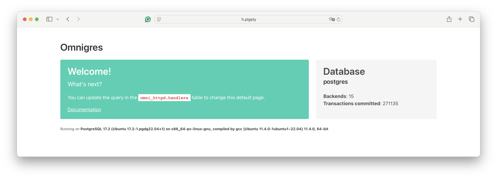
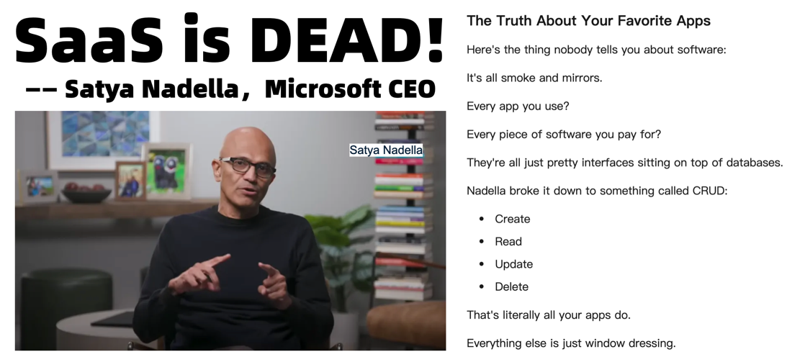
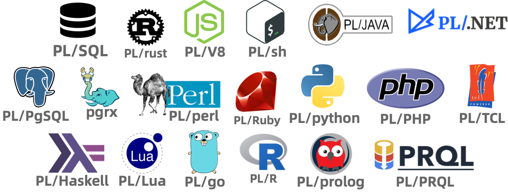

数据库是业务架构的核心，是不言自明的共识。但如果我们更进一步，**将数据库作为业务架构本身**，将业务逻辑，Web Server，甚至是整个前后端都放入数据库中，又会擦出怎么样的火花？未来会是一个数据库吞噬后端，前端，操作系统，甚至一切的世界吗？


--------

## 驱动未来的数据库

不久之前，Omnigres 的创始人 Yurii 在 [第七届PG生态大会](https://mp.weixin.qq.com/s/Hybx7nIPAGfuyul-wDHU-A) 上 进行了题为《[数据库驱动未来](https://gamma.app/docs/The-Database-Drives-the-Future-41vma58e3502p70?mode=doc)》的演讲分享。抛出了一个有趣的观点 —— **数据库就是业务架构**。

他的开源项目 [Omnigres](https://omnigres.com/) 做了一件“疯狂”的事：**把所有应用逻辑，甚至 Web Server 都塞进 PostgreSQL 数据库**。不只是后端包个REST接口，而是把前后端都整个塞进 PG 里去了！他是怎么做到的？Omnigres 提供了一套扩展全家桶，包括 `httpd`、`vfs`、`os`、`python` 等33个 PG “标准库”扩展模块。安装完后，一条 SQL 就能把 PostgreSQL 变成一个能跑在 8080 端口的 'Nginx'：

```sql
CREATE EXTENSION omni_httpd CASCADE;
CREATE EXTENSION omni_vfs   CASCADE;

CREATE FUNCTION mount_point()
  returns omni_vfs.local_fs language sql AS $$SELECT omni_vfs.local_fs('/www')$$;

UPDATE omni_httpd.handlers
SET query = (SELECT omni_httpd.cascading_query(name, query) FROM
  (SELECT * FROM omni_httpd.static_file_handlers('mount_point', 0,true)) routes);
```



看到这种神奇玩法，我一度怀疑这玩意到底能不能行。但事实就是它居然跑了起来，还真挺像那么回事。

从浏览器可以访问 HTML 页面，而 HTML 页面可以通过 Javascript 动态访问 HTTP 服务器与数据库存储过程。
这意味着，你可以把一个经典前端-后端-数据库三层架构的应用，完整地塞入一个数据库中！


> 这个想法的实质是：**把所有业务逻辑，甚至是Web服务器和整个前后端都塞进 PostgreSQL 数据库里**。
> 让我们来看一个有趣的例子，在 PostgreSQL 中执行以下 SQL，将会启动一个 Web 服务器，将 `/www` 作为一个 Web 服务器的根目录对外提供服务：
> 天啊，PostgreSQL 数据库竟然拉起来了一个 HTTP 服务器，默认跑在 `8080` 端口！你可以把它当成 Nginx 用！
> 除了实现 httpd 之外，他还以 PG 扩展的形式实现了许多 “标准库”，这包括一个由 33 个扩展插件组成的全家桶，提供在 PostgreSQL 中进行完整 Web 应用开发的能力！


--------

## 数据库是架构的核心

> *“If you show me your software architecture, I learn nothing about your business. But if you show me your data model, I can guess exactly what your business is.”*。 —— Michael Stonebraker

数据库祖师爷迈克·石破天有句名言：“如果你给我看软件架构，我对你的业务一无所知；但如果你给我看数据模型，我就能精准知道你的业务是干嘛的”

无独有偶，微软 CEO 纳德拉 [也在最近公开表示](https://mp.weixin.qq.com/s/8t5qdz9DvHO7xt8VA8vzsQ)：我们今天所称的软件，你喜欢的那些应用程序，不过是包装精美的数据库操作界面而已。



> BTW 他还说 SaaS is Dead：因为以后 Agent 可以直接绕过中间商，代替前后端去读写数据库

即使在 GenAI 爆火的当下，绝大多数信息系统的整个 IT 技术栈依然是以数据库为核心设计的。
所谓的分库分表，几地几中心，异地多活这些架构花活，说到底也就是数据库的不同使用方式罢了。

无论业务架构怎么折腾，底层的东西万变不离其宗。数据库是业务架构的核心，早已是不言自明的共识。
但如果我们更进一步，**将数据库作为业务架构本身**，又会如何？


--------

## 什么，还能这么玩

在 PG 生态大会上，尤里展示了一个想法：**把所有业务逻辑，甚至是Web服务器和整个后端都塞进 PostgreSQL 数据库里**。
比如可以通过写存储过程，把原本后端功能直接放到数据库里运行。为此，他还以 PG 扩展的形式实现了许多 “标准库”，从 http, vfs, os 到 python 模块。

让我们来看一个有趣的例子，在 PostgreSQL 中执行以下 SQL，将会启动一个 Web 服务器，将 `/www` 作为一个 Web 服务器的根目录对外提供服务。

```sql
CREATE EXTENSION omni_httpd CASCADE;
CREATE EXTENSION omni_vfs CASCADE;
CREATE EXTENSION omni_mimetypes CASCADE;

create function mount_point()
returns omni_vfs.local_fs language sql AS
$$select omni_vfs.local_fs('/www')$$;

UPDATE omni_httpd.handlers
SET query = (SELECT omni_httpd.cascading_query(name, query order by priority desc nulls last)
         from (select * from omni_httpd.static_file_handlers('mount_point', 0,true)) routes);
```

是的，天啊，PostgreSQL 数据库竟然拉起来了一个 HTTP 服务器，默认跑在 `8080` 端口！你可以把它当成 Nginx 用！


当然，你可以选择任意你喜欢的编程语言来创建 PostgreSQL 函数，并将这些函数挂载到 HTTP 端点上，实现你想要的任何逻辑。

如果是熟悉 Oracle 的用户可能会发现，这有点类似于 Oracle Apex。但在 PostgreSQL 中，你可以用二十多种编程语言来开发存储过程，而不仅仅局限于 PL/SQL！




除了这里的 `httpd` 扩展外，Omnigres 还提供了另外 33 个扩展插件，这套扩展全家桶，提供了在 PostgreSQL 中进行完整 Web 应用开发的能力！


--------

## 这会是一个好主意吗？

类似 [PostgREST](https://docs.postgrest.org/en/v12/) 这样的工具，可以将设计良好的 PostgreSQL 模式直接转化为开箱即用的 RESTful API。
而 Omnigres 这样的工具则是百尺竿头更进一步，直接让 HTTP 服务器运行在了 PG 数据库内部！而这意味着，你不仅可以把后端放进数据库里，你甚至可以把前端也放进数据库中！

老实说 DBA 和运维很难喜欢这些看上去 “离经叛道” 的玩意。但作为一个开发者，特我认为这个主意非常有趣，值得探索！
因为这么搞确实很省事 —— 由数据库处理业务逻辑有机会规避一些复杂的并发争用，并通过节省了后端与数据库的网络 RT 带来更好的延迟性能表现；
而且在管理上也会有一些独特优势：所有业务逻辑、模式定义和数据都在同一个地方，用同样的方式处理，你的 CI/CD，发布/迁移/降级都可以用SQL实现。
你想部署一套新系统？把 PostgreSQL 数据目录复制一份，重新拉起一个 PostgreSQL 实例就可以了。一个数据库解决所有问题，架构简单无比。

早先我在探探，我们在使用 PostgreSQL 时将几乎所有的业务逻辑（甚至推荐算法）都在 PostgreSQL 里实现，后端只有很轻薄的一层转发。
只不过这种做法对开发者、DBA 的综合技能要求较高 —— 毕竟写存储过程、维护复杂的数据库逻辑不是一件轻松活儿。
而且在那个时候（2017），数据库通常也是整个架构中的性能瓶颈，单节点动辄大几万 TPS，没有多少性能余量给这些花活。

但现在时过境迁，LLM 的出现与硬件的发展让这种做法变得更加可行起来：
GPT 已经达到了能够熟练编写存储过程的中高级开发者的水准，而遵循摩尔定律发展的硬件直接把单机性能推到了一个匪夷所思的地步。
因此，将业务逻辑放到数据库中，甚至让数据库成为整个业务架构本身，这种做法在当下成为一种非常值得探索的实践。


--------

## 吞噬一切的数据库

俗话说：“分久必合，合久必分”。在上古时期，许多 C/S，B/S 架构的应用就是几个客户端直接读写数据库。
但是后来，随着业务逻辑的复杂化，以及硬件性能（相对于业务需求）的捉襟见肘，许多东西从数据库中被剥离出来，形成了传统的三层架构。

硬件的发展让数据库服务器的性能重新出现大量的富余，而数据库软件的发展让存储过程的编写变得更加容易，
那么拆分剥离的趋势也很有可能会逆转，原本从数据库中分离出去的业务逻辑，又会重新回到数据库中。

实际上，我们已经可以在《[PostgreSQL吞噬数据库世界](/pg/pg-eat-db-world)》，以及社区正在流行的 “一切皆用 PostgreSQL” 口号中，观察到观察到数据库领域正在出现的收敛趋势：
原先从数据库中分离出去的细分领域专用数据库，如全文搜索、向量，机器学习、图数据库、时序数据库等，现在都在重新以插件超融合的方式回归到 PostgreSQL 中。

相应地，前端，后端重新融合回归到数据库的实践也开始出现。我认为一个非常值得注意的例子是 Supabase，一个号称 “开源 Firebase” 的项目，据说 80% YC 创业公司都在使用它。
它将 PostgreSQL，对象存储，PostgREST，EdgeFunction 和各种工具封装成为一整个运行时，然后将后端与传统意义上的数据库整体打包成为一个 “新的数据库”。

Supabase 实际上就是 “吃掉” 了后端的数据库，如果这种架构走到极致，那大概会是像 Omnigres 这样的架构 —— 一个运行着 HTTP 服务器的 PostgreSQL，干脆把前端也吃下去了。

当然，可能还有更为激进的尝试 —— 例如 Stonebraker 老爷子的新创业项目 DBOS，甚至要把操作系统也给吞进数据库里去了！

这也许意味着软件架构领域的钟摆正在重新回归简单与常识 —— 前端绕开花里胡哨的中间件，直接访问数据库，螺旋上升回归到最初的 C/S，B/S 架构上去。
或者像纳德拉所说，Agent 可以直接绕过中间商，代替前后端与软件去读写数据库，出现一种新的 A(gent)/D(atabase) 架构也未尝不可。


--------

## 拥抱新趋势

如果你想试试在数据库里写应用，一套 PostgreSQL 打天下的刺激玩法，确实应该尝试一下 Supabase 或者 Omnigres！
我们最近实现了了在本地自建 Supabase 的能力（这涉及到二十多个扩展，其中有几个棘手的扩展使用Rust编写），
并在刚刚提供了对 Omnigres 扩展的支持 —— 这为 PostgreSQL 提供了 DBaaA 的能力。

如果你有几十万 TPS，几十 TB 的数据，或者运行着一些至关重要、人命关天、硕大无朋的核心系统，那么这种玩法可能不太合时宜。
但如果你运行的是一些个人项目，小网站，或者是初创公司与边缘创新系统，那么这种架构会让你的迭代更为敏捷，开发、运维更加简单。

当然不要忘记，除了二十多种可以用于编写存储过程的的语言支持外，PostgreSQL 生态中还有 1000+ 扩展插件可以提供各种强力功能。
除了大家都已经耳熟能详的 `postgis`, `timescaledb`, `pgvector`, `citus` 之外，最近还有许多亮眼的新兴扩展：
比如在 PG 上提供 ClickHouse T0 分析性能的 `pg_duckdb` 与 `pg_mooncake`，提供比肩 ES 全文检索的 `pg_search`，
将 PG 转换为 S3 湖仓的 `pg_analytics` 与 `pg_parquet`，……
我们将在 OLAP 领域再次见证一个类似 `pgvector` 的玩家出现，让许多 “大数据” 组件变成 Punchline。

而这正是我们 Pigsty 想要解决的问题 —— Extensible Postgres，让所有人都可以轻松使用这些扩展插件，让 PostgreSQL 成为一个真正的超融合数据库全能王。

在我们开源的 Pigsty 扩展仓库中，总共已经提供了将近 400 个开箱即用的扩展，你可以在主流Linux系统（amd/arm, EL 8/9, Debian 12, Ubuntu 22/24），使用 Pigsty 一键安装这些扩展。
但这些插件是一个可以独立使用的仓库（Apache 2.0），您非一定要使用 Pigsty 才能拥有这些扩展 ——  Omnigres 与 AutoBase 这样的 PostgreSQL 也在使用这个仓库进行扩展交付，这确实是一个开源生态互惠共赢的大好例子。
如果您是 PostgreSQL 供应商，我们非常欢迎您使用 Pigsty 的扩展仓库作为上游安装源，或在 Pigsty 中分发您的扩展插件。

如果您是 PostgreSQL 用户，并对扩展插件感兴趣，也非常欢迎看一看我们开源的 PG 包管理器 [`pig`] ，可以让您一键轻松解决 PostgreSQL 扩展插件的安装问题。


