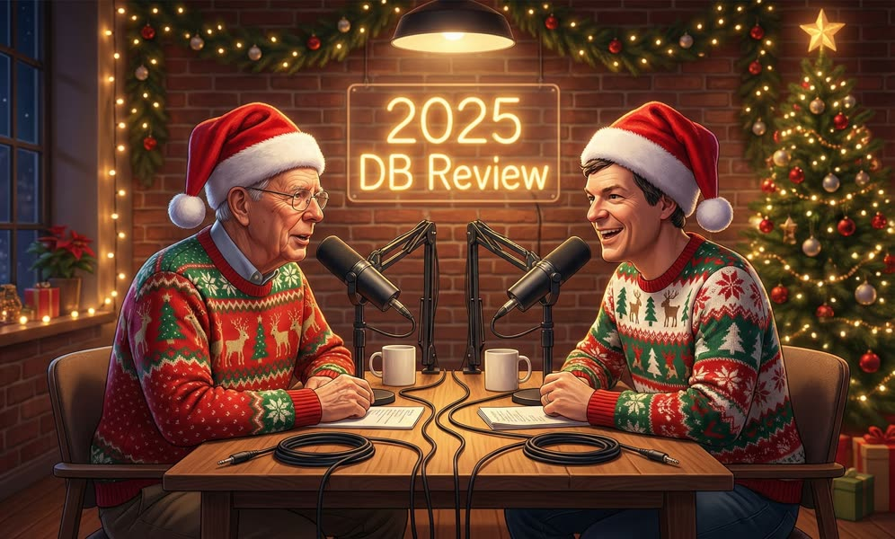

最近，图灵奖得主、Postgres 创始人、MIT 与 UC Berkeley 计算机系教授 Mike Stonebraker，
以及数据库领域大网红、卡耐基梅隆大学数据库系教授 Andy Pavlo 联合主持了一期播客，
回顾了 2025 年 AI 对数据库的影响、数据库行业的重大事件，以及 AI 对计算机科学教育和职业发展的作用。

老冯转录了视频的文字稿，翻译并点评了一下，供大家参考。

> Data 2025：年度回顾 —— Mike Stonebraker 与 Andy Pavlo 对谈录
> 
> **录制于 2025 年 12 月 10 日**
>
> *对谈嘉宾：Mike Stonebraker（MIT CSAIL，图灵奖得主，PostgreSQL 创始人）、Andy Pavlo（卡内基梅隆大学），主持：DBOS 团队*
> 
> 原文地址：[Data 2025:  The year in review with Mike Stonebraker](https://www.dbos.dev/webcast-2025-in-review-with-mike-stonebraker-and-andy-pavlo)
>
> 中文译评：冯若航

## 开场介绍

**[0:00] 主持人（DBOS）：** 大家好，感谢各位参加今天的活动。我们将与 Mike Stonebraker 和 Andy Pavlo 一起回顾 2025 年的技术发展。

今天的议程包括：深入探讨 AI 与数据管理之间的相互影响——AI 趋势如何改变数据管理，数据管理趋势又如何反过来影响 AI。我们也会谈到 AI 在数据库运维自动化方面的应用。

之后，Andy Pavlo 将回顾今年行业发生的重大事件——里程碑式的进展、收购案、新公司的诞生、已经退出历史舞台的公司、被收购的公司，并探讨这些变化将如何塑造 2026 年乃至更长远的数据管理和软件开发格局。

最后，我们会展开一场非常有意思的讨论：AI 正如何影响计算机科学——它改变了教学方式、研究方式，以及许多人的职业发展道路。最后大约留 10 分钟进行问答。

熟悉 DBOS 的朋友可能知道，它曾经代表 Database Operating System（数据库操作系统）。这家公司起源于 MIT 和斯坦福的一个研究项目，最初是因为联合创始人 Matei Zaharia 请 Mike 帮忙解决 Databricks 的持久化分布式队列问题。这个契机催生了一个研究项目：在分布式数据库之上构建操作系统，作为 Linux 的潜在替代方案——一个从设计上就更加云原生的系统。

如今，DBOS 代表 **D**urable **B**ackends that are **O**bservable and **S**calable（持久、可观测、可扩展的后端）——这个缩写是我后来硬凑的。如果你了解 DBOS，它是一个开源的持久化工作流编排库，能让你的应用程序和后端具备故障恢复能力，同时提供可观测性，并通过更简便的队列机制实现弹性扩展。正如一位 DBOS 用户精辟总结的：**DBOS 让你想搞砸都难**。这也是为什么 DBOS 在众多新兴 AI 应用公司中如此受欢迎——他们需要 AI 工作流无论遇到什么意外情况都能按预期运行。

Michael 稍后会详细讲解持久性与 Agentic AI 之间的关系。简单说，这就是 DBOS。如果你正在构建软件，想让它轻松实现防错和可观测，可以了解一下 DBOS 开源库。

你可能会好奇：我们不是数据库公司，为什么要举办数据库研发的网络研讨会？原因是：Postgres 的发明者 Mike Stonebraker 是 DBOS 的联合创始人；我们也和 CMU 的 Andy Pavlo 是好朋友——他发明了"数据库学"（databaseology）这个词，同时也是 "So You Don't Have To" AI 的创始人，这是一个 AI 驱动的数据库调优服务，推荐大家去看看。好，闲话少说，让我们开始今天的议程，听听 Andy 和 Mike 怎么说。

---

## 第一部分：AI 如何影响数据管理？

**[4:03] 主持人：** 第一个话题是：AI 如何影响数据管理？数据管理又如何影响 AI？Mike，你先来？

**[4:10] Mike Stonebraker：** 谢谢 Andy。还有另一位 Andy，你好。我得先说一下，我现在身体不太舒服，状态不是 100%，所以 Andy P，你得对我手下留情。

Sam Madden 几周前把生成式 AI 和大语言模型形容为"自切片面包以来最伟大的发明"——他没有原话这么说，但意思差不多。我的看法要保守得多，让我分享一下我使用大语言模型的经验。

> 【译注】"自切片面包以来最伟大的发明"（the best thing since sliced bread）是英语中一个常见的俚语，用来形容某样东西非常了不起、革命性。这个说法源于 1928 年美国发明的预切片面包，当时被认为是家庭生活的重大便利创新。

我关注的是企业数据，所以一个显而易见的问题是：能不能用大语言模型来查询数据仓库？业界有一些公开的基准测试——BIRD、Spider、Spider 2——报告的准确率在 60% 到 90% 之间，看起来相当不错。但这不是我在真实数据仓库上的体验。

我们试了 MIT 数据仓库的一个子集，里面有学生、课程、教职员工、专业等各种信息。我们找了真实用户——事实上，我所在的 MIT CSAIL 实验室就是这个数据仓库的真实用户。我们收集了真实用户的查询，搞清楚对应的标准 SQL 是什么，于是我们有了一批"自然语言-标准 SQL"的配对数据。

我们用各种 LLM 在 MIT 数据仓库上测试，准确率是**零**。不是说很低——是零。什么都查不出来。

然后我们尝试了所有标准技术——RAG、把查询分解成更简单的部分、从其他来源补充数据——准确率勉强提升到 20% 左右。如果我们告诉 LLM 具体要查哪张表或哪几张表，能提升到 30% 左右。但离实际可用还差得远。

你可能会说，也许 MIT 的数据是特例。但我们在七个不同的真实数据仓库上测试，结果每次都一样。

有些人报告了更好的结果，但我持怀疑态度。原因如下——MIT 数据仓库有什么特点让它如此困难？

**第一，这不是公开数据。** LLM 根本无法访问这些数据，因为它们受到各种隐私和安全保护。

**第二，MIT 有很多独特的术语。** 如果你想查"过去两年谁主修了计算机科学"——MIT 数据仓库回答不了这个问题，因为 MIT 根本不用"计算机科学"这种说法。计算机科学实际上叫 "Course 6.2"。还有 J-term，是一月份的一个月学期。这些东西你不能指望 LLM 知道。

**第三个问题是我所说的"语义重叠"。** MIT 的数据仓库里充满了物化视图，这些视图是为了加速常用查询而存在的。但问题在于，它给你提供了多种方式来回答同一个查询，而且语义往往略有不同——比如有些数据是按月的，有些是按周的。

**第四是复杂查询。** 这些查询大多涉及三到四张表的连接，还带有聚合操作，相当复杂。

**[10:00]** 因此，如果你的数据库具有这四个特征中的任何一个——非公开、术语独特、语义重叠、查询复杂——我对用 LLM 解决问题不抱乐观态度。

所以我的思路其实不太一样。要想把 Text-to-SQL 做好——首先，在企业环境中，真正的问题是这样的：我有 ERP 系统、CRM 系统，还有一大堆其他系统和大量文本，我想查询类似"谁既是我的供应商又是我的客户"这样的问题。这需要查询多个私有数据源，既有文本也有 SQL。这本质上是数据湖问题。

怎么解决数据湖问题？让我举个简单的例子。我们有个学生在和德国慕尼黑市合作，处理他们的交通部门数据。有各种各样的查询，比如：为什么这个路口的绿灯时间不长一点？或者，电车通过没有红绿灯的路口时最高时速是多少？慕尼黑市有六七个不同的数据源，理论上可以回答这些问题。这是典型的数据湖场景。

我的观点是：最简单的方法是把这些数据源包装成一个非常小的 SQL 子集，让用户能够表达他们想要什么。**我主张系统的顶层应该是面向 SQL 的，而不是面向 LLM 的。** 这是我正在研究的方向。也许这是个特例，也许不是。也许 Amazon 最近发布的 Bedrock 能在这方面有所帮助。

我留给大家一个测试：试着问你最喜欢的 LLM 这个问题——"有多少 MIT 教授有维基百科页面？"这个查询有两个问题。第一，"谁是 MIT 教授"的答案在 MIT 数据仓库里——我刚才说的那些问题都适用。第二个问题是维基百科，这是另一个数据源，它有个很好用的界面——你输入某人的名字就能看到他们的页面。LLM 最近开始能做这个了。但我很容易给你出一个更复杂的问题，它们就答不上来了。

我的思路是：给 MIT 数据仓库包一层封装，让它足够简单，能够通过 Text-to-SQL（或者 Text-to-简化SQL）来回答问题；然后给维基百科包一层封装，就是一个"查找 Andy Pavlo"或"查找任何人"的接口。然后把这两个系统做一个连接操作。要用迭代替换，因为维基百科页面比 MIT 教授多得多。

在我看来，这变成了一个查询优化问题——查询优化器最擅长解决这类问题。这就是我的研究方向。

当然，这些观点要打很大的折扣。第一，我只关注企业数据，别人可能关注很多其他领域。第二，我主要关注的是防火墙内部、LLM 无法访问的数据。所以我的经验可能比较特殊。在我看来，LLM 在某些事情上表现很好，但可能不是所有问题的答案。

好，现在让 Andy Pavlo 来说说，他对世界的看法要乐观得多。

---

## 第二部分：Andy Pavlo 谈 LLM 与 Vibe Coding

**[15:21] Andy Pavlo：** 说到维基百科，我还想提一嘴——我的维基百科页面被删掉了，因为我的简介里写我是"在巴尔的摩街头出生的"（born in the streets of Baltimore），实际上我是在巴尔的摩出生的，但显然不是在街头。

> 【译注】这里 Andy 在自嘲。"Born in the streets" 听起来像是说在街头流浪时出生的，有一种"街头混混"的既视感，而实际上他只是在巴尔的摩市出生而已。维基百科可能因为来源不可靠或措辞不当而删除了他的页面。

总之，我对 LLM 取得的成就要乐观得多。在自然语言转 SQL 这件事上，对于某些特定挑战，确实会有困难。但我更关注的是**全新应用**（greenfield applications）——未来的企业应用总要从某个地方开始，而它们现在就在开始。

> 【译注】Greenfield（绿地）在软件开发中指从零开始构建的新项目，没有历史包袱，与 brownfield（棕地，指在既有系统上改造）相对。

Andrej Karpathy 去年创造了 **"vibe coding"（氛围编程/凭感觉写代码）** 这个词，我们看到大量新应用几乎完全由 LLM 或编程代理生成。你可能会问："这些代码比人写的好还是差？"差不多，因为这些模型是在海量代码语料上训练的。人类有时写好代码，有时写烂代码——LLM 也一样。

> 【译注】Vibe coding 是 Andrej Karpathy（前 OpenAI/Tesla AI 总监）提出的概念，指的是用自然语言描述你想要什么，让 AI 帮你生成代码，你只需要"感觉"一下对不对，而不是逐行编写。这个词带有一点调侃意味，暗示程序员只需要"找感觉"，不用真正懂代码。

我对 LLM 作为编程代理的能力相当看好。说说我们自己的经验：我们在卡内基梅隆教的课程，项目都是用 C++ 写的。一年前，LLM 能解决一部分项目，但不是全部——它能生成代码，但不是所有代码都正确或有用。现在已经到了这样的程度：我们的项目几乎可以完全由 LLM 编写和解决。

所以我认为 vibe coding 是真实存在的趋势，我们将看到更多基于数据库的应用涌现。但挑战在于：你有这么多代理在生成新的应用代码，这些代码会和数据库交互、读写数据。现在我们要处理所有涌向数据库系统的负载。

在 LLM 出现之前，所有应用代码都是人写的，它们会访问数据库系统，你很幸运才能有一个人类或 DBA 来维护、优化和监控这些数据库系统。现在人类不写代码了，也没有人类监控数据库系统了——这简直是灾难的完美配方。

**[18:01]** 在研究方面，我们已经研究了好几年如何用机器学习和 AI 技术来自动化数据库系统的管理和优化。这不是 AI 突然带来的新能力——人们从 1970 年代就开始尝试了。最早的工作之一是自动为关系数据库选择索引——1976 年 SIGMOD 上就有相关论文。Microsoft 的 AutoAdmin 项目也在做这件事。

但我们研究的是从整体上看待数据库系统——尝试调优数据库系统中所有可调的东西，以应对来自 vibe-coded 应用的随机查询，同时关注数据库系统的整个生命周期。

事实证明，LLM 在这方面相当擅长。我们现在研究的是如何同时调优数据库系统暴露给你的所有配置。已有很多工作研究如何调优单个方面——"你需要什么最佳索引"或"系统需要什么最佳配置参数"——比如 Postgres 的 `shared_buffers` 或 MySQL 的 `innodb_buffer_pool_size`。但所有这些工具都只针对一件事。我们研究的是：如何同时调优所有东西？因为这样才能找到数据库的真正全局最优配置。

在我们这个领域的最新工作中，我们不是用 LLM 来做决策，而是用 LLM 来实现不同类型数据库或不同数据库部署之间的知识迁移。我们的算法可以在一个流程中调优索引、配置参数、查询计划提示、表级参数、索引日志——基本上是 Postgres 暴露给你的所有东西。我们可以把这些全部一起调优。

但问题是，你得为这个特定的数据库实例训练非常专用的模型。我们最新的工作是利用 LLM 来识别彼此相似但不完全相同的数据库。然后我们可以把从调优一个数据库收集的所有训练数据，应用到另一个数据库上——效果出奇地好。

**[20:40]** 关于这些算法的性能，我要说的是：当前研究表明，这种专门为数据库优化和调优定制的算法，比 LLM 能做到的好两到三倍。但 LLM 速度很快——ChatGPT 能在 15 分钟内给你的数据库吐出一套方案，而我们最好的算法现在需要 50 分钟。所以这是速度和质量之间的权衡。根据问题的严重程度和你的需求，你可能会选择其中一个。

**[21:21]** 现在我们在研究的另一个很酷的东西——也是我非常看好 LLM 的原因——是**推理代理**（reasoning agents）：识别问题，然后决定调用哪个子代理或工具来解决它。比如，如果有异常检测，数据库系统有某种延迟问题，推理代理可以决定："我要运行这个工具来构建索引，因为我认为这就是当前的问题；我要运行另一个工具来优化存储性能。"

这就是我认为在未来一年左右会出现的真正酷炫的东西：能够同时审视一堆不同的问题，并决定调用哪个子代理。子代理可以是 LLM，也可以是这些定制算法之一。我认为这非常令人兴奋，LLM 在这个领域绝对是颠覆性的。

---

## 第三部分：Agentic AI 与数据库技术

**[22:18] Mike Stonebraker：** 我认为，至少在数据管理领域，自动调优应该能成功，因为它理应可行，理应具有商业价值。所以我很高兴看到"OtterTune 二代"还活着，尽管 OtterTune 本身没能成功。

> 【译注】OtterTune 是 Andy Pavlo 之前创办的数据库自动调优公司，后来关闭了。Mike 这里用"Son of OtterTune"（OtterTune 之子）来调侃 Andy 新的创业项目 "So You Don't Have To" AI。

**[22:52] Andy Pavlo：** 我得说，OtterTune 面临的挑战是——因为我们不托管数据库系统——存在形态问题，需要用户授权我们连接到他们的数据库。而且 OtterTune 是被动调优，在系统外部观察发生了什么，然后做改变，再观察后来发生了什么。

我们现在做的新工作不同——我们不是要托管数据库系统，而是寻求与现有平台集成。如果你在应用程序和数据库服务器之间放一个代理（想想 PgBouncer、PgCat、PgDog——现在有很多这样的 Postgres 代理和其他系统的代理），你就能看到查询到达时的样子，可以在查询进入时操纵它们。我们仍然不托管数据库系统本身，但至少现在我们能看到我们所做改变的效果——这对我们能做的事情产生了很大影响，而 OtterTune 做不到这一点。

从商业角度，我们现在的做法是：不再做一个独立产品让用户注册、连接数据库、授权等等，而是在讨论与现有平台做 OEM 白标集成。这让我们可以专注于 ML 数据库这一块，而不用操心开发者体验和入职流程。

**[24:20] Mike Stonebraker：** 好吧，祝你好运，希望你成功。

**Andy Pavlo：** 谢谢 Mike。

**[24:26] Mike Stonebraker：** 我想谈一件事：整个世界都爱上了 Agentic AI。在我看来，Agentic AI 意味着你有一个工作流，里面有些是 LLM，有些是 AI，有些是别的什么。也就是说：如果 LLM 不能直接做某件事，也许你可以在它周围加一些东西，让它更成功。我们在 MIT 做了很多这方面的工作。

DBOS 早期发现的一件事是：总体而言，Agentic AI 应用需要**持久化计算**（durable computing），因为这些东西很多是长时间运行的，如果出错，你不想从头再来。所以持久化计算在 Agentic AI 中是个大问题。有一堆商业产品在做这个。

但到目前为止，Agentic AI 基本上是我所说的"只读"——你查询一堆地方，然后拼凑出结论，比如"我预测 Andy Pavlo 的 OtterTune 继任者会成功"之类的。

我认为用不了多久，Agentic AI 就会变成"读写"的。这意味着持久化计算本质上就是事务系统中 ACID 的 D（Durability，持久性）。完全是同一回事。现在大家实现持久性的方式都在使用数据库技术——你有一个日志，如果出了问题，你回滚然后重放。

**[26:39]** 所以这将是一个数据库问题，而妙处在于：它要求你把应用状态放进数据库。正如 Andy Pavlo 刚才说的，我相信数据库将逐渐接管应用程序状态的存储——因为这样你就能获得持久性。

但一旦涉及读写……我最喜欢的例子是：假设你在经营一家在线自行车店。服务器端的大致流程是这样的：客户进来说"我想买一辆 XYZ 自行车"。你的第一个动作是："我有没有这辆车？"所以你需要查询库存，如果有就预留它。

第二步，如果有货，你要确认是否愿意和这个客户做生意。这可以用 LLM 来判断：这个客户是不是退货太多？信用评级如何？等等。

如果都没问题，第三步就是收钱——PayPal 或者你喜欢的任何支付系统。如果这也没问题，就发货。

所以基本上是四个步骤，每个都是一个事务，大多数涉及更新操作。比如，如果你给履约系统一个错误的地址，它就得把所有东西回滚。这些步骤里有一堆更新操作。

**[28:36]** 这就是涉及更新的场景。你必须处理失败情况。持久性只处理正向场景——完成你的工作流。你还必须处理回滚，这需要某种原子性的概念。

**[29:04]** 我认为搞清楚 ACID 对工作流来说到底意味着什么，是一件大事。我正在推销我为 CIDR 写的一篇论文，将在一月份发表。我认为那是一个过渡性的解决方案，但不是最终方案。搞清楚这一切还需要一些时间。

另一个问题是：目前 LLM 的架构方式，大多数是非确定性的。所以如果你的代码有 bug，你很可能无法复现它。数据库领域的人对此早就知道了。这叫做 **Heisenbug**（海森堡 bug）——不可复现的 bug，相对于 **Bohrbug**（玻尔 bug）——可复现的。Jim Gray 很久很久以前写了很多关于这个的东西。我们显然要重新审视所有这些问题。

> 【译注】Heisenbug 这个名字来源于量子力学的"海森堡不确定性原理"——你一观察它，它就消失了。Bohrbug 则来源于玻尔的确定性原子模型。这是 Jim Gray 在 1985 年提出的术语，用来描述软件中两类不同性质的 bug。

**[30:02]** 所以我认为，这是一个数据库技术将对 Agentic AI 产生巨大帮助的领域——让它实现"ACID-plus"或者不管最终叫什么。我认为这将是一件大事。

关于编程语言方面——事实已经证明它非常有用。Vibe coding 确实有效，在全新应用上效果最好——绝对正确。问题是 95% 的企业程序员不是在做全新项目，他们得处理已有的系统。

而且众所周知，vibe coding 在代码结构良好的情况下效果最好。但问题是，典型的企业系统不是这样的。系统被更新、维护、打补丁、更新、维护、打补丁……最后变得太丑陋了，你只好扔掉重写。

所以我认为，要想最大限度地利用 vibe coding 的优势，我们必须改变企业编写软件的方式。还有大量工作要做。

---

## 第四部分：2025 年行业回顾——并购与市场动态

**[31:43] Andy Pavlo：** 不仅仅是并购——今年数据库领域风起云涌。我感觉今年的活动比去年还多。

先说说主要的收购案。最大的一笔可能是 **Databricks 收购了 Neon**，紧接着 **Snowflake 收购了 Crunchy**。所以 Postgres 生态有很多动作——我们稍后会谈到。

**IBM 买了两家数据库公司。** 年初买了 DataStax——这是开发 Cassandra 的主要公司。然后我记得这周刚宣布收购了 Confluent——Kafka 背后的主要公司。这些都是大手笔。

融资方面，ClickHouse、Supabase 都完成了大额融资。Databricks 又融了一大笔，因为他们总是在融钱，等着 IPO。Informatica 被 Salesforce 收购了。SkyDB 被 MariaDB 又买回去了——这个比较奇怪，因为他们去年好像是把它拆分成独立公司的，今年又买回来了。

另一个大消息是 **Fivetran 正在与 dbt 合并**——我想这笔交易明年会完成。

所以是的，又是活动频繁的一年。

**[33:17]** 关于倒闭的数据库公司，我曾预测 2025 年会有更多公司失败。大约两年前有一份 Gartner 报告也做了类似的推测。但我能想到倒闭的只有两三家：**Voltron Data** 几周前宣布关闭；**Fauna** 五月份关闭；还有一家叫 **MycaleDB** 的中国 MySQL 托管公司今年早些时候倒闭了。

所以我预测错了。我以为会有更多数据库公司倒闭。数据库公司的朋友们告诉我，其实今年相当不错。这是积极的信号。当然确实有一些公司倒闭了，但没有我想象的那么多。也许有些公司在苦苦支撑，谁知道呢。

有两家公司被私募股权收购了：**Couchbase** 和 **SingleStore**。SingleStore 被一家叫 Vector 的私募公司收购了——他们几年前买过 MarkLogic，所以有运营数据库公司的经验。但通常私募股权买下一家公司后，会让它进入维护模式。希望 Couchbase 和 SingleStore 能挺过去。

**[34:50]** 说到今年的整体氛围——显然，**Postgres 又是辉煌的一年**。说到 Mike——我喜欢开头介绍里他被列为 Postgres 的发明者，而我被列为一个网络梗"数据库学"的发明者。当然不是一回事，但我就当个荣誉收了。另外我们也可以加上图灵奖——那更重要。

是的，Postgres 今年太疯狂了。Databricks 买了 Neon，还买了 Mooncake——这让他们有了让 Postgres 读写 Iceberg 的能力。微软刚刚发布了 Horizon DB——这是他们托管版的 Postgres，架构类似 Neon，采用存算分离，大概两三周前宣布的——是他们一直在做的项目。

所以越来越多的 Postgres。

**[35:42]** 在开源数据库领域，唯一可能算是 Postgres 竞争对手的是 MySQL——但那条船已经开走了。而且 **Oracle 解雇了基本上整个 MySQL 开发团队**，只留下做 HeatWave 的——九月份的事。所以现在真的没有什么大公司在全力投入 MySQL 的开发。基本上，**Postgres 已经赢了**。

这真是太令人兴奋了。Postgres 的代码库——非常漂亮，前端很棒。后端有点问题，我写过博客文章，我们也报道过这个。

**Supabase 整合 OrioleDB 的努力非常令人兴奋**，因为那是多版本并发控制和其他机制的现代实现。Postgres 的那些机制——Mike，你们当年在 80 年代做的时候，根本没有其他系统可以参考怎么做。所以希望他们能纠正你们当年在伯克利犯的错误。

**[36:45]** 总之，数据库商业领域现在非常活跃。正如我说的，大量 vibe coding 应用正在生成，而 Postgres 是很多应用的默认选择。

还有一件事要提——有两个重大项目宣布要做**分布式 Postgres**。一个是 Supabase 的 **Multigres**，由发明 MySQL Vitess 的那个人领导——Vitess 后来被商业化为 PlanetScale。然后 PlanetScale 也宣布了一个叫 **Naki** 的项目，试图做一个类似的分片、无共享版本的 Postgres。

有趣的是，这不是第一次有人尝试做分布式 Postgres。2000 年代末、2010 年代初有一堆这方面的工作——Translattice、Greenplum，我记得华为也有一个项目。但对于 OLTP 工作负载，没有人真正成功做出来。

我认为现在有足够的能量，时机终于到了——你终于可以拥有一个真正可扩展的分布式 Postgres——不管是通过 Multigres 还是 Naki。这是我期待明年会出现的一个重大进展。

---

## 第五部分：Postgres 的未来与向量数据库

**[38:14] Mike Stonebraker：** 说到 Postgres，我认为 **Postgres 已经并将继续统治世界**。原因是所有主要云厂商都把宝押在了 Postgres 用户界面上。Postgres 的线协议将无处不在。

他们要么选择一个标准来开发，要么自己搞一套，而每一家都选择了 Postgres 线协议。

我认为这是一个好选择的原因是：很多年前 Oracle 收购了 MySQL，这让社区对 MySQL 能否保持社区属性产生了疑虑。

我觉得 Postgres 最令人惊叹的是：**这个系统不属于任何企业——它由一群非常非常聪明的人运营，这些人在各种不同的地方工作。** 所以你应该把 Postgres 看作开源本来应该是的样子。它来自社区，服务于社区。

**[39:46]** 我还想谈几件事。第一，有人在聊天里提到了 Kumo。是的，我们看过 Kumo。Kumo 做的是预测，不是 Text-to-SQL，他们解决的是不同的问题。

另外，还有其他分布式 Postgres 类的东西。Greenplum 是一个，CockroachDB 是另一个，Yugabyte 也是。还有几个我一时想不起名字了。但我认为，如果你还没有把宝押在 Postgres 上，现在这样做绝对是正确的。

**[40:43]** 我还想指出，Andy 和我几年前写了一篇论文，叫做《What Goes Around Comes Around... and Around》（风水轮流转……又转）之类的。你们都应该回去读那篇论文，因为在我看来，那是对未来走向的绝佳预测。

> 【译注】这是 Mike Stonebraker 和 Andy Pavlo 在 2024 年发表的论文，是对 2005 年经典论文《What Goes Around Comes Around》的续篇。论文回顾了数据库领域的技术轮回，指出很多"新"技术其实是旧概念的重新包装。

举个例子，现在对向量索引或向量数据库有很大兴趣。那么，什么是向量数据库？向量数据库就是一堆关系型的 blob，加上一个图结构的索引。

读过 Frank McSherry 工作的人都知道，他清楚地表明：做图检索的最佳方法是——尽可能多地对图进行编码，把它放进内存，然后写一个定制的查询执行器来处理。成功的向量数据库似乎正是这么做的。

所以我的观点是：去读那篇论文吧，我认为它对未来走向的预见性很强。

**[42:11] 主持人：** 谢谢。我们会把论文链接和活动录像一起分享给大家。

在我们转向计算机科学的未来之前，快速问一个问题。你刚才提到向量数据库，有不少关于向量数据库的问题。Andy，你有没有特别喜欢的向量数据库？你对向量数据库这个领域整体怎么看？

**[42:36] Andy Pavlo：** 我得小心措辞，免得得罪人。

我是说，我喜欢 Weaviate 的团队。我没用过他们的系统，但他们非常开放——开源的，文档写得很好——我能理解他们在做什么，比其他家可能更清楚一些。所有向量数据库公司都来我们这儿做过演讲，都在 YouTube 上。

这些向量数据库公司需要想清楚的问题是——我几年前和 Weaviate 的 CEO 聊过这个——现在他们不是作为主数据库在用。正如 Mike 说的，它们基本上是 JSON blob，里面放着向量嵌入，然后他们为这些建索引。现在很多人把它们当成 Elasticsearch 来用——就像数据库的第二份副本，你可以在上面跑最近邻搜索，不干扰数据仓库或常规的 OLTP 工作负载。

**[43:48]** 所以他们会走到一个十字路口，必须决定：是继续做一个像 Elasticsearch 那样的边缘专用数据库（这没问题，有市场），还是想成为主数据库。如果是后者，你就得开始添加 Postgres、CockroachDB 或 Oracle 提供的所有那些东西——事务、SQL 等等。

所以他们得决定怎么走。

不过我要说，挑战在于：归根结底，向量索引就是索引而已。所以对于像 Postgres 这样高度可扩展的系统，你可以很快添加这些新的索引类型。

值得注意的是，当 ChatGPT 在 2022-2023 年左右成为主流时，然后 RAG 成了人人都在说的热词，大家意识到"噢，怎么做 RAG？你需要向量索引"——**所有主要数据库厂商在一年内都添加了向量索引**。很多都利用了开源库，比如 Meta 的 DiskANN 或 FAISS。添加这些东西并不是大工程。

相比之下，当列存储出现时——那是相当根本性的工程改变，你必须改造系统来支持向量化执行或列存储。而向量索引，你可以直接塞进去，很快就能跑起来。

**[45:23]** 所以对我来说，这表明**专门的向量数据库系统的护城河没那么宽**。当然，它们做的事情肯定比 pgvector 好很多，但对于 99% 的人来说，用 pgvector 可能就够了。

**[45:46] Mike Stonebraker：** 好，再补充两点。

**第一，花哨的向量索引基本上局限于内存。** 所以如果你的问题超出了内存容量，性能会断崖式下降。

**第二，如果你的向量有大量更新，更新索引是个噩梦级的问题。** 绝对是噩梦。

所以，如果你的数据是只读的、规模不大，我认为向量索引没问题。但如果你有大量更新，问题就复杂得多。而且如果你把索引和数据放在同一个主系统里运行，至少可以保持一致性。

**[46:54] Andy Pavlo：** 我是说，也不是那么一致，对吧？因为有时候这些索引你得重跑聚类算法，那意味着你得重新扫描所有数据。这和全文搜索的倒排索引面临的挑战一样。它们可能有一个侧缓冲区，你先吸收所有写入，然后最终得运行代价更高的重建任务。

---

## 第六部分：GPU 数据库与 IBM 收购

**[47:21] 主持人：** 谢谢。关于市场还有一个问题。Andy，你提到 Voltron 关门了。有人问这对 GPU 加速数据库的未来意味着什么？

**[47:33] Andy Pavlo：** 好，我得小心点。

我对 GPU 数据库一直持怀疑态度。2018 年我们有一个研讨会系列，邀请了所有主要的 GPU 数据库厂商来校园。我记得他们会炫耀各种惊人的数字，但那些只适用于能装进 GPU 内存的数据库。而且他们总是拿 Greenplum 来比——2018 年谁还在乎 Greenplum 啊？

所以我当时很怀疑，因为这看起来很小众——你的数据必须足够小才能装进 GPU。

但发生变化的是——Voltron 在他们的论文项目或论文系统中展示的（虽然没有找到产品市场契合点或商业可行性）——他们展示了如何快速地把数据从磁盘流式传输到 GPU，让 GPU 作为整个数据系统的加速器，而不用把所有东西都加载进去。

对我来说，这才是颠覆性的变化。不点名的话，**我预计——你们应该预期——2026 年会有一些主要数据库厂商宣布他们现在支持 GPU 加速。**

**[49:00] 主持人：** 酷。还有一个市场问题。IBM 收购 DataStax（Cassandra）和 Confluent（Kafka 和 Flink）如何改变 IBM 在数据库市场的地位？

**[49:07] Andy Pavlo：** 噢，Mike 当过 Informix 的 CTO。他可以讲讲 IBM，对吧？

我是说，DB2 仍然赚很多钱。IMS 可能还在收维护费。他们在这些老东西上仍然赚很多钱。今天的 IBM 不是 IMS 时代的 IBM，文化和产出都变了。

> 【译注】IMS（Information Management System）是 IBM 在 1966 年推出的层次型数据库，至今仍在一些大型企业的核心系统中运行，是"古董级"但仍在收费的产品。

所以，还得看吧？还得看他们会多深入地参与 DataStax 和 Confluent 的日常运营——是像 Red Hat 那样让他们作为卫星公司独立运作，还是快速整合成 IBM 整体咨询服务栈的一部分。

**[49:56]** 对于 Cassandra 来说，Cassandra 源代码的第二大贡献者其实是苹果。苹果运营着世界上最大的——如果不是最大也是最大之一的——公开 Cassandra 集群。所以我认为 Cassandra 的管理权会没问题的。

Kafka 的话，还得看。但 Jay 是个聪明人，在 Confluent，我相信他们会想出办法的。

> 【译注】Jay Kreps 是 Kafka 的创始人之一，也是 Confluent 的联合创始人兼 CEO。

**[50:43] Mike Stonebraker：** 我认为你们都应该记住的是：**IBM 基本上是一家服务公司和定制软件开发公司。**

很明显发生的事情是 IBM 的客户一直在要求这两个系统。所以 IBM 有足够的闲钱直接买下它们。

但我认为 IBM 有一个遗留硬件业务和一个巨大的遗留软件业务。他们会继续榨取这些业务的价值，直到这个电话会议上的每个人都安全退休。

---

## 第七部分：计算机科学教育与职业发展的未来

**[51:33] 主持人：** 好，让我们换个话题，谈谈计算机科学以及 AI 如何影响课程设置——MIT、CMU 和其他地方——以及职业机会。

事实上，问答区已经有人问了：在 DBMS 公司找工作需要什么技能？Andy，也许你可以先谈谈 AI 如何影响了 CMU 的课程？

**[51:58] Andy Pavlo：** 我得说，**现在没人知道答案。** LLM 在回答考试题目、作业问题上好得惊人。

说个轶事，在我们的数据库系统入门课上，第一个作业是：我们给你一个数据集，给你问题——有点像在解决 Mike 刚才说的那个问题——你必须写 SQL 来回答问题。我们相当确定大多数学生在用 LLM。事实上，老实说，我在学期开始时鼓励他们用 LLM——这是现在任何开发者都应该使用的工具，就像 GDB 或其他调试工具一样。这就是世界的现状。

但我要说，**最终你必须理解基础**。这是卡内基梅隆一直在更加强调的——我们一直在这方面做得很好，但现在比以往任何时候都更重要。

**[52:55]** 回到 vibe coding 的话题。你可以让 LLM 生成一堆代码，但如果你不理解这些代码试图做什么、你试图实现什么，你就会迷失。

所以我说，你应该学习的是**计算机科学的核心基础，这部分其实没变**。不管是用 JavaScript、C++、Rust 还是什么——语言和工具可能变，但基础很重要。理解软件在为你做什么。

**[53:40]** 关于在数据库系统公司找工作需要什么技能——我认为目前没有太大变化。理解系统基础，理解硬件在做什么。

数据库的美妙之处在于你必须理解一切——你会接触到所有层面。所以你必须理解硬件想做什么、操作系统想做什么（或不想为你做什么）、网络想做什么。理解所有这些。

然后我要强调的是：**能够与你没有写过的大型代码库互动、操作和理解**。同样，LLM 在这方面很有帮助。

**[54:17]** 还有调试——因为这个问题不会消失。LLM 还解决不了这个——我认为它们最终会做到。但理解复杂组件如何协同工作、相互交互、识别 bug、识别竞态条件和其他问题——这个问题不会消失。这些东西只能通过实践获得。有很多方式可以做到。

我得说，现在的资源比 Mike 当学生时好太多了，比我当学生时也好太多。现在有很多东西可以帮助人们理解数据库系统在做什么。就是去做就行了。

**[54:59] Mike Stonebraker：** 我认为只要你来自一流大学，主修 CS 就会没问题——正如 Andy 说的，你会学到如何利用所有可用的工具来提高生产力。

如果你从 Control Data Institute 或那类地方毕业，我认为市场会很糟糕——因为那里只教你写代码，而这不会是一个很有市场价值的技能，除非你超级超级超级聪明。

> 【译注】Control Data Institute 是美国一家已经倒闭的职业培训学校，曾经提供计算机相关的职业培训课程。Mike 这里用它来泛指那些只教技术操作、不注重计算机科学基础的培训机构。

**[55:48]** 所以我认为，一流大学的 CS 专业招生总数可能会持平或下降一段时间。之后会怎样，我不知道。

**[56:00] Andy Pavlo：** 但我还要说——一方面是的，因为 AI 帮助了很多事情，找工作会更难。但回到 vibe coding 那点，现在构建东西太容易了。

所以最终目标不一定是去 Google 或 Apple 或谁那里工作——你可以自己干。当然，我知道对很多人来说，由于不同的经济状况，说起来容易做起来难。但这也是令人兴奋的一点——**进入门槛大大降低了**。

但同样，我要说你仍然需要理解基础。

---

## 第八部分：问答——核心数据库基础

**[56:36] 主持人：** 有一个关于基础的问题。实际上有好几个。人们在问：你认为最重要的数据库内部基础概念是什么？应该学习或掌握哪些来提升职业机会？

**[56:52] Andy Pavlo：** 我是说，一个——不是要推销自己的东西——但我们把所有课程材料都放在 YouTube 上了，你可以做所有编程作业，做所有家庭作业，不用付 CMU 一分钱。所以都在那儿，尽管去学吧。

我觉得就是 **ACID** 那一套，对吧？原子性、一致性、隔离性、持久性。理解那是什么样子——如何把数据从非易失性存储移到内存中并进行交互。如何确保人们可以访问他们的数据而不丢失任何东西。

这些是高层次的基础。作为其中的一部分，你得理解算法复杂度。你得理解数据结构。你得理解优化技术。你得理解并发控制。一点关系代数的集合论也总是有用的。

**[57:54]** 我会称这些为基础。然后正如我之前说的，数据库系统的美妙之处在于：**无论你对计算的哪个方面感兴趣，你都可以在数据库的背景下做。**

如果你喜欢算法，那个领域有很多工作可以看。如果你喜欢网络，你可以做那个。如果你喜欢编程语言，有一堆尝试改进 SQL 或改变 SQL 的工作。

无论你对什么感兴趣，你都可以在数据库的背景下做。而且通常人们会为此付你很多钱。所以这就是为什么我对这个领域很看好。

---

## 第九部分：为什么选择成为数据库研究者？

**[58:27] 主持人：** 好，我们到整点了，最后一个问题。这是注册表上有人问的。问题是问你们俩的：你们为什么选择成为 DBMS 研究者？

**Andy Pavlo：** Mike，你讲讲征兵的故事。

**[58:46] Mike Stonebraker：** 嗯，简单的答案是：**我读研究生是因为当时有征兵制。** 我的选择是：去加拿大、进监狱、去越南，或者读研究生。这让事情变得很简单。

进了研究生院之后，我设法待到了 26 岁，然后军队就不要我了。

> 【译注】这里说的是越南战争时期（1955-1975）美国的征兵制度。当时年轻男性面临被征召入伍的风险，但研究生可以获得延期服役的资格。26 岁之后通常不再被征召。

所以当我找到工作时——顺便说一下，我认为我的论文完全是胡扯——当我到伯克利时，我说："好吧，我得想办法拿到终身教职，得找个新东西来研究。"

**[59:47]** 对我产生巨大影响的一件事是伯克利给了我一个导师：**Gene Wong**（黄煦涛）。Gene 说："我们来看看这个——Ted Codd 刚刚写了这篇开创性的论文。"那是 1971 年；他的论文 1970 年发表在 CACM 上。

于是我们开始研究数据方面的东西。Ted Codd 的东西简单易懂，有一些数学基础。另一个提案来自数据系统语言委员会（CODASYL），那是个低层次的图结构的东西，完全是一团糟。

Gene 和我看着彼此说："怎么可能这么复杂的东西是正确的做法？"

所以这就定下了方向。很多是偶然，但很多是因为在你落脚的大学找到一个好导师。

> 【译注】Ted Codd 是关系型数据库之父，1970 年发表的论文《A Relational Model of Data for Large Shared Data Banks》奠定了关系数据库的理论基础。CODASYL（Conference on Data Systems Languages）则提出了网状数据库模型，在当时是 Codd 关系模型的主要竞争对手。

**[1:01:06] Andy Pavlo：** Mike 的故事比较传奇。

我的情况是，**我高中时被逮捕了，我不想进监狱。** 所以我查了联邦监狱管理局的统计数据，看什么类型的美国人进监狱的比例最低？是有博士学位的人。

所以我想，如果我拿个博士，进监狱的可能性就更低了。这就是我决定读博的原因。

然后数据库对我来说就是自然而然的事。我在一家不太正经的创业公司工作过，我们切换到 MySQL，我高中时就学了关系模型。太棒了。

**Mike Stonebraker：** 你应该讲讲你真的进监狱那次。

**Andy Pavlo：** 呃，等等。我被逮捕的时候，我们认罪的是地方指控，没走联邦程序。所以我从来没进过监狱。

但我确实试过在监狱向我妻子求婚。他们从来没真的把我关进去，Mike，因为他们担心一旦我进了监狱，我就在他们的保险范围内了。所以如果我出了问题或受伤，他们会被开除。所以我一直在外面的拘留区。

> 【译注】Andy 这里讲的是他高中时期的一段经历。关于具体细节，他在一些公开场合有过分享，但他通常以幽默的方式讲述这段往事，把它作为自己求学道路的一个转折点。

**[1:02:25] 主持人：** 嗯，好吧。不是我预期的答案，但非常精彩。

---

## 结语

**[1:02:31] 主持人：** 好了，我们得结束了。很抱歉没能回答所有问题。

感谢 Mike 和 Andy，还有 DBOS 的 Jen，感谢你们帮助举办今天的网络研讨会，分享你们的智慧和经验。

祝你们和所有在线的朋友节日快乐、新年快乐，期待 2026 年的活动再见！

*正文完*

--------

# 观点总结与老冯评论

## Mike Stonebraker 的核心观点

### 1. 对 LLM 做 Text-to-SQL 持悲观态度

**观点摘要：** 在真实企业数据仓库上测试 LLM，准确率几乎为零。原因有四：数据非公开、术语独特、语义重叠、查询复杂。他主张用 SQL 封装数据源，让查询优化器解决问题，而非依赖 LLM。

**老冯评论：** 这是对 Text-to-SQL 炒作的当头棒喝。学术界和媒体吹捧 60-90% 准确率，但那是在玩具数据集上的成绩。一到真实企业环境——MIT 数据仓库这种用"Course 6.2"代替"计算机科学"的奇葩命名——LLM 立刻原形毕露。

这揭示了 LLM 的本质局限：**它们是模式匹配器，不是推理引擎**。企业数据的"暗知识"——隐性业务规则、历史遗留术语——不在训练语料里，LLM 自然束手无策。Mike 的"SQL 封装 + 查询优化器"方案，本质是承认：**结构化问题还得用结构化方法解决**。

---

### 2. Agentic AI 需要 ACID，数据库技术将大放异彩

**观点摘要：** 当前 Agentic AI 是"只读"的，很快会变成"读写"。一旦涉及更新操作（如在线购物流程），就需要事务语义——原子性、持久性、回滚能力。这正是数据库技术几十年来解决的问题。

**老冯评论：** 这是 Mike 最具远见的观点。当前 AI Agent 框架基本都是"乐观执行"——假设一切顺利，出错就重来。这在真实业务场景中是灾难。

Mike 用自行车店的例子讲得很清楚：查库存→检查信用→收款→发货，每一步都可能失败，失败后必须回滚前序操作。这不是新问题——**这就是 ACID 事务要解决的问题，只是披了层 AI 的皮**。

我完全同意这个判断：**未来 1-2 年，数据库技术（尤其是工作流事务、Saga 模式）将成为 Agentic AI 的核心基础设施**。DBOS 确实踩准了这个点。
这也是最近 PG 生态的各路 Agent DB 都在蹭 "Git for Data" 热度的原因 —— 老冯在《[Agent 需要什么样的数据库？](/db/agent-native-db/)》中刚探讨过这个问题。

---

### 3. Postgres 已经赢了，押注 Postgres 是正确选择

**观点摘要：** 所有主要云厂商都选择了 Postgres 线协议。Postgres 的治理模式是"开源该有的样子"——社区所有，没有单一企业控制。Oracle 收购 MySQL 后社区失去信任，Postgres 因此受益。

**老冯评论：** 这是事实陈述，不是预测。Postgres 确实已经赢了——至少在开源关系型数据库领域。AWS Aurora、Google AlloyDB、Azure Horizon DB、Supabase、Neon……所有人都在 Postgres 生态里玩。

Mike 作为 Postgres 创始人说这话，难免有"王婆卖瓜"之嫌，但客观来说他没说错。MySQL 在 Oracle 手里确实凉了——今年 Oracle 裁掉了几乎整个 MySQL 团队。

不过老冯要补充一点：**Postgres 赢了"协议战"，但这也意味着 PG 发行版内战即将打响**。详见《[PostgreSQL 主宰数据库世界，而谁来吞噬 PG？](/pg/proprity-pg/)》

---

### 4. 向量数据库是"内存图索引 + 关系型 blob"，护城河不宽

**观点摘要：** 向量数据库本质上是给 JSON blob 加了个图结构索引。两大限制：只能在内存里跑（数据大了性能断崖）、更新索引是噩梦。

**老冯评论：** 这是对向量数据库最精准的降维打击。Pinecone、Weaviate、Milvus 炒得火热，但 Mike 一句话戳破泡沫：**你们做的不过是 Postgres 扩展能做的事**。

事实也确实如此——pgvector 出来后，大多数场景根本不需要专门的向量数据库。Mike 说"99% 的人用 pgvector 就够了"，Andy 也表示认同。

我在两年前《[专用向量数据库凉了吗？](/db/svdb-is-dead/)》一文中就预测过这一点。
向量数据库公司的出路：要么做到极致性能（服务那 1% 的大规模场景），要么转型成完整数据库（加事务、加 SQL）—— 
但后者意味着和 Postgres 正面硬刚，几乎是死路一条。顺带一提，PG 生态里已经有扩展在做 DiskANN 了，在 NVMe SSD 上跑得相当不错。

---

## Andy Pavlo 的核心观点

### 1. Vibe Coding 是真的，LLM 正在改变软件开发

**观点摘要：** Andrej Karpathy 创造的"vibe coding"概念正在成为现实。CMU 的课程项目现在几乎可以完全由 LLM 解决。代码质量和人写的差不多——因为都是从同一个代码语料库学来的。

**老冯评论：** Andy 比 Mike 年轻 40 岁，他的乐观主义反映了新一代研究者的心态。Vibe coding 确实在发生——GitHub Copilot、Cursor、Claude Code 的普及就是证明。

但 Andy 有一个关键前提经常被忽略：**vibe coding 只对新项目有效**。他自己也承认，95% 的企业程序员不是在做新项目开发。那些几十年积累下来的屎山——被反复"更新、维护、打补丁"直到丑陋不堪——LLM 同样束手无策。

所以 vibe coding 的真正影响可能是：**新应用开发加速，但遗留系统维护依然是噩梦**。这会加剧新旧两极分化——用 AI 写的新系统越来越多，老系统越来越没人愿意碰。

---

### 2. 数据库自动调优需要 LLM + 专用算法的组合

**观点摘要：** 专用调优算法比 LLM 好 2-3 倍，但 LLM 快得多（15 分钟 vs 50 分钟）。未来方向是用"推理代理"来调度——可能调 LLM，可能调专用算法。

**老冯评论：** 这是 Andy 作为 OtterTune 创始人的复盘总结。OtterTune 失败的原因他讲得很清楚：**形态问题**——需要用户授权连接、被动观察而非主动干预。新方案通过 proxy 模式解决了这个痛点。

"LLM + 专用算法"的组合思路非常务实：LLM 擅长快速给出"差不多"的答案，专用算法擅长精雕细琢，用推理代理调度两者，工程上完全可行。

不过我一直有个疑问：**数据库调优真的需要这么复杂吗？** 大多数 Postgres 性能问题，有经验的 DBA 看 10 分钟就能定位。用 Pigsty 这样的发行版，重要参数都已经自动调到对生产"足够好"的程度——从"足够好"调到"最优"，边际收益有多大？

真正需要自动调优的场景是：(1) 没有 DBA 的小公司；(2) 大规模多租户场景。这两个市场能养活一家公司吗？OtterTune 的失败说明，至少单独做这个不行。Andy 现在的策略是 OEM 白标集成，比独立产品务实得多。

---

### 3. 计算机科学教育的核心不变：理解基础

**观点摘要：** LLM 能解决 CMU 的作业，但学生仍需理解基础——ACID、数据结构、算法复杂度、并发控制。语言和工具会变，基础不变。

**老冯评论：** 老生常谈，但在 AI 时代重提很有必要。Andy 说得对：**如果你不理解代码在做什么，LLM 生成再多代码也没用**。

Mike 说得更直白：从 Control Data Institute（职业培训机构）那种地方出来的人会很惨，但一流大学出来的人没问题。
言下之意：**编程正在分化 —— 顶尖人才设计系统，AI 写代码，头部专家发挥几十倍的效能，普通程序员直接出局**。
残酷，但可能是真实的未来。

---

### 4. 向量数据库护城河不宽，pgvector 对 99% 的人够用

**观点摘要：** 向量索引就是索引，Postgres 一年内就加上了。向量数据库要么做专用场景（二级索引），要么加事务/SQL 变成完整数据库——后者意味着和 Postgres 正面竞争。

**老冯评论：** Andy 在这一点上和 Mike 完全一致——这也说明这是数据库圈的共识。

------

## 两人观点对比

| 话题            | Mike Stonebraker          | Andy Pavlo              |
|---------------|---------------------------|-------------------------|
| **对 LLM 的态度** | 悲观，认为在企业数据场景几乎无用          | 乐观，认为在代码生成和自动调优场景很有价值   |
| **未来方向**      | 数据库技术将主导 Agentic AI 的基础设施 | LLM + 专用算法组合，推理代理调度     |
| **Postgres**  | 已经赢了，押注正确                 | 同意，但指出后端需要现代化（OrioleDB） |
| **向量数据库**     | 护城河不宽，本质是内存图索引            | 同意，99% 用 pgvector 够了    |
| **CS 教育**     | 一流大学没问题，培训机构出来的人会很惨       | 基础不变，但构建东西的门槛降低了        |
| **入行动机**      | 逃避越战征兵                    | 逃避进监狱                   |

------

## 我的总体评价

**Mike Stonebraker** 是 “老派智慧” 的代表 —— 50 年数据库经验让他对技术炒作保持警惕。
他的悲观主义不是因为不懂 AI，而是因为见过太多大风大浪后的一地鸡毛了。
他对 Agentic AI 需要 ACID 数据库 的判断非常精准，这可能是这场对话中最有价值的洞见。

**Andy Pavlo** 是"新生代务实派" —— 既不盲目乐观，也不固守旧观念。
他承认 OtterTune 失败的原因，调整策略做 OEM 集成；
他看到 vibe coding 的真实影响，但也承认只对新项目有效。
作为学者，他保持着难得的商业敏感度。

两人的共识比分歧更重要：**Postgres 赢了，向量数据库过誉了，基础比工具重要，AI 不会取代理解系统的人**。

