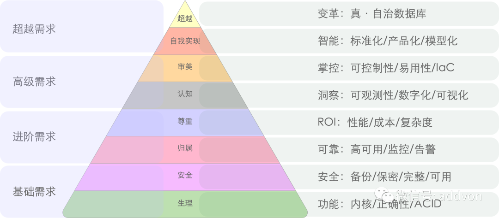

与马斯洛需求金字塔类似，用户对于数据库的需求也有着一个递进的层次。用户对于数据库的需求从下往上可以分为八个层次，分别与人的八个需求层次相对应：

- [生理需求](#生理需求)，功能：内核/正确性/ACID
- [安全需求](#安全需求)，安全：备份/保密/完整/可用
- [归属需求](#归属需求)，可靠：高可用/监控/告警
- [尊重需求](#尊重需求)，ROI：性能/成本/复杂度
- [认知需求](#认知需求)，洞察：可观测性/数字化/可视化
- [审美需求](#审美需求)，掌控：可控制性/易用性/IaC
- [自我实现](#自我实现)，智能：标准化/产品化/智能化
- [超越需求](#超越需求)，变革：真·自治数据库

[](https://mp.weixin.qq.com/s/1xR92Z67kvvj2_NpUMie1Q)

安全需求与生理需求同属**基础需求**，一个用于生产环境的严肃数据库系统至少应当满足这两类需求，才足以称得上是**合格**。归属需求与尊重需求同属**进阶需求**，满足这两类需求，可以称得上是**体面**。认知需求与审美需求属于**高级需求**，满足这两类需求，方能配得上 **品味** 二字。

在自我实现与**超越需求**上，不同种类的用户可能会有不同的需求，比如普通工程师的超越需求可能是升职加薪，搞出成绩赚大钱；而头部用户关注的可能是意义、创新与行业变革。

**但是在基础需求与进阶需求上，所有类型的用户几乎是高度一致的。**


------

## 生理需求

生理需求是级别最低、最急迫的需求，如：食物、水、空气、睡眠。

对于数据库用户来说，生理需求指的是**功能**：

- **内核特性：**数据库内核的特性是否满足需求？
- **正确性**：功能是否正确实现，没有显著缺陷？
- **ACID**：是否支持确保正确性的核心功能— 事务？

对于数据库来说，**功能需求**就是最基础的生理需求。正确性与 ACID 是数据库最基本的要求：诚然一些不甚重要的数据与边缘系统，可以使用更灵活的数据模型，NoSQL数据库，KV存储。但对于关键核心数据来说经典 ACID 关系型数据库的地位仍然是无可取代的。此外，如果用户需要的就是 PostGIS 处理地理空间数据的能力，或者TimescaleDB 处理时序数据的能力，那么没有这些特性的数据库内核就会被一票否决。


------

## 安全需求

安全需求同样属于基础层面的需求，其中包括对人身安全、生活稳定以及免遭痛苦、威胁或疾病、身体健康以及有自己的财产等与自身安全感有关的事情。

对于数据库来说，安全需求包括：

- **机密**：避免未授权的访问，数据不泄漏，不被拖库
- **完整**：数据不丢不错不漏，即使误删了也有办法找回来。
- **可用**：可以稳定提供服务，出了故障也有办法及时恢复回来。

安全需求无论对于数据库还是人类都是至关重要的。数据库如果丢了，被拖库了，或者数据错乱了，一些企业可能就直接破产了。满足安全需求意味着数据库有了兜底，有了灾难生存能力。冷备份，WAL归档，异地备份仓库，访问控制，流量加密，身份认证，这些技术用于满足安全需求。

安全需求与生理需求同属**基础需求**，一个用于生产环境的严肃数据库系统至少应当满足这两类需求，才足以称得上是**合格**。


------

## 归属需求

爱和归属的需求（常称为“社交需求”）属于进阶需求，如：对友谊，爱情以及隶属关系的需求。

对于数据库来说，社交需求意味着：

- 监控：有人会关注着数据库健康，监控诸如心率、血氧等核心生理指标。
- 告警：而当数据库出现问题时，指标异常时，会有人接到通知来及时处理。
- 高可用：主库不再单打独斗，拥有了自己的追随者分担工作并在故障时能接管工作。

对数据库可靠性的需求，可以与人类对于爱和归属的需求相类比。归属意味着数据库是有人关心，有人照看着，有人支持着的。监控负责感知环境收集数据库指标，而告警组件将异常现象问题及时上抛给人类处理。多物理从库副本+自动故障切换实现高可用架构的数据库，甚至软件自身便足以检测判定应对很多常见的故障。

归属需求属于**进阶需求**，当基础需求（功能/安全）得到满足后，用户会开始对监控告警高可用产生需求。一个体面的数据库服务，监控告警高可用是必不可少的。


------

## 尊重需求

尊重需求是指人们对自己的尊重和自信，以及希望获得他人的尊重的需求，属于进阶层面的需求。对于数据库来说，尊重需求主要包括：

- 性能：能够支撑高并发、大规模数据处理等高性能场景。
- 成本：具有合理的价格和成本控制。
- 复杂度：易于使用和管理，不会带来过多的复杂度。

对于数据库来说，安全可靠是本分，物美价廉才能出彩。数据库产品的 ROI 对应于人的尊重需求。正所谓：性价比是第一产品力，**更强力、更便宜、更好用**是三个核心诉求：更高的 ROI 意味着数据库以更低的财务代价与复杂度代价实现更优秀的性能表现。任何开创性的特色功能与设计，说到底也是通过提高 ROI 来赢得真正的赞誉与尊重的。

归属需求与尊重需求同属**进阶需求**，一个数据库系统只有满足这两类需求，才足以称得上是**体面**。满足了基础需求与进阶需求的用户，则会开始产生更高层次的需求：认知与审美。


------

## 认知需求

认知需求是指人们对于知识、理解和掌握新技能的需求，属于进阶层面的需求。对于数据库来说，认知需求主要包括：

- **可观测性**：能够对数据库与相关系统内部运行状态进行观测，做到全知。
- **可视化**：将数据通过图表等方式进行可视化展示，揭示内在联系，提供洞察。
- **数字化**：使用数据作为决策依据，使用标准化决策过程而非老师傅拍脑袋。

人要进步发展须进行自省，而认知需求对于数据库也一样重要：归属需求中的“监控“只关注数据库的基本生存状态，而认知需求关注的是对数据库与环境的**理解与洞察**。现代可观测性技术栈将收集丰富的监控指标并进行可视化呈现，而 DBA / 研发 / 运维 / 数据分析 人员则会从数据与可视化中提取洞察，形成对系统的理解与认知。

**没有观测就谈不上控制**，**可观测是为了可控制，全知即全能**。只有对数据库有了深入的认知，才可以真正做到收放自如，随心所欲不逾矩。


------

## 审美需求

审美需求是指人们对于美的需求，包括审美体验、审美评价和审美创造。对于数据库来说，审美需求主要包括：

- **可控制性**：用户的意志可以被数据库系统贯彻执行。
- **易用性**：友好的界面接口工具，最小化人工操作。
- **IaC**：基础设施即代码，使用声明式配置描述环境。

对于数据库来说，审美需求意味着更高级的**掌控能力**：简单易用的接口，高度自动化的实现，精细的定制选项，以及声明式的管理哲学。

**高度可控**，简单易用的数据库，才是有品味的数据库。**可控制性**是**可观测性**的对偶概念，指：是否可以通过一些允许的程序让系统调整到其状态空间内的任何一个状态。传统的运维方式关注**过程**，要创建/销毁/扩缩容数据库集群，用户需要按照手册依次执行各种命令；而现代管理方式关注**状态**，用户声明式的表达自己想要什么，而系统自动调整至用户所描述的状态。

**洞察**与**掌控**求属于**高级需求**，满足这两类需求的数据库系统，才足以称得上 **品味**。而这两者，也是满足更高**超越**层面需求的基石。


------

## 自我实现

自我实现（Self-actualization）是指人们追求最高水平的自我实现和个人成长的需求，属于超越层面的需求。对于数据库来说，自我实现需求主要包括：

- **标准化**：将各类操作沉淀为 SOP ，沉淀故障文档应急预案与制度最佳实践，量产DBA。
- **产品化**：将用好/管好数据库的经验沉淀转化为可批量复制的工具、产品与服务。
- **智能化**：范式转变，沉淀出领域特定的模型，完成人到软件的转变与飞跃。

数据库的自我实现与人类似：**繁衍**与**进化**。为了持续存在，数据库需要“繁衍”扩大存在规模，这需要的是标准化与产品化，而不是一个接一个的项目。关系数据库内核功能标准化已经有SQL作为标准，然而使用数据库的方法与管理数据库的人还差的很远：更多依赖的是老师傅的直觉与经验。以 GPT4 为代表的大模型，揭示了由 AI 替代专家（领域模型）的可能性，Soon or Later，一定会演进出现模型化的DBA，实现感知-决策-执行三个层面的彻底自动化。


------

## 超越需求

超越需求（Self-transcendence）是指人们追求更高层次的价值和意义的需求，属于最高层面的需求。对于数据库来说，这也许意味着 一个几乎不需要人参与的**真·自治数据库系统**

前面的所有需求都得到满足时，超越需求会出现。想要做到真正的数据库自治，前提就是感知、思考、执行三个部分的自动化与智能化。认知层次的需求解决“信息系统”，负责感知职能；审美层次的需求解决“行动系统”，负责实施控制；而自我实现层次解决“模型系统”，负责做出决策。

这也可也说是数据库领域的圣杯与终极目标之一了。


------

## 然后呢？

理论模型可以帮助我们对数据系统/发行版/管控软件/云服务进行更深刻的评价与对比。比如：大部分土法自建的数据库可能还在生理需求和安全需求上挣扎，属于不合格残次品。云数据库基本属于能满足下三层功能安全可靠需求的合格品，但是在 ROI / 价格上就不太体面（参阅《[云数据库是不是杀猪盘](http://mp.weixin.qq.com/s?__biz=MzU5ODAyNTM5Ng==&mid=2247485292&idx=1&sn=4f650c3f5c3fb5207c55ff67e44d7d8a&chksm=fe4b32b7c93cbba190e60d477061d19a165e1f9b074beb00b132ae1369a9fd2c7d10ed77a013&scene=21#wechat_redirect)》）。顶级资深数据库专家自建，可以满足更高层次的需求，但实在是太过金贵，供不应求。最后还得是广告时间：

虽然我是 Pigsty 的作者，但我更是一个资深的甲方用户。我做这个东西的原因正是因为市面上没有足够好的能满足 L4 L5 感知/管控需求的数据库产品或服务，所以才自己动手撸了一个。**开源 RDS 替代 [Pigsty](http://mp.weixin.qq.com/s?__biz=MzU5ODAyNTM5Ng==&mid=2247485327&idx=1&sn=0d02f5e504266e5dd436c64d23844735&chksm=fe4b3254c93cbb427598322952d654c3383bfe8858ec7ffaee2b9ca0c84bebe6f763748a356f&scene=21#wechat_redirect) + IDC/云服务器自建**，在满足上述需求的前提下，还可以覆盖认知、审美与少部分自我实现的需求。让你的数据库坚如磐石，辅助自动驾驶，更离谱的是开源免费，ROI 上吊打一切云数据库，如果你会用到 PGSQL, (以及REDIS, ETCD, MINIO, 或者 Prometheus/Grafana全家桶)， 那还不赶紧试试？http://demo.pigsty.cc

最近发布了 Pigsty 2.0.1 版本，使用以下命令一键安装。

```
curl -fsSL https://repo.pigsty.io/get | bash
```